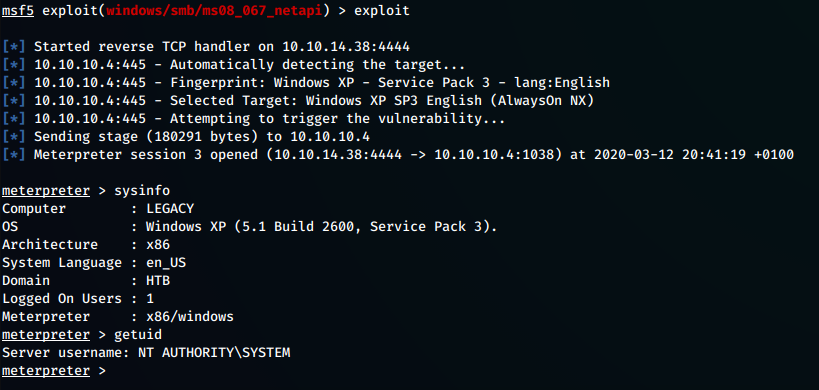

---
Category:
  - B2R
Difficulty: Easy
Platform: HackTheBox
Status: 3. Complete
tags:
  - MS08-067
  - RCE
  - Windows
---
# Information Gathering

Scanned all TCP ports:

```bash
PORT    STATE SERVICE      VERSION
139/tcp open  netbios-ssn  Microsoft Windows netbios-ssn
137/udp open  netbios-ns
445/tcp open  microsoft-ds Microsoft Windows XP microsoft-ds
Warning: OSScan results may be unreliable because we could not find at least 1 open and 1 closed port
Device type: general purpose
Running: Microsoft Windows XP|7|2012
OS CPE: cpe:/o:microsoft:windows_xp::sp3 cpe:/o:microsoft:windows_7 cpe:/o:microsoft:windows_server_2012
OS details: Microsoft Windows XP SP3, Microsoft Windows XP SP3 or Windows 7 or Windows Server 2012
Network Distance: 2 hops
Service Info: OSs: Windows, Windows XP; CPE: cpe:/o:microsoft:windows, cpe:/o:microsoft:windows_xp
```

# Enumeration

## Port 139 & Port 445 - NetBIOS & SMB

```bash
root@kali:~/ownCloud/Documents/CTF/HTB/Machine/Legacy# enum4linux 10.10.10.4
Starting enum4linux v0.8.9 ( http://labs.portcullis.co.uk/application/enum4linux/ ) on Thu Mar 12 11:59:25 2020

 ========================== 
|    Target Information    |
 ========================== 
Target ........... 10.10.10.4
RID Range ........ 500-550,1000-1050
Username ......... ''
Password ......... ''
Known Usernames .. administrator, guest, krbtgt, domain admins, root, bin, none

 ================================================== 
|    Enumerating Workgroup/Domain on 10.10.10.4    |
 ================================================== 
[+] Got domain/workgroup name: HTB

 ========================================== 
|    Nbtstat Information for 10.10.10.4    |
 ========================================== 
Looking up status of 10.10.10.4
	LEGACY          <00> -         B <ACTIVE>  Workstation Service
	HTB             <00> - <GROUP> B <ACTIVE>  Domain/Workgroup Name
	LEGACY          <20> -         B <ACTIVE>  File Server Service
	HTB             <1e> - <GROUP> B <ACTIVE>  Browser Service Elections
	HTB             <1d> -         B <ACTIVE>  Master Browser
	..__MSBROWSE__. <01> - <GROUP> B <ACTIVE>  Master Browser

	MAC Address = 00-50-56-B9-28-22

 =================================== 
|    Session Check on 10.10.10.4    |
 =================================== 
[E] Server doesn't allow session using username '', password ''.  Aborting remainder of tests.
```

```bash
Host script results:
| smb-enum-shares: 
|   note: ERROR: Enumerating shares failed, guessing at common ones (NT_STATUS_ACCESS_DENIED)
|   account_used: <blank>
|   \\10.10.10.4\ADMIN$: 
|     warning: Couldn't get details for share: NT_STATUS_ACCESS_DENIED
|     Anonymous access: <none>
|   \\10.10.10.4\C$: 
|     warning: Couldn't get details for share: NT_STATUS_ACCESS_DENIED
|     Anonymous access: <none>
|   \\10.10.10.4\IPC$: 
|     warning: Couldn't get details for share: NT_STATUS_ACCESS_DENIED
|_    Anonymous access: READ

Host script results:
| smb-vuln-ms08-067: 
|   VULNERABLE:
|   Microsoft Windows system vulnerable to remote code execution (MS08-067)
|     State: VULNERABLE
|     IDs:  CVE:CVE-2008-4250
|           The Server service in Microsoft Windows 2000 SP4, XP SP2 and SP3, Server 2003 SP1 and SP2,
|           Vista Gold and SP1, Server 2008, and 7 Pre-Beta allows remote attackers to execute arbitrary
|           code via a crafted RPC request that triggers the overflow during path canonicalization.
|           
|     Disclosure date: 2008-10-23
|     References:
|       https://technet.microsoft.com/en-us/library/security/ms08-067.aspx
|_      https://cve.mitre.org/cgi-bin/cvename.cgi?name=CVE-2008-4250
|_smb-vuln-ms10-054: ERROR: Script execution failed (use -d to debug)
|_smb-vuln-ms10-061: ERROR: Script execution failed (use -d to debug)
| smb-vuln-ms17-010: 
|   VULNERABLE:
|   Remote Code Execution vulnerability in Microsoft SMBv1 servers (ms17-010)
|     State: VULNERABLE
|     IDs:  CVE:CVE-2017-0143
|     Risk factor: HIGH
|       A critical remote code execution vulnerability exists in Microsoft SMBv1
|        servers (ms17-010).
|           
|     Disclosure date: 2017-03-14
|     References:
|       https://technet.microsoft.com/en-us/library/security/ms17-010.aspx
|       https://blogs.technet.microsoft.com/msrc/2017/05/12/customer-guidance-for-wannacrypt-attacks/
|_      https://cve.mitre.org/cgi-bin/cvename.cgi?name=CVE-2017-0143
```

# Exploitation

## smb-vuln-ms08-067 - MS08-067 (CVE-2008-4250)




# Trophy

>[!quote]
>Hacking is fun if you're a Hacker.
>
>\- Anonymous

>[!success]
>**User.txt**
>e69af0e4f443de7e36876fda4ec7644f

>[!success]
>**Root.txt**
>993442d258b0e0ec917cae9e695d5713

