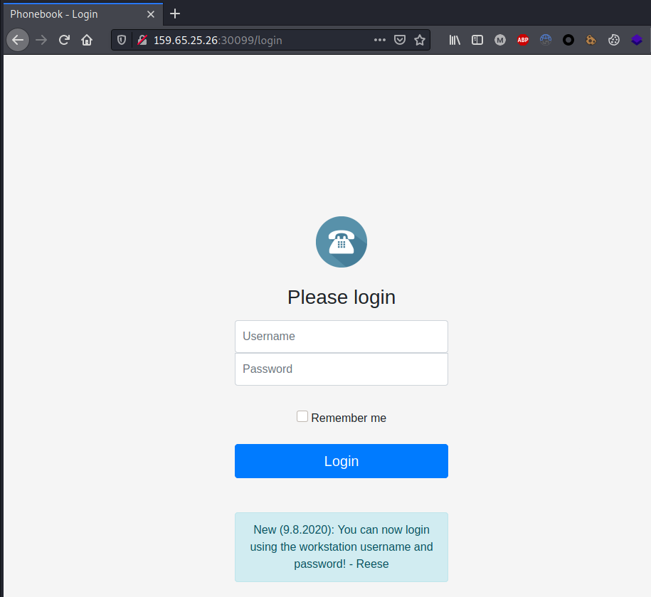
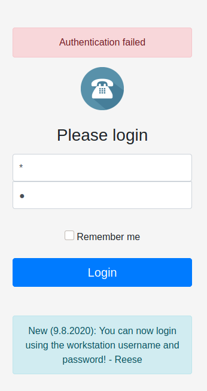
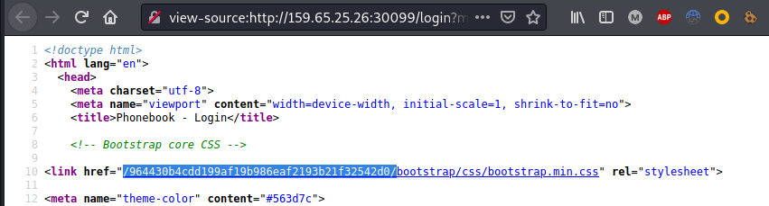
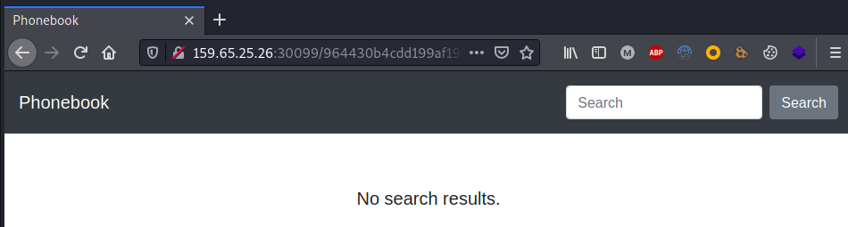
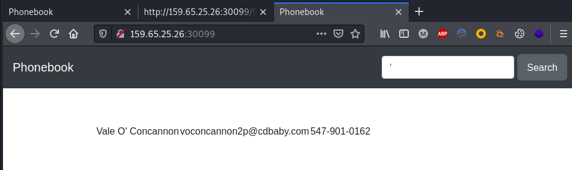
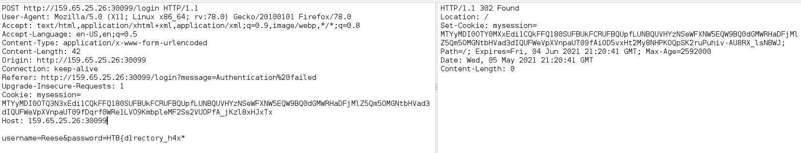
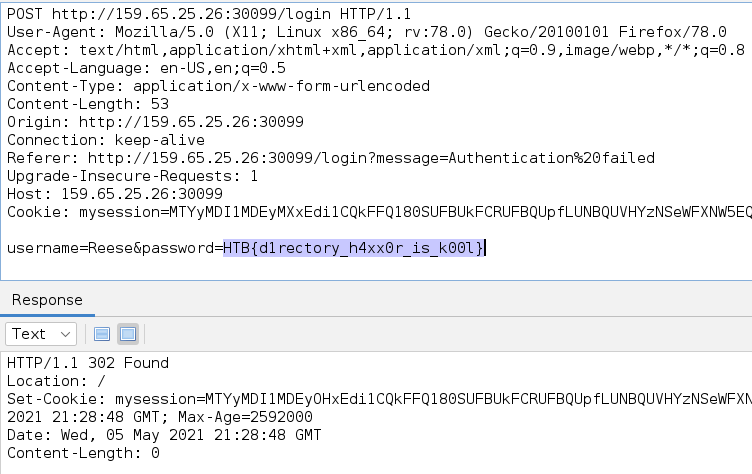

>[!quote]
> *Who is lucky enough to be included in the phonebook?*

# Set up

-

# Information Gathering

Home page:

Authentication bypass using `*`:`*`

Hidden folder:

User disclosed containing a `'`

# The Bug

Because the login form is vulnerable to “SQL Injection” using the `*` wildcard, it is possible to brute-force the credentials for the disclosed user.

# Exploitation

# Flag

>[!success]
>`HTB{d1rectory_h4xx0r_is_k00l}`

