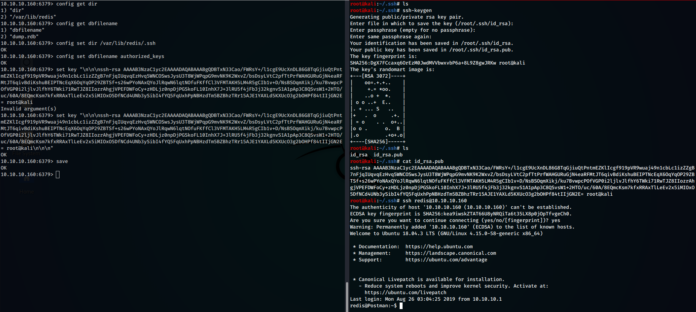
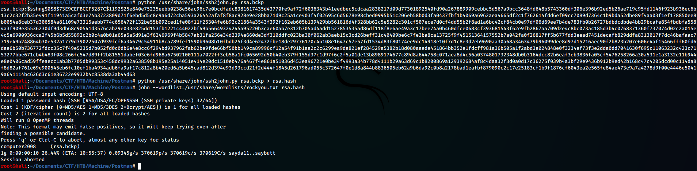
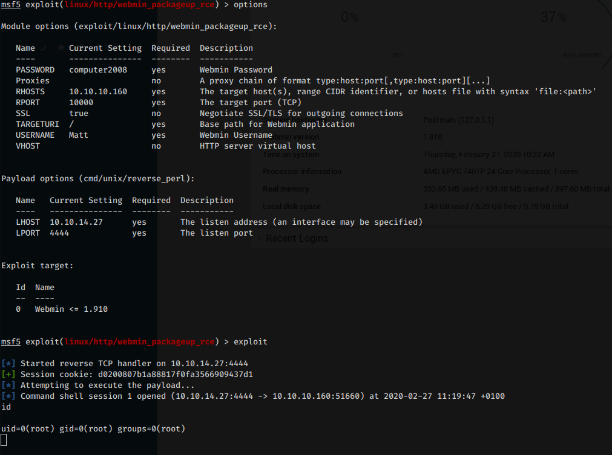

---
Category:
  - B2R
Difficulty: Easy
Platform: HackTheBox
Status: 3. Complete
tags:
  - CVE-2019-12840
  - RCE
  - miniserv
  - redis
  - ssh-keys-cracking
  - webmin
  - Linux
---
## Improved ability

- Redis exploitation
- SSH keys cracking
- Webmin exploitation

## Used tools

- nmap
- LinEnum.sh
- ssh2john
- john
- metasploit

---

# Introduction & Foothold

As always, let’s start scanning the box with **nmap**

```bash
$ nmap -sV -O -A -p 1-10000 --script=banner -o nmap.txt 10.10.10.160
# Nmap 7.80 scan initiated Wed Feb 26 21:38:20 2020 as: nmap -sV -O -A -p 1-10000 --script=banner -o nmap.txt 10.10.10.160
Nmap scan report for 10.10.10.160
Host is up (0.047s latency).
Not shown: 9996 closed ports
PORT      STATE SERVICE VERSION
22/tcp    open  ssh     OpenSSH 7.6p1 Ubuntu 4ubuntu0.3 (Ubuntu Linux; protocol 2.0)
|_banner: SSH-2.0-OpenSSH_7.6p1 Ubuntu-4ubuntu0.3
80/tcp    open  http    Apache httpd 2.4.29 ((Ubuntu))
|_http-server-header: Apache/2.4.29 (Ubuntu)
6379/tcp  open  redis   Redis key-value store 4.0.9
10000/tcp open  http    MiniServ 1.910 (Webmin httpd)
No exact OS matches for host (If you know what OS is running on it, see https://nmap.org/submit/ ).
TCP/IP fingerprint:
OS:SCAN(V=7.80%E=4%D=2/26%OT=22%CT=1%CU=38345%PV=Y%DS=2%DC=T%G=Y%TM=5E56D77
OS:5%P=x86_64-pc-linux-gnu)SEQ(SP=104%GCD=1%ISR=106%TI=Z%CI=Z%II=I%TS=A)OPS
OS:(O1=M54DST11NW7%O2=M54DST11NW7%O3=M54DNNT11NW7%O4=M54DST11NW7%O5=M54DST1
OS:1NW7%O6=M54DST11)WIN(W1=7120%W2=7120%W3=7120%W4=7120%W5=7120%W6=7120)ECN
OS:(R=Y%DF=Y%T=40%W=7210%O=M54DNNSNW7%CC=Y%Q=)T1(R=Y%DF=Y%T=40%S=O%A=S+%F=A
OS:S%RD=0%Q=)T2(R=N)T3(R=N)T4(R=Y%DF=Y%T=40%W=0%S=A%A=Z%F=R%O=%RD=0%Q=)T5(R
OS:=Y%DF=Y%T=40%W=0%S=Z%A=S+%F=AR%O=%RD=0%Q=)T6(R=Y%DF=Y%T=40%W=0%S=A%A=Z%F
OS:=R%O=%RD=0%Q=)T7(R=Y%DF=Y%T=40%W=0%S=Z%A=S+%F=AR%O=%RD=0%Q=)U1(R=Y%DF=N%
OS:T=40%IPL=164%UN=0%RIPL=G%RID=G%RIPCK=G%RUCK=G%RUD=G)IE(R=Y%DFI=N%T=40%CD
OS:=S)

Network Distance: 2 hops
Service Info: OS: Linux; CPE: cpe:/o:linux:linux_kernel

TRACEROUTE (using port 110/tcp)
HOP RTT      ADDRESS
1   46.46 ms 10.10.14.1
2   46.53 ms 10.10.10.160

OS and Service detection performed. Please report any incorrect results at https://nmap.org/submit/ .
# Nmap done at Wed Feb 26 21:39:17 2020 -- 1 IP address (1 host up) scanned in 57.09 seconds
```

We can notice the presence of four open ports: two web server on the numbers 80 and 1000 and a **Redis** daemon on the number 6379.

Enumerating the two web services, we discovered that for this specific version of **MiniServ** multiple authenticated exploits exists… they could come in handy later.

About Redis, we can enumerate the service through some **NSE scripts**, however without getting anything useful except the specific Linux box version (*Linux 4.15.0-58-generic x86_64*)

```bash
$ nmap --script redis-info -sV -p 6379 10.10.10.160
Starting Nmap 7.80 ( https://nmap.org ) at 2020-02-26 22:20 CET
Nmap scan report for 10.10.10.160
Host is up (0.047s latency).

PORT     STATE SERVICE VERSION
6379/tcp open  redis   Redis key-value store 4.0.9 (64 bits)
| redis-info:
|   Version: 4.0.9
|   Operating System: Linux 4.15.0-58-generic x86_64
|   Architecture: 64 bits
|   Process ID: 608
|   Used CPU (sys): 81.29
|   Used CPU (user): 27.25
|   Connected clients: 2
|   Connected slaves: 0
|   Used memory: 840.94K
|   Role: master
|   Bind addresses:
|     0.0.0.0
|     ::1
|   Client connections:
|     10.10.14.12
|_    10.10.14.27
```

About [Redis](https://redis.io/documentation):

> Redis is an open source (BSD licensed), in-memory data structure store, used as a database, cache and message broker.
> 

In order to works properly, the program needs a specific user, who can read and write on physical memory … in short, a 100% working user. Because of that, *once we log into the service, we can read and write into the redis `/home` directory*, and because we know that the user has a valid shell and a valid home, **we can inject our personal SSH key** in order to gain access through SSH without knowing the right password.



First, I **generated a new pair of SSH key** with the `ssh-keygen` command, next, inside the redis home directory, I **created the** `/.ssh` **dir and the `authorized_keys` file**, inside of which I wrote my public SSH key. After those steps, finally I was able to login as redis user, without really know its password.

## Lateral movement to Matt

As always, upload and run **LinEnum.sh**

```bash
redis@Postman:/tmp$ ./LinEnum.sh

#########################################################
# Local Linux Enumeration & Privilege Escalation Script #
#########################################################
# www.rebootuser.com
# version 0.982

[-] Debug Info
[+] Thorough tests = Disabled

Scan started at:
Thu Feb 27 09:44:23 GMT 2020

### SYSTEM ##############################################
[-] Kernel information:
Linux Postman 4.15.0-58-generic #64-Ubuntu SMP Tue Aug 6 11:12:41 UTC 2019 x86_64 x86_64 x86_64 GNU/Linux

[-] Kernel information (continued):
Linux version 4.15.0-58-generic (buildd@lcy01-amd64-013) (gcc version 7.4.0 (Ubuntu 7.4.0-1ubuntu1~18.04.1)) #64-Ubuntu SMP Tue Aug 6 11:12:41 UTC 2019

[-] Specific release information:
DISTRIB_ID=Ubuntu
DISTRIB_RELEASE=18.04
DISTRIB_CODENAME=bionic
DISTRIB_DESCRIPTION="Ubuntu 18.04.3 LTS"
NAME="Ubuntu"
VERSION="18.04.3 LTS (Bionic Beaver)"
ID=ubuntu
ID_LIKE=debian
PRETTY_NAME="Ubuntu 18.04.3 LTS"
VERSION_ID="18.04"
HOME_URL="https://www.ubuntu.com/"
SUPPORT_URL="https://help.ubuntu.com/"
BUG_REPORT_URL="https://bugs.launchpad.net/ubuntu/"
PRIVACY_POLICY_URL="https://www.ubuntu.com/legal/terms-and-policies/privacy-policy"
VERSION_CODENAME=bionic
UBUNTU_CODENAME=bionic

[-] Hostname:
Postman

...

[-] Location and Permissions (if accessible) of .bak file(s):
-rwxr-xr-x 1 Matt Matt 1743 Aug 26  2019 /opt/id_rsa.bak
-rw------- 1 root root 695 Aug 25  2019 /var/backups/group.bak
-rw------- 1 root shadow 577 Aug 25  2019 /var/backups/gshadow.bak
-rw------- 1 root shadow 935 Aug 26  2019 /var/backups/shadow.bak
-rw------- 1 root root 1382 Aug 25  2019 /var/backups/passwd.bak

[-] Any interesting mail in /var/mail:
total 8
drwxrwsr-x  2 root mail 4096 Aug 24  2019 .
drwxr-xr-x 13 root root 4096 Aug 25  2019 ..

### SCAN COMPLETE ####################################
```

Among the thousands of lines of information returned by the tool, we notice immediately that **there is a publicly readable RSA-key’s backup file belonging to Matt**, the user of the machine. Extrapolate and bring it on our local machine in order to try to crack it.

In order to crack an SSH key, first we need to generate an hash from it. To achieve this tasks, we can use **ssh2john**. Next, after having generate the hash, we can crack it using **john**:



Gathered the password, try logging in via SSH with Matt user … but it does not work. Not a problem, because the same password is valid for switching to the Matt user with the **su** command.

## Privilege Escalation

The privilege escalation process can be achieved easily with **Metasploit**.

During the enumeration phase we found an **authenticated Remote Command Execution exploit** fitting the targeted Webmin version:

[metasploit-framework/webmin_packageup_rce.md at master · rapid7/metasploit-framework](https://github.com/rapid7/metasploit-framework/blob/master/documentation/modules/exploit/linux/http/webmin_packageup_rce.md)

>[!info]
> This module exploits an arbitrary command execution vulnerability in Webmin 1.910 and lower versions. Any user authorized to the “Package Updates” module can execute arbitrary commands with root privileges via the data parameter to update.cgi.

So let’s load the module, compile the appropriate fields and execute the exploit. What we will get is a shell with root permissions



# Trophy

>[!quote]
>A hacker does for love what others would not do for money.
>
>\- Laura Creighton

