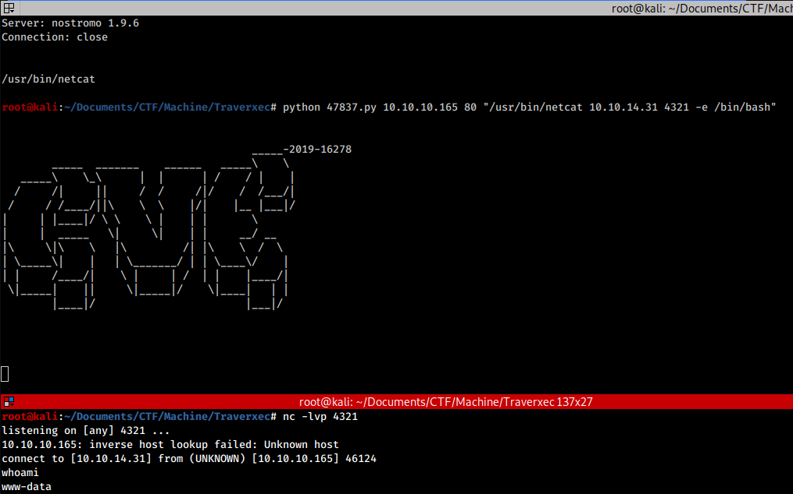
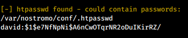
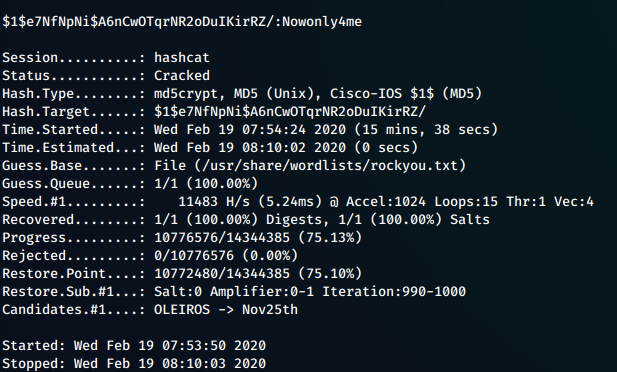
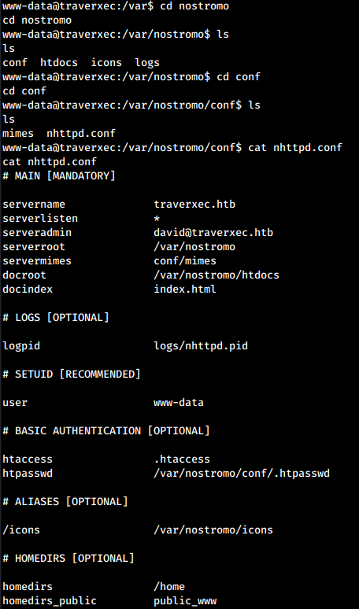
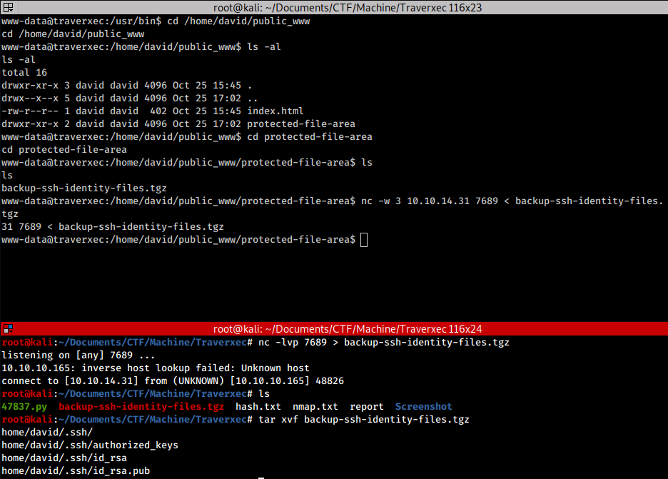
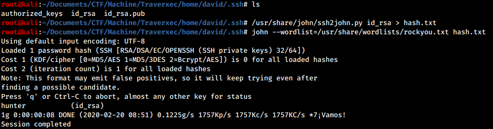
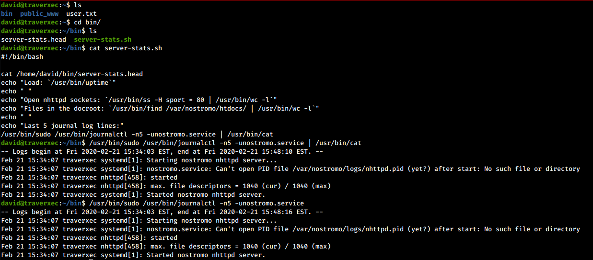
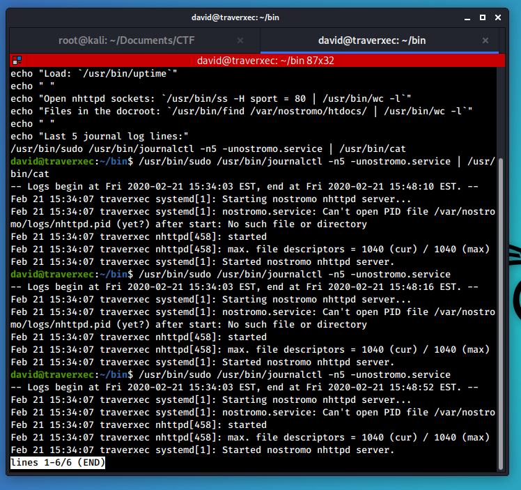
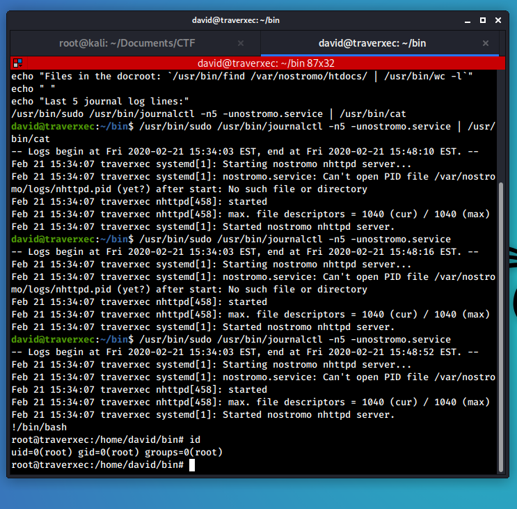

### Improved skills:

- nostromo exploitation
- SSH keys cracking
- GTFObins

### Used tools:

- nmap
- searchsploit
- LinEnum.sh
- hashcat
- ssh2john
- john

---

## Introduction & Foothold

Let’s start to scan the box with **nmap**

```bash
$ nmap -O -A -sV --script=banner -oN nmap.txt 10.10.10.165
# Nmap 7.80 scan initiated Tue Feb 18 22:09:54 2020 as: nmap -O -A -sV --script=banner -oN nmap.txt 10.10.10.165
Nmap scan report for 10.10.10.165
Host is up (0.049s latency).
Not shown: 998 filtered ports
PORT   STATE SERVICE VERSION
22/tcp open  ssh     OpenSSH 7.9p1 Debian 10+deb10u1 (protocol 2.0)
|_banner: SSH-2.0-OpenSSH_7.9p1 Debian-10+deb10u1
80/tcp open  http    nostromo 1.9.6
|_http-server-header: nostromo 1.9.6
Warning: OSScan results may be unreliable because we could not find at least 1 open and 1 closed port
Aggressive OS guesses: Linux 3.10 - 4.11 (92%), Linux 3.18 (92%), Linux 3.2 - 4.9 (92%), Crestron XPanel control system (90%), Linux 3.16 (89%), ASUS RT-N56U WAP (Linux 3.4) (87%), Linux 3.1 (87%), Linux 3.2 (87%), HP P2000 G3 NAS device (87%), AXIS 210A or 211 Network Camera (Linux 2.6.17) (87%)
No exact OS matches for host (test conditions non-ideal).
Network Distance: 2 hops
Service Info: OS: Linux; CPE: cpe:/o:linux:linux_kernel

TRACEROUTE (using port 80/tcp)
HOP RTT      ADDRESS
1   48.90 ms 10.10.14.1
2   49.13 ms 10.10.10.165

OS and Service detection performed. Please report any incorrect results at [URL]https://nmap.org/submit/[/URL] .
# Nmap done at Tue Feb 18 22:10:25 2020 -- 1 IP address (1 host up) scanned in 31.98 seconds
```

From the output above we can notice that there are only two services running on the box: OpenSSH on port 22 and a **nostromo 1.9.6** running on the port 80.

Taking a look to the web site we notice that it is made up only by static-pages. This reduce our attack surface. However, a rapid search online reveals that this particular web server version is **vulnerable to an RCE** vulnerability (CVE-2019-16278) and a **public exploit exists.**

[Offensive Security's Exploit Database Archive](https://www.exploit-db.com/exploits/47837)

All we have to do is download the exploit, create a listening server with **netcat** and get our reverse shell



## Lateral movement to David

Now that we have a shell, we can take a look to which user the box has. We notice that the machine user is **david**.

To speed up the post exploitation process, we can upload on our target **LinEnum.sh** and run it. The tools reveals that it found a **password hash** saved in the nostromo backup file `/var/nostromo/conf/.htpasswd`.



We can try to crack it with **hashcat** while we perform some other recon.



After few minutes *hashcat* reveals that the hashed password was ***Nowonly4me***, however trying to use it around we find that it’s useless. **Rabbit hole!**

Browsing the configuration files of the web server some useful information come out from `/var/nostromo/conf/nhttpd`



From the configuration it seems that in `/home` directories may be present a `public_www` directory. Browsing the supposed folder not only we discover that it really exists, but also that inside it is contained an interesting folder called **protected-file-area**. Inside it we discovered a **backup archive** containing david SSH keys.



Now we have to crack them so let’s create the hash of the private key with **ssh2john** and after we get it, let’s crack it with **john**:



Well done, we have found david’s SSH password. Now we can login via SSH and proceeds with the privesc phase.

## Privilege Escalation

Taking a look at the david’s home directory we noticed the `bin` folder, which contains two files inside, one of which is a script.



We can see how the **journalctl** command is executed via **sudo**, and the result is then passed to the **cat** command to display it uniformly on the screen.

I have searched far and wide for the web for a possible exploit for journalctl, but without finding anything. After a few hours of research, I landed on a page called **GTFObins**, where there was talks about different method to perform privilege escalation through the program in question and many others. Here is the link to the page:

[journalctl | GTFOBins](https://gtfobins.github.io/gtfobins/journalctl/)

I quote what is said on the page:

> … This invokes the default pager, which is likely to be less, other functions may apply.

In simple words: to display the output of the command on the screen, the **journalctl** program uses the **less** command by default (for this reason, in the script it was then redirected to the **cat** command). However, this command “has a defect”: once executed, it waits for a command from a user.

In this situation, however, it is possible to escape from the less command. Since journalctl can be run with elevated privileges via the sudo command, using the feature of the less command it is possible to obtain a shell as root!



Now type `:!/bin/bash` and…



… obtain a root shell!

# Trophy

>[!quote]
>Everything is a copy of a copy of a copy.
>
>\- Chuck Palahniuk, Fight Club
