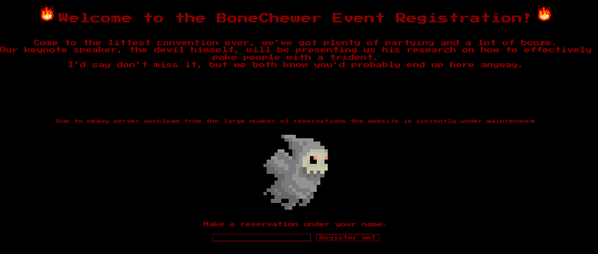
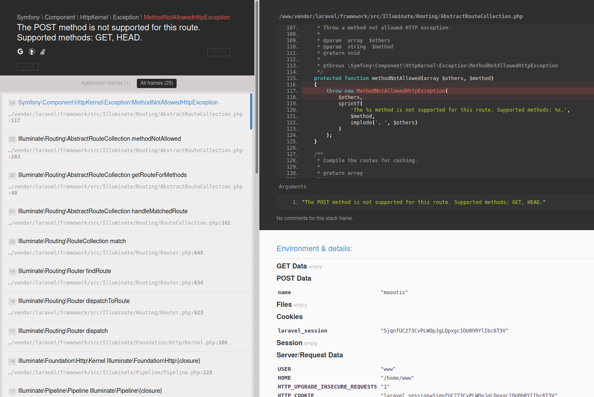
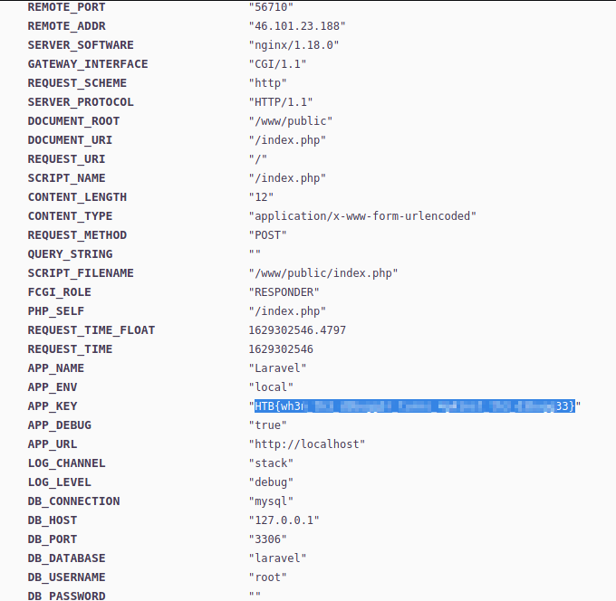

>[!quote]
> Due to heavy workload for the upcoming baby BoneChewerCon event, the website is under maintenance and it errors out, but the debugger is still enabled in production!! I think the devil is enticing us to go and check out the secret key.****

# Set up

# Information Gathering

After registration::

# The Bug

# Exploitation

# Flag

`HTB{wh3n_th3_d3bugg3r_turns_4g41nst_th3_d3bugg33}`
