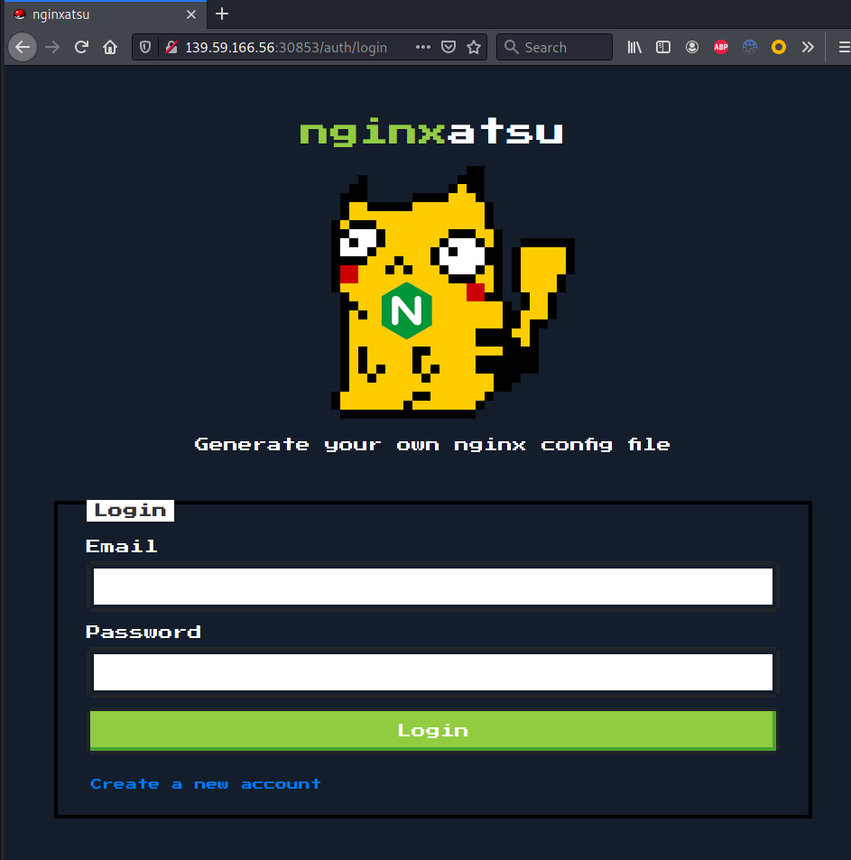
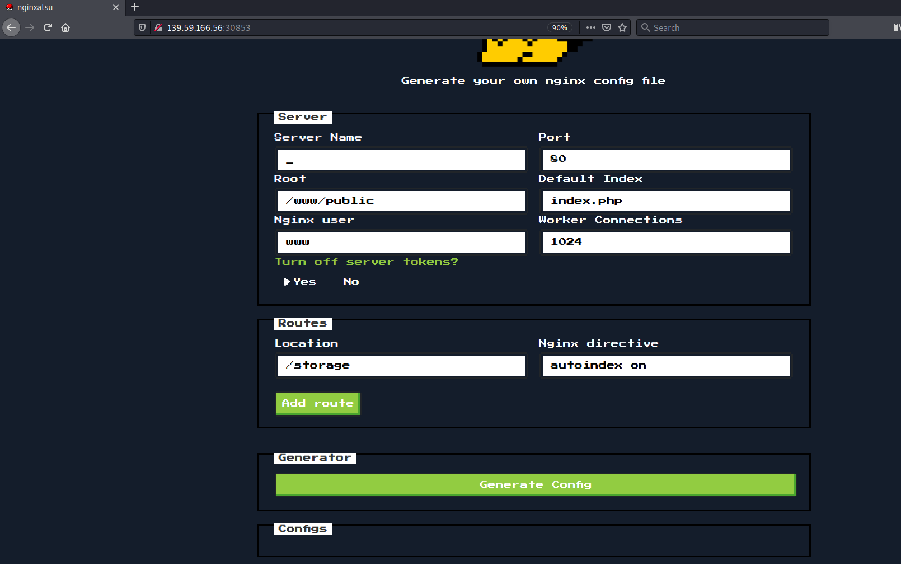
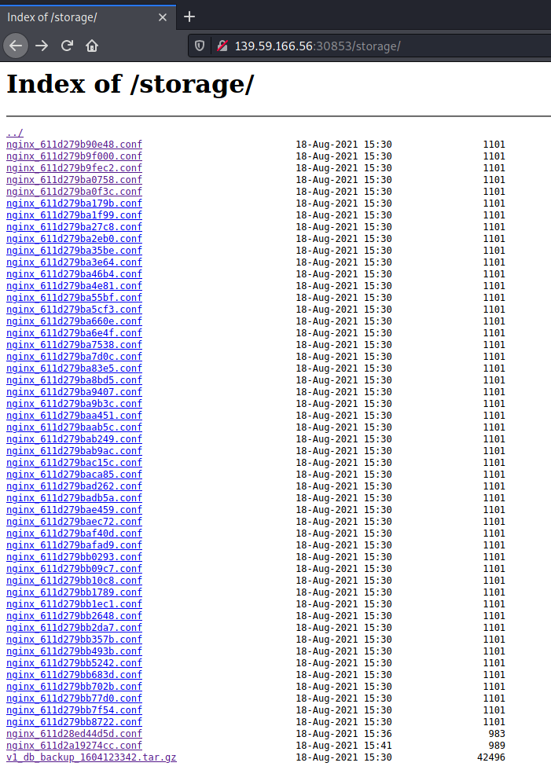
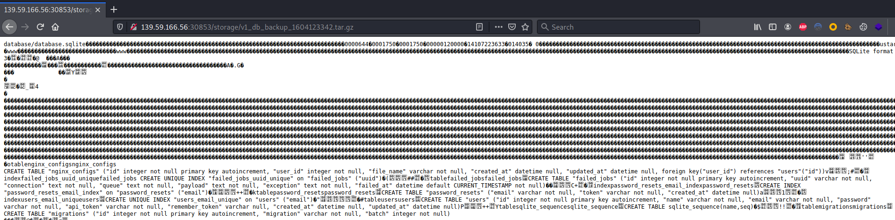
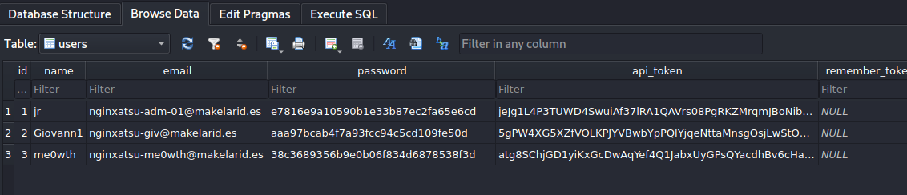
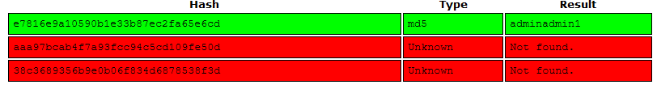
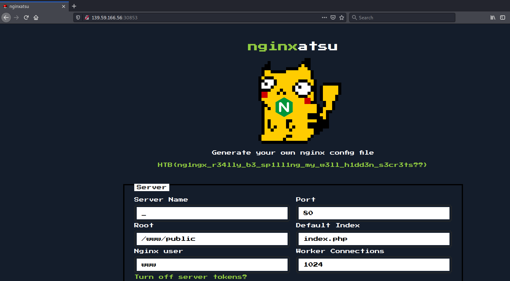

>[!quote]
> Can you find a way to login as the administrator of the website and free nginxatsu?****


# Set up

-

# Information Gathering



- register
- login







# Exploitation

```bash
┌──(kali㉿kali)-[~/CTFs/HTB/challenge/web]
└─$ gunzip v1_db_backup_1604123342.tar.gz

gzip: v1_db_backup_1604123342.tar.gz: not in gzip format

┌──(kali㉿kali)-[~/CTFs/HTB/challenge/web]
└─$ file v1_db_backup_1604123342.tar.gz
v1_db_backup_1604123342.tar.gz: POSIX tar archive (GNU)

┌──(kali㉿kali)-[~/CTFs/HTB/challenge/web]
└─$ tar xvf v1_db_backup_1604123342.tar.gz
database/database.sqlite

┌──(kali㉿kali)-[~/CTFs/HTB/challenge/web]
└─$ sqlitebrowser database/database.sqlite
```




```bash
nginxatsu-adm-01@makelarid.es	e7816e9a10590b1e33b87ec2fa65e6cd	adminadmin1
nginxatsu-giv@makelarid.es		aaa97bcab4f7a93fcc94c5cd109fe50d
nginxatsu-me0wth@makelarid.es	38c3689356b9e0b06f834d6878538f3d
```





# Flag

>[!success]
`HTB{ng1ngx_r34lly_b3_sp1ll1ng_my_w3ll_h1dd3n_s3cr3ts??}`